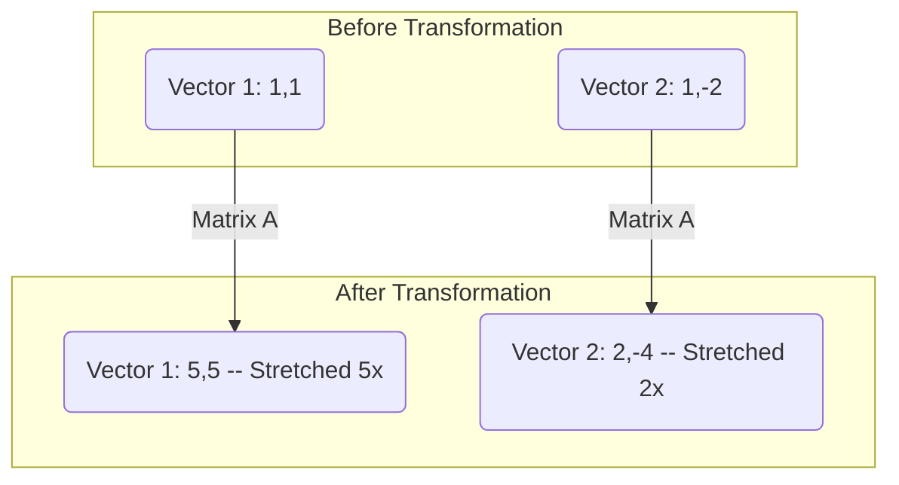

---
tags:
- field/math
- subject/linear-algebra
- concept/vectors
---

[[T.O.C (Root)|Up to Root]] (Wait, the link should be to the MOC)

[[ (MOC) - Linear Algebra | Up to Linear Algebra ]]

# Mathematics - Eigenvectors and Eigenvalues

## 1. The Intuition First

Imagine you have a rubber sheet with a drawing on it. If you grab the sheet and stretch it in various directions—perhaps pulling it more to the right than to the top, or shearing it sideways—most points on the sheet will move to new locations and most lines drawn from the center will point in new directions.

However, in almost every such "linear" transformation, there are a few special directions that **do not change**. If you drew a line in one of these directions before the stretch, the line might get longer or shorter (it might even flip and point the opposite way), but it will still lie on the exact same line it started on. 

- **The Eigenvector** is that "stay-put" direction. It is the characteristic axis of the transformation.
- **The Eigenvalue** is the factor by which that direction is stretched or squashed. If the eigenvalue is 2, the vector doubles in length. If it's 0.5, it shrinks by half. If it's -1, it flips 180 degrees but stays on the same line.

In short: Eigenvectors are the **backbone** of a transformation. They represent the "pure" actions (stretching/shrinking) that happen without the "messy" action (rotation).

---

## 2. Formal Definition

A non-zero vector $v \in V$ is an **eigenvector** of a linear transformation $T: V \to V$ (represented by a square matrix $A$) if applying the transformation only scales the vector.

$$
Av = \lambda v
$$

Where:
- $A$: An $n \times n$ square matrix (the transformation).
- $v$: The eigenvector. **Constraint:** $v \neq \mathbf{0}$ (the zero vector is excluded because it is trivially scaled by everything).
- $\lambda$: The **eigenvalue**, a scalar (real or complex) representing the scaling factor.

To find these, we rearrange the equation to $(A - \lambda I)v = 0$. For a non-zero $v$ to exist, the matrix $(A - \lambda I)$ must be singular, leading to the **characteristic equation**:
$$ \det(A - \lambda I) = 0 $$

---

## 3. Worked Example

Let's find the eigenvectors for the matrix $A = \begin{bmatrix} 4 & 1 \\ 2 & 3 \end{bmatrix}$.

**Step 1: Find the Eigenvalues**
We solve $\det(A - \lambda I) = 0$:
$$
\begin{vmatrix} 4-\lambda & 1 \\ 2 & 3-\lambda \end{vmatrix} = (4-\lambda)(3-\lambda) - (2)(1) = 0
$$
$$ \lambda^2 - 7\lambda + 12 - 2 = \lambda^2 - 7\lambda + 10 = 0 $$
Factoring gives $(\lambda - 5)(\lambda - 2) = 0$. So, our eigenvalues are **$\lambda_1 = 5$** and **$\lambda_2 = 2$**.

**Step 2: Find the Eigenvector for $\lambda_1 = 5$**
Substitute $\lambda = 5$ into $(A - \lambda I)v = 0$:
$$ \begin{bmatrix} 4-5 & 1 \\ 2 & 3-5 \end{bmatrix} \begin{bmatrix} x \\ y \end{bmatrix} = \begin{bmatrix} -1 & 1 \\ 2 & -2 \end{bmatrix} \begin{bmatrix} x \\ y \end{bmatrix} = \begin{bmatrix} 0 \\ 0 \end{bmatrix} $$
This gives the equation $-x + y = 0$, or $y = x$.
Any vector where $x=y$ is an eigenvector. A simple choice is **$v_1 = \begin{bmatrix} 1 \\ 1 \end{bmatrix}$**.

**Step 3: Find the Eigenvector for $\lambda_2 = 2$**
Substitute $\lambda = 2$:
$$ \begin{bmatrix} 4-2 & 1 \\ 2 & 3-2 \end{bmatrix} \begin{bmatrix} x \\ y \end{bmatrix} = \begin{bmatrix} 2 & 1 \\ 2 & 1 \end{bmatrix} \begin{bmatrix} x \\ y \end{bmatrix} = \begin{bmatrix} 0 \\ 0 \end{bmatrix} $$
This gives $2x + y = 0$, or $y = -2x$.
A simple choice is **$v_2 = \begin{bmatrix} 1 \\ -2 \end{bmatrix}$**.

---

## 4. Visual Representation

Imagine a 2D grid. 
1. The vector $v_1 = [1, 1]$ points diagonally up-right. After the transformation $A$, it becomes $[5, 5]$. It stayed on the same diagonal line but grew 5x longer.
2. The vector $v_2 = [1, -2]$ points down-right. After the transformation, it becomes $[2, -4]$. It stayed on the same line but grew 2x longer.
3. **Every other vector** in the 2D plane will be rotated. If you take the vector $[1, 0]$, $A[1, 0] = [4, 2]$. It was on the x-axis, but now it's pointing somewhere else. It is **not** an eigenvector.

---

## 5. Connections & Applications

Why does this matter? Because eigenvectors turn **matrix multiplication into scalar multiplication**.

1. **Google PageRank:** The internet is a giant matrix. Your "rank" is essentially your component in the dominant eigenvector of the web's link matrix.
2. **Principal Component Analysis (PCA):** In data science, if you have 100 variables, you want to know which "directions" hold the most information. Those directions are the eigenvectors of the data's covariance matrix.
3. **Facial Recognition (Eigenfaces):** Early facial recognition worked by treating images as vectors and finding the "eigenvectors" of a set of faces. Any face could then be described as a combination of these "base faces."
4. **Quantum Mechanics:** The state of a system is a vector, and "observables" (like energy) are matrices. The values you can actually measure are the eigenvalues of those matrices.

---

## 6. Common Pitfalls

- **The Zero Vector:** Students often list $\mathbf{0}$ as an eigenvector. By definition, an eigenvector must be non-zero. The eigenvalue $\lambda$ can be zero, but $v$ cannot.
- **Independence:** For an $n \times n$ matrix, you might expect $n$ eigenvectors. While often true, some matrices are "defective" and don't have enough linearly independent eigenvectors to span the space.
- **Order Matters:** Eigenvectors are always associated with a *specific* eigenvalue. You cannot mix and match them. $v_1$ belongs to $\lambda_1$ and only $\lambda_1$.