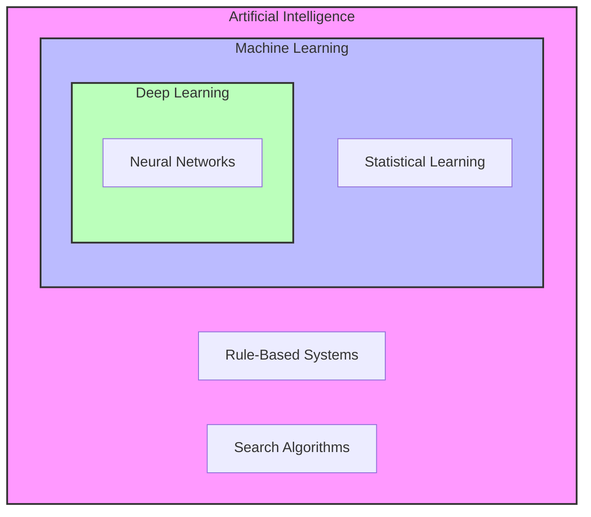

# AI vs ML vs DL

[[T.O.C (Artificial Intelligence Notes)|Up to AI Notes]]

## Overview
The terms AI, ML, and DL are often used interchangeably, but they represent a hierarchy of concepts.

## Gemini

### Detailed Explanation

**1. Artificial Intelligence (AI):**
The broadest concept. It is the umbrella term for any technique that enables computers to mimic human intelligence. It includes everything from simple "if-then" rule-based systems (Good Old-Fashioned AI or GOFAI) to complex neural networks.
*   *Example:* A non-player character (NPC) in a video game that follows a scripted path.

**2. Machine Learning (ML):**
A subset of AI. It refers to systems that can learn from data rather than being explicitly programmed for every rule. They use statistical methods to improve performance over time.
*   *Example:* A housing price predictor that finds the relationship between square footage and price by looking at 1,000 past sales.

**3. Deep Learning (DL):**
A subset of ML. It is based on **Artificial Neural Networks** with many layers (hence "Deep"). It attempts to simulate the behavior of the human brain—albeit far more simply—allowing it to "learn" from large amounts of data. It excels at perceptual tasks (vision, audio).
*   *Example:* Face ID on your iPhone. It learns the complex features of your face (geometry, texture) through a deep neural network.

### Comparison Table

| Feature | Artificial Intelligence (AI) | Machine Learning (ML) | Deep Learning (DL) |
| :--- | :--- | :--- | :--- |
| **Scope** | Broadest umbrella term. | Subset of AI. | Subset of ML. |
| **Data Requirement** | Can work with no data (rules) or some data. | Requires moderate amounts of data. | Requires huge amounts of big data. |
| **Human Intervention** | High (for rule-based systems). | Medium (Feature extraction often manual). | Low (Features learned automatically). |
| **Hardware** | Low requirements (CPU). | Moderate (CPU/GPU). | High performance (High-end GPUs/TPUs). |
| **Interpretability** | Easy (Logic is visible). | Moderate (Decision trees are clear, SVMs less so). | Hard ("Black Box" nature). |
| **Example** | Chess engine (Minimax algorithm). | Email Spam Filter. | Self-driving cars. |

### Visual Hierarchy

## Connections
- [[1.1.2 - 1.1.2 - What is AI]]
- [[1.1.6 - 1.1.6 - Types of Machine Learning]]
