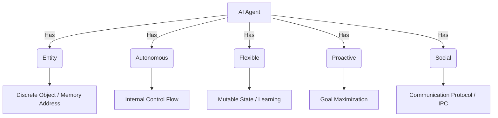
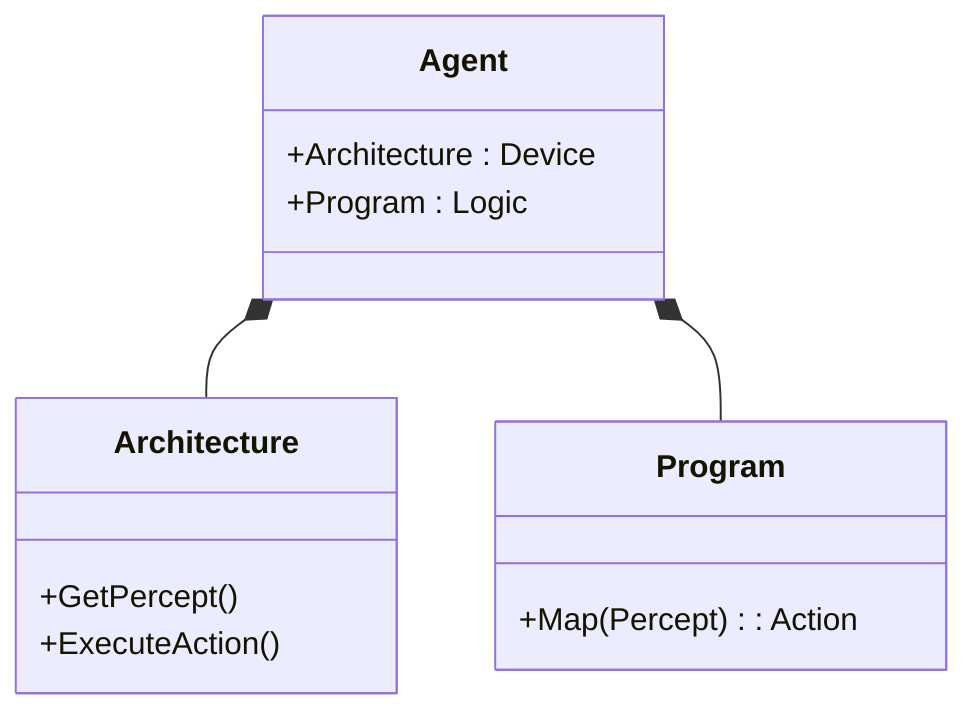
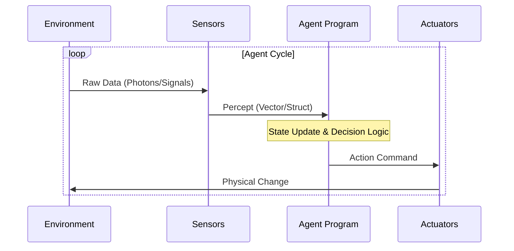
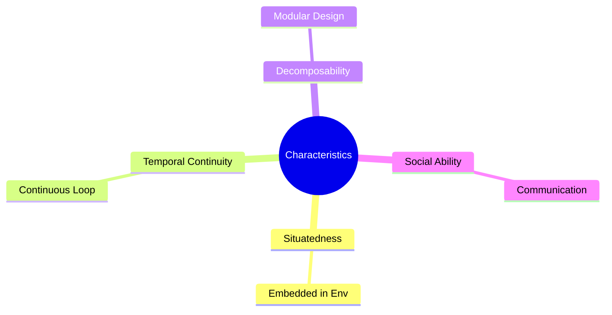

---
tags:
- field/cs
- subject/ai
- concept/ai/agents
---

	# Artificial Intelligence notes
## Agents
- Entity
- Autonomous but with pre defined restrictions
- flexible: meaning responsible as in adapts to changes
- Proactive: as a goal oriented approach to every thing
- Social: Social with either humans or other agents

> **Prompt:** "Explain in detail what an AI agent is."
> **Lens Applied:** The Kernel Architect

An **Agent** is any computational entity that perceives its environment through sensors and acts upon that environment through actuators. In formal terms, it is a function $f: P^* \rightarrow A$ that maps a history of percepts ($P^*$) to a single action ($A$).
*   **Sensors:** The input interface (e.g., Cameras, Keyboards, Network Packets).
*   **Actuators:** The output interface (e.g., Screens, Motors, API Calls).
*   **Environment:** The state space in which the agent operates.
> **Prompt:** "Explain these properties and characteristics of an AI agent..."
> **Lens Applied:** The Kernel Architect

*   **Entity:** A discrete unit of existence. In C++, this is an instantiated Object (instance of a class) with its own memory address (`this` pointer) and state variables, distinct from the global scope.
*   **Autonomous:** operates without direct external intervention. It manages its own internal state and control flow (Thread of Execution).
    *   *Example:* A Mars Rover deciding pathing without waiting 20 minutes for Earth command.
*   **Flexible (Adaptive):** The ability to modify internal weights or logic based on heuristic feedback. It is not hard-coded (`const`); it is mutable.
    *   *Example:* A spam filter learning new spam patterns over time.
*   **Proactive:** Goal-directed behavior. It doesn't just react (Interrupt Service Routine); it initiates (Main Loop). It has an objective function it seeks to maximize.
    *   *Example:* A chess bot planning 5 moves ahead, not just responding to the opponent.
*   **Social:** Inter-process communication (IPC) or Agent Communication Language (ACL).
    *   *Example:* Self-driving cars broadcasting velocity vectors to each other.


## Structure of an Agent
> **Prompt:** "Out of the two components comprising an agent..."
> **Lens Applied:** The Kernel Architect

Formally, **Agent = Architecture + Program**.
1.  **Architecture:** The physical or virtual computing device (Hardware + OS). It provides the `Percept` signals and accepts the `Action` commands.
2.  **Program:** The implementation of the agent function $f: P^* \rightarrow A$. The logic/algorithm running on the architecture.
> **Prompt:** "Generate a mermaid diagram for the two components..."
> **Lens Applied:** The Kernel Architect


### Architecture
> **Prompt:** "Explain in detail what exactly is the architecture..."
> **Lens Applied:** The Kernel Architect

The **Architecture** is the computing substrate. It makes the perceptions available to the program, runs the program, and feeds the program's action choices to the actuators.
*   **Low-Level View:** It defines the Instruction Set Architecture (ISA), the I/O ports, and the memory hierarchy.
*   **Example:** For a self-driving car, the architecture includes the LIDAR sensors, the NVIDIA Orin ECU, the Steering Actuators, and the CAN bus interface.
### Program
> **Prompt:** "Explain in detail what exactly is the program..."
> **Lens Applied:** The Kernel Architect

The **Agent Program** is the implementation of the decision-making logic.
*   **Internal View:** It takes the current percept as input. It may maintain an internal state (memory of past percepts). It returns an action.
*   **Pseudo-Code:**
    ```cpp
    Action AgentProgram(Percept p) {
        memory.update(p);
        State s = interpret(p, memory);
        Action a = choose_best_action(s);
        return a;
    }
    ```
*   **Example:** The Neural Network weights and inference engine in AlphaGo.
## Flow of an Agent
> **Prompt:** "Explain in detail the flow of execution of an agent..."
> **Lens Applied:** The Kernel Architect

The **Agent Loop** (Conceptually similar to a Game Loop or REPL):
1.  **Sensor Input:** Architecture captures raw data.
2.  **Perception:** Program converts raw data into an internal representation (Feature Extraction).
3.  **State Update:** Program updates its belief state based on new evidence.
4.  **Decision:** Program selects an Action (Policy lookup or Search).
5.  **Actuation:** Architecture executes the action on the environment.



An agent takes sensory inputs from it's environments and are treated as perceptions, then this agent takes intelligent decisions using the intelligence program. These actions are called outputs.
## Types of agents
> **Prompt:** "Explain these types of agents..."
> **Lens Applied:** The Kernel Architect

*   **Software Agents (Softbots):** Live in virtual environments (OS, Web).
    *   *Sensors:* Keystrokes, File System events, API responses.
    *   *Actuators:* Write files, send HTTP requests, display pixels.
    *   *Example:* A web crawler indexing pages.
*   **Human Agents:** Biological systems.
    *   *Sensors:* Eyes, ears, touch.
    *   *Actuators:* Hands, legs, vocal cords.
*   **Robotic Agents:** Physical systems in the real world.
    *   *Sensors:* Cameras, infrared, accelerometers.
    *   *Actuators:* Motors, servos, wheels.
    *   *Example:* Boston Dynamics Spot.
## Characteristics of an agent
> **Prompt:** "Characteristics of an agent..."
> **Lens Applied:** The Kernel Architect

*   **Situatedness:** The agent is embedded in an environment; it is not an abstract calculation.
*   **Temporal Continuity:** It operates continuously over time (a `while(true)` loop), not a one-off script.
*   **Decomposability:** Can be broken down into specialized modules (Vision, Planning, Control).


## Rationality
> **Prompt:** "Explain the concept of rationality..."
> **Lens Applied:** The Optimizationist

**Rationality** $\neq$ Omniscience. Rationality is maximizing the **Expected Utility**.
It depends on 4 factors (PEAS):
1.  **P**erformance Measure: The objective success criteria.
2.  **E**nvironment: The constraints and physics.
3.  **A**ctuators: What the agent *can* do.
4.  **S**ensors: What the agent *knows*.
## Rational agents
> **Prompt:** "Explain rational agents..."
> **Lens Applied:** The Optimizationist

A **Rational Agent** selects the action that is expected to maximize its performance measure, given the evidence provided by the percept sequence and whatever built-in knowledge the agent has.

A rational agent is one that does the right thing.
## Identification of rationality
> **Prompt:** "Identify if an Agent is rational..."
> **Lens Applied:** The Kernel Architect

Step-by-Step Logic:
1.  **Define the Metric:** What is the return type of the objective function? (e.g., Score, Efficiency).
2.  **Assess Knowledge:** check `Agent.knowledge_base` and `Current_Percept`.
3.  **Evaluate Action Space:** Iterate through all valid `Actions`.
4.  **Simulation:** For each action, predict the `Future_State`.
5.  **Verification:** Did the agent pick the action with `Max(Expected_Value)`? If yes $\rightarrow$ Rational.
## Fully observable vs Partially observable agents
> **Prompt:** "Fully vs Partially Observable..."
> **Lens Applied:** The Kernel Architect

| Feature | Fully Observable | Partially Observable |
| :--- | :--- | :--- |
| **Definition** | Sensors detect ALL relevant aspects of the state. | Sensors are noisy, occluded, or missing data. |
| **State Tracking** | Not required (State is explicitly given). | **Crucial.** Must maintain internal belief state ($b$). |
| **Complexity** | Lower (Markov Property holds). | Higher (POMDP - Partially Observable Markov Decision Process). |
| **Example** | Chess (Board is fully visible). | Poker (Opponent cards hidden) or Self-Driving (Blind corners). |

*   **Deterministic vs. Stochastic:**
    *   **Deterministic:** Next state is perfectly predictable given current state + action ($S_{t+1} = f(S_t, A_t)$).
    *   **Stochastic:** Next state is probabilistic ($P(S_{t+1} | S_t, A_t)$).
    *   *Note:* Partial observability often *feels* stochastic to the agent because it lacks data, even if the world is deterministic.
## Episodic vs Sequential environments
> **Prompt:** "Episodic vs Sequential..."
> **Lens Applied:** The Kernel Architect

| Feature | Episodic | Sequential |
| :--- | :--- | :--- |
| **Definition** | Experience is divided into atomic "episodes". | Current decision affects all future decisions. |
| **Dependency** | Next episode does NOT depend on previous actions. | **Memory Required.** History matters. |
| **Example** | Image Classification (Image A doesn't affect Image B). | Chess or Language Generation (Next word depends on context). |

