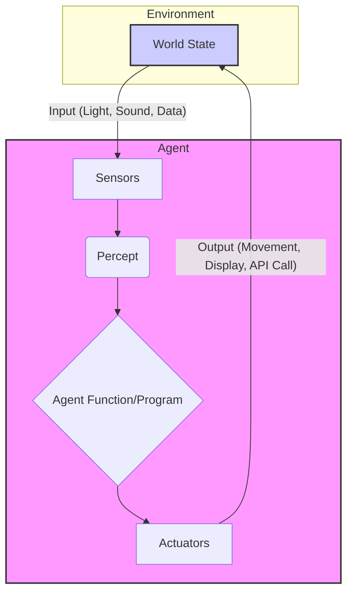
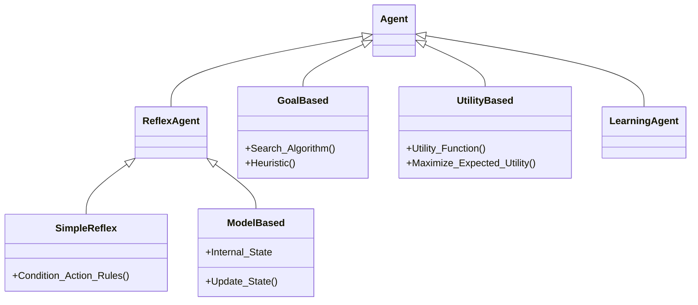
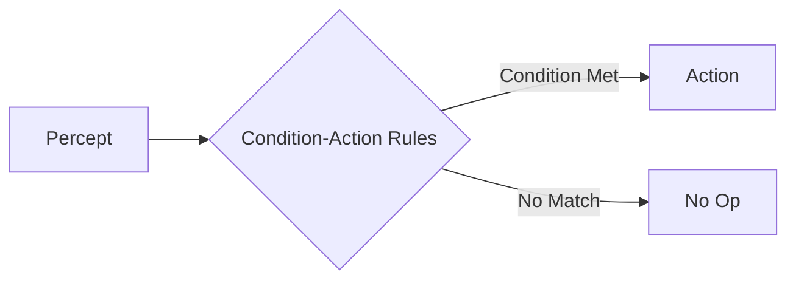

---
tags:
- field/cs
- subject/ai
- concept/agents/overview
---

[[T.O.C (Artificial Intelligence Notes)|Up to AI Notes]]

# Artificial Intelligence: Agents & Simple Reflex Models

## Characteristics and Knowledge
> **Prompt:** "Create a mermaid diagram for a detailed characteristics of the agent along with arrows indicating the workflow"
> **Lens Applied:** The Chief Engineer / The Algorithmist

# Deep Dive: The Agent Architecture

## 1. Ontological Definition
An **AI Agent** is not merely code; it is a **computational entity** that perceives its environment through sensors and acts upon that environment through actuators to achieve a specific goal. It is defined by the function:
$$
f: P^* \rightarrow A$$
Where $P^*$ is the history of percepts and $A$ is the action.

## 2. The Internal Mechanics (The Feedback Loop)
The fundamental cycle of an agent is the **Perception-Action Cycle**. The agent operates in a continuous loop:
1.  **Sense:** Gather raw data (Percepts).
2.  **Think:** Map percepts to an action using the Agent Function (Logic/Policy).
3.  **Act:** Execute the action via Actuators.
4.  **Effect:** The Environment changes.



## Types of AI agents
> **Prompt:** "Write a detailed list of types of AI agents with 2 lines definitions and examples of each and a mermaid diagram"
> **Lens Applied:** The Architect / The Chief Engineer

# System Hierarchy: Agent Classifications

## 1. The 5 Core Architectures
1.  **Simple Reflex Agents:**
    *   **Def:** Operates strictly on the *current* percept. Ignores history. Condition-Action rules only.
    *   *Ex:* A thermostat (If temp < 20 -> Turn On Heater).
2.  **Model-Based Reflex Agents:**
    *   **Def:** Maintains internal state to track aspects of the world that are not currently visible. Handles partial observability.
    *   *Ex:* A self-driving car tracking a pedestrian who walked behind a truck (object permanence).
3.  **Goal-Based Agents:**
    *   **Def:** acts to achieve a specific, defined "Goal" state. flexible logic to find a path to the goal.
    *   *Ex:* A GPS navigator (Reroutes to reach destination X).
4.  **Utility-Based Agents:**
    *   **Def:** Maximizes an internal "Utility Function" (Performance measure). Chooses the *best* way, not just *any* way.
    *   *Ex:* Stock trading bot (Maximizes profit, minimizes risk, not just "buy stock").
5.  **Learning Agents:**
    *   **Def:** Modifies its own logic/parameters based on experience to improve performance over time.
    *   *Ex:* AlphaGo (Learns strategies from playing millions of games).

## 2. Structural Relationship


## Simple reflex agent
> **Prompt:** "Explain in detail the term simple reflex AI agent. I want complete textbook details with detailed real world example. Draw a mermaid diagram as well"
> **Lens Applied:** The Chief Engineer / First Principles

# Deep Dive: Simple Reflex Agent

## 1. Ontological Definition
A **Simple Reflex Agent** is the most primitive architectural form of intelligence. It selects actions based **solely on the current percept**, completely ignoring the rest of the percept history.
*   **Constraint:** It *requires* a **Fully Observable Environment**. If the agent cannot see the condition trigger, it fails.
*   **Logic:** Implements explicit **Condition-Action Rules** (If `Condition` Then `Action`).

## 2. The Internal Mechanics (Under the Hood)
The control flow is linear and stateless. It does not access memory (RAM/Heap) to store past events.
1.  **Input:** Sensor reading.
2.  **Lookup:** Check `Rule Library` (Switch-Case or If-Else block).
3.  **Output:** Actuator command.

**Mathematical Representation:**
$$
Action = Function(Percept)
$$
*Note: No $State$ variable.*

**C++ Analogy:**
It is equivalent to a pure function or a `static` method with no static variables.
```cpp
// Stateless - Pure Reflex
Action decide(Percept p) {
    if (p.isDirty) return CLEAN;
    if (p.isWall) return TURN;
    return IDLE;
}
```

## 3. Visual Trace


## 4. Real World Example: The Vacuum World
Consider a robotic vacuum in a 2-square world (A and B).
*   **Sensors:** Location sensor, Dirt sensor.
*   **Rules:**
    1.  If `State == Dirty` -> `Suck`.
    2.  If `Location == A` -> `Right`.
    3.  If `Location == B` -> `Left`.

> **Prompt:** "Create an example table with multiple real world examples that indicate how exactly does simple reflex agent functions"
> **Lens Applied:** The Optimizationist / The Arena

# Analysis: Reflex Agent Mechanics in Reality

## Direct Mapping Matrix

| Domain | Sensor (Input) | Condition-Action Rule (Logic) | Actuator (Output) |
| :--- | :--- | :--- | :--- |
| **Manufacturing** | Optical Sensor | `IF part_color == RED THEN reject` | Pneumatic Arm (Push) |
| **Gaming (NPC)** | Proximity Raycast | `IF player_dist < 5m THEN attack` | Trigger Animation |
| **Networking** | Packet Sniffer | `IF protocol == UDP AND port == 80 THEN drop` | Firewall Rule |
| **Automotive** | Impact Sensor | `IF deceleration > 5g THEN deploy` | Airbag Inflator |
| **Web Dev** | User Input | `IF email != regex_valid THEN show_error` | DOM Update |

> **Prompt:** "Explain in detail, what problems we might face when using Simple reflex agent. Think of a real world example and map the concept of this type onto the example first and then create a scenario where the problem would be apparent"
> **Lens Applied:** The Inversionist / The Bottleneck

# Critical Failure Analysis: The Limits of Reflex

## 1. The Infinite Loop Problem (Perceptual Aliasing)
**The Symptom:** Since the agent has no memory, it cannot distinguish between "Being in State A for the first time" and "Being in State A for the 100th time."
**The Bottleneck:** Lack of **State** (Memory).

## 2. Case Study: The Blind Maze Runner
**Scenario:** A robot mouse in a maze using a Simple Reflex architecture.
*   **Rule:** `IF wall_in_front THEN turn_right`.

**The Failure Mode:**
Imagine the robot enters a box canyon (a cul-de-sac) or a square room.
1.  Robot hits North Wall -> Turns Right (East).
2.  Robot hits East Wall -> Turns Right (South).
3.  Robot hits South Wall -> Turns Right (West).
4.  Robot hits West Wall -> Turns Right (North).
5.  **Result:** The robot spins in a circle forever. It does not know "I have been here before."

## 3. Partial Observability Failure
If the environment is not fully observable, the condition might not trigger correctly.
*   **Example:** A braking system that only looks at distance (`IF dist < 10m THEN brake`).
*   **Bug:** It ignores *velocity*. A car at 100km/h needs to brake at 50m. The simple reflex agent crashes because its "Percept" (Distance) was insufficient to capture the true "State" (Physics).

