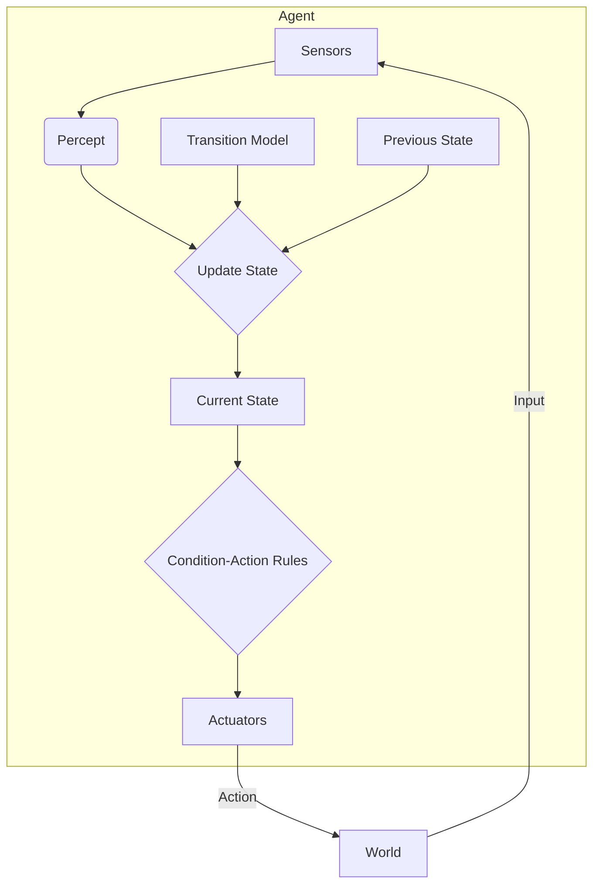

---
tags:
- field/cs
- subject/ai
- concept/model/based
---

[[T.O.C (Artificial Intelligence Notes)|Up to AI Notes]]

# Artificial Intelligence: Model-Based Agents

## Model based agent
> **Prompt:** "Explain in detail the term Model based AI agent. I want complete textbook details with detailed real world example. Draw a mermaid diagram as well"
> **Lens Applied:** The Chief Engineer / The Constructivist

# Deep Dive: Model-Based Reflex Agents

## 1. Ontological Definition
A **Model-Based Reflex Agent** is an evolution of the simple reflex agent designed to handle **Partially Observable Environments**. It solves the "blindness" of simple reflexes by maintaining an **Internal State**.
*   **Key Component:** The **Transition Model** (How the world works).
*   **The Question:** It asks "What is the world like now?" (combining current percept + past history), rather than just "What do I see now?".

## 2. The Internal Mechanics (Under the Hood)
The agent maintains a `State` variable structure in memory (Heap).
It requires two kinds of knowledge:
1.  **Sensor Model:** How the world is reflected in the sensors. (e.g., "If camera is gray, it might be fog or a wall").
2.  **Transition Model:** How the world evolves independently and how my actions affect it. (e.g., "If I turn the wheel right, the car goes right").

**Algorithm:**
```cpp
State current_state; // Persistent Memory

Action decide(Percept p) {
    current_state = update_state(current_state, last_action, p, model);
    Rule r = match_rule(current_state);
    return r.action;
}
```

## 3. Visual Trace


## 4. Real World Example: Self-Driving Car (Lane Keeping)
*   **Problem:** The camera sees the white lines *now*. But if the sun glares or a truck blocks the view for 1 second, a Simple Reflex agent sees "No Lines" and crashes.
*   **Model-Based Solution:**
    *   **Percept:** "No lines visible."
    *   **Internal State:** "I was in the center of the lane 0.1s ago. The road curvature was 0.0."
    *   **Model:** "Cars don't teleport laterally."
    *   **Decision:** "Keep steering straight until visual lock is re-acquired."

> **Prompt:** "Create an example table with multiple real world examples that indicate how exactly does model based agent functions"
> **Lens Applied:** The Optimizationist / The Arena

# Analysis: Model-Based Mechanics in Reality

## Direct Mapping Matrix

| Domain | The Missing Info (Hidden State) | The Model (Logic) | The Action |
| :--- | :--- | :--- | :--- |
| **Card Game AI (Poker)** | Opponent's Hand | Probability distributions based on betting history. | Fold/Raise (Based on calculated odds, not just current cards). |
| **Smart Home** | Is user home? | Motion detected 5 mins ago + No door open event = User still inside. | Keep lights on (even if motion sensor is currently quiet). |
| **TCP/IP Protocol** | Network Congestion | Packet Loss History + RTT estimation (Sliding Window). | Adjust Window Size (Congestion Control). |
| **Medical Diag. Bot** | Disease Progression | Patient symptoms (Current) + Medical History (Past State). | Recommend specific test (not just treating current headache). |

> **Prompt:** "Explain in detail, what problems we might face when using model based agent. Think of a real world example and map the concept of this type onto the example first and then create a scenario where the problem would be apparent"
> **Lens Applied:** The Inversionist / The Bottleneck

# Critical Failure Analysis: The Delusion of Models

## 1. The Model Mismatch (Hallucination)
**The Symptom:** The agent acts confidently on incorrect beliefs because its internal model diverges from reality.
**The Root Cause:** The Environment changed in a way the Transition Model did not account for.

## 2. Case Study: The "Smart" Thermostat
**Scenario:** A thermostat learns that "Turning on boiler raises temp by 1 degree/10 mins."
*   **Internal State:** "Temp is 18C. Boiler is on. In 10 mins, it will be 19C."

**The Failure Mode:**
1.  **Event:** Someone opens a window (Unmodeled Exogenous Variable).
2.  **Reality:** Temp drops to 15C.
3.  **Agent Belief:** The sensor reads 15C, but the agent might filter this as "noise" if its model is too rigid, OR it keeps the boiler on low power thinking "It should be warming up."
4.  **Result:** The house freezes because the agent's model ("House is a closed system") was violated. It assumes the physics of a closed room, not an open one.

### Model based agent vs Simple reflex agent
> **Prompt:** "Create a detailed comparison table comparing model based agent to simple reflex agent along with detailed example walkthrough"
> **Lens Applied:** The Arena / Second-Order Thinking

# Comparison: Reflex vs. State

## 1. Executive Summary
Use **Simple Reflex** for speed in static, fully visible worlds (e.g., manufacturing belts). Use **Model-Based** for dynamic, partially obscured worlds where "object permanence" is required.

## 2. Direct Comparison Matrix

| Feature | Simple Reflex Agent | Model-Based Reflex Agent |
| :--- | :--- | :--- |
| **Memory** | None ($O(1)$) | State Vector ($O(N)$) |
| **Environment** | Must be Fully Observable | Can be Partially Observable |
| **Compute Cost** | Extremely Low (Lookup Table) | Medium (State Update Logic) |
| **Failure Mode** | Loops in repetitive states | Desynchronization (Model != Reality) |
| **Time Awareness** | Only "Now" | "Past" + "Now" |

## 3. Code Contrast: The Crossing Guard

**Task:** Decide whether to walk across the street.

**Agent A: Simple Reflex**
```python
def act(vision):
    if vision == "CAR_COMING":
        return STOP
    else:
        return WALK
# BUG: If a parked truck blocks the view for 1 second, vision is "EMPTY".
# Agent walks -> Gets hit by hidden car.
```

**Agent B: Model-Based**
```python
state = {"car_speed": 0, "car_pos": 0}

def act(vision):
    if vision == "CAR_COMING":
        state.update(vision) # Track speed
    else:
        state.extrapolate() # Predict where car IS, even if not seen
    
    if state.predicted_car_pos < SAFE_DIST:
        return STOP
    return WALK
# SUCCESS: Agent waits because it "remembers" the car is approaching.
```
