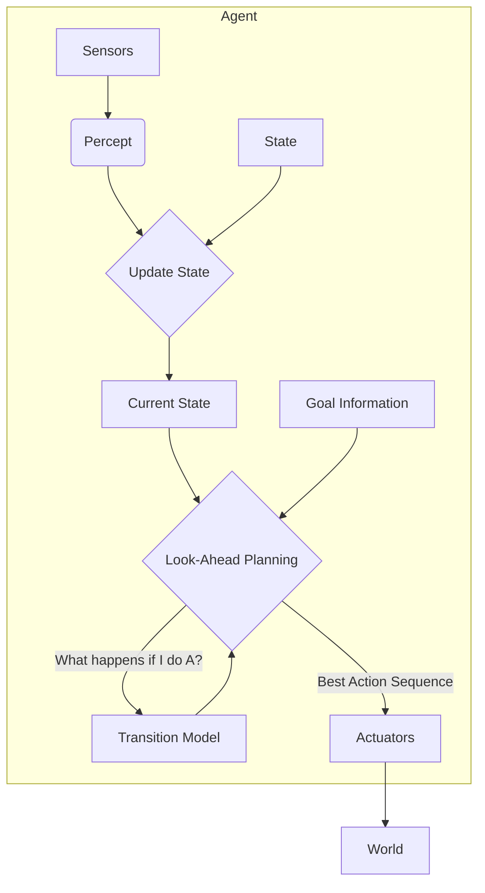

---
tags:
- field/cs
- subject/ai
- concept/goal/based
---

[[T.O.C (Artificial Intelligence Notes)|Up to AI Notes]]

# Artificial Intelligence: Goal-Based Agents

## Goal based agent
> **Prompt:** "Explain in detail the term Goal based AI agent. I want complete textbook details with detailed real world example. Draw a mermaid diagram for it as well"
> **Lens Applied:** The Chief Engineer / The Navigator

# Deep Dive: Goal-Based Agents

## 1. Ontological Definition
A **Goal-Based Agent** expands upon the Model-Based agent by adding **Future Intent**. It is not enough to know the state; the agent needs to know a **Goal** (a description of desirable situations).
*   **Key Shift:** From "What do I do *now*?" (Rules) to "What action gets me closer to *X*?" (Planning/Search).
*   **Flexibility:** Unlike reflex agents (hardcoded rules), a goal-based agent can adapt its behavior if the path is blocked, finding a new route to the same destination.

## 2. The Internal Mechanics (Search & Planning)
The core logic usually involves **Search Algorithms** (BFS, DFS, A*) or **Planning**.
1.  **State:** Where am I?
2.  **Goal:** Where do I want to be?
3.  **Action Selection:** Simulate sequences of actions to find a path from State to Goal.

**Algorithm:**
```cpp
State current_state;
Goal destination;

Action decide(Percept p) {
    current_state = update_state(current_state, p);
    Plan path = search_algorithm(current_state, destination);
    return path.first_step();
}
```

## 3. Visual Trace


## 4. Real World Example: GPS Navigation (Google Maps)
*   **Reflex Agent:** "Turn right at Main St." (If road closed, it fails).
*   **Goal-Based Agent:** "Destination: Airport."
    *   It calculates a route.
    *   If Main St is closed, it *re-plans* a route via 2nd Ave.
    *   The action (Turn Right vs Turn Left) depends entirely on the Goal, not just the current intersection.

> **Prompt:** "Create an example table with multiple real world examples that indicate how exactly does goal based agent functions"
> **Lens Applied:** The Optimizationist / The Arena

# Analysis: Goal-Based Mechanics in Reality

## Direct Mapping Matrix

| Domain | The Goal | The Search/Plan | The Action |
| :--- | :--- | :--- | :--- |
| **Robotics (Warehouse)** | "Package at Dock B" | Pathfinding (A*) across warehouse floor map. | Move North (Part of the plan). |
| **Chess Engine** | "Checkmate Opponent" | Minimax Tree Search (Looking 10 moves ahead). | Move Queen to E4. |
| **Compiler** | "Generate Optimized Binary" | Instruction Scheduling / Register Allocation graphs. | Reorder instructions to minimize stalls. |
| **Financial Planner** | "Retire with $1M" | Monte Carlo simulation of investment portfolios. | Buy Index Fund (Step 1 of 30-year plan). |

> **Prompt:** "Explain in detail, what problems we might face when using goal based agent. Think of a real world example and map the concept of this type onto the example first and then create a scenario where the problem would be apparent"
> **Lens Applied:** The Inversionist / The Bottleneck

# Critical Failure Analysis: The Cost of Thinking

## 1. The Complexity Explosion (Efficiency)
**The Bottleneck:** **Search is Expensive.** Looking ahead requires simulating thousands of future possibilities.
**The Trade-off:** Goal-based agents are smarter/more flexible, but much **slower** than reflex agents.

## 2. Case Study: The Rescue Robot
**Scenario:** A robot finding a survivor in a burning building.
*   **Goal:** Reach survivor.
*   **Map:** Complex 3D structure.

**The Failure Mode:**
1.  **Event:** A beam falls, blocking the path.
2.  **Agent Logic:** "Path blocked. Initiating Re-planning..."
3.  **Process:** The agent pauses to run a pathfinding algorithm on the new graph topology. This takes 10 seconds.
4.  **Result:** In those 10 seconds, the fire spreads and destroys the robot.
    *   *Diagnosis:* The agent was "Thinking" when it should have been "Acting" (Reflex). It failed to balance **Deliberation Time** vs. **Reaction Time**.

### Model based agent vs Simple reflex agent vs Goal based agent
> **Prompt:** "Create a detailed comparison table comparing model based agent to simple reflex agent to goal based agent along with detailed example walkthrough"
> **Lens Applied:** The Arena / Second-Order Thinking

# Comparison: The Evolution of Agency

## 1. Direct Comparison Matrix

| Feature | Simple Reflex | Model-Based Reflex | Goal-Based |
| :--- | :--- | :--- | :--- |
| **Question Asked** | "What do I see now?" | "What is the world like?" | "What will happen if I do X?" |
| **Knowledge** | Condition-Rules | Transition Model | Transition Model + Goal |
| **Flexibility** | Rigid | Handles invisibility | Adaptable (Can change destinations) |
| **Speed** | Instant | Fast | Slow (Search overhead) |

## 2. Example Walkthrough: The Taxi Driver

**Scenario:** Driving a car.

1.  **Simple Reflex:**
    *   *Logic:* "If Red Light -> Brake."
    *   *Flaw:* Doesn't know where it's going. Just drives safely in circles.

2.  **Model-Based:**
    *   *Logic:* "The car in front is braking (I saw brake lights), so it will slow down. I should brake."
    *   *Flaw:* Still doesn't know *where* it's going. Avoids crashes but arrives nowhere.

3.  **Goal-Based:**
    *   *Logic:* "I want to go to the Airport. The highway is blocked. I will take the side street."
    *   *Benefit:* It combines safety (Model/Reflex) with **Purpose**. It takes actions that seem "wrong" locally (turning away from the highway) because they are "correct" globally (reaching the goal).
