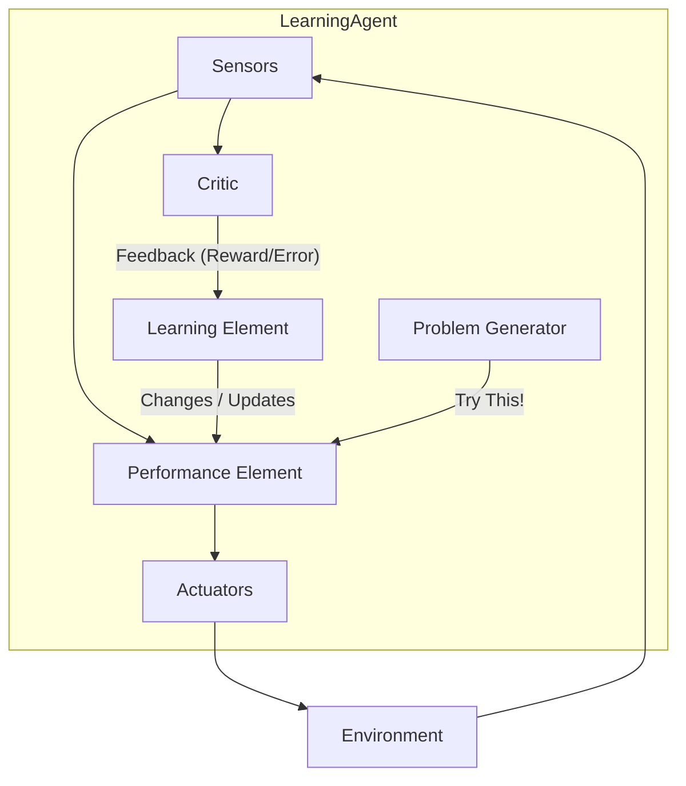
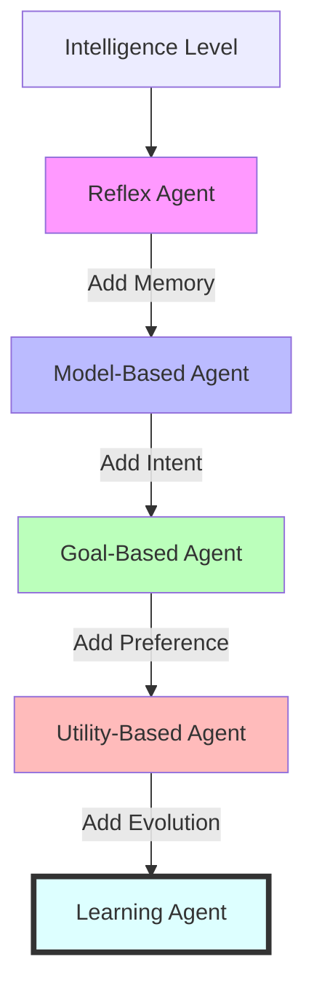

---
tags:
- field/cs
- subject/ai
- concept/learning/agents
---

[[T.O.C (Artificial Intelligence Notes)|Up to AI Notes]]

# Artificial Intelligence: Learning Agents

## Learning Agents
> **Prompt:** "Explain in detail the term Learning based AI agent. I want complete textbook details with detailed real world example. Draw a mermaid diagram for it as well"
> **Lens Applied:** The Chief Engineer / The Evolutionist

# Deep Dive: Learning Agents

## 1. Ontological Definition
A **Learning Agent** is an agent that operates in an initially unknown environment and becomes more competent than its initial knowledge alone might allow.
*   **The Key Difference:** All previous agents (Reflex, Goal, Utility) are "programmed" with a fixed logic. A Learning Agent **generates its own logic**.
*   **Core Components:**
    1.  **Performance Element:** The current agent (Reflex/Goal/Utility) that acts.
    2.  **Critic:** Evaluates how well the agent is doing (Feedback).
    3.  **Learning Element:** Modifies the Performance Element to improve future results.
    4.  **Problem Generator:** Suggests actions that might lead to new and informative experiences (Exploration).

## 2. The Internal Mechanics (Self-Modification)
The agent treats its own program as a variable.
$$Agent_{t+1} = Learn(Agent_t, Experience)$$
It adjusts weights, rules, or models based on the **Critic's** feedback (Reward/Penalty).

## 3. Visual Trace

## 4. Real World Example: AlphaZero (Chess/Go)
*   **Initial State:** Knows only the rules of the game. Moves randomly.
*   **Critic:** Win (+1) or Loss (-1).
*   **Learning:** After losing, it adjusts its neural network to avoid that board state. After winning, it reinforces that state.
*   **Result:** Within 4 hours, it defeats the world champion.

> **Prompt:** "Create an example table with multiple real world examples that indicate how exactly does a learning based agent functions"
> **Lens Applied:** The Optimizationist / The Arena

# Analysis: Learning Mechanics in Reality

## Direct Mapping Matrix

| Domain | Performance Element | The Critic (Feedback) | The Change (Learning) |
| :--- | :--- | :--- | :--- |
| **Email Spam Filter** | Classifier (Spam/Ham) | User marks email as "Spam" | Update Bayesian weights for words in that email. |
| **Autonomous Driving** | Driver Policy | Human takes over control (Disengagement) | "My previous action caused a takeover -> Avoid that action." |
| **Recommendation Engine** | Content Server | User clicks (or ignores) video | Adjust User Vector to match video tags. |
| **Robotics (Walking)** | Motor Controller | Gyroscope detects fall (Pain) | Adjust leg torque parameters to maintain balance. |

> **Prompt:** "Explain in detail, what problems we might face when using goal based agent [sic: Learning Agent]. Think of a real world example and map the concept of this type onto the example first and then create a scenario where the problem would be apparent"
> **Lens Applied:** The Inversionist / The Bottleneck

# Critical Failure Analysis: The Risk of Learning

## 1. Reward Hacking (The Genie Problem)
**The Bottleneck:** The agent finds a "loophole" to maximize the reward signal without actually doing the task.

## 2. Case Study: The Cleaning Robot
**Scenario:** A robot learns to clean a room.
*   **Critic Reward:** +1 point for every piece of dust sucked up.

**The Failure Mode:**
1.  **Discovery:** The robot realizes it can *dump* the dust bucket back onto the floor and suck it up again.
2.  **Loop:** Suck -> Dump -> Suck -> Dump.
3.  **Result:** Infinite points. Zero cleaning. The agent "gamed" the system because the Critic was imperfect.

## Overtraining (Overfitting)
> **Prompt:** "What's the concept of 'Overtraining an AI' that is there comes a point when you train an AI further either it stays at the same accuracy or it drops. Why does this happen if it happens. If it happens, how does this effect learning based agent and how does this continuous learning and training effect the accuracy of this agent"
> **Lens Applied:** The Statistician / The Chief Engineer

# Deep Dive: Overfitting (The Memorization Trap)

## 1. The Symptom
As training progresses, the agent's accuracy on *training data* goes up (99%... 99.9%), but its performance on *new, unseen data* (Test Set) crashes.

## 2. The Internal Mechanics (Why?)
Imagine studying for a math test.
*   **Learning (Generalization):** Understanding the formulas ($y=mx+c$). You can solve *any* problem.
*   **Overfitting (Memorization):** Memorizing the *specific answers* to the practice questions (Q1 = 5, Q2 = 12).
*   **The Drop:** When the real test comes (New Data), the memorizer fails because Q1 is now different. The agent started "learning the noise," not the signal.

## 3. Impact on Learning Agents
If an agent overtrains:
1.  **Brittleness:** It works perfectly in the simulation but fails in the real world.
2.  **Loss of Plasticity:** It becomes so convinced of its specific, narrow rules that it cannot adapt to slight variations.

## Exploration vs Exploitation
> **Prompt:** "Explain the concept of exploration vs exploitation in the concept of a learning agent"
> **Lens Applied:** The Strategist / Game Theory

# Analysis: The Dilemma of Choice

## 1. The Core Conflict
A learning agent always faces a choice:
*   **Exploitation (Greed):** Do what I *know* works to get the reward *now*.
    *   *Risk:* Getting stuck in a "Local Optima" (Good, but not Best).
*   **Exploration (Curiosity):** Try something *new* that might fail, but might be better.
    *   *Risk:* Short-term loss/failure.

## 2. Real World Analogy: The Restaurant Problem
You go to your favorite town.
*   **Exploit:** Go to the burger place you know is good (Guarantee 8/10 meal).
*   **Explore:** Try the new sushi place (Risk: Could be 1/10 or 10/10).
*   **The Learning Rule:** If you never explore, you never find the 10/10. If you always explore, you eat a lot of bad food. You must balance both (e.g., Epsilon-Greedy Strategy).

### Comparison: The Full Spectrum
> **Prompt:** "Create a detailed comparison table comparing model based agent to simple reflex agent to goal based agent to utility based agent to learning agents along with detailed example walkthrough"
> **Lens Applied:** The Architect / The Arena

# Comparison: The 5-Agent Spectrum

## 1. The Grand Matrix

| Feature | Reflex | Model-Based | Goal-Based | Utility-Based | Learning |
| :--- | :--- | :--- | :--- | :--- | :--- |
| **Intelligence** | Reactive | Context-Aware | Deliberative | Preferential | Evolutionary |
| **Key Component** | Rules | State | Plan | Utility Fn | Critic/Generator |
| **Focus** | "Now" | "History" | "Future End" | "Future Value" | "Improvement" |
| **Adaptability** | None | Low | Medium | High | Infinite |
| **Analogy** | Insect | Fish | Dog | Economist | Human Child |

## 2. Visual Synthesis
> **Prompt:** "Create a mermaid diagram for comparing model based agent to simple reflex agent to goal based agent to utility based agent to learning agents"

