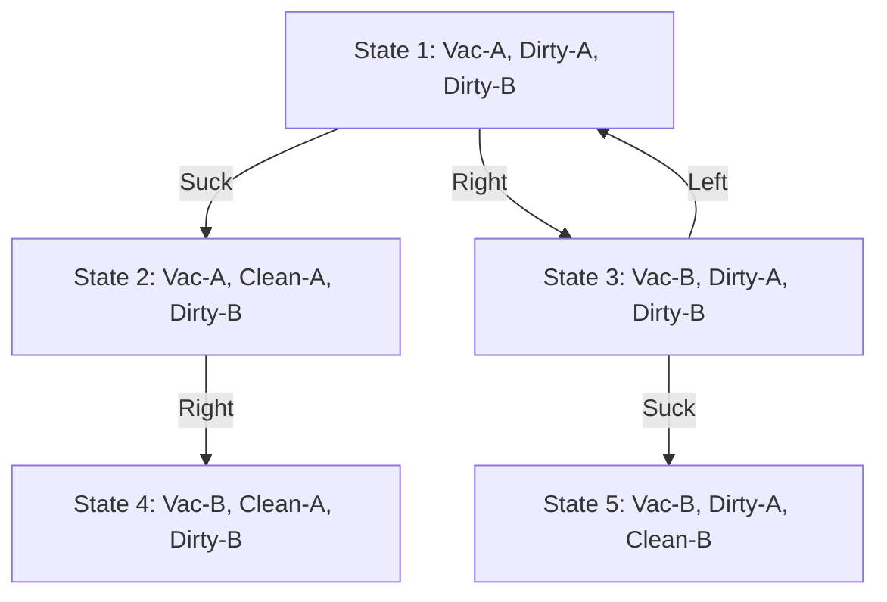
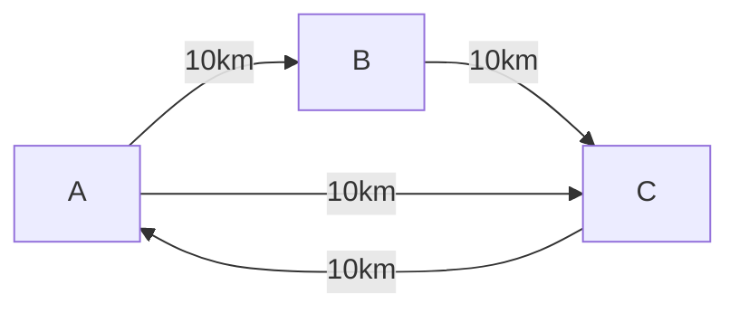
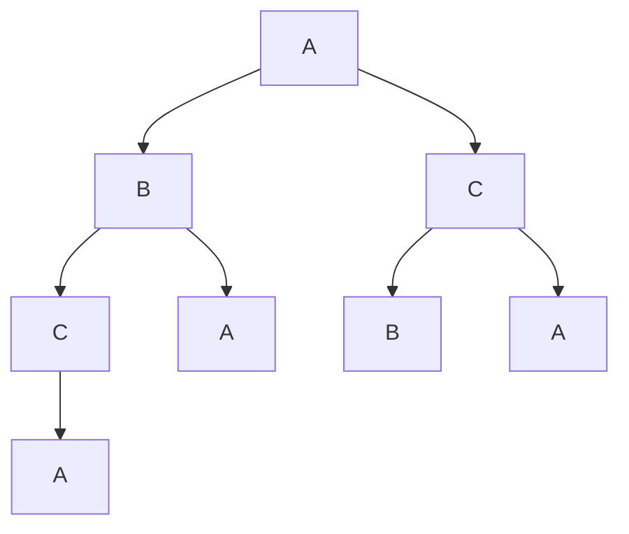

---
tags:
- field/cs
- subject/ai
- concept/ai/search
---

# AI Search Foundations: Graphs vs. Trees

[[T.O.C (Artificial Intelligence Notes)|Up to AI Notes]]

#concept #ai #algorithms

## 1. State Space Graphs

> **Prompt:** "Explain in detail what exactly is a space state graph: A mathematical representation of a search graph where nodes are search configs arcs are successors and goal nodes. Make sure you use real world examples and mermaid diagrams for explanations as well"
> **Lens Applied:** The Chief Engineer / The Algorithmist

# Deep Dive: State Space Graphs

## 1. Ontological Definition
A **State Space Graph** is the mathematical abstraction of a problem's entire universe. It is a directed graph $G = (V, E)$ where:
*   **Nodes (V):** Represent discrete **States** (configurations of the world).
*   **Edges (E):** Represent **Actions** (transitions) that transform one state into another.

It represents the **potential**—every possible move that *could* be made, regardless of whether a search algorithm ever explores it.

## 2. Real World Example: The Vacuum World
Imagine a simple AI vacuum cleaner in a world with two rooms (A and B).
*   **States:** Where is the vacuum? (A or B). Is room A dirty? (Yes/No). Is room B dirty? (Yes/No).
    *   Total States = $2 \times 2 \times 2 = 8$ states.
*   **Actions:** `Left`, `Right`, `Suck`.

## 3. Visual Trace (Mermaid)
This diagram shows a subset of the Vacuum World state space.



## 4. Systems Context
In memory, this graph is often **implicit**. We don't store all 8 nodes. We start at the `Initial State` and use a `Successor Function` to generate neighbors dynamically. This is crucial because for a game like Chess, the State Space Graph has $10^{40}$ nodes—too big to store.

---

## 2. Search Trees

> **Prompt:** "What exactly is a search tree and why do we convert a graph to a search tree. What benefits does it serve. Explain using each arch as a "What if". Start node is the root. Why can't we make a complete tree for most problems"
> **Lens Applied:** The Chief Engineer / The Constructivist

# Deep Dive: The Search Tree

## 1. Definition vs. Transformation
While the **Graph** is the *territory* (the map of the world), the **Search Tree** is the *path* (your hike through it).
*   **Root:** The Start State.
*   **Branches:** The "What If" scenarios. Each branch represents a specific choice made at a specific time.
*   **Nodes:** Here, a node represents a **Path** to a state, not just the state itself.

**Transformation:** We convert a Graph to a Tree to **unroll time**.
*   In the Graph, you can cycle back to Room A (A -> B -> A).
*   In the Tree, "A (Time 0)" is the root, and "A (Time 2)" is a grandchild node. They are distinct.

## 2. The Benefit: "What If" Simulation
The Tree allows the AI to explore hypothetical futures without committing.
*   *Branch 1:* "What if I go Left?"
*   *Branch 2:* "What if I go Right?"
Each arc is a simulation step.

## 3. Constraints: The Infinite Loop
We cannot make a complete tree for most problems because if the Graph has **cycles** (A -> B -> A), the Tree becomes **infinite**.
*   Level 0: A
*   Level 1: B
*   Level 2: A
*   Level 3: B ... ad infinitum.
This is why we need **visited lists** (to prune the tree).

---

## 3. Graph vs. Tree (Comparison)

> **Prompt:** "Use side by side difference tables to differentiate between A search graph and search tree"
> **Lens Applied:** The Arena

# Analysis: Search Graph vs. Search Tree

| Feature | Search Graph (The Map) | Search Tree (The Journey) |
| :--- | :--- | :--- |
| **Structure** | Cyclic (Loops allowed) | Acyclic (Hierarchical) |
| **Node Meaning** | A unique State (Configuration) | A unique **Path** to a state |
| **Size** | Finite (usually) | Potentially Infinite (if loops exist) |
| **Uniqueness** | Each state appears once | A state can appear multiple times (as different leaf nodes) |
| **Memory** | Stores the World Layout | Stores the Exploration History |
| **Goal** | Definition of the problem | Record of the solution search |

---

## 4. Visual Comparison

> **Prompt:** "Make to mermaid diagrams for one search problem. One represents its search graph and one represents a search tree"
> **Lens Applied:** The Algorithmist

# Visual Lab: The 3-City Problem
**World:** Cities A, B, and C. Connected in a triangle.

### The Search Graph (The Territory)

*Note: It's a compact network.*

### The Search Tree (The Exploration from A)

*Note: "A" appears multiple times (Root, A1, A2, A3). The Tree grows exponentially.*

---

## 5. Complexity Analysis

> **Prompt:** "Differentiate btw the graph and trees' time and space complexities in the scope of searching problems"
> **Lens Applied:** The Optimizationist

# Complexity Analysis: Graph vs. Tree Search

## 1. Tree Search Complexity
Tree search does **not** check for repeated states. It blindly follows branches.
*   **Branching Factor (b):** Average actions per state.
*   **Depth (d):** Depth of the solution.
*   **Max Depth (m):** Maximum depth of the state space.
*   **Time:** $O(b^m)$ (Exponential). It explores every "what if".
*   **Space:** $O(m)$ (Linear) if using DFS (only stores current path).

## 2. Graph Search Complexity
Graph search maintains a **Closed List** (Visited Set) to prevent cycles.
*   **State Space Size (|V|):** Total number of unique states.
*   **Time:** $O(|V| + |E|)$. It visits each state exactly once.
*   **Space:** $O(|V|)$. It must store **every visited state** in memory to check for duplicates.

## 3. The Trade-off (The Verdict)
*   **Tree Search:** Good for memory, dangerous for time (cycles).
*   **Graph Search:** Good for time (no cycles), dangerous for memory (storing billions of states).

```