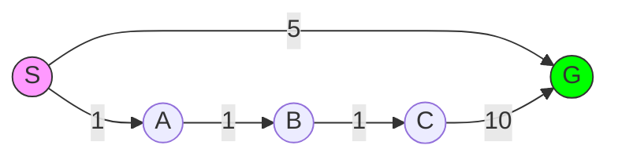

---
tags:
- field/cs
- subject/ai
- concept/search/a-star
- concept/search/dijkstra
---

[[T.O.C (Artificial Intelligence Notes)|Up to Artificial Intelligence Notes]]

> **Prompt:** "Create a graph in mermaid. The graph must be of the type that could clearly indicate the differences and pros and cons of A* over dijkstra. Then perform both algos on it step by step"
> **Lens Applied:** The Optimizationist

# Algorithm: A* vs. Dijkstra (Heuristic-Guided Search)

## 1. The Logic (Visual Trace)
To visualize the divergence, we use a graph where Dijkstra is forced to explore a "dead-end" branch with low edge costs, while A* uses a heuristic to stay on target.



**Heuristic values $h(n)$ (Distance to G):**
$h(S)=4, h(A)=10, h(B)=10, h(C)=10, h(G)=0$.

### Step-by-Step Execution:
**Dijkstra (Greedy on $g(n)$):**
1. **Visit S:** Neighbors A(1), G(5). Open list: `{A:1, G:5}`.
2. **Visit A:** Neighbors B(2). Open list: `{B:2, G:5}`.
3. **Visit B:** Neighbors C(3). Open list: `{C:3, G:5}`.
4. **Visit C:** Neighbors G(13). Open list: `{G:5}`.
5. **Visit G:** Found path $S \to G$ (Cost 5).
*Result:* Dijkstra explored the entire $A-B-C$ chain because its cumulative cost was lower than the direct $S \to G$ edge initially.

**A* (Greedy on $f(n) = g(n) + h(n)$):**
1. **Visit S:** 
   - $f(A) = 1 + 10 = 11$
   - $f(G) = 5 + 0 = 5$
   - Open list: `{G:5, A:11}`.
2. **Visit G:** Found path $S \to G$ (Cost 5).
*Result:* A* ignored the $A-B-C$ branch entirely because the heuristic correctly identified that moving towards A increases the total estimated cost.

## 2. Complexity Analysis
* **Time:** $O(E \log V)$ for both (using a priority queue). However, A* explores a smaller constant factor of the state space.
* **Space:** $O(V)$ to store the frontier and visited sets.

## 3. Implementation (Optimized)
```python
def a_star(graph, start, goal, h):
    pq = [(0 + h[start], 0, start, [])] # (f, g, node, path)
    visited = {}
    while pq:
        f, g, current, path = heapq.heappop(pq)
        if current == goal: return path + [current]
        if current in visited and visited[current] <= g: continue
        visited[current] = g
        for neighbor, weight in graph[current]:
            new_g = g + weight
            heapq.heappush(pq, (new_g + h[neighbor], new_g, neighbor, path + [current]))
```

## 4. Edge Cases (The Inversionist)
* **Inadmissible Heuristic:** If $h(n) > \text{actual cost}$, A* may return a sub-optimal path (it becomes "too greedy").
* **Negative Edges:** Both fail; requires Bellman-Ford or SPFA.
* **Uniform Heuristic:** If $h(n) = 0$ for all $n$, A* collapses into Dijkstra.
