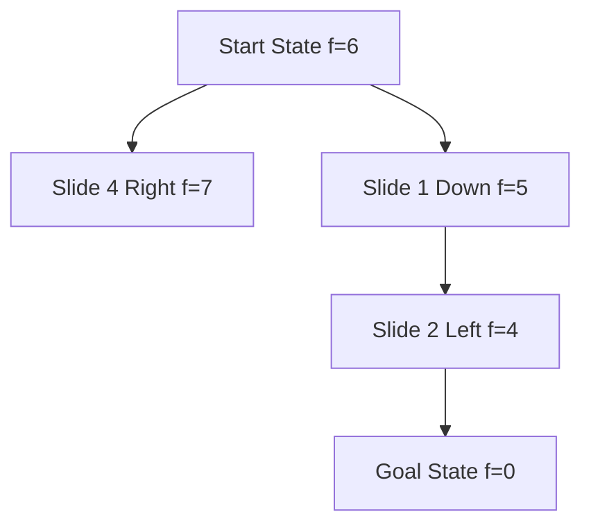

---
tags:
- field/cs
- subject/ai
- concept/search/a-star
- concept/algorithm/8-puzzle
---

[[T.O.C (Artificial Intelligence Notes)|Up to Artificial Intelligence Notes]]

> **Prompt:** "Explain in detail the 8 puzzle problem and how can we apply A* on it."
> **Lens Applied:** The Optimizationist

# Algorithm: 8-Puzzle A* Search

## 1. The Logic (Visual Trace)
The 8-puzzle is a sliding block puzzle played on a 3x3 grid with 8 numbered tiles and one empty spot (0). The goal is to reach a specific configuration (e.g., tiles ordered 1-8) with minimum moves. 

**A\* Search** solves this by evaluating states using $f(n) = g(n) + h(n)$:
1.  **$g(n)$**: The actual cost (number of moves) to reach the current state from the start.
2.  **$h(n)$**: An admissible heuristic estimating the cost to the goal. The **Manhattan Distance** (sum of vertical and horizontal distances of tiles from their goal positions) is preferred over "misplaced tiles" because it is more informative and never overestimates the cost.



## 2. Complexity Analysis
*   **Time Complexity:** $O(b^d)$ in the worst case, where $b$ is the branching factor (~3) and $d$ is the solution depth. However, with a good heuristic like Manhattan Distance, A* explores significantly fewer nodes than Uninformed Search (BFS).
*   **Space Complexity:** $O(b^d)$ because all generated nodes are stored in memory (Priority Queue and Closed Set) to prevent cycles and revisit optimal paths.

## 3. Implementation (Optimized)
Using a priority queue (`heapq`) ensures we always expand the node with the lowest $f(n)$.

```python
import heapq

def manhattan(state, goal):
    dist = 0
    for i in range(1, 9):
        curr_idx = state.index(i)
        goal_idx = goal.index(i)
        dist += abs(curr_idx // 3 - goal_idx // 3) + abs(curr_idx % 3 - goal_idx % 3)
    return dist

def get_neighbors(state):
    neighbors = []
    zero_idx = state.index(0)
    r, c = zero_idx // 3, zero_idx % 3
    moves = [(-1, 0, 'Up'), (1, 0, 'Down'), (0, -1, 'Left'), (0, 1, 'Right')]
    
    for dr, dc, move in moves:
        nr, nc = r + dr, c + dc
        if 0 <= nr < 3 and 0 <= nc < 3:
            new_state = list(state)
            new_idx = nr * 3 + nc
            new_state[zero_idx], new_state[new_idx] = new_state[new_idx], new_state[zero_idx]
            neighbors.append((tuple(new_state), move))
    return neighbors

def solve(start, goal):
    pq = [(manhattan(start, goal), 0, start, [])]
    visited = {start: 0}
    
    while pq:
        f, g, curr, path = heapq.heappop(pq)
        if curr == goal: return path
        
        for neighbor, move in get_neighbors(curr):
            new_g = g + 1
            if neighbor not in visited or new_g < visited[neighbor]:
                visited[neighbor] = new_g
                h = manhattan(neighbor, goal)
                heapq.heappush(pq, (new_g + h, new_g, neighbor, path + [move]))
```

## 4. Edge Cases (The Inversionist)
*   **Insolvability:** If the **inversion count** (pairs $(i, j)$ where $i > j$ and $i$ precedes $j$) is odd, the puzzle is impossible to solve from that state (parity mismatch).
*   **Already Solved:** The algorithm should return an empty path immediately if `start == goal`.
*   **Heuristic Admissibility:** If $h(n)$ overestimates the cost, A* may not find the *shortest* path. Manhattan distance is always admissible.
