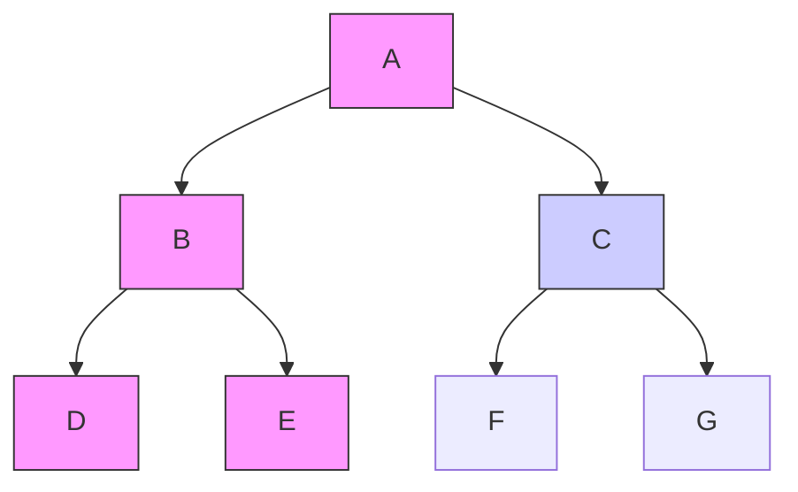
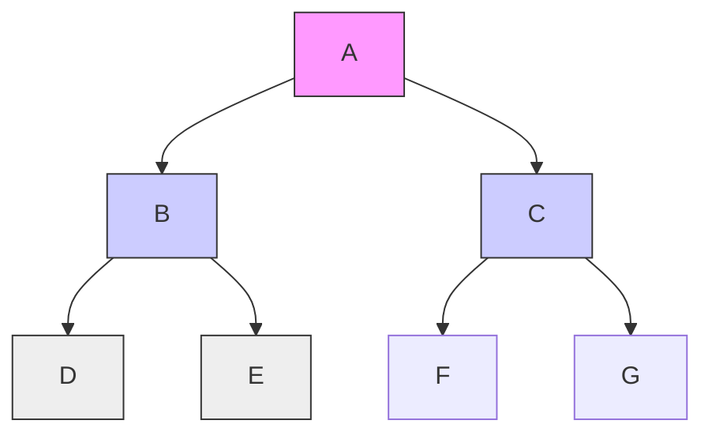

---
tags:
- field/cs
- subject/ai
- concept/ai/uninformed
---

# AI Uninformed Search Strategies

[[T.O.C (Artificial Intelligence Notes)|Up to AI Notes]]

#concept #ai #algorithms #dfs #bfs

## 1. Depth-First Search (DFS)

> **Prompt:** "Explain DFS in the scope of a search problem and then perform an example run on a search graph and tree using DFS"
> **Lens Applied:** The Algorithmist

# Algorithm: Depth-First Search (DFS)

## 1. The Logic (Brave Exploration)
DFS is the strategy of the **bold explorer**. It plunges as deep as possible into the search tree, following a single branch until it hits a dead end (leaf node) or a goal. Only then does it backtrack to the nearest junction.
*   **Data Structure:** LIFO Stack (Last-In, First-Out).
*   **Mantra:** "Go Deep."

## 2. The Visual Trace
**Graph:** A -> (B, C); B -> (D, E); C -> (F, G)

**Execution Flow:**
1.  **Start at A.**
2.  Expand A. Push C, then B. (Stack: `[C, B]`)
3.  Pop B. Expand B. Push E, then D. (Stack: `[C, E, D]`)
4.  Pop D. (Leaf). Backtrack. (Stack: `[C, E]`)
5.  Pop E. (Leaf). Backtrack. (Stack: `[C]`)
6.  Pop C. Expand C. Push G, then F. (Stack: `[G, F]`)
7.  ...

**Tree Visualization:**

*DFS explores the entire Left Subtree (Pink) before touching the Right Subtree (Blue).*

---

## 2. Search Algorithm Properties

> **Prompt:** "Explain to me each and every property of a search algorithm in detail"
> **Lens Applied:** The Chief Engineer / First Principles

# System Properties of Search

To evaluate *any* search algorithm, we measure four specific metrics:

## 1. Completeness (Reliability)
**"If a solution exists, is the algorithm guaranteed to find it?"**
*   *Fail:* An algorithm that gets stuck in an infinite loop.
*   *Pass:* An algorithm that eventually checks every node.

## 2. Optimality (Quality)
**"Does it find the *best* (lowest cost) solution?"**
*   Some algorithms find *a* path (e.g., a long detour).
*   Optimal algorithms find the *shortest* path.

## 3. Time Complexity (Speed)
**"How long does it take to find a solution?"**
*   Measured in number of nodes generated/expanded.

## 4. Space Complexity (Memory)
**"How much RAM does it need?"**
*   Measured in the maximum size of the Frontier (Queue/Stack) during the search.

---

## 3. DFS Complexity Analysis

> **Prompt:** "Analyze the time and space complexity of a tree / graph with n nodes and m layers using DFS for searching. Construct an example tree for the analysis and explain the analysis deductions in detail in terms of the exact complexities"
> **Lens Applied:** The Optimizationist

# Complexity Analysis: DFS

## Parameters
*   $b$: Branching factor (number of successors per node).
*   $m$: Maximum depth of the tree.

## 1. Space Complexity (The Superpower)
DFS is memory efficient. It only needs to store the **current path** from the root to the leaf, plus the unexpanded siblings at each level.
*   **Formula:** $O(b \times m)$ (Linear).
*   *Why?* At depth $m$, we store $b$ nodes for each level. If $b=10$ and $m=10$, we store 100 nodes.
*   **Verdict:** Excellent. Can search massive depths.

## 2. Time Complexity (The Weakness)
DFS might explore the entire tree before finding a goal at the far right.
*   **Formula:** $O(b^m)$ (Exponential).
*   *Why?* In the worst case, it visits every node.
*   **Verdict:** Dangerous. If $m$ is infinite, DFS never returns.

---

## 4. Breadth-First Search (BFS)

> **Prompt:** "Explain BFS in the scope of a search problem and then perform an example run on a search graph and tree using BFS"
> **Lens Applied:** The Algorithmist

# Algorithm: Breadth-First Search (BFS)

## 1. The Logic (Cautious Expansion)
BFS is the strategy of the **cautious wave**. It floods the graph layer by layer. It visits all neighbors at depth $d$ before moving to $d+1$.
*   **Data Structure:** FIFO Queue (First-In, First-Out).
*   **Mantra:** "Go Wide."

## 2. The Visual Trace
**Graph:** A -> (B, C); B -> (D, E); C -> (F, G)

**Execution Flow:**
1.  **Start at A.**
2.  Expand A. Enqueue B, C. (Queue: `[B, C]`)
3.  Dequeue B. Expand B. Enqueue D, E. (Queue: `[C, D, E]`)
4.  Dequeue C. Expand C. Enqueue F, G. (Queue: `[D, E, F, G]`)
5.  Dequeue D...

**Tree Visualization:**

*BFS clears Level 1 (Pink), then Level 2 (Blue), then Level 3 (Grey).*

---

## 5. BFS Complexity Analysis

> **Prompt:** "Analyze the time and space complexity of a tree / graph with n nodes and m layers using BFS for searching. Construct an example tree for the analysis and explain the analysis deductions in detail in terms of the exact complexities"
> **Lens Applied:** The Optimizationist

# Complexity Analysis: BFS

## 1. Time Complexity (Systematic)
BFS finds the shallowest goal.
*   **Formula:** $O(b^d)$ (Exponential).
*   *Why?* It generates every node up to depth $d$.

## 2. Space Complexity (The Fatal Flaw)
BFS must keep **all** nodes at the current level in memory to generate the next level.
*   **Formula:** $O(b^d)$ (Exponential).
*   *Why?* The frontier grows exponentially.
*   *Example:* If $b=10$ and $d=12$, BFS needs terabytes of RAM.
*   **Verdict:** BFS usually crashes due to Out-Of-Memory errors before it runs out of time.

---

## 6. The Arena: DFS vs. BFS

> **Prompt:** "Compare and contrast DFS and BFS for search problems in detail"
> **Lens Applied:** The Arena

# Analysis: DFS vs. BFS

| Feature | DFS (The Diver) | BFS (The Wave) |
| :--- | :--- | :--- |
| **Strategy** | LIFO (Stack) - Deepest node first | FIFO (Queue) - Shallowest node first |
| **Completeness** | **No.** Fails in infinite spaces (loops). | **Yes.** Guaranteed to find goal if $b$ is finite. |
| **Optimality** | **No.** Returns first solution found (could be deep). | **Yes.** Returns shallowest (shortest path) solution. |
| **Space** | **Low** $O(bm)$ - Linear | **High** $O(b^d)$ - Exponential |
| **Time** | $O(b^m)$ | $O(b^d)$ |
| **Best For** | Many solutions, deep trees, limited memory. | Shortest path needed, shallow goals. |

---

## 7. Iterative Deepening DFS (IDFS)

> **Prompt:** "What is the concept of Iterative deepening in DFS in the scope of search problems"
> **Lens Applied:** The Optimizationist / The Hybrid

# Algorithm: Iterative Deepening (IDFS)

## The Hybrid Solution
IDFS combines the **space efficiency of DFS** with the **completeness/optimality of BFS**.

## The Logic
It runs DFS repeatedly with a strictly limited depth limit ($L$).
1.  Run DFS with Limit = 0. (Check Root).
2.  Run DFS with Limit = 1. (Check Root + Children).
3.  Run DFS with Limit = 2.
4.  ... Iterate until goal found.

## Why?
*   It looks like waste (regenerating nodes), but since the leaf layer contains the majority of nodes ($b^d$), regenerating the upper layers is negligible overhead (~11% extra work).
*   **Result:**
    *   **Space:** $O(bd)$ (Like DFS).
    *   **Optimality:** Yes (Like BFS).
    *   **Completeness:** Yes (Like BFS).
    *   **It is the preferred algorithm for uninformed search.**

