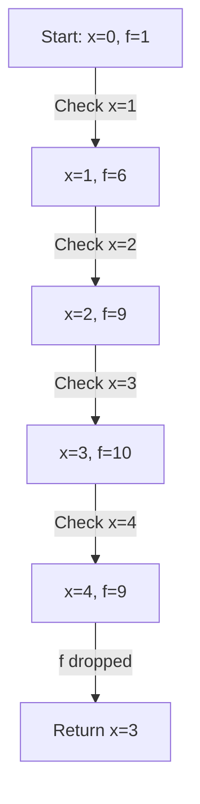

---
tags:
- field/cs
- subject/ai
- concept/search/local
---
[[T.O.C (Artificial Intelligence Notes)|Up to AI Notes]]

# Artificial Intelligence (Semester 4)
## Local Searches

### 1. Concept of Local Searches
> **Seed:** "explain in detail the concept of local searches by covering all possible aspects of it. Make it textbook style with multiple examples"
> **Lens:** First Principles / The Chief Engineer

**Ontological Definition**
Local search is a class of heuristic-based optimization algorithms that operate by iteratively making small, incremental changes to a single "current state" rather than exploring the entire state space systematically. Unlike tree-based searches (BFS/DFS), local search does not maintain a search tree or a frontier; it focuses solely on the immediate neighborhood of the current configuration to find a state that maximizes (or minimizes) an objective function.

**Internal Mechanics**
1. **State Space Landscape:** Visualize the search space as a physical landscape where "location" represents a state and "elevation" represents the value of the objective function.
2. **Current State:** The algorithm keeps track of exactly one node.
3. **Neighborhood Function:** A rule that defines which states are reachable from the current state in a single step (e.g., moving one queen in N-Queens).
4. **Transition Rule:** The logic used to decide which neighbor to move to (e.g., the highest neighbor in Hill Climbing).

**System Context (Analogy)**
Imagine searching for the highest peak in a mountain range during a dense fog. You cannot see the distant peaks; you can only feel the slope of the ground beneath your feet. To reach the top, you consistently step in the direction where the ground slopes upward. This "climbing" continues until every direction leads downward.

## Why and When Local Searches?

### 2. Why and When to Use Local Searches
> **Seed:** "Answer the question of \"Why and When to use local searches\". What advantages does it have over informed and uninformed searches. What are the disadvantages"
> **Lens:** The Optimizationist

**Executive Summary**
Use local search when the path to the goal is irrelevant and the state space is too vast for systematic exploration; choose it for optimization problems where a "good enough" solution is required within strict memory constraints.

**Comparison Matrix**

| Dimension | Uninformed (BFS/DFS) | Informed (A*) | Local Search (Hill Climbing) |
| :--- | :--- | :--- | :--- |
| **Memory Usage** | High (Exponential) | High (Keeps all nodes) | **Minimal (O(1))** |
| **Completeness** | Yes | Yes | **No** |
| **Optimality** | Yes | Yes | **No (Local Optima)** |
| **Path tracking** | Yes | Yes | **No** |
| **Best For** | Finding shortest path | Finding optimal path | **Pure Optimization** |

**Advantages**
- **Memory Efficiency:** Only the current state and its immediate neighbors need to be stored.
- **Infinite Spaces:** Can operate in continuous or extremely large discrete spaces where a frontier would explode.
- **Fast Execution:** Often finds a reasonable solution much faster than systematic searches.

**Disadvantages**
- **Local Optima:** Can get stuck on a "hill" that isn't the highest peak.
- **Plateaus:** Areas where the objective function is flat, leaving the search with no direction.
- **Incompleteness:** It may never find the goal even if one exists.

## Technicals

### 3. Technicals of Local Searches
> **Seed:** "Explain in depth the technicals associated with local searches"
> **Lens:** Chief Engineer

The technical foundation of local search rests on three pillars:
1. **The Objective Function ($f(s)$):** A mathematical mapping that assigns a numeric value to every state $s$. In optimization, we maximize $f(s)$; in cost-minimization, we minimize it.
2. **The State Configuration:** Unlike BFS which treats states as opaque nodes in a graph, local search treats states as structured configurations (e.g., an array of queen positions).
3. **Move Operators:** These are the "actuators" of the search. A move operator defines the topology of the search space. If the operator is too restrictive, the landscape becomes "jagged," increasing the chance of getting stuck in local optima.

## Hill Climb Search

### 4. Hill Climb Search
> **Seed:** "Write detailed explanation on hill climb search with proper textbook conventions and real world examples"
> **Lens:** First Principles

**Definition**
Hill Climbing is a greedy local search algorithm that continuously moves in the direction of increasing value—that is, uphill—to find the peak of the objective function. It terminates when it reaches a "peak" where no neighbor has a higher value.

**The Algorithm (Pseudo-code)**
```python
function HILL-CLIMBING(problem):
    current = MAKE-NODE(problem.INITIAL-STATE)
    loop:
        neighbor = HIGHEST-VALUED-SUCCESSOR(current)
        if neighbor.VALUE <= current.VALUE:
            return current.STATE
        current = neighbor
```

**Real-World Example: Circuit Board Layout**
In VLSI design, engineers must place components on a chip to minimize total wire length. Hill climbing starts with a random placement. A "move" involves swapping two components. If the swap reduces the total wire length (the inverse of our objective), the swap is kept. This continues until no single swap can further reduce the length.

### Properties

### 5. Properties of Hill Climb Search
> **Seed:** "Detailed explanation of properties hill climb search"

1. **Greedy Nature:** It makes the best local choice at each step without considering future consequences.
2. **Memory:** $O(1)$ space complexity. It only remembers the current state.
3. **Termination:** Guaranteed to terminate in finite state spaces because the objective function must increase at each step.
4. **Optimality:** Not optimal. It is highly susceptible to:
   - **Local Maxima:** Peaks that are lower than the global maximum.
   - **Ridges:** Slopes that lead to a peak but are difficult to navigate because the "uphill" direction is not aligned with the grid of moves.
   - **Plateaus:** Flat areas (shoulders) where the search might wander aimlessly.

### Walkthough

### 6. Walkthrough & Diagram
> **Seed:** "Create a mermaid diagram etc and construct a proper example to demonstrate the step by step walkthrough of the said example using hill climb search"

**Scenario: Finding the maximum of $f(x) = -(x-3)^2 + 10$ using discrete steps.**



**Step-by-Step Walkthrough:**
1. **Initialize:** Current state $x=0$. $f(0) = 1$.
2. **Iteration 1:** Evaluate neighbors $x=-1$ and $x=1$. $f(1)=6$ is higher. Move to $x=1$.
3. **Iteration 2:** Evaluate neighbors $x=0$ and $x=2$. $f(2)=9$ is higher. Move to $x=2$.
4. **Iteration 3:** Evaluate neighbors $x=1$ and $x=3$. $f(3)=10$ is higher. Move to $x=3$.
5. **Iteration 4:** Evaluate neighbors $x=2$ and $x=4$. Both $f(2)=9$ and $f(4)=9$ are lower than current $10$.
6. **Terminate:** Return $x=3$ as the local maximum.

### N Queen problem

### 7. The N-Queen Problem
> **Seed:** "Explain in detail the N queen problem and how local searches and specifically hill climb search is used to solve"

**Problem Definition**
The goal is to place $N$ queens on an $N \times N$ chessboard such that no two queens attack each other (no two queens share the same row, column, or diagonal).

**Local Search Formulation**
- **State:** A configuration of $N$ queens, one in each column. A common representation is an array of $N$ integers, where `index = column` and `value = row`.
- **Heuristic/Objective Function ($h$):** The number of pairs of queens that are attacking each other. In this case, we want to **minimize** $h$. A solution is found when $h=0$.
- **Move Operator:** Moving a single queen to a different row within its own column.

**Solving with Hill Climbing**
1. **Start:** Generate a random configuration (e.g., one queen per column in random rows).
2. **Evaluate:** Calculate the current number of attacking pairs ($h$).
3. **Generate Neighbors:** For each column, try moving the queen to every other row (creating $N(N-1)$ neighbors).
4. **Transition:** Move to the configuration with the lowest $h$.
5. **Repeat:** Continue until $h=0$ (Success) or no neighbor has a lower $h$ than the current state (Stuck in Local Minimum).

To avoid getting stuck, **Random-Restart Hill Climbing** is often used: if the search gets stuck with $h > 0$, it starts over with a brand new random configuration.