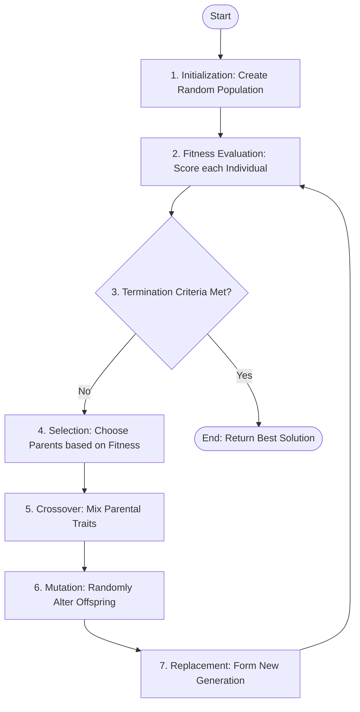

---
tags:
- field/cs
- subject/ai
- concept/genetic-algorithms/workflow
---

[[T.O.C (Artificial Intelligence Notes)|Up to AI Notes]]

# 2.2.3 - GA Workflow

> **Seed:** "Construct a detailed flowchart in mermaid for the whole workflow of a genetic algorithm. Then take each step and explain it in depth (No technical details)"
> **Lens:** The Architect / Modularity

## 1. Requirements Analysis

A Genetic Algorithm (GA) is an optimization and search system modeled after the mechanics of biological evolution. Its primary purpose is to find "optimal" or "near-optimal" solutions to complex problems where the search space is too vast for traditional exhaustive methods.

*   **Functional Requirements:** The system must generate a diverse pool of candidates, evaluate their quality using a objective metric, and simulate "survival of the fittest" to produce superior offspring over successive generations.
*   **Non-functional Requirements:** The system must be robust (capable of escaping local optima), adaptable (usable across different problem domains), and scalable (handling increasing population sizes).
*   **Assumptions:** We assume that a "Fitness Function" can be defined—a way to mathematically or logically score how "good" any given solution is compared to others.

## 2. High-Level Architecture

The GA workflow is a cyclic, iterative engine. It starts with chaos (randomness) and moves toward order (optimization) through repeated refinement.

### Component Responsibilities
1.  **Initialization:** The "Birth" phase where the first batch of solutions is created from scratch.
2.  **Fitness Evaluation:** The "Testing" phase where every candidate is put through a performance review.
3.  **Termination Check:** The "Decision" phase to determine if the goal is reached or time has run out.
4.  **Selection:** The "Mating" phase where the best-performing solutions are granted the right to reproduce.
5.  **Crossover:** The "Inheritance" phase where traits from two parents are blended to create offspring.
6.  **Mutation:** The "Innovation" phase where random, unexpected changes are introduced to maintain variety.
7.  **Replacement:** The "Succession" phase where the new generation takes over the environment from the old.

## 3. Data Model

The system treats information as a hierarchy, moving from individual traits to an entire ecosystem of solutions.

| Entity | Description | Analogy |
| :--- | :--- | :--- |
| **Gene** | The smallest unit of information; a single setting or variable. | A single ingredient in a recipe. |
| **Chromosome** | A complete string of genes representing one full solution. | A complete recipe for a cake. |
| **Population** | A collection of many different chromosomes (solutions). | A cookbook containing 100 different cake recipes. |
| **Fitness Score** | A numerical value representing the quality of a solution. | The star rating a judge gives to a finished cake. |

## 4. Key Design Decisions & Step Explanations

The workflow functions like a high-speed breeding program. Instead of breeding dogs for speed or flowers for color, the GA "breeds" computer code or mathematical parameters for performance.

### Step-by-Step Deep Dive (Non-Technical)

*   **Initialization (The Starting Seed):** We begin by generating a group of random guesses. These are usually not very good, but they provide a "raw material" pool. It is like a brainstorm where every idea, no matter how wild, is written down on the whiteboard just to get started.
*   **Fitness Evaluation (The Performance Review):** Each solution is tested against the problem. If the goal is to design a fuel-efficient engine, we simulate how much fuel each design uses. This generates a "scorecard" that tells the system which designs are winners and which are losers.
*   **Selection (Survival of the Fittest):** We look at the scorecards and pick the best designs to be "parents." However, we don't just pick the #1 winner; we use a lottery system where better scores give you more "tickets." This ensures that even "okay" designs have a small chance to pass on their genes, which keeps the gene pool from getting too narrow.
*   **Crossover (Combining Best Parts):** We take two parent solutions and swap their parts. If Parent A has a great "engine" but a bad "body," and Parent B has a bad "engine" but a great "body," their child might inherit the great engine and the great body. This is how the system "evolves" toward perfection by merging successful traits.
*   **Mutation (The Wild Card):** Every once in a while, we change a tiny part of a solution at random—something that neither parent had. This is crucial for innovation. Without mutation, the population might stop improving because it simply ran out of new ideas. Mutation introduces "happy accidents" that might lead to a breakthrough.
*   **Replacement (The New Generation):** Once we have a new batch of offspring, they replace the old, less-fit population. The cycle starts again with this new, slightly "smarter" group.

**Real-world analogy:** Imagine a factory trying to design the perfect paper airplane. They start with 100 random folds (Initialization). They throw them all (Evaluation). They pick the 10 that flew the farthest (Selection). They copy the wing shape from one and the nose fold from another to make 100 new planes (Crossover). They occasionally crumple a corner or shorten a wing just to see what happens (Mutation). Eventually, through hundreds of "flights," they end up with a plane that flies perfectly.

## 5. Failure Modes & Scaling

*   **Premature Convergence (The Echo Chamber):** If the selection process is too aggressive, the entire population might become identical clones of a "pretty good" solution very quickly. This stops the evolution before it finds the "best" solution. It's like a company that only hires people with the exact same background—they eventually stop coming up with new ideas.
*   **Genetic Drift:** In small populations, high-quality traits might be lost purely by bad luck or an unlucky mutation.
*   **Computational Bottleneck:** As the problem gets more complex, the "Evaluation" step becomes more expensive. If testing a bridge design takes a week of simulation, the GA will take years to find an answer. Optimization of the evaluation engine is usually the first priority when scaling.

> **Seed:** "Construct a table and draw parallels between concepts of genetics and natural selection and genetic algorithms with detailed examples"

## Mapping Biology to Computation
Genetic Algorithms (GAs) are not merely inspired by biology; they are a mathematical abstraction of the Darwinian process. They treat optimization problems as environments where candidate solutions compete for survival. By simulating inheritance, mutation, and selection, GAs navigate complex search spaces that are often resistant to traditional calculus-based methods.

## Comparison Table: The Bio-Digital Parallel

| Dimension | Biological Concept | Genetic Algorithm (GA) Concept | Functional Role in GA |
| :--- | :--- | :--- | :--- |
| **Foundation** | Individual / Organism | Candidate Solution | A single point in the search space. |
| **Data Storage** | Chromosome | Bit-string / Vector / Array | The data structure encoding the potential solution. |
| **Feature** | Gene | Variable / Index / Bit | A specific parameter or feature within the solution. |
| **Encoding** | Genotype | Encoded Data (Binary/Real) | The underlying representation (e.g., `10110`). |
| **Expression** | Phenotype | Decoded Solution | The actual value used in the problem (e.g., `x = 2.5`). |
| **Environment** | Ecosystem | Fitness Function / Objective | The "ruler" that measures how well a solution performs. |
| **Reproduction** | Crossover / Recombination | Crossover Operator | Merging parts of two "parent" solutions to create "offspring." |
| **Variation** | Mutation | Mutation Operator | Randomly flipping bits to prevent premature convergence. |
| **Survival** | Natural Selection | Selection Strategy | Choosing the best solutions to populate the next generation. |

## Deep Dive: Mechanics of Evolution

### 1. From Genotype to Phenotype
In biology, the genotype (DNA) dictates the phenotype (physical traits). In GA, the mapping is critical for the search to be effective. 
*   **Example:** In a structural engineering optimization (e.g., bridge design), the **genotype** might be a 64-bit string representing material thicknesses. The **phenotype** is the physical bridge model built with those thicknesses. The fitness function then subjects that phenotype to simulated stress tests to see if it collapses.

### 2. The Fitness Landscape
In nature, fitness is the ability to survive long enough to reproduce. In GAs, fitness is a numerical score derived from an objective function.
*   **The Parallel:** Just as a cheetah must be fast to catch prey (survival trait), a scheduling algorithm must minimize conflicts (fitness trait). If a solution has high "conflicts," its fitness score is low. In a "Roulette Wheel Selection" strategy, this solution occupies a smaller slice of the wheel, meaning its "genes" are unlikely to be passed to the next generation.

### 3. Crossover vs. Mutation: Exploration vs. Exploitation
*   **Crossover (Exploitation):** This mimics sexual reproduction. By combining the best traits of two successful parents, we hope to produce a "super-individual" that inherits the strengths of both. 
    *   *Mechanism:* A "cut" is made at a specific point in the strings (e.g., after the 4th bit), and the tails are swapped between parents.
*   **Mutation (Exploration):** This is the safeguard against local optima. In biology, random mutations introduce entirely new traits. In GA, flipping a bit (0 to 1) or adding a small Gaussian noise to a real-valued parameter allows the algorithm to jump to a completely different part of the search space.
    *   *The Trade-off:* High mutation leads to a chaotic "random walk," while low mutation leads to "genetic drift" where the population becomes clones of a sub-optimal individual.

## Recommendation: When to Evolve?
While GAs are versatile, they are computationally expensive. The following framework should guide their application:

*   **Use Genetic Algorithms when:**
    *   The search space is massive, discontinuous, or has many local peaks (multi-modal).
    *   The objective function is "noisy" or lacks a mathematical derivative (making Gradient Descent impossible).
    *   The goal is to find a "sufficient" solution in a highly complex domain (e.g., NASA’s evolved antenna designs).

*   **Avoid Genetic Algorithms when:**
    *   The problem is convex or linear (use Simplex or Gradient Descent; they are orders of magnitude faster).
    *   Evaluation of the fitness function is computationally ruinous (e.g., running a 24-hour weather simulation for every individual in a population of 100 over 500 generations).
    *   The problem can be solved by simple greedy heuristics.

**Verdict:** Genetic Algorithms excel in "black-box" environments where the internal mechanics of the problem are unknown or too complex to model mathematically. They prioritize **robustness** and **global exploration** over the surgical, localized precision of traditional optimization.
