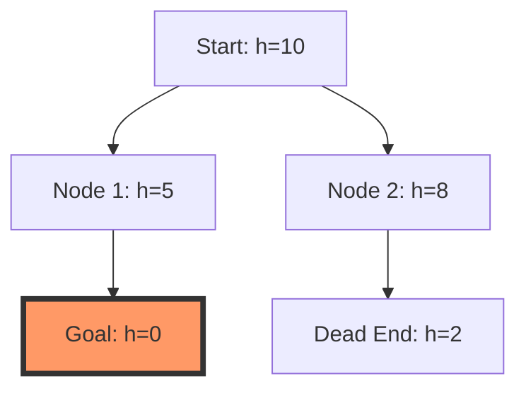

[[T.O.C (Artificial Intelligence Notes)|Up to AI Notes]]

> **Prompt:** "Write detailed notes on greedy search along with examples and diagrams"
> **Lens Applied:** The Optimizationist

# Algorithm: Greedy Best-First Search

## 1. The Logic (Visual Trace)
Greedy Best-First Search expands the node that is estimated to be closest to the goal, according to a heuristic function $h(n)$. Unlike A*, it ignores the cost already spent ($g(n)$).

### Decision Rule
Select node $n$ with minimum $h(n)$.



## 2. Complexity Analysis
*   **Time:** $O(b^m)$, where $m$ is the maximum depth of the search space. In the worst case, it explores the entire tree.
*   **Space:** $O(b^m)$, as it keeps all nodes in the fringe (frontier).
*   **Optimality:** **No**. It can get stuck in a path that looks good initially but is actually longer or leading to a dead end.
*   **Completeness:** **No** in infinite state spaces (it can loop). **Yes** in finite spaces if we track visited nodes.

## 3. Implementation (Optimized)
Using a Priority Queue for the fringe.

```python
import heapq

def greedy_best_first_search(graph, start, goal, h_func):
    frontier = []
    # Priority is based ONLY on h(n)
    heapq.heappush(frontier, (h_func(start), start))
    visited = set()

    while frontier:
        _, current = heapq.heappop(frontier)
        
        if current == goal:
            return True # Path found
            
        if current not in visited:
            visited.add(current)
            for neighbor in graph.neighbors(current):
                if neighbor not in visited:
                    heapq.heappush(frontier, (h_func(neighbor), neighbor))
    return False
```

## 4. Edge Cases (The Inversionist)
*   **The "False Lead":** A path might start with a low $h(n)$ but then skyrocket in cost or lead to a dead end. Greedy will follow it blindly.
*   **Cycles:** If not tracking visited states, Greedy can loop between two states that have lower heuristics than their neighbors.
*   **Comparison with A*:** Greedy is usually faster (expands fewer nodes) but sub-optimal. A* is optimal but expands more nodes.
