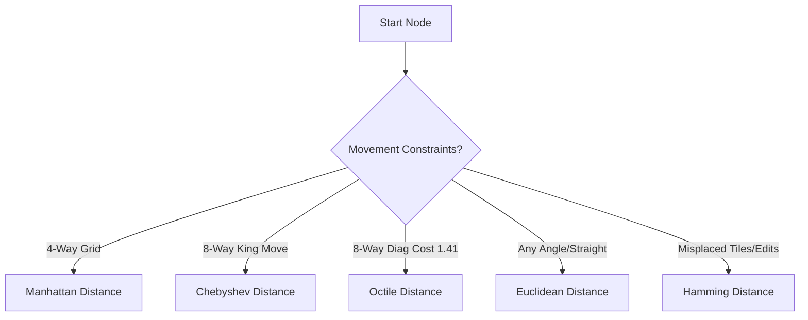

[[T.O.C (Artificial Intelligence Notes)|Up to AI Notes]]

> **Prompt:** "Explain in detail the applications of heuristic functions in search and all possible cases of applications keeping in mind the types of distances. How can we decide deterministically which type of distance to use in a scenario. Use examples for each type. Draw mermaid diagrams for explanations"
> **Lens Applied:** The Chief Engineer / First Principles

# Deep Dive: Heuristic Functions ($h(n)$)

## 1. Ontological Definition
A **Heuristic Function** $h(n)$ is an informed estimation of the cost to reach a goal from a given state $n$. In the context of search, it serves as a mathematical proxy for future costs that have not yet been incurred.

### Core Properties
*   **Admissibility:** $h(n) \le h^*(n)$, where $h^*(n)$ is the true optimal cost. It never overestimates.
*   **Consistency (Monotonicity):** $h(n) \le c(n, a, n') + h(n')$. The estimated cost from $n$ is no greater than the step cost to $n'$ plus the estimated cost from $n'$.

## 2. The Internal Mechanics (Types of Distances)
The choice of heuristic is typically governed by the geometry of the search space.

### A. Manhattan Distance ($L_1$ Norm)
Used when movement is restricted to a grid with only 4 directions (Up, Down, Left, Right).
*   **Formula:** $h(n) = |x_1 - x_2| + |y_1 - y_2|$
*   **Example:** 8-Puzzle, Robot in a warehouse with orthogonal aisles.

### B. Euclidean Distance ($L_2$ Norm)
Used when movement is possible at any angle (straight line).
*   **Formula:** $h(n) = \sqrt{(x_1 - x_2)^2 + (y_1 - y_2)^2}$
*   **Example:** Flight path between cities, bird-eye navigation.

### C. Chebyshev Distance ($L_\infty$ Norm)
Used when movement is allowed in 8 directions (including diagonals), where a diagonal move costs the same as an orthogonal move.
*   **Formula:** $h(n) = \max(|x_1 - x_2|, |y_1 - y_2|)$
*   **Example:** King's movement in Chess.

### D. Octile Distance
Used for 8-directional movement where diagonals cost $\sqrt{2}$.
*   **Formula:** $h(n) = (dx + dy) + (\sqrt{2} - 2) \cdot \min(dx, dy)$

## 3. Systems Context & Deterministic Decision
How do we decide **deterministically**? We analyze the **Relaxed Problem**. A heuristic is the exact solution to a version of the problem where some constraints are removed.

1.  **IF** diagonal moves are illegal -> **Manhattan**.
2.  **IF** diagonal moves are legal and cost 1 -> **Chebyshev**.
3.  **IF** diagonal moves are legal and cost 1.41 -> **Octile**.
4.  **IF** rotation is fluid and distance is point-to-point -> **Euclidean**.

**Performance Note:** Euclidean distance involves a square root operation which is computationally expensive on CPUs compared to simple additions in Manhattan. In game loops, Manhattan or a squared-Euclidean approximation is often preferred.

## 4. Edge Cases & Constraints
*   **Dominance:** If $h_2(n) \ge h_1(n)$ for all $n$, then $h_2$ is more "informed" and will expand fewer nodes.
*   **Zero Heuristic:** If $h(n) = 0$, the algorithm becomes Uniform Cost Search (Breadth-First for unit costs).
*   **Overestimation:** Breaking admissibility leads to faster search but loses the guarantee of finding the shortest path.