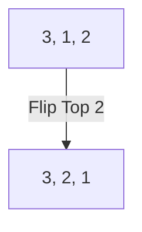

[[T.O.C (Artificial Intelligence)|Up to Artificial Intelligence]]

> **Prompt:** "Explain in detail the pancake problem and then define an example with a step by step solution along with explanation of each step with mermaid diagrams at each step"
> **Lens Applied:** The Optimizationist

# Algorithm: The Pancake Sorting Problem

## 1. The Logic (Visual Trace)
The Pancake Problem involves sorting a stack of pancakes of different sizes using a spatula that can flip the top $k$ pancakes. The goal is to reach a state where the pancakes are ordered by size (smallest on top).

### Step-by-Step Example
**Initial State:** `[3, 1, 2]` (Bottom is right: 3 is the largest, currently at the bottom but we want the stack sorted as `[3, 2, 1]` if 3 is bottom, or `[1, 2, 3]` if 1 is top. Standard definition: Smallest on top).

**Target:** `[1, 2, 3]`

#### Step 1: Locate the largest out-of-place pancake.
Pancake `3` is already at the bottom. Correct.
Look at the remaining stack: `[3, 1, 2]`. The largest remaining is `2`. It is at index 2 (top).

#### Step 2: Flip the largest to the top (if not already there).
`2` is already at the top.

#### Step 3: Flip it to its correct position.
We want `2` at the second position from the bottom.
Flip the top 2: `[3, 1, 2]` $
ightarrow$ Flip(2) $
ightarrow$ `[3, 2, 1]`.



#### Step 4: Final Check.
Stack is now `[3, 2, 1]`. Smallest (1) is at the top. Done.

## 2. Complexity Analysis
* **Time:** $O(n)$ flips in the worst case (specifically, at most $2n-3$ flips for $n > 3$). Each flip takes $O(n)$ time to reverse the array. Total: $O(n^2)$.
* **Space:** $O(n)$ to store the stack.

## 3. Implementation (Optimized)
```python
def flip(stack, k):
    # Flip the top k pancakes
    stack[:k] = stack[:k][::-1]

def pancake_sort(stack):
    n = len(stack)
    for curr_size in range(n, 1, -1):
        # Find index of the largest unsorted pancake
        max_idx = stack.index(max(stack[:curr_size]))
        
        if max_idx != curr_size - 1:
            # Move it to the top
            if max_idx != 0:
                flip(stack, max_idx + 1)
            # Move it to its correct position
            flip(stack, curr_size)
    return stack
```

## 4. Edge Cases (The Inversionist)
* **Already Sorted:** The algorithm should perform 0 flips.
* **Reverse Sorted:** Requires $n-1$ flips if done optimally.
* **Duplicate Sizes:** Indexing `max()` needs to be careful to pick the same one consistently.
* **Single Pancake:** $n=1$ is a trivial base case.
