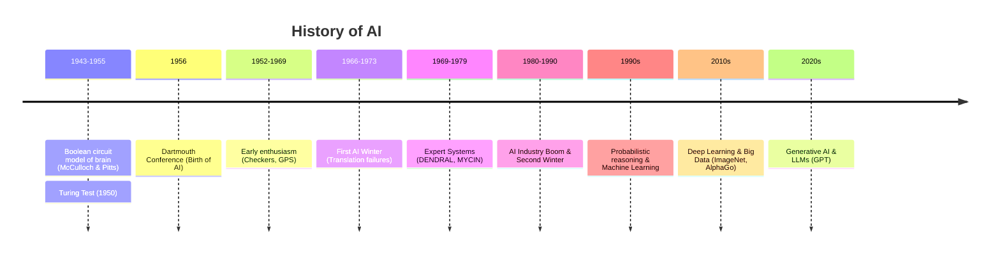

# What is AI

[[T.O.C (Artificial Intelligence Notes)|Up to AI Notes]]

## Definition
Artificial Intelligence (AI) is broadly defined as the simulation of human intelligence processes by machines, especially computer systems. The field is generally divided into four main goals/approaches:
1.  **Acting Humanly:** The Turing Test approach.
2.  **Thinking Humanly:** The cognitive modeling approach.
3.  **Thinking Rationally:** The "laws of thought" approach.
4.  **Acting Rationally:** The rational agent approach.

**Equation:** Machine + Intelligence = Artificial Intelligence

## What is Intelligence?
In the context of AI, intelligence is often characterized by:
-   The ability to solve problems.
-   The ability to act rationally (achieving goals).
-   The ability to act like humans (adaptation, learning).

## Gemini

### Defining AI
**The Most Accurate Definition:**
Among the four common categorizations (Acting Humanly, Thinking Humanly, Thinking Rationally, Acting Rationally), **"Acting Rationally"** (Rational Behavior) is often considered the most robust and scientifically amenable definition for modern AI engineering.

*   **Why?** It focuses on the *outcome* (doing the right thing to achieve a goal) rather than the *mechanism* (mimicking human thought, which is biological and complex) or *perfect logic* (which is often impossible in the real world due to uncertainty). A rational agent is one that acts so as to achieve the best outcome or, when there's uncertainty, the best expected outcome.

**Analogy:**
Think of an AI system like a **autopilot in a plane**.
*   *Acting Humanly:* Would mean the autopilot makes chatty conversation or occasionally gets tired. (Not desired).
*   *Thinking Rationally:* Would mean the autopilot solves complex logic proofs about aerodynamics but might forget to adjust the flaps.
*   *Acting Rationally:* The autopilot adjusts controls to keep the plane stable and on course, regardless of "how" it thinks, optimizing for safety and fuel efficiency.

### John McCarthy on AI
John McCarthy, the father of AI who coined the term in 1956, defined it as:
> "The science and engineering of making intelligent machines, especially intelligent computer programs."

He clarified that while it is related to the similar task of using computers to understand human intelligence, AI has to not confine itself to methods that are biologically observable.

### History of AI: A Story
**The Gestation (1943-1955):** It began with Warren McCulloch and Walter Pitts proposing a model of artificial neurons. In 1950, Alan Turing published "Computing Machinery and Intelligence," introducing the Turing Test.

**The Birth (1956):** The field was officially born at the **Dartmouth Conference** in 1956, attended by McCarthy, Minsky, Shannon, and Rochester. They predicted that "every aspect of learning or any other feature of intelligence can in principle be so precisely described that a machine can be made to simulate it."

**Early Enthusiasm (1952-1969):** The "Look, Ma, no hands!" era. Computers solved algebra word problems, proved geometry theorems, and learned to play checkers. The General Problem Solver (GPS) was developed.

**A Dose of Reality (1966-1973):** "AI Winter" approached. Researchers realized that simple algorithms didn't scale. Translation failed (the "spirit is willing but the flesh is weak" translation fiasco).

**Knowledge-Based Systems (1969-1979):** The rise of **Expert Systems** (like DENDRAL and MYCIN). Instead of general reasoning, these systems used domain-specific rules.

**AI Becomes an Industry (1980-Present):** The return of Neural Networks (Backpropagation), the rise of Machine Learning, Big Data, and eventually Deep Learning. AI beat the World Chess Champion (Deep Blue, 1997) and Go Champion (AlphaGo, 2016).

## Connections
- [[The Turing Test]]
- [[AI vs ML vs DL]]
