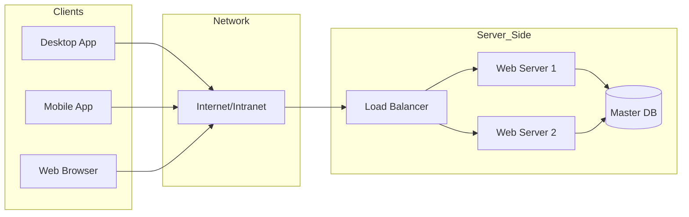

# Client-Server Architecture

[[T.O.C (DB lab Notes)|Up to DB Lab Notes]]

## The Kernel Architect: System Analysis
**Identity:** Principal Software Engineer.
**Baseline:** Compare to C++ Sockets & File Descriptors.

### 1. The Atoms: Client & Server
In C++, a "Client" is simply a process calling `connect()`, and a "Server" is a process blocking on `accept()`.

#### A. The Client (The Requester)
*   **Definition:** A process that initiates communication. It is active.
*   **Properties:**
    *   **Ephemeral Ports:** It usually binds to a random high-numbered port (e.g., 54321) assigned by the OS.
    *   **State:** Can be Stateless (HTTP) or Stateful (SSH/Telnet).
    *   **Resource Limited:** Typically runs on consumer hardware; relies on the server for heavy computation.
*   **Under the Hood:** It wraps data into packets, pushes them to the NIC buffer, and waits (blocks or yields) for an ACK/Response.

#### B. The Server (The Provider)
*   **Definition:** A process that waits for incoming requests. It is passive until poked.
*   **Properties:**
    *   **Well-Known Ports:** Binds to static ports (HTTP:80, SQL:1433, PostgreSQL:5432).
    *   **Concurrency:** Must handle multiple clients simultaneously.
        *   *Forking:* (Old Linux) One process per client. Heavy RAM usage.
        *   *Threading:* One thread per client. Context switch overhead.
        *   *Event Loop (epoll/kqueue):* (Node.js/Nginx) Single thread, non-blocking I/O.
*   **Availability:** Designed for 99.999% uptime. often clustered behind Load Balancers.

### 2. Client-Server Model (Request-Response)
This is the fundamental architecture of the modern web and database access.

#### The Flow (TCP/IP Context)
1.  **Handshake:** Client sends `SYN`. Server sends `SYN-ACK`. Client sends `ACK`. (Connection Established).
2.  **Request:** Client sends a query (e.g., SQL `SELECT`).
3.  **Processing:** Server reads network buffer, parses SQL, checks cache, reads disk, computes result.
4.  **Response:** Server writes result to socket.
5.  **Teardown:** `FIN` / `ACK`.

#### Pros & Cons
| Feature | Client-Server | Peer-to-Peer (P2P) |
| :--- | :--- | :--- |
| **Centralization** | **High:** One source of truth. Easy to manage security/backups. | **None:** Distributed truth (like BitTorrent or Blockchain). |
| **Scalability** | **Vertical:** Buy a bigger server. **Horizontal:** Harder (Sharding). | **Organic:** The more nodes, the more capacity. |
| **Reliability** | **Single Point of Failure:** If Server dies, everyone waits. | **Robust:** If one node dies, others take over. |
| **Complexity** | Lower. | Extremely High (Consensus algorithms, Gossip protocols). |

#### Architecture Diagram

