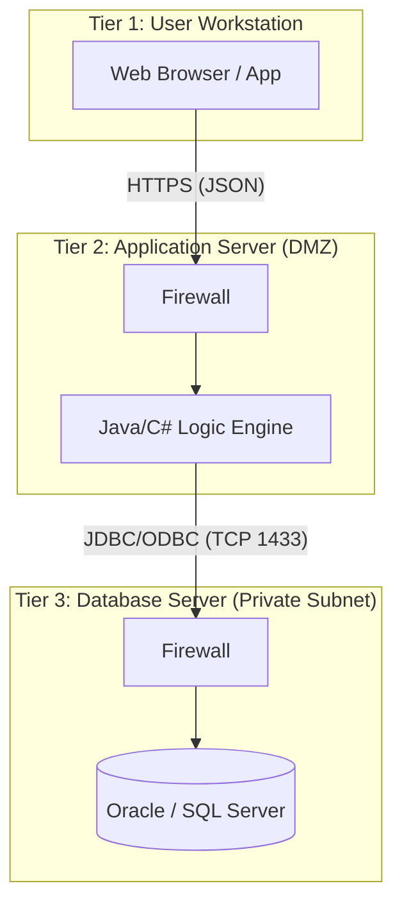

# 3-Tier Architecture

[[T.O.C (DB lab Notes)|Up to DB Lab Notes]]

## The Kernel Architect: Deep Dive
**Perspective:** Enterprise System Design.
**Focus:** Decoupling & Security Boundaries.

### 1. Anatomy of the 3-Tier Model
The standard Client-Server model is often "2-Tier" (Thick Client -> DB). This is dangerous because the Client holds the DB credentials.
The **3-Tier Model** injects a "Middleman" (Middleware) to sanitize and process requests.

#### Tier 1: Presentation Layer (The UI)
*   **What:** HTML/CSS/JS (React, Angular) or a Mobile App View.
*   **Responsibility:** Rendering data. **Zero Business Logic.**
*   **Protocol:** HTTPS / JSON.
*   **Knowledge:** It knows *nothing* about the Database. It only knows the API endpoints.

#### Tier 2: Application/Business Logic Layer (The Brain)
*   **What:** Java Spring Boot, Python Django, Node.js, C# ASP.NET.
*   **Responsibility:**
    *   **Authentication/Authorization:** "Is this user allowed to delete this row?"
    *   **Validation:** "Is the email format valid?"
    *   **Transaction Management:** "Deduct money from A, add to B. If B fails, rollback A."
*   **Protocol:** JDBC / ODBC / ORM (Hibernate).

#### Tier 3: Data Layer (The Vault)
*   **What:** Oracle, SQL Server, PostgreSQL, MongoDB.
*   **Responsibility:** ACID Storage, Indexing, Referential Integrity.
*   **Constraint:** Only accepts connections from the App Layer IPs.

### 2. Why is it More Secure? (The Firewall Gap)
In a 2-Tier app, the Database Port (e.g., 3306) must be open to the world so clients can connect.
In a 3-Tier app:
1.  **Attack Surface Reduction:** The Database is placed in a **Private Subnet**. It has **NO public IP**.
2.  **SQL Injection Shield:** The App Layer uses Parameterized Queries (PreparedStatement). Even if a user types `' OR 1=1 --` in the UI, the App Layer treats it as a literal string before sending it to the DB.
3.  **Credential Isolation:** The Users (Tier 1) never see the DB password. Only the Server (Tier 2) has the `db_password` in its environment variables.

### 3. Pros & Cons Table
| Feature | 2-Tier (Client -> DB) | 3-Tier (Client -> App -> DB) |
| :--- | :--- | :--- |
| **Performance** | **Fast:** Direct connection. | **Latency:** Extra hop (Network overhead). |
| **Maintainability** | **Poor:** Logic is hardcoded in the client. Update requires user to reinstall app. | **Excellent:** Update the API server, and all clients get the new logic instantly. |
| **Scalability** | Limited by DB connections. | **High:** App Layer can pool connections (Connection Pooling). |

### 4. Real World Example: Banking
*   **Tier 1 (Mobile App):** You tap "Transfer $50". App sends JSON `POST /api/transfer {amount: 50}` to Server.
*   **Tier 2 (Bank Server):**
    *   Checks Session Token.
    *   Checks Balance > 50.
    *   Checks Daily Limit.
    *   Opens Transaction.
*   **Tier 3 (Mainframe DB):** Executes `UPDATE accounts SET balance = balance - 50...`.

### 5. Visual Flow

