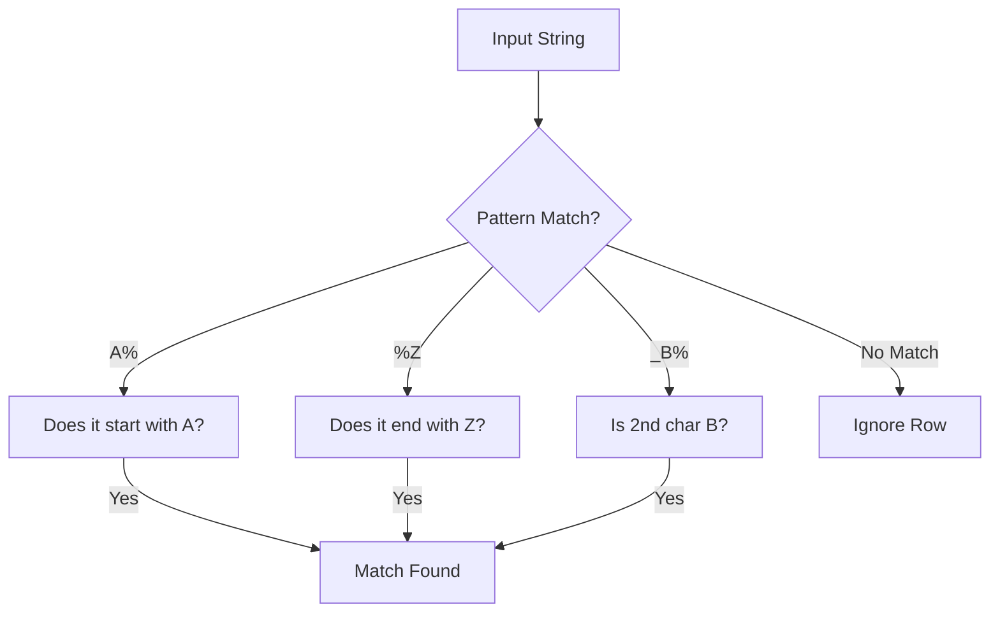

---
tags:
- field/cs
- subject/database
- concept/sql/pattern
---

# SQL Pattern Matching

[[T.O.C (Database Systems Notes)|Up to Database Systems Notes]]

#concept #sql #pattern-matching

## 1. Pattern Matching Concepts

> **Prompt:** "Explain in detail the concept of pattern matching with all possible cases and the explanation of each case in detail with real world examples and mermaid diagrams. Make sure the explanations are textbook like with no case missing even the edge cases should be there"
> **Lens Applied:** The Chief Engineer / The Algorithmist

# Technical Breakdown: Pattern Matching (LIKE Operator)

### 1. Ontological Definition
Pattern matching in SQL allows for the retrieval of data based on partial matches rather than exact values. It is the "fuzzy search" of the relational world, primarily implemented using the `LIKE` operator and wildcard characters.

### 2. The Mechanics (Wildcards)
*   **`%` (Percent):** Represents zero, one, or multiple characters.
*   **`_` (Underscore):** Represents exactly one single character.

### 3. Case Matrix & Examples

| Case Type | Pattern | Logic | Example Match |
| :--- | :--- | :--- | :--- |
| **Starts With** | `'S%'` | Any string beginning with 'S' | 'Smith', 'S', 'SQL' |
| **Ends With** | `'%n'` | Any string ending with 'n' | 'Admin', 'n', 'Python' |
| **Contains** | `'%or%'` | String containing 'or' anywhere | 'Jordan', 'Oracle', 'Floor' |
| **Fixed Length** | `'___'` | Exactly 3 characters | 'ABC', '123' |
| **Position Based** | `'_a%'` | 'a' must be the 2nd character | 'James', 'Data' |
| **Edge Case: Empty** | `'%'` | Matches everything (except NULL) | All non-null rows |

### 4. Logic Flow (Mermaid)

---

## 2. The 'LIKE' Keyword

> **Prompt:** "Explain in detail the keyword 'like' and pattern matching"
> **Lens Applied:** The Chief Engineer

The `LIKE` operator is used in a `WHERE` clause to search for a specified pattern in a column. 
*   **Syntax:** `SELECT column FROM table WHERE column LIKE pattern;`
*   **Case Sensitivity:** In many SQL implementations (like MySQL or SQL Server), `LIKE` is case-insensitive by default. In PostgreSQL, `LIKE` is case-sensitive, and `ILIKE` is used for case-insensitive matches.

---

## 3. Wildcard Symbols

> **Prompt:** "Explain in detail the symbols % _ and any others in the concept of pattern matching"
> **Lens Applied:** The Optimizationist

### 1. The Percent Symbol (%)
Acts as a multi-character wildcard. It is a "don't care" marker for the rest of the string.
*   **Cost:** High. `LIKE '%value%'` prevents the use of Indexes (Full Table Scan), whereas `LIKE 'value%'` can often use an Index.

### 2. The Underscore Symbol (_)
Acts as a single-character placeholder. Useful for fixed-format identifiers (e.g., product IDs like `PROD_1`, `PROD_2`).

### 3. The Escape Character
What if you want to search for an actual `%` or `_` character?
*   **Solution:** Use an escape character (usually `\`).
*   **Example:** `WHERE discount LIKE '10\%' ESCAPE '\';` (Matches exactly "10%").
