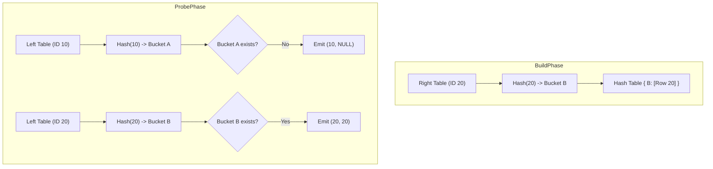

---
tags:
- field/cs
- subject/database
- concept/sql/joins
---

[[T.O.C (Database Systems Notes)|Up to Database Systems Notes]]

# Computer Science - Database JOIN Strategies

## 1. The Core Intuition

A `LEFT OUTER JOIN` is a **preservation join**. Its primary mission is to ensure that no row from the "Outer" (Left) table is discarded, regardless of whether a matching partner exists in the "Inner" (Right) table. 

Think of it like a **Factory Inspection Line**: Every product (Left row) must pass through the inspection station (the Join). If the product has a matching quality report (Right row), the report is attached. If no report is found, the product is not thrown away; it simply moves forward with an empty "NULL" clipboard attached to it.

Unlike an `INNER JOIN`, which acts as a filter (Intersection), the `LEFT OUTER JOIN` acts as an enrichment process with a fallback.

---

## 2. Strategy 1: Nested Loop Join (NLJ)

The Nested Loop Join is the fundamental algorithm for joining data. It is the fallback when no indexes or hash-friendly conditions are available.

### Internal Logic
The engine iterates through the Left table (Outer loop) and, for every single row, scans the entire Right table (Inner loop).

**The "Outer" Modification:**
In a standard inner join, if the inner loop finishes without a match, the outer row is dropped. In a `LEFT OUTER JOIN`, the engine maintains a boolean flag `matched` for each outer row. If the flag remains `false` after exhausting the inner loop, a row is emitted with the Left data and `NULL` values for all Right columns.

### Visual Trace
**Table L (IDs):** `[10, 20]`
**Table R (IDs):** `[20, 30]`

1.  **Outer Loop (Row 10):**
    *   Compare 10 with 20: No match.
    *   Compare 10 with 30: No match.
    *   Inner loop ends. `matched == false`.
    *   **Emit: (10, NULL)**
2.  **Outer Loop (Row 20):**
    *   Compare 20 with 20: **Match!**
    *   **Emit: (20, 20)**, set `matched == true`.
    *   Compare 20 with 30: No match.
    *   Inner loop ends.
3.  **Result:** `{(10, NULL), (20, 20)}`

### Complexity
-   **Time:** $O(L \times R)$
-   **Space:** $O(1)$ (In-place streaming)
-   **Efficiency:** Extremely poor for large tables unless the Right table join column is indexed (Index Nested Loop Join), which reduces the inner scan to $O(\log R)$.

---

## 3. Strategy 2: Hash Join

Hash joins are the workhorse for large-scale equi-joins ($=$ operator) where indexes are absent.

### Internal Logic
This strategy operates in two distinct phases: **Build** and **Probe**.

1.  **Build Phase:** The engine reads the Right table (usually the smaller one to fit in memory) and builds a hash table in RAM. The join key is hashed to determine the bucket, and the row is stored there.
2.  **Probe Phase:** The engine iterates through the Left table. For each row, it hashes the join key and looks up the corresponding bucket in the hash table.
    *   **If Match Found:** It iterates through the bucket and emits a row for every match.
    *   **If No Match Found:** It immediately emits the Left row combined with `NULL`s.

### Visual Trace (Mermaid)

### Complexity
-   **Time:** $O(L + R)$ (Linear scan of both tables)
-   **Space:** $O(R)$ (To store the hash table)
-   **Optimization:** If the hash table exceeds RAM, the engine uses **Grace Hash Join**, partitioning both tables into "spilled" disk buckets and joining them partition by partition.

---

## 4. Strategy 3: Sort-Merge Join

The Sort-Merge Join is most efficient when the tables are already sorted by the join key (e.g., they were retrieved via a B-tree index scan) or for range joins.

### Internal Logic
1.  **Sort Phase:** Both tables are sorted by the join key (if not already sorted).
2.  **Merge Phase:** Two pointers move through the tables in a single pass, much like the merge step in Merge Sort.

**Handling the "Outer" Logic:**
The engine advances the pointers. If the Left pointer's key is smaller than the Right pointer's key, it means the Left row has no partner in the sorted Right table. The engine emits the Left row with `NULL`s and increments the Left pointer.

### Complexity
-   **Time:** $O(L \log L + R \log R)$ for sorting + $O(L + R)$ for merging.
-   **Space:** $O(1)$ if sorted on disk; $O(L+R)$ if sorting in memory.
-   **Best Case:** If already sorted, it is $O(L + R)$ and highly CPU cache-friendly.

---

## 5. Summary & Strategy Selection

| Feature | Nested Loop Join | Hash Join | Sort-Merge Join |
| :--- | :--- | :--- | :--- |
| **Best Used For** | Small tables / Indexed Right table | Large, unindexed tables | Pre-sorted data / Range joins |
| **Join Condition** | Any (>, <, =, !=) | Equi-join (=) only | Equi-join and range joins |
| **Memory Usage** | Minimal | High (Hash Table) | Medium (Sort Buffer) |
| **Risk** | Exponential slowdown | Hash collisions / Spilling to disk | Heavy initial sort cost |

**The Optimizationist's Choice:**
The Database Optimizer (Query Planner) calculates the cost for each. It will prefer **Hash Join** for massive datasets without indexes, but will pivot to **Index Nested Loop Join** if the Left table is small and the Right table has a B-tree index on the join column, as this avoids reading the entire Right table.