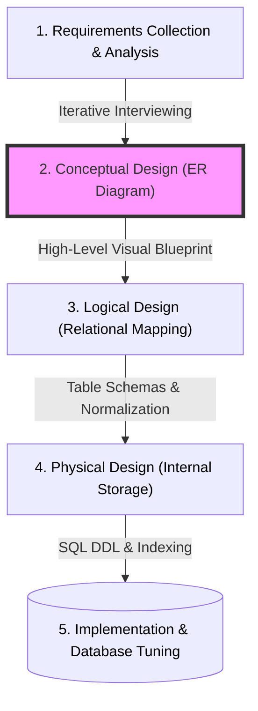
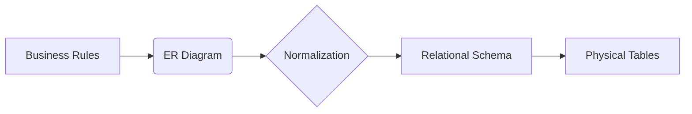

---
tags:
  - concept/er-diagram
  - field/cs
  - subject/database
---

[[T.O.C (Database Systems Notes)|Up to Database Systems Notes]]

# 2.2.1 - Intro to Entity Relation Diagram
## I. Introduction
> **Seed:** "Write an intro that is textbook style that introduces the problem that was solved by introducing ER diagrams"
> **Lens:** First Principles / The Chief Engineer

The Entity-Relationship (ER) model is a high-level conceptual data model used to define the data requirements and structures of a system in a format independent of specific database management system (DBMS) software or physical storage constraints. Introduced by Peter Chen in 1976, it serves as the essential bridge between informal, real-world information requirements and the formal, logical schema of a relational database.

## 1. Ontological Definition
An Entity-Relationship Diagram (ERD) is a structural diagram used in database design to represent the **semantic layer** of a system. It defines the discrete **Entities** (objects or concepts), their **Attributes** (properties), and the **Relationships** (associations) that exist between them. In the hierarchy of database design, the ER model exists at the **Conceptual Level**, functioning as a platform-agnostic representation that sits above the Logical (Relational) and Physical (Storage) levels.

## 2. The Internal Mechanics: Bridging the Semantic Gap
Before the formalization of the ER model, database design was often tethered directly to the underlying implementation—be it hierarchical, network, or early relational models. This created a "Semantic Gap": the distance between how humans perceive business logic (e.g., "A customer places an order") and how computers store bits (e.g., pointer offsets or table joins).

The ER model solves this by providing a standardized syntax for mapping real-world complexity into a mathematical structure. The internal logic follows a strict mapping process that converts conceptual requirements into a blueprint for the relational model:

*   **Entity Identification:** Identifying "things" that have an independent existence (e.g., `STUDENT`, `COURSE`).
*   **Relationship Mapping:** Defining the cardinality (1:1, 1:N, M:N) and participation (Mandatory vs. Optional) between entities.
*   **Attribute Assignment:** Attaching atomic data points to entities, ensuring data belongs to its natural "home."

### Mapping Logic (ER to Relational Transformation)
The transition from a conceptual ERD to a physical database follows a predictable set of transformations:

| ER Construct | Relational Construct |
| :--- | :--- |
| Regular Entity | Table |
| Attribute | Column |
| Primary Key | Primary Key Constraint |
| M:N Relationship | Associative (Junction) Table |
| 1:N Relationship | Foreign Key in the "Many" side Table |

Without this intermediate step, designers frequently encountered **Update, Insertion, and Deletion Anomalies** because they lacked a visual proof of data dependencies before they began writing DDL (Data Definition Language) scripts.

## 3. Systems Context: The Architectural Blueprint
Think of a database as a massive industrial warehouse.
*   **The Physical Level** is the actual concrete floor, the thickness of the steel shelves, and the specific barcode scanners used (The Disk/SSD and storage engine).
*   **The Logical Level** is the digital spreadsheet tracking which bin contains which item (The SQL Tables).
*   **The ER Diagram** is the **Architect's Blueprint**.

Just as an architect does not start a project by laying bricks, a database engineer does not start by writing `CREATE TABLE`. They use the ERD to ensure that the "rooms" (Entities) are logically connected and that the "hallways" (Relationships) can handle the expected traffic (Cardinality). If the blueprint shows a room with no door (an orphaned entity), the error is caught on paper for the cost of a pencil stroke, rather than in production where a schema change could cost thousands of dollars in downtime and data migration.

## 4. Edge Cases & Constraints
While powerful, the ER model has specific failure modes and boundary conditions when misapplied:

*   **The Fan Trap:** This occurs when a model represents a relationship between entity types, but the pathway between certain entity occurrences is ambiguous. For example, if a `DIVISION` has many `DEPARTMENTS` and a `DIVISION` has many `EMPLOYEES`, you cannot necessarily tell which employee belongs to which department through the division entity alone without a direct link.
*   **Recursive Relationships:** A common stumbling block is the "Self-Referencing" entity (e.g., an `EMPLOYEE` manages another `EMPLOYEE`). Failure to model this correctly results in a hierarchical break in the relational table, often leading to infinite loops in query execution if not properly constrained.
*   **Temporal Data Constraints:** Standard ERDs are "snapshots" in time. They struggle to model data that changes over time (e.g., tracking a product's `PRICE` history) without introducing complex "versioning" entities that can clutter the conceptual clarity of the diagram.

## II. What is an ER diagram?
> **Seed:** "Explain in the concept of ER diagrams, what's their purpose and then construct a detailed mermaid diagram that tells where does the step of constructing and ER diagram occur in database design process. Then provide an explanation of this diagram. Don't dive into technical specifics yet"
> **Lens:** The Architect / Modularity

## 1. Requirements Analysis

In the context of database engineering, the design process is a pipeline that refines abstract business needs into concrete technical structures. Before a single line of SQL is written, the system must satisfy these requirements:

- **Functional Requirements:** The design must identify all core business entities (the "actors"), define the rules of their interactions (the "logic"), and ensure that the data model can support all required application features.
- **Non-Functional Requirements:** The model must be **understandable** (readable by non-engineers), **accurate** (reflecting reality without redundancy), and **extensible** (capable of evolving as business rules change).
- **Assumptions:** We assume the presence of a "Mini-world"—a specific part of the real world that we are digitizing. We also assume a Top-Down design approach, where conceptual understanding precedes physical implementation.

## 2. High-Level Architecture: The Database Design Process

Constructing an Entity-Relationship (ER) diagram is the cornerstone of the **Conceptual Design** phase. It acts as the bridge between human language (Requirements) and technical implementation (The Schema).

### Explanation of the Process
1.  **Requirements Analysis:** Raw data is gathered from stakeholders. No technical modeling happens here; it is purely about understanding the business domain.
2.  **Conceptual Design (The ERD Step):** This is where the ER diagram is created. Designers identify "Entities" (Nouns) and "Relationships" (Verbs). It is **DBMS-independent**, meaning it doesn't matter if you're eventually using MySQL, Oracle, or PostgreSQL.
3.  **Logical Design:** The abstract ER diagram is converted into a series of tables (the Relational Model). This is where foreign keys and primary keys are formally defined.
4.  **Physical Design:** The design is optimized for a specific database engine, determining how data is stored on the actual disk (SSD/HDD) and which indexes are needed for speed.

## 3. The Conceptual Data Model (ERD)

The ER Model views the database as a "Mini-world" consisting of three fundamental building blocks:

- **Entities:** These are the "objects" or "things" that exist independently (e.g., an Employee, a Department, a Project).
- **Attributes:** These are the properties or characteristics that describe an entity (e.g., an Employee's Name, Salary, or Hire Date).
- **Relationships:** These are the associations between entities (e.g., an Employee **works for** a Department).

An ER Diagram is simply the graphical notation used to visualize these concepts. Its primary **purpose** is communication. It allows developers to show a "picture" of the data to a business owner to confirm: *"Is this how your business actually works?"*

## 4. Key Design Decisions

- **Decision:** Separate Conceptual Design (ERD) from Logical Design (Tables).
- **Alternative:** Jumping straight into a Database Management System (DBMS) and creating tables.
- **Rationale:** Coding tables immediately forces you to think about data types (Integers, Varchars) and nullability before you've even confirmed if you need the table at all. ERDs allow for "cheap" mistakes—fixing a line on a diagram is free; restructuring a live database with millions of rows is an expensive disaster.

**Real-world Analogy:** An ER diagram is the **blueprints for a house**. You don't start by pouring concrete or buying window frames (Physical/Logical design). You first draw the floor plan to ensure the kitchen is next to the dining room and the bathrooms are accessible. If the "blueprint" is wrong, you simply erase a line. If the "concrete" is wrong, you have to bring in a wrecking ball.

## 5. Failure Modes & Scaling

- **Redundancy Failure:** Without an ERD, designers often create "flat" files where the same data is repeated everywhere. This leads to **Update Anomalies** (changing a price in one place but forgetting the other four).
- **Rigidity Bottleneck:** A database built without a conceptual map is often too rigid. When the business grows (e.g., moving from one office to ten), a poorly planned schema often breaks, requiring a total system migration.
- **The "Lost in Translation" Bug:** If the developers and stakeholders don't have a visual ERD to agree upon, the final product often stores the wrong data, leading to a system that technically works but is business-useless.
## III. Purpose of an ER diagram
> **Seed:** "Explain in detail the uses and purposes of an ER diagram in term of constructing databases. Don't dive into technical specifics yet."
> **Lens:** First Principles / The Chief Engineer

## 1. Ontological Definition

An Entity-Relationship Diagram (ERD) is a high-level conceptual data model that visualizes the logical structure of a database through the identification of discrete objects (**entities**), their characteristic properties (**attributes**), and the semantic associations (**relationships**) between them. It serves as the primary bridge between natural language business requirements and the formal, structured environment of a Database Management System (DBMS).

## 2. The Internal Mechanics (Design Logic)

The "mechanics" of an ERD lie in its ability to translate chaotic real-world requirements into a deterministic structure. It operates as a semantic compiler for database architecture:

*   **Semantic Parsing:** The ERD process extracts nouns (Entities like `Customer` or `Order`), verbs (Relationships like `Places` or `Contains`), and descriptors (Attributes like `Address` or `Total_Price`) to build a map of the information domain.
*   **Cardinality and Modality:** The diagram enforces the "laws" of the system. It defines how many instances of one entity can associate with another (e.g., one customer can have many orders, but one order belongs to only one customer). This prevents data orphans and ensures referential integrity before a single line of code is written.
*   **Abstraction Layering:** It separates "what" the data is from "how" it is stored. By ignoring data types (integers, varchars) and storage engines (InnoDB, MyISAM), the designer can focus purely on the logical validity of the business model.

**The Design Pipeline:**

## 3. Systems Context & Anchoring

An ERD is functionally equivalent to an **Architectural Blueprint for a Skyscraper**.

*   **Entities (The Rooms):** Just as a blueprint identifies rooms (Kitchen, Lobby, Office), the ERD identifies data containers. Each has a boundary and a specific purpose.
*   **Attributes (The Specs):** These are the details of the room, such as "Floor Material" or "Number of Outlets." In a database, these are the individual data points that describe an entity.
*   **Relationships (The Hallways):** These define the flow. You cannot get from the Lobby to the 50th floor without an elevator (relationship). The ERD maps these pathways so the system knows how to navigate from a `Product` to its `Supplier`.
*   **Constraints (Building Codes):** A building code might state "A bedroom must have an emergency exit." Similarly, an ERD constraint might state "An invoice cannot exist without a corresponding customer."

Without the blueprint, construction (coding) leads to "ad-hoc" structures where the plumbing (data flow) doesn't align with the walls (table structures), eventually causing the system to collapse under its own complexity.

## 4. Edge Cases & Constraints

*   **The "God Entity" Problem:** Occasionally, designers create a single entity that connects to almost everything else in the system (e.g., a `Log` or `User` table in a massive system). In an ERD, this creates a "star" pattern that can obscure more subtle, critical relationships, leading to a cluttered diagram that fails its primary purpose of clarity.
*   **Temporal Drift:** Business rules change over time. If a database is updated via direct SQL scripts to accommodate a "quick fix" without updating the ERD, the diagram becomes a "stale" map. This "documentation debt" results in future developers making catastrophic assumptions based on an obsolete blueprint.
*   **Non-Relational Mismatch:** While ERDs are the gold standard for Relational (SQL) databases, they struggle to represent the flexible, schema-less nature of NoSQL (Document or Graph) databases, where the "relationship" might be embedded directly within the data object itself rather than existing as a separate link.