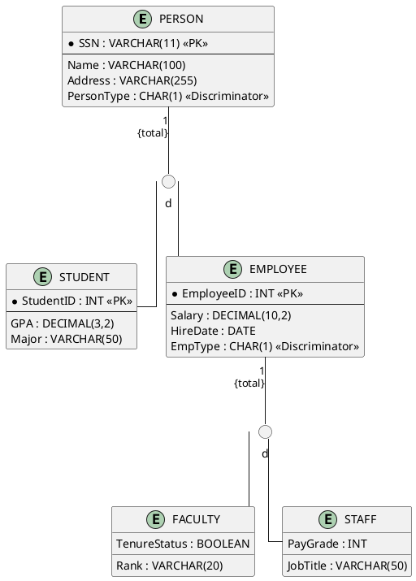
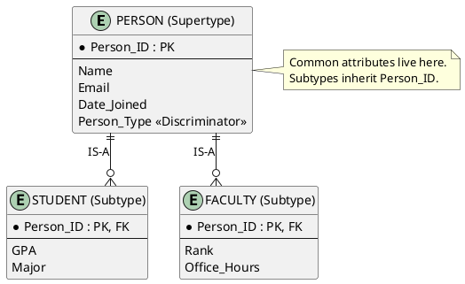

---
tags:
  - field/cs
  - subject/database
  - concept/eerd-hierarchies
---

[[T.O.C (Database Systems Notes).md|Up to Database Systems Notes]]

# Supertype/Subtype hierarchies in EERD
<!-- @deep processed: Explain in detail the concept of Supertype and subtype hierarchies in EERDs. Construct plantUML codes for the example diagrams. Then explain the example constructed in the diagram. Give me all the edge cases and information that general explanatory textbooks don't mention. Construct example tables from the example above. -->

## Taxonomic Architecture: Generalization vs. Specialization in EERDs
> **Seed:** "Explain the fundamental mechanics of the Supertype/Subtype relationship within the Enhanced Entity-Relationship (EER) model. Distinguish between 'Specialization' as a top-down refinement process and 'Generalization' as a bottom-up abstraction. Detail the principle of 'Attribute Inheritance', where subtypes automatically possess all attributes of their supertype, and 'Relationship Inheritance', where subtypes participate in any relationship defined for the supertype. Analyze the 'Subtype Discriminator' attribute and its role in determining subtype membership within the EERD hierarchy."

## Architecture of Supertype/Subtype Relationships
The Supertype/Subtype relationship is the core of the Enhanced Entity-Relationship (EER) model, introducing the concept of **Type Inheritance** to standard relational modeling. It establishes an **"IS-A"** relationship between a generic entity (the Supertype) and one or more specific entity groupings (the Subtypes).

In this hierarchy, the Supertype contains attributes common to all entities in the set, while Subtypes contain unique attributes or participate in relationships that do not apply to all entities. This structure eliminates null values in the physical schema that would otherwise occur if all specialized attributes were stored in a single, bloated table.

## Refinement Paradigms: Specialization vs. Generalization
The creation of these hierarchies typically follows one of two cognitive and architectural paths:

1. **Specialization (Top-Down):** This is the process of identifying subsets within a high-level entity set that have distinct characteristics. It begins with a general entity (e.g., `EMPLOYEE`) and refines it into specific subtypes (e.g., `ENGINEER`, `ACCOUNTANT`, `SECRETARY`) based on functional requirements or data differences. It is a decomposition process driven by the need for granularity.
2. **Generalization (Bottom-Up):** This is the reverse process, where multiple entity sets with common features are abstracted into a single higher-level entity. If a system initially defines `CAR`, `TRUCK`, and `MOTORCYCLE`, the designer may observe shared attributes like `VehicleID`, `Make`, and `Model` and abstract them into a `VEHICLE` supertype. This promotes data integrity and reduces redundancy.

## The Inheritance Engine: Attributes and Relationships
Inheritance is the mechanical backbone of the EER model, operating on two distinct layers:

- **Attribute Inheritance:** A subtype automatically "possesses" every attribute defined for its supertype. Most critically, the Subtype shares the **Primary Key** of the Supertype. In a physical database implementation, the primary key of the Subtype table is also a foreign key referencing the Supertype table, ensuring a 1:1 link. Any change to the Supertype schema (e.g., adding a `DateOfBirth` column) is logically inherited by all subtypes.
- **Relationship Inheritance:** Subtypes are not just passive data containers; they inherit the "behavior" of the supertype. If the `EMPLOYEE` supertype participates in a `WORKS_IN` relationship with `DEPARTMENT`, every `ENGINEER` and `ACCOUNTANT` (subtypes) is also logically linked to that department. However, the reverse is not true: a relationship defined specifically for the `ENGINEER` subtype (e.g., `CERTIFIED_IN`) does not apply to the `ACCOUNTANT` or the `EMPLOYEE` supertype.

## Subtype Discriminators and Membership Rules
The **Subtype Discriminator** is a dedicated attribute within the Supertype entity whose value determines which subtype a specific instance belongs to. It acts as the routing logic for the EER hierarchy.

- **Simple Discriminator:** In a disjoint constraint (where an instance can be only one subtype), a single attribute like `Employee_Type` (with values 'E' for Engineer, 'A' for Accountant) serves as the discriminator.
- **Composite/Boolean Discriminator:** In an overlapping constraint (where an instance can be multiple subtypes simultaneously), the discriminator often takes the form of multiple boolean flags (e.g., `Is_Pilot`, `Is_Mechanic`) to allow for concurrent membership.

The discriminator ensures that the application layer or the database engine can correctly map a generic supertype record to its corresponding specialized data in the subtype tables.

## Constraint Matrix: Completeness and Disjointness in EERDs
> **Seed:** "Provide a rigorous analysis of the constraints governing EERD subtype hierarchies. Define the 'Completeness Constraint' (Total Specialization 'double line' vs. Partial Specialization 'single line') and the 'Disjointness Constraint' (Disjoint 'd' vs. Overlapping 'o'). Command the agent to construct a 2x2 matrix explaining the implications of each combination (Total/Disjoint, Total/Overlapping, Partial/Disjoint, Partial/Overlapping) on data integrity and entity existence within the EERD."

## Completeness Constraints: The Specialization Mandate
The Completeness Constraint dictates whether every instance in a supertype entity set must also belong to at least one subtype set within a specific specialization. It functions as a set-membership requirement, ensuring that the union of subtypes either equals the supertype set or is a proper subset of it.

### Total Specialization (Double Line)
Represented by a double line connecting the supertype to the specialization circle. In set-theoretic terms, if $S$ is the supertype and $\{T_1, T_2, ..., T_n\}$ are the subtypes, then $S = \bigcup_{i=1}^{n} T_i$. This implies that an entity cannot exist purely as a supertype; it must "materialize" into at least one specialized form.
*   **Mechanical Analogy:** A factory assembly line where every raw chassis *must* be completed as either a Sedan or a Truck. No chassis can leave the factory in an "unclassified" state.

### Partial Specialization (Single Line)
Represented by a single line. Here, $\bigcup_{i=1}^{n} T_i \subset S$. Entities can exist in the supertype without being categorized into any defined subtype. This is the default state for evolving schemas where subtypes are not exhaustive.
*   **Mechanical Analogy:** A library where books are categorized by genre. While many are "Sci-Fi" or "History," a new acquisition might remain simply a "Book" until a librarian assigns it a specific genre.

## Disjointness Constraints: Membership Exclusivity
The Disjointness Constraint defines the rules for simultaneous membership across multiple subtypes within the same specialization.

### Disjoint Constraint (d)
Indicated by a 'd' in the specialization circle. It enforces the rule that $T_i \cap T_j = \emptyset$ for all $i \neq j$. An entity instance can belong to at most one subtype.
*   **Logic:** A state machine where a process can be "Running," "Waiting," or "Terminated," but never two at once.

### Overlapping Constraint (o)
Indicated by an 'o' in the specialization circle. It allows $T_i \cap T_j \neq \emptyset$. An entity instance may simultaneously be a member of multiple subtypes.
*   **Logic:** A University database where an individual can be both a "Student" and an "Employee" (e.g., a Teaching Assistant).

## The Constraint Matrix: Integrity & Existence Analysis
The interaction between these two constraints creates four distinct structural regimes for data integrity.

| Constraint | Disjoint (d) | Overlapping (o) |
| :--- | :--- | :--- |
| **Total (Double Line)** | **Mandatory & Exclusive:** Every supertype instance must belong to exactly one subtype. Perfect for rigid classification. | **Mandatory & Non-Exclusive:** Every supertype instance must belong to *at least* one subtype, but can belong to many. |
| **Partial (Single Line)** | **Optional & Exclusive:** A supertype instance can belong to zero or one subtype. Prevents multi-role conflicts but allows "generic" entities. | **Optional & Non-Exclusive:** A supertype instance can belong to zero, one, or many subtypes. Provides maximum flexibility. |

### Implications on Data Integrity
1.  **Total/Disjoint:** Enforces the strongest integrity. It eliminates the risk of "orphaned" supertypes (entities with no specialization) and "duplicate" roles. This is ideal for partitioning data into separate tables in physical implementation without redundancy.
2.  **Total/Overlapping:** Ensures all entities are categorized but allows complex role-playing. In SQL implementation, this often requires multiple flags or mapping tables to prevent data anomalies when an entity transitions between subtypes.
3.  **Partial/Disjoint:** Useful for hierarchies that are still being discovered. Integrity is maintained regarding exclusivity, but the schema allows "placeholders." If an entity is specialized, it is done so uniquely.
4.  **Partial/Overlapping:** The most permissive state. It offers the lowest inherent structural integrity as it places no limits on entity existence. Validation must often be handled via application logic or triggers rather than declarative schema constraints.

## Existence Dependency and Null Control
From a systems perspective, Total Specialization introduces a strict **existence dependency**. If a record is deleted from all subtypes, it must be purged from the supertype to maintain the completeness constraint. Conversely, Disjointness simplifies attribute management: in a Disjoint hierarchy, attributes specific to Subtype A will always be NULL for Subtype B, ensuring clear separation of concerns in the physical storage layer.

## Technical Modeling: PlantUML Implementation of Complex EERD Hierarchies
> **Seed:** "Construct a high-fidelity PlantUML code block representing a multi-level EERD hierarchy. The example should be a 'University Personnel System' featuring a Supertype 'PERSON' with subtypes 'STUDENT' and 'EMPLOYEE'. Further specialize 'EMPLOYEE' into 'FACULTY' and 'STAFF'. Use standard EER notation symbols (circles for constraints, double lines for total specialization). Following the code, provide a line-by-line mechanical explanation of how the PlantUML syntax maps to specific EERD components like discriminators and inheritance paths."

## EERD Architecture: Multi-Level Specialization
Enhanced Entity-Relationship Diagrams (EERD) extend standard ER models by introducing **Specialization/Generalization** hierarchies. This architecture utilizes a top-down approach where a supertype (PERSON) contains shared attributes, and subtypes (STUDENT, EMPLOYEE) inherit these properties while adding specific local attributes. 

In a multi-level hierarchy, specialization is recursive. The `EMPLOYEE` entity acts as a **Subtype** to `PERSON` but serves as a **Supertype** to `FACULTY` and `STAFF`. This creates an inheritance path where a `FACULTY` member transitively inherits attributes from both `EMPLOYEE` and `PERSON`. Constraints like **Disjointness** (an entity can be at most one subtype) and **Completeness** (Total vs. Partial specialization) govern the integrity of these relationships.

## PlantUML Implementation
The following implementation uses PlantUML's object-oriented syntax adapted for EERD visualization. We utilize `circle` nodes to represent constraint markers and specialized line formatting to denote total specialization.



## Mechanical Syntax Analysis
The PlantUML script functions as a declarative map of the relational schema logic. Below is the mechanical breakdown of how specific syntax maps to EERD components:

1. **`entity "NAME" { ... }`**: Defines the Entity type. In EERD, this represents the Supertype or Subtype blocks.
2. **`* Attribute : Type <<PK>>`**: Maps to a primary key. In specialization, subtypes often share the PK of the supertype (1:1 relationship), though local PKs are shown here for system-specific IDs.
3. **`circle "d" as CIRC_ID`**: Represents the **Disjointness Constraint**. The "d" indicates that a Person cannot be both a Student and an Employee simultaneously (Disjoint). An "o" would indicate Overlapping.
4. **`==` (Double Dash/Equals)**: Mechanically simulates the **Double Line** notation in EERD. This signifies **Total Specialization** (Completeness Constraint), meaning every instance of the supertype (e.g., PERSON) *must* belong to at least one subtype (STUDENT or EMPLOYEE).
5. **`--` (Single Dash)**: Represents the specialization path. It connects the constraint circle to the specialized subtypes.
6. **`PersonType : CHAR(1) <<Discriminator>>`**: Identifies the **Attribute Discriminator**. This is the physical column used in the database implementation to determine which subtype a supertype record belongs to.
7. **`P_CIRC -- STUDENT / P_CIRC -- EMPLOYEE`**: Defines the **Inheritance Path**. In a logical model, these paths imply that all attributes of `PERSON` are accessible to `STUDENT` and `EMPLOYEE` through the relational link.


## Physical Schema Synthesis: Mapping EERD Hierarchies to Relational Tables
> **Seed:** "Detail the three primary strategies for translating EERD subtype hierarchies into a physical relational schema: 1) Single Table Inheritance (One table for the whole hierarchy), 2) Joined Table Inheritance (One table per entity with FK links), and 3) Table-Per-Concrete-Class (One table per subtype containing all inherited attributes). For each strategy, analyze the performance trade-offs regarding 'Join Overhead', 'Storage Waste (Sparse Columns/NULLs)', and 'Query Complexity' in the context of the EERD model."

## Relational Mapping of EERD Hierarchies
Translating Enhanced Entity-Relationship Diagram (EERD) specializations into a flat Relational Model requires bridging the "Impedance Mismatch" between hierarchical inheritance and row-based storage. Since the relational model does not natively support `is-a` relationships, the hierarchy must be flattened or fragmented. The choice of strategy dictates the mechanical efficiency of the resulting database engine.

## 1. Single Table Inheritance (STI)
In this strategy, the entire hierarchy (Supertype and all Subtypes) is collapsed into a single physical table. A mandatory **Discriminator Column** (e.g., `EntityType`) is added to identify which subtype a specific row represents.

*   **Architecture:** `Table_AllEntities(ID, Base_Attrs..., SubtypeA_Attrs..., SubtypeB_Attrs..., Discriminator)`
*   **Performance Analysis:**
    *   **Join Overhead:** Zero. Since all data resides in one block, no `JOIN` operations are required to reconstruct an object. This is the fastest strategy for read/write operations on individual entities.
    *   **Storage Waste:** High. This creates "Sparse Columns." If Subtype A has 10 unique attributes and Subtype B has 10 different ones, every row for Subtype A will contain 10 `NULL` values for the Subtype B columns. In massive datasets, this inflates the storage footprint significantly.
    *   **Query Complexity:** Low. Simple `SELECT *` retrieves any entity. Filtering by type is a simple `WHERE` clause on the discriminator.

## 2. Joined Table Inheritance (JTI)
This strategy maintains the logical normalization of the EERD. One table is created for the Supertype (containing common attributes), and one table is created for each Subtype (containing only specialized attributes). Subtype tables use the Supertype's Primary Key as their own Primary Key and a Foreign Key (PK/FK).

*   **Architecture:** 
    *   `Table_Super(ID, Base_Attrs...)`
    *   `Table_SubA(ID_FK, SubA_Attrs...)`
*   **Performance Analysis:**
    *   **Join Overhead:** High. To retrieve a complete Subtype A entity, the engine must perform an `INNER JOIN` between `Table_Super` and `Table_SubA`. For deep hierarchies, this results in a chain of joins that degrades performance linearly.
    *   **Storage Waste:** Zero. Tables are fully normalized. No columns are left `NULL` due to inheritance; every attribute in a table is relevant to every row in that table.
    *   **Query Complexity:** Medium. Queries require explicit join logic. Polymorphic queries (e.g., "List all entities") are simple (select from Super), but specific queries (e.g., "List all specialized attributes") require coordination.

## 3. Table-Per-Concrete-Class (TPC)
This strategy discards the Supertype table entirely in the physical schema. Every "Concrete" subtype (a leaf node in the EERD) gets its own independent table. These tables contain both the inherited attributes from the Supertype and the specialized attributes of the Subtype.

*   **Architecture:** 
    *   `Table_SubA(ID, Base_Attrs..., SubA_Attrs...)`
    *   `Table_SubB(ID, Base_Attrs..., SubB_Attrs...)`
*   **Performance Analysis:**
    *   **Join Overhead:** Zero for subtype-specific queries. Since the table is self-contained, no joins are needed to fetch a single entity.
    *   **Storage Waste:** Low. Like JTI, there are no sparse columns. However, there is "Schema Redundancy" because the base attribute definitions are repeated across multiple table DDLs.
    *   **Query Complexity:** High for polymorphic queries. If you need to "Find all entities with ID=101," the engine must perform a `UNION` across every subtype table. This is computationally expensive and difficult to optimize with standard indexing.

## Performance Trade-off Matrix

| Metric | Single Table (STI) | Joined Table (JTI) | Table-Per-Class (TPC) |
| :--- | :--- | :--- | :--- |
| **Join Overhead** | None (Fastest) | High (Joining required) | None (for specific types) |
| **Storage Waste** | High (NULLs/Sparse) | None (Normalized) | Low (Schema redundancy) |
| **Query Complexity** | Simple | Moderate (Joins) | Complex (UNIONs) |
| **Data Integrity** | Harder (Subtype constraints) | Strong (Relational FKs) | Moderate (Partial) |

## System Internals: Edge Cases and Non-Standard EERD Dynamics
> **Seed:** "@expand Explain advanced EERD concepts omitted by standard textbooks. Discuss 'Multiple Inheritance' (Subtype Lattices) where a subtype inherits from multiple supertypes and the resulting name collision/diamond problems. Analyze 'Subtype Migration': the technical challenge of an entity changing its subtype (e.g., a Student becoming an Employee) while maintaining historical PK integrity. Detail the use of 'Check Constraints' and 'Triggers' to enforce overlapping vs. disjoint logic that cannot be natively expressed in standard SQL DDL. Discuss indexing strategies for 'Sparse Attributes' found in deep EERD hierarchies."

## Architecture: Subtype Lattices and the Diamond Problem
Standard EERD (Enhanced Entity-Relationship Diagramming) focuses on simple trees. **Subtype Lattices** represent a directed acyclic graph (DAG) where a subtype (e.g., `Teaching_Assistant`) inherits from multiple supertypes (e.g., `Student` and `Employee`). 

### The Diamond Problem
Mechanical analogy: A specialized tool head that fits both a drill and a screwdriver assembly. If both parent assemblies define a `torque_limit` attribute, the subtype faces a name collision.
- **Resolution Strategy:** Explicit aliasing or prefixing (e.g., `Emp_Salary` vs. `Stud_Stipend`) is required because RDBMS engines cannot resolve semantic ambiguity. In a lattice, the `Teaching_Assistant` inherits the PK of the root `Person` entity through two different paths. 

## Internal Mechanics: Subtype Migration and PK Integrity
Subtype Migration occurs when an entity instance moves between specialized categories without losing its primary identity. 

### The PK Stability Challenge
If a `Student` (PK: 101) becomes an `Employee`, the system must ensure the `Person` root record remains constant while the entry in `Students` is archived or deleted and a new entry is created in `Employees` with the same PK (101).
- **Process Flow:**
    1. **Validation:** Check if the target subtype allows the migration (disjointness rules).
    2. **Transaction Isolation:** Perform an `INSERT` into the `Employee` table and an `UPDATE` to the `Person.Type_Flag` in a single atomic transaction.
    3. **Integrity Lock:** Maintain the foreign key relationship from `Employee` back to `Person` using the existing PK.

## Implementation: Enforcing Logic via Triggers and Constraints
Standard SQL DDL (`CREATE TABLE`) lacks native keywords to enforce "Disjoint" (cannot be both) or "Overlapping" (can be both) constraints across different tables.

### 1. Disjointness via Check Constraints
In a **Single Table Inheritance (STI)** model, a check constraint is trivial:
```sql
ALTER TABLE Person ADD CONSTRAINT chk_disjoint 
CHECK (IsStudent + IsEmployee + IsAlumni <= 1);
```
### 2. Overlapping Logic via Triggers
In **Class Table Inheritance (CTI)**, where subtypes are separate tables, triggers are mandatory to maintain global state.
- **Logic:** A `BEFORE INSERT` trigger on `Employee` queries the `Student` table. If the business rule is *Disjoint*, the trigger raises an exception (`SIGNAL SQLSTATE '45000'`) if the ID already exists in `Student`.

## Optimization: Indexing Sparse Attributes
Deep EERD hierarchies often result in **Sparse Attributes**—columns that are NULL for 99% of the root table rows.

### Partial/Filtered Indexing
Standard B-Tree indexes on sparse columns waste space and increase tree depth.
- **Surgical Solution:** Use **Filtered Indexes** (SQL Server) or **Partial Indexes** (Postgres).
```sql
CREATE INDEX idx_grad_thesis 
ON Students (ThesisTitle) 
WHERE StudentType = 'Graduate';
```
- **Proof:** This index only stores entries for Graduate students. The index size is reduced by the factor of non-graduate rows, improving `SELECT` performance and reducing `INSERT` overhead for undergraduate records.

### Functional/Expression Indexes
If the subtype logic depends on a calculation (e.g., `IsActive`), an index on the expression `(Status = 'Active')` allows the optimizer to skip scanning inactive entities entirely.

## Data Simulation: Example Tables and Record-Level Inheritance
> **Seed:** "Based on the University Personnel EERD example from Section 03, construct a set of example tables (markdown format). Show how the 'PERSON', 'STUDENT', and 'FACULTY' tables would look under a 'Joined Table Inheritance' strategy. Include sample data that demonstrates the 'Subtype Discriminator' in the supertype table and how Foreign Keys in the subtype tables reference the Supertype primary key to maintain the EERD inheritance link."

## Architecture: Joined Table Inheritance
Joined Table Inheritance (Class Table Inheritance) represents an EERD specialization hierarchy by creating a distinct table for the supertype and every subtype. 

Think of this as a **Modular Assembly Line**. The supertype table acts as the "Base Chassis" factory, containing attributes universal to every unit (ID, Name). The subtype tables are "Specialization Stations" where specific components (Major for Students, Rank for Faculty) are bolted onto the chassis. To reconstruct the complete object, the system "couples" the tables together using the Primary Key as the universal mounting point.

## Implementation: University Personnel Tables

### 1. The Supertype: PERSON
This table contains the "root" data and the **Subtype Discriminator** (`PersType`), which acts as a routing signal for the database engine to know which specialized table to join.

| PersonID (PK) | Name | Address | PersType (Discriminator) |
| :--- | :--- | :--- | :--- |
| 101 | Alan Turing | Bletchley Park | 'S' |
| 102 | Grace Hopper | Arlington, VA | 'F' |
| 103 | Ada Lovelace | London, UK | 'S' |
| 104 | John von Neumann | Princeton, NJ | 'F' |

### 2. The Subtype: STUDENT
The `PersonID` here serves a dual role: it is the **Primary Key** for this table and a **Foreign Key** referencing `PERSON.PersonID`.

| PersonID (PK, FK) | Major | GPA |
| :--- | :--- | :--- |
| 101 | Cryptography | 4.0 |
| 103 | Mathematics | 3.9 |

### 3. The Subtype: FACULTY
Similarly, this table extends the supertype for personnel categorized as 'F'.

| PersonID (PK, FK) | Rank | Salary |
| :--- | :--- | :--- |
| 102 | Admiral | 120000 |
| 104 | Professor | 150000 |

## Internals: The Inheritance Link
The integrity of the EERD relationship is maintained through two mechanical constraints:

1.  **The Discriminator Constraint:** The `PersType` column in the `PERSON` table identifies the "Type" of the record. In a strict implementation, an application or trigger ensures that if `PersType` is 'S', a corresponding row must exist in the `STUDENT` table.
2.  **Shared Identity (PK=FK):** Unlike standard 1:M relationships where the FK is a separate column (e.g., `DeptID`), in Joined Inheritance, the **Subtype PK is the Supertype FK**. This enforces a 1:1 relationship between the specialization and the base record.
3.  **Data Retrieval (The JOIN):** To view a Student's full profile, the SQL engine performs an Equi-Join:
    ```sql
    SELECT P.Name, S.Major, S.GPA 
    FROM PERSON P
    JOIN STUDENT S ON P.PersonID = S.PersonID;
    ```
    This operation effectively "reassembles" the object distributed across the normalized storage.

> **Seed:** "In EERDs, and especially supertype/subtype hierarchies, explain the concept of abstracting common attributes into a supertype and leaving the rest into a subtype along with detailed examples and diagrams in plantuml code"

## Architecture: The Logic of Specialization and Generalization

In Extended Entity-Relationship Diagramming (EERD), the supertype/subtype hierarchy functions as a **modular assembly line**. Instead of duplicating data across multiple tables, we extract universal characteristics into a "base" entity (the Supertype) and isolate unique variations into "module" entities (the Subtypes).

This is governed by the **"IS-A" relationship**. A subtype is not a separate entity from the supertype; it is a more specific version of it. The supertype acts as the root node, holding the **Primary Key** and all attributes shared by every instance in the hierarchy. Subtypes inherit this Primary Key (acting as both PK and FK) and append only the attributes that are functionally dependent on that specific variation.

### Mechanical Analogy: The Vehicle Chassis
Imagine a vehicle manufacturing plant. Every vehicle produced requires a VIN, a manufacturer, and a production date. This is the **Supertype (Vehicle)**—the universal chassis. However, a "Truck" requires a `TowingCapacity` attribute, while a "Motorcycle" requires a `SidecarIndicator`. It would be inefficient to have a `TowingCapacity` column for a motorcycle (resulting in a NULL value). Instead, we "plug in" subtype modules only when needed.

## Implementation: Attribute Partitioning

The process of abstraction involves two distinct directions:
1.  **Generalization:** Bottom-up. Identifying common attributes in existing entities (e.g., `Car` and `Truck`) and pulling them into a new `Vehicle` supertype.
2.  **Specialization:** Top-down. Identifying groups within an entity (e.g., `Employee`) that have unique attributes (e.g., `Consultant` vs. `Salaried`) and branching them off.

### Detailed Example: University Personnel
In a University database, both `Students` and `Faculty` share basic identity data.

*   **Supertype: PERSON**
    *   `Person_ID` (PK)
    *   `Name`
    *   `Email`
*   **Subtype: STUDENT** (IS-A Person)
    *   `GPA`
    *   `Major`
*   **Subtype: FACULTY** (IS-A Person)
    *   `Rank`
    *   `Office_Hours`

### PlantUML Visualization


## Constraints and Discriminators: The Control Logic

To ensure the integrity of this hierarchy, the EERD model uses two primary constraints:

### 1. Completeness Constraint (Total vs. Partial)
*   **Total Specialization (Double Line):** Every instance of the supertype **must** belong to at least one subtype. (e.g., A `Patient` must be either `Outpatient` or `Inpatient`).
*   **Partial Specialization (Single Line):** An instance of the supertype can exist without belonging to any subtype. (e.g., A `Vehicle` might just be a "Vehicle" without being a `Car` or `Truck`).

### 2. Disjointness Constraint (Disjoint vs. Overlap)
*   **Disjoint (d):** An instance can belong to **only one** subtype. (e.g., An `Account` is either `Savings` or `Checking`, but not both).
*   **Overlap (o):** An instance can belong to **multiple** subtypes simultaneously. (e.g., A `Person` can be both a `Student` and an `Employee`).

### The Subtype Discriminator
The **Subtype Discriminator** is an attribute in the supertype that indicates which subtype(s) an instance belongs to. 
- For **Disjoint** hierarchies, a simple string or code (e.g., `Employee_Type: 'S', 'H', 'C'`) suffices. 
- For **Overlap** hierarchies, a composite attribute or multiple boolean flags are used (e.g., `Is_Student: Y/N`, `Is_Faculty: Y/N`).