---
tags:
  - field/cs
  - subject/database
  - concept/eerd-specialization
---

[[T.O.C (Database Systems Notes).md|Up to Database Systems Notes]]

# Specialization and Generalization in EERD
## Specialization
> **Seed:** "Explain the concept of specialization in terms of EERD. What is the purpose of specialization and how to effectively and deterministically achieve it. Setup a clean plantuml coded example for it"

## Architecture: Top-Down Decomposition
Specialization is the process of defining a set of sub-types of an entity type. In Enhanced Entity-Relationship (EER) modeling, it is viewed as a **top-down** approach. A high-level entity (Superclass) is analyzed to identify distinguishing characteristics, which are then used to branch out into lower-level entities (Subclasses).

Mechanically, it functions like a factory sorting line: a raw `Part` entity enters the system, and based on specific metadata (the "Specialization Attribute"), it is routed to a specialized assembly sub-process (e.g., `Mechanical Part` vs. `Electronic Part`).

### Purpose of Specialization
1. **Attribute Refinement**: Prevents "sparse" tables where most columns contain `NULL` values. Attributes unique to a subset (e.g., `Cargo_Capacity` for a `Truck`) are moved to the subclass, keeping the superclass (`Vehicle`) lean.
2. **Relationship Specificity**: Allows the model to define relationships that only apply to certain subsets. For example, only a `Doctor` subclass might participate in a `Performs_Surgery` relationship, whereas the general `Employee` superclass does not.
3. **Semantic Integrity**: Enhances the model's ability to mirror real-world business rules, ensuring data constraints are applied only where relevant.

## Deterministic Constraints: Logic Gates
To achieve specialization deterministically, the architect must apply two binary constraints that act as logic gates for the data flow:

### 1. Disjointness Constraint (The "OR/AND" Gate)
This determines if a superclass instance can belong to more than one subclass.
- **Disjoint (d)**: An entity can be a member of **at most one** subclass. It is an exclusive relationship (e.g., a `Shape` is either a `Circle` or a `Square`).
- **Overlapping (o)**: An entity can be a member of **multiple** subclasses simultaneously (e.g., a `Person` can be both an `Employee` and an `Alumnus`).

### 2. Completeness Constraint (The "Existence" Gate)
This determines if every instance of the superclass must be accounted for in the subclasses.
- **Total Specialization (Double Line)**: Every entity in the superclass **must** belong to at least one subclass. There are no "generic" instances.
- **Partial Specialization (Single Line)**: Some superclass entities may not belong to any subclass (e.g., a `Vehicle` that is neither a `Car` nor a `Truck`).

## Implementation: PlantUML Modeling
The following PlantUML code illustrates a `Vehicle` specialized into `Car` and `Truck`. It assumes a **Disjoint** and **Total** constraint, where every vehicle must be one or the other, but not both.

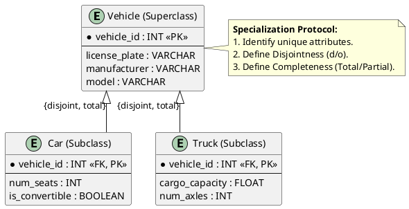

### Effective Execution Steps
1. **Identify Predicates**: Determine the "Specialization Attribute" (e.g., `Vehicle_Type`).
2. **Isolate Specifics**: Map attributes that apply only to certain types.
3. **Apply Constraints**: Choose (d/o) and (Total/Partial) based on business rules.
4. **Primary Key Propagation**: Ensure the Subclass uses the same Primary Key as the Superclass (acting as both PK and FK) to maintain the 1:1 relationship link.
> **Seed:** "Construct a detailed case study example to explain specialization in EERDs and then solve that example using a deterministic step by step way. Use plantUML codes"

## Architecture: The Factory Sorting Line
Specialization in Enhanced Entity-Relationship Diagrams (EERD) is the process of defining a set of sub-classes of an entity type. Mechanically, this is a **top-down** refinement process, analogous to a factory sorting line where a raw chassis enters and, based on specific attributes or predicates, is diverted into specialized assembly stations (Sports Car vs. Heavy Truck). 

It establishes an "IS-A" relationship, where a member of the specialized subclass is also a member of the superclass, inheriting all attributes and relationship participations of the parent.

## Case Study: The "Auto-Fleet" Logistics System
A logistics company manages a diverse fleet of vehicles. All vehicles have a `VehicleID`, `LicensePlate`, and `FuelCapacity`. However, the system must track specialized data:
1. **Trucks**: Track `CargoCapacity` and `NumberOfAxles`.
2. **Delivery Vans**: Track `InternalVolume` and `SideDoorType`.
3. **Passenger Cars**: Track `PassengerLimit` and `TrunkSpace`.

The business rules dictate:
- A vehicle must be exactly one of these types (cannot be a Truck and a Car simultaneously).
- Every vehicle in the system must belong to one of these three categories.

## Deterministic Modeling Steps

### Step 1: Identify the Superclass
Isolate the common denominator. All entities share the core identity of a "Vehicle."
- **Attributes**: `{VehicleID (PK), LicensePlate, FuelCapacity}`

### Step 2: Identify Specialization Predicates
Determine the "differentiating factor." In this case, the `VehicleType` attribute acts as the **Defining Predicate**.

### Step 3: Define Subclasses
Create distinct entities for the specialized groups and map their unique attributes.
- **Truck**: `{CargoCapacity, NoOfAxles}`
- **Van**: `{InternalVolume, SideDoorType}`
- **Car**: `{PassengerLimit, TrunkSpace}`

### Step 4: Apply Structural Constraints
1. **Disjointness Constraint**: Can an entity be a member of more than one subclass? 
   - *Rule*: A vehicle is either a Truck, Van, or Car. 
   - *Decision*: **Disjoint (d)**.
2. **Completeness Constraint**: Does every superclass entity have to belong to a subclass?
   - *Rule*: Every vehicle must be categorized.
   - *Decision*: **Total Participation (double line)**.

## EERD Implementation (PlantUML)

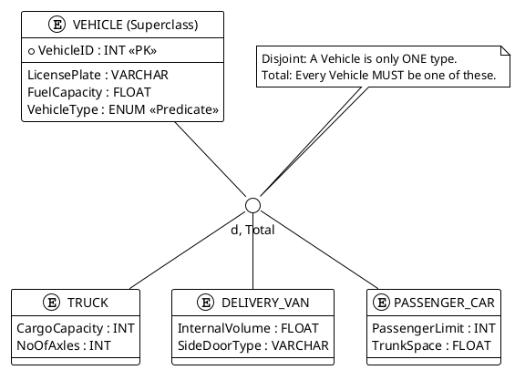

## Internal Logic Summary
1. **Attribute Inheritance**: A `TRUCK` entity does not explicitly store `LicensePlate`, but it inherits the pointer to that data in the physical schema.
2. **Predicate Logic**: The specialization is **Attribute-Defined**. The value of `VehicleType` determines which specialized record (subclass) is instantiated.
3. **Set Membership**: $Subclass \subset Superclass$. The set of all Trucks is a subset of the set of all Vehicles.
## Generalization
> **Seed:** "Explain the concept of generalization in terms of EERD. What is the purpose of generalization and how to effectively and deterministically achieve it. Setup a clean plantuml coded example for it"

## Architecture: The Supertype-Subtype Hierarchy
Generalization is a **bottom-up** abstraction process in Enhanced Entity-Relationship Diagrams (EERD). It identifies commonalities among multiple low-level entity types (Subtypes) and synthesizes them into a single high-level entity type (Supertype). 

In a database schema, this functions as an inheritance mechanism. The Supertype contains the intersection of all attributes and relationships shared by the Subtypes, while the Subtypes retain only those attributes unique to their specific instances.

## Deterministic Synthesis: The Bottom-Up Pipeline
To achieve generalization deterministically, the data modeler must follow a strict extraction pipeline:

1.  **Attribute Intersection:** Identify the set of attributes $A$ present in all candidate entities $E_1, E_2, ... E_n$.
2.  **Supertype Formation:** Create a new entity $S$ (Supertype) and migrate the common attributes $A$ to it. Assign a primary key to $S$.
3.  **Subtype Refinement:** Redefine $E_1...E_n$ as Subtypes of $S$. Remove the migrated attributes from the Subtypes. The primary key of each Subtype is now effectively the primary key of the Supertype (referential integrity).
4.  **Relationship Migration:** Any relationship that applies to *all* Subtypes is moved to the Supertype level to reduce redundant join logic.

**Mechanical Analogy:** Consider an assembly line producing "Sedans" and "Trucks." If both require "Engine No," "Chassis No," and "Fuel Type," the factory generalizes these into a "Base Vehicle" chassis. The specific assembly stations only add "Trunk Capacity" for Sedans or "Towing Capacity" for Trucks.

## The Purpose: Normalization and Integrity
Generalization serves three primary engineering goals:
-   **Redundancy Elimination:** Common attributes are stored in one table (in physical mapping), reducing storage overhead and update anomalies.
-   **Structural Clarity:** It provides a modular view of the schema, separating universal properties from specialized data.
-   **Enforcement of Constraints:** It allows the application of **Disjointness** (can an entity be both subtypes?) and **Completeness** (must every supertype be at least one subtype?) constraints at the schema level.

## Implementation: EERD PlantUML Modeling
The following PlantUML code demonstrates generalization for a University system where `Faculty` and `Student` are generalized into `Person`.

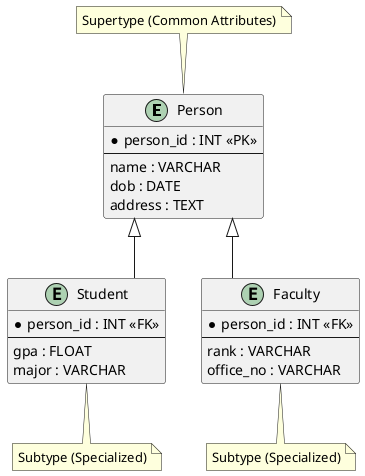

### Deterministic Constraint Mapping
When mapping generalization to a physical schema, two specific flags must be defined:
-   **Disjointness (d/o):** 
    -   **Disjoint (d):** A `Person` is either a `Student` OR `Faculty`, never both.
    -   **Overlapping (o):** A `Person` can be a `Student` AND `Faculty` simultaneously.
-   **Completeness (total/partial):**
    -   **Total (double line):** Every `Person` in the system *must* be either a `Student` or `Faculty`.
    -   **Partial (single line):** A `Person` can exist in the database without being categorized as either (e.g., an external contractor).
> **Seed:** "Construct a detailed case study example to explain generalization in EERDs and then solve that example using a deterministic step by step way. Use plantUML codes"

## 1. Internal Architecture: Generalization Mechanism
Generalization is the **bottom-up** abstraction process where commonalities among multiple existing entity types are extracted to form a high-level **Superclass**. In database internals, this is treated as the inverse of specialization, focusing on the synthesis of shared attributes to reduce redundancy.

### The Factory Analogy
Imagine an assembly line for electronic devices. Initially, the factory builds "Smartphones," "Tablets," and "Laptops" as separate entities with redundant tracking. 
- **The Process:** Engineers realize 80% of the components—Battery, CPU, Serial Number, and OS—are identical. Instead of maintaining three separate blueprints, they synthesize a master "MobileDevice" blueprint.
- **The Result:** "Smartphones" and "Tablets" now inherit the master blueprint and only define their unique components (e.g., SIM slot for phones, Stylus support for tablets). The system treats them as specific instances of the general category.

### Constraints & Set Theory
Generalization is governed by two primary constraints that define the relationship between the Superclass (S) and its Subclasses (C₁, C₂, ... Cₙ):

1. **Disjointness Constraint:**
   - **Disjoint (d):** An instance of the superclass can belong to **at most one** subclass. (e.g., A vehicle is either a Car or a Truck, not both).
   - **Overlapping (o):** An instance can belong to **multiple** subclasses simultaneously. (e.g., A person can be both a Student and an Employee).

2. **Completeness Constraint:**
   - **Total Participation (Double Line):** Every instance in the superclass **must** belong to at least one subclass.
   - **Partial Participation (Single Line):** An instance in the superclass may exist without belonging to any subclass.

---

## 2. Case Study: The Unified Logistics Fleet
A logistics company, **SwiftMove**, manages three types of transport units: **Heavy Trucks**, **Delivery Vans**, and **Electric Scooters**. Currently, their data is siloed.

**Requirement Analysis:**
- **Trucks:** Identified by `LicensePlate`. Attributes: `MaxLoadCapacity`, `FuelType`, `NumberofAxles`.
- **Vans:** Identified by `LicensePlate`. Attributes: `MaxLoadCapacity`, `FuelType`, `CargoVolume`.
- **Scooters:** Identified by `UnitID`. Attributes: `BatteryCapacity`, `MaxSpeed`.

**Objective:** Generalize these entities into a single `Vehicle` superclass to centralize maintenance scheduling and GPS tracking.

---

## 3. Deterministic Implementation Steps

### Step 1: Attribute Convergence Analysis
Examine all entities to find the "Greatest Common Denominator."
- **Shared Identifiers:** Trucks and Vans use `LicensePlate`. Scooters use `UnitID`. 
- **Decision:** Create a generalized attribute `VehicleID` (Primary Key) that maps to these physical identifiers.
- **Shared Descriptors:** Trucks and Vans share `FuelType` and `MaxLoadCapacity`. Scooters do not.
- **Generalization Result:** The Superclass will contain only the most universal attributes: `VehicleID`, `Model`, and `Manufacturer`.

### Step 2: Define the Superclass Hierarchy
Establish the `Vehicle` entity as the root.
- **Attributes:** `VehicleID` (PK), `Manufacturer`, `AcquisitionDate`.

### Step 3: Isolate Subclass Specificity
Remove the generalized attributes from the original entities, leaving only what makes them unique.
- `Truck`: `NumberofAxles`, `MaxLoadCapacity`, `FuelType`.
- `Van`: `CargoVolume`, `MaxLoadCapacity`, `FuelType`.
- `Scooter`: `BatteryCapacity`, `MaxSpeed`.

### Step 4: Apply Business Logic Constraints
1. **Disjointness:** Can a vehicle be both a Truck and a Scooter? **No.** (Constraint = **Disjoint**).
2. **Completeness:** Can a vehicle exist in the fleet that is NOT a Truck, Van, or Scooter? **No.** (Constraint = **Total**).

---

## 4. PlantUML Representation and Schema

### PlantUML EERD Code
The following code utilizes the inheritance syntax (`<|--`) and notes to represent the specialization circle internals.

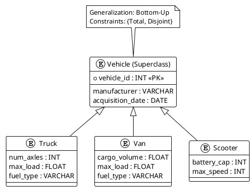

### Mapping to Relational Tables
To implement this generalization in a SQL database, the **Multiple Table (Subclass)** approach is used to ensure referential integrity:

1. **Vehicle** (<u>vehicle_id</u>, manufacturer, acquisition_date)
2. **Truck** (<u>vehicle_id</u>, num_axles, max_load, fuel_type) 
   - *Foreign Key: vehicle_id REFERENCES Vehicle(vehicle_id)*
3. **Van** (<u>vehicle_id</u>, cargo_volume, max_load, fuel_type)
   - *Foreign Key: vehicle_id REFERENCES Vehicle(vehicle_id)*
4. **Scooter** (<u>vehicle_id</u>, battery_cap, max_speed)
   - *Foreign Key: vehicle_id REFERENCES Vehicle(vehicle_id)*

## Combined
> **Seed:** "Explain the data modelling and diagramatic notations in generalization and specialization in EERDs"

## 1. Abstract Definition
**Generalization** and **Specialization** are abstraction mechanisms in Enhanced Entity-Relationship (EER) modeling used to represent **Is-A** relationships and class hierarchies.

*   **Specialization:** A top-down process of identifying subsets of an entity set (Superclass) that share specific attributes or relationships not applicable to all members. It creates **Subclasses**.
    *   *Analogy:* A factory that produces "Vehicles" (Superclass) but creates specialized assembly lines for "Electric Cars" (Subclass) to handle battery-specific logic.
*   **Generalization:** A bottom-up process of identifying common features among several entity sets and synthesizing them into a single higher-level entity set (**Superclass**).
    *   *Analogy:* Noticing that "Checking Accounts" and "Savings Accounts" both have an `AccountNumber` and `Balance`, and grouping them under the concept of a "Bank Account."

## 2. Technical Mechanism: Diagrammatic Notations
In EERDs, these concepts are visualized using a circle connecting the superclass to its subclasses, governed by specific constraints.

### Constraint Types
1.  **Disjointness Constraint:**
    *   **Disjoint (d):** An entity can belong to at most one subclass. (e.g., A "Member" is either "Student" OR "Faculty").
    *   **Overlap (o):** An entity can belong to multiple subclasses simultaneously. (e.g., A "Part" can be both "Manufactured" AND "Purchased").
2.  **Completeness (Participation) Constraint:**
    *   **Total (Double Line):** Every superclass entity *must* belong to at least one subclass.
    *   **Partial (Single Line):** A superclass entity *may* exist without belonging to any subclass.

### Visual Components
- **Superclass:** The parent entity (e.g., `EMPLOYEE`).
- **Subclass:** The child entity (e.g., `ENGINEER`, `SECRETARY`).
- **IS-A Circle:** The junction containing the constraint symbol (`d` or `o`).
- **Specialization Attribute:** The attribute of the superclass used to determine subclass membership (e.g., `JobType`).

## 3. Implementation: Mapping to Relational Schema
There are three primary strategies for converting EER hierarchies into SQL tables:

### Strategy A: Multiple Tables (Subclass-Specific)
Create a table for the superclass and separate tables for each subclass, linked by Foreign Keys.
```sql
CREATE TABLE Employee (
    EmpID INT PRIMARY KEY,
    Name VARCHAR(100),
    Salary DECIMAL
);

CREATE TABLE Engineer (
    EmpID INT PRIMARY KEY,
    EngineeringType VARCHAR(50),
    FOREIGN KEY (EmpID) REFERENCES Employee(EmpID)
);
```

### Strategy B: Single Table (Flat-Map)
All attributes (superclass + all subclasses) in one table. Uses a **Type Discriminator** column.
```sql
CREATE TABLE Employee (
    EmpID INT PRIMARY KEY,
    Name VARCHAR(100),
    EmpType CHAR(1), -- 'E' for Engineer, 'S' for Secretary
    EngType VARCHAR(50), -- NULL if Secretary
    TypingSpeed INT -- NULL if Engineer
);
```

## 4. Systems Trade-offs
| Feature | Strategy A (Normalized) | Strategy B (Denormalized) |
| :--- | :--- | :--- |
| **Storage** | Efficient (no NULLs). | Inefficient (many NULLs). |
| **Performance** | Slower (requires JOINs). | Faster (single table scan). |
| **Flexibility** | High (easy to add subclasses). | Low (requires schema modification). |
| **Integrity** | Strong (via FK constraints). | Weak (relies on application logic). |


## Types of Specialization
<!-- @deep processed: Explain the following types of Specialization in EERDs along with detailed examples constructed in plantUML codes:
- Predicate defined
- Attribute defined
- User defined
Now explain each of these scenarios:
- If we can determine exactly those entities that will become members of each subclass by a condition, the subclasses are called predicate-defined (or condition-defined) subclasses
  Condition is a constraint that determines subclass members
  Display a predicate-defined subclass by writing the predicate condition next to theline attaching the subclass to its superclass
- If all subclasses in a specialization have membership condition on same attribute of the superclass, specialization is called an attribute-defined specialization
  Attribute is called the defining attribute of the specialization
  Example: JobType is the defining attribute of the specialization {SECRETARY, TECHNICIAN, ENGINEER} of EMPLOYEE
- If no condition determines membership, the subclass is called user-defined
  Membership in a subclass is determined by the database users by applying an operation to add an entity to the subclass
  Membership in the subclass is specified individually for each entity in the superclass by the user
- Two basic constraints can apply to a specialization/generalization: Disjointness Constraint and Completeness Constraint
- Hence, we have four types of specialization/generalization: Disjoint, total | Disjoint, partial | Overlapping, total | Overlapping, partial
  Note: Generalization usually is total because the superclass is derived from the subclasses.
  
Make sure to include plantuml constructed examples for each case and example and scenario and also explain diagram notations -->

## Predicate-Defined (Condition-Defined) Subclasses
> **Seed:** "Expand on the concept of predicate-defined subclasses within EERD specialization. Define how membership is determined by specific conditions or constraints applied to superclass attributes. Explain the notation used in EERDs, specifically the placement of the predicate condition string next to the line connecting the subclass to the superclass. Provide a PlantUML class diagram illustrating a 'LargeProject' subclass derived from a 'PROJECT' superclass where the predicate is 'TotalBudget > 500000'. Explain how this automated membership ensures data integrity."

## Definition and Architecture
In Enhanced Entity-Relationship (EER) modeling, a **predicate-defined subclass** (also known as an attribute-defined subclass) is a specialization where membership is determined automatically by a formal condition. Unlike user-defined subclasses, where an external actor must manually map an entity to a subclass, a predicate-defined subclass functions like an **automated sorting gate** on an assembly line. 

If the superclass is $C$ and the subclass is $S$, membership in $S$ is defined by a predicate $P$ such that for any entity $e \in C$, $e \in S$ if and only if $P(e)$ evaluates to true. This predicate is almost always a boolean expression involving one or more attributes of the superclass.

## Notation and Predicate Syntax
The EERD notation for predicate-defined specialization requires the predicate string to be placed explicitly near the connector. 
1. **The Connector:** A line connects the superclass to a circle (representing the specialization type), and from that circle to the subclass.
2. **The Condition String:** The specific constraint (e.g., `JobType = 'Engineer'`) is written adjacent to the line connecting the circle to the specific subclass.
3. **The Specialization Attribute:** If all subclasses in a specialization are defined by the same attribute (e.g., `EmployeeType`), the attribute name is placed next to the specialization circle.

This syntax ensures that the "business logic" of the data model is embedded directly into the schema, rather than being relegated to application-layer code.

## PlantUML Implementation
The following diagram illustrates the relationship between a `PROJECT` superclass and a `LargeProject` subclass, governed by the budget predicate.

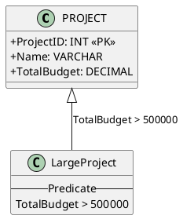

## Data Integrity and Constraint Enforcement
Predicate-defined subclasses serve as a critical layer of **declarative data integrity**. 

*   **Automated Membership:** By defining membership via attributes, the DBMS (or the modeling layer) ensures that an entity cannot "leak" into a subclass without meeting the requisite criteria. It eliminates human error in classification.
*   **Consistency:** If an entity's attribute value changes in the superclass (e.g., a project's budget is increased from 400k to 600k), the entity automatically satisfies the predicate and becomes a member of the `LargeProject` subclass. This maintains a "Live View" of the data hierarchy.
*   **Constraint Synergy:** When combined with **Disjointness Constraints** (where an entity can belong to at most one subclass), predicates act as mutually exclusive filters. This ensures that the state of the database always reflects the underlying mathematical definitions of the entities.

## Attribute-Defined Specialization
> **Seed:** "Analyze attribute-defined specialization in EERDs as a specific subset of predicate-defined specialization. Define the 'defining attribute' and explain why all subclasses in this specialization must share the same membership condition source. Use the 'EMPLOYEE' superclass with a 'JobType' defining attribute to create a specialization containing {SECRETARY, TECHNICIAN, ENGINEER} subclasses. Construct a PlantUML diagram showing the specialization circle and the attribute name. Detail the diagrammatic difference between a general predicate-defined subclass and an attribute-defined set."

## Definition
Attribute-defined specialization is a rigorous subset of **predicate-defined specialization**. In the broader predicate-defined model, each subclass is defined by a specific condition (predicate) that an entity must satisfy to belong to that subclass. Attribute-defined specialization constrains this by requiring that the predicates of all subclasses in the specialization involve the same attribute of the superclass. This attribute is designated as the **defining attribute**.

## Internal Logic: The Defining Attribute
The **defining attribute** is the specific field within the superclass schema whose value determines the subclass membership of an entity. 

### Membership Condition Source
All subclasses in an attribute-defined specialization must share the same membership condition source (the defining attribute) to ensure structural integrity and predictability in the schema. If subclasses were allowed to pull from different attributes within the same specialization circle, the logic would revert to a general predicate-defined set, losing the "switch-case" or "category" semantics that attribute-defined sets provide. By anchoring membership to a single attribute, the database designer enforces a unified partitioning logic:
1.  **Semantic Cohesion:** The subclasses represent mutually exclusive or related categories of the same "type" (e.g., Job Type, Account Type).
2.  **Constraint Enforcement:** It simplifies the implementation of disjointness constraints, as the system only needs to check one attribute value to route an entity.

## Technical Implementation: EMPLOYEE Specialization
In the `EMPLOYEE` superclass, the attribute `JobType` acts as the defining attribute. The membership predicates are implicitly:
-   `JobType = 'Secretary'` -> `SECRETARY` subclass.
-   `JobType = 'Technician'` -> `TECHNICIAN` subclass.
-   `JobType = 'Engineer'` -> `ENGINEER` subclass.

### PlantUML Representation
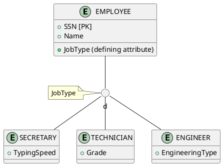

## Diagrammatic Differences
The visual distinction between a general predicate-defined subclass and an attribute-defined set is centered on the placement and nature of the label:

| Feature | Predicate-Defined (General) | Attribute-Defined (Specific) |
| :--- | :--- | :--- |
| **Label Placement** | The specific predicate (e.g., `Salary > 50000`) is placed next to the line connecting the circle to the specific subclass. | The name of the defining attribute (e.g., `JobType`) is placed next to the line connecting the superclass to the specialization circle. |
| **Membership Logic** | Decentralized; each subclass line has its own unique rule. | Centralized; the circle itself is "fed" by a single attribute's value. |
| **Visual Cue** | Multiple different labels for multiple subclasses. | A single attribute name governs the entire fork of subclasses. |

In the `EMPLOYEE` example, instead of writing `JobType='Engineer'` on the line to the `ENGINEER` subclass, we simply place `JobType` near the superclass-to-circle connector, signaling that the values within that attribute dictate the downstream routing for all connected subclasses.

## User-Defined Subclasses
> **Seed:** "Explain user-defined subclasses in EERDs where no automated condition determines membership. Detail the manual process where database users must explicitly apply operations to assign an entity to a subclass. Contrast this with predicate-defined subclasses in terms of flexibility and maintenance overhead. Provide a PlantUML example of an 'EMPLOYEE' superclass with a 'MEMBER_OF_ADVISORY_BOARD' user-defined subclass. Explain why no condition text appears on the connecting line in standard EERD notation for this type."

## Definition & Core Logic
In Enhanced Entity-Relationship Diagrams (EERD), a **user-defined subclass** is a specialization where membership is not determined by a specific attribute value or logical condition (predicate). Instead, an entity is assigned to the subclass by an external action—typically a manual decision by a database user or an application-level command. Unlike automated specializations, the database management system (DBMS) cannot automatically evaluate whether an entity belongs to the subclass based on the data already present in the superclass.

## Mechanism of Operation
The membership process for user-defined subclasses functions like a **manual rail switch** in a train yard, whereas predicate-defined subclasses operate like an automated sensor-based gate.

In a user-defined scenario, the system performs no internal check. To assign an entity $e$ from superclass $C$ to subclass $S$, a user must explicitly execute a DML (Data Manipulation Language) operation. 
1. **Selection:** The user identifies an existing instance in the superclass.
2. **Explicit Operation:** The user performs an operation (e.g., an `INSERT` into the subclass table or a specific `UPDATE` if using a single-table mapping) to register the entity as a member of the subclass.
3. **Internal State:** The DBMS simply accepts the instruction. It does not verify "why" the entity is being added; it relies entirely on the correctness of the external agent's decision.

## Comparative Analysis: Predicate vs. User-Defined
The choice between these two types involves a trade-off between automation and subjective classification.

| Feature | Predicate-Defined | User-Defined |
| :--- | :--- | :--- |
| **Membership Logic** | Automatic (e.g., `JobType = 'Engineer'`) | Manual (Explicit User Action) |
| **Flexibility** | **Low:** Rigidly bound to attribute values. | **High:** Allows for subjective or complex external criteria. |
| **Maintenance** | **Low:** Self-managing; DBMS handles logic. | **High:** Risk of inconsistency if application logic fails. |
| **Overhead** | Computational (check condition on insert). | Operational (requires manual input/UI logic). |

User-defined subclasses are essential when the criteria for membership cannot be captured in a simple database attribute—for example, selecting employees for a "High Potential" track based on interview performance that isn't stored in a structured field.

## Implementation Example (PlantUML)
The following diagram illustrates an `EMPLOYEE` superclass with a `MEMBER_OF_ADVISORY_BOARD` user-defined subclass. Note that in standard EERD modeling, the line connecting the superclass to the circle (specialization node) remains blank for user-defined types.

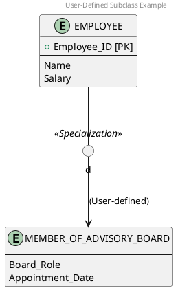

## Notational Nuance
In standard EERD notation (specifically the Elmasri/Navathe convention), a **predicate-defined subclass** displays the condition (e.g., `Job_Type = 'Manager'`) directly on the line connecting the subclass to the specialization circle. 

For **user-defined subclasses**, the connecting line is left **blank**. This is a deliberate design choice: the absence of text signifies to the database architect that there is no system-evaluable expression $p$ such that membership in subclass $S$ is defined by $p(e) = \text{True}$. The blank line indicates that membership is an "extensional" property (managed by the contents of the subclass set) rather than an "intensional" property (derived from logic).

## Specialization Constraints: Disjointness and Completeness
> **Seed:** "Provide a technical deep-dive into the two fundamental constraints of EERD specialization: Disjointness (Disjoint vs. Overlapping) and Completeness (Total vs. Partial). Define the 'd' (disjoint) and 'o' (overlapping) symbols used in specialization circles. Explain the single-line vs. double-line notation for partial vs. total participation. Discuss the internal logic of these constraints: how Disjointness limits an entity to a maximum of one subclass, while Completeness dictates whether every superclass entity *must* belong to at least one subclass."

## Mechanism of Specialization Constraints
In Enhanced Entity-Relationship Modeling (EERM), specialization constraints define the membership rules for entities transitioning from a superclass to one or more subclasses. These constraints act as semantic guards that ensure data integrity at the schema level by enforcing set-theoretic rules on the population of subclasses. They dictate the "how" and "how many" of subclass membership.

## The Disjointness Constraint (Membership Exclusivity)
The disjointness constraint specifies whether an instance of a superclass can simultaneously be a member of more than one subclass within a specialization.

### 1. Disjoint (d)
*   **Symbol:** A lowercase 'd' inside the specialization circle.
*   **Logic:** $S_i \cap S_j = \emptyset$ for all $i \neq j$.
*   **Mechanism:** An entity in the superclass can map to **at most one** subclass. This is an "exclusive-OR" relationship at the instance level.
*   **Example:** In an `Employee` specialization into `Salaried` or `Hourly`, an employee is physically paid via one pipeline or the other. They cannot exist in both subclass sets.
*   **Internal Enforcement:** The database typically enforces this via application logic or triggers that prevent the same Superclass ID from appearing in multiple subclass tables.

### 2. Overlapping (o)
*   **Symbol:** A lowercase 'o' inside the specialization circle.
*   **Logic:** $S_i \cap S_j$ can be non-empty.
*   **Mechanism:** An entity can belong to **multiple subclasses** concurrently. This is an "inclusive-OR" relationship.
*   **Example:** In a `Person` specialization into `Student` and `Employee`, a single person can hold both roles simultaneously.
*   **Internal Enforcement:** The schema allows the same Superclass ID to be present in multiple subclass tables, representing different "facets" of the same entity.

## The Completeness Constraint (Membership Requirement)
The completeness (or participation) constraint dictates whether every entity in the superclass is required to participate in the specialization.

### 1. Total Specialization (Mandatory)
*   **Notation:** A **double line** connecting the superclass to the specialization circle.
*   **Logic:** $\bigcup_{i=1}^{n} Subclass_i = Superclass$.
*   **Mechanism:** Every entity in the superclass **must** belong to at least one subclass. The superclass is effectively an "abstract" entity set in programming terms—instances cannot exist solely in the superclass.
*   **Example:** If `Vehicle` is totally specialized into `Car` and `Truck`, every registered vehicle must be classified. You cannot have a "generic" vehicle record that isn't one of the two.

### 2. Partial Specialization (Optional)
*   **Notation:** A **single line** connecting the superclass to the specialization circle.
*   **Logic:** $\bigcup_{i=1}^{n} Subclass_i \subset Superclass$.
*   **Mechanism:** An entity may exist in the superclass without belonging to any subclass. Subclasses only represent a subset of the total superclass population.
*   **Example:** In a `Staff` specialization into `Manager`, most staff members are not managers. They exist in the `Staff` table but have no corresponding entry in the `Manager` subclass.

## The Intersection Matrix
The internal logic of a specialization is the product of both constraints. These are orthogonal rules that combine to define the valid state-space of the database:

| Constraint Combination | Instance Membership Logic | Set Theory |
| :--- | :--- | :--- |
| **Disjoint / Total (d, =)** | Entity belongs to **exactly one** subclass. | Partitions the superclass set. |
| **Disjoint / Partial (d, -)** | Entity belongs to **zero or one** subclass. | Subclasses are mutually exclusive but not exhaustive. |
| **Overlapping / Total (o, =)** | Entity belongs to **at least one** subclass. | Subclasses cover the superclass and may overlap. |
| **Overlapping / Partial (o, -)** | Entity belongs to **zero, one, or many** subclasses. | Subclasses are a non-exhaustive collection of facets. |

From a systems perspective, these constraints govern the **cardinality of the Is-A relationship**. Disjointness controls the upper bound of subclass membership ($1$ vs $N$), while Completeness controls the lower bound ($1$ vs $0$).

## The Four Specialization Combinations
> **Seed:** "Synthesize the constraints into the four possible specialization/generalization types in EERDs: 1) Disjoint/Total, 2) Disjoint/Partial, 3) Overlapping/Total, and 4) Overlapping/Partial. For each type: provide a formal definition, a real-world scenario, and a precise PlantUML diagram. For 'Disjoint/Total', use 'PART' as a superclass with 'MANUFACTURED_PART' and 'PURCHASED_PART'. For 'Overlapping/Partial', use 'PERSON' with 'ALUMNUS' and 'FACULTY_MEMBER'. Include a specific note on why Generalization (bottom-up) is typically 'Total' by its very nature as a derivation process."

## EERD Constraint Architecture
Enhanced Entity-Relationship (EER) modeling introduces constraints to manage the relationship between a superclass and its subclasses. These are governed by two orthogonal axes:
1. **Disjointness Constraint**: Determines if an entity can belong to more than one subclass (Disjoint `d` vs. Overlapping `o`).
2. **Completeness Constraint**: Determines if every entity in the superclass must belong to at least one subclass (Total `||` vs. Partial `|`).

---

## 1. Disjoint / Total (d, Total)
**Definition**: Every entity in the superclass MUST belong to exactly one subclass. It is an "Either-Or" requirement with no exceptions and no overlaps.

**Scenario**: In a manufacturing inventory system, every `PART` is tracked by its origin. A part is either built in-house or bought from an external vendor. It cannot be both, and there are no "mystery" parts without an origin.

**PlantUML Architecture**:
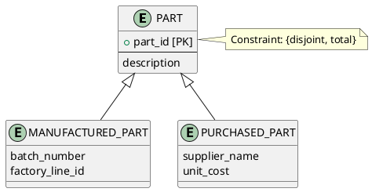

---

## 2. Disjoint / Partial (d, Partial)
**Definition**: An entity in the superclass can belong to at most one subclass, but it is not required to belong to any. It is an "At most one" constraint.

**Scenario**: A vehicle dealership tracks `VEHICLE` entities. Some vehicles are `CAR`, others are `TRUCK`. However, the dealership might also stock motorcycles or boats which are not specialized into subclasses yet. A vehicle can be a Car, or it can be a Truck, or it can be neither, but it cannot be both.

**PlantUML Architecture**:
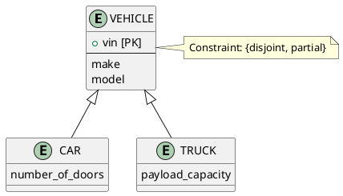

---

## 3. Overlapping / Total (o, Total)
**Definition**: Every entity in the superclass MUST belong to at least one subclass, and it MAY belong to multiple subclasses simultaneously.

**Scenario**: In an electronic parts database, every `COMPONENT` must be classified. A component could be a `SENSOR`, a `TRANSMITTER`, or a specialized unit that functions as both a `SENSOR` and a `TRANSMITTER`. There are no components that are neither.

**PlantUML Architecture**:
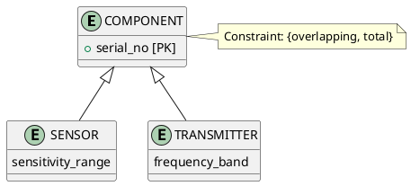

---

## 4. Overlapping / Partial (o, Partial)
**Definition**: An entity in the superclass may belong to zero, one, or many subclasses. This is the least restrictive constraint.

**Scenario**: A university database tracks a `PERSON`. A person could be an `ALUMNUS`, a `FACULTY_MEMBER`, or both (an alumnus who returned to teach). Crucially, a person could also be a staff member or a guest who is neither an alumnus nor faculty.

**PlantUML Architecture**:
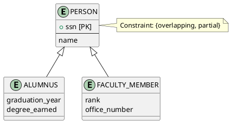

---

## The Derivation Logic of Generalization
Generalization is the **bottom-up** process of identifying common properties among existing entity types and synthesizing them into a generalized superclass. 

By its structural nature, Generalization is typically **Total**. 

**Mechanism**:
In Specialization (top-down), we start with a set $S$ and decide how to partition it into $s_1, s_2...$. We might leave some elements of $S$ outside the subclasses (Partial).
In Generalization, the superclass $G$ is defined as the union of its subclasses: $G = s_1 \cup s_2 \cup ... \cup s_n$. Because the superclass is a *result* of the subclasses, every instance in $G$ must have originated from at least one of the contributing subclasses. There is no "external" source of entities for $G$, rendering the completeness constraint **Total** by mathematical derivation.