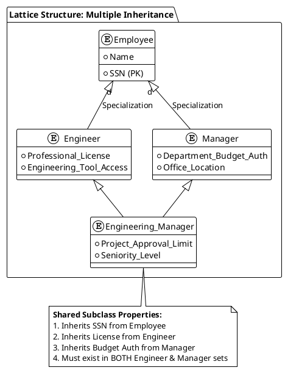
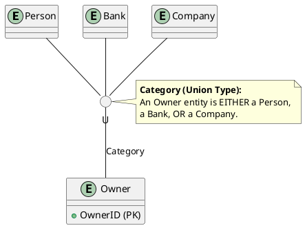
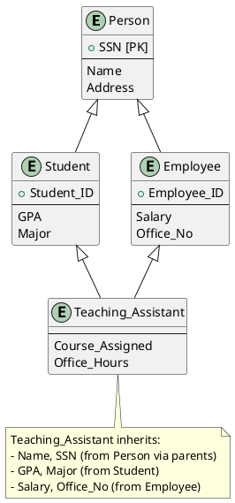
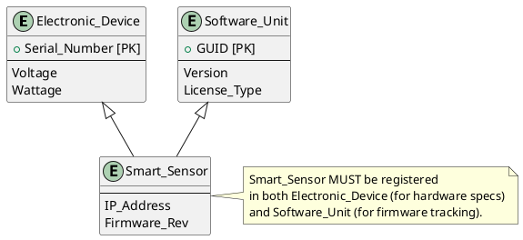
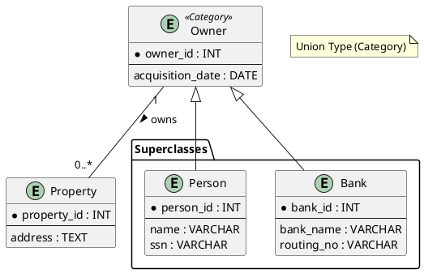
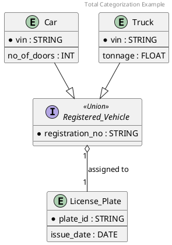

---
tags:
  - field/cs
  - subject/database
  - concept/eerd-advanced
---

[[T.O.C (Database Systems Notes).md|Up to Database Systems Notes]]

# Hierarchies, lattices and shared subclasses
> **Seed:** "Explain in detail the concept of lattices in EERDs in detail along with examples in plantuml code"

## Structural Definition: The Shared Subclass (Multiple Inheritance)
In Enhanced Entity-Relationship (EER) modeling, a **Lattice** is a specialization hierarchy where a subclass has more than one superclass. This represents **Multiple Inheritance**. While a standard hierarchy forms a tree structure (one parent per node), a lattice forms a Directed Acyclic Graph (DAG).

A subclass in a lattice is termed a **Shared Subclass**. It inherits the intersection of properties from all its superclasses:
1.  **Attribute Inheritance:** The shared subclass possesses the sum of all attributes from every superclass.
2.  **Relationship Inheritance:** The shared subclass participates in all relationship types defined for any of its superclasses.
3.  **Membership Requirement:** An entity belonging to a shared subclass must exist in **every** superclass it inherits from. This is a logical `AND` operation at the instance level.

## Mechanical Analogy: The Hybrid Assembly Node
Visualize an industrial manufacturing plant with two distinct feeder lines:
- **Line A:** Produces Internal Combustion Engines (ICE).
- **Line B:** Produces Electric Motors (EM).

A standard hierarchy would treat a "Truck" as a subclass of "Vehicle." However, a **Hybrid Vehicle** node acts as a **Lattice Point**. 
- It requires an intake from **Line A** (for the petrol tank and pistons).
- It requires an intake from **Line B** (for the battery pack and inverter).

The Hybrid Vehicle node cannot exist unless it satisfies the requirements of both specialized feeder lines simultaneously. It is not "either-or"; it is a functional "sum" of both architectures.

## Formal Constraints and Specialized Types
Lattices are often modeled using **Category Types (Union Types)**, though they differ slightly in membership logic:
- **Shared Subclass (Lattice):** Must be a member of *all* superclasses.
- **Category (Union Type):** Must be a member of *at least one* superclass (a logical `OR`).

### Disjointness and Completeness
In a lattice, the shared subclass is inherently overlapping regarding its superclasses (since the entity must exist in all of them). However, the *specialization* that leads to the shared subclass can still be constrained by:
- **Total Participation:** Every entity in the superclasses must belong to at least one subclass.
- **Partial Participation:** Some entities in the superclasses may not belong to any subclass.

## Implementation: PlantUML Schematic
The following PlantUML code demonstrates a lattice where an `Engineering_Manager` inherits from both `Engineer` and `Manager`, who both originate from the `Employee` superclass.

### Complex Lattice: Union Types (Categories)
A Category represents a subclass that is a subset of the **Union** of different entity types. This is used when the superclasses are not necessarily the same entity type.

## Internal Data Flow: Attribute Aggregation
When a query is executed against a shared subclass (e.g., `SELECT * FROM Engineering_Manager`), the database engine performs a multi-way join or looks up a flattened view. 
- **The Logical Join:** `Engineering_Manager JOIN Engineer ON id JOIN Manager ON id JOIN Employee ON id`.
- **Constraint Enforcement:** The system must ensure that for every entry in the `Engineering_Manager` table, a corresponding ID exists in all parent tables. Failure to maintain this results in a violation of the Lattice integrity.

> **Seed:** "Explain in detail the concept of shared subclasses in EERDs along with detailed examples in plantuml code"

## Definition & Architecture
In Enhanced Entity-Relationship (EER) modeling, a **Shared Subclass** represents the intersection of two or more superclasses. While standard specialization involves a one-to-many relationship between a superclass and its subclasses, a shared subclass implements **Multiple Inheritance**. 

An entity belonging to a shared subclass must simultaneously be a member of *every* superclass participating in the relationship. This is not an "OR" condition but a strict "AND" condition. For instance, if subclass $C$ is a shared subclass of superclasses $A$ and $B$, then for any entity $e$, $e \in C \implies (e \in A \land e \in B)$.

### Internal Mechanisms
- **Attribute Aggregation:** The shared subclass inherits the union of all attributes from its parent superclasses. If Superclass A has $\{a_1, a_2\}$ and Superclass B has $\{b_1, b_2\}$, the shared subclass inherits $\{a_1, a_2, b_1, b_2\}$.
- **Relationship Inheritance:** Any relationship involving a superclass is automatically available to the shared subclass.
- **Identity:** The entity maintains a single unique identifier (Primary Key) across all levels, typically inherited from the most "senior" or logical primary superclass.

## Mechanical Analogy: The Specialized Hybrid Engine
Consider an automotive assembly factory. 
- **Superclass A:** Internal Combustion Engines (Fuel systems, pistons).
- **Superclass B:** Electric Motors (Batteries, copper coils).
- **Shared Subclass:** Hybrid Power Unit.

A Hybrid Power Unit is not just a motor "or" an engine; it is a specialized component that exists at the physical intersection of both production lines. To be a "Hybrid," it must pass through the fuel-injection testing line (Superclass A) and the high-voltage battery calibration line (Superclass B). It inherits the requirements and performance metrics of both. If it fails to meet the criteria of either parent line, it cannot exist in the Shared Subclass.

## Relational Mapping & Constraints
When mapping shared subclasses to a relational schema, the system typically employs multiple Foreign Keys pointing to the primary keys of the superclass tables.

1. **Existence Constraint:** An entry in the Shared Subclass table cannot exist without a corresponding entry in *all* parent tables.
2. **Key Unification:** The Primary Key of the shared subclass table is also the Foreign Key to all parent tables, ensuring a 1:1 relationship between the shared entity and its superclass representations.

## PlantUML Modeling
Shared subclasses are represented by multiple inheritance arrows pointing from the subclass to its various superclasses.

### Example 1: Academic Environment
In a university, a "Teaching Assistant" (TA) is often both a "Student" and an "Employee."

### Example 2: Engineering Components
A "Smart Sensor" might be a subclass of both "Electronic Device" and "Software Unit."

> **Seed:** "Explain in detail the concept of categorization or union types in EERDs along with detailed examples in plantUML codes"

## Definition & Architecture
In Enhanced Entity-Relationship (EER) modeling, a **Categorization** (or **Union Type**) represents a subclass that is a collection of entities from a union of distinct entity types. Unlike standard specialization, where a subclass inherits from a single superclass, a category is a subset of the **union** of two or more superclasses.

These superclasses usually represent different entity types (e.g., `PERSON`, `BANK`, `COMPANY`) that participate in a specific relationship as a single unit (e.g., `OWNER`).

### Structural Components:
1. **Superclasses ($S_1, S_2, ..., S_n$):** The distinct entity types that form the union.
2. **Subclass ($C$):** The category/union type. $C \subseteq (S_1 \cup S_2 \cup ... \cup S_n)$.
3. **Inheritance:** An entity in the category inherits attributes and relationships from the specific superclass to which it belongs. If an entity exists in $S_1$, it inherits from $S_1$; if in $S_2$, it inherits from $S_2$.

## Mechanical Analogy: The Universal Adapter
Consider a **Universal Power Adapter**. 
- The **Superclasses** are the various wall socket standards: US Type A, UK Type G, and EU Type C. Each has a different physical architecture and voltage regulation.
- The **Category (Union Type)** is the "Active Input Source."
- The **Subclass** (the adapter's internal circuitry) doesn't care which specific socket it is plugged into; it only needs to "inherit" the electrical current from *any* of the valid inputs to power the device. 

The adapter represents a union of these socket types. It only interacts with one socket at a time, but its definition encompasses the capability to interface with any member of the union.

## Participation Constraints
Categorization is governed by participation rules that define how entities from superclasses populate the category.

### 1. Total Categorization
An entity in the subclass MUST belong to at least one of the superclasses. This is represented by a double line in traditional EER diagrams.
- **Predicate:** $C = (S_1 \cup S_2 \cup ... \cup S_n)$.
- **Example:** A `VEHICLE` in a registry must be either a `CAR` or a `TRUCK`.

### 2. Partial Categorization
The subclass is a subset of the union. Some entities in the superclasses may not belong to the category.
- **Predicate:** $C \subset (S_1 \cup S_2 \cup ... \cup S_n)$.
- **Example:** In a `PROPERTY_OWNER` category, a `PERSON` or a `COMPANY` can be an owner, but not every `PERSON` or `COMPANY` in the database necessarily owns property.

## Implementation: PlantUML Modeling
PlantUML does not have a native "Circle-U" (Union) symbol as found in Elmasri/Navathe notation, but we simulate it using empty interfaces or generalized inheritance paths to show the union of distinct types into a single role.

### Example 1: Property Ownership (Partial Categorization)
In this scenario, `Owner` is a union of `Person` and `Bank`.

### Example 2: Registered Vehicle (Total Categorization)
A `RegisteredVehicle` is the union of `Car` and `Truck`. Every `RegisteredVehicle` must be one of the two.

## Internal Data Logic
At the implementation level (Relational Mapping):
- **Option A (Multiple Relations):** Create a table for the category with a surrogate `Owner_ID` and map the superclass primary keys to it.
- **Option B (Foreign Keys):** The `Property` table contains an `Owner_ID`. A separate mapping table or a type-discriminator column in the `Owner` table tracks whether the ID refers to a `PERSON_ID` or a `BANK_ID`.