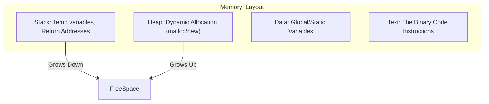
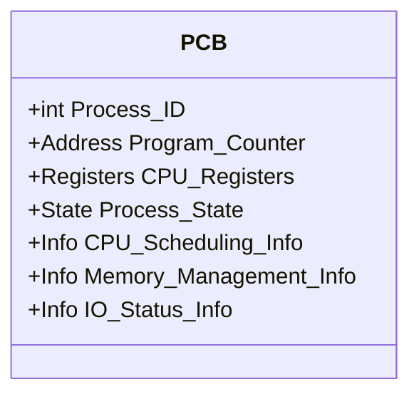
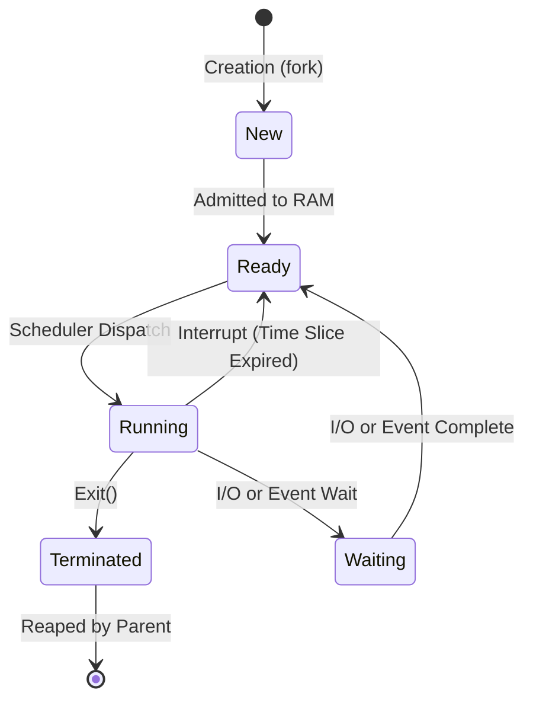

---
tags:
- field/cs
- subject/os
- concept/os/process
---

# OS Process Fundamentals

[[T.O.C (Operating Systems Notes)|Up to Operating Systems Notes]]

#concept #os #process-management

## 1. Process Definition

> **Prompt:** "Explain in detail what exactly is a process the components comprising a process give real world examples of a program and a process. also draw a mermaid diagrams to show the internals of a process"
> **Lens Applied:** The Chief Engineer / First Principles

# Deep Dive: The Process (Active Entity)

### 1. Ontological Definition
A **Process** is a *program in execution*.
*   **Program:** A passive entity. A binary file sitting on a hard disk (e.g., `chrome.exe`). It is dead code.
*   **Process:** An active entity. That same binary loaded into RAM, assigned a Program Counter (PC), Registers, and Stack. It is "alive."

### 2. Anatomy of a Process
When the OS loads a program, it allocates a specific chunk of memory divided into segments:

### 3. Real World Analogy
*   **Program:** A recipe book sitting on a shelf.
*   **Process:** The Chef (CPU) actively reading the recipe (Text), grabbing ingredients (Data), and chopping them on the counter (Registers).

---

## 2. Process Control Block (PCB)

> **Prompt:** "what is a process control block in a process. explain in detail using a real world examples and mermaid diagrams"
> **Lens Applied:** The Kernel Architect

### 1. The Kernel's Notebook
The **Process Control Block (PCB)** (or Task Struct in Linux) is a data structure in the Kernel's memory that stores *everything* the OS needs to know about a specific process.
*   **Crucial:** If the process is paused (swapped out), its entire state is saved to the PCB so it can resume later.

### 2. Components of a PCB

### 3. Analogy
The PCB is like a **Doctor's Patient Chart**.
*   It tracks the ID (PID).
*   It notes the current status (Vital Signs/Registers).
*   It records history so any doctor (CPU Core) can pick up the treatment where the last one left off.

---

## 3. The Process Life Cycle

> **Prompt:** "explain the life cycle of a process in depth using a mermaid diagram. all possible path a process can take in the cycle like waiting, zombie, child etc etc"
> **Lens Applied:** The Chief Engineer / Finite State Machines

### 1. The 5-State Model
Processes migrate between these states under Kernel control.

### 2. Detailed States
*   **New:** The process is being created (PCB allocated).
*   **Ready:** In RAM, waiting for the CPU. (Sitting in the Ready Queue).
*   **Running:** Currently executing instructions on the CPU.
*   **Waiting (Blocked):** Cannot run even if CPU is free (waiting for Disk/Network).
*   **Terminated:** Finished execution.
    *   **Zombie:** Process has exited, but Parent hasn't called `wait()` yet. It is dead but occupies a slot in the process table.
    *   **Orphan:** Parent died without waiting. Adopted by `init` process.

---

## 4. Context Switching

> **Prompt:** "explain the process of context switching if a processor done by an OS when switching from one process to another"
> **Lens Applied:** The Kernel Architect

### The "Cost" of Multitasking
**Context Switching** is the procedure of saving the state of the currently running process (to its PCB) and restoring the state of the next process (from its PCB).

### The Sequence
1.  **Interrupt:** Timer expires or I/O request.
2.  **Save State:** Kernel saves $P_{old}$ registers, PC, and Stack Pointer to $PCB_{old}$.
3.  **Scheduler Decision:** Kernel picks $P_{new}$.
4.  **Restore State:** Kernel loads registers, PC, and Stack Pointer from $PCB_{new}$.
5.  **Resume:** CPU jumps to the PC of $P_{new}$.

### Overhead
Context switching is **pure overhead**. No useful user work is done during the switch. It depends on hardware speed (memory latency, register count).
