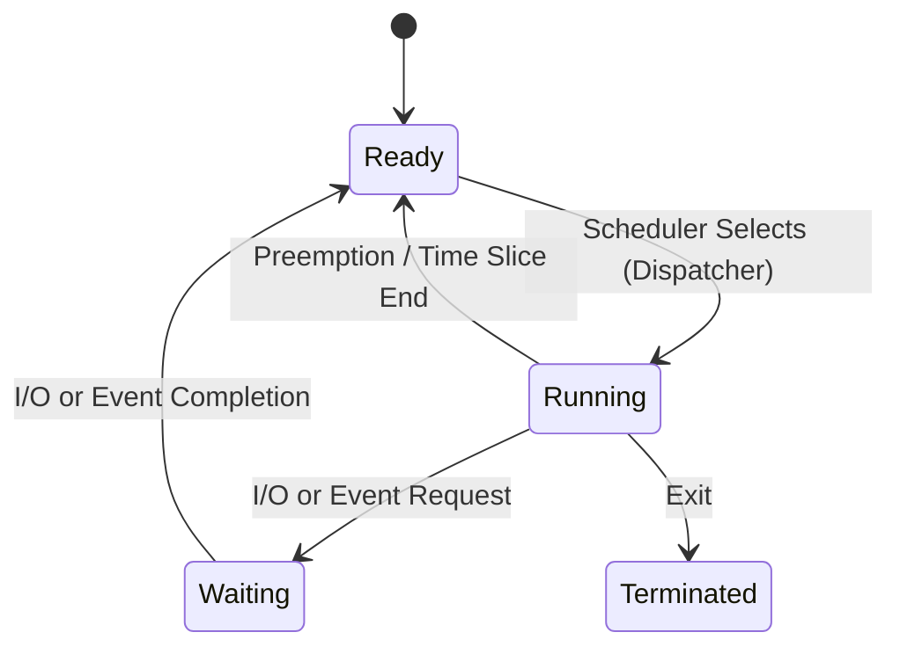

---
tags:
- field/cs
- subject/os
- concept/scheduling/purpose
---
[[T.O.C (Operating Systems Notes)|Up to OS Notes]]

# OS Schedulers

> **Seed:** "What exactly is the purpose of a schedular, explain in detail."
> **Lens:** First Principles / The Chief Engineer

### 1. Ontological Definition
A CPU Scheduler (or Short-Term Scheduler) is the kernel-level system component responsible for deciding which of the processes in the 'Ready' state (Ready Queue) will be allocated the CPU for execution next. It is the primary mechanism for implementing multiprogramming, ensuring that the system resources are shared efficiently among multiple competing tasks. In the domain of Operating Systems, it operates as the implementation of the scheduling algorithm selected for the environment.

### 2. The Internal Mechanics (Under the Hood)
- **Control Flow:**
  - **Trigger:** The scheduler is invoked during a **context switch**. This occurs when the current process blocks (I/O), terminates, yields (explicitly or via time-slice expiration), or is preempted by a higher-priority task.
  - **Decision:** The scheduler selects a process from the **Ready Queue** based on a specific algorithm (e.g., Round Robin, FCFS, Priority).
  - **Dispatch:** Once selected, the **Dispatcher** takes over to give control of the CPU to the selected process.

- **State Changes:**
  - Transitions the selected process from **READY** to **RUNNING**.
  - Transitions the previous process from **RUNNING** to either **READY** (if preempted), **WAITING** (if blocked), or **TERMINATED**.

- **Data Flow:**
  - The **Process Control Block (PCB)** of the previous process is saved to memory/stack.
  - The PCB of the new process is loaded into registers (PC, SP, etc.).
  - The **Ready Queue** is updated (a node is removed).

- **Diagram/Mechanism:**

- **Data Structures:**
  - **Ready Queue:** Often implemented as a doubly-linked list, priority queue (using a binary heap or red-black tree), or a multi-level feedback queue.

### 3. Systems Context & Anchoring
**Analogy: The Airport Air Traffic Controller (ATC).**
- **Ready Queue:** The line of planes idling on the taxiway, ready for takeoff.
- **CPU:** The single active runway available for takeoffs.
- **Scheduler:** The ATC tower deciding which plane gets cleared for takeoff next.
- **Context Switch:** The time spent by the ground crew clearing the runway and the pilot of the next plane taxiing into position.
- **I/O Wait:** A plane that returns to the gate because of a maintenance issue (it leaves the runway and the taxiway queue).
- **Preemption:** A medical emergency flight that jumps the queue and is allowed to land/takeoff immediately, forcing others to wait.

### 4. Edge Cases & Constraints
- **Priority Inversion:** A low-priority task holds a resource (mutex) needed by a high-priority task, while a medium-priority task preempts the low-priority one. The high-priority task is effectively blocked by a lower-priority one.
- **Starvation:** In a pure priority-based system, a low-priority task may never get CPU time if high-priority tasks are constantly entering the queue.
- **Overhead (Thrashing):** If the time slice is too small, the system spends more time switching contexts than actually executing code.
