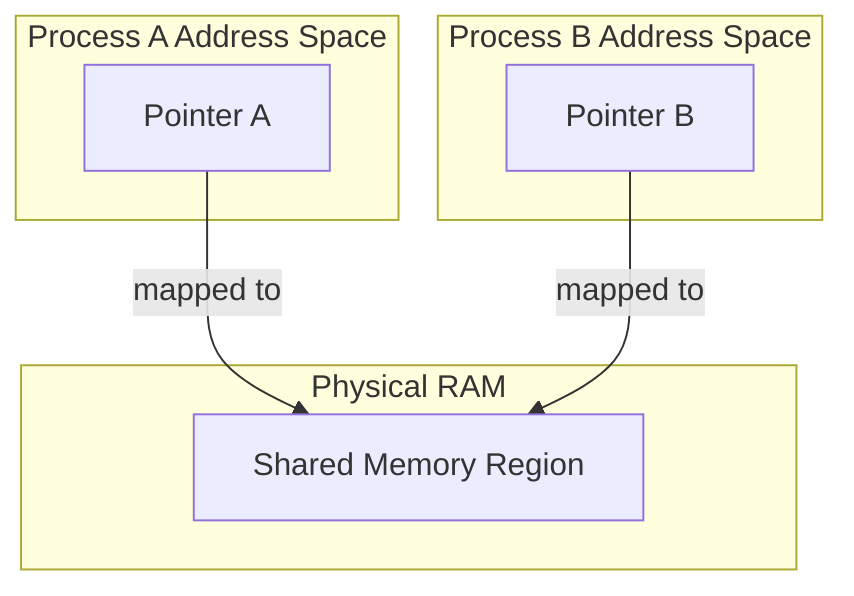

---
tags:
- field/cs
- subject/os
- concept/ipc/concepts
---

[[T.O.C (Operating Systems Notes)|Up to Operating Systems Notes]]

# Inter-process Communication (IPC)

> [!INFO] **Prompt:** "What's the concept of inter-process communication in processes where one is created forking. Message passing, Shared memory. Are pipes a way of message passing or memory sharing?"
> **Lens Applied:** The Chief Engineer / First Principles

# Deep Dive: Inter-Process Communication (IPC)

## 1. Ontological Definition
Inter-Process Communication (IPC) is the mechanism provided by the Operating System that allows processes to manage shared data and synchronize their execution. Since processes have isolated address spaces for security and stability, IPC is necessary to bridge these gaps.

## 2. The Internal Mechanics (Under the Hood)
When a process is `forked()`, it creates a separate address space. Changes in the child do not affect the parent. IPC mechanisms provide a channel for this interaction.

### The Two Pillars of IPC:
1.  **Message Passing:**
    *   **Mechanism:** Processes communicate by sending and receiving messages via a kernel-managed buffer/queue.
    *   **Logic:** `send(message)` and `receive(message)`.
    *   **Synchronization:** Usually handled by the kernel (blocking calls).
2.  **Shared Memory:**
    *   **Mechanism:** A specific region of physical memory is mapped into the virtual address space of multiple processes.
    *   **Logic:** `read` and `write` directly to memory addresses.
    *   **Synchronization:** Must be handled by the processes themselves (e.g., Semaphores/Mutexes) to avoid race conditions.

### The "Pipe" Question:
**Pipes are a form of Message Passing.**
*   **Why?** Data is written to one end and read from the other. The kernel manages a buffer. The data is "moved" through the buffer, not simply accessed in a shared location. Once data is read from a pipe, it is removed from the buffer.

---

## Message passing

> [!INFO] **Prompt:** "Explain in detail using code examples the concept of message passing in inter process communication. Dry run and explain the code in detail and use diagrams of mermaid"
> **Lens Applied:** The Chief Engineer / The Constructivist

# Technical breakdown: Message Passing via Pipes

## 1. Surgical Definition (Internals)
A Pipe is a unidirectional communication channel managed by the kernel. It consists of a fixed-size buffer (often 4KB or 64KB) in kernel space. Two file descriptors are used: `fd[0]` for reading and `fd[1]` for writing.

## 2. The Laboratory (Proof of Concept)
```c
#include <stdio.h>
#include <unistd.h>
#include <string.h>

int main() {
    int pipe_fds[2];
    char buffer[20];
    
    if (pipe(pipe_fds) == -1) {
        perror("Pipe failed");
        return 1;
    }

    if (fork() == 0) {
        // Child: Sender
        close(pipe_fds[0]); // Close unused read end
        char *msg = "Hello Parent";
        write(pipe_fds[1], msg, strlen(msg) + 1);
        close(pipe_fds[1]);
    } else {
        // Parent: Receiver
        close(pipe_fds[1]); // Close unused write end
        read(pipe_fds[0], buffer, sizeof(buffer));
        printf("Parent received: %s
", buffer);
        close(pipe_fds[0]);
    }
    return 0;
}
```

## 3. Flow and Dry Run Analysis
1.  **`pipe()`:** Kernel creates a buffer and two FDs in the process's file descriptor table.
2.  **`fork()`:** Child inherits the FDs. Both now point to the same kernel buffer.
3.  **Child (Sender):** Closes `read` end. Writes "Hello Parent" into `pipe_fds[1]`. The kernel copies this string into its internal buffer.
4.  **Parent (Receiver):** Closes `write` end. Calls `read()`. If the buffer is empty, the Parent blocks (sleeps). Once the Child writes, the Parent wakes up, and the kernel copies the data from its buffer into the Parent's `buffer` array.

## 4. Visual Trace (Mermaid)
```mermaid
graph LR
    subgraph User Space (Process A)
    A[Write End fd1]
    end
    subgraph Kernel Space
    B[Pipe Buffer]
    end
    subgraph User Space (Process B)
    C[Read End fd0]
    end
    A -- write() --> B
    B -- read() --> C
```

---

## Shared Memory

> [!INFO] **Prompt:** "Explain in detail using code examples the concept of shared memory in inter process communication. Dry run and explain the code in detail and use diagrams of mermaid. Shared memory via pipes and POSIX API in depth examples"
> **Lens Applied:** The Chief Engineer / The Constructivist

# Technical breakdown: Shared Memory (POSIX API)

## 1. Surgical Definition (Internals)
Shared Memory is the fastest form of IPC because it avoids copying data between user space and kernel space. The kernel creates a memory object and maps it into the page tables of multiple processes.

## 2. The Laboratory (Proof of Concept)
Using the POSIX `shm_open` and `mmap` APIs.

```c
#include <stdio.h>
#include <sys/mman.h>
#include <sys/stat.h>
#include <fcntl.h>
#include <unistd.h>
#include <string.h>

int main() {
    const char *name = "/OS_SHM";
    const int SIZE = 4096;

    if (fork() == 0) {
        // Child: Producer
        int shm_fd = shm_open(name, O_CREAT | O_RDWR, 0666);
        ftruncate(shm_fd, SIZE);
        void *ptr = mmap(0, SIZE, PROT_WRITE, MAP_SHARED, shm_fd, 0);
        sprintf(ptr, "Shared Data from Child");
    } else {
        // Parent: Consumer
        sleep(1); // Wait for child to write (Simple sync)
        int shm_fd = shm_open(name, O_RDONLY, 0666);
        void *ptr = mmap(0, SIZE, PROT_READ, MAP_SHARED, shm_fd, 0);
        printf("Parent read from shared memory: %s
", (char*)ptr);
        shm_unlink(name); // Cleanup
    }
    return 0;
}
```

## 3. Flow and Dry Run Analysis
1.  **`shm_open`:** Creates/opens a shared memory object (essentially a "file" that exists in RAM).
2.  **`ftruncate`:** Sets the size of the shared memory object.
3.  **`mmap`:** This is the magic. It maps the shared memory object into the process's address space. The returned `ptr` points to the same physical RAM in both processes.
4.  **Producer (Child):** Writes directly to memory using `sprintf(ptr, ...)`. No system call is needed to move data; it's just a memory write.
5.  **Consumer (Parent):** Reads directly from `ptr`. The data written by the child is instantly visible to the parent.

## 4. Visual Trace (Mermaid)


## 5. Shared Memory vs Pipes (Rosetta Stone Comparison)
| Feature | Pipes (Message Passing) | Shared Memory |
| :--- | :--- | :--- |
| **Data Flow** | Kernel Buffer (Copying) | Direct RAM Access (Zero Copy) |
| **Speed** | Slower (System calls overhead) | Faster (Memory access speed) |
| **Sync** | Implicit (read blocks) | Explicit (user must use Semaphores) |
| **Lifetime** | Lost after read | Persists until unlinked |
