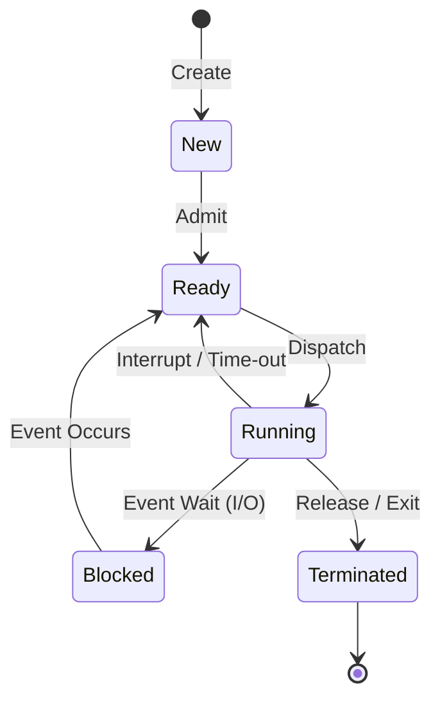

---
tags:
  - field/cs
  - subject/os
  - concept/five-state-model
---

[[T.O.C (Operating Systems Notes).md|Up to Operating Systems Notes]]

# Five-State Process Model
## Introduction
> **Seed:** "@expand Write an introduction as it is written in books about five-state processes that introduces this concept in the form of story. No techincals"

## The Kitchen Chronicle: A Narrative of Execution

Imagine a high-end restaurant kitchen during the dinner rush. A waiter scribbles an order for a signature steak and slips the paper through the window. At this moment, the order is **Born**. It exists as a requirement, but no one has touched it yet; it is merely a commitment made to a customer.

The head chef takes the slip and clips it onto a metal rail. Now, the order is **Waiting in Line**. All the ingredients are prepped, the pans are clean, and the order is ready to be cooked. It is simply waiting for the chef’s hands to become free.

Suddenly, the chef grabs the pan. The steak hits the heat. The order is now **In Progress**. Energy is being consumed, work is being done, and the order has the chef's full attention.

But then, a complication: the steak requires a specific red wine reduction that is still simmering on the back burner. The chef cannot move forward until that sauce is ready. He moves the steak to a side warming tray and picks up a different order. The steak is now **Stalled**. It is not finished, but it cannot proceed because it is waiting for something outside the chef's immediate control.

Once the sauce is ready, the steak doesn't go back on the heat immediately. It goes back to the **Metal Rail**, waiting for its turn again. When the chef finally finishes the sear and plates the dish, the order is **Complete**. The ticket is spiked, the workspace is cleared, and the meal leaves the kitchen forever.

## The Mechanics of State Transition

The five-state process model is a formal state-machine representation of a process's lifecycle within an operating system. It governs how the kernel manages the "ticket" (the Process Control Block) as it moves through various stages of hardware utilization.

1.  **New (Created):** The process is being created. The OS defines the process identifier (PID) and allocates the initial memory space, but the process has not yet been loaded into the executable pool.
2.  **Ready (Runnable):** The process is in main memory and prepared to execute. It lacks only the processor's time. These processes sit in a "Ready Queue," typically managed by a scheduler.
3.  **Running (Executing):** The process has been "dispatched." Its instructions are currently being executed by the CPU.
4.  **Blocked (Waiting):** The process cannot continue until a specific event occurs, such as an I/O completion (reading a file) or receiving a signal. It is moved out of the CPU's view so other work can be done.
5.  **Terminated (Exit):** The process has finished execution or was killed. The OS reclaims its resources (memory, file handles) but may keep the exit code in the process table briefly for the parent process to read.

## System-Level Control Flow

The transition between these states is managed by the **Scheduler** and the **Dispatcher**. 

- **Admit:** Transitions a process from `New` to `Ready`.
- **Dispatch:** The Short-Term Scheduler selects a process from the `Ready` queue to move to `Running`.
- **Interrupt/Time-out:** If a process exceeds its "time slice" (quantum), the OS preempts it, moving it from `Running` back to `Ready`.
- **Event Wait:** If the process requests a resource (like a disk read), it moves from `Running` to `Blocked`.
- **Event Occurs:** Once the disk read completes, the hardware sends an interrupt, and the OS moves the process from `Blocked` back to `Ready`—it never goes directly back to `Running`.

### Mathematical Notation of State Change
Let $S = \{New, Ready, Running, Blocked, Terminated\}$ be the set of states.
Let $T$ be the transition function:
$$T: S \times Event \rightarrow S$$
For example:
$T(Running, Interrupt) = Ready$
$T(Running, I/O\_Request) = Blocked$
$T(Blocked, I/O\_Complete) = Ready$

## State Transition Diagram



## Failure Modes and Edge Cases

### 1. Resource Starvation
A process in the `Ready` state may never reach the `Running` state if the scheduler continuously picks higher-priority tasks. The process remains "starved" in the queue, never progressing despite being technically "ready."

### 2. Deadlock
Two processes in the `Blocked` state may be waiting for events that only the other can trigger. 
- Process A is Blocked, waiting for Resource Y (held by B).
- Process B is Blocked, waiting for Resource X (held by A).
Neither can ever move back to `Ready`.

### 3. Zombie Processes
When a process enters the `Terminated` state, its resources are freed, but its entry in the process table remains until the parent process acknowledges the exit. If the parent fails to do so, the process becomes a **Zombie**—it consumes no memory but occupies a slot in the limited process table.

### 4. Orphan Processes
If a parent process terminates while the child is still in `Running` or `Blocked`, the child becomes an **Orphan**. In most systems (like Linux), the `init` or `systemd` process (PID 1) "adopts" the orphan to ensure it is properly cleaned up when it eventually reaches the `Terminated` state.

## How to use states for scheduling?
> **Seed:** "How can we use the concept of five-state process models to schedule processes? What does the flow look like what data structure is used? Explain using a detailed example walkthrough."

The five-state process model is a finite state machine (FSM) that defines the lifecycle of an execution unit within an operating system, transitioning through New, Ready, Running, Blocked, and Exit states. Scheduling is the mechanism of managing transitions between these states by manipulating pointers to Process Control Blocks (PCBs) stored in kernel-level data structures.

## The Architecture of Process States

The kernel manages processes by moving their identifiers through various queues. Each state represents a specific condition of the process relative to the CPU and system resources:

1.  **New:** The process is being created. The OS defines a PID, allocates a PCB, but has not yet loaded the program into main memory.
2.  **Ready:** The process is in main memory and prepared to execute. It resides in the **Ready Queue**, waiting for the Short-Term Scheduler (Dispatcher) to grant it CPU time.
3.  **Running:** The CPU is currently executing the process’s instructions. Only one process can be in this state per processor core.
4.  **Blocked (Waiting):** The process cannot continue until an external event occurs (e.g., I/O completion, a signal, or a mutex release). It is moved out of the Ready Queue and into a **Device Queue** or **Wait Queue**.
5.  **Exit (Terminated):** Execution is complete or aborted. The OS holds the PCB briefly to allow the parent process to read the exit code before deallocating all resources.

## Data Structures: The Ready and Wait Queues

Internally, the scheduler does not "move" the process memory. Instead, it moves the **Process Control Block (PCB)**—a data structure containing the Program Counter (PC), CPU registers, stack pointers, and memory management information.

The primary data structure used is a **Linked List of PCBs**, typically implemented as a FIFO (First-In-First-Out) or Priority Queue.

```c
struct PCB {
    int pid;
    enum State { NEW, READY, RUNNING, BLOCKED, EXIT } state;
    int program_counter;
    int registers[16];
    struct PCB *next; // Pointer for queue linking
};

struct Queue {
    struct PCB *head;
    struct PCB *tail;
};
```

When a process transitions from `Ready` to `Running`, the scheduler dequeues the PCB from the `Ready Queue` and loads its register values into the physical CPU. When it moves to `Blocked`, it is enqueued into a specific `Device Queue` associated with the I/O request.

## The Scheduling Flow: A Detailed Walkthrough

Consider a scenario with two processes: `P1` (I/O intensive) and `P2` (CPU intensive).

1.  **Admission:** `P1` and `P2` are created. The OS moves them from **New** to **Ready**. Their PCBs are linked into the `Ready Queue`.
    *   *Queue:* `[P1] -> [P2]`
2.  **Dispatch:** The scheduler selects `P1`. The context switcher saves current CPU state and loads `P1`'s PCB data. `P1` moves from **Ready** to **Running**.
3.  **I/O Request (Blocking):** `P1` executes a `read()` system call. It cannot proceed until the disk controller returns data. The kernel moves `P1` from **Running** to **Blocked**. `P1`'s PCB is moved to the `Disk Wait Queue`.
    *   *Ready Queue:* `[P2]`
    *   *Disk Queue:* `[P1]`
4.  **Context Switch:** The scheduler sees the CPU is idle. It dispatches `P2`. `P2` moves from **Ready** to **Running**.
5.  **Interrupt (Preemption):** A timer interrupt occurs (time-slice expired). The kernel pauses `P2`. `P2` moves from **Running** back to **Ready**.
    *   *Ready Queue:* `[P2]`
6.  **I/O Completion:** The disk controller sends an interrupt. The kernel moves `P1` from **Blocked** to **Ready**.
    *   *Ready Queue:* `[P2] -> [P1]`
7.  **Termination:** `P2` finishes its instructions. It moves from **Running** to **Exit**. The kernel reclaims its memory and notifies the parent.

## Mechanical Analogy: The Single-Armed Robot
Imagine a factory with one **Robot Arm (CPU)** and several **Conveyor Belts (Queues)**.
-   **New:** A raw part arrives at the loading dock.
-   **Ready:** The part is placed on the "Ready Belt" leading to the Robot Arm.
-   **Running:** The Robot Arm picks up the part and performs work.
-   **Blocked:** The part requires a paint job that takes 10 minutes. The Robot Arm puts the part on the "Paint-Drying Rack" (Blocked Queue) and immediately picks up the next part from the "Ready Belt."
-   **Exit:** The part is finished and placed in the "Shipping Crate."

If the Robot Arm waited for the paint to dry without switching parts, the factory efficiency (CPU Utilization) would plummet. The five-state model ensures the Robot Arm is always moving parts that are actually ready for work.

## Edge Cases and Failure Modes

*   **Starvation:** In a priority-based scheduler, a low-priority process in the **Ready** state might never transition to **Running** if higher-priority processes keep entering the queue.
*   **Context Switch Overhead:** If the scheduler moves processes between **Running** and **Ready** too frequently (thrashing), the CPU spends more time saving/loading PCBs than executing actual instructions.
*   **Zombie Processes:** If a process moves to **Exit** but the parent fails to "reap" it (call `wait()`), the PCB remains in the system table, consuming a PID slot despite the process being dead.
*   **Deadlock in Blocked State:** If `P1` is **Blocked** waiting for `P2`, and `P2` is **Blocked** waiting for `P1`, neither will ever return to the **Ready** queue.

> **Seed:** "Explain the use of multiple queues in five-state processes for scheduling even for IO."

## Architecture of Partitioned Waiting States
In a five-state process model (New, Ready, Running, Blocked, Exit), a single "Waiting" queue creates a linear bottleneck. Modern operating systems implement multiple queues to decouple the Dispatcher from I/O event handling. Instead of a monolithic Blocked list, the system maintains a set of discrete Device Queues (or Event Queues), where each queue corresponds to a specific hardware controller or synchronization primitive.

When a process transitions from **Running** to **Blocked**, the Operating System does not simply mark it as "waiting"; it migrates the Process Control Block (PCB) pointer to the specific queue associated with the resource that triggered the block (e.g., a Disk I/O queue, a Network Buffer queue, or a Timer queue).

## The Mechanical Flow: Dispatching and Interrupt Handling
The efficiency of multiple queues lies in the elimination of the "thundering herd" problem and $O(N)$ search times during interrupt service routines (ISRs).

1.  **Transition to Blocked:** A process executes a system call for disk read. The CPU traps to the kernel. The kernel moves the PCB from the "Running" state to the "Disk Controller Queue." 
2.  **Concurrency in Queues:** While Process A is in the Disk Queue, the CPU dispatches Process B from the "Ready Queue." Simultaneously, Process C may be in the "Keyboard Queue."
3.  **Event Completion:** When the Disk Controller completes the read, it issues a hardware interrupt. 
4.  **Targeted Migration:** The ISR identifies the specific Disk Queue, dequeues the head PCB, and moves it directly to the **Ready Queue**. 

Without multiple queues, the OS would have to traverse a single list of all blocked processes on every interrupt to find which process was waiting for *that specific* event—a massive overhead in high-I/O environments.

## The Assembly Line Analogy
Think of the CPU as a **High-Precision Drill** on a factory floor.
- **The Ready Queue** is the conveyor belt of parts waiting to be drilled.
- **The Running State** is the part currently under the drill bit.
- **Multiple Blocked Queues** are specialized "side-tables" for parts that need other treatments before they can be drilled again (e.g., a Painting Table, a Cooling Rack, a Drying Station).

If every part that wasn't ready to be drilled was thrown into a single pile, the foreman would have to sort through the entire pile every time a single part finished drying to find out which one it was. By having a specific "Drying Rack," the foreman knows exactly which part is ready as soon as the timer goes off.

## Control Flow Pseudocode
```c
struct ProcessControlBlock {
    int pid;
    State state;
    Registers regs;
    // ...
};

Queue readyQueue;
Queue diskQueue;
Queue networkQueue;

void handle_io_request(PCB *proc, DeviceType type) {
    proc->state = BLOCKED;
    save_context(proc);
    
    switch(type) {
        case DISK:
            enqueue(&diskQueue, proc);
            break;
        case NETWORK:
            enqueue(&networkQueue, proc);
            break;
    }
    schedule_next(); // Move to next process in readyQueue
}

void interrupt_handler_disk() {
    PCB *proc = dequeue(&diskQueue);
    if (proc != NULL) {
        proc->state = READY;
        enqueue(&readyQueue, proc);
    }
}
```

## Failure Modes and Performance Trade-offs
- **Queue Starvation:** If the scheduling logic for moving processes from Blocked to Ready doesn't account for priority, a low-priority process might stay at the head of a device queue while higher-priority processes behind it are ready to proceed but blocked by the FIFO nature of the device controller.
- **Memory Overhead:** Maintaining dozens of queue pointers and linked-list structures consumes kernel memory. In embedded systems with severely limited RAM, developers may revert to simpler queue structures at the cost of latency.
- **Interrupt Latency:** If an ISR takes too long to migrate a PCB from a device queue to the Ready Queue, it can lead to "dropped" interrupts if the hardware buffer overflows before the next process can take over.

## Is two process Model sufficient?
> **Seed:** "take an example of 3 processes and perform an example run to identify if the five-state process model for scheduling is sufficient or not. Explain your findings with reason. Track each state in the example run."

## The Five-State Model: Architectural Constraint
The five-state process model (New, Ready, Running, Blocked, Exit) governs the lifecycle of a process based on CPU availability and event triggers. In this model, the **Blocked** state is a catch-all for any process waiting on an external event, typically I/O. However, this model assumes that the physical memory (RAM) is sufficient to hold all processes currently in the system's "active" cycle.

### Example Run: Three-Process Simulation
Consider a system with a single CPU and limited RAM, executing three processes:
1.  **Process A (CPU Bound):** Complex mathematical computation.
2.  **Process B (I/O Bound):** Reading a large configuration file from a slow mechanical disk.
3.  **Process C (I/O Bound):** Awaiting a packet from a high-latency network socket.

| Time Unit | Process A State | Process B State | Process C State | CPU Status | Memory Status |
| :--- | :--- | :--- | :--- | :--- | :--- |
| **T0** | New | New | New | Idle | Loading... |
| **T1** | **Running** | Ready | Ready | Busy (A) | All in RAM |
| **T2** | Ready (Preempted) | **Running** | Ready | Busy (B) | All in RAM |
| **T3** | Ready | **Blocked** (I/O) | **Running** | Busy (C) | All in RAM |
| **T4** | Ready | Blocked | **Blocked** (I/O) | Idle (Wait) | All in RAM |
| **T5** | **Running** | Blocked | Blocked | Busy (A) | All in RAM |
| **T6** | **Exit** (Done) | Blocked | Blocked | **Idle** | RAM occupied by B, C |

### The Critical Failure: The Blocked Bottleneck
In **T6**, Process A has terminated. The CPU is now idle because both Process B and Process C are in the **Blocked** state, waiting for slow external events (Disk and Network). 

In a five-state model, if every process currently in the system is waiting for I/O, the CPU remains underutilized. The fundamental flaw is that **Blocked processes still occupy physical memory.** If the system wants to bring in a new Process D to keep the CPU busy, it may find that the RAM is completely filled with Process B and Process C, even though neither of them can make progress.

### Findings: Why Five States are Insufficient
The five-state model is insufficient for modern multiprogramming because it lacks a mechanism for **Memory Management Integration**. 

1.  **CPU Idleness:** As shown in T6, the scheduler has no "Ready" processes to dispatch, despite the CPU being free.
2.  **Resource Deadlock (Memory):** In a system with many processes, the Blocked queue can grow until RAM is exhausted. Without a state that allows a process to be "moved out" of memory while waiting, the system cannot load new processes that *could* use the CPU.
3.  **The Solution (Seven-State Model):** To solve this, the OS requires two additional states: **Blocked/Suspend** and **Ready/Suspend**. This allows the "Swapper" (intermediate-term scheduler) to move Blocked processes from RAM to the Disk (Virtual Memory), freeing up space to bring in new processes that are ready to execute.

### Mechanical Analogy: The Overcrowded Loading Dock
Imagine a factory (CPU) with a loading dock (RAM). 
- **Ready:** Parts are on the dock, ready to be assembled.
- **Running:** Parts are inside the machine.
- **Blocked:** The machine stops because it needs a specialized screw that hasn't arrived yet. The parts stay on the dock, taking up space.

If three different machines all stop because they are waiting for different screws, the loading dock becomes full of "Blocked" projects. A new project (Process D) arrives with all its parts ready to go, but it cannot enter the factory because there is no room on the dock. The factory sits idle while the dock is cluttered with idle projects. The five-state model fails because it provides no "Warehouse" (Disk) to move the stalled projects into, which would clear the dock for productive work.
## Limitations
> **Seed:** "@expand What are the limitations of a 5-state process model. Explain with examples and make sure to not miss any detail"

## The 5-State Architecture and the Memory Bottleneck
The 5-state process model defines the lifecycle of an execution unit through five logical partitions: **New** (creation), **Ready** (admitted to the scheduler queue), **Running** (executing on CPU), **Blocked/Waiting** (suspended for I/O or events), and **Exit** (termination). While this model captures the basic logic of multitasking, its fundamental limitation is the assumption that the **Ready** and **Blocked** queues reside exclusively in primary memory (RAM).

In a high-concurrency environment, the system encounters a "Main Memory Saturation" event. If the sum of the memory footprints of all processes in the Ready and Blocked states exceeds the physical capacity of the RAM, the Operating System has no architectural mechanism within the 5-state model to reclaim that memory without killing processes.

## The Blocking Trap: Resource Underutilization
The most critical failure mode occurs when all processes currently in memory enter the **Blocked** state. 

### The Mechanism of Failure
1. **I/O Wait Accumulation**: Multiple processes (P1, P2, ... Pn) are admitted to memory. They all initiate I/O operations (e.g., reading from a slow disk or waiting for a network packet).
2. **State Transition**: All processes transition from *Running* to *Blocked*.
3. **CPU Idle State**: The CPU becomes idle because the *Ready* queue is empty.
4. **Memory Lockdown**: Even though the CPU is starving for work, the OS cannot admit new processes from the *New* state because the RAM is fully occupied by the *Blocked* processes.

**Internal Data Flow Constraint:**
```text
[Disk/New] --(Admit)--> [RAM/Ready] <--> [CPU/Running]
                            |                |
                            +---[RAM/Blocked]<--+
```
In this flow, the `[RAM/Blocked]` bucket has no exit path other than returning to `[RAM/Ready]`. If RAM is full, the `(Admit)` transition is physically blocked, regardless of CPU availability.

## Mechanical Analogy: The Overcrowded Workshop
Think of the 5-state model as a workshop with a single **Worktable** (CPU) and a **Floor** (RAM).
- **New processes** are workers waiting outside the door.
- **Ready workers** stand on the floor waiting for their turn at the table.
- **Blocked workers** are standing on the floor waiting for a delivery of parts.

If the floor is completely covered with workers waiting for parts (Blocked), no new worker can enter the room to use the table, even if the table is currently empty. The workshop becomes a "frozen" system where the only way to get work done is to wait for a delivery, effectively wasting the table's capacity.

## Structural Deficiency: Lack of Medium-Term Scheduling
The 5-state model lacks a **Medium-Term Scheduler (MTS)**. In modern OS architecture, the MTS handles "Swapping"—moving a process from RAM to a "Backing Store" (Disk) to free up memory.

### Detailed Limitations:
1. **Priority Inversion Vulnerability**: A high-priority process might be stuck in the `New` state because a low-priority process is hogging RAM in the `Blocked` state.
2. **Thrashing Incapability**: The model cannot respond to memory pressure by "suspending" processes. It can only "block" them, which keeps their memory resident.
3. **Degraded Throughput**: In I/O-heavy workloads, the lack of a `Suspend` state forces the CPU to remain idle for cycles that could have been used by other processes if the blocked ones were swapped out.

## Logical Extension: The 7-State Evolution
To solve these limitations, the model must be expanded to include "Suspend" states, allowing for the following transitions:
- **Blocked -> Blocked/Suspend**: Moving a blocked process to disk to free RAM.
- **Ready -> Ready/Suspend**: Moving a ready process to disk if memory is needed for a higher-priority task.

| State | Memory Location | Resource Status |
| :--- | :--- | :--- |
| **Blocked** | RAM | Waiting for Event; occupying memory. |
| **Blocked/Suspend** | Disk | Waiting for Event; memory freed. |
| **Ready** | RAM | Prepared to run; occupying memory. |
| **Ready/Suspend** | Disk | Prepared to run; memory freed. |

Without these additional states, the 5-state model remains a theoretical construct unsuitable for systems where the total virtual address space of active processes exceeds physical RAM.