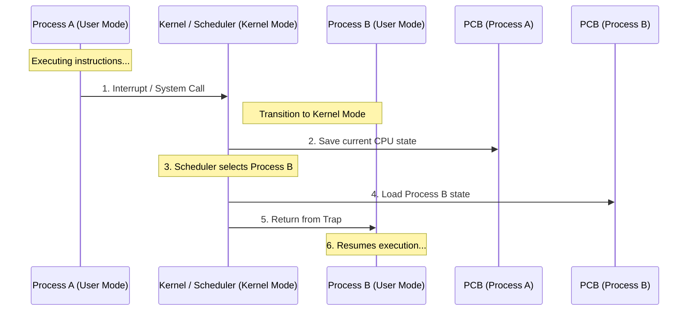

---
tags:
  - field/cs
  - subject/os
  - concept/context-switching
---

[[T.O.C (Operating Systems Notes).md|Up to Operating Systems Notes]]

# Context Switching
## Introduction
> **Seed:** "Write an introduction as it is written in books about context switching in process scheduling that introduces this concept in the form of story. No techincals"

## The Workshop of the Master Craftsman

Imagine a workshop inhabited by a single, exceptionally fast Master Craftsman. This craftsman is capable of building anything—from intricate clocks to massive wooden frames—but he has a physical limitation: he has only one workbench and can only hold one set of tools at a time.

The town, however, is demanding. Five different citizens have brought five different projects to his door. One needs a chair repaired, another needs a jewelry box lined with velvet, and a third needs a complex gear mechanism calibrated. They all want their items today. 

If the craftsman finished the chair completely before starting the jewelry box, the jeweler would wait hours in the cold. To keep everyone satisfied, the craftsman decides to work in short, intense bursts. He will give each project exactly ten minutes of his focus.

## The Protocol of the Ledger

The challenge is not the work itself, but the transition. When the ten-minute timer dings while he is halfway through carving a chair leg, he cannot simply drop his chisel and grab the velvet for the jewelry box. If he did, he would return to the chair later and forget exactly how deep he intended to carve or which specific grain he was following.

Instead, he performs a precise ritual. He stops his hand. He takes a ledger dedicated to the "Chair Project." In it, he records the exact position of his chisel, the angle of the wood on the bench, and the measurement he just took. He brushes the sawdust into a specific bin and clears the table. 

Only when the table is bare does he open the "Jewelry Box Ledger." He reads where he left off, retrieves the specific small needle he was using, and places the velvet exactly where it was ten minutes ago. He has "switched his context." To the citizens watching through the window, it looks as though he is working on all projects simultaneously, as every project grows by a few inches every hour.

## The Invisible Tax

There is a catch to this wizardry. The craftsman realizes that every time the timer dings, he spends three minutes recording his progress in one ledger and setting up the next. This is time spent neither carving wood nor sewing velvet. 

If the timer dings every ten minutes, he spends nearly a third of his day just moving tools and writing in ledgers. If he makes the bursts longer—say, an hour—he spends less time with the ledgers, but the citizens at the back of the line grow angry as they wait longer for their turn. The master craftsman’s greatest struggle is not the complexity of the crafts, but managing the "overhead" of his own meticulous record-keeping. Over time, he becomes so fast at the ledger-work that the transition is almost invisible, yet it remains the most critical part of his day. Without the ledgers, the workshop would descend into a chaos of half-finished, ruined projects.
## Technicals
> **Seed:** "@expand Explain with technical details what is context switching in process scheduling. What is the purpose of it. Is there any overhead?"

Context switching is the low-level mechanism by which a CPU transitions execution from one process (or thread) to another by saving the current hardware state and restoring a previously saved state. It is the fundamental operation that enables preemptive multitasking, allowing a single physical processor core to appear as though it is executing multiple independent instruction streams simultaneously.

## The Mechanism: State Preservation and Restoration
At the hardware level, a process's "context" is defined by the contents of the CPU registers at a specific nanosecond. When the scheduler decides to switch from Process A to Process B, the kernel executes a sequence of operations typically written in assembly to ensure no data is lost:

1.  **Triggering:** An interrupt (e.g., timer interrupt for time-slicing or I/O completion) or a synchronous trap (system call) forces the CPU to switch from User Mode to Kernel Mode.
2.  **State Saving:** The kernel pushes the current values of the Program Counter (PC), Stack Pointer (SP), and General Purpose Registers onto the Process Control Block (PCB) of Process A. In modern architectures, this also includes extended state like Floating Point Unit (FPU) registers and SIMD (AVX/SSE) registers.
3.  **Scheduler Execution:** The OS scheduler runs its selection algorithm (e.g., Multilevel Feedback Queue) to determine which process in the "Ready" queue should run next.
4.  **State Loading:** The kernel locates the PCB of Process B. It populates the physical CPU registers with the values stored in Process B's PCB.
5.  **Return to User Space:** The kernel executes a "return from interrupt" instruction, which restores the PC and switches the processor back to User Mode, effectively "jumping" into the middle of Process B’s execution stream exactly where it last stopped.

### The PCB Swap Logic (Pseudocode)
```c
void context_switch(PCB *current, PCB *next) {
    save_registers(current->register_state);
    current->status = READY;
    
    save_stack_pointer(current->stack_ptr);
    save_program_counter(current->program_counter);

    load_stack_pointer(next->stack_ptr);
    load_program_counter(next->program_counter);
    load_registers(next->register_state);
    
    next->status = RUNNING;
}
```

## The Purpose: Time-Sharing and Asynchronicity
The primary purpose of context switching is to maximize CPU utilization and provide system responsiveness. Without it, a process performing a slow I/O operation (like reading from a disk) would stall the entire processor, leaving it idle while the hardware waits for data. 

-   **Multiprogramming:** Keeps the CPU busy by switching to a different task whenever the current one is blocked.
-   **Preemptive Scheduling:** Ensures fairness by preventing a single "greedy" process from monopolizing the CPU. The OS uses a hardware timer to force switches at regular intervals (quantum).
-   **Priority Management:** Allows high-priority tasks (like real-time audio processing) to interrupt lower-priority tasks (like a background file indexer).

## The Overhead: Direct and Indirect Costs
Context switching is never "free"; it is pure administrative overhead that performs no useful work for the user.

### 1. Direct Overhead (The Save/Load)
This is the time spent executing the OS code that moves bits from registers to memory and back. On modern processors, this involves hundreds of clock cycles per switch. If the context switch frequency is too high, the system enters a state of **Thrashing**, where the CPU spends more time switching between processes than actually executing them.

### 2. Indirect Overhead (The Cache Cold Start)
The most significant cost is the disruption of the memory hierarchy. 
-   **TLB Flush:** In many architectures, switching processes requires flushing the Translation Lookaside Buffer (TLB). This invalidates the hardware cache of virtual-to-physical memory mappings, forcing the CPU to perform expensive "page table walks" for the next few thousand instructions.
-   **L1/L2 Cache Pollution:** Process A’s data and instructions populated the fast L1 and L2 caches. When Process B starts, it will likely experience a cascade of cache misses because its required data is not yet in the cache. This "cache warming" period results in severely degraded performance immediately following the switch.

## Analogy: The Shift Change on a Precision Assembly Line
Imagine a single master technician (the CPU) working on a complex engine. 
-   **The Context:** The technician has specific wrenches in hand (Registers), a specific page of the manual open (Program Counter), and parts laid out in a specific order on the workbench (Cache).
-   **The Switch:** A bell rings (Interrupt). The technician must stop, write down the exact torque value they were applying (Saving State), put all their specialized tools into a locker (PCB), and clear the workbench. They then open a different locker, take out a different set of tools, and find the manual page for a different project (Loading State).
-   **The Overhead:** The time spent packing and unpacking is the direct overhead. The time spent searching for parts that used to be on the table but are now back in the warehouse is the cache-miss overhead.

> **Seed:** "@expand Construct a detailed mermaid diagram of an example of context switching in process scheduling in order to explain it."

## Technical Definition and State Preservation
Context switching is the computational procedure of storing the state of a CPU (the "context") for a currently executing process so that it can be suspended and then resumed later, allowing multiple processes to share a single CPU core. This state transition is managed by the kernel's scheduler and revolves around the **Process Control Block (PCB)**, a data structure containing the program counter, stack pointer, register values, and memory management information necessary for process restoration.

## The Switching Mechanism: Control Flow and Data Movement
When the scheduler decides to preempt Process A in favor of Process B, the system executes a mechanical sequence involving the following hardware-software handshakes:

1. **Trigger:** A hardware interrupt (e.g., timer interrupt for time-slicing) or a software trap (system call for I/O) transfers control from User Mode to Kernel Mode.
2. **State Save:** The CPU's current register set—including the Program Counter (PC), Instruction Register (IR), and Stack Pointer (SP)—is pushed onto the kernel stack and subsequently copied into the PCB of Process A.
3. **Scheduler Execution:** The kernel's scheduler algorithm (e.g., Completely Fair Scheduler) selects Process B from the Ready Queue based on priority or time-slice availability.
4. **State Restore:** The kernel retrieves the stored context from Process B's PCB and loads these values back into the physical CPU registers.
5. **Return from Trap:** The CPU switches back to User Mode. Because the PC was restored from Process B's context, the CPU naturally begins executing the exact instruction in Process B where it was previously suspended.

## Context Switch Sequence Diagram
The following diagram illustrates the transition of control and the interaction with the Process Control Blocks during a switch.



## Load-Bearing Analogy: The Single-Stovetop Kitchen
Imagine a chef (the CPU) working in a kitchen with only one burner. The chef is halfway through cooking a delicate Sauce (Process A) when a high-priority Steak (Process B) must be seared. To "context switch" without ruining the meal, the chef must:

1. **Record the State:** Note down the exact temperature, the reduction level, and the remaining cook time on a recipe card (PCB).
2. **Preserve the Environment:** Move the sauce pan off the burner.
3. **Restore the Target:** Place the steak pan on the burner and consult the previously written notes on how long the steak has already been searing.
4. **Execute:** Resume searing the steak.

The time spent writing notes and moving pans is **overhead**—time the burner is on and the chef is working, but no actual "cooking" (progress on the food) is occurring.

## Performance Bottlenecks and Failure Modes
Context switching is a purely administrative task; no "useful" user-level work is performed during the switch.

*   **Switching Overhead:** The latency involved in saving/restoring registers and updating internal kernel tables. In modern systems, this is microsecond-scale, but if the switching frequency is too high (due to tiny time-slices), the system enters **Thrashing**, where administrative overhead consumes more CPU cycles than process execution.
*   **Cache Pollution:** When Process B starts, the L1/L2 caches are filled with Process A's data. Process B will experience a surge of cache misses, forcing the CPU to wait for slower main memory until the cache is "warmed" with B's data.
*   **TLB Flush:** On many architectures, switching processes requires flushing the Translation Lookaside Buffer (TLB) to prevent Process B from accessing Process A's memory addresses. This significantly slows down memory translation immediately following a switch.