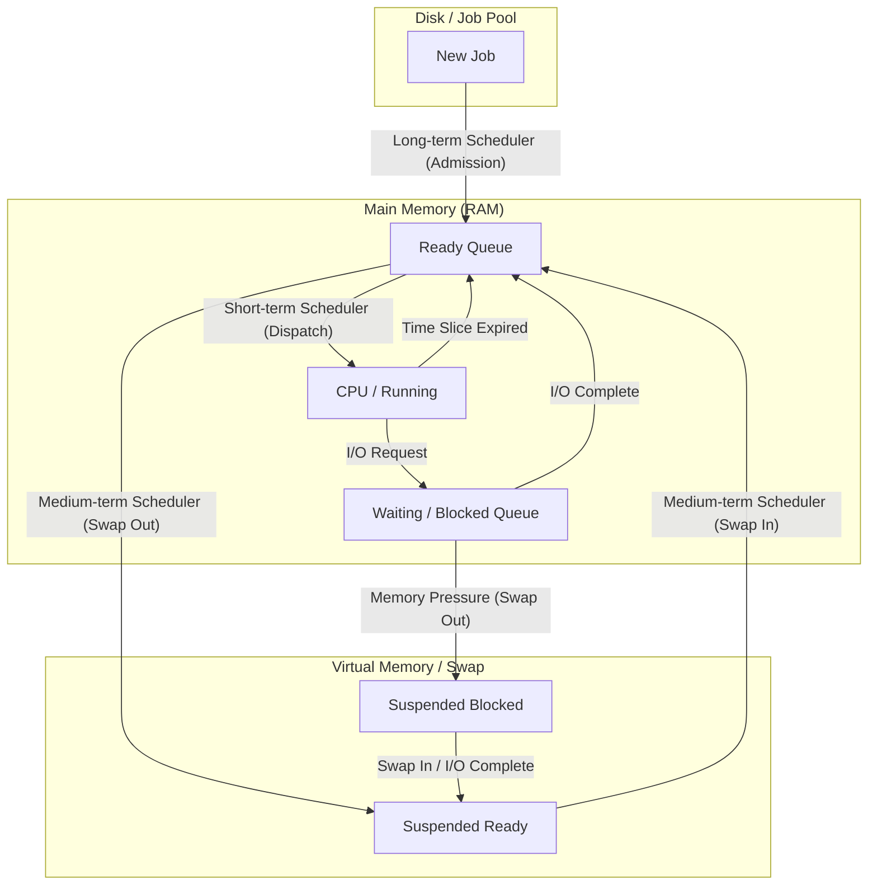

---
tags:
  - field/cs
  - subject/os
  - concept/scheduling-transitions
---

[[T.O.C (Operating Systems Notes).md|Up to Operating Systems Notes]]

# Scheduling and Process Transitions
## Introduction
> **Seed:** "@expand Write a non techincal story like introduction to scheduling and process transitions."

## The Single-Burner Kitchen: A Mechanical Analogy
CPU scheduling is the precise allocation of a processor’s execution cycles to competing threads of execution, managed by the kernel’s dispatcher to maintain the illusion of parallelism on finite hardware.

Imagine a world-class kitchen that, by some architectural fluke, possesses only one stove burner (the CPU). The Chef (the Operating System) must produce ten different five-course meals (Processes) simultaneously. Because the Chef cannot cook two things on the same burner at the same instant, the kitchen relies on a rigid system of transitions and "Recipe Cards" (Process Control Blocks) to ensure no dish is ruined and every customer is fed.

## The State Machine: The Lifecycle of a Dish
In this kitchen, every meal follows a strict mechanical flow through several defined zones. These zones represent the **Process States**.

1.  **The Order Window (NEW):** An order is clipped to the rail. It is not yet in the system, but the Chef knows it exists.
2.  **The Prep Table (READY):** The ingredients are chopped and ready. The meal is waiting for its turn on the burner. There is a line (The Ready Queue) of meals here.
3.  **The Burner (RUNNING):** The pan is on the heat. Only one meal can be here at a time. The Chef is actively working on it.
4.  **The Pantry (WAITING/BLOCKED):** The recipe requires an ingredient currently being delivered (e.g., waiting for a hard drive or user input). The pan is removed from the heat so another meal can use it. The meal stays here until the ingredient arrives.
5.  **The Service Window (TERMINATED):** The meal is complete. Its resources (pans, space on the prep table) are released back to the kitchen.

## The Mechanism: The Context Switch
The "magic" of scheduling happens during the **Context Switch**. When a meal's time on the burner is up (a "Time Slice"), the Chef cannot simply move to the next meal. If they did, they would forget where they left off. 

Instead, the Chef performs a mechanical save:
1.  **Stop:** Lift the pan.
2.  **Record:** Note exactly how much salt was added and the current temperature on the "Recipe Card" (the **PCB - Process Control Block**).
3.  **Store:** Move the pan back to the Prep Table.
4.  **Load:** Grab the next meal's Recipe Card and read its status.
5.  **Resume:** Place the new pan on the burner and continue exactly from the last recorded step.

### Pseudocode: The Scheduler's Loop
```python
while True:
    # 1. Selection (Scheduling Algorithm)
    next_process = ready_queue.pop_first() 
    
    # 2. Context Switch
    save_state(current_process)
    load_state(next_process)
    
    # 3. Execution
    run_for_timeslice(next_process)
    
    # 4. Re-queue
    if next_process.is_waiting_for_io():
        wait_queue.push(next_process)
    elif next_process.is_finished():
        terminate(next_process)
    else:
        ready_queue.push(next_process)
```

## Failure Modes and Bottlenecks
The system breaks under three specific conditions:

*   **Starvation:** If the Chef always picks "Fast Food" orders (Shortest Job First) to keep the line moving, a "Slow Roast" (a long, complex process) may sit on the Prep Table forever, never reaching the burner.
*   **Thrashing (Overhead):** If the Chef switches meals every 1 second, but it takes 0.5 seconds to record the state on the Recipe Card, the kitchen spends 50% of its time writing notes instead of cooking. This is the cost of context switching.
*   **Deadlock:** Two meals are on the Prep Table. Meal A needs the Blue Pan (held by Meal B) to continue, and Meal B needs the Red Whisk (held by Meal A). Neither can move to the burner; the kitchen grinds to a halt.
## Techinals
<!-- @blueprint:3 processed: Explain in detail the following concepts with examples and diagrams where needed for clarity of concept.
- Long-term Scheduling
- Medium Term Scheduling
- Short Term scheduling -->

## Long-Term Scheduling (Admission Control)
> **Seed:** "@expand Explain the mechanism of Long-Term Scheduling (Job Scheduler), focusing on its role in controlling the degree of multiprogramming. Detail the transition logic from the 'New' state to the 'Ready' state, explaining how the scheduler balances I/O-bound and CPU-bound processes to optimize system throughput. Include the criteria for job selection from the job pool on disk."

## The Gatekeeper: Job Pool to Main Memory

The Long-Term Scheduler (LTS), or Job Scheduler, serves as the primary regulator of system load by selecting processes from the **Job Pool**—a massive collection of programs residing on secondary storage (disk)—and loading them into the **Ready Queue** in main memory (RAM). This transition represents the shift from the **New** state to the **Ready** state.

Unlike the Short-Term Scheduler, which operates in milliseconds to swap processes on the CPU, the LTS operates on a much slower timescale (seconds or minutes). Its core function is not immediate execution, but resource allocation. When a process is in the 'New' state, it exists only as an executable file and a set of requested parameters. The LTS "admits" the process by:
1. Validating resource requirements (memory, I/O devices).
2. Creating a Process Control Block (PCB) in memory.
3. Allocating the initial memory footprint.
4. Moving the process ID into the Ready Queue for the Short-Term Scheduler to handle.

## Controlling the Degree of Multiprogramming

The "Degree of Multiprogramming" refers to the total number of processes residing in main memory at any given time. The LTS is the sole throttle for this metric. 

If the degree of multiprogramming is too low, the CPU and I/O devices remain underutilized, leading to wasted hardware cycles. If it is too high, the system enters a state of **thrashing**, where the overhead of managing memory and context switching outweighs the actual computation performed. 

The LTS maintains an equilibrium state where:
$$Rate_{Arrival} \approx Rate_{Departure}$$
By controlling the entry of "New" processes, the LTS ensures that the number of processes in memory remains stable, preventing the Ready Queue from growing so large that it exhausts the system's virtual memory management capabilities.

## Process Mix: I/O-Bound vs. CPU-Bound Optimization

A critical responsibility of the LTS is maintaining a balanced **Process Mix**. Processes generally fall into two categories:
- **I/O-bound processes:** Spend most of their time performing I/O operations; they have very short CPU bursts.
- **CPU-bound processes:** Spend most of their time performing computations; they have very long CPU bursts.

The LTS acts like a factory foreman managing a machine shop. If the foreman admits only workers who need the heavy drill (CPU-bound), a line forms at the drill while the conveyor belts (I/O) sit idle. Conversely, if only workers who need the conveyor belts are admitted, the drill sits idle.

To optimize **system throughput** (the number of processes completed per unit of time), the LTS selects a balanced ratio:
- It admits enough I/O-bound processes to keep the I/O controllers busy.
- It admits enough CPU-bound processes to ensure the CPU is utilized whenever the I/O-bound processes are waiting for data transfers.

If the LTS fails to maintain this balance, the Short-Term Scheduler will have a Ready Queue filled with processes that all want the same resource, leading to a bottleneck and a drop in overall system efficiency.

## Selection Logic and Criteria

The criteria for selecting a job from the disk pool are dictated by the system’s scheduling policy, which typically follows a multi-factor weighting system:

1. **Resource Requirements:** Does the process require more RAM than is currently available in the free memory pool?
2. **Process Priority:** High-priority batch jobs may be admitted ahead of older, lower-priority jobs.
3. **Process Mix Ratios:** As discussed, the scheduler checks the current memory profile. If the system is currently "CPU-heavy," the LTS will bypass pending CPU-bound jobs to find an I/O-bound job in the pool.
4. **Estimated Execution Time:** Some systems prefer shorter jobs to improve average turnaround time (SJF at the job level).

### Logic Flow (Pseudocode):
```python
def long_term_scheduler(job_pool, ready_queue, memory_available):
    while True:
        # Check if we should increase degree of multiprogramming
        if current_system_load() < LOAD_THRESHOLD:
            candidate_job = select_job_from_disk(job_pool)
            
            if candidate_job.memory_required <= memory_available:
                # Transition: New -> Ready
                pcb = create_pcb(candidate_job)
                allocate_memory(candidate_job)
                ready_queue.append(pcb)
                update_load_metrics(candidate_job.type) # I/O or CPU bound
            else:
                wait_for_memory()
        
        sleep(SCHEDULING_INTERVAL)
```

## Failure Modes: Starvation and Over-Saturation

Two primary failures occur when the LTS logic is flawed:
- **Job Starvation:** If the selection criteria heavily favor small, I/O-bound processes, a massive, CPU-intensive batch job might remain in the 'New' state indefinitely. This is mitigated by "aging," where a job's priority increases the longer it sits in the pool.
- **Admission Congestion:** In modern interactive systems (like Windows or Linux), the Long-Term Scheduler is often absent or vestigial, admitting every process immediately. This shifts the burden to the **Medium-Term Scheduler**, which must then "swap out" processes to disk when memory is over-saturated, turning a selection problem into a memory management problem.


## Medium-Term Scheduling (Process Swapping)
> **Seed:** "@expand Explain the internal mechanics of Medium-Term Scheduling, specifically focusing on the swapping mechanism. Detail how the scheduler manages memory pressure by moving processes between main memory and the backing store (Suspended-Ready and Suspended-Blocked states). Describe the triggers for swapping out a process and the logic for swapping it back in when resources become available."

## The Swapping Mechanism: Architectural Regulation
The Medium-Term Scheduler (MTS) functions as a strategic regulator of the degree of multiprogramming. Unlike the Short-Term Scheduler (Dispatcher), which operates in milliseconds to pick the next CPU task, the MTS operates on a longer time scale to mitigate memory overcommitment. Its primary mechanism is **Swapping**: the physical evacuation of a process's entire address space (or its active resident set) from Physical RAM to a dedicated "Backing Store" (typically a swap partition or swap file on disk).

By removing a process from the contention for physical memory, the MTS reduces "thrashing"—a state where the system spends more time handling page faults than executing instructions—and ensures that the remaining resident processes have sufficient frames to progress.

## Extended State Transitions: The 7-State Model
To manage swapped processes, the standard 5-state process model (New, Ready, Running, Blocked, Exit) is expanded to include two "Suspended" states. The MTS manages the transitions between these states:

1.  **Blocked → Suspended-Blocked:** When memory is scarce and a process is waiting for an I/O event that hasn't occurred, the MTS swaps the process image to disk. The Process Control Block (PCB) remains in memory (or is partially swapped) to track the event, but the heavy memory footprint is vacated.
2.  **Ready → Suspended-Ready:** If memory pressure remains critical even after swapping blocked processes, the MTS may swap out "Ready" processes. These are processes capable of running but denied memory residency.
3.  **Suspended-Blocked → Suspended-Ready:** If the I/O event a suspended process was waiting for completes, it moves to the Suspended-Ready state on disk, awaiting a "Swap-In."

### The Swapping Analogy: The Overflow Parking Lot
Think of a high-end restaurant (CPU/RAM).
- **The Dining Room (RAM)** has limited tables (Frames).
- **The Short-Term Scheduler** is the waiter moving between active diners.
- **The Medium-Term Scheduler** is the Valet/Manager.
- When the dining room is full and people are waiting at the bar (Ready) or in the restroom (Blocked), the Manager identifies guests who haven't ordered yet or are waiting for a very long phone call. He moves them to an **Overflow Lounge (Backing Store)** across the street. This frees up tables for people ready to eat *now*. They are still "customers" (Processes), but they aren't taking up physical table space until a seat opens up and the Manager calls them back.

## Swapping Logic and Triggers
The MTS does not swap randomly; it follows specific pressure-based heuristics.

### 1. Swapping Out (Eviction) Triggers
- **Memory Pressure/Thresholds:** Triggered when the free frame list falls below a "Low Water Mark" (e.g., `min_free_kbytes` in Linux).
- **Thrashing Detection:** If the Page Fault Rate exceeds a predefined ceiling, the MTS concludes the system is overcommitted and selects a victim to swap out.
- **Priority/Size Heuristics:** The scheduler often targets:
    - Large processes (maximum memory gain).
    - Low-priority processes.
    - Processes that have been in the "Blocked" state for the longest duration.

### 2. Swapping In (Re-entry) Logic
The MTS monitors the system to bring processes back when the "High Water Mark" of free memory is reached. The logic involves:
- **Priority:** Higher priority suspended processes are brought back first.
- **Wait Time:** To prevent starvation, processes that have been suspended for a long duration receive a residency boost.
- **Event Completion:** Processes in Suspended-Ready are prioritized over Suspended-Blocked.

## Mathematical Representation: The Cost of Swapping
The major bottleneck of the MTS is Disk I/O. The time required for swapping is directly proportional to the size of the process image.

$$T_{transfer} = \frac{Size_{process}}{TransferRate_{disk}}$$

If a process is 100MB and the disk transfer rate is 50MB/s, the swap-out takes 2 seconds. This massive latency is why modern OSs (like Linux and Windows) prefer **Paging** (moving small fixed-size chunks) over traditional **Swapping** (moving the whole process), though the term "swapping" is still used colloquially to describe moving pages to the swap file under heavy pressure.

## Implementation Details: The Backing Store
The Backing Store must be a fast, high-capacity disk. In implementation:
- **Swap Space:** A raw partition is preferred over a file system to avoid the overhead of directory structures and metadata updates. 
- **The Transfer:** The OS performs a DMA (Direct Memory Access) transfer to move the process image. Once the transfer is complete, the frames are marked as "Free" in the Frame Table, and the process’s PCB is updated to reflect its new state (`SUSPENDED`).

### Failure Modes: Swap Thrashing
A critical failure occurs when the MTS swaps out a process, only for the Short-Term Scheduler to immediately require it (or vice versa). If the "Swap-In" and "Swap-Out" frequency is too high, the disk bandwidth becomes the system bottleneck, effectively halting all useful computation. This is mitigated by "hysteresis"—ensuring that once a process is swapped out, it stays out for a minimum duration or until memory pressure significantly eases.

## Short-Term Scheduling (CPU Dispatching)
> **Seed:** "Explain the architecture of Short-Term Scheduling (CPU Scheduler) and the Dispatcher. Detail the high-frequency decision-making process that selects a process from the Ready queue for execution. Explain the timing constraints, the role of context switching, and how the scheduler handles process state transitions from 'Ready' to 'Running' and back to 'Ready' or 'Waiting'."

## The CPU Scheduling Pipeline: Selection and Handover
Short-term scheduling is the high-frequency kernel function that selects a process from the **Ready Queue** to occupy the CPU's execution core. While the **Short-Term Scheduler (STS)** makes the policy-level decision of *who* goes next, the **Dispatcher** is the low-level mechanism that performs the *how*—executing the physical context switch and jumping to the correct location in the user program.

### The Decision Logic (STS)
The STS operates on a millisecond timescale, typically triggered by specific kernel events:
1.  **Switching from Running to Waiting:** Process issues an I/O request or `wait()`.
2.  **Switching from Running to Ready:** An interrupt occurs (e.g., timer interrupt in preemptive systems).
3.  **Switching from Waiting to Ready:** Completion of I/O or reception of a signal.
4.  **Terminating:** Process exits.

In a non-preemptive environment, scheduling occurs only under conditions 1 and 4. In preemptive systems, the STS must evaluate the queue constantly, often triggered by a hardware clock tick that decrements the process's time slice.

### The Mechanism of the Dispatcher
If the Scheduler is the Air Traffic Controller deciding which plane lands, the Dispatcher is the Ground Crew physically moving the stairs and opening the doors. Its latency—**Dispatch Latency**—is pure overhead; the CPU is not doing useful work during this phase.

The Dispatcher's routine involves three critical steps:
1.  **Context Switching:** Saving the state of the current process and loading the state of the new one.
2.  **Switching to User Mode:** Flipping the CPU mode bit from kernel (0) to user (1).
3.  **Jumping to Location:** Loading the Program Counter (PC) with the address where the process last stopped.

## The Context Switch: Anatomy of the Handover
A context switch is the state-saving/loading operation performed on the **Process Control Block (PCB)**. 

### The Register Swap
When the scheduler selects Process B to replace Process A:
1.  **Save State A:** The current CPU register values (Accumulator, Index registers, Stack Pointer, PC) are flushed into Process A's PCB in kernel memory.
2.  **Update PCB Status:** Process A is moved from 'Running' to 'Ready' (if preempted) or 'Waiting' (if I/O).
3.  **Load State B:** The values from Process B’s PCB are loaded into the physical CPU registers.
4.  **Update PCB Status:** Process B is marked as 'Running'.

```asm
; Conceptual Assembly for Context Switch (Dispatcher Logic)
SAVE_CONTEXT:
    PUSH ALL_REGS      ; Push current registers to Kernel Stack
    MOV [PCB_A_SP], SP ; Save Stack Pointer to PCB of Process A
    MOV [PCB_A_PC], PC ; Save Program Counter

LOAD_CONTEXT:
    MOV SP, [PCB_B_SP] ; Load Stack Pointer from PCB of Process B
    POP ALL_REGS       ; Restore registers from Process B's stack
    IRET               ; Interrupt Return: jumps to PC and sets user mode
```

## Timing Constraints and System Overhead
The efficiency of the Short-term Scheduler is defined by the ratio of **Time Quantum ($q$)** to **Context Switch Time ($s$)**.

If $s$ is large relative to $q$, the system spends more time managing processes than executing them (Thrashing). Ideally, $s$ should be less than 1% of $q$.
- **Hard Timing:** In Real-Time Operating Systems (RTOS), the dispatcher must have a deterministic latency. Any variability (jitter) in how long the dispatcher takes to swap processes can cause a system failure in time-sensitive hardware.
- **Cache Locality:** A major hidden cost of the scheduler is "Cache Pollution." When the dispatcher switches to a new process, the L1/L2 caches are filled with data from the old process. The new process will initially experience a high miss rate until it warms the cache.

## Handling State Transitions
The Scheduler acts as the state machine's engine, moving PCBs between queues based on hardware and software interrupts.

| Transition | Trigger | Scheduler Action |
| :--- | :--- | :--- |
| **Ready $\rightarrow$ Running** | Dispatcher | The "Dispatch" event. Process takes the CPU. |
| **Running $\rightarrow$ Ready** | Timer Interrupt | Process used its time slice. STS moves it to the tail of the Ready Queue. |
| **Running $\rightarrow$ Waiting** | I/O / Event | Process requests data from disk or waits for a mutex. STS moves it to a Device Queue. |
| **Waiting $\rightarrow$ Ready** | I/O Completion | The device controller sends an interrupt. The kernel moves the PCB back to the Ready Queue for the STS to consider. |

### Failure Mode: Priority Inversion
A critical failure occurs when the STS selects a medium-priority process, while a high-priority process is stuck 'Waiting' for a resource held by a low-priority process. Without **Priority Inheritance** (where the low-priority process "borrows" the high priority to finish its task), the high-priority process is effectively blocked indefinitely, breaking the scheduling logic.

> **Seed:** "Compare and analyze long vs medium vs short term scheduling in every possible aspect. Construct a mermaid diagram to show these differences"

## The Optimizationist's Verdict
In modern, memory-rich interactive operating systems (Windows, Linux, macOS), the **Short-term Scheduler** is the only one in constant, high-frequency execution. The **Long-term Scheduler** is effectively deprecated in these environments—replaced by the user's manual "double-click"—while the **Medium-term Scheduler** exists as a safety valve (the Swapper) that only triggers during memory contention. In high-throughput Batch systems, however, the Long-term Scheduler remains the critical gatekeeper of the "Degree of Multiprogramming."

## Architectural Comparison Table

| Dimension | Long-term (Job) Scheduler | Medium-term (Swapper) | Short-term (CPU) Scheduler |
| :--- | :--- | :--- | :--- |
| **Invocation Frequency** | Very Low (Seconds to Minutes) | Medium (Triggered by memory pressure) | Very High (Milliseconds/Quantum) |
| **Primary Goal** | Control Multiprogramming Degree | Manage Memory/Reduce Contention | Maximize CPU Utilization/Responsiveness |
| **Speed** | Slowest | Medium | Fastest |
| **Storage Context** | Disk (Job Pool) $\rightarrow$ RAM | RAM $\leftrightarrow$ Disk (Swap Space) | RAM (Ready Queue) $\rightarrow$ CPU |
| **Process State Alteration** | New $\rightarrow$ Ready | Ready/Blocked $\leftrightarrow$ Suspended | Ready $\rightarrow$ Running |
| **Impact on System** | Balance of I/O vs CPU bound jobs | Memory availability & Paging rates | System throughput & Latency |

## Why the Divergence Exists: Design Lineage
The three-tier scheduling architecture evolved to solve the "Thrashing" and "Starvation" problems of early computing.
1.  **Short-term** exists because the CPU is orders of magnitude faster than I/O; we must switch rapidly to hide latency.
2.  **Long-term** was born from the need to prevent the system from being overwhelmed. If 1,000 processes enter a system with only 1GB of RAM, the overhead of managing them would crash the kernel.
3.  **Medium-term** (The Swapper) was the architectural "middle ground" solution to Virtual Memory. It allows the OS to temporarily "overcommit" memory, parking idle processes on disk to give active ones the physical frames they need to make progress.

## Process Flow and Transitions
The following diagram illustrates how a process moves through these three scheduling layers:



## Logic Contrast: Selection Criteria
The internal logic for each scheduler focuses on different optimization metrics.

### Short-term (The Sprinter)
Focuses on the **Process Control Block (PCB)** currently in the Ready Queue.
```python