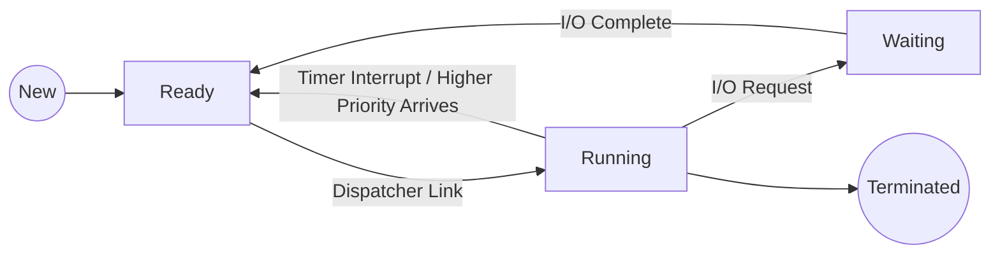

---
tags:
  - field/cs
  - subject/os
  - concept/decision-mode
---

[[T.O.C (Operating Systems Notes).md|Up to Operating Systems Notes]]

# Decision Mode
## Pre-emptive Scheduling
> **Seed:** "@expand Explain in detail the pre-emptive scheduling with examples and diagrams"

## Technical Architecture of Pre-emption
Pre-emptive scheduling is an execution management strategy where the operating system kernel forcibly suspends a currently running process to allocate the CPU to another process based on priority, time-slice expiration, or external events. Unlike cooperative (non-preemptive) scheduling, where a process must explicitly yield control or block on I/O, pre-emptive scheduling relies on hardware-level interrupts to regain control of the processor.

The core mechanism is the **Timer Interrupt**. At regular intervals (clock ticks), the hardware sends an interrupt signal to the CPU. This triggers a transition from User Mode to Kernel Mode, allowing the Scheduler to evaluate whether the current process should continue or be swapped out.

### The Context Switch Mechanism
When a pre-emption occurs, the kernel executes a context switch, which involves:
1.  **State Preservation**: Saving the CPU's current state (Program Counter, general-purpose registers, and stack pointer) into the process's **Process Control Block (PCB)**.
2.  **Scheduler Execution**: Determining the next process to run from the Ready Queue using a specific algorithm (e.g., Round Robin, SRTF).
3.  **State Restoration**: Loading the state of the new process from its PCB into the CPU registers.
4.  **Mode Transition**: Returning to User Mode to execute the new process.

## Logical Flow and State Transitions
In a pre-emptive environment, a process can be moved from the **Running** state to the **Ready** state even if it has not finished its work or requested I/O.



### Pre-emptive Algorithms
1.  **Round Robin (RR)**: Each process is assigned a fixed time unit called a *quantum*. If the process is still running when the quantum expires, the timer interrupt triggers a pre-emption.
2.  **Shortest Remaining Time First (SRTF)**: A pre-emptive version of SJF. If a new process arrives with a remaining burst time shorter than the current process's remaining time, the current process is pre-empted.
3.  **Priority Scheduling (Pre-emptive)**: If a process arrives in the Ready Queue with a priority higher than the currently running process, the kernel immediately performs a context switch.

## Mechanical Analogy: The Emergency Room Triage
Consider an Emergency Room (the CPU) with one Doctor (the Core). 
*   **Non-Preemptive**: Once the Doctor starts treating a patient with a broken finger, they cannot stop until that patient is fully bandaged, even if a heart-attack victim (high-priority process) arrives.
*   **Pre-emptive**: The Doctor treats the broken finger, but a Nurse (the Hardware Timer/Interrupt) constantly monitors the waiting room. As soon as the heart-attack victim arrives, the Nurse interrupts the Doctor. The Doctor notes exactly where they left off with the finger (Context Save), moves the patient to the hallway (Ready Queue), and begins the life-saving surgery (Context Load).

## Implementation Example: Round Robin Pseudocode
The following logic represents the kernel's clock interrupt handler for pre-emptive Round Robin:

```c
// Executed on every clock tick
void timer_interrupt_handler() {
    current_process->time_slice_remaining--;

    if (current_process->time_slice_remaining <= 0) {
        // Trigger Pre-emption
        current_process->state = STATE_READY;
        enqueue(ready_queue, current_process);
        
        // Call the scheduler to pick the next task
        schedule(); 
    }
}

void schedule() {
    struct PCB *next_proc = dequeue(ready_queue);
    next_proc->state = STATE_RUNNING;
    next_proc->time_slice_remaining = DEFAULT_QUANTUM;
    
    context_switch(current_process, next_proc);
}
```

## Failure Modes and Edge Cases

### 1. Priority Inversion
A critical failure occurs when a high-priority process (H) is waiting for a resource held by a low-priority process (L). If a medium-priority process (M) arrives, it pre-empts L (because M > L). Because L is pre-empted, it cannot finish its work and release the resource for H. Consequently, the medium-priority process effectively blocks the high-priority process indefinitely. This is solved via **Priority Inheritance Protocols**.

### 2. Context Switch Thrashing
If the time quantum is set too small (e.g., 1ms) and the context switch overhead is significant (e.g., 0.5ms), the CPU spends 33% of its time just swapping processes rather than doing useful work. This leads to high latency and system sluggishness.

### 3. Starvation
In strictly priority-based pre-emption, low-priority processes may never execute if there is a constant stream of high-priority arrivals. This is typically mitigated by **Aging**, where the priority of a process increases the longer it sits in the Ready Queue.
## Non Pre-emptive scheduling
> **Seed:** "@expand Explain in detail the non pre-emptive scheduling with examples and diagrams"

Non-preemptive scheduling is a CPU management discipline where the operating system kernel cedes control of the processor to a process and cannot forcibly reclaim it until that process either terminates or transitions to a waiting state (e.g., requesting I/O). In this model, the scheduler is reactive rather than proactive; context switches occur only at the explicit invitation of the running process via system calls or exit signals.

## The Mechanism: Control Flow and State Transitions

In a non-preemptive environment, the state transition diagram is simplified. A process in the **Running** state can only move to:
1.  **Terminated:** The process completes its execution.
2.  **Waiting:** The process requests a resource or waits for an event (e.g., disk I/O, semaphore).

Crucially, the transition from **Running** to **Ready**—the hallmark of preemptive systems—is absent. This means the hardware timer interrupt (the "heartbeat" of modern OSs) does not trigger a scheduler re-evaluation of the running task. The CPU remains "locked" to the current execution thread until the program counter hits an `EXIT` instruction or a blocking `SYSCALL`.

### Load-Bearing Analogy: The Single-Window Post Office
Think of a post office with a single service window and a strict "Finish what you started" rule. A customer (Process) approaches the window. Even if a VIP customer (High-priority Process) enters the building with an urgent package, the clerk (CPU) cannot stop serving the current customer. The clerk must wait until the current customer either finishes their transaction or realizes they forgot their ID and steps aside (I/O block). If the current customer decides to count 10,000 pennies at the window, the entire line remains frozen.

## Primary Algorithms and Execution Flow

### 1. First-Come, First-Served (FCFS)
The simplest implementation of non-preemptive scheduling. Processes are managed in a FIFO queue.

**Example Scenario:**
*   P1: Burst Time (BT) = 24ms
*   P2: BT = 3ms
*   P3: BT = 3ms
*   Arrival order: P1, P2, P3 at time 0.

**Gantt Chart:**
```text
[      P1 (24ms)      ][ P2 (3ms) ][ P3 (3ms) ]
0                     24          27          30
```
*   **Waiting Time:** P1=0, P2=24, P3=27. **Average:** 17ms.

### 2. Non-Preemptive Shortest Job First (SJF)
The scheduler selects the process with the smallest CPU burst from the Ready queue when the current process finishes.

**Example Scenario:**
*   P1 (Arrival: 0, BT: 7)
*   P2 (Arrival: 2, BT: 4)
*   P3 (Arrival: 4, BT: 1)
*   P4 (Arrival: 5, BT: 4)

**Gantt Chart:**
```text
[    P1 (7)    ][ P3 (1) ][    P2 (4)    ][    P4 (4)    ]
0              7         8               12              16
```
*Logic:* At t=0, only P1 is available. It runs to completion (t=7). By t=7, P2, P3, and P4 have all arrived. The scheduler compares their bursts (4, 1, 4) and picks P3 (the shortest).

## System-Level Advantages and Trade-offs

### Advantages
*   **Low Overhead:** No timer interrupts or frequent context switching logic is required. The kernel does not need to save and restore registers constantly.
*   **Deterministic Critical Sections:** Since a process cannot be interrupted, race conditions on shared data are significantly reduced in uniprocessor systems, as the process effectively holds a global lock during its execution.
*   **Simplicity:** Easier to implement in embedded systems or real-time kernels where task durations are known and fixed.

### The "Convoy Effect" (Failure Mode)
The most significant weakness of non-preemptive scheduling (specifically FCFS) is the **Convoy Effect**. If a CPU-bound process with a massive burst time enters the CPU, all subsequent I/O-bound processes (which need very little CPU time but frequent I/O) are trapped in the Ready queue. This leads to poor resource utilization: the CPU is busy, but the I/O devices sit idle because the processes that would use them are blocked behind the "heavy" process.

### Starvation and Infinite Loops
In Non-Preemptive SJF or Priority scheduling, a continuous stream of short or high-priority jobs can cause a long/low-priority job to wait indefinitely (**Starvation**). Furthermore, if a process enters an infinite loop, the entire system hangs (on a single-core machine) because the kernel never regains control to terminate the offending process. Recovery usually requires a hardware-level reset.