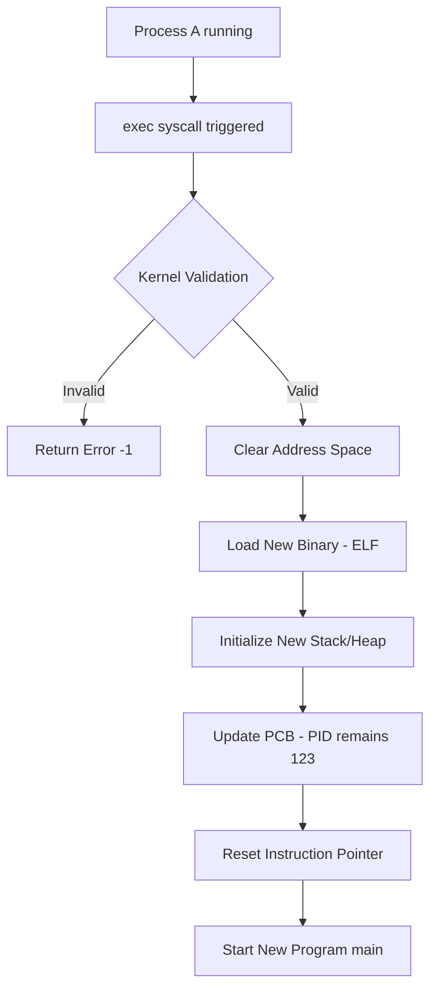
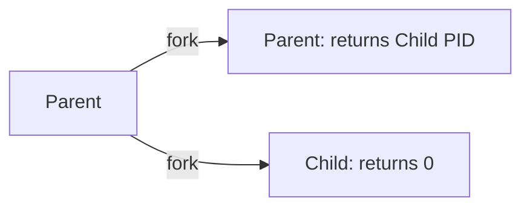

[[T.O.C (Operating Systems Notes)|Up to Operating Systems Notes]]

# Operating System (Semester 4)
## `exec()` System call

> [!INFO] **Prompt:** "Explain to me in detail what an exec() sys call does. Use code examples and also walk me through the example step by step what exactly happens in code and then what happens in the CPU/memory."
> **Lens Applied:** The Chief Engineer / First Principles

# Deep Dive: The `exec()` System Call

## 1. Ontological Definition
The `exec()` family of functions (e.g., `execl`, `execv`, `execve`) replaces the current process image with a new process image. Unlike `fork()`, which creates a new process, `exec()` transforms the *existing* process into a different one. The Process ID (PID) remains the same, but the code, data, heap, and stack are entirely overwritten.

## 2. The Internal Mechanics (Under the Hood)
When `exec()` is called, the OS Kernel performs a "Surgical Replacement" of the process's address space.

### Control Flow & State Changes:
1.  **Validation:** The kernel checks if the specified file exists and if the process has execute permissions.
2.  **Memory Unmapping:** The current Virtual Memory (VM) mappings (text, data, bss) are discarded.
3.  **Loading:** The kernel reads the ELF (Executable and Linkable Format) header of the new binary to determine the entry point and segment sizes.
4.  **Mapping:** New text and data segments are mapped into the process's address space. A new stack and heap are initialized.
5.  **PCB Update:** The Process Control Block (PCB) is updated. Most attributes (PID, Parent PID, File Descriptors unless `FD_CLOEXEC` is set) are preserved.
6.  **Entry Point:** The CPU's Instruction Pointer (IP) is reset to the entry point of the new program.

### CPU/Memory Trace (Pseudo-code logic):
```c
// Process A (PID 123)
IP -> 0x400500 (Old code)
Stack -> [Old Local Vars]

// execve("/bin/ls") called
kernel_execve() {
   unmap(0x400000, current_size); // Clear old image
   load_elf("/bin/ls");           // Load new binary
   reset_stack();                 // Clear old stack
   regs->rip = elf_entry_point;   // Point CPU to new 'main'
}
```

## 3. Systems Context & C++ Anchor
In C++, `exec` is a wrapper around the `execve` system call (`unistd.h`). It is the mechanism by which shells execute commands. After a `fork()`, the child typically calls `exec` to begin a new task.

## 4. Edge Cases & Constraints
*   **Success is Terminal:** On success, `exec()` never returns. Any code following a successful `exec()` call is unreachable.
*   **Error Return:** It only returns `-1` if the replacement fails (e.g., file not found).
*   **FD Leakage:** Open file descriptors remain open in the new image unless explicitly closed or marked as close-on-exec.

---

> [!INFO] **Prompt:** "Using a mermaid diagram explain to me the whole flow of an exec() sys call"
> **Lens Applied:** The Architect



---

> [!INFO] **Prompt:** "What happens to the code after an exec() call. Explain to me what happens to it right until it gets voided/lost."
> **Lens Applied:** The Chief Engineer / First Principles

# Technical breakdown: The "Voiding" of the Old Image

## 1. Surgical Definition (Internals)
When `exec()` is invoked, the current process's memory map is subjected to a "Destructive Replacement." The OS kernel marks the pages previously occupied by the process as available or reassigns them.

## 2. The Laboratory (Proof of Concept)
```c
#include <unistd.h>
#include <stdio.h>

int main() {
    printf("This will be printed.
");
    execlp("ls", "ls", NULL);
    printf("This will NEVER be printed.
"); // Lost in the void
    return 0;
}
```

## 3. Memory & System Context
*   **Text Segment:** The physical memory pages containing the old machine code are unmapped. If no other process is using this code (not shared), the pages are returned to the free list.
*   **Stack/Heap:** These are completely wiped. Any dynamically allocated memory in the old program is lost (the kernel cleans up the old heap).
*   **The "Point of No Return":** Once the kernel begins loading the new ELF segments into memory, the old state is irrecoverable. The execution context is "lost" because the CPU's register state (including the return address on the stack) has been overwritten.

---

## Example

> [!INFO] **Prompt:** "Create an example for exec() call with fork(), perror(), wait(), execlp(), wait(). Explain to me in detail the flow and dry run of the program"
> **Lens Applied:** The Chief Engineer / The Constructivist

# Technical breakdown: Process Orchestration (Fork-Exec-Wait)

## 1. The Laboratory (Proof of Concept)
```c
#include <iostream>
#include <unistd.h>
#include <sys/wait.h>
#include <stdio.h>

int main() {
    pid_t pid = fork();

    if (pid < 0) {
        perror("fork failed");
        return 1;
    } else if (pid == 0) {
        // Child Process
        std::cout << "[Child] Replacing image with 'ls'..." << std::endl;
        if (execlp("ls", "ls", "-l", NULL) == -1) {
            perror("exec failed");
            exit(1);
        }
    } else {
        // Parent Process
        std::cout << "[Parent] Waiting for child " << pid << "..." << std::endl;
        int status;
        wait(&status);
        std::cout << "[Parent] Child finished execution." << std::endl;
    }
    return 0;
}
```

## 2. Flow and Dry Run Analysis

### Step 1: `fork()`
*   **State:** Parent (P) calls `fork()`.
*   **Backend:** Kernel creates a clone of P (Process C). C gets its own address space (COW) and a new PID.
*   **Return:** P receives C's PID. C receives `0`.

### Step 2: Branching
*   **Parent:** Enters the `else` block. Calls `wait()`. This puts P in a "Sleep" state, waiting for a `SIGCHLD` signal.
*   **Child:** Enters the `pid == 0` block. Calls `execlp()`.

### Step 3: `execlp()` (The Transformation)
*   **Child:** The `ls` binary is searched in `PATH`.
*   **Backend:** C's address space is overwritten by `ls`. The code following `execlp` is destroyed.
*   **Execution:** C is now effectively running `ls -l`.

### Step 4: `wait()` and Completion
*   **Child (ls):** Finishes listing files and calls `exit()`.
*   **Backend:** Kernel sends `SIGCHLD` to P.
*   **Parent:** Wakes up from `wait()`. The `status` variable is populated. Parent finishes its final `cout` and exits.

---

> [!INFO] **Prompt:** "Create detailed explanations of these sys calls in details with examples and what happens after each is called at the backend: fork(), perror(), wait(), execlp(), exec(). Make sure you use mermaid diagrams where you can use them to explain concepts"
> **Lens Applied:** The Chief Engineer / First Principles

# OS System Calls: Deep Dive

## 1. `fork()`
*   **What happens:** Creates a child process by duplicating the calling process.
*   **Backend:** Kernel allocates a new Task Structure (PCB). It uses **Copy-on-Write (COW)** to avoid copying physical memory pages until one process modifies them.
*   **After Call:** Two identical processes exist, diverging only by the return value of `fork()`.



## 2. `exec()` / `execlp()`
*   **What happens:** Replaces the current process image with a new one.
*   **Backend:** Address space is wiped and remapped to the new binary. IP is reset.
*   **After Call:** The original program is gone. Only the new program runs.

## 3. `wait()`
*   **What happens:** Suspends execution of the calling process until one of its children terminates.
*   **Backend:** Parent is moved to the "Waiting/Blocked" queue. When a child exits, the kernel moves the parent back to the "Ready" queue.
*   **After Call:** Parent reaps the exit status of the child, preventing "Zombie" processes.

## 4. `perror()`
*   **What happens:** Prints a descriptive error message to `stderr` based on the current value of `errno`.
*   **Backend:** Looks up the error code in the system error table (`sys_errlist`).
*   **After Call:** The user sees a human-readable explanation (e.g., "Permission denied").
