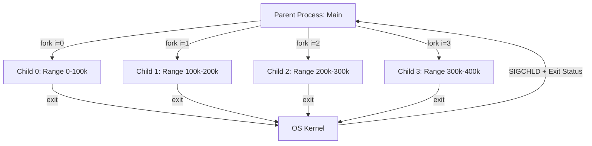

# OS Parallelism Case Study

[[T.O.C (Operating Systems Notes)|Up to Operating Systems Notes]]

#concept #os #parallelism #c-programming

## 1. Parallel Prime Calculator

> **Prompt:** "I am going to write a parallel prime calculator program below. What you'll have to do is go through the whole program and explain to me what's happening and when does each child get created. Draw the tree diagram of parent child using mermaid and prove to me that this is true parallel processing..."
> **Lens Applied:** The Optimizationist / The Chief Engineer

### 1. Code Logic Walkthrough
The program implements **Data Parallelism** (SIMD-style logic using processes).

1.  **Setup:** `numOfChildren = 4`, `rangeSize = 100000`.
2.  **The Loop (`for(int i = 0; i < 4; i++)`):**
    *   **Iteration 0:** Parent calls `fork()`. Child 0 created.
        *   **Child 0 Logic:** Calculates primes for range `0` to `100,000`. Prints count. Exits.
        *   **Parent Logic:** Continues loop.
    *   **Iteration 1:** Parent calls `fork()`. Child 1 created.
        *   **Child 1 Logic:** Range `100,000` to `200,000`.
    *   ... (Repeats for 4 children).
3.  **The Barrier (`wait()` Loop):**
    *   The Parent enters a second loop to `wait()` for *all* children. This ensures the main program doesn't exit until all workers are done.

### 2. The Process Tree (Mermaid)
This is not a linear chain. It is a fan-out structure.

### 3. Proof of Parallelism
**Why is this "True Parallel Processing"?**
1.  **Separate PCBs:** The OS treats each of the 4 children as independent schedulable entities.
2.  **Multicore Usage:** If your CPU has 4+ cores, the OS Scheduler will assign Child 0 to Core 1, Child 1 to Core 2, etc. They will physically execute **simultaneously**.
3.  **Speedup:**
    *   *Serial Execution:* Time(Range 1) + Time(Range 2) + ...
    *   *Parallel Execution:* MAX(Time(Range 1), Time(Range 2), ...).
    *   The total wall-clock time will be roughly $1/4$th of the serial version (ignoring fork overhead).

### 4. Critical Detail: `exit(count % 255)`
*   The child returns the count via `exit()`.
*   **Limitation:** The exit status in Unix is an 8-bit integer (0-255). If `count` > 255, the parent will receive a truncated wrong value (Modulo 256).
*   **Fix:** For real data passing, use **Pipes** or **Shared Memory**, not exit codes.
