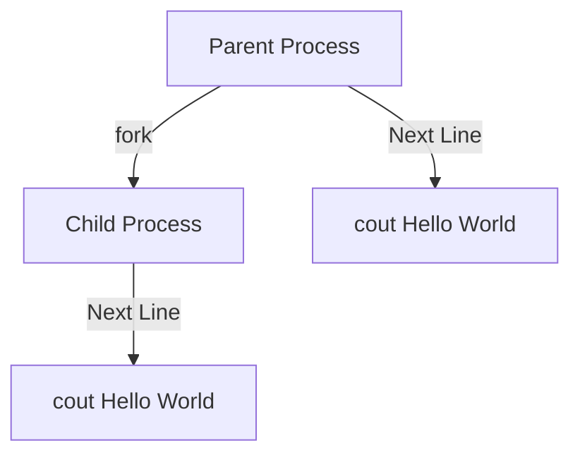
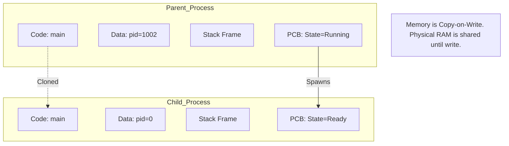

# OS Process Creation and Forking

[[T.O.C (Operating Systems Notes)|Up to Operating Systems Notes]]

#concept #os #fork #c-programming

## 1. Process Spawning

> **Prompt:** "explain the concept of process spawning with a detailed example"
> **Lens Applied:** The Chief Engineer

### Concept
Process spawning is the act of a Parent Process creating a Child Process. In Unix/Linux, this is done via the `fork()` system call.
*   **Mechanism:** The OS creates an *exact duplicate* of the parent's address space (Code, Data, Stack) for the child.
*   **Difference:** The only difference is the **PID** (Process ID) and the return value of `fork()`.

---

## 2. Fork() Logic Analysis (Hello World)

> **Prompt:** "Explain the code below in extreme detail about what the fork is doing and all that happens at the backend...
> ```c
> int main() {
>    fork();
>    cout<<"Hello World\n";
> }
> ```
> "
> **Lens Applied:** The Rubber Duck / The Chief Engineer

### The Backend Mechanics
1.  **Line `fork()`:**
    *   The Kernel halts the Parent.
    *   It copies the Parent's memory (Stack, Heap, PCB) to a new slot.
    *   It assigns a new PID to the Child.
    *   **Crucial:** Both Parent and Child are now at the *exact same line of code* (right after the fork).
2.  **Execution Resumes:**
    *   The OS schedules both. Order is unknown (non-deterministic).
3.  **Output:**
    *   Parent executes `cout`.
    *   Child executes `cout`.
    *   **Result:** "Hello World" is printed **twice**.

### Visualization


---

## 3. Server Logic (Fork Branching)

> **Prompt:** "Example 2 analysis...
> ```c
> pid = fork();
> if (pid == 0) { Child Work... }
> else { Parent Work... }
> ```
> "
> **Lens Applied:** The Architect

### The Fork Return Value
This is the standard pattern for spawning workers. `fork()` returns **twice**:
1.  **To the Parent:** It returns the **Child's PID** (a positive integer). This allows the parent to track/manage the child.
2.  **To the Child:** It returns **0**. This allows the process to know "I am the child."

### Logic Flow
*   **If `pid > 0`:** You are the Parent. (Go back to listening loop).
*   **If `pid == 0`:** You are the Child. (Handle the client request).
*   **If `pid < 0`:** Fork failed (Out of memory/process limit).

---

## 4. Parent-Child Relationship Diagram

> **Prompt:** "Draw a mermaid diagram of the parent and child processes and their components after creation in detail"
> **Lens Applied:** The Chief Engineer



```