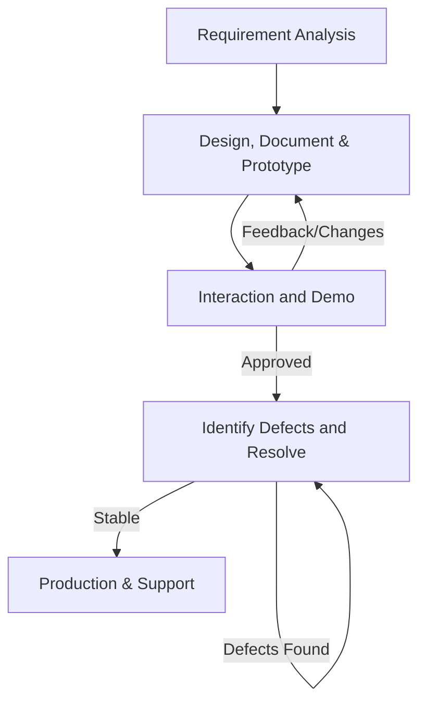

# SDA Lifecycle and Phases

[[10_University/Semester_04/Software Development and Analysis/Notes/T.O.C (Software Development and Analysis Notes)|Up to SDA Notes]]

## Phases of Software Development

## Gemini
**1. Requirement Analysis**
This is the foundational phase where the goal is to understand *what* the customer needs, not *how* to build it. It involves gathering specific, measurable requirements.
*   *Example:* Imagine building an "Online Food Delivery App." In this phase, you interview restaurant owners and customers. You discover that customers want to "track their rider in real-time" and restaurants want "automatic order printing." You document these as non-negotiable requirements.

**2. Design, Document & Prototype**
Once requirements are clear, we convert them into a technical blueprint. This includes high-level system architecture and low-level component design.
*   *Example:* For the Food App, you draw UML diagrams showing how the "User" class interacts with the "Order" and "Payment" classes. You create a wireframe (prototype) of the app interface to show the client how the "Track Order" screen will look before writing a single line of code.

**3. Interaction and Demo**
This phase involves presenting the design or early prototype to stakeholders to ensure alignment. It's a checkpoint to validate the previous two steps.
*   *Example:* You show the "Track Order" wireframe to the client. The client realizes they also want a "Call Rider" button on that screen. You catch this missed requirement now, which is cheap, rather than after coding it, which is expensive.

**4. Identify Defects and Resolve (Development & Testing)**
This is the coding phase followed immediately by verification. Developers write code, and testers try to break it.
*   *Example:* The developers code the "Call Rider" button. The QA team tests it and finds that clicking it crashes the app if the rider has no phone number listed. This is a defect. The developers fix the code to handle null phone numbers, and the defect is resolved.

**5. Production & Technical Support**
The software is deployed to the live environment for end-users. The phase shifts to maintenance and support.
*   *Example:* The Food App is live on the App Store. A user reports that the app freezes on iPhone 15. The support team logs this, and developers issue a patch (update) to fix this production issue.

### Mermaid Diagram: SDA Lifecycle

## Client Provided Prototype

## Gemini
If the client provides a prototype (e.g., a working model or high-fidelity mockup) at the start:
1.  **Accelerates Requirement Analysis:** You spend less time guessing what they want visually. The "what" is clearer.
2.  **Shortens Design Phase:** You don't need to create designs from scratch; you validate the technical feasibility of *their* design.
3.  **Risk of "The Iceberg":** A client's prototype is often just a "pretty picture" (UI) with no backend logic. It might look 90% done but is actually 0% done technically. The team must verify if the prototype's flow is actually logical and implementable in code.
4.  **Focus Shift:** The focus shifts from "What should it look like?" to "How do we make this look-alike actually function securely and scalably?"

## Lecture Notes
A report is constructed for the requirement analysis for a particular software. Then a single prototype design is created that represents that whole report. Then we have quality assurance and and identify any issues. Then we solve any found issues and these 2 processes work in a feedback loop and at last we deploy the software for production.

## Gemini
**Difference between Unit Testing and Quality Assurance (QA)**

| Feature | Unit Testing | Quality Assurance (QA) |
| :--- | :--- | :--- |
| **Who does it?** | Developers (The people writing the code). | QA Engineers / Testers (Separate team). |
| **Scope** | Smallest testable part of an application (e.g., a single function or method). | The entire system or user flow (End-to-End). |
| **Goal** | Ensure the *code* works as the developer intended. | Ensure the *product* meets user requirements and is bug-free. |
| **Perspective** | "White Box" (Knows the internal code). | "Black Box" (Tests functionality like a user). |
| **Example** | Testing if the `calculateTax()` function returns 5.0 for input 100. | Testing if the user can successfully checkout a cart and receive an email receipt. |
