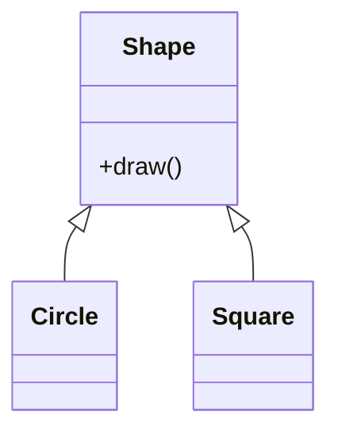

---
tags:
- field/cs
- subject/sda
- concept/oo/core
---

# SDA: OO Core Principles
> [[T.O.C (Software Development and Analysis)|Up to SDA]]

## 1. Abstraction
> **Prompt:** "Explain the concept of abstraction in OOD and OOP in complete textbook detail. Use programmatic as well as theoretical definitions and examples for it. Use java written code snippets to showcase. Generate mermaid diagrams for explanations"
> **Lens Applied:** The Chief Engineer / Abstraction Layers

### Definition
**Abstraction** is the process of hiding internal complexity and showing only the essential features of an object. It reduces cognitive load by allowing the user to interact with a high-level interface.

### Java Implementation
```java
// Theoretical: Hiding the "how", showing the "what"
abstract class PaymentGateway {
    abstract void processPayment(double amount);
}

class Stripe extends PaymentGateway {
    void processPayment(double amount) {
        // Implementation details hidden from user
        System.out.println("Processing via Stripe API: $" + amount);
    }
}
```

---

## 2. Encapsulation
> **Prompt:** "Explain the concept of Encapsulation in OOD and OOP in complete textbook detail..."
> **Lens Applied:** The Chief Engineer / The Inversionist

### Definition
**Encapsulation** is the bundling of data (variables) and the methods that operate on that data into a single unit (class). It restricts direct access to some of the object's components, which is a core security feature (Information Hiding).

```java
public class BankAccount {
    private double balance; // Protected state

    public void deposit(double amount) {
        if (amount > 0) balance += amount; // Validated transition
    }
    
    public double getBalance() { return balance; }
}
```

---

## 3. Polymorphism
> **Prompt:** "Explain the concept of Polymorphism in OOD and OOP in complete textbook detail..."
> **Lens Applied:** The Chief Engineer / Memory Model

### Definition
**Polymorphism** (Many-Forms) allows an object to be treated as an instance of its parent class or interface.
*   **Compile-time (Overloading):** Same method name, different signature.
*   **Runtime (Overriding):** Resolved via the **v-table (Virtual Table)** at runtime.



---

## 4. Inheritance
> **Prompt:** "Explain the concept of Inheritance in OOD and OOP in complete textbook detail..."
> **Lens Applied:** The Chief Engineer / The Architect

### Definition
**Inheritance** is the mechanism where one class (child) acquires the properties and behaviors of another (parent). It facilitates the "IS-A" relationship.

**The C++ Anchor:** In C++, multiple inheritance is allowed, leading to the "Diamond Problem." Java avoids this by using single inheritance for classes and multiple inheritance for interfaces.
