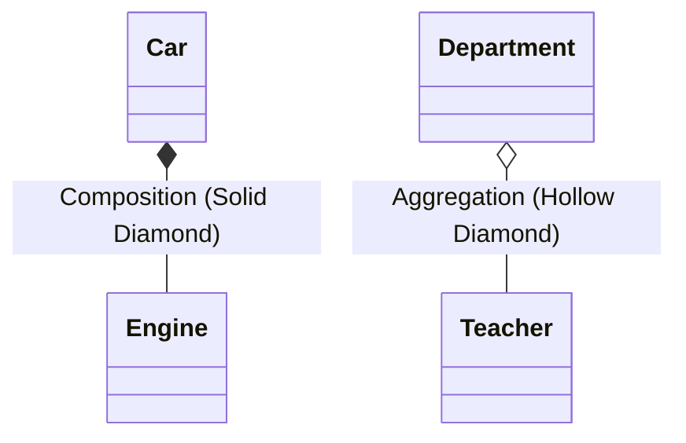

---
tags:
- field/cs
- subject/sda
- concept/oo/relationships
---

# SDA: OO Relationships
> [[T.O.C (Software Development and Analysis)|Up to SDA]]

## 1. Composition (Strong Association)
> **Prompt:** "Explain the concept of Composition in OOD and OOP in complete textbook detail. Use programmatic as well as theoretical definitions and examples for it. Use java written code snippets to showcase. Generate mermaid diagrams for explanations"
> **Lens Applied:** The Chief Engineer / Modularity

### Definition
**Composition** represents a "Part-of" relationship where the part's lifecycle is managed by the whole. If the whole is destroyed, the part is destroyed. It is a **strong ownership** model.

### Java Example
```java
class Engine { /* ... */ }

class Car {
    private final Engine engine; // Car OWNS the engine
    
    public Car() {
        this.engine = new Engine();
    }
}
```

---

## 2. Aggregation (Weak Association)
> **Prompt:** "Explain the concept of Aggregation in OOD and OOP in complete textbook detail..."
> **Lens Applied:** The Chief Engineer / Second-Order Thinking

### Definition
**Aggregation** is a "Has-A" relationship where the part can exist independently of the whole. It is a **weak ownership** or association model.

### Java Example
```java
class Teacher { /* ... */ }

class Department {
    private List<Teacher> teachers; // Department HAS teachers, but teachers exist outside it
    
    public void addTeacher(Teacher t) { teachers.add(t); }
}
```

### 3. Comparison Diagram

