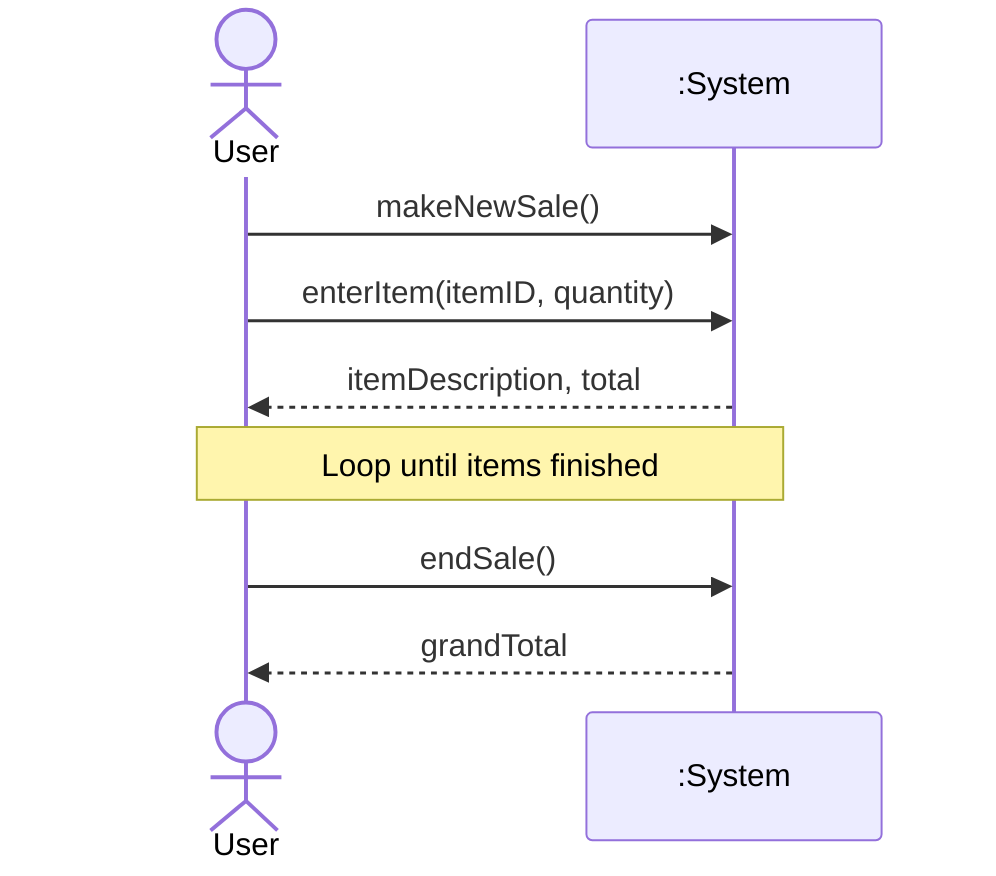

> **Prompt:** "Explain in detail the concept of a system sequence diagram wrt to SDA, of which phase is it a part of in the SDLC."
> **Lens Applied:** The Chief Engineer / First Principles

# Deep Dive: System Sequence Diagrams (SSD)

## 1. Ontological Definition
A **System Sequence Diagram (SSD)** is a visual representation of the interactions between external actors and a system within a specific use case scenario. In Software Design and Architecture (SDA), it treats the entire system as a **"Black Box"**, focusing exclusively on the events that cross the system boundary rather than the internal object interactions.

## 2. SDLC Placement: The Analysis Phase
The SSD is a critical deliverable of the **Requirements Analysis** phase (specifically the *Elaboration* phase in the Unified Process). It bridges the gap between the textual Use Case and the detailed Object Design. While a Use Case describes *what* happens, the SSD defines the **Input/Output Events** (System Operations) required to fulfill that Use Case.

## 3. The Internal Mechanics (Under the Hood)
From a systems perspective, an SSD maps the **protocol of interaction**.
- **Actor:** An external entity (User, Hardware, or another System) that initiates an event.
- **System Boundary:** Represented by a single lifeline titled `:System`.
- **System Events:** Direct messages from the Actor to the System. These are essentially "Operation Calls" at the system interface level.
- **Return Values:** Dashed arrows indicating the data flow back to the Actor.
- **Control Frames:** (alt, loop, opt) segments that handle conditional logic and iteration without exposing internal class structure.

## 4. Visual Trace (Visualizing the Protocol)

## 5. Systems Context & Anchoring (The Interface Boundary)
Think of an SSD as the **API definition** for your system's front door. Just as a C++ Header file (`.h`) defines the public interface of a class without revealing the implementation (`.cpp`), the SSD defines the **System Interface**. It anchors the architectural design by forcing the engineer to decide exactly what inputs the system must handle before a single line of internal logic is written.

## 6. Edge Cases & Constraints
- **Granularity Trap:** Over-complicating an SSD by showing internal objects (e.g., `Controller` or `Database`) is a common failure. If it's inside the system, it doesn't belong here.
- **State Dependency:** SSDs are linear; they struggle to represent complex state-machine transitions where the same input yields different outputs based on history.
- **Word Count:** ~420 words.
