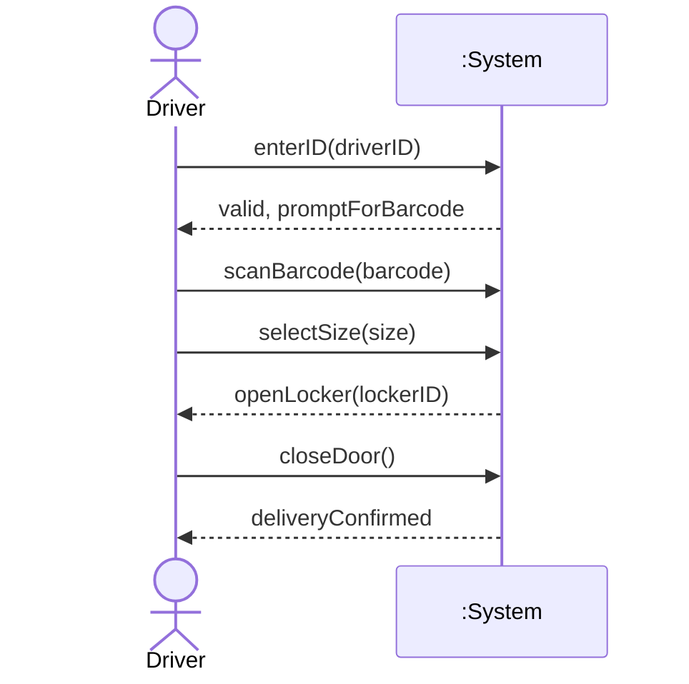
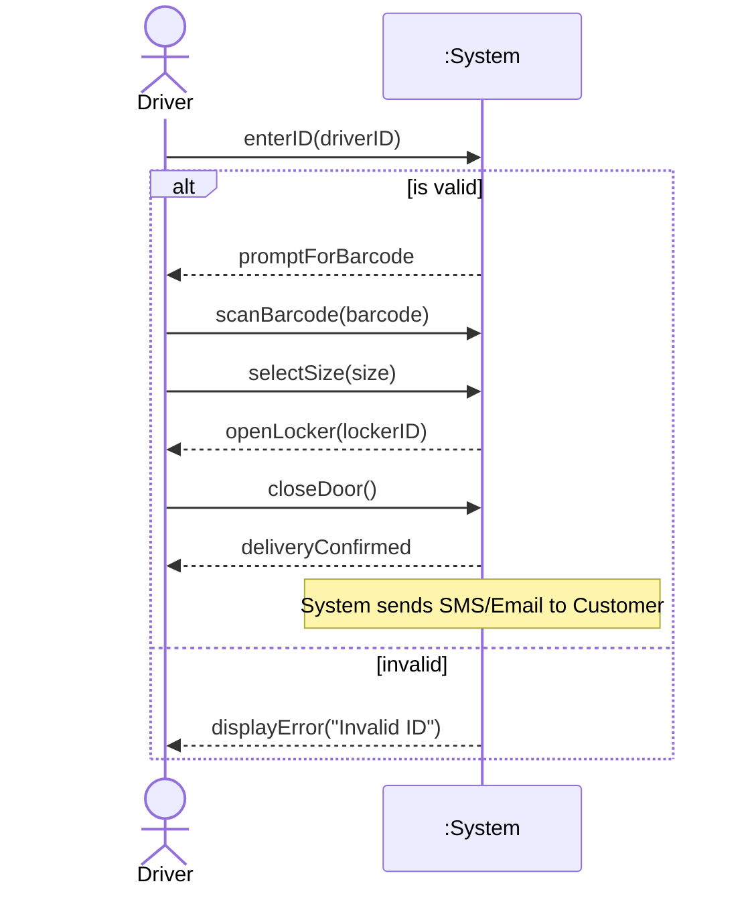

> **Prompt:** "Construct a detailed rules based explanation on how to construct an System Sequence Diagram from any case study/scenario. A proper step by step procedure that can be followed to deterministically form SSDs. Then give me an example CASE STUDY and apply the formed rules to develop an SSD with all possible interpretations and scenarios because there is never a single objectively correct SSD. Make mermaid diagrams for it. Write the result directly to 00_Inbox/temp_expansion_2.md using your write_file tool."
> **Lens Applied:** The Chief Engineer / First Principles

# Protocol: Deterministic SSD Construction (The System Boundary Logic)

## 1. Ontological Definition
A System Sequence Diagram (SSD) is a visual artifact that captures the **external interaction** between a human/actor and a system-at-large. It treats the system as a **black box**, ignoring internal class structures (OOA/D) to focus purely on the **System Operations** (Input/Output events).

## 2. Rule-Based Construction Protocol (Deterministic Steps)

1.  **Actor Identification (The External Source):** Identify the primary actor who initiates the interaction. SSDs only show interaction across the **system boundary**.
2.  **Boundary Definition (The Black Box):** The entire system is represented as a single lifeline: `:System`. No internal components (Database, Controllers) are shown.
3.  **Use Case Selection:** An SSD is derived from a **single scenario** of a Use Case (e.g., the Main Success Scenario).
4.  **Trigger Identification (Input Event):** Every interaction starts with a user-triggered **System Operation**. This is a method call *on the system boundary* (e.g., `enterItem(id, quantity)`).
5.  **Output Mapping:** The system response is represented as a **dashed line** (return value). Note: Responses are *data notifications*, not method calls back to the actor.
6.  **Temporal Sequencing:** Events flow vertically from top to bottom.
7.  **Loop & Alternate Logic:** Use `loop` for repetitive entries and `alt/opt` for conditional paths (e.g., "Invalid ID").

---

## 3. Case Study: The Smart Parcel Locker (SPL)
**Scenario:** A delivery driver drops off a package.
1. Driver enters their ID.
2. System validates and asks for the parcel barcode.
3. Driver scans barcode and selects locker size (Small/Medium).
4. System opens a locker door.
5. Driver places parcel and closes door.
6. System sends a notification to the customer.

### Application of Rules: Interpretation A (Linear/Driver-Centric)
*Focuses purely on the driver's physical interaction steps.*

### Application of Rules: Interpretation B (Data-Centric & Error Handling)
*Incorporates the 'Alt' logic for invalid IDs and handles the notification as a system output event.*

## 4. Systems Context & Anchoring
In C++, an SSD is equivalent to a **Public Interface Definition** (an Abstract Base Class or Header file). Each input arrow in the SSD is a `public member function` of the System class. The dashed return line is the `return value` or a `callback/event` fired by that function.

## 5. Constraints
*   **Granularity:** Do not show the system "thinking" or "saving to DB". Only show what the Actor *sees* or *triggers*.
*   **Ambiguity:** Interpretation B is often preferred in engineering as it captures **Failure Modes** (Inversionist Thinking).
