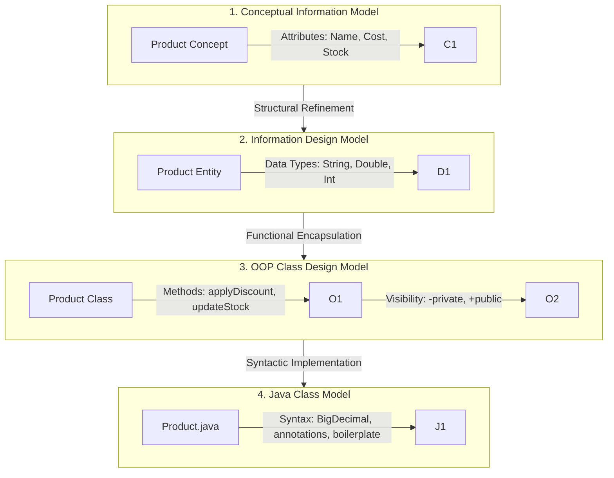

---
tags:
  - field/cs
  - subject/sda
  - concept/domain-modelling
---

[[10_University/Semester_04/Software Development and Analysis/Notes/T.O.C (Software Development and Analysis Notes)|Up to SDA Notes]]

# Domain Modelling in SDA
## Introduction
> **Seed:** "What exactly is domain modelling in the process of software development and analysis? What purpose does it serve? What problem does it aim to solve. Don't dive into the technical details yet just develop the intro and the conceptual details of it first"

## The Conceptual Blueprint: Defining Domain Modelling
In the architecture of software development, a **Domain Model** is a conceptual representation of the specific problem space—the "domain"—the software is intended to address. It is a visual and structural abstraction that captures the entities, their behaviors, and the relationships between them. Unlike a database schema or a class diagram, which focus on implementation, a domain model focuses on the **logic of the business environment**.

Think of it as a structural map of a factory floor. Before designing the specific machines (code) or the storage bins (databases), you must first understand the workflow: what materials exist, how they transform, and which personnel are responsible for which gates. The domain model documents the "laws of physics" for that specific business context, ensuring the software reflects the reality it aims to automate or enhance.

## The Purpose: Establishing a Ubiquitous Language
The primary purpose of domain modelling is to bridge the cognitive gap between domain experts (the people who understand the business) and technical experts (the people who build the system). It serves as the foundation for **Ubiquitous Language**—a shared, semi-formal vocabulary used by all team members.

By crystallizing complex business rules into a model, the process achieves:
- **Conceptual Integrity:** Ensuring that every component of the system aligns with a single, unified vision of the problem.
- **Validation:** Allowing stakeholders to "see" the logic of the proposed system and correct misconceptions before a single line of code is written.
- **Knowledge Capture:** Externalizing the "hidden" knowledge of experts into a tangible format that persists beyond individual memory.

## The Problem: Solving the "Lost in Translation" Conflict
Domain modelling aims to solve the **Semantic Disconnect**. In traditional development, business requirements are often written in ambiguous natural language, which developers then interpret through the lens of technical constraints. This leads to several systemic failures:

1.  **Requirement Drift:** Small misunderstandings at the start of a project compound into massive architectural flaws by the end.
2.  **Implicit Assumptions:** Stakeholders often leave "obvious" rules unstated. A domain model forces these rules into the light, identifying edge cases early (e.g., "Can a customer have two active subscriptions?").
3.  **Complexity Bloat:** Without a clear model, software becomes a tangled mess of "special cases." A robust domain model simplifies the system by identifying the core abstractions that govern all variations.

By abstracting the "What" from the "How," domain modelling ensures that the resulting software is not just technically sound, but contextually accurate.
## Domain vs Design Model
> **Seed:** "Differentiate between Domain and Design model by making a detailed table with a working example"

## Architectural Intent: Problem vs. Solution Space

The distinction between a Domain Model and a Design Model is fundamentally the distinction between the **Problem Space** and the **Solution Space**. 

A **Domain Model** is a visual representation of real-world conceptual classes or objects in a domain of interest. It is a "mind map" of the business requirements, devoid of technical artifacts like databases, user interfaces, or specific programming languages. It answers the question: *What is the system about?*

A **Design Model** is the blueprint for the actual software implementation. It introduces technical constraints, visibility modifiers, method signatures, design patterns, and architectural layers. It answers the question: *How will we build this system efficiently?*

## Comparative Analysis: Structural Differences

| Feature | Domain Model (Conceptual) | Design Model (Technical) |
| :--- | :--- | :--- |
| **Primary Goal** | Understand the business domain and vocabulary. | Define the software structure and implementation. |
| **Perspective** | Problem Space (Real-world entities). | Solution Space (Software artifacts). |
| **Class Attributes** | Conceptual types (e.g., `Price`, `Address`). | Primitive/System types (e.g., `decimal`, `String`). |
| **Methods/Operations** | Not included; classes are "data-only" concepts. | Full method signatures with parameters and return types. |
| **Visibility** | Not applicable (all concepts are public). | Access modifiers (private, protected, public). |
| **Relationships** | Associations, Aggregations (Conceptual). | Interfaces, Dependencies, Inheritance, Design Patterns. |
| **Software Artifacts** | None (No controllers, DAO, or DTOs). | Includes technical classes (e.g., `OrderController`, `DBConnector`). |

## Working Example: Library Management System

To illustrate the transition from a conceptual Domain Model to a technical Design Model, consider the process of "Borrowing a Book."

### 1. The Domain Model (Conceptual)
In the domain of a library, we identify the physical objects and their relationships. 
*   **Book:** Has a title and an ISBN.
*   **Member:** Has a name and a library card number.
*   **Loan:** Represents the event of a Member taking a Book. It has a due date.
*   **Relationship:** A *Member* creates a *Loan* for a *Book*.

*Note: There are no "save()" methods or "List`<Book>`" data structures here. We are merely mapping the reality of a library.*

### 2. The Design Model (Software)
When we move to the Design Model, we translate these concepts into code-ready structures, adding the "mechanics" of the software.

*   **Class `Book`:** 
    *   Attributes: `private String isbn`, `private String title`.
    *   Methods: `public String getIsbn()`, `public void setStatus(enum Status)`.
*   **Class `MemberAccount`:** 
    *   Attributes: `private int memberId`.
    *   Dependency: Injects a `LoanService` to process transactions.
*   **Interface `ILoanRepository`:** 
    *   Methods: `void saveLoan(Loan l)`, `List<Loan> findByMember(int memberId)`.
*   **Controller `BorrowingController`:** 
    *   The entry point for the UI to trigger the borrowing logic.

### The Transformation Logic
In the Domain Model, the "Loan" is just a concept. In the Design Model, the "Loan" becomes a **Persistent Entity** in a database, managed by a **Repository Pattern**, and validated by a **Service Layer**. The "Member" becomes a **User Principal** with security permissions and state management. The mechanical bridge between them is the **Software Design**, which ensures the conceptual requirements are executed within the constraints of memory, storage, and processing.

--- 

> **Seed:** "@expand Make a mermaid diagram that takes an example of an object and draws it's conceptual information model -> information design model -> OOP class design model -> Java class model and also explain at each step how exactly the previous model evolves into the next one"

## The Information Evolution Pipeline
Modeling is an iterative refinement process that transforms a fuzzy real-world concept into a rigid, executable machine instruction. We will track the evolution of a **"Product"** entity through four distinct abstraction layers.



---

## 1. Conceptual Information Model (CIM)
The Conceptual Model is the "Mental Blueprint." It focuses on **what** the object is in the business domain, ignoring all technical constraints. It represents the language of the stakeholder.

*   **Example:** A "Product" has a name, a price we sell it for, and a quantity in the warehouse.
*   **Focus:** Domain vocabulary and business rules.
*   **Evolution to next step:** To move to the **Information Design Model**, we must strip away the ambiguity of human language and assign concrete structures to these concepts. We define the "shape" of the data required to represent the concept in a digital environment.

## 2. Information Design Model (IDM)
The Information Design Model acts as the "Schema." Here, we map conceptual attributes to logical data types and primary identifiers. We are still language-agnostic but system-aware.

*   **Refinement:**
    *   `Name` becomes `String name`.
    *   `Cost` becomes `Decimal price`.
    *   `Stock` becomes `Integer quantity`.
    *   Addition of a **Primary Key**: `SKU` or `ID`.
*   **Evolution to next step:** Data is currently passive (a "struct"). To reach the **OOP Class Design Model**, we must apply the principle of **Encapsulation**. We add behavior (methods) that govern how this data can be legally modified, effectively turning a "data container" into an "intelligent agent."

## 3. OOP Class Design Model (CDM)
The OOP Class Design Model is the "Behavioral Blueprint." This is where we define access modifiers (Private/Public) and methods. We decide how the object interacts with the rest of the system.

*   **Refinement:**
    *   **Encapsulation:** Attributes are marked `private`.
    *   **Behavior:** Addition of `calculateTax()`, `applyDiscount(percentage)`, and `isAvailable()`.
    *   **Interface:** Definition of Getters and Setters (Accessors/Mutators).
*   **Evolution to next step:** This is the final design stage. To reach the **Java Class Model**, we translate these logical instructions into the specific syntax, keywords, and library requirements of the Java Virtual Machine (JVM).

## 4. Java Class Model (JCM)
The Java Class Model is the "Executable Artifact." It accounts for language-specific nuances like `BigDecimal` for currency precision (instead of raw doubles), constructors, and standard library imports.

*   **Implementation:**
```java
public class Product {
    private String sku;
    private String name;
    private java.math.BigDecimal price;
    private int stockQuantity;

    public Product(String sku, String name) {
        this.sku = sku;
        this.name = name;
    }

    public void applyDiscount(double percent) {
        // Implementation logic
    }
    
    // Getters and Setters...
}
```
*   **Refinement:** Use of `this` keyword, constructor overloading, and precise numeric types to prevent floating-point errors common in financial software.
## Key Components of a Domain Model
### Domain Objects
> **Seed:** "Explain in detail what is a Domain object in domain modelling in SDA. Explain with real world examples"

## 1. The Core Definition: Beyond Data Containers

In Software Development and Analysis (SDA), a **Domain Object** is a conceptual model of a specific "thing" or process within the business problem space. Unlike a standard database row or a UI widget, a domain object encapsulates both **state** (data) and **behavior** (business logic). 

Think of a domain object as a **Physical Tool** in a workshop. A hammer isn't just a list of materials (wood handle, steel head); it is defined by what it *does* (drives nails). If you only store the materials, you have a "Data Transfer Object" (DTO). If you store the materials and the ability to strike, you have a Domain Object.

In the context of SDA, domain objects are the building blocks of the **Domain Model**, acting as a bridge between the abstract business requirements and the concrete implementation.

## 2. Classification: Entities vs. Value Objects

Domain objects are generally categorized into two primary types based on how they are identified:

### Entities
An Entity is a domain object defined by its **identity** rather than its attributes. Even if all its data changes, it remains the same object.
*   **Analogy:** A Person. If a person changes their name, hair color, and address, they are still the same unique individual (identified by a SSN or DNA).
*   **SDA Context:** In a system, an Entity usually has a unique `ID` field.

### Value Objects
A Value Object is defined by its **attributes**. It has no conceptual identity; it is simply a "measurement" or "description."
*   **Analogy:** A $20 bill. If you swap one $20 bill for another, you don't care—the value is what matters, not the specific piece of paper.
*   **SDA Context:** Value objects are usually immutable. If you want to change a "Color" value object from Red to Blue, you don't edit the object; you replace it with a new "Blue" object.

## 3. Behavioral Integrity: Rich vs. Anemic Models

A key principle in SDA is avoiding the **Anemic Domain Model** anti-pattern.
*   **Anemic Model:** The domain object is just a "bucket" for getters and setters. All the logic is stripped out and put into "Service" classes. This makes the system hard to maintain as rules are scattered.
*   **Rich Domain Model:** The domain object "guards" its own data. It contains the business rules. 

**Example (Rich Model):**
Instead of a service calculating if a bank account can be overdrawn, the `Account` object itself has a `withdraw(amount)` method that checks the balance and throws an error if rules are violated. The object is responsible for its own integrity.

## 4. Real-World Examples

### Example A: The E-Commerce Order System
In an online store, the **Order** is a primary Domain Object (Entity).
*   **State:** OrderID, List of Items, Shipping Address, Total Price, Status (Pending, Shipped, Cancelled).
*   **Behavior (Logic):**
    *   `calculateTotal()`: Iterates through items and applies tax/discounts.
    *   `cancel()`: Checks if the order has already been shipped; if so, it prevents cancellation.
    *   `applyCoupon(code)`: Validates the coupon against the current items.

### Example B: The Flight Reservation System
A **Seat** on a plane can be a Domain Object.
*   **State:** Seat Number, Class (Economy/Business), IsOccupied.
*   **Behavior:**
    *   `assignToPassenger(passengerID)`: Checks if `IsOccupied` is false before updating.
    *   `upgradeClass()`: Changes the class attribute while ensuring the seat configuration allows it.

### Example C: The Library Management System
A **Book** is an Entity, while a **ISBN** might be a Value Object.
*   **Book Object Behavior:**
    *   `checkout(memberID)`: Changes the status to "Borrowed" and sets a due date.
    *   `isOverdue()`: Compares the current date with the due date.
    *   The Book object ensures it cannot be checked out if its status is already "Borrowed" or "In Repair."
### Associations
> **Seed:** "@expand Explain in detail what is association in domain modelling in SDA. Explain with real world examples. Draw parallels with multiplicity and also compare all different multiplicity notations"

## The Anatomy of Association

In Domain Modelling, an **Association** is a structural relationship that specifies that objects of one class are connected to objects of another. If classes are the "nouns" of the system, associations are the "verbs" or the "structural glue" that defines how these entities interact or relate over time. It is not a transient interaction (like a method call) but a persistent relationship that implies a path for communication.

Mechanically, an association acts like a **physical cable** connecting two hardware components. While the components (classes) contain the logic, the cable (association) defines the possibility of data flow between them.

### Real-World Example: The Library System
Consider a `Member` and a `Book`. In isolation, they are static entities. An association named `Borrows` creates a conceptual link between them. 
*   **Logic:** A `Member` object has a reference to the `Book` objects they have currently checked out.
*   **Persistence:** This link remains valid until the book is returned, representing a state in the domain.

## Multiplicity: The Quantitative Constraint

If an association is the cable, **Multiplicity** is the specification of the **connector ports**. It defines the number of instances of one class that can be linked to a single instance of the associated class at a specific point in time. Multiplicity transforms a vague connection into a rigorous business rule.

### The Parallel
Association defines **existence** (Can A talk to B?), while multiplicity defines **capacity** (How many of B can A talk to simultaneously?). Without multiplicity, a domain model is architecturally ambiguous, leading to database schema errors or null pointer exceptions in implementation.

**Example: Employer and Employee**
*   **Association:** `WorksFor`
*   **Multiplicity (Employer side):** 1 (An employee works for exactly one company).
*   **Multiplicity (Employee side):** 1..* (A company must have at least one employee to exist in the system).

## Comparative Analysis of Multiplicity Notations

Multiplicity is expressed using a specific range notation (minimum..maximum). Below is a comparison of the standard UML notations used in SDA:

| Notation | Meaning | Domain Constraint Logic |
| :--- | :--- | :--- |
| **0..1** | **Zero or One** | **Optional Single:** An object may or may not be linked. (e.g., `Person` and `Spouse`). |
| **1** (or 1..1) | **Exactly One** | **Mandatory Single:** The relationship is required. (e.g., `Car` and `Engine`). |
| **0..*** (or *) | **Zero or More** | **Optional Many:** The collection can be empty. (e.g., `Customer` and `Order`). |
| **1..*** | **One or More** | **Mandatory Many:** At least one connection is required. (e.g., `Team` and `Player`). |
| **n** | **Specific Number** | **Fixed:** Exactly *n* links. (e.g., `Bicycle` and `Wheel` where n=2). |
| **n..m** | **Range** | **Bounded:** Minimum *n* and maximum *m*. (e.g., `Course` and `Student` where capacity is 10..40). |

### Structural Impact
1.  **Lower Bound (Minimum):** Determines **Optionality**. If the minimum is 0, the relationship is optional. If it is 1 or more, the relationship is mandatory (participation constraint).
2.  **Upper Bound (Maximum):** Determines **Cardinality**. It dictates whether the implementation requires a simple reference (pointer) or a collection (list, set, array).

In system design, a `1..1` association is "tightly coupled," often indicating that one entity cannot exist without the other, whereas a `0..*` association is "loosely coupled," providing maximum flexibility for data entry and object lifecycle management.
### Attributes
> **Seed:** "@expand Explain in detail what are attributes in domain modelling in SDA. Explain with real world examples. Also establish anti-patterns"

## The Anatomy of Attributes
In Domain Modelling, **attributes** are the discrete data elements that characterize a Domain Object (Entity or Value Object). They represent the "state" of the system at a static point in time. If a Domain Class is a blueprint for a machine, the attributes are the entries on its technical specification plate—fixed properties that define its capacity, identity, or current condition without describing its mechanical movement.

In Software Development and Analysis (SDA), attributes serve as the leaf nodes of the structural model. They must be **atomic** (representing a single piece of information) and **relevant** (essential to the specific problem domain being modeled).

### The "Spec Sheet" Analogy
Think of a shipping container. 
- **The Entity:** The Container itself (tracked by a unique Serial ID).
- **The Attributes:** `MaxWeightCapacity`, `CurrentWeight`, `MaterialType`, `IsRefrigerated`.
These are properties. They do not describe *how* the container is lifted or *where* it is going; they describe what the container *is* and what it *contains* right now.

## Mechanics of Selection and Refinement
A common challenge in SDA is distinguishing between an attribute and a related entity. The decision is governed by the principle of **Identity vs. Value**:

1.  **Value Semantics (Attribute):** If you change the value of the property and it doesn't change the "identity" of the object, it is an attribute. (e.g., Changing a `User`'s `LastName` doesn't make them a different person).
2.  **Identity Semantics (Entity):** If the property has its own lifecycle and needs to be tracked independently, it is likely an Entity, not an attribute. (e.g., An `Address` might be an attribute in a simple profile, but in a Logistics System, it is an Entity with its own coordinates, zones, and history).

### Real-World Example: Banking Domain
In a `SavingsAccount` domain object:
- `AccountNumber`: **Identity Attribute** (Static, unique).
- `Balance`: **State Attribute** (Dynamic, numeric).
- `InterestRate`: **Policy Attribute** (Governs logic, but stored as data).
- `DateOpened`: **Temporal Attribute** (Audit trail).

## Attribute Anti-Patterns
In SDA, poorly defined attributes lead to "Anemic Domain Models" or rigid, unmaintainable code.

### 1. Primitive Obsession
Using basic data types (String, Int) to represent complex domain concepts.
- **Example:** Storing an email address as a `String`. 
- **The Failure:** A string cannot self-validate. It allows "invalid-email" to be stored.
- **The Solution:** Use a **Value Object** (e.g., `EmailAddress` class) that encapsulates the string and its validation logic.

### 2. Behavioral Leakage
Storing a value that should be calculated on-the-fly, leading to data synchronization errors.
- **Example:** Storing `IsOverdue` as a Boolean attribute in an `Invoice` object.
- **The Failure:** If the date passes, the attribute remains `False` until a manual update occurs.
- **The Solution:** Replace the attribute with a method `isOverdue()` that compares `DueDate` with `CurrentDate`.

### 3. The "God Attribute" (Blobbing)
Packing multiple pieces of information into a single string.
- **Example:** A `ProductSpecs` attribute containing `"Red-XL-Cotton-19.99"`.
- **The Failure:** Requires complex parsing (regex) every time the system needs to filter by size or color. It violates atomicity.
- **The Solution:** Decompose into discrete attributes: `Color`, `Size`, `Material`, `Price`.

### 4. Metadata Confusion
Including attributes that belong to the database or the UI, not the Domain.
- **Example:** Including `SubmitButtonColor` or `DatabaseRowID` in the Domain Model.
- **The Failure:** Pollutes the business logic with infrastructure concerns, making the model harder to test or port to different environments.
### Business Rules
> **Seed:** "@expand Explain in detail what is are business rules in domain modelling in SDA. Explain with real world examples"

## The Logic Layer: Business Rules as Domain Physics

In domain modeling, business rules are the "laws of physics" that govern a specific problem space. While entities represent the *nouns* (objects) and methods represent the *verbs* (actions), business rules define the *constraints* and *logic* that ensure the system remains in a valid state. They are not merely technical requirements; they are the codified policies, calculations, and constraints of the business itself.

In a domain model, a business rule defines how business objects interact and under what conditions an operation is permitted. Without these rules, a model is an "Anemic Domain Model"—a hollow shell of data with no inherent intelligence or protection against corruption.

## Taxonomy of Business Rules

Business rules are generally categorized based on their impact on the state and flow of the domain:

1.  **Invariants (Constraint Rules):** These are conditions that must always remain true for a domain object to be considered valid. If an operation would violate an invariant, the system must reject the change.
2.  **Derivations (Inference Rules):** These rules define how new information is calculated from existing data. They transform raw state into meaningful business intelligence.
3.  **Action Enablers (Trigger Rules):** These rules dictate when a specific action should be executed based on a change in the environment or state.
4.  **Structural Constraints:** These define the mandatory relationships between entities (e.g., "An Order must have at least one LineItem").

## Implementation: Enforcement Mechanisms

In Software Development and Analysis, business rules are implemented through specific patterns to ensure they are "Always Valid":

*   **Guard Clauses:** Methods within a domain entity that check for rule violations before executing logic. If the rule is violated, the method throws a Domain Exception.
*   **Domain Services:** When a rule involves multiple entities or complex external lookups that don't belong to a single object, the rule is encapsulated in a Service.
*   **Specifications Pattern:** A pattern where rules are encapsulated into reusable "SatisfiedBy" objects, allowing the system to check if a candidate object meets the business criteria.

## Real-World System Examples

### 1. Financial Systems (Banking Domain)
*   **Rule:** "A Savings Account cannot have a negative balance, and the maximum daily withdrawal is $2,000."
*   **Type:** Invariant / Constraint.
*   **Logic:** Before the `Withdraw()` method executes, the system checks `if (balance - amount < 0 || amount > 2000)`. If true, the transaction is aborted. This prevents the "machine" from entering an impossible state (negative money in a non-credit account).

### 2. E-Commerce (Logistics Domain)
*   **Rule:** "If a customer’s total order exceeds $100 and they are a 'Premium' member, apply a 15% discount and provide free shipping."
*   **Type:** Derivation / Action Enabler.
*   **Logic:** The `Order` entity calculates the `FinalPrice` by checking the `CustomerStatus` and `Subtotal`. This isn't just a UI feature; it's a core business policy that ensures revenue integrity.

### 3. Healthcare (Pharmacy Management)
*   **Rule:** "A prescription for a Controlled Substance cannot be refilled more than five times or after six months from the date of issue."
*   **Type:** Structural / Temporal Constraint.
*   **Logic:** The `Prescription` entity tracks `RefillCount` and `IssueDate`. The `RequestRefill()` method acts as a gatekeeper, comparing the current attempt against the hard-coded legal limits of the domain.

### 4. Aviation (Flight Booking)
*   **Rule:** "A passenger cannot be assigned to an Exit Row seat unless they are over 15 years old and have no physical disabilities that prevent them from assisting in an emergency."
*   **Type:** Complex Structural Constraint.
*   **Logic:** This rule bridges the `Passenger` entity and the `Seat` entity. The `AssignSeat()` domain service validates the passenger's attributes against the seat's specific requirements (the "Exit Row" flag) before allowing the association.
## Step by Step procedure to build a conceptual model
<!-- @blueprint:5 processed: Explain in detail the 5 step procedure to build a conceptual model using these 5 steps: Read requirements -> identify core concepts -> Draw associations -> Add attributes -> Validate and refine. Make sure to include anti patterns and and example run through in each step -->

## Step 1: Requirement Parsing and Linguistic Analysis
> **Seed:** "Explain the first step of conceptual modeling: Reading Requirements. Detail the 'Linguistic Analysis' technique for extracting nouns and verbs as potential model elements. Include anti-patterns such as 'Implicit Assumption Bias' and 'Premature Technical Filtering,' and provide an example run-through using a brief 'Online Bookstore' requirement snippet."

## The Intake Phase: Reading Requirements

In the architecture of software design, Conceptual Modeling is the process of mapping a problem space into a structured representation. The first step, **Reading Requirements**, functions as the "sensor array" of the modeling engine. This is not a passive reading of text, but a rigorous extraction process where the modeler identifies the essential entities, their properties, and their interactions from a narrative or specification.

The goal is to transform "natural language noise" into "structural signal." If the intake phase is flawed—if requirements are misread or filtered through personal bias—the resulting model will be an elegant solution to the wrong problem.

## Linguistic Analysis: Noun-Verb Extraction

Linguistic Analysis is a systematic technique used to parse requirements documents to identify candidate model elements. It operates on the principle that the structure of language often mirrors the structure of the domain.

### 1. Nouns as Candidate Classes and Attributes
Nouns represent "things" in the system. They are the structural components (the "nodes" in your graph).
- **Proper Nouns/Common Nouns:** Usually indicate **Classes** (e.g., `Customer`, `Invoice`, `Book`).
- **Nouns representing characteristics:** Usually indicate **Attributes** (e.g., `Price`, `ISBN`, `MailingAddress`).
- **Nouns representing containers:** Often indicate **Collections** or **Aggregates** (e.g., `Catalog`, `Library`).

### 2. Verbs as Candidate Operations and Associations
Verbs represent "actions" or "relationships" between nouns. They define the dynamic behavior and connectivity of the system.
- **Transitive Verbs:** Often indicate **Operations** or **Methods** (e.g., "The customer *updates* the profile").
- **Stative Verbs/Prepositions:** Often indicate **Associations** or **Structural Links** (e.g., "A book *belongs to* a category", "A customer *owns* an account").

## Anti-Patterns in Requirement Digestion

Failure in the reading phase often stems from two cognitive traps:

### Implicit Assumption Bias
This occurs when the modeler fills in "missing information" based on their own experience rather than the actual requirement text. 
- **The Symptom:** Adding features or constraints that aren't in the document because "that's how these systems usually work."
- **The Risk:** Developing a system that meets the developer's expectations but fails the user's specific business logic. If the requirement says "User logs in," assuming an email/password mechanism when the client intended Biometric/SSO is an implicit assumption bias.

### Premature Technical Filtering
This occurs when the modeler ignores domain-specific terms because they don't seem "implementable" or "technical" enough.
- **The Symptom:** Discarding nouns like `RefundPolicy` or `DiscountTier` because they sound like "business fluff" rather than "data structures."
- **The Risk:** Losing the "Ubiquitous Language" of the domain. Conceptual models should reflect the business reality, not the database schema. If a term is vital to the business, it must exist in the model, regardless of how simple or complex its implementation might be.

## Practical Application: Online Bookstore Example

Consider the following requirement snippet:
> "A **registered customer** can **browse** the **online catalog** to **find** a **book**. The customer **adds** the book to their **shopping cart**. When the customer **checks out**, the system **generates** an **invoice**."

### Extraction Results:

| Linguistic Category | Text Element | Potential Model Element |
| :--- | :--- | :--- |
| **Noun** | Registered Customer | **Class:** `Customer` |
| **Noun** | Online Catalog | **Class:** `Catalog` (Potential Singleton or Manager) |
| **Noun** | Book | **Class:** `Book` |
| **Noun** | Shopping Cart | **Class:** `Cart` |
| **Noun** | Invoice | **Class:** `Invoice` |
| **Verb** | Browse / Find | **Association/Method:** Search functionality in `Catalog` |
| **Verb** | Adds | **Method:** `Cart.addItem(book)` |
| **Verb** | Checks out | **Process/State Change:** Transition from `Cart` to `Order/Invoice` |
| **Verb** | Generates | **Method:** `InvoiceFactory` or `System` behavior |

In this run-through, the modeler must resist the urge to immediately add a `Database` class (Premature Technical Filtering) or assume that every `Book` must have a "Genre" field if it isn't mentioned (Implicit Assumption Bias). The model should remain a pure reflection of the provided text.

## Step 2: Core Concept Identification and Filtering
> **Seed:** "Explain the process of identifying core concepts (Classes) from requirements. Discuss the criteria for selecting meaningful domain entities versus transient data or implementation details. Include anti-patterns like 'The God Object' and 'Attribute-as-Class Confusion,' and demonstrate identifying the core classes for the 'Online Bookstore' example."

## Extraction Methodology: Linguistic Analysis

The identification of core classes begins with **Linguistic Analysis**, specifically "Noun Extraction" from the requirements specification or User Stories. In this phase, the requirements are treated as a raw data stream where nouns act as candidate classes and verbs act as candidate methods or responsibilities.

1.  **Initial Harvest:** Identify every noun and noun phrase in the document (e.g., "Customer," "Invoice," "PDF Generator," "Database," "Email").
2.  **Syntactic Mapping:** Map these nouns to a candidate list. At this stage, no filtering is performed; the goal is total recall of the domain vocabulary.
3.  **Refinement:** Group synonyms (e.g., "User" and "Client") and resolve ambiguity to establish a Unified Ubiquitous Language.

## Filtering Criteria: Domain Entities vs. Implementation Details

Not every noun becomes a class. To prevent "Class Bloat," candidates must pass a mechanical filter based on their role in the system's architecture.

### 1. Domain Significance
A class must represent a concept within the **Problem Domain**, not the **Solution Domain**. 
*   **Domain Entity:** "Order," "InventoryItem," "Patient." These exist even if the software does not.
*   **Implementation Detail:** "Array," "TableRecord," "SQLConnector," "HTMLWrapper." These are artifacts of the implementation and should be abstracted away or handled by the infrastructure layer.

### 2. State and Behavior (The Rule of Three)
A robust class should ideally possess:
*   **Identity:** A way to distinguish one instance from another (e.g., an ID).
*   **State:** Meaningful attributes that change over time.
*   **Behavior:** Methods that operate on that state.
If a candidate only has state but no behavior, it might be a **Data Transfer Object (DTO)** or a simple attribute. If it only has behavior, it might be a **Service** or a static utility.

### 3. Lifecycle and Persistence
Entities have a lifecycle (Created -> Modified -> Archived/Deleted). If a noun represents "Transient Data" (e.g., "LoginAttempt" or "SearchResult"), it may be better handled as a local variable or a temporary collection rather than a core domain class, unless the business requires historical tracking of that data.

## Anti-Patterns in Domain Modeling

### The God Object (The Blob)
This occurs when a single class assumes too many responsibilities, becoming the "central processor" while other classes are reduced to passive data containers. 
*   **Mechanism:** A class named `SystemManager` or `Controller` that contains hundreds of methods and interacts with every other class.
*   **Consequence:** High coupling, fragile maintenance, and violation of the Single Responsibility Principle (SRP).

### Attribute-as-Class Confusion
This is the error of promoting a simple attribute to a full class when it lacks independent behavior or identity.
*   **Mechanism:** Creating a class `Price` when a primitive `double` or a simple `Value Object` (like `Money`) would suffice. 
*   **Correction:** If the "class" cannot exist independently of its parent and has no unique identity (e.g., "Color," "Weight"), it should likely remain an attribute unless it requires complex validation logic.

## Demonstration: Online Bookstore Domain Model

Applying the extraction and filtering process to an "Online Bookstore" requirements set:

### Candidate List (Raw Nouns)
*   Book, Author, Customer, Shopping Cart, Checkout Page, Database, Order, Credit Card Number, Admin, PDF Receipt, Price.

### Filtering Process
| Candidate | Decision | Justification |
| :--- | :--- | :--- |
| **Book** | **Class** | Core entity; has identity (ISBN), state (Title, Price), and behavior. |
| **Customer** | **Class** | Core entity; has identity and lifecycle. |
| **Order** | **Class** | Represents a transaction; links customers to books. |
| **Shopping Cart** | **Class** | Transient but complex state; manages items before the order is finalized. |
| **Database** | **Discard** | Implementation detail; part of the infrastructure, not the domain. |
| **Checkout Page** | **Discard** | UI detail; the domain cares about the "Checkout Process," not the page element. |
| **Price** | **Attribute** | Better represented as a field within `Book` or a `Money` Value Object. |
| **Credit Card No** | **Attribute** | Sensitive data field within a `Payment` or `Customer` class. |

### Core Domain Model
The resulting model consists of **Book**, **Author**, **Customer**, **Order**, and **Cart**. These classes form the "Skeleton" of the application, upon which the business logic and UI will be built. Implementation details like "PDF Generation" are moved to the Service layer, ensuring the core model remains pure and focused on the domain logic.

## Step 3: Establishing Associations and Multiplicity
> **Seed:** "@expand Detail the third step: Drawing Associations between concepts. Explain how to define relationships (has-a, uses, belongs-to) and determine multiplicity (1..*, 0..1). Include anti-patterns like 'The Spiderweb Effect' (over-coupling) and 'Ambiguous Directionality,' and apply these associations to the 'Online Bookstore' concepts identified in Step 2."

## Step 3: Establishing Associations and Multiplicity

Associations are the logical pathways through which domain concepts interact. While Step 2 identifies the static entities (the "nouns"), Step 3 defines the structural "verbs" that allow the system to navigate from one object to another. In domain modeling, an association is not just a pointer; it represents a conceptual connection that exists in the real-world business domain.

### 1. Defining Relationship Types
Relationships categorize how one entity relates to the lifecycle or functionality of another. Defining these correctly prevents the "Lego-brick" problem where components are joined but don't function as a cohesive machine.

*   **Has-a (Structural/Ownership):** This denotes containment. In a domain model, we look for conceptual ownership. 
    *   *Example:* An `Order` **has-a** set of `LineItems`. If the `Order` is cancelled and removed from the system, the `LineItems` generally lose their reason for existence.
*   **Uses (Functional/Dependency):** A transient relationship where one concept requires another to perform a task but does not own its lifecycle.
    *   *Example:* A `CheckoutProcess` **uses** a `PaymentGateway`. The gateway exists independently of any single checkout attempt.
*   **Belongs-to (Inverse/Contextual):** This describes a concept’s membership within a larger set or its origin.
    *   *Example:* A `Book` **belongs-to** a `Category`. This helps in classifying and retrieving data within the domain context.

### 2. Multiplicity: Quantifying the Connection
Multiplicity (or cardinality) defines how many instances of Class A can be associated with a single instance of Class B. It serves as the "logical governor" of the system, enforcing business constraints at the model level.

| Notation | Meaning | Domain Implication |
| :--- | :--- | :--- |
| **1** | Exactly one | Strict requirement; the entity cannot exist in a vacuum (e.g., an `Account` must have exactly one `Owner`). |
| **0..1** | Zero or one | Optional relationship; often used for optional profiles or nullable states. |
| **\*** | Zero or many | A standard collection; the entity may exist without any associated items or with an infinite number. |
| **1..\*** | One or many | A "Non-Empty" constraint; at least one instance must exist (e.g., a `LibrarySection` must contain at least one `Book`). |

### 3. Association Anti-Patterns
Incorrectly drawn associations lead to "Model Rot," where the software becomes rigid and fragile.

*   **The Spiderweb Effect (Over-Coupling):** This occurs when the modeler attempts to make every class reachable from every other class. If a `Book` is directly linked to `Customer`, `Order`, `Review`, `Author`, and `Warehouse`, the model loses its hierarchy. This is often caused by modeling *UI requirements* (e.g., "I want to see the customer's name on the book page") instead of *Domain logic*.
*   **Ambiguous Directionality:** This happens when associations are drawn as simple lines without arrows or clear semantic meaning. If the direction isn't defined, the implementation phase becomes guesswork. Does the `Order` know about the `Payment`, or does the `Payment` know about the `Order`? Without direction, you risk circular dependencies.

### 4. Application: The Online Bookstore
Applying these principles to the Bookstore concepts identified in Step 2:

*   **Customer to Order (1 → 0..*):** A `Customer` is the owner of their purchase history. One `Customer` can place many `Orders`, but each `Order` **belongs-to** exactly one `Customer`.
*   **Order to Book (1 → 1..*):** An `Order` must contain at least one `Book`. This is a "uses" relationship in the domain—the `Order` references the `Book` but does not own it (deleting an order doesn't delete the book from the catalog).
*   **Book to Author (1..\* → 1..\*):** A standard many-to-many association. A `Book` can have multiple `Authors`, and an `Author` can write multiple `Books`.
*   **ShoppingCart to Book (1 → \*):** A `ShoppingCart` acts as a temporary container (**has-a**) for zero or more `Books`.

By mapping these connections, the model moves from a list of static entities to a dynamic blueprint that describes how data flows and how business rules (like "An order cannot be empty") are structurally enforced.

## Step 4: Attribute Mapping and Data Scoping
> **Seed:** "@expand Explain the step of adding attributes to domain concepts. Focus on identifying 'essential state' required by the domain rather than database columns. Include anti-patterns such as 'Redundant Data Storage' and 'Behavioral Leakage' (adding methods instead of data), and list the specific attributes for the 'Online Bookstore' entities."

## Defining the Essential State
In domain modeling, attributes represent the internal variables that a concept must maintain to fulfill its role within the system's logic. This is the **Essential State**—the minimum set of data required to uniquely identify and describe a domain object at any given moment. 

Identifying attributes is a process of filtering reality through the lens of business requirements. Unlike database design, which often focuses on storage efficiency, normalization, and physical constraints (e.g., `varchar` lengths, foreign key constraints), domain modeling focuses on **Information Requirements**. An attribute should only be included if it is necessary for the system's use cases or business rules.

**The Dashboard Analogy:**
Essential state is like the dashboard of a flight simulator. It displays only the dials the pilot needs to navigate—altitude, heading, and fuel level. It does not display the part numbers of the landing gear bolts or the manufacturing date of the seat cushions. While that data exists in the "database" (the maintenance logs), it is not part of the "domain model" (the flight) because it does not influence the immediate logic of flying the plane.

## Anti-Patterns in Attribute Identification

### Redundant Data Storage
This anti-pattern occurs when a model includes attributes that can be derived or calculated from other data already present in the model. In a database, this might be intentional for performance (denormalization), but in a domain model, it introduces **State Synchronization Debt**. 
*   **Example:** Including `TotalOrderValue` as an attribute in an `Order` entity when `UnitPrice` and `Quantity` already exist in `OrderItem`. 
*   **Risk:** If the quantity is updated but the total is not, the domain state becomes corrupted. The model should prioritize the "Source of Truth" over pre-computed results.

### Behavioral Leakage
Domain modeling at the conceptual level is about **structure**, not **behavior**. Behavioral Leakage happens when designers add methods or operations (e.g., `CalculateTax()`, `ValidateEmail()`, `SaveToDisk()`) to the attribute list. 
*   **Correction:** Attributes must be nouns or adjectives representing state, not verbs representing actions. If an item looks like a function, it belongs in a later design phase (Class Diagrams) or a Service layer, not the Domain Model.

## Case Study: Online Bookstore Attributes
The following entities and their essential attributes represent the state required to manage inventory, customer relations, and transactions within an Online Bookstore domain.

| Entity | Essential Attributes |
| :--- | :--- |
| **Book** | ISBN (Unique Identifier), Title, Author, Description, UnitPrice, StockLevel, Genre |
| **Customer** | CustomerID, FullName, EmailAddress, DefaultShippingAddress, AccountStatus (e.g., Active, Suspended) |
| **Order** | OrderID, OrderDate, TrackingNumber, CurrentStatus (e.g., Processing, Shipped, Delivered) |
| **ShoppingCart** | CartID, LastModifiedDate, SessionToken |

### Note on Identity
In domain modeling, every entity requires a unique identifier (Identity) that distinguishes it from other instances. Even if two books have the same Title and Author, their ISBN ensures they are treated as distinct logical units within the system.

## Step 5: Model Validation and Iterative Refinement
> **Seed:** "@expand Describe the final step: Validate and Refine. Explain how to use 'Scenario Walkthroughs' (checking if the model supports specific use cases) to verify the model. Include anti-patterns like 'Static Model Syndrome' and 'Edge-Case Over-engineering,' and show a refinement of the 'Online Bookstore' model after testing it against a 'Process Refund' scenario."

## Phase Final: Validation and Refinement
Validation is the stress-testing phase of domain modeling. It ensures the structural blueprint (classes and relationships) can actually support the system’s behavioral requirements (use cases). Without this step, a model remains a theoretical "museum piece"—visually pleasing but architecturally non-functional. Refinement is the iterative adjustment of the model based on the failures discovered during validation.

In a factory analogy, if the domain model is the floor plan, validation is "walking the line" with a specific product order to ensure the conveyor belts actually connect and the machines have the necessary clearance to operate.

## Mechanical Verification: Scenario Walkthroughs
A Scenario Walkthrough is a manual execution of a use case against the static domain model. It serves as a connectivity and logic check.

1.  **Select a Use Case:** Pick a specific path (e.g., "Add Item to Cart").
2.  **Trace the Path:** Start at the primary Actor/Entity and move through the model using existing associations.
3.  **Check Multiplicity:** Ensure the relationships (1..*, 0..1) allow for the specific data volumes required by the scenario.
4.  **Identify Missing Links:** If the scenario requires a `Customer` to access their `DiscountTier`, but no association exists between them, the model is broken.
5.  **Verify Attribute Sufficiency:** Check if the classes have the necessary state (attributes) to make the decisions required by the logic.

## Modeling Anti-Patterns
To ensure high-quality refinement, architects must avoid two common structural failures:

### Static Model Syndrome
This occurs when the model captures "what the system is" but ignores "what the system does." The result is a passive data schema that looks like a database ERD (Entity Relationship Diagram) rather than a domain model. It lacks the associations or helper entities (like `Calculators` or `Policies`) needed to execute business logic, leading to "Anemic Domain Models" where logic is pushed entirely into external service layers.

### Edge-Case Over-engineering
The opposite of the static model, this involves complicating the structure to account for every 0.1% probability event. If the model includes a `DisasterRecoveryLocation` entity linked to every `Order` just in case a meteor hits the warehouse, the architecture becomes brittle. These should be handled by robust logic or external systems, not by cluttering the core domain entities.

## Case Study: Refining the 'Online Bookstore'
Consider an initial model for an Online Bookstore containing: `Customer`, `Order`, `LineItem`, and `Book`.

**The Scenario:** *Process Refund.* 
A customer wants to return a damaged book. The system must verify the purchase date, calculate the refund amount based on a 10% restocking fee, and update the inventory.

**Initial Model Failure:**
*   The `Order` contains `LineItems`, but there is no concept of a `Payment` entity to record *how* the money was sent (Credit Card vs. Store Credit).
*   There is no record of the "State" of a book (New vs. Damaged).
*   The restocking fee logic has nowhere to live.

**Refined Model Implementation:**
1.  **Add `Payment` Entity:** Linked to `Order` to track the transaction ID for the reversal.
2.  **Add `ReturnRequest` Entity:** Acts as a join-table between `Customer` and the specific `LineItem` being returned.
3.  **Add `RefundPolicy` Entity:** A Strategy-pattern object linked to the `Store` or `Category` that contains the `calculateRestockingFee()` method.
4.  **Attribute Update:** Add `status` (e.g., *Refunded*, *Partially Refunded*) to the `Order` class to prevent double-refunding.

By running the "Process Refund" walkthrough, the model evolved from a simple list of "things" into a robust machine capable of handling the complexities of financial reversals.
## Examples
> **Seed:** "Construct domain models in detail with explanations for the following examples: - E-Commerce - Airline"

Domain modeling is the process of creating a conceptual map of a system's problem space. It identifies the "things" (entities) that exist in the business environment and the rules (associations) that govern their interactions. In Software Development and Analysis (SDA), these models serve as the skeletal structure upon which the database schema and class diagrams are built.

## Principles of Domain Modeling
A robust domain model focuses on **conceptual classes** rather than software components. It ignores databases, UI widgets, and specific programming languages, focusing instead on:
- **Entities:** Objects with unique identities (e.g., a specific Order).
- **Attributes:** Properties that describe an entity (e.g., OrderDate).
- **Associations:** The structural relationship between entities (e.g., a Customer *places* an Order).
- **Multiplicity:** Rules governing how many instances of one class relate to another.

---

## Domain Model: E-Commerce System
An E-Commerce system must handle the lifecycle of a purchase, from product discovery to payment fulfillment.

### 1. Primary Entities & Attributes
*   **Customer:** Represents the user. Attributes: `CustomerID`, `Name`, `Email`, `ShippingAddress`.
*   **Product:** The inventory items. Attributes: `SKU`, `Name`, `Description`, `UnitPrice`, `StockQuantity`.
*   **Category:** Organizational grouping for products. Attributes: `CategoryID`, `CategoryName`.
*   **Order:** A finalized purchase request. Attributes: `OrderID`, `OrderDate`, `TotalAmount`, `Status` (Pending, Shipped, Delivered).
*   **OrderItem (Line Item):** A bridge entity between Order and Product to handle quantity and historical pricing. Attributes: `Quantity`, `PriceAtPurchase`.
*   **Payment:** The financial transaction. Attributes: `TransactionID`, `PaymentMethod`, `Timestamp`, `Amount`, `Status`.
*   **ShoppingCart:** A transient container for items. Attributes: `CartID`, `CreatedDate`.

### 2. Relational Dynamics
*   **Customer 1 --- * Order:** A customer can place multiple orders over time, but each order is tied to exactly one customer identity for billing and shipping.
*   **Order 1 --- * OrderItem:** An order is a collection of specific lines. This prevents "Product" from being directly linked to "Order," allowing an order to contain multiple different products.
*   **Product 1 --- * OrderItem:** A single product (e.g., a specific laptop model) can appear in the line items of many different customers' orders.
*   **Category 1 --- * Product:** One category (e.g., "Electronics") contains many products.
*   **Order 1 --- 1 Payment:** In most standard flows, an order has a one-to-one relationship with its payment record to ensure financial reconciliation.

---

## Domain Model: Airline Reservation System
The airline domain is high-complexity, requiring a distinction between a "Flight" (the schedule) and a "FlightInstance" (the actual plane taking off on a specific Tuesday).

### 1. Primary Entities & Attributes
*   **Airport:** The nodes in the network. Attributes: `IATACode` (e.g., LHR, JFK), `City`, `Country`.
*   **Route:** The abstract path between two airports. Attributes: `RouteID`, `Distance`, `EstimatedDuration`.
*   **Flight (Schedule):** The recurring plan. Attributes: `FlightNumber` (e.g., PK-301), `DepartureTime`, `ArrivalTime`.
*   **FlightInstance (Leg):** The actual occurrence of a flight on a specific date. Attributes: `Date`, `Status` (On-time, Delayed, Cancelled).
*   **Aircraft:** The physical machine. Attributes: `TailNumber`, `Model` (e.g., Boeing 777), `TotalCapacity`.
*   **Passenger:** The individual flying. Attributes: `PassportNumber`, `Name`, `Nationality`.
*   **Booking (PNR):** The reservation record. Attributes: `PNR_Number`, `BookingDate`, `TotalFare`.
*   **Seat/Ticket:** The specific assignment. Attributes: `SeatNumber`, `Class` (Economy, Business), `Price`.

### 2. Relational Dynamics
*   **Airport 1 --- * Route:** An airport acts as an origin or destination for many routes.
*   **Route 1 --- * Flight:** A single route (London to New York) may have multiple scheduled flights per day.
*   **Flight 1 --- * FlightInstance:** The "Flight PK-301" exists once in the schedule but has a new "Instance" every day it flies.
*   **Aircraft 1 --- * FlightInstance:** A physical aircraft is assigned to specific flight instances. It cannot be in two places at once, enforcing temporal constraints.
*   **Booking 1 --- * Ticket:** One booking (for a family) can contain multiple tickets/seats, but all share a single PNR (Passenger Name Record).
*   **FlightInstance 1 --- * Ticket:** Each flight instance has a limited number of tickets available, capped by the `Aircraft.TotalCapacity`.
*   **Passenger 1 --- * Ticket:** A passenger can have multiple tickets (for different legs of a journey), but each ticket belongs to one passenger.

### 3. Logic Constraints (The "Under the Hood" View)
In the airline model, the association between `FlightInstance` and `Aircraft` is critical. If an aircraft is delayed on a previous `FlightInstance`, the domain model must allow the system to propagate that delay to the next instance assigned to that specific `TailNumber`. This illustrates why the **Aircraft** entity is decoupled from the **Flight Schedule**.
## Best and worst practices
> **Seed:** "@expand Explain in detail the best practices in domain modelling in SDA and also explain mistakes to avoid with real world examples"

## The Architecture of Reality: Domain Modeling in SDA
Domain modeling is the process of creating a conceptual representation of a specific problem space—the domain. In Software Engineering and Analysis (SDA), the domain model acts as the "source of truth" for business logic, independent of technical implementations like databases or user interfaces. It is the mechanical blueprint of how business rules interact. If we view software as a factory, the domain model is the layout of the specialized machines and the specific protocols for how raw materials (data) are transformed into finished products (value).

## Best Practices in Domain Modeling
A robust domain model minimizes complexity by ensuring the code reflects the business reality as closely as possible.

### 1. Implementation of Ubiquitous Language
The most critical practice is the synchronization of terminology between domain experts (stakeholders, business analysts) and technical teams. Every term used in the requirements must appear identically in the code.
*   **The Rule:** If a stakeholder refers to a "Policyholder," the code must contain a class named `Policyholder`, not `User` or `Client`. This eliminates the "Translation Layer" where bugs often hide.
*   **Analogy:** A high-precision assembly line where every technician uses the exact same serial numbers for parts. Miscommunication results in a faulty engine.

### 2. Distinction Between Entities and Value Objects
Modeling requires distinguishing between objects with a unique thread of identity and those defined purely by their attributes.
*   **Entities:** Objects with a lifecycle and a persistent ID (e.g., a `Member` in a gym system). Even if their name or address changes, they remain the same entity.
*   **Value Objects:** Objects that describe a characteristic. They are immutable and have no identity (e.g., `Money`, `Color`, `DateRange`). If you change a value object, you replace it entirely.
*   **Practice:** Favor Value Objects wherever possible. They are "side-effect free," making the system more predictable and easier to test.

### 3. The "Rich Domain Model" Principle
Logic should reside where the data lives. Instead of having a "Service" class reach into an object to change its state, the object should expose methods that represent business actions.
*   **Practice:** Instead of `AccountService.setBalance(account, account.getBalance() - 100)`, use `account.withdraw(100)`. The `account` object itself should validate if the withdrawal is legal based on business rules.

### 4. Definition of Bounded Contexts
Large systems should be broken into sub-domains where specific terms have specific meanings. A `Product` in a "Sales" context (price, discount) is different from a `Product` in a "Warehouse" context (weight, dimensions, shelf location). 
*   **Practice:** Create separate models for separate contexts to prevent "God Objects" that try to satisfy every department's needs simultaneously.

## Critical Mistakes and Anti-Patterns
Failure in domain modeling usually results in "Spaghetti Code" or "Rigidity," where the software becomes impossible to change without breaking unrelated features.

### 1. The Anemic Domain Model (The "Data Bag" Error)
This occurs when domain classes are merely containers for data (Getters and Setters) with no behavior. All logic is moved to "Service" classes.
*   **Real-World Example:** In a Banking App, if `SavingsAccount` is just a data structure and `InterestCalculatorService` handles the logic, the rules for interest become disconnected from the account. If a new type of account is added, the developer must remember to update the service, often leading to "Logic Leaks" and inconsistent states.

### 2. Leaking Infrastructure into the Domain
The domain model should be "Pure." It should not know about SQL, JSON, or Third-Party APIs.
*   **The Mistake:** Adding database annotations (like `@Table` or `@Column`) directly onto domain entities. This ties your business logic to a specific database technology. If you switch from SQL to NoSQL, your business logic "breaks" technically even if the business rules haven't changed.

### 3. The "God Object" (Over-Generalization)
Attempting to create a single class that handles everything.
*   **Real-World Example:** In an E-commerce system, creating a `User` class that handles authentication, shopping carts, order history, shipping addresses, and payment methods. 
*   **Result:** Any change to the "Shipping" logic requires re-testing the "Authentication" logic because they are coupled in the same massive class.

## Case Studies: Real-World Impact

### Failure: The "Universal Package" in Logistics
A global shipping company attempted to use one `Package` class for their entire ERP system. The "International Customs" team needed specific tax fields, while the "Local Delivery" team needed GPS coordinates. The class grew to 2,000 lines of code with 50+ fields. Eventually, changing the way "Tax" was calculated caused "Local Delivery" notifications to stop working because the shared object had become too complex to modify safely. They failed because they ignored **Bounded Contexts**.

### Success: The "Immutable Transaction" in Fintech
A digital wallet startup modeled every movement of money as an **Immutable Value Object** called a `Transaction`. Because these objects could not be changed once created (only new ones added), their audit trail was naturally perfect. By ensuring the `Wallet` **Entity** was the only object allowed to create these transactions, they eliminated "Race Conditions" where two services might try to spend the same dollar simultaneously. They succeeded by enforcing a **Rich Domain Model**.
## Scope and Boundaries
> **Seed:** "Explain what is in the scope and boundary of a domain model. How to deterministically determine what's in and what's out of the boundary"

## Architecture of the Domain Boundary

In software engineering, the **Domain Boundary** acts as a semi-permeable membrane. It defines the logical perimeter within which the system's rules, logic, and data structures operate autonomously. Everything inside this boundary is the **Scope**—the specific set of concepts, behaviors, and data that the software is responsible for managing.

Think of the domain model as a **specialized automated factory**. 
- **The Scope** includes the assembly lines, the internal inventory, and the specialized robots (business logic) that transform raw materials into products.
- **The Boundary** is the factory wall. 
- **The External World** consists of the power grid, the raw material suppliers, and the shipping trucks. These are essential for the factory's operation but are not *part* of the factory's internal logic.

## Deterministic Inclusion: The "In" vs. "Out" Logic

Determining what belongs in the model is not a matter of intuition but a process of **elimination and ownership**. To deterministically decide if an entity or process is "In" (Scope) or "Out" (External), apply the following four tests:

### 1. The Linguistic Test (Ubiquitous Language)
If a term is not used by domain experts to describe the *core business process*, it is likely outside the scope. 
- **In:** "Order," "Inventory Item," "Premium Discount."
- **Out:** "Database Connection," "JSON Parser," "HTTP Header." These are technical implementation details, not domain concepts.

### 2. The Responsibility (State Ownership) Test
Does the system govern the lifecycle and state transitions of this object?
- **In:** If the system is the "Source of Truth" for an object's state (e.g., changing an Order from `Pending` to `Shipped`), the object is inside the boundary.
- **Out:** If the system merely *references* an object owned by another system (e.g., a User Profile managed by an external OAuth provider), the full object is outside; only a reference or a "projection" of it exists inside.

### 3. The Transformation Test
Is the data being actively transformed by business rules, or is it merely being transported?
- **In:** A "Tax Calculator" that applies regional laws to a subtotal.
- **Out:** An "Email Gateway" that simply moves a message from point A to point B. The gateway is infrastructure; the message content (if it triggers logic) is domain.

### 4. The Actor/System Distinction
Actors (people or external systems) interact with the boundary but are never *inside* it.
- **Out:** The "Customer" as a physical person.
- **In:** The "Customer Account" or "Customer Profile" (the system's digital representation of that actor).

## Deterministic Decision Matrix

| Criteria | In Scope (Domain Model) | Out of Scope (Infrastructure/External) |
| :--- | :--- | :--- |
| **Logic** | Business rules, calculations, validations. | Data persistence (SQL), UI rendering, Network I/O. |
| **Data** | Entities and Value Objects that store business state. | Configuration files, log files, temporary caches. |
| **Control** | Orchestration of internal workflows. | Triggers from external timers or manual user clicks. |
| **Identity** | Managed by internal UUIDs or business keys. | Managed by external systems (e.g., social security numbers if used only as a lookup). |

## The Boundary Determination Algorithm

To programmatically determine the boundary during analysis, follow this flow:

1.  **Identify the Core Transaction:** What is the primary value this system provides? (e.g., "Process a Loan").
2.  **Trace Dependency Paths:** Identify every object required to complete that transaction.
3.  **Apply Ownership Filter:** For each object, ask: *"If this object's data is corrupted, is it our system's fault?"* 
    - If Yes $\rightarrow$ **Internal Entity.**
    - If No $\rightarrow$ **External Dependency/Value Object.**
4.  **Define Interface Points:** Where the system interacts with the "Out" (e.g., APIs, SPIs), define **Ports and Adapters**. These are the gates in the boundary wall.

By strictly enforcing these boundaries, the domain model remains "pure"—it becomes a mathematical representation of business logic, decoupled from the volatile shifts of technology and external system changes.
## Transitioning to a design
> **Seed:** "@expand Explain in detail the concept of transitioning to a design after the correct implementation of the domain model of the system"

## The Design Pivot: Transitioning from "What" to "How"
The transition from a domain model to a software design represents a fundamental shift in perspective: from describing the problem space (conceptual) to defining the solution space (technical). While the domain model captures the "Truth" of the business domain—entities, rules, and relationships—the design model introduces the "Mechanics" required to make that truth executable on a machine.

In a factory analogy, the domain model is the blueprint of the product itself (e.g., a car's engine specifications). The design is the blueprint of the assembly line—the robotic arms, the conveyor belts, and the power supply required to actually manufacture that engine.

## Structural Refinement: From Conceptual Associations to Software Visibility
In the domain model, associations represent conceptual links (e.g., a `Customer` "has" an `Order`). During the transition to design, these abstract lines are converted into concrete **Visibility**.

1.  **Defining Navigation:** Associations in domain models are often bidirectional. In design, we must decide on the direction of traversal. If a `Sale` needs to know its `LineItems`, but a `LineItem` never needs to know its parent `Sale`, we implement a unidirectional reference to optimize memory and reduce coupling.
2.  **Attribute Formalization:** Conceptual attributes (e.g., "Date") are assigned strict data types (e.g., `java.time.LocalDateTime`). 
3.  **Collection Implementation:** A "to-many" relationship in a domain model is realized in design through specific data structures (e.g., `ArrayList`, `HashSet`, or `Map`), chosen based on performance requirements for searching or ordering.

## Behavioral Allocation: Realizing Use Cases through Responsibilities
The most critical part of the transition is the distribution of behavior. While the domain model is largely static, the design model uses **Interaction Diagrams** (Sequence or Communication diagrams) to assign responsibilities.

-  **Applying GRASP Principles:** Designers use General Responsibility Assignment Software Patterns (GRASP) to decide where logic lives. For example, using the **Information Expert** principle, the responsibility for calculating a "Total" is assigned to the class that owns the "Price" and "Quantity" data (the `LineItem`).
-  **Method Definition:** The messages passed between objects in interaction diagrams become the public API (methods) of the design classes. This is where signatures, return types, and exception handling are finalized.

## Incorporating the Software Infrastructure
The domain model is "pure"—it exists in a vacuum where databases and user interfaces do not exist. The design phase introduces the **Technical Services** layer to support the domain.

-  **Persistence Mapping:** Transitioning involves deciding how domain objects will be stored. This includes designing Data Access Objects (DAOs) or Repository patterns to bridge the gap between the object-oriented domain and a relational database (ORM).
-  **Boundary and Controller Classes:** The design introduces "Controller" objects to handle system events from the UI and delegate them to the domain layer, ensuring the domain logic remains isolated from the interface.
-  **Applying GoF Patterns:** Complex creation logic is moved to **Factories**, and global access is managed via **Singletons**, ensuring the system is maintainable and scalable beyond the simple conceptual definitions of the domain model.

> ***Domain modelling bridges the gap between business understanding and software architecture***

