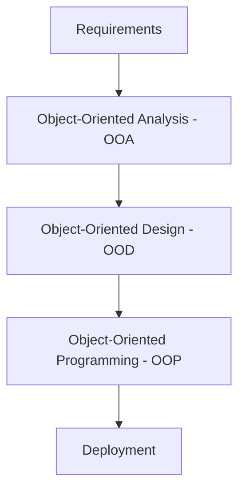

# SDA: OOD and OOP Concepts
> [[T.O.C (Software Development and Analysis)|Up to SDA]]

## OOD vs OOP
> **Prompt:** "Explain in detail the concepts of OOD and OOP. Prepare a comparison table for comparing OOD and OOP and also use real world examples and mermaid diagrams to show if one is the subset of the other"
> **Lens Applied:** The Chief Engineer / First Principles

### 1. Ontological Definition
**Object-Oriented Design (OOD)** is the architectural phase of software engineering where requirements are transformed into a blueprint of interacting objects. It focuses on the **what** and **how they relate** (interfaces, dependencies, and hierarchy).

**Object-Oriented Programming (OOP)** is the implementation phase where the OOD blueprint is realized in a specific language (Java, C++, Python). It focuses on the **how** (state management, method logic, and memory allocation).

### 2. The Relationship (Architecture vs. Construction)
OOD is the "Blueprint"; OOP is the "Building". 

**Is one a subset?** Ontologically, OOP is the *subset* of the broader Object-Oriented Software Engineering (OOSE) process, while OOD provides the constraints for OOP. One cannot have meaningful OOP without at least an implicit OOD.

### 3. Comparison Matrix
| Feature | Object-Oriented Design (OOD) | Object-Oriented Programming (OOP) |
| :--- | :--- | :--- |
| **Focus** | Relationships and Interfaces | Implementation and State |
| **Artifact** | UML Diagrams, Design Patterns | Code, Classes, Objects |
| **Tooling** | StarUML, LucidChart, Whiteboards | IDEs (IntelliJ, VS Code), Compilers |
| **Abstraction** | Higher (Abstract Classes, Interfaces) | Lower (Concrete Classes, Instances) |

---

## OO paradigm - Analogy
> **Prompt:** "Explain to me the paradigm of object oriented design and programming in detail how it came to be what pros and cons it has. AT last use an analogy to explain this paradigm. One of the analogies I can recommend is legos"
> **Lens Applied:** The Chief Engineer / The Constructivist

### 1. The Internal Mechanics (The Shift)
The OO paradigm emerged as a response to the "Spaghetti Code" of procedural programming. In procedural code, data is a passive passenger moved through a series of functions. In OO, data and logic are encapsulated into **Objects** that protect their own state.

### 2. Pros and Cons
*   **Pros:**
    *   **Modularity:** Objects can be developed and tested in isolation.
    *   **Reusability:** Via Inheritance and Composition.
    *   **Maintainability:** Localizing changes to a specific class.
*   **Cons:**
    *   **Overhead:** V-table lookups (C++) and object headers (Java) consume memory and CPU.
    *   **Complexity:** Deep inheritance trees can become "fragile base classes."

### 3. The Lego Analogy
Imagine a bucket of Legos.
*   **Classes:** These are the *molds* used in the factory. A "2x4 Red Brick" mold defines the dimensions and the studs.
*   **Objects (Instances):** These are the individual bricks you pull out of the bucket. Each has its own position in space (state) but shares the same properties defined by the mold.
*   **Encapsulation:** The internal plastic density and the exact measurements are hidden. You only interact with the "Interface" (the studs on top and holes on the bottom).
*   **Composition:** You don't inherit "Car" from "Plastic." You *compose* a car by snapping together wheels, a chassis, and a windshield.
