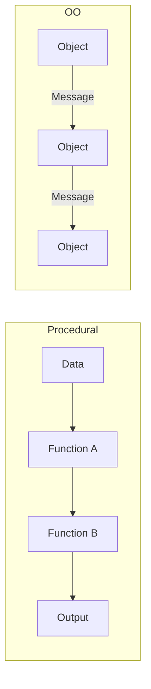

# SDA: Programming Paradigms
> [[T.O.C (Software Development and Analysis)|Up to SDA]]

## Landscape of Paradigms
> **Prompt:** "Can you enlist more paradigms other than OO paradigm and what were their details. Explain. Prepare a comparison table comparing OO paradigm to all other paradigms in all possible ways with examples and mermaid diagrams of flow of designing and programming in each paradigm"
> **Lens Applied:** The Chief Engineer / The Architect

### 1. Taxonomy of Paradigms
1.  **Imperative:** Focuses on *how* to achieve a goal via state changes (Sequential instructions).
    *   **Procedural:** A subset of imperative using procedure calls (C, Fortran).
2.  **Declarative:** Focuses on *what* the goal is without describing the control flow.
    *   **Functional:** Treats computation as the evaluation of mathematical functions (Haskell, Lisp).
    *   **Logic:** Based on formal logic/facts (Prolog).

### 2. Paradigm Comparison Matrix
| Feature | Object-Oriented (OO) | Functional (FP) | Procedural | Logic |
| :--- | :--- | :--- | :--- | :--- |
| **Basic Unit** | Object (State + Behavior) | Pure Function | Procedure/Function | Relation/Fact |
| **State** | Mutable (Encapsulated) | Immutable | Mutable (Global/Local) | N/A (Rule-based) |
| **Flow Control** | Method Calls | Recursion / HOFs | Loops / Jumps | Backtracking |
| **Data/Logic** | Bound together | Kept Separate | Kept Separate | Integrated |

### 3. Design Flow: OO vs. Procedural

---

## Object Oriented vs Functional Paradigm
> **Prompt:** "Compare in detail the OO and Functional paradigm in every possible way and prepare detailed analysis of the comparison with clear pros and cons and use mermaid diagrams for better explanations"
> **Lens Applied:** The Chief Engineer / The Optimizationist

### 1. The Core Conflict: State vs. Transformation
*   **OO:** The world is a collection of things that change. You "ask" an object to change itself.
*   **FP:** The world is a flow of data. You "transform" input into output without changing the original input.

### 2. Detailed Comparison
*   **Concurrency:**
    *   **OO:** Difficult. Managing shared mutable state requires Locks and Mutexes (Race conditions).
    *   **FP:** Natural. Since data is immutable, there is no state to lock. Functions are thread-safe by default.
*   **Granularity:**
    *   **OO:** Large-scale modularity. Great for complex UI systems (e.g., individual Widgets).
    *   **FP:** Mathematical precision. Great for data processing pipelines and compilers.

### 3. Pros and Cons
| Paradigm | Pros | Cons |
| :--- | :--- | :--- |
| **OO** | Intuitive mapping to real world; easy to manage complex hierarchies. | Hidden side effects; "Banana-Monkey-Jungle" problem (dependencies). |
| **FP** | Predictable (No side effects); easier to unit test; excellent concurrency. | Steep learning curve; performance overhead due to immutability/copying. |
