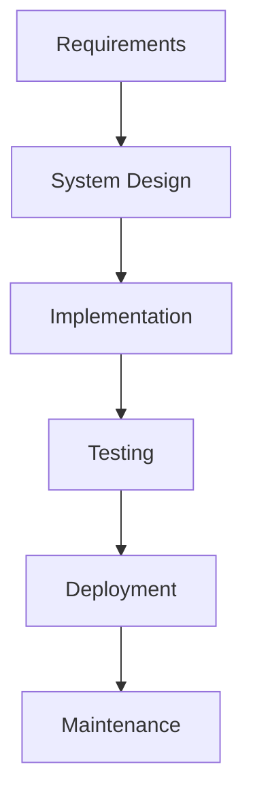
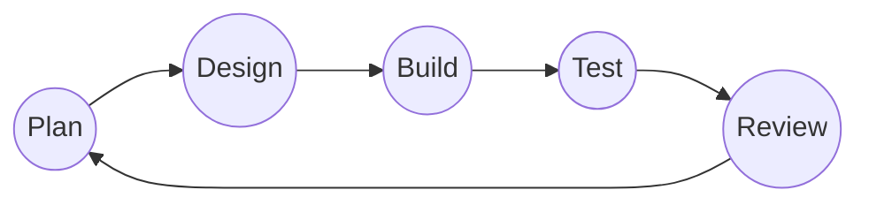
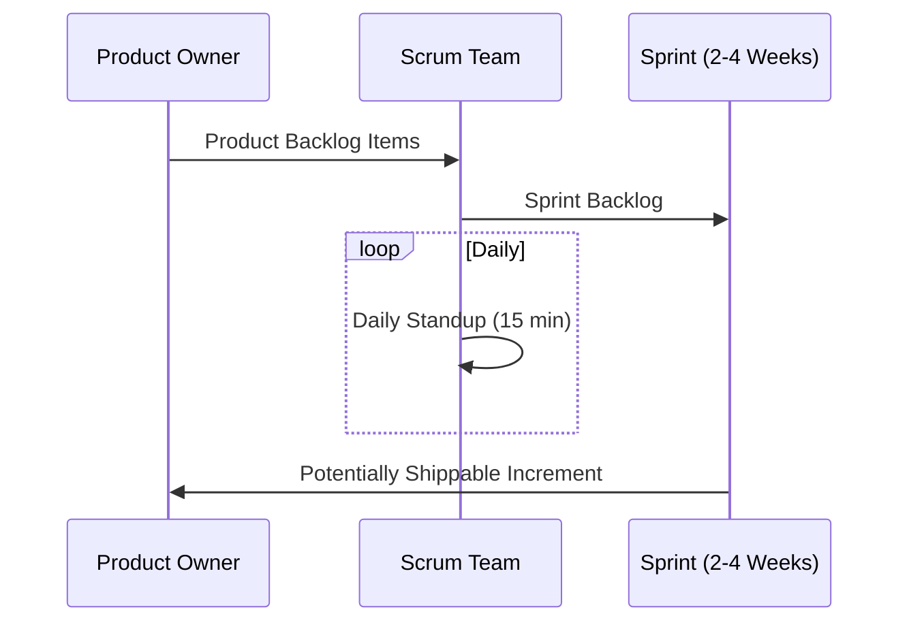
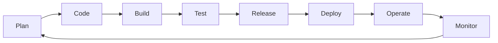
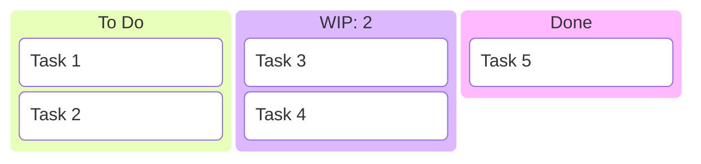

# SDA Methodologies

[[10_University/Semester_04/Software Development and Analysis/Notes/T.O.C (Software Development and Analysis Notes)|Up to SDA Notes]]

## Overview
Various methodologies exist to guide the software development process, each with its own philosophy on planning, execution, and delivery.

> [!info] **Expansion Seed**
> **Prompt:** "Use the above notes as the base but now make very very detailed explanations of each of the models with examples and mermaid diagrams. At the end construct as many difference table as you can comparing 2 of these models. You have to compare any 2 models for all combination of comparisons"
> **Lens Applied:** The Chief Engineer / The Optimizationist

# Detailed Analysis: SDLC Models

## 1. Waterfall Model
### Ontological Definition
The Waterfall model is a linear-sequential life cycle model where progress is seen as flowing steadily downwards (like a waterfall) through several phases.

### Internal Mechanics

- **Strict Gating:** Each phase must be 100% complete and signed off before the next begins.
- **Document Driven:** Heavy emphasis on documentation (SRS, SDD) at the start.
- **Feedback Loop:** Minimal. Changes in requirements late in the cycle require restarting the entire process.

### Systems Context & C++ Anchor
In low-level engineering, Waterfall is akin to **Static Memory Allocation**. Once the size (requirements) is defined at compile-time (start of project), it cannot be changed during runtime (development) without recompiling (restarting).

---

## 2. Agile Methodology
### Ontological Definition
An umbrella term for several iterative and incremental software development methodologies based on the Agile Manifesto.

### Internal Mechanics

- **Continuous Integration:** Frequent builds and user testing.
- **Evolutionary Requirements:** Requirements evolve through collaboration between self-organizing, cross-functional teams.

### Systems Context & C++ Anchor
Agile represents **Dynamic Memory Allocation (heap)**. You allocate what you need when you need it (`new`/`malloc`), and you can resize or reallocate as the program’s state (market requirements) changes.

---

## 3. Scrum Framework
### Ontological Definition
A specific Agile framework used to manage complex knowledge work, emphasizing software development.

### Internal Mechanics
- **Roles:** Product Owner, Scrum Master, Development Team.
- **Artifacts:** Product Backlog, Sprint Backlog, Increment.
- **Events:** Sprint, Sprint Planning, Daily Scrum, Sprint Review, Sprint Retrospective.

---

## 4. DevOps
### Ontological Definition
A set of practices that combines software development (Dev) and IT operations (Ops) to shorten the systems development life cycle and provide continuous delivery with high software quality.

### Internal Mechanics

- **CI/CD Pipelines:** Automated testing and deployment.
- **Infrastructure as Code (IaC):** Managing infrastructure via scripts rather than manual configuration.

---

## 5. Kanban
### Ontological Definition
A method for managing the creation of products with an emphasis on continual delivery while not overburdening the development team.

### Internal Mechanics
- **Visual Board:** Tracks work items through stages.
- **WIP Limits:** Restricts the number of tasks in "Doing" to prevent bottlenecks.
- **Pull System:** New work is only started when capacity is available.

---

# The Arena: Comparative Analysis

## 1. Waterfall vs. Agile
### Direct Comparison Matrix
| Feature | Waterfall | Agile |
| :--- | :--- | :--- |
| **Philosophy** | Predictability and Control. | Adaptability and Speed. |
| **Requirements** | Fixed upfront (SRS). | Evolving through feedback. |
| **Delivery** | Big Bang (Single release). | Incremental (Continuous). |
| **Customer Role** | Passive after sign-off. | Active collaborator. |
| **Risk Profile** | High (Errors found at end). | Low (Early validation). |
| **Documentation** | Comprehensive (Plan-driven). | Just-enough (Value-driven). |
| **Cost of Change** | Exponentially high. | Linear/Manageable. |

### Structural Divergence (The "Why")
Waterfall treats software like **civil engineering** (physical bridges), where planning errors are fatal. Agile treats software like **biological evolution**, where the "organism" (code) must adapt to its environment (market) to survive. Waterfall seeks to minimize change; Agile seeks to harness it.

---

## 2. Waterfall vs. Scrum
### Direct Comparison Matrix
| Feature | Waterfall | Scrum |
| :--- | :--- | :--- |
| **Core Unit** | The Project Phase. | The Sprint (Time-box). |
| **Control** | Command & Control (PM). | Empirical (Transparency, Inspection). |
| **Cadence** | Linear. | Cyclical. |
| **Team Structure** | Functional Silos (Dev/QA). | Cross-functional (Dev+QA). |
| **Success Metric** | Adherence to Plan. | Working Software. |
| **Planning** | Predictive (Big Upfront). | Adaptive (Rolling Wave). |

### Structural Divergence (The "Why")
Waterfall relies on **determinism**—the idea that we can know everything at the start. Scrum is built on **empiricism**—the belief that knowledge comes from experience and making decisions based on what is known. Scrum forces "reality checks" every 2-4 weeks, whereas Waterfall stays in the "planned hallucination" until the testing phase.

---

## 3. Waterfall vs. DevOps
### Direct Comparison Matrix
| Feature | Waterfall | DevOps |
| :--- | :--- | :--- |
| **Handovers** | Manual, high friction. | Automated pipelines. |
| **Release Freq** | Monthly/Yearly. | Daily/Hourly. |
| **Responsibility** | Siloed (Dev vs Ops). | Shared (You build it, you run it). |
| **Quality** | Phase-gate checks. | Continuous automated testing. |
| **Stability** | Infrequent "risky" changes. | Frequent "small" changes. |

### Structural Divergence (The "Why")
Waterfall optimizes for **Resource Utilization** (keeping everyone busy in their silo). DevOps optimizes for **Lead Time** (getting code to production). Waterfall views "Operations" as a destination; DevOps views it as a continuous loop.

---

## 4. Waterfall vs. Kanban
### Direct Comparison Matrix
| Feature | Waterfall | Kanban |
| :--- | :--- | :--- |
| **Focus** | Phases & Milestones. | Throughput & Lead Time. |
| **WIP Management** | Unrestricted (Batched). | Strict WIP Limits. |
| **Change** | Not allowed until next cycle. | Allowed at any time. |
| **Visibility** | Gantt Charts (Theoretical). | Kanban Board (Physical/Visual). |
| **Bottlenecks** | Hidden in phases. | Instantly visible (WIP piling). |

### Structural Divergence (The "Why")
Waterfall is a **Push System** (pushing work to the next phase regardless of capacity). Kanban is a **Pull System** (pulling work only when capacity is available). Kanban focuses on the *flow of work*, while Waterfall focuses on the *stages of work*.

---

## 5. Agile vs. Scrum
### Direct Comparison Matrix
| Feature | Agile | Scrum |
| :--- | :--- | :--- |
| **Definition** | A Mindset/Philosophy. | A Framework/Set of Rules. |
| **Roles** | Not specified. | Strict (PO, SM, Team). |
| **Ceremonies** | Not specified. | Daily Standup, Review, Retro. |
| **Flexibility** | High (choose your path). | Medium (must follow Scrum guide). |
| **Complexity** | Simple values. | Prescriptive process. |

### Structural Divergence (The "Why")
Agile is the **Constitution** (the values and principles). Scrum is the **Local Ordinance** (the specific laws to enforce those values). You can be "Agile" without "Scrum," but you cannot be "Scrum" without being "Agile."

---

## 6. Agile vs. DevOps
### Direct Comparison Matrix
| Feature | Agile | DevOps |
| :--- | :--- | :--- |
| **Focus** | Interaction and Collaboration. | Integration and Automation. |
| **Goal** | Managing complexity. | Managing deployments. |
| **Key Metric** | Velocity. | MTTR / Deployment Frequency. |
| **Feedback** | From users. | From the system/monitoring. |
| **Scope** | "Code to Test". | "Code to Cloud". |

### Structural Divergence (The "Why")
Agile solves the "Wait for Requirements" problem. DevOps solves the "Wait for Servers" problem. Agile makes the developer's life better by reducing rework; DevOps makes the user's life better by ensuring the service is always available and improving.

---

## 7. Agile vs. Kanban
### Direct Comparison Matrix
| Feature | Agile | Kanban |
| :--- | :--- | :--- |
| **Work Unit** | Iterations (Time-boxed). | Tasks (Continuous). |
| **Planning** | Periodic. | Continuous/As-needed. |
| **Estimations** | Story Points/Velocity. | Cycle Time/Historical Data. |
| **Change** | Discouraged during iteration. | Encouraged anytime. |
| **Board Reset** | After every iteration. | Never (Permanent flow). |

### Structural Divergence (The "Why")
Agile (specifically Scrum) uses **Time-boxing** to create urgency and focus. Kanban uses **Flow-control** to maximize efficiency. Kanban is more reactive (good for support/ops), while Agile iterations are more proactive (good for feature development).

---

## 8. Scrum vs. DevOps
### Direct Comparison Matrix
| Feature | Scrum | DevOps |
| :--- | :--- | :--- |
| **Team Focus** | Features/Sprints. | Deployment/Reliability. |
| **Definition of Done** | Demoable increment. | Deployed to production. |
| **Iteration** | 2-4 Week cycle. | Continuous cycle. |
| **Conflict** | Dev vs QA vs PO. | Dev vs Ops. |
| **Tooling** | Task boards. | CI/CD pipelines. |

### Structural Divergence (The "Why")
Scrum focuses on **what** to build and **how** the team works. DevOps focuses on **how** to deliver and **how** the system runs. Scrum is about human coordination; DevOps is about technical automation.

---

## 9. Scrum vs. Kanban
### Direct Comparison Matrix
| Feature | Scrum | Kanban |
| :--- | :--- | :--- |
| **Commitment** | Team commits to Sprint scope. | Team commits to WIP limits. |
| **Cadence** | Regular heartbeat. | Continuous flow. |
| **Roles** | Required (SM/PO). | Optional/Existing. |
| **Metric** | Velocity (Predictive). | Lead Time (Process). |
| **Task Priority** | Locked for the Sprint. | Can change anytime in To-Do. |

### Structural Divergence (The "Why")
Scrum is **Iteration-based** (working in chunks). Kanban is **Throughput-based** (working in streams). Scrum creates a psychological "finish line" (end of sprint), while Kanban creates a "steady state" of production.

---

## 10. DevOps vs. Kanban
### Direct Comparison Matrix
| Feature | DevOps | Kanban |
| :--- | :--- | :--- |
| **Technical Depth** | High (Cloud, Scripting). | Low (Visualization, Logic). |
| **Primary Tool** | Jenkins/GitHub Actions. | Physical/Digital Board. |
| **Goal** | Eliminate manual labor. | Eliminate idle time/bottlenecks. |
| **Scope** | Infrastructure & Code. | Workflow Management. |
| **Optimization** | Scaling & Resiliency. | Lead Time & Flow. |

### Structural Divergence (The "Why")
DevOps removes the **Human Bottleneck** from deployment (automation). Kanban removes the **Process Bottleneck** from the workflow (visualization). DevOps is the *engine* of the car; Kanban is the *GPS/Traffic Control* that ensures the car doesn't hit a traffic jam.
