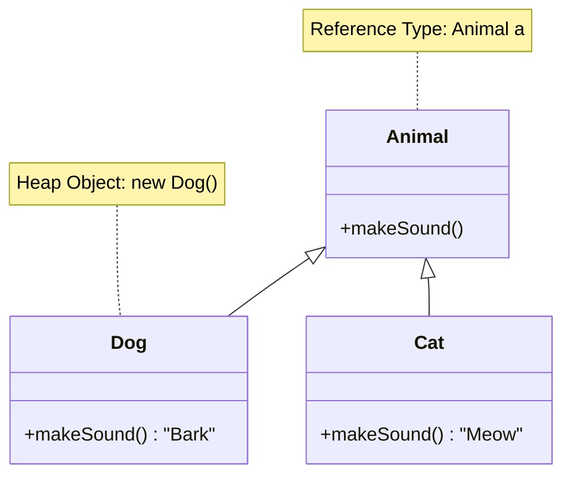

---
tags:
- field/cs
- subject/programming/java
- concept/polymorphism
---

[[T.O.C (Java)|Up to Java]]
#concept

> **Prompt:** "Explain in detail the concept of polymorphism. Use Java written code for examples and mermaid diagrams for explanations"
> **Lens Applied:** The Chief Engineer / The Constructivist

# Technical Breakdown: Polymorphism

## 1. Surgical Definition (Internals)
Polymorphism (Greek: *poly* = many, *morph* = form) is the ability of a single interface to support entities of multiple types.

In the **Java Virtual Machine (JVM)**, this is not magic; it is a mechanism of **Dynamic Dispatch**.
*   **Compiler View (`javac`):** The compiler ensures type safety. If you call `animal.makeSound()`, it checks if the `Animal` reference *has* a `makeSound` method defined. It emits the bytecode instruction `invokevirtual`.
*   **Runtime View (JVM):** At runtime, the JVM does NOT look at the *Reference Type* (Left side). It looks at the *Actual Object* (Right side) in the Heap. It follows the object header to its **Method Table (vtable)** to find the correct function address.

**The C++ Anchor:**
In C++, you must explicitly mark methods as `virtual` to get this behavior. In Java, all non-static, non-final methods are `virtual` by default. Java trades a tiny bit of performance (vtable lookups) for architectural flexibility.

## 2. The Laboratory (Proof of Concept)

### Visual Trace (Mermaid)


### Experiment Code
```java
class Animal {
    void makeSound() { System.out.println("Generic Animal Sound"); }
}

class Dog extends Animal {
    @Override
    void makeSound() { System.out.println("Bark! (Dog vtable hit)"); }
}

class Cat extends Animal {
    @Override
    void makeSound() { System.out.println("Meow! (Cat vtable hit)"); }
}

public class Laboratory {
    public static void main(String[] args) {
        // 1. Stack Allocation (Reference) -> Heap Allocation (Object)
        Animal a1 = new Dog(); 
        Animal a2 = new Cat();
        
        // 2. Dynamic Dispatch Trigger
        // The Compiler sees 'Animal', but the JVM sees 'Dog' and 'Cat'
        a1.makeSound(); // Output: Bark! (Dog vtable hit)
        a2.makeSound(); // Output: Meow! (Cat vtable hit)
        
        // 3. System Context proof
        System.out.println("a1 class: " + a1.getClass().getName()); // Returns 'Dog'
    }
}
```

## 3. Memory & System Context
*   **Stack:** Holds the reference variable `a1` (Type: `Animal`). This is just a pointer (4 or 8 bytes).
*   **Heap:** Holds the actual `Dog` object. The first header word of this object points to the `Dog` Class Class in the **Metaspace**.
*   **vtable (Virtual Method Table):** The `Dog` class has a table of function pointers. The entry for `makeSound()` points to `Dog::makeSound`.
*   **Cost:** Minimal. One pointer dereference + offset addition.

---

> **Prompt:** "Write detailed explanation of types of polymorphism... with mermaid diagrams... and comparison table"
> **Lens Applied:** The Optimizationist / The Architect

# Analysis: Types of Polymorphism

## 1. Executive Summary
Java supports two distinct mechanisms under the "Polymorphism" umbrella:
1.  **Static Polymorphism (Compile-time):** Method Overloading. The compiler decides which method to call based on argument types. Fast, determined early.
2.  **Dynamic Polymorphism (Runtime):** Method Overriding. The JVM decides which method to call based on the actual object type. Flexible, determined late.

## 2. Direct Comparison Matrix

| Feature | Static Polymorphism (Overloading) | Dynamic Polymorphism (Overriding) |
| :--- | :--- | :--- |
| **Mechanism** | **Early Binding** (Static Binding) | **Late Binding** (Dynamic Binding) |
| **Decision Maker** | Compiler (`javac`) | Runtime (`JVM`) |
| **Identity** | Same method name, **different signature** (args) | Same method name, **same signature** |
| **Scope** | Within the **same class** | Across **Parent/Child classes** (Inheritance) |
| **Performance** | Zero runtime overhead (Direct address call) | Slight overhead (vtable lookup) |
| **Keywords** | (None specific) | `@Override` |

## 3. Structural Divergence (The "Why")

### Static (Overloading) Diagram
The compiler resolves the ambiguity immediately.
```mermaid
graph LR
    Call[Call: print(5)] -->|Int Arg| MethodA[print(int i)]
    Call2[Call: print("Hello")] -->|String Arg| MethodB[print(String s)]
    
    style Call fill:#f9f,stroke:#333
    style MethodA fill:#ccf,stroke:#333
    style MethodB fill:#ccf,stroke:#333
```

### Dynamic (Overriding) Diagram
The resolution is deferred until the code actually runs.
```mermaid
graph TD
    Ref[Reference: Animal a] -->|Points to| HeapObj{Heap Object?}
    HeapObj -->|Is Dog| DogMethod[Dog.move()]
    HeapObj -->|Is Cat| CatMethod[Cat.move()]
    
    style Ref fill:#f9f,stroke:#333
    style HeapObj fill:#ff9,stroke:#333
```

---

> **Prompt:** "Explain method overloading and method overriding in detail with java code examples"
> **Lens Applied:** The Rosetta Stone

## 4. Code Contrast: The Implementation

### A. Method Overloading (Static)
Used to provide cleaner APIs. You don't want `printInt()`, `printString()`, `printBoolean()`. You just want `print()`.

```java
class Printer {
    // Signature: print(String)
    void print(String data) {
        System.out.println("Printing String: " + data);
    }
    
    // Signature: print(int) - DISTINCT signature
    void print(int data) {
        System.out.println("Printing Int: " + data);
    }
    
    // Signature: print(String, int) - DISTINCT signature
    void print(String data, int times) {
        for(int i=0; i<times; i++) System.out.println(data);
    }
}
```

### B. Method Overriding (Dynamic)
Used to enforce a contract (`Animal`) while allowing specialized behavior (`Dog`).

```java
class Bank {
    // The Contract
    int getInterestRate() { return 0; }
}

class Chase extends Bank {
    // The Specialization
    @Override
    int getInterestRate() { return 8; }
}

class BOA extends Bank {
    // The Specialization
    @Override
    int getInterestRate() { return 9; }
}

public class FinanceSystem {
    public static void main(String[] args) {
        Bank b; // Reference
        
        b = new Chase(); 
        System.out.println(b.getInterestRate()); // 8 (Runtime decision)
        
        b = new BOA();
        System.out.println(b.getInterestRate()); // 9 (Runtime decision)
    }
}
```

## 5. Best Practices & Anti-Patterns
*   **Always use `@Override`:** It forces the compiler to check if you *actually* overrode something. If you made a typo (e.g., `makeSound` vs `makesound`), the compiler will error out with the annotation, saving you hours of debugging.
*   **Liskov Substitution Principle:** An overridden method should not break the expectations set by the parent method. If `Animal.move()` implies walking, `Dog.move()` shouldn't throw an exception.
