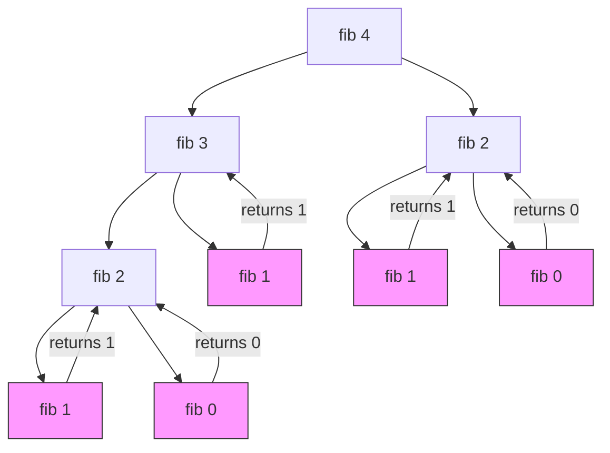

# Recursion

[[20_CS_Core/Theory/Algorithms/T.O.C (Algorithms)|Up to Algorithms]]

## Definition
Recursion is a programming technique where a function calls itself in order to solve a problem. The problem is broken down into smaller, self-similar sub-problems. 

A recursive function typically consists of two parts:
1.  **Base Case:** The condition that stops the recursion (prevents infinite loops).
2.  **Recursive Step:** The part where the function calls itself with modified arguments, moving closer to the base case.

## Code Example
```python
def fibonacci(n):
    if n <= 1:
        return n  # Base Case
    else:
        return fibonacci(n-1) + fibonacci(n-2) # Recursive Step
```

## Gemini

### Understanding Recursion with a Dry Run

Let's trace the execution of `fibonacci(4)`.
The goal is to calculate the 4th number in the Fibonacci sequence (0, 1, 1, 2, 3...).

**Logic:** `fib(n) = fib(n-1) + fib(n-2)`

**Step-by-Step Dry Run:**

1.  **Call `fib(4)`:**
    *   Not a base case.
    *   Need `fib(3)` and `fib(2)`.
    *   *State:* Waiting on results.

2.  **Call `fib(3)`** (Left branch of `fib(4)`):
    *   Not a base case.
    *   Need `fib(2)` and `fib(1)`.

3.  **Call `fib(2)`** (Left branch of `fib(3)`):
    *   Not a base case.
    *   Need `fib(1)` and `fib(0)`.

4.  **Call `fib(1)`** (Left branch of `fib(2)`):
    *   **Base Case Reached!** Return `1`.

5.  **Call `fib(0)`** (Right branch of `fib(2)`):
    *   **Base Case Reached!** Return `0`.

6.  **Resolve `fib(2)`:**
    *   Returns `fib(1) + fib(0)` => `1 + 0` = **1**.

7.  **Call `fib(1)`** (Right branch of `fib(3)`):
    *   **Base Case Reached!** Return `1`.

8.  **Resolve `fib(3)`:**
    *   Returns `fib(2) + fib(1)` => `1 + 1` = **2**.

9.  **Call `fib(2)`** (Right branch of `fib(4)`):
    *   *Repeats step 3-6 logic completely.*
    *   Calculates `fib(1) + fib(0)` => `1`.
    *   Returns **1**.

10. **Resolve `fib(4)`:**
    *   Returns `fib(3) + fib(2)` => `2 + 1` = **3**.

**Final Result:** 3

### Visual Tree Diagram

This diagram visualizes the call stack. Notice how the function branches out.



*Note: The pink nodes represent the Base Cases.*

## Connections
- [[Data Structures]] (Stacks are used for recursion)
- [[Time Complexity]] (Exponential O(2^n) for this naive approach)
