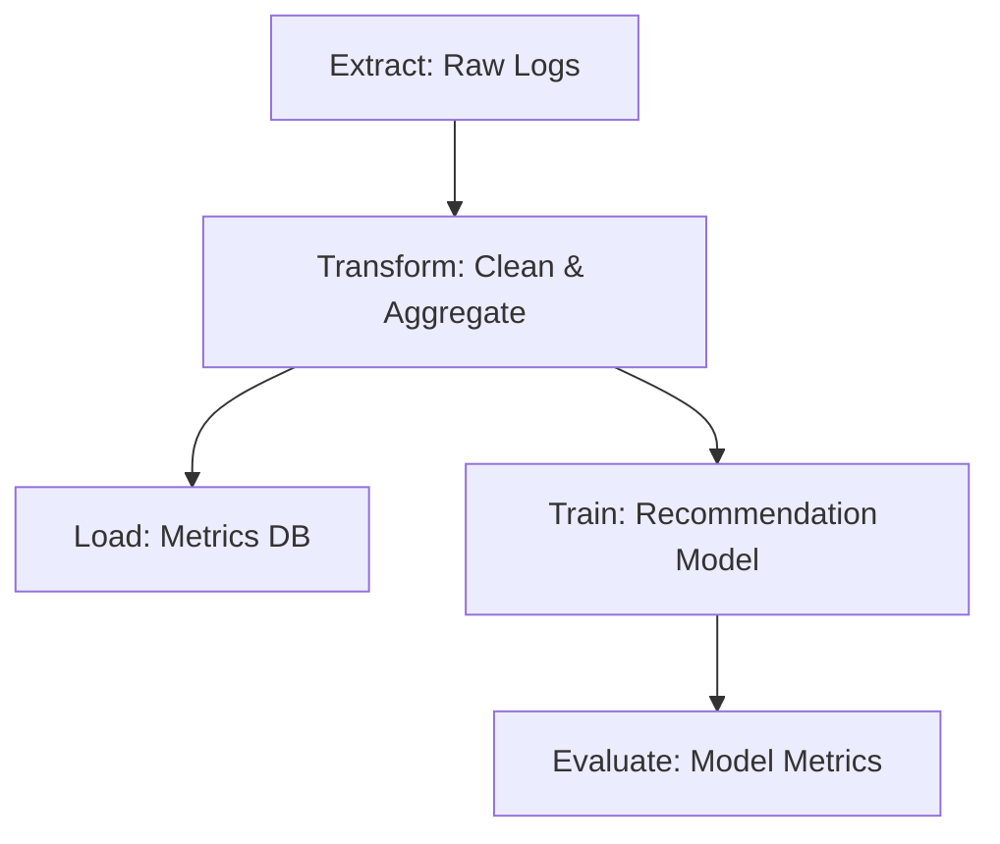

---
tags:
  - field/cs
  - subject/data-engineering
  - concept/data-pipeline
---

[[T.O.C (Theory).md|Up to Theory]]

# Data Intelligence Pipeline: From Raw Extraction to Analytics and Science

> **Seed:** "Data Intelligence Pipeline: From Raw Extraction to Analytics and Science"

The Data Intelligence Pipeline transforms raw data into actionable insights through a structured journey from extraction to analytics and science. Each sub-section dissects a critical stage in this pipeline, detailing the mechanical constraints, architectural trade-offs, and failure modes that define its reliability and scalability.

## Overview of the Data Intelligence Pipeline

> **Seed:** "Data Intelligence Pipeline: From Raw Extraction to Analytics and Science > Overview of the Data Intelligence Pipeline"

This section dissects the end-to-end mechanics of a data intelligence pipeline, detailing how raw inputs are systematically refined into actionable outputs through modular stages, selective workflow branching, and resilient orchestration. It examines the architectural choices, trade-offs, and failure modes that govern scalability, security, and observability across analytics and science workloads.

### Pipeline Architecture: High-Level Design and Stages

> **Seed:** "Data Intelligence Pipeline: From Raw Extraction to Analytics and Science > Overview of the Data Intelligence Pipeline > Pipeline Architecture: High-Level Design and Stages"

**Pipeline Architecture: High-Level Design and Stages**

The data intelligence pipeline is a linear, staged system where raw data is transformed into actionable insights through a series of specialized stages. Each stage consumes, processes, and emits data in a standardized format, enabling modularity and fault isolation. The pipeline is not a monolithic process but a sequence of discrete steps, each with a single responsibility, orchestrated to ensure reproducibility and scalability. The stages are ingestion, validation, transformation, storage, analytics, and science, with orchestration tools managing dependencies and failure recovery.

**Ingestion: The Front Door**
The ingestion stage collects raw data from heterogeneous sources—databases, APIs, logs, IoT devices, or user uploads—and routes it into the pipeline. Data arrives in its native format (e.g., JSON, CSV, Avro, or binary blobs) and is immediately assigned a unique identifier and metadata tags (e.g., source, timestamp, schema version). The ingestion layer must handle backpressure and schema drift: if a source emits a malformed record, the pipeline either rejects it with an error log or routes it to a quarantine zone for later inspection. Tools like Apache Kafka or AWS Kinesis act as the buffering backbone, decoupling producers from downstream stages. The ingestion stage’s output is a stream of immutable, timestamped records, each tagged for traceability.

**Validation: The Gatekeeper**
Raw data is unreliable by default. The validation stage enforces structural and semantic rules before processing. Structural validation checks for schema compliance (e.g., required fields, data types) using schemas defined in tools like Apache Avro or JSON Schema. Semantic validation ensures business logic (e.g., "user_id must exist in the user database"). Failed records are logged with diagnostic metadata (e.g., "field 'email' violates regex pattern") and either discarded or sent to a dead-letter queue for reprocessing. Validation is not a filter but a quality gate: it guarantees that only data meeting strict criteria proceeds, reducing downstream corruption. The output is a cleansed stream of records, each with a validation status and error context if applicable.

**Transformation: The Refiner**
Transformation converts raw data into structured, queryable formats. This stage applies business logic—aggregations, joins, enrichment (e.g., geocoding IP addresses), or feature engineering for machine learning. Transformations are idempotent and deterministic: running the same input twice yields identical outputs. Tools like Apache Spark or dbt (data build tool) handle batch and streaming transformations, respectively. The transformation stage emits two types of outputs: (1) refined datasets for analytics (e.g., user activity tables) and (2) feature stores for science (e.g., precomputed ML features). The transformation layer must handle late-arriving data via watermarking and windowing techniques to ensure correctness in streaming scenarios.

**Storage: The Foundation**
Storage persists data across stages, optimizing for access patterns. The pipeline uses a tiered storage strategy:
- **Hot storage** (e.g., PostgreSQL, Redis) for frequently accessed, low-latency data (e.g., real-time dashboards).
- **Warm storage** (e.g., Parquet files in S3) for analytics-ready data, partitioned by time or entity.
- **Cold storage** (e.g., data lakes in Iceberg/Delta Lake) for raw archives and compliance.
Storage engines are chosen based on query patterns: columnar formats (Parquet) for analytical workloads, row-based (PostgreSQL) for transactional needs. The storage layer also includes a metadata registry (e.g., Apache Atlas) to track lineage, schema evolution, and access controls. Data transitions between tiers via lifecycle policies (e.g., "move to cold storage after 90 days").

**Analytics: The Insight Engine**
Analytics consumes refined datasets to generate metrics, reports, and visualizations. This stage runs SQL queries, OLAP cubes, or ad-hoc analyses on the storage layer. Tools like Apache Druid, ClickHouse, or BigQuery power sub-second queries on terabyte-scale datasets. The analytics stage is stateless: it reads from storage and writes results to a dedicated output (e.g., a dashboard database or BI tool). Critical optimizations include materialized views, query caching, and partitioning strategies (e.g., time-based sharding). The output is structured insights (e.g., "daily active users by region") ready for consumption by business stakeholders.

**Science: The Predictive Layer**
Science applies machine learning to transform analytics into predictions. This stage consumes feature stores and raw data to train, evaluate, and serve models. Workflows include:
- **Batch training** (e.g., Spark MLlib) for large datasets.
- **Real-time inference** (e.g., TensorFlow Serving) for low-latency predictions.
- **Model monitoring** (e.g., Evidently AI) to detect drift and retrain automatically.
The science stage outputs two artifacts: (1) model weights and (2) prediction logs (e.g., "user X is 87% likely to churn"). These artifacts are versioned and stored in a model registry (e.g., MLflow) for reproducibility. Science is not a standalone step but a feedback loop: predictions may trigger downstream actions (e.g., sending a retention email) or feed back into the pipeline as new features.

**Orchestration: The Conductor**
Orchestration tools (e.g., Apache Airflow, Prefect, Dagster) manage the pipeline’s execution, dependencies, and retries. They define Directed Acyclic Graphs (DAGs) where nodes are pipeline stages and edges are data flows. Orchestrators handle:
- **Scheduling** (e.g., "run daily at 2 AM").
- **Dependency resolution** (e.g., "wait for validation to complete before transformation").
- **Failure recovery** (e.g., "retry transformation if it fails, but skip if validation fails").
- **Resource allocation** (e.g., "scale Spark cluster for heavy transformations").
Orchestrators also log metadata (e.g., runtime, data volume) for observability. The pipeline’s design ensures that each stage can be scaled independently: ingestion can expand Kafka partitions, transformation can add Spark executors, and storage can repartition data lakes.

**Conceptual Pipeline Flow**
```
[Sources] → [Ingestion (Kafka)] → [Validation (Great Expectations)]
    → [Transformation (Spark/dbt)] → [Storage (PostgreSQL/S3)]
    → [Analytics (Druid/BigQuery)] → [Science (MLflow/TensorFlow)]
    ↑______________________________________________________|
```
Arrows represent data flow; the loop from science back to storage indicates feedback (e.g., predictions enrich user profiles). Each stage is a microservice with a well-defined API (e.g., "submit batch of records," "query dataset X").

**Key Design Decisions**
- **Batch vs. Streaming:** The pipeline supports both, with streaming for real-time needs (e.g., fraud detection) and batch for heavy transformations (e.g., monthly reports). Decision: Unified pipeline with branching logic. Alternative: Separate pipelines. Rationale: Reduces operational overhead and ensures consistency in data lineage.
- **Storage Format:** Decision: Parquet for analytics, PostgreSQL for transactions. Alternative: Single storage engine (e.g., all data in S3). Rationale: Parquet’s columnar efficiency and PostgreSQL’s ACID compliance optimize for their respective workloads.
- **Orchestration Tool:** Decision: Airflow for its maturity and ecosystem. Alternative: Custom Kubernetes operators. Rationale: Airflow’s DAG abstraction and community plugins reduce development time.

**Failure Modes and Scaling**
- **Ingestion Backpressure:** If Kafka partitions fill up, producers are throttled, and lag metrics trigger alerts. Scaling: Add partitions or increase broker capacity.
- **Transformation Failures:** Spark jobs may OOM or time out. Scaling: Dynamic resource allocation (e.g., Kubernetes autoscaling) or breaking jobs into smaller batches.
- **Storage Hotspots:** Uneven query distribution can overload PostgreSQL. Scaling: Read replicas or sharding by tenant.
- **Science Drift:** Model performance degrades over time. Scaling: Automated retraining pipelines and canary deployments for new models.

### Data Flow and Transformation: From Raw to Actionable

> **Seed:** "Data Intelligence Pipeline: From Raw Extraction to Analytics and Science > Overview of the Data Intelligence Pipeline > Data Flow and Transformation: From Raw to Actionable"

**Data Flow and Transformation: From Raw to Actionable**

The pipeline begins with raw data extraction, where unstructured or semi-structured data enters the system from heterogeneous sources such as databases, APIs, logs, or IoT devices. This stage is characterized by high volume and low coherence, requiring a robust ingestion layer to buffer and route data without loss. Tools like Apache Kafka or AWS Kinesis act as the nervous system, decoupling producers from consumers and ensuring fault tolerance through replication and partitioning. Data arrives in its native format—JSON, CSV, Avro, or binary blobs—and is immediately stamped with metadata: source identifier, ingestion timestamp, schema version, and a unique lineage token. This metadata is not ancillary; it is the first layer of traceability, enabling downstream systems to reconstruct the origin and context of any record.

**Cleaning and Normalization**
Raw data is inherently noisy. Duplicate records, malformed fields, and inconsistent encodings (e.g., UTF-8 vs. Latin-1) must be resolved before any analytical value can emerge. The cleaning stage applies deterministic rules (regex, null suppression) and probabilistic techniques (outlier detection via Z-score) to scrub the dataset. Normalization enforces schema rigidity: nested JSON is flattened, timestamps are converted to UTC, and categorical values are mapped to controlled vocabularies. Apache Spark’s DataFrame API is ideal here, as it allows declarative transformations (e.g., `df.dropna()`, `df.withColumn("normalized_field", expr("regexp_replace(raw_field, '[^a-zA-Z0-9]', '')"))`) while preserving lineage through its logical plan. The output is a cleaned dataset with a rigid schema, stored in a columnar format like Parquet for efficient compression and predicate pushdown.

**Enrichment and Contextualization**
Clean data lacks context. Enrichment layers inject external signals to elevate raw records into meaningful entities. For example, a log entry containing an IP address is joined with a geolocation database to append `country`, `city`, and `ASN` fields. Similarly, a user ID in a clickstream event is enriched with demographic data from a CRM system. This stage often relies on streaming joins (e.g., Spark Structured Streaming’s `join` with watermarking) or batch ETL pipelines that precompute lookup tables. The key challenge is latency: enrichment must balance completeness with freshness. Tools like Apache Flink excel here, offering stateful processing with exactly-once semantics to handle late-arriving data without corrupting results.

**Aggregation and Rollup**
Aggregation transforms event-level data into analytical constructs. A stream of individual purchases becomes a daily sales report; a sequence of server metrics becomes a rolling 5-minute average CPU usage. The pipeline applies windowing (tumbling, sliding, session) and grouping operations to reduce cardinality while preserving temporal relationships. For example:
```python
df.groupBy(
    window("event_time", "1 hour"),
    "product_id"
).agg(
    sum("revenue").alias("total_revenue"),
    avg("latency").alias("avg_latency")
)
```
Spark’s `groupBy` + `agg` pattern is efficient for batch aggregation, while Flink’s `KeyedProcessFunction` allows fine-grained control over stateful computations. The output is a denormalized dataset optimized for OLAP queries, typically stored in a data warehouse (e.g., Snowflake) or a time-series database (e.g., TimescaleDB) for specialized access patterns.

**Validation and Governance**
Every transformation introduces the risk of drift. Schema evolution (e.g., a new field in the source) can break downstream pipelines, while incorrect enrichment logic may propagate biases. The validation stage enforces contracts via schema registries (e.g., Confluent Schema Registry) and runtime checks (e.g., Great Expectations assertions). For example:
```python
assert df.filter(col("revenue") < 0).count() == 0, "Negative revenue detected"
```
Lineage tracking is critical here. Tools like Apache Atlas or DataHub ingest metadata from each stage, creating a graph of dependencies that traces a derived metric back to its raw source. This enables impact analysis: if a geolocation database changes, analysts can identify all reports that depend on the `country` field.

**Analytics and Science Readiness**
The final stage prepares data for consumption by analytics and science teams. Structured datasets are partitioned by time or key dimensions (e.g., `year=2023/month=01/day=15`) to optimize query performance. Feature stores (e.g., Feast) materialize reusable transformations (e.g., "user 7-day rolling average spend") to avoid recomputation. For machine learning, the pipeline exports data to feature vectors, ensuring consistency between training and serving environments. The output is a dual-layered dataset: one optimized for SQL-based exploration (e.g., dbt models) and another for vectorized access (e.g., Parquet files with Arrow schemas).

**Failure Modes and Scaling Behavior**
At 10x load, the ingestion layer must scale horizontally without backpressure. Kafka partitions can be increased, but consumer groups must rebalance efficiently. Cleaning stages risk becoming bottlenecks if transformations are not vectorized; Spark’s Catalyst optimizer mitigates this by generating efficient physical plans. Enrichment joins may fail if external dependencies (e.g., a geolocation API) throttle requests; circuit breakers and retry policies with exponential backoff are essential. At 100x load, the aggregation stage must shard by key (e.g., `user_id`) to avoid memory exhaustion. Flink’s state backends (RocksDB) and Spark’s dynamic allocation ensure horizontal scalability, but cost becomes a constraint—partitioning strategies must align with query patterns to minimize compute waste.

```

```

### Branching Strategy: Analytics vs. Science Workflows

> **Seed:** "Branching Strategy: Analytics vs. Science Workflows"

**Branching Strategy: Analytics vs. Science Workflows**

The data intelligence pipeline splits into two primary branches—**Analytics Workflows** and **Science Workflows**—each optimized for distinct operational objectives, tooling, and output modalities. This separation is not arbitrary but derives from fundamental differences in data processing cadence, computational intensity, and the nature of derived artifacts. The branching strategy ensures that each workflow type operates under constraints tailored to its goals while maintaining controlled data flow between branches.

**Analytics Workflows: Real-Time Insight Extraction**
Analytics workflows prioritize **low-latency processing** and **aggregative computation** to produce operational insights such as dashboards, KPIs, and ad-hoc queries. These workflows typically operate on **time-series or event-based data** ingested in near real-time via streaming pipelines (e.g., Kafka, Pulsar). The processing layer leverages **columnar storage engines** (e.g., ClickHouse, Apache Druid) optimized for high-throughput analytical queries with minimal write amplification. SQL-based engines (e.g., Trino, Spark SQL) dominate here due to their declarative interface and compatibility with BI tools (e.g., Tableau, Metabase).

Data partitioning in analytics workflows follows **time-based sharding** (e.g., hourly/daily partitions) to balance query performance and storage overhead. Hot partitions (recent data) are cached in memory or SSD-backed storage, while cold partitions migrate to object storage (e.g., S3, GCS) with lifecycle policies. This tiered storage strategy reduces cost without sacrificing query responsiveness for recent data.

**Science Workflows: Iterative Model Development and Validation**
Science workflows focus on **iterative experimentation**, **feature engineering**, and **model training**, where computational cost and reproducibility are primary concerns. These workflows ingest **raw or lightly processed data** from the analytics branch or upstream sources, often requiring **feature stores** (e.g., Feast, Tecton) to manage reusable feature sets. The processing layer here is **batch-oriented** (e.g., Spark, Dask) or **workflow-driven** (e.g., Airflow, Kubeflow), with heavy reliance on **GPU-accelerated compute** for training deep learning models or running hyperparameter searches.

Data duplication between branches is **selective and controlled**. Raw data flows into the science branch via **immutable snapshots** (e.g., Delta Lake, Iceberg) to preserve reproducibility. Derived features or preprocessed datasets may be **bidirectionally synchronized** with the analytics branch when they become stable (e.g., a validated feature set promoted to production). This avoids the pitfall of analytics consuming unstable science artifacts, which would corrupt operational metrics.

**Output Modalities and Feedback Loops**
Analytics workflows produce **structured outputs** (e.g., aggregated metrics, alerting rules) consumed by dashboards or alerting systems. Science workflows generate **models, embeddings, or feature transformations** that are deployed as **API endpoints** or embedded into production systems. The feedback loop operates in two directions:
1. **Science-to-Analytics**: Deployed models or features are logged and monitored in the analytics branch to track performance degradation or drift.
2. **Analytics-to-Science**: Operational data (e.g., user behavior logs) is fed back into the science branch as training data for iterative improvement.

**Rationale for Separation**
The branching strategy rejects a monolithic pipeline because:
- **Compute Trade-offs**: Analytics queries favor CPU-bound, vectorized operations, while science workflows demand GPU-bound, memory-intensive workloads. Co-locating them would lead to resource contention.
- **Data Freshness Requirements**: Analytics requires sub-second to minute-level freshness, whereas science workflows tolerate hours or days of latency for training cycles.
- **Tooling Ecosystem**: Analytics thrives on SQL and BI integrations, while science requires Python/R ecosystems with specialized libraries (e.g., PyTorch, scikit-learn).

**Failure Modes and Scaling Behavior**
At 10x load:
- **Analytics Branch**: Query latency degrades linearly with data volume unless sharding and caching strategies are scaled proportionally. Horizontal scaling of query engines (e.g., adding Trino workers) mitigates this, but storage costs rise due to increased partition duplication.
- **Science Branch**: Training jobs may fail or stall if GPU resources are exhausted. Priority scheduling (e.g., Kubernetes GPU quotas) and spot instance preemption handling become critical. Data duplication between branches may also strain network bandwidth if not managed via incremental syncs.

At 100x load:
- **Analytics Branch**: Time-based partitioning may become insufficient; **dynamic sharding** (e.g., based on query patterns) or **materialized view precomputation** is required to avoid full table scans.
- **Science Branch**: Feature stores must implement **online-offline consistency** to avoid training-serving skew. Model serving may require **multi-region deployment** to reduce latency for global users.

```

```

### Pipeline Orchestration and Scheduling

> **Seed:** "Pipeline Orchestration and Scheduling"

**Pipeline Orchestration and Scheduling** defines the nervous system of the Data Intelligence Pipeline, translating raw data extraction into reproducible, observable, and fault-tolerant workflows. It governs how tasks are defined, ordered, triggered, and recovered, ensuring that data flows through the system with deterministic correctness and operational resilience. The orchestration layer abstracts the complexity of distributed execution into declarative workflows, while the scheduling layer enforces timing, concurrency, and resource constraints. Together, they form a control plane that enforces sequence, handles failures, and scales execution across compute clusters.

---

**Workflow Definition: Declarative Pipelines as Directed Acyclic Graphs (DAGs)**

Workflows are defined as **Directed Acyclic Graphs (DAGs)**, where nodes represent computational tasks (e.g., extract, transform, load, train) and edges represent data or control dependencies. A DAG guarantees termination and prevents cycles, ensuring that execution always progresses toward completion without infinite loops. Each node encapsulates a unit of work with explicit inputs and outputs, enabling the orchestration engine to compute a topological sort and determine a valid execution order.

For example, consider a pipeline that ingests user activity logs, aggregates them into daily metrics, and trains a recommendation model:



Here, `Extract` must complete before `Transform`, which branches into both `Load` and `Train`. The DAG ensures that `Train` only begins after `Transform` finishes, even though `Load` and `Train` are independent. This structure is declared in code using tools like **Apache Airflow’s Python DSL** or **Kubeflow Pipelines’ YAML**, where dependencies are expressed as function calls or `dependsOn` fields.

---

**Scheduling: Time-Based and Event-Driven Triggers**

Scheduling determines when workflows run. Two primary modes exist:

1. **Time-Based (Batch):** Workflows execute on fixed schedules (e.g., hourly, daily) using cron expressions or fixed intervals. This is typical for ETL pipelines where data arrives in batches. Airflow’s `schedule_interval` parameter or Kubernetes CronJobs enforce these triggers.
2. **Event-Driven (Streaming):** Workflows trigger upon data arrival or external events (e.g., file uploads, API calls, Kafka messages). Tools like **Airflow’s sensors** or **Argo Workflows’ event triggers** poll external systems or listen to message queues to initiate execution.

Schedulers also manage **concurrency limits** to prevent resource exhaustion. For instance, Airflow’s `max_active_runs` restricts the number of concurrent DAG runs, while Kubernetes’ `LimitRange` and `ResourceQuota` cap pod usage per namespace.

---

**Orchestration Engines: Airflow, Kubernetes, and Beyond**

**Apache Airflow** is a dominant orchestration engine that schedules and monitors DAGs using a **scheduler-worker architecture**. The scheduler parses DAGs, enqueues tasks to a message queue (e.g., RabbitMQ, Redis), and workers pull tasks for execution. Airflow’s **metadata database** (PostgreSQL/MySQL) tracks task states (queued, running, failed), retries, and dependencies. Its **operators** (e.g., `PostgresOperator`, `PythonOperator`) abstract task execution, while **sensors** (e.g., `S3KeySensor`) wait for external conditions.

**Kubernetes (K8s)** serves as a lower-level orchestration layer when pipelines require fine-grained container control. Workflows are defined as **Kubernetes Jobs** or **Custom Resource Definitions (CRDs)** like **Argo Workflows**, which extend K8s with DAG-based workflow primitives. K8s handles pod scheduling, scaling, and failure recovery, while Argo adds pipeline-specific features like artifact passing and step-level retries.

**Comparison of Orchestration Tools:**

| Tool          | Strengths                                  | Weaknesses                          | Best For                          |
|---------------|--------------------------------------------|-------------------------------------|-----------------------------------|
| **Airflow**   | Rich DAG semantics, UI, retries, sensors   | Heavyweight, slow scheduler          | Complex ETL, batch pipelines      |
| **Argo**      | Native K8s integration, artifact passing   | Steeper learning curve              | Kubernetes-native ML pipelines    |
| **Kubeflow**  | ML-specific primitives, TF/PyTorch support | Overkill for non-ML pipelines       | End-to-end ML pipelines           |
| **Dagster**   | Software-defined assets, type safety       | Smaller ecosystem                   | Data-aware pipelines              |

---

**Dependency Management and Parallelism**

Dependencies are resolved at runtime by the orchestration engine. For example, in Airflow:
- **Upstream tasks** must succeed before downstream tasks start.
- **XComs (Cross-Communications)** pass small data (e.g., file paths, IDs) between tasks.
- **Templates** (e.g., `{{ ti.xcom_pull(...) }}`) inject dynamic values into task parameters.

Parallelism is controlled via:
- **Task-level parallelism:** Multiple tasks in a DAG run concurrently if they have no dependencies.
- **Worker-level parallelism:** Airflow workers or K8s pods execute tasks in parallel, limited by `concurrency` and `parallelism` settings.
- **Dynamic task generation:** Tools like Airflow’s `expand()` or Argo’s `withParam` create parallel tasks at runtime (e.g., processing 100 files in parallel).

For example, a DAG that processes 100 files can generate 100 parallel `ProcessFile` tasks dynamically, with each task writing its output to a shared location (e.g., S3 prefix).

---
**Failure Handling and Recovery Strategies**

Failures are inevitable. The orchestration layer must detect, isolate, and recover from them without corrupting data or violating dependencies.

1. **Task Retries:** Tasks can be retried on failure with exponential backoff (e.g., Airflow’s `retries=3`, `retry_delay=timedelta(minutes=5)`). This handles transient errors (e.g., network timeouts).
2. **Task Timeouts:** Tasks can be aborted if they exceed a `timeout` (e.g., `execution_timeout=timedelta(hours=1)`), preventing hung processes.
3. **Partial Failures:** If a task fails, downstream tasks depending on its output are skipped, and the DAG run is marked as failed. Airflow’s `trigger_rule` can override this (e.g., `all_done` to run cleanup tasks regardless of success).
4. **Idempotency:** Tasks must be idempotent to safely retry (e.g., a `Load` task should overwrite data with the same result if run twice).
5. **Checkpointing:** For long-running tasks (e.g., model training), intermediate state is saved to durable storage (e.g., S3, database) so progress isn’t lost on failure.
6. **Dead Letter Queues (DLQ):** Failed tasks or DAG runs are routed to a DLQ for analysis. Airflow’s `on_failure_callback` can send alerts or trigger remediation workflows.

**Example Recovery Flow:**
1. A `TrainModel` task fails due to OOM.
2. The scheduler retries after 5 minutes.
3. On second failure, the DAG run is marked as failed, and a `NotifyFailure` task sends an alert to Slack.
4. A separate `RemediatePipeline` DAG is triggered manually to reprovision GPU resources and restart the pipeline from the last checkpoint.

---
**Monitoring and Observability**

Orchestration engines provide visibility into pipeline health:
- **Airflow:** UI shows DAG runs, task durations, and logs. Metrics (e.g., `dag_processing_duration`) are exposed via Prometheus.
- **Kubernetes:** `kubectl get pods` and `kubectl logs` provide pod-level visibility. Tools like **Prometheus + Grafana** monitor resource usage and failures.
- **Custom Observability:** Workflows can emit structured logs (e.g., OpenTelemetry) to trace execution paths and measure latency.

Alerts are configured for:
- Stalled DAG runs (no progress for N hours).
- High task failure rates.
- Resource starvation (e.g., pending pods in K8s).

---
**Scaling to 10x/100x Load**

At higher loads, orchestration systems face bottlenecks:
1. **Scheduler Bottlenecks:** Airflow’s scheduler can become a single point of failure under high DAG concurrency. Solutions:
   - Use **CeleryExecutor** or **KubernetesExecutor** to distribute task execution.
   - Scale the scheduler horizontally (e.g., Airflow 2.0+ supports multiple schedulers in HA mode).
2. **Database Load:** Airflow’s metadata DB (PostgreSQL) can be overwhelmed by frequent task updates. Mitigations:
   - Use a read replica for the UI.
   - Tune `sql_alchemy_pool_size` and enable connection pooling.
3. **Worker Scaling:** For K8s-based orchestration, **Horizontal Pod Autoscaler (HPA)** scales workers based on CPU/memory usage. Airflow’s `KubernetesPodOperator` dynamically provisions pods for each task.
4. **Artifact Storage:** Large intermediate files (e.g., trained models) strain shared storage. Solutions:
   - Use object storage (S3, GCS) with lifecycle policies.
   - Implement **artifact passing** (e.g., Argo’s `artifacts`) to avoid redundant transfers.

**Example Scaling Scenario:**
A pipeline processing 10M events/hour with 100 parallel tasks:
- **Airflow + CeleryExecutor:** 20 workers (4 vCPUs each) handle 20 concurrent tasks. The scheduler queues the rest.
- **K8s + Argo:** A `Job` template with `parallelism=100` creates 100 pods. The autoscaler adds nodes to the cluster if pod CPU > 80%.

---

### Monitoring and Observability: Ensuring Pipeline Health

> **Seed:** "Monitoring and Observability: Ensuring Pipeline Health"

**Monitoring and observability** in a data intelligence pipeline are not optional layers but core operational pillars that convert raw telemetry into actionable insight. The pipeline’s health is determined by its ability to surface deviations in performance, data integrity, and system behavior before they cascade into outages or corrupted analytics. This is achieved through a layered observability stack that collects, processes, stores, and visualizes signals from every stage of the pipeline—from ingestion to transformation to serving.

**Metrics: The Vital Signs of the Pipeline**
Every component in the pipeline emits quantitative signals that reflect its operational state. These metrics fall into three primary categories:

- **Latency metrics** measure end-to-end and stage-specific delays. For ingestion, this includes time from data arrival to persistence in the raw store. For transformation, it tracks the duration from input availability to output production. For serving, it captures query response time and dashboard refresh intervals. These are tracked using percentiles (p50, p95, p99) to distinguish typical behavior from tail latency, which often indicates resource contention or serialization bottlenecks. Prometheus scrapes these metrics at 15-second intervals from instrumented services, storing them in a time-series database optimized for high-cardinality labels (e.g., `pipeline_stage="transformation"`, `data_source="user_events"`).

- **Throughput metrics** quantify the volume of data processed per unit time. Ingestion throughput measures records per second (RPS) and bytes per second (BPS) at the edge. Transformation throughput tracks the rate of successful transformations and failures, including partial failures where some records are dropped due to schema mismatches. Serving throughput measures queries per second (QPS) and concurrent user sessions. These are normalized to moving averages to smooth spikes from batch jobs or traffic surges. Grafana dashboards render throughput trends over time, with alerts triggered when throughput drops below 80% of the 7-day rolling average for more than 5 minutes.

- **Error rates** track the frequency of recoverable and unrecoverable failures. Recoverable errors include transient network timeouts or malformed records that are logged and skipped. Unrecoverable errors include schema violations that halt a transformation job or corrupt downstream tables. Error rates are expressed as a percentage of total operations and are broken down by error type and component. Alerts fire when error rates exceed 1% for 3 consecutive minutes, with severity escalating based on error type (e.g., schema errors trigger P1 pages; transient errors trigger P2 tickets).

**Logging: The Chronological Record of Events**
Logs provide the forensic trail needed to reconstruct pipeline behavior during incidents. Each service writes structured logs in JSON format, including a `trace_id` that propagates across service boundaries, enabling end-to-end tracing. Logs are shipped via Fluent Bit to an Elasticsearch cluster, where they are indexed by `timestamp`, `service_name`, and `trace_id`. Log retention is tiered: hot logs (last 7 days) are stored in SSD-backed indices for fast search; cold logs (30 days) are moved to S3-backed indices for cost efficiency. Log queries use Kibana dashboards to filter by error level, component, or trace_id, enabling rapid root-cause analysis during outages.

**Tracing: The Thread That Connects the Pipeline**
Distributed tracing instruments every request as it flows through the pipeline, recording the latency and status of each hop. OpenTelemetry agents inject trace headers into HTTP/gRPC requests and emit spans at each transformation stage. These spans are collected by a tracing backend (Jaeger) and visualized as a directed acyclic graph where nodes represent services and edges represent data flow. Tracing reveals hidden latency in serialization, network hops, or external dependencies (e.g., a slow external API call in a feature transformation). Alerts trigger when a trace’s total latency exceeds 5 seconds or when any single span exceeds 2 seconds, indicating a bottleneck.

**Alerting: The Early Warning System**
Alerts are not alarms but carefully designed thresholds that balance sensitivity and noise. They are triggered by Prometheus alert rules that evaluate metric conditions over sliding windows. For example, a P1 alert fires when the 99th-percentile latency for ingestion exceeds 2 seconds for 2 minutes, indicating a potential data loss scenario. P2 alerts fire when error rates exceed 0.5% for 10 minutes, suggesting a degradation in data quality. Alerts are routed to Slack channels and PagerDuty, with escalation policies based on time-of-day and incident severity. Each alert includes a runbook link that outlines diagnostic steps and remediation commands, reducing mean time to recovery (MTTR).

**Data Quality Metrics: The Guardrails of Integrity**
Data quality is monitored using metrics that reflect completeness, accuracy, and freshness. Completeness is measured as the percentage of expected records that arrive within a time window (e.g., 99.9% of user events must arrive within 5 minutes of generation). Accuracy is tracked using checksums and schema validation; any mismatch triggers an alert and quarantines the affected data batch. Freshness is measured as the time between data generation and availability in the serving layer, with alerts firing when freshness exceeds 15 minutes. These metrics are integrated into the monitoring framework via a dedicated data quality service that emits Prometheus metrics and writes validation results to a dedicated Elasticsearch index. Grafana dashboards visualize data quality trends, enabling data engineers to proactively address drift before it impacts analytics.

**Failure Modes and Scaling Behavior**
At 10x load, the primary failure modes shift from transient errors to systemic bottlenecks. Ingestion services may hit connection pool limits, transformation jobs may exhaust memory due to larger batch sizes, and serving layers may experience query timeouts under increased concurrency. To mitigate this, the pipeline scales horizontally: ingestion services shard by data source, transformation jobs are dynamically allocated to Kubernetes pods with auto-scaling, and serving layers use read replicas to distribute query load. Observability tools are scaled accordingly: Prometheus clusters are federated to handle higher cardinality, Elasticsearch indices are sharded to maintain search performance, and Jaeger collectors are scaled to process increased trace volume. At 100x load, the pipeline’s health depends on its ability to shed non-critical work: low-priority transformations are paused, data quality checks are deprioritized, and alerts are throttled to avoid alert fatigue. The observability stack must remain operational even under load, with monitoring services themselves monitored for health and capacity.

### Security and Governance: Protecting Data and Ensuring Compliance

> **Seed:** "Security and Governance: Protecting Data and Ensuring Compliance"

**Security and Governance Framework in the Data Intelligence Pipeline**

The security and governance framework operates as a multi-layered control plane over the entire data intelligence pipeline, enforcing confidentiality, integrity, and availability (CIA) while ensuring regulatory compliance. This framework is not a static policy document but a dynamic system of technical controls, procedural safeguards, and audit mechanisms that interact at every stage: data ingestion, storage, processing, analytics, and output. The architecture enforces security through **defense-in-depth**, where multiple independent controls mitigate the same risk class, and governance through **policy-as-code**, where rules are executable artifacts rather than human-readable guidelines.

At the core, the framework is built on three interlocking systems:

1. **Identity and Access Management (IAM)**: The gatekeeping layer that authenticates every principal (user, service, or system) and authorizes actions based on least-privilege principles. IAM systems use role-based access control (RBAC) and attribute-based access control (ABAC) to map identities to permissions. For example, a data scientist querying a customer dataset may be granted `SELECT` on `customers` but denied `UPDATE` or `DELETE`, and only during business hours. IAM integrates with identity providers (e.g., OAuth 2.0, SAML) and enforces multi-factor authentication (MFA) for human access. Internally, IAM maintains a **policy decision point (PDP)** that evaluates access requests against a centralized policy store (e.g., AWS IAM, HashiCorp Vault, or Open Policy Agent), returning `Permit`, `Deny`, or `NotApplicable`. This system logs every decision as an audit event, creating an immutable record for compliance.

2. **Encryption Fabric**: Data is encrypted at rest and in transit using a hybrid key management strategy. At rest, data is encrypted using envelope encryption: a data encryption key (DEK) encrypts the data, and the DEK is encrypted by a key encryption key (KEK) stored in a hardware security module (HSM) or cloud KMS (e.g., AWS KMS, Google Cloud KMS). In transit, TLS 1.3 is enforced with cipher suites that support forward secrecy (e.g., `TLS_AES_256_GCM_SHA384`). The encryption fabric includes **key rotation policies** (e.g., DEK rotation every 90 days, KEK rotation every 365 days) and **key versioning**, where old keys are retained for decryption of historical data but cannot be used for new encryption. This ensures backward compatibility while minimizing exposure from key compromise.

3. **Data Masking and Tokenization**: To protect sensitive fields (e.g., PII, financial data), the pipeline applies **dynamic data masking** at query time and **tokenization** for storage. Masking replaces sensitive data with redacted values (e.g., `****-****-1234` for credit card numbers) based on user role and context. Tokenization replaces sensitive data with non-sensitive tokens (e.g., a UUID) stored in a secure token vault, while the original data is stored in a separate, highly restricted system. For example, a customer service representative querying a database sees only tokenized values, while the analytics team sees masked data. This separation reduces the attack surface for insider threats and limits exposure in case of a breach.

**Governance Policies: Enforcement and Auditing**

Governance policies are enforced through **policy engines** that interpret rules as executable logic. These engines operate at three levels:

- **Schema-level policies**: Enforced during data ingestion. For example, a GDPR policy may reject records missing a `consent_timestamp` field or flag records where `data_subject_age < 16` for special handling.
- **Workflow-level policies**: Enforced during pipeline execution. For example, a retention policy may trigger automatic deletion of data older than 7 years, or a lineage policy may require tagging each dataset with its source, transformation steps, and downstream consumers.
- **Access-level policies**: Enforced at query time. For example, a CCPA policy may restrict access to California residents' data to employees located in California during business hours.

Auditing is continuous and automated. Every action—data access, modification, deletion, or transformation—is logged in an immutable audit trail (e.g., AWS CloudTrail, Google Cloud Audit Logs). Logs include the principal, action, resource, timestamp, and policy decision. The audit system uses **blockchain-inspired hashing** (e.g., Merkle trees) to ensure log integrity: any tampering with logs breaks the hash chain, triggering an alert. Compliance reports are generated by querying this trail with tools like AWS Config or open-source systems like OpenMetadata, which map logs to specific regulatory controls (e.g., GDPR Article 32, CCPA §1798.150).

**Balancing Security and Usability**

The central tension in the pipeline is between **security rigor** and **usability**. Overly restrictive policies degrade usability: analysts cannot access data quickly, pipelines stall due to policy violations, and developers spend excessive time debugging access issues. Conversely, lax policies increase risk: sensitive data leaks, compliance violations occur, and audit trails become unmanageable.

To resolve this, the framework uses **adaptive policies** and **user-centric design**:

- **Adaptive policies** adjust based on context. For example, a policy may allow broader access during an incident response but revert to strict controls afterward. Policies may also grant temporary elevated access (e.g., 1-hour "break-glass" access) for emergency scenarios, with automatic revocation and mandatory justification.
- **User-centric design** embeds security into workflows. For example, data scientists use tools with built-in policy checks (e.g., Apache Atlas, Collibra) that surface access requirements and masking rules at design time, not at query time. Dashboards display real-time policy compliance scores, enabling users to self-correct before submitting jobs.
- **Performance-aware encryption**: To avoid bottlenecks, encryption is offloaded to hardware accelerators (e.g., AWS Nitro Enclaves, Intel SGX) or optimized libraries (e.g., OpenSSL with AES-NI). Data is encrypted in transit using TLS 1.3 with 0-RTT resumption for low-latency access, and at rest using AES-256-GCM with hardware-backed keys.

**Failure Modes and Edge Cases**

The framework must handle several failure modes:

- **Key compromise**: If a KEK is compromised, the system triggers an automatic key rotation and re-encrypts all data encrypted with the compromised key. The audit trail logs the incident, and affected data is flagged for review.
- **Policy misconfiguration**: Misconfigured policies (e.g., overly permissive roles) are detected via **policy simulation tools** (e.g., Open Policy Agent's `opa test`) that replay historical access patterns against new policy versions. Any regression triggers an alert.
- **Insider threats**: To mitigate, the framework enforces **separation of duties**: no single user can both access data and modify audit logs. Sensitive operations (e.g., data deletion) require dual approval from two distinct roles.
- **Regulatory drift**: As regulations evolve (e.g., new GDPR clauses), the policy engine supports **hot-reloading** of policies without pipeline downtime. New rules are tested in a staging environment using synthetic data that mimics production distributions.

**Data Lineage and Retention**

Data lineage is tracked using **provenance graphs** where each node represents a dataset, process, or user action, and edges represent data flow. Lineage is captured automatically via:
- **Pipeline instrumentation**: Each transformation step (e.g., Spark job, dbt model) emits lineage metadata (inputs, outputs, schema changes) to a centralized catalog (e.g., Apache Atlas, DataHub).
- **Query parsing**: SQL queries are parsed to extract table-level lineage (e.g., using tools like Sqoop or custom parsers).
- **Manual annotations**: Business users can add semantic tags (e.g., "customer PII," "marketing data") to datasets, which are stored as metadata in the catalog.

Retention policies are enforced via **time-based triggers** and **event-based triggers**. For example:
- A GDPR retention policy may delete customer data 30 days after account closure.
- A financial regulation may require retaining transaction logs for 7 years from the transaction date.
The system uses a **policy executor** (e.g., Apache Airflow with custom operators) to run retention jobs. Before deletion, data is archived to cold storage (e.g., AWS S3 Glacier) with encryption and integrity checks (e.g., SHA-256 hashes). Deletion is soft by default: data is marked for deletion but retained in a "quarantine" zone for 30 days, allowing for rollback in case of error.

### Scalability and Performance: Handling Growth and Demand

> **Seed:** "Scalability and Performance: Handling Growth and Demand"

**Scalability and Performance: Handling Growth and Demand**

The Data Intelligence Pipeline scales by decoupling ingestion, processing, and storage into specialized layers, each optimized for its workload. The pipeline ingests raw data via Kafka, which partitions topics by key (e.g., user_id, device_id) to distribute load evenly across brokers. Each partition is replicated for fault tolerance, ensuring no single broker becomes a bottleneck. The replication factor (default 3) and partition count (scaled to throughput) are tuned to balance latency and throughput: higher partition counts increase parallelism but raise ZooKeeper overhead, while lower counts risk underutilization.

**Horizontal vs. Vertical Scaling**
Horizontal scaling is the primary lever for growth. Kafka brokers and Spark workers are added dynamically to the cluster, with the partition count adjusted to match the new capacity. Vertical scaling (e.g., larger EC2 instances) is reserved for stateful services like databases, where CPU-bound operations (e.g., Spark’s shuffle phase) benefit from higher single-node performance. The pipeline avoids vertical scaling for stateless components (e.g., API gateways, Flink jobs) because horizontal scaling provides linear cost-performance scaling and simplifies failover.

**Partitioning and Sharding Strategies**
Data is partitioned at ingestion using consistent hashing for keys like user_id, ensuring even distribution and minimizing hotspots. For time-series data (e.g., metrics), partitioning by time windows (e.g., hourly) enables efficient pruning during queries. Sharding is applied at the storage layer: Cassandra tables are sharded by the same keys as Kafka partitions, while BigQuery uses automatic sharding based on columnar storage. The shard key design avoids skew by ensuring no single shard receives disproportionate traffic. For example, a shard key like `user_id % 1024` distributes load uniformly, whereas a naive `user_id` key could centralize traffic for high-frequency users.

**Batch vs. Real-Time Processing Trade-offs**
Batch processing (e.g., Spark on EMR) handles large-scale transformations (e.g., daily aggregations) with high throughput but introduces latency (minutes to hours). The pipeline optimizes batch jobs by:
- **Dynamic resource allocation**: Spark’s `spark.dynamicAllocation.enabled` scales executors based on workload, reducing idle cluster time.
- **Data locality**: HDFS blocks are co-located with Spark executors to minimize network transfer.
- **Incremental processing**: Delta Lake’s merge operations update only changed partitions, reducing reprocessing overhead.

Real-time processing (e.g., Flink on Kubernetes) handles sub-second analytics (e.g., fraud detection) with low latency but lower throughput per node. The pipeline balances both by:
- **Lambda architecture**: Batch layer (Spark) corrects real-time layer (Flink) inaccuracies via periodic recomputation.
- **Micro-batching**: Flink’s `setBufferTimeout` groups records into batches (e.g., 100ms windows) to amortize per-record overhead.
- **State management**: Flink’s RocksDB state backend scales stateful operations by spilling to disk, avoiding memory pressure.

**Tooling for Scale**
- **Kafka**: Handles 100K+ messages/sec per cluster. Throughput scales linearly with partition count, but consumer lag must be monitored to avoid backpressure.
- **Spark**: Processes terabytes per job. The pipeline uses `spark.sql.shuffle.partitions` to control parallelism (default 200, tuned to cluster cores).
- **Flink**: Stateful computations (e.g., sessionization) use managed memory (`taskmanager.memory.managed.fraction`) to avoid GC pauses.
- **Cloud services**: AWS Lambda scales to 1K concurrent executions per region, but cold starts (100ms–2s) are mitigated by provisioned concurrency. BigQuery’s slot-based pricing scales compute independently of storage, enabling cost-efficient analytics.

**Failure Modes and Scaling Limits**
At 10x load, the pipeline’s bottlenecks shift:
- **Kafka**: Producer throughput plateaus if `acks=all` is enforced, as leaders must replicate to all in-sync replicas (ISR). Solution: Increase `num.replica.fetchers` to parallelize replication.
- **Spark**: Shuffle spill to disk degrades performance. Solution: Increase `spark.executor.memoryOverhead` or reduce `spark.sql.adaptive.enabled` to avoid skew.
- **Flink**: Checkpointing latency grows with state size. Solution: Tune `state.backend.incremental` (RocksDB) and align checkpoint intervals with SLA (e.g., 10s for 99th percentile latency).

At 100x load, the pipeline’s architecture must evolve:
- **Multi-cluster Kafka**: Deploy regional clusters with mirroring (MirrorMaker 2.0) to distribute global traffic.
- **Spark on Kubernetes**: Replace EMR with K8s operators to scale executors to 10K+ nodes, using spot instances for cost efficiency.
- **Flink’s savepoints**: Enable blue-green deployments to avoid downtime during upgrades.

**Optimizations for Mixed Workloads**
The pipeline uses:
- **Caching**: Redis clusters cache frequent query results (e.g., user profiles), reducing BigQuery load. Cache invalidation uses Kafka’s changelog to propagate updates.
- **Materialized views**: BigQuery’s BI Engine pre-computes aggregations, serving sub-second responses for dashboards.
- **Query routing**: Spark SQL’s `hive.optimize.skewjoin` and Flink’s `rebalance()` operator redistribute skewed data dynamically.

```

```

## Data Engineering: The Backbone of the Pipeline

> **Seed:** "Data Intelligence Pipeline: From Raw Extraction to Analytics and Science > Data Engineering: The Backbone of the Pipeline"

Data engineering forms the industrial-grade infrastructure that transforms raw data into a reliable, scalable, and governable asset. This section dissects the mechanical architecture of data pipelines—principles, reliability, scalability, efficiency, governance, and DevOps integration—revealing how each layer enforces constraints that turn brittle scripts into resilient systems.

### Core Principles of Data Engineering

> **Seed:** "Core Principles of Data Engineering"

**Data engineering** is the discipline of designing and building systems that collect, store, transform, and deliver data as a reliable, reusable product. Its core principles—idempotency, immutability, and reproducibility—are not abstract ideals but mechanical constraints that govern how data moves from raw extraction to analytics and science. These principles ensure that pipelines behave predictably under load, can be audited without ambiguity, and scale without introducing inconsistency.

**Data as a product**
Raw data is a volatile resource: it arrives in inconsistent formats, contains duplicates, and often lacks context. Data engineering treats this raw material as an unrefined commodity, transforming it into a **data product**—a curated, versioned, and documented asset that downstream consumers (analysts, scientists, or services) can trust. A data product is defined by three properties:
1. **Reliability**: The output matches expectations under repeated delivery.
2. **Reusability**: The structure and semantics are documented so new consumers can integrate it without custom parsing.
3. **Discoverability**: Metadata (schema, lineage, ownership) is machine-readable and queryable.

Analogy: A data product is like a standardized shipping container. Raw data is loose cargo; engineering converts it into a container with a label (schema), tamper-evident seals (checksums), and a bill of lading (lineage). Without this standardization, each downstream team would rebuild the same parsing logic, introducing divergence and errors.

**Idempotency: The guarantee against duplication**
An **idempotent** operation produces the same result whether executed once or many times. In data pipelines, idempotency is critical because pipelines often rerun due to failures, retries, or scheduled reprocessing. Without idempotency, reprocessing the same input could corrupt downstream systems by inserting duplicates or overwriting valid data.

Mechanism:
- **Key-based deduplication**: Use a primary key (e.g., `user_id + event_timestamp`) to ensure each record is inserted exactly once. Example in SQL:
  ```sql
  INSERT INTO user_events (user_id, event, timestamp)
  VALUES (123, 'login', '2023-10-01 12:00:00')
  ON CONFLICT (user_id, timestamp) DO NOTHING;
  ```
- **Checksum validation**: Store a hash of the input data (e.g., SHA-256 of a file) in a metadata table. Before processing, compare the current file’s hash to the stored value. If they match, skip reprocessing.
- **Transactional outbox**: In event-driven systems, write pipeline state changes to an outbox table with a unique `operation_id`. Consumers deduplicate by tracking processed `operation_id`s.

Failure mode: Idempotency breaks when the deduplication key is ambiguous (e.g., using a non-unique timestamp) or when external systems (e.g., APIs) do not guarantee idempotent responses. Mitigation involves enriching keys with additional context (e.g., `user_id + event_type + deduplication_id`).

**Immutability: The audit trail of truth**
Immutable data means that once written, records cannot be updated or deleted. This principle enforces **traceability**: every change is an append-only log of what happened, when, and by whom. Immutability is the backbone of compliance (e.g., GDPR’s "right to be forgotten" is implemented as a tombstone record, not a deletion).

Mechanism:
- **Write-once storage**: Use systems like Apache Iceberg, Delta Lake, or Kafka topics configured with `cleanup.policy=compact` to prevent in-place updates.
- **Time-travel queries**: Immutable tables store snapshots at each write. Example in Delta Lake:
  ```python
  df = spark.read.format("delta").option("versionAsOf", 5).load("/data/events")
  ```
- **Tombstoning**: For "deletions," append a record with a `deleted_at` timestamp and a `null` payload. Queries filter out tombstoned records unless explicitly requested.

Failure mode: Immutability conflicts with operational needs (e.g., GDPR deletions). The solution is to layer **retention policies** and **redaction** on top of immutable storage, treating deletions as metadata updates rather than physical removals.

**Reproducibility: The guarantee of consistency**
A reproducible pipeline produces identical outputs when given identical inputs and execution environment. This principle is essential for debugging, testing, and scaling. Reproducibility requires:
1. **Deterministic transformations**: Avoid non-deterministic operations (e.g., `ORDER BY RAND()`, current timestamps, or external API calls) in transformations.
2. **Environment parity**: Containerize pipelines (e.g., Docker) and pin dependency versions (e.g., `requirements.txt` with exact hashes).
3. **Data versioning**: Treat input data as immutable snapshots. Example: Store raw data in a path like `/data/raw/events/2023/10/01/`, where the path encodes the data’s temporal and logical partition.

Mechanism:
- **Data versioning**: Use tools like DVC (Data Version Control) to track datasets alongside code:
  ```bash
  dvc add data/raw/events.csv
  git commit -m "Add raw events dataset v1.2"
  ```
- **Pipeline orchestration**: Tools like Airflow or Dagster capture the execution context (e.g., task instance UUID, input checksums) in their metadata database. Example Airflow DAG snippet:
  ```python
  with DAG(...) as dag:
      task = PythonOperator(
          task_id="process_events",
          python_callable=process_events,
          op_kwargs={"input_hash": "{{ task_instance.xcom_pull(task_ids='ingest_events') }}"},
      )
  ```

Failure mode: Reproducibility fails when pipelines depend on external state (e.g., a shared database connection) or non-deterministic libraries (e.g., `numpy.random`). Mitigation involves mocking external dependencies in tests and using seed values for random operations.

**Trade-offs and constraints**
These principles are not free. Idempotency requires upfront design (e.g., key selection, checksum storage). Immutability increases storage costs (though compression and compaction mitigate this). Reproducibility demands rigorous testing and environment management. The alternative—ad-hoc pipelines—leads to **data drift** (where outputs change silently due to unversioned inputs) and **technical debt** (where every new consumer rebuilds the same parsing logic).

**Example: A pipeline enforcing all three principles**
Consider a pipeline ingesting user clickstream data:
1. **Immutability**: Raw clicks are written to a Kafka topic with `retention.ms=604800000` (7 days) and no compaction. Each message includes a `message_id` (UUID) and `ingest_timestamp`.
2. **Idempotency**: The processing job uses `message_id` to deduplicate clicks in the `user_clicks` table:
   ```sql
   INSERT INTO user_clicks (message_id, user_id, page, timestamp)
   VALUES ('abc123', 456, '/home', '2023-10-01 12:01:00')
   ON CONFLICT (message_id) DO NOTHING;
   ```
3. **Reproducibility**: The job runs in a Docker container with pinned dependencies (`pyspark==3.3.0`). The input path includes the ingestion date (`/data/raw/clicks/2023/10/01/`), ensuring identical runs for the same date.

If the job fails and restarts, it reprocesses the same raw data but produces the same output. Auditors can trace any record to its raw message via `message_id`, and storage costs are controlled by Kafka’s retention policy.

### Reliability in Data Pipelines

> **Seed:** "Reliability in Data Pipelines"

**Reliability in Data Pipelines** is achieved through layered fault tolerance mechanisms that isolate failures, preserve state, and ensure deterministic reprocessing. The pipeline must treat every component—extractors, transformers, loaders—as a potential failure point and design for recovery without data loss or corruption. This requires combining **stateful recovery primitives** (checkpointing, write-ahead logs), **idempotent operations**, and **exactly-once processing semantics** across distributed systems. The goal is not merely to survive failures but to resume processing from the correct state with no duplicates and no omissions.

---

**Core Failure Modes and Their Isolation**

Data pipelines fail due to transient or permanent faults: network partitions, node crashes, schema drift, or downstream service unavailability. These failures manifest as:
- **Lost messages** when producers or brokers fail before acknowledgment.
- **Duplicate messages** when retries succeed after partial processing.
- **State divergence** when intermediate results are written but not rolled back.
- **Silent corruption** when transformations produce invalid outputs that pass validation.

To isolate these, pipelines use **bounded queues**, **backpressure signals**, and **circuit breakers**. A bounded queue (e.g., Kafka topic with retention limits) prevents unbounded memory growth and forces upstream components to slow down under load. Circuit breakers (e.g., Hystrix-style state machines) trip when downstream services fail repeatedly, halting new requests until health checks pass. This prevents cascading failures by failing fast and avoiding resource exhaustion.

---

**State Recovery: Checkpointing and Write-Ahead Logs (WAL)**

Stateful processing requires **durable state snapshots** and **operation logs** to recover from crashes. Two primitives dominate:
1. **Checkpointing**: Periodic snapshots of operator state (e.g., Spark Streaming’s `mapGroupsWithState` or Flink’s savepoints) that capture the cumulative effect of processed data. These snapshots are written to durable storage (e.g., S3, HDFS) and include metadata like watermarks and offsets.
2. **Write-Ahead Logs (WAL)**: Append-only logs of all incoming records and state mutations. Before processing a record, the system appends it to the WAL. On recovery, the pipeline replays the log from the last checkpoint, reapplying operations idempotently.

For example, Apache Kafka uses a WAL (its commit log) to track consumer offsets. If a Spark Streaming job crashes, it reads the latest checkpoint, then replays the Kafka log from the checkpointed offset. The WAL ensures no data is lost; the checkpoint ensures no data is reprocessed.

---

**Idempotency: The Contract for Safe Reprocessing**

Idempotent operations guarantee that reprocessing a batch yields the same result as processing it once. This is critical for retries and recovery. Idempotency is achieved through:
- **Deterministic transformations**: Hash-based keys (e.g., `user_id + event_timestamp`) ensure the same input always produces the same output.
- **Upsert semantics**: Database writes use `INSERT ... ON CONFLICT` (PostgreSQL) or `MERGE` (SQL Server) to overwrite existing rows without duplication.
- **Exactly-once sinks**: Kafka’s `idempotent producer` assigns a `PID` (producer ID) and sequence numbers to deduplicate messages at the broker level. If a producer retries, the broker rejects duplicates.

Without idempotency, retries corrupt downstream systems. For instance, a financial transaction pipeline must ensure a retry does not double-charge a customer. Idempotency keys (e.g., `transaction_id`) are embedded in messages and enforced by the sink.

---

**Exactly-Once Processing: Kafka and Spark Mechanisms**

Exactly-once semantics require coordination between sources, processors, and sinks. Two systems exemplify this:

**Apache Kafka**:
- **Transactional writes**: Producers use `transactional.id` to group messages into atomic batches. If a batch fails, Kafka aborts it; if it succeeds, all messages are committed. This is implemented via a two-phase commit (2PC) protocol between the producer and brokers.
- **Idempotent producers**: Enable retries without duplicates by tracking sequence numbers per partition.
- **Consumer offsets**: Stored in a `__consumer_offsets` topic, these offsets are updated transactionally with the processed data. If a consumer crashes, it resumes from the last committed offset.

**Apache Spark Structured Streaming**:
- **Micro-batch processing**: Each batch is processed as a transaction. Spark tracks input offsets (from Kafka) and output results (to sinks) in a WAL.
- **Checkpointing**: Saves the entire pipeline state (operators, offsets, watermarks) to durable storage. On recovery, Spark replays the batch using the WAL and checkpoint.
- **Sink integration**: For exactly-once sinks (e.g., Delta Lake), Spark uses transaction logs to ensure atomic writes. For non-transactional sinks (e.g., JDBC), it relies on idempotent upserts.

Spark’s `mapGroupsWithState` API enforces idempotency by requiring users to define `StateSpec` with timeout and update logic. If a batch fails, Spark replays it with the same state, producing identical results.

---
**Failure Handling Patterns in Practice**

| Failure Type               | Detection Mechanism          | Recovery Strategy                          | Example Tooling               |
|----------------------------|------------------------------|--------------------------------------------|-------------------------------|
| Producer crash             | Broker acknowledgment timeout | Retry with exponential backoff             | Kafka Producer API            |
| Downstream service failure  | Circuit breaker trips        | Fail fast; halt processing                 | Hystrix, Resilience4j         |
| Node crash in cluster      | Heartbeat timeout            | Restart from last checkpoint               | Spark Standalone, Kubernetes  |
| Schema drift               | Schema registry validation   | Reject invalid records; alert operators    | Confluent Schema Registry     |
| Duplicate messages         | Idempotent producer/key      | Deduplicate at sink                        | Kafka idempotent producer     |
| Silent data corruption      | Checksum validation          | Reprocess batch from WAL                   | Spark `mapPartitions` checks |

---
**Trade-offs and Limitations**

Fault tolerance introduces complexity and overhead:
- **Checkpointing frequency**: Frequent checkpoints reduce recovery time but increase latency and storage I/O. Spark defaults to 10-second intervals, balancing durability and performance.
- **Exactly-once sinks**: Not all sinks support transactions (e.g., HTTP endpoints). Workarounds include idempotent APIs or side-effect-free processing.
- **WAL overhead**: Append-only logs double write amplification. Kafka’s log compaction reduces this by retaining only the latest value per key.
- **Idempotency constraints**: Requires upstream systems to generate unique keys, which may not always be feasible (e.g., legacy systems).

At 10x load, these mechanisms must scale horizontally. Kafka partitions data across brokers, enabling parallel recovery. Spark scales by increasing executor parallelism, but checkpointing becomes a bottleneck. Solutions include incremental checkpoints (Flink) or asynchronous WAL writes.

---
**Mechanical Analogy: The Assembly Line with Quality Control**

Imagine a car assembly line where each station (extractor, transformer, loader) is a worker with a clipboard. The clipboard tracks:
- **WAL**: A scroll recording every part added to the car.
- **Checkpoint**: A Polaroid snapshot of the car’s current state.
- **Idempotent operations**: Standardized bolts that can be tightened multiple times without over-tightening.

If a worker (transformer) collapses:
1. The foreman (orchestrator) checks the last Polaroid (checkpoint) and the scroll (WAL).
2. The worker is replaced, and the new worker resumes from the Polaroid, replaying the scroll to rebuild the car’s state.
3. Quality control (idempotency checks) ensures no duplicate parts are added.

The circuit breaker is the foreman’s whistle: if a downstream station (loader) is overwhelmed, the whistle blows, halting the line until the station recovers.

---

### Scalability in Data Processing

> **Seed:** "Scalability in Data Processing"

**Scalability in Data Processing** is the capacity of a data pipeline to maintain or improve performance as the volume of data, the number of users, or the computational load increases. This is achieved through architectural patterns that distribute work across multiple nodes, minimize bottlenecks, and enable elastic resource allocation. The core mechanisms for scaling data pipelines are partitioning, sharding, and parallel processing, each addressing specific dimensions of scalability: throughput, latency, and fault tolerance.

---

**Partitioning: Dividing Work by Data Characteristics**
Partitioning splits data into discrete subsets based on a key, such as a timestamp range, user ID, or geographic region. This enables parallel reads and writes, reducing contention on any single storage or compute node. For example, a Kafka topic partitioned by `user_id % N` distributes messages evenly across brokers, allowing consumers to process data in parallel. The partition key determines the distribution strategy: a well-chosen key (e.g., high-cardinality fields) ensures even load balancing, while a poorly chosen key (e.g., a boolean flag) creates hotspots.

**Sharding: Horizontal Scaling of Storage**
Sharding extends partitioning to storage systems, where each shard is an independent database or storage unit. Sharding by a shard key (e.g., `customer_id`) ensures that related data resides on the same shard, minimizing cross-shard queries. However, sharding introduces complexity: rebalancing shards during growth or skew requires careful orchestration to avoid downtime. Databases like MongoDB and Cassandra automate sharding, while others (e.g., PostgreSQL) require manual configuration via extensions like `citus`.

**Parallel Processing: Distributing Compute Workloads**
Parallel processing distributes computational tasks across multiple executors, enabling pipelines to process larger datasets faster. Apache Spark exemplifies this by dividing a job into stages and tasks, each executed in parallel on worker nodes. Spark’s **Resilient Distributed Dataset (RDD)** abstraction represents an immutable, partitioned collection of records, allowing lineage-based fault recovery. For example, a Spark job reading from Kafka partitions can process each partition independently, with executors dynamically allocated based on cluster resources.

---

**Horizontal vs. Vertical Scaling: Trade-offs in Efficiency and Cost**
**Vertical scaling** (scaling up) adds resources to a single node, improving performance for CPU-bound or memory-intensive workloads. It simplifies operations but hits diminishing returns due to hardware limits (e.g., CPU sockets, memory channels) and single-node failure risks. **Horizontal scaling** (scaling out) adds more nodes, distributing load and improving fault tolerance. It requires distributed coordination (e.g., consensus protocols, distributed locks) but scales linearly with added resources.

Cloud-based auto-scaling leverages horizontal scaling dynamically. Kubernetes, for example, scales pods based on CPU/memory metrics or custom Prometheus alerts, while serverless platforms (e.g., AWS Lambda) scale functions per invocation. Auto-scaling reduces costs by deallocating idle resources but introduces latency during cold starts. For batch processing, auto-scaling clusters (e.g., Spark on Kubernetes) can spin up workers for a job and terminate them afterward, optimizing cost for sporadic workloads.

---

**Real-time vs. Batch Processing: Scaling Challenges**
**Real-time pipelines** (e.g., Kafka Streams, Flink) prioritize low latency and event-time processing. Scaling challenges include:
- **State management**: Stateful operators (e.g., windowed aggregations) require distributed state stores (e.g., RocksDB, Kafka Streams’ `StateStore`).
- **Backpressure**: Sudden spikes in throughput can overwhelm downstream systems, necessitating buffering (e.g., Kafka’s `max.request.size`) or dynamic throttling.
- **Exactly-once semantics**: Ensuring no duplicates or losses in distributed transactions demands idempotent sinks (e.g., Kafka’s transactional writes) and checkpointing.

**Batch pipelines** (e.g., Spark, Hive) prioritize throughput and cost efficiency. Scaling challenges include:
- **Data skew**: Uneven distribution of keys (e.g., a few users generating most events) can bottleneck reducers. Mitigations include salting (adding random prefixes to keys) or adaptive execution (Spark’s AQE).
- **Resource contention**: Long-running jobs may starve interactive queries. YARN’s capacity scheduler or Kubernetes’ resource quotas address this by isolating workloads.
- **Storage I/O**: Batch jobs often read large datasets sequentially. Columnar formats (e.g., Parquet) and caching (e.g., Alluxio) reduce I/O overhead.

---
**Design Decisions and Rationale**
1. **Decision**: Use Kafka for event streaming with partitioned topics.
   **Alternative Rejected**: A single-partition topic or a queue (e.g., RabbitMQ) would create bottlenecks under high throughput.
   **Rationale**: Kafka’s partitioned log ensures ordered, scalable, and fault-tolerant event distribution. Partitioning by a high-cardinality key (e.g., `user_id`) balances load.

2. **Decision**: Deploy Spark on Kubernetes for batch processing.
   **Alternative Rejected**: Static YARN clusters would underutilize resources during idle periods.
   **Rationale**: Kubernetes’ auto-scaling and pod isolation optimize cost and resource utilization for sporadic batch workloads.

3. **Decision**: Shard the metadata database by `tenant_id`.
   **Alternative Rejected**: A single monolithic database would suffer from write contention and slow queries.
   **Rationale**: Sharding isolates tenant data, reducing cross-tenant interference and enabling independent scaling of compute and storage.

---
**Failure Modes and Mitigations**
- **Hot partitions**: A skewed partition key (e.g., 90% of traffic to one user) overloads a single broker. Mitigation: Use a salted key (e.g., `user_id % 100`) or dynamic partitioning.
- **Stragglers**: Slow tasks delay job completion in Spark. Mitigation: Spark’s speculative execution reruns slow tasks on other executors.
- **Thundering herd**: Sudden traffic spikes overwhelm downstream services. Mitigation: Rate limiting (e.g., Kafka’s `quota` configs) or buffering (e.g., Spark’s `spark.streaming.backpressure.enabled`).

---
**Scaling to 10x/100x Load**
- **10x load**: Increase partition count in Kafka (e.g., from 6 to 60) and scale Spark executors proportionally. Monitor GC pauses and adjust `spark.executor.memoryOverhead`.
- **100x load**: Adopt a tiered architecture: Kafka for ingestion, Flink for stateful stream processing, and a columnar data lake (e.g., Iceberg) for analytics. Use auto-scaling groups (e.g., AWS EKS) to handle bursty workloads.

### Efficiency in Data Processing

> **Seed:** "Efficiency in Data Processing"

**Data Intelligence Pipeline: From Raw Extraction to Analytics and Science > Data Engineering: The Backbone of the Pipeline > Efficiency in Data Processing**

**In-Memory Processing: The First Mile of Speed**
Raw data extraction pipelines often bottleneck at disk I/O. The first optimization is to minimize this friction by processing data in memory before it ever touches persistent storage. In-memory processing relies on two pillars: **data locality** and **zero-copy techniques**.

Data locality ensures that the CPU cache, not RAM, becomes the primary workspace. Modern systems achieve this through **memory-mapped files** (e.g., `mmap` in Linux), which map disk files directly into the process's virtual address space. The OS handles paging, loading only the necessary pages into physical RAM. This eliminates the syscall overhead of traditional file I/O. For example, Apache Arrow uses memory-mapped files to share data between processes without serialization, reducing latency from microseconds to nanoseconds.

Zero-copy techniques further reduce overhead by avoiding redundant memory copies. **Direct memory access (DMA)** allows peripherals (e.g., network cards, SSDs) to transfer data directly to/from application memory, bypassing the CPU. Libraries like Netty and Apache Kafka leverage DMA for high-throughput message passing. In Spark, RDDs are partitioned into **memory-only blocks** when cached, enabling in-place operations without serialization to disk. Benchmarks show that in-memory processing can achieve **10–100x speedups** over disk-bound pipelines for iterative algorithms (e.g., PageRank, k-means clustering).

**Columnar Storage: Compression as a First-Class Citizen**
Disk I/O is not the only bottleneck—bandwidth and storage capacity matter too. Columnar storage formats like **Parquet** and **ORC** reorganize data from row-based to column-based layouts, enabling **domain-specific optimizations**:

1. **Predicate Pushdown**: Queries filter data early by reading only the columns and rows needed. For example, a query filtering `WHERE user_id = 123` in a Parquet file skips reading unrelated columns entirely.
2. **Partition Pruning**: Data is physically partitioned (e.g., by date or region). A query filtering `WHERE date = '2023-01-01'` only scans the corresponding partition directory.
3. **Compression**: Columns with homogeneous data (e.g., integers, timestamps) compress aggressively. Parquet uses **RLE (Run-Length Encoding)** for repeated values and **Dictionary Encoding** for low-cardinality strings, achieving **2–10x compression ratios** over row-based formats like CSV or Avro.

Storage engines like **Delta Lake** and **Iceberg** extend columnar benefits with **ACID transactions** and **time travel**, but their efficiency hinges on the underlying format. Benchmarks from the **TPC-DS** suite show Parquet reducing query latency by **40–60%** compared to row-based formats for analytical workloads.

**Query Optimization: The Compiler’s Role**
Even with efficient storage, query execution can stall without optimization. Modern query engines (e.g., **Spark SQL**, **Flink Table API**, **ClickHouse**) employ **cost-based optimizers** that rewrite logical plans into physical plans using statistics and heuristics:

- **Predicate Pushdown**: Predicates are applied as early as possible. For example, a filter on `user_id` is pushed into the scan operator, reducing the dataset before joins.
- **Join Reordering**: The optimizer reorders joins to minimize intermediate data sizes. A star schema query might join the smallest dimension table first.
- **Projection Pruning**: Only the columns referenced in the query are read from storage.

**Predicate pushdown** and **partition pruning** are not just theoretical—they are enforced at the storage layer. For example, **Apache Iceberg** tracks partition statistics in its metadata layer, allowing the query engine to skip entire files without reading them. In a **10TB dataset** partitioned by `date`, a query filtering `WHERE date BETWEEN '2023-01-01' AND '2023-01-31'` might scan only **1TB** of data, a **10x reduction**.

**Indexing: Accelerating Lookups Without the B-Tree Overhead**
Traditional B-trees are not always the best tool for analytical workloads. Instead, modern systems use **approximate indexes** and **partitioned structures** to trade precision for speed:

- **Bloom Filters**: Probabilistic structures that answer "Is this value *definitely not* in the dataset?" with 100% accuracy for negatives and a configurable false-positive rate (e.g., 1%). Used in **Apache Cassandra** and **RocksDB** to skip SSTables during reads.
- **Hash Indexes**: Ideal for equality lookups (e.g., `WHERE user_id = 123`). **ClickHouse** uses **primary key indexes** that are essentially hash tables, achieving **O(1) lookups** for point queries.
- **Zone Maps**: Lightweight metadata (e.g., min/max values per block) stored alongside columnar data. A query filtering `WHERE value > 1000` can skip entire blocks if the max value is ≤1000.

Bloom filters are particularly effective in **streaming systems** like **Flink**, where they filter out irrelevant events before they enter the state backend. In a **real-time fraud detection** pipeline, a Bloom filter reduced state lookups by **95%**, cutting latency from **50ms to 2ms**.

**Caching: Breaking the Redundancy Tax**
Redundant computations are the silent killers of efficiency. Caching mitigates this by storing intermediate results in faster layers of the memory hierarchy:

- **Application Layer**: **Redis** caches frequent query results (e.g., top-N products by sales). A **100ms** query can be served in **1ms** if cached.
- **Framework Layer**: **Spark’s RDD caching** materializes datasets in memory. For iterative algorithms (e.g., machine learning), caching avoids recomputing the same transformations. Benchmarks show **3–5x speedups** for cached workloads.
- **Storage Layer**: **Alluxio** caches remote data (e.g., S3, HDFS) in local SSDs, reducing cross-region bandwidth costs. In a **globally distributed** analytics cluster, Alluxio cut query times by **60%** for datasets stored in **us-east-1** but queried from **eu-west-1**.

Caching strategies must balance **freshness** and **speed**. **Write-through caching** (updates cache and storage simultaneously) ensures consistency but adds latency. **Write-behind caching** (updates cache first, then storage) improves performance but risks data loss. **Spark Structured Streaming** uses **write-ahead logs** to reconcile these trade-offs, ensuring fault tolerance without sacrificing throughput.

**Engine Comparisons: Where Speed Meets Scale**
Not all engines are created equal. The choice depends on the workload:

| **Engine**       | **Strengths**                          | **Weaknesses**                     | **Benchmark (TPC-DS 1TB)**       |
|------------------|----------------------------------------|------------------------------------|----------------------------------|
| **Spark SQL**    | Mature SQL support, rich optimizations | High memory overhead, batch-first  | 45s (with Parquet + caching)     |
| **Flink Table API** | Low-latency streaming, stateful ops   | Steeper learning curve            | 32s (with RocksDB state backend) |
| **ClickHouse**   | Columnar OLAP, sub-second queries      | Limited ETL capabilities           | 18s (with primary key indexes)   |
| **DuckDB**       | Embedded, zero-config                 | Single-node, no distributed ops    | 22s (in-memory mode)             |

**Key takeaways**:
- **Spark** excels in **batch processing** but struggles with **stateful streaming** without careful tuning.
- **Flink** dominates **real-time analytics** but requires explicit state management.
- **ClickHouse** is the **fastest for ad-hoc OLAP** but lacks Spark’s ecosystem.
- **DuckDB** is the **lightweight champion** for embedded analytics, outperforming traditional RDBMSs by **10–100x** for analytical queries.

**Failure Modes and Scaling Behavior**
Efficiency gains are not linear. At **10x scale**, columnar storage may introduce **metadata overhead** (e.g., Parquet’s footer metadata grows with file size). At **100x scale**, in-memory processing hits **RAM limits**, forcing spill-to-disk. For example:
- A **100TB** Parquet dataset partitioned by `date` may require **10TB of metadata** to track partition statistics.
- A **1PB** Spark job with **1000 executors** can exhaust the driver’s memory managing task scheduling.

Mitigations include:
- **Dynamic partitioning**: Merge small files to reduce metadata bloat (e.g., Spark’s `coalesce`).
- **Off-heap memory**: Use **Apache Arrow’s Plasma Object Store** to manage large datasets without JVM GC pressure.
- **Tiered storage**: Move cold data to **object storage** (e.g., S3) and cache hot partitions in **Alluxio**.

```

```

### Data Governance and Metadata Management

> **Seed:** "Data Intelligence Pipeline: From Raw Extraction to Analytics and Science > Data Engineering: The Backbone of the Pipeline > Data Governance and Metadata Management"

**Data governance** enforces policies, standards, and controls to ensure data quality, security, and compliance across the pipeline. It defines who can access what data, how data is validated, and how lineage is preserved. Without governance, raw data becomes untrusted, pipelines fragment, and regulatory risks escalate. Governance operates at three layers: **semantic** (what data means), **structural** (how it is organized), and **operational** (how it is processed). Each layer requires explicit rules, automated enforcement, and audit trails. For example, a financial dataset must adhere to schema standards, access controls, and retention policies mandated by regulations like GDPR or SOX. Governance tools integrate with pipeline orchestration to reject non-compliant data before it enters storage or analytics stages.

**Metadata management systems** act as the nervous system of governance. They capture, store, and expose metadata about data assets, including schema, lineage, ownership, and usage patterns. Apache Atlas, for instance, models entities (tables, columns, processes) as typed objects with relationships (e.g., "table A feeds into process B"). It tracks schema evolution by logging changes to field types or nullability, enabling downstream consumers to adapt without breaking. AWS Glue extends this by auto-generating metadata from ETL jobs and integrating with IAM for access control. Both systems use a **graph-based metadata store** to represent relationships: a column’s lineage might trace back to a raw source file, through a cleaning job, and into a curated table. This allows engineers to answer questions like "Which reports depend on this deprecated column?" without manual audits.

**Data catalogs** provide a searchable interface to metadata, turning raw data into discoverable assets. Tools like Collibra and Alation index datasets with business context: descriptions, tags, quality scores, and ownership. A catalog entry for a customer table might include a glossary definition ("Customer: an entity that has completed at least one purchase"), sample queries, and links to related datasets (e.g., "orders" and "support tickets"). Catalogs enforce governance by surfacing compliance flags (e.g., "PII detected") and allowing stewards to annotate datasets with retention policies. They also support **data contracts**—explicit agreements between producers and consumers that define schema, quality SLAs, and change management processes. For example, a contract might require a "user_id" field to be a non-null integer with a maximum length of 10. Pipeline stages validate incoming data against this contract; violations trigger alerts or auto-rejection.

**Data contracts** are the enforcement mechanism for schema compatibility. They are typically defined in machine-readable formats like JSON Schema or Protobuf, and enforced at pipeline boundaries (e.g., Kafka topics, REST APIs, or file drops). A contract for a "transactions" dataset might specify:
- Required fields: `transaction_id`, `amount`, `timestamp`
- Field constraints: `amount` must be a positive decimal with 2 decimal places
- Quality rules: "No more than 0.1% of transactions can have a null `user_id`"
Contracts are validated in two stages: **schema compatibility** (does the data match the declared structure?) and **quality compatibility** (does the data meet the SLA?). Tools like Great Expectations or Deequ integrate with contracts to run checks (e.g., "Is the `timestamp` within the last 30 days?"). When a contract is violated, the pipeline can either quarantine the data, notify the producer, or roll back the ingestion. This prevents "schema drift" where downstream consumers break due to undocumented changes.

**Failure modes and scaling behavior** emerge when governance is under-automated. At 10x load, manual metadata tagging becomes a bottleneck; catalogs must auto-classify datasets using ML (e.g., detecting PII with regex or NLP). At 100x load, lineage graphs grow exponentially, requiring distributed graph databases (e.g., Neo4j or Amazon Neptune) to avoid query latency. Security risks escalate when access controls are bolted on post-hoc; governance must integrate with pipeline orchestrators (e.g., Airflow, Dagster) to enforce policies at runtime. For example, a job writing to a sensitive table should fail if the user’s IAM role lacks the `write_pii` permission, regardless of the job’s configuration.

```

```

### Integration of Data Engineering with DevOps

> **Seed:** "Integration of Data Engineering with DevOps"

**Data engineering and DevOps converge at the pipeline’s nervous system: the infrastructure that moves, transforms, and validates data must be provisioned, versioned, tested, and monitored with the same rigor as application code.** This alignment turns fragile scripts into resilient, auditable, and scalable systems. The integration hinges on three pillars: infrastructure-as-code (IaC) for repeatable environments, version control for pipeline artifacts, and automated testing for reliability. Monitoring and alerting complete the loop by providing feedback on pipeline health in production.

---

**Infrastructure-as-Code (IaC): The Factory Floor Blueprint**
IaC treats pipeline infrastructure—compute clusters, storage buckets, networking, and secrets—as declarative configurations stored in Git repositories. Tools like Terraform and Pulumi parse these configurations to provision identical environments across development, staging, and production. For a data pipeline, this means Spark clusters, Airflow schedulers, and data warehouses are defined once and recreated on demand, eliminating "works on my machine" inconsistencies.

Terraform uses providers (e.g., AWS, GCP, Azure) to map HCL (HashiCorp Configuration Language) resources to cloud primitives. A typical pipeline module might declare:
```hcl
resource "aws_emr_cluster" "analytics" {
  name          = "data-pipeline-${var.environment}"
  release_label = "emr-6.15.0"
  applications  = ["Spark", "Hive"]
  master_instance_type = "m5.xlarge"
  core_instance_type  = "m5.large"
  core_instance_count = 2
}
```
Pulumi, in contrast, uses general-purpose languages (Python, Go, TypeScript) to define infrastructure, enabling dynamic logic (e.g., looping over data partitions to create tables). Both tools store state remotely (e.g., Terraform Cloud, AWS S3) to track drift and enable collaboration. The key benefit is reproducibility: a pipeline’s infrastructure can be rolled back to a known-good state or scaled horizontally by adjusting a single parameter.

---

**Version Control: The Assembly Line Ledger**
Pipeline code—SQL transformations, Spark jobs, dbt models, and orchestration DAGs—lives in Git repositories with the same branching and tagging discipline as application code. Each commit triggers a pipeline run in a CI system (e.g., GitHub Actions, GitLab CI), where the code is linted, tested, and packaged for deployment.

For example, a Spark job written in PySpark (`transformations/etl_job.py`) is versioned alongside its dependencies (`requirements.txt`, `Dockerfile`). A Git tag like `v1.2.0` marks a production-ready release, while a feature branch (`feature/partition_pruning`) isolates experimental changes. Pull requests enforce code reviews and automated checks:
- **Linting:** Tools like `sqlfluff` for SQL or `pylint` for Python enforce style and syntax rules.
- **Unit Tests:** Isolated tests for individual functions (e.g., `test_transform_null_handling.py`) run in CI to catch regressions early.
- **Integration Tests:** End-to-end tests validate pipeline behavior against a staging environment, ensuring transformations produce expected outputs for given inputs.

Version control also enables rollbacks. If a new Spark job corrupts a table, reverting to the last stable commit and redeploying restores the pipeline to a known state. This is critical for data pipelines, where a single erroneous transformation can propagate errors across downstream systems.

---

**Automated Testing: The Quality Control Gate**
Testing in data engineering extends beyond unit tests to address the unique challenges of pipeline reliability:
- **Data Quality Tests:** Frameworks like Great Expectations or Deequ validate schema, null rates, and distribution shifts. For example:
  ```python
  # Great Expectations suite for a customer table
  expectations = {
      "expect_table_columns_to_match_ordered_list": ["id", "name", "email"],
      "expect_column_values_to_not_be_null": {"column": "id"},
      "expect_column_values_to_match_regex": {"column": "email", "regex": "^[^@]+@[^@]+\.[^@]+$"}
  }
  ```
  These checks run in CI and can block deployments if violated.
- **Pipeline Integration Tests:** Tools like Apache Beam’s `TestPipeline` or pytest fixtures simulate end-to-end runs with synthetic data, verifying that a DAG’s tasks execute in the correct order and produce valid outputs.
- **Performance Tests:** Benchmarking tools like `locust` or custom scripts measure latency and throughput under load, ensuring the pipeline meets SLAs (e.g., "95% of jobs must complete within 30 minutes").

Automated testing shifts the burden from manual validation to a repeatable, auditable process. Failures are caught early, reducing the risk of data corruption in production.

---
**Monitoring and Alerting: The Nervous System**
Monitoring instruments the pipeline to detect failures, performance degradation, and data drift. Key metrics include:
- **Pipeline Health:** Job success/failure rates, runtime duration, and resource utilization (CPU, memory) are tracked via Prometheus exporters or cloud-native tools (e.g., AWS CloudWatch).
- **Data Freshness:** Tools like Apache Airflow’s `DataInterval` or custom sensors check if upstream data arrived on time, alerting if a pipeline is stuck waiting for input.
- **Data Quality:** Metrics like null percentage or schema mismatches are exposed via Great Expectations or custom dashboards, triggering alerts when thresholds are breached.

Alerting rules in Prometheus/Grafana or Datadog define conditions for notifications (e.g., "Alert if Spark job fails 3 times in 10 minutes"). Escalation policies route alerts to Slack, PagerDuty, or email based on severity. For example:
```yaml
**Prometheus alert rule for pipeline failures**
- alert: PipelineFailure
  expr: increase(spark_job_failures_total[5m]) > 0
  for: 5m
  labels:
    severity: critical
  annotations:
    summary: "Pipeline {{ $labels.job }} failed 5 times in 5 minutes"
```
Monitoring also enables observability into pipeline behavior. Traces (e.g., via OpenTelemetry) track the flow of a single record through transformations, while logs (structured JSON) provide granular debugging for failed tasks.

---
**Failure Modes and Scaling Behavior**
At 10x load, the pipeline’s bottlenecks shift from compute to orchestration and storage:
- **Orchestration Limits:** Airflow’s scheduler may struggle to parse thousands of DAG runs per second. Solutions include:
  - **Horizontal Scaling:** Deploy Airflow on Kubernetes with Celery workers to distribute task execution.
  - **Dynamic Task Generation:** Use `DynamicTaskMapping` (Airflow 2.7+) to parallelize tasks dynamically.
- **Storage Contention:** Increased data volume strains data warehouses (e.g., Snowflake, BigQuery). Mitigations:
  - **Partitioning:** Partition tables by date or key to reduce query scope.
  - **Caching:** Use materialized views or Redis caches for frequent queries.
- **Cost Overruns:** IaC helps control costs by defining auto-scaling policies (e.g., "Scale Spark clusters to 0 nodes when idle") and enforcing budget alerts in cloud providers.

At 100x load, the pipeline may require architectural changes:
- **Streaming Shift:** Batch pipelines (e.g., Spark on EMR) become inefficient. Streaming systems (e.g., Kafka + Flink) reduce latency and scale horizontally.
- **Data Mesh Principles:** Decentralize ownership of pipeline components to domain-specific teams, reducing coordination overhead.
- **Serverless Options:** Replace managed services (e.g., EMR) with serverless compute (e.g., AWS Glue, Google Dataflow) to eliminate infrastructure management.

---
**Design Decisions and Trade-offs**
1. **Decision:** Use Terraform for IaC instead of manual cloud console operations.
   **Alternative Rejected:** Manual provisioning via AWS Console/GUI.
   **Rationale:** Terraform enables versioning, peer review, and reproducible environments, reducing configuration drift and enabling rollbacks.

2. **Decision:** Enforce unit and integration tests in CI for all pipeline code.
   **Alternative Rejected:** Manual testing in staging environments.
   **Rationale:** Automated testing catches regressions early, reduces debugging time, and ensures consistency across environments.

3. **Decision:** Monitor data freshness and quality metrics alongside pipeline health.
   **Alternative Rejected:** Monitoring only job success/failure.
   **Rationale:** Data quality issues (e.g., missing partitions) often manifest as downstream failures, making proactive detection critical.

## Data Extraction: Capturing Raw Data from Sources

> **Seed:** "Data Intelligence Pipeline: From Raw Extraction to Analytics and Science > Data Extraction: Capturing Raw Data from Sources"

Data extraction is the operational backbone of any data pipeline, transforming heterogeneous sources into raw material for downstream processing. This section dissects the architectural patterns, trade-offs, and failure modes that define reliable data capture at scale.

### Definition and Purpose of Data Extraction

> **Seed:** "Definition and Purpose of Data Extraction"

**Data extraction** is the first mechanical stage in a data intelligence pipeline where raw data is identified, located, and captured from heterogeneous sources in its native format without structural or semantic alteration. Its core objective is to acquire data at the point of origin, preserving the original schema, encoding, and semantics for downstream processing. This stage operates under the principle of minimal intervention: the data is extracted as-is, ensuring that subsequent stages (e.g., transformation, validation, or loading) receive an unmodified representation of the source.

**Role in the Pipeline**
Data extraction sits at the boundary between the external world and the pipeline’s internal machinery. It is responsible for interfacing with diverse sources—databases (SQL/NoSQL), APIs (REST, GraphQL, gRPC), IoT devices (MQTT, CoAP), unstructured logs (syslog, application logs), flat files (CSV, JSON, Parquet), and streaming platforms (Kafka, Pulsar)—and pulling data into the pipeline’s control domain. The extraction process does not enforce schema normalization, data type conversion, or business logic enforcement; these concerns are deferred to later stages. Instead, it acts as a high-fidelity conduit, ensuring that the raw data’s original structure and semantics are preserved during transit.

**Mechanics of Extraction**
The extraction process follows a three-phase protocol:
1. **Discovery**: The pipeline’s metadata registry or discovery service identifies active sources and their schemas. For databases, this may involve querying `INFORMATION_SCHEMA` or system catalogs. For APIs, it involves introspecting OpenAPI/Swagger or GraphQL schema endpoints. For IoT devices, it may require scanning network endpoints or subscribing to device-specific topics.
2. **Negotiation**: The extraction agent negotiates access with the source. This includes authentication (OAuth2, API keys, TLS certificates), rate limiting (to avoid overwhelming the source), and format negotiation (e.g., requesting JSON over XML if both are supported). For databases, this may involve establishing a connection pool and setting transaction isolation levels to `READ UNCOMMITTED` to avoid locking.
3. **Capture**: Data is pulled in bulk or incrementally, depending on the source’s capabilities. Bulk extraction (e.g., full table dumps, API paginated responses) is used for historical data or low-frequency updates. Incremental extraction (e.g., CDC—Change Data Capture—via database logs, Kafka offsets, or API webhooks) captures only new or modified records, reducing load on the source and network overhead.

**Comparison with Data Ingestion**
While extraction focuses on acquisition, **data ingestion** is the subsequent stage that handles the durability and buffering of extracted data. Ingestion ensures that data is stored reliably (e.g., in a data lake, message queue, or staging area) and is available for downstream processing even if the pipeline fails. Extraction is ephemeral—it completes once the data is pulled into the pipeline’s memory or temporary buffer—while ingestion is persistent, committing data to durable storage. For example:
- Extraction: A Kafka consumer subscribes to a topic and pulls messages into memory.
- Ingestion: The messages are written to a distributed log (e.g., Kafka itself, S3, or a database) for fault tolerance.
Extraction is source-agnostic; ingestion is pipeline-agnostic. Extraction does not guarantee delivery; ingestion does.

**Failure Modes and Edge Cases**
Extraction is fragile because it depends on external systems. Common failure modes include:
- **Source Unavailability**: Network partitions, database downtime, or API rate limits can halt extraction. Mitigations include retry policies with exponential backoff, circuit breakers, and dead-letter queues for failed requests.
- **Schema Drift**: Sources may alter their schema (e.g., adding/removing columns, changing data types) without notice. Extraction agents must detect drift via schema comparison (e.g., comparing extracted data against a cached schema) and either fail fast or adapt dynamically.
- **Data Corruption**: Extracted data may be incomplete or malformed due to source errors (e.g., truncated logs, partial API responses). Validation checks (e.g., checksums, record counts, schema validation) are applied post-extraction to detect corruption.
- **Semantic Loss**: Some sources (e.g., NoSQL databases, IoT devices) may not expose schema metadata, leading to ambiguous data types. Extraction agents must infer or preserve metadata (e.g., storing raw bytes with a `content_type` header) to avoid losing context.

**Analogy: The Postal System**
Think of extraction as a postal worker collecting mail from mailboxes. The worker’s job is to retrieve letters and packages without opening them, ensuring that the contents arrive at the post office in the same condition they were left in the mailbox. The postal worker does not read the letters (that’s ingestion’s job, where mail is sorted and stored in a warehouse) or alter the envelopes (that’s transformation’s job, where addresses are standardized). If a mailbox is locked or missing, the worker notes the failure and moves on, but the mail itself remains untouched until it reaches the post office.

### Challenges in Data Extraction

> **Seed:** "Challenges in Data Extraction"

**Data extraction** is the process of capturing raw data from heterogeneous sources, but the path from source to pipeline is rarely a straight line. The challenges are not merely technical—they are structural, organizational, and economic. Each source introduces its own constraints: schema rigidity, format idiosyncrasies, access throttling, and regulatory barriers. These constraints compound when scaling from a single API to thousands of endpoints, each with unique rate limits, authentication schemes, and data ownership models. The extraction layer must act as a translator, a gatekeeper, and a compliance enforcer—simultaneously.

---

**Schema Heterogeneity: The Tower of Babel in Data Models**

Sources emit data in three dominant dialects: structured, semi-structured, and unstructured. Structured data (e.g., relational databases, CSV files) adheres to a rigid schema where columns and rows enforce type and relationship contracts. Semi-structured data (e.g., JSON, XML, Parquet) relaxes these constraints, allowing nested objects, variable fields, and schema evolution over time. Unstructured data (e.g., logs, PDFs, images) contains no predefined schema, requiring extraction pipelines to infer structure through parsing, OCR, or natural language processing.

The cost of schema heterogeneity is operational overhead. A pipeline ingesting both a PostgreSQL table and a Kafka topic must reconcile:
- **Type mismatches**: A `VARCHAR` field in one source may map to an `INTEGER` in another.
- **Naming collisions**: Fields like `user_id` may exist in multiple sources but represent different entities (e.g., internal user vs. external partner).
- **Temporal inconsistencies**: Timestamps may be stored as Unix epochs in one source and ISO 8601 strings in another.

Without a canonical schema (e.g., via a data catalog or schema registry), downstream consumers face **schema drift**, where the meaning of fields changes unpredictably. Tools like Apache Avro or Google’s Protocol Buffers mitigate this by enforcing schema evolution rules, but they require upfront agreement from source owners—a rare luxury in decentralized organizations.

---

**Data Format Inconsistencies: The Patchwork Quilt of Serialization**

Even when schemas align, the serialization format introduces friction. Consider three common formats:

| Format      | Strengths                          | Weaknesses                                  | Extraction Challenge                          |
|-------------|------------------------------------|---------------------------------------------|-----------------------------------------------|
| **JSON**    | Human-readable, nested structures  | Verbose, no native binary support           | Parsing deeply nested objects slows pipelines |
| **XML**     | Schema-aware (XSD), extensible      | Bloated, complex XPath queries              | Namespace collisions break XPath expressions  |
| **CSV**     | Simple, lightweight                 | No schema enforcement, delimiter conflicts  | Handling quoted delimiters (`"a,b"`) corrupts parsing |

The extraction engine must normalize these formats into a unified internal representation (e.g., a columnar format like Apache Parquet) to avoid downstream processing bottlenecks. This normalization adds latency and complexity, especially when formats like Avro or Protobuf—designed for binary efficiency—require custom decoders. Worse, some sources (e.g., legacy mainframes) emit fixed-width flat files, forcing pipelines to reverse-engineer column boundaries from cryptic documentation.

---

**Access Latency: The Speed Paradox of Real-Time vs. Batch**

Extraction strategies split along a latency axis:
- **Batch extraction** (e.g., nightly dumps, S3 file syncs) trades timeliness for throughput. It is ideal for large, immutable datasets (e.g., historical logs) but fails for operational analytics where freshness matters.
- **Real-time extraction** (e.g., change data capture (CDC), event streaming) prioritizes speed but introduces backpressure risks. A Kafka consumer processing 100K events/second must handle:
  - **Buffer exhaustion**: If downstream processing lags, the broker’s retention policy may evict unprocessed messages.
  - **Ordering guarantees**: Out-of-order events (e.g., due to network partitions) break idempotency in downstream systems.
  - **Resource contention**: High-throughput streams require partitioning, which complicates state management (e.g., exactly-once processing in Kafka Streams).

The choice between batch and real-time is not purely technical—it reflects business priorities. A fraud detection system cannot tolerate a 24-hour lag, but a monthly financial report can. The extraction layer must support both modes, often via dual pipelines (e.g., a CDC stream for real-time and a nightly ETL for batch), which doubles the operational surface area.

---
**Rate Limits and Throttling: The Gatekeepers of Data Access**

APIs and databases enforce rate limits to prevent abuse, but these limits are often arbitrary from a data consumer’s perspective. Consider:
- **Twitter API v2**: 300 requests/15 minutes for elevated access, 900 for enterprise.
- **Salesforce Bulk API**: 10,000 records per batch, 5,000 batches per 24 hours.
- **PostgreSQL**: `max_connections = 100` may throttle concurrent extractors.

Throttling forces extraction pipelines to implement:
1. **Exponential backoff**: Retry after delays of 1s, 2s, 4s, etc., to avoid hammering the source.
2. **Request coalescing**: Batch small requests (e.g., 100 rows at a time) to reduce round trips.
3. **Priority queues**: Serialize non-critical extractions (e.g., historical data) during peak loads.

Worse, some APIs (e.g., Google Analytics) impose **cost-based throttling**, where high-volume requests trigger billing alerts or temporary suspensions. Extraction pipelines must monitor these quotas in real-time and degrade gracefully (e.g., switch to sampled data) when limits are reached.

---
**Authentication and Authorization: The Identity Maze**

Extracting data requires proving identity and permissions, but the mechanisms vary wildly:
- **API keys**: Simple but insecure if leaked; revocation requires rotating keys across all pipelines.
- **OAuth 2.0**: Token-based but requires refresh logic to handle expiration (typically 1-hour lifetimes).
- **Mutual TLS (mTLS)**: Secure but demands certificate management, including revocation and rotation.
- **Database credentials**: Often hardcoded in pipeline configs, creating a single point of failure.

The extraction layer must:
- **Rotate credentials automatically** (e.g., via HashiCorp Vault or AWS Secrets Manager).
- **Enforce least-privilege access** (e.g., a pipeline extracting sales data should not have admin rights).
- **Audit access patterns** to detect anomalous behavior (e.g., a sudden spike in requests from an unknown IP).

Failure here leads to **credential sprawl**, where pipelines hoard permissions like a hoarder collects newspapers—until a breach exposes them.

---
**Network Reliability: The Fragile Thread of Data Transfer**

Extraction pipelines assume a stable network, but reality is a minefield:
- **Transient failures**: A DNS lookup fails, a TCP connection resets, or a load balancer drops packets.
- **Persistent failures**: A data center outage or ISP throttling (e.g., AWS’s "Networking: Increased Error Rates" status).
- **Geographic latency**: Cross-region extractions (e.g., querying a EU database from a US pipeline) add 100–300ms per round trip.

Mitigations include:
- **Circuit breakers**: Fail fast if a source is unreachable (e.g., using Hystrix or Resilience4j).
- **Retry policies with jitter**: Avoid thundering herds by randomizing retry delays.
- **Local caching**: Store extracted data in a staging area (e.g., S3, GCS) to decouple extraction from processing.

Even with these safeguards, **network partitions** can create **split-brain scenarios**, where two pipelines extract conflicting versions of the same dataset. Conflict resolution then becomes a distributed systems problem, requiring operational overhead (e.g., vector clocks or CRDTs).

---
**Data Ownership: The Political Economy of Data**

Technical challenges pale beside organizational ones. Data ownership is a proxy for power, and extraction pipelines often cross departmental boundaries:
- **Sales owns CRM data** but resists sharing with Marketing.
- **Finance controls transaction logs** but lacks the bandwidth to format them for analytics.
- **Engineering manages logs** but treats them as a cost center, not an asset.

The extraction layer must navigate:
- **Political resistance**: Teams may withhold data to maintain control or avoid scrutiny.
- **Incentive misalignment**: A pipeline owner’s KPIs (e.g., "extract 1TB/day") may conflict with data quality goals.
- **Shadow IT**: Business teams may build their own extraction scripts (e.g., Python + `requests`), creating ungoverned data flows.

Without a **data governance framework** (e.g., data mesh or centralized data lake ownership), extraction pipelines become a patchwork of ad-hoc solutions, each with its own schema, format, and access controls.

---
**Compliance: The Regulatory Minefield**

Extracting data is not just a technical act—it is a legal one. Regulations impose constraints on what can be extracted, where it can be stored, and how it can be used:
- **GDPR (EU)**: Requires **right to erasure** (Art. 17) and **data minimization** (Art. 5). Extracting PII without a lawful basis (e.g., consent) violates the regulation.
- **CCPA (California)**: Grants consumers the **right to know** what data is collected and the **right to delete** it.
- **HIPAA (US)**: Mandates **de-identification** of protected health information (PHI) before extraction.
- **PCI DSS**: Restricts storage of raw credit card data, even in logs.

Compliance forces extraction pipelines to:
1. **Classify data** (e.g., PII, sensitive, public) before extraction.
2. **Mask or tokenize** sensitive fields (e.g., using format-preserving encryption).
3. **Log extraction events** for audit trails (e.g., who extracted what, when, and why).
4. **Implement data residency controls** (e.g., store EU data only in EU regions).

Non-compliance carries penalties: GDPR fines can reach **4% of global revenue**, while CCPA violations cost **$7,500 per intentional violation**. The extraction layer must embed compliance checks into its workflows, often via **policy-as-code** (e.g., Open Policy Agent rules).

---
**Cost Implications: The Hidden Tax of Scale**

High-volume extraction is expensive, and costs accrue in unexpected places:
- **API call costs**: Salesforce charges **$0.0001 per API call**—a pipeline making 10M calls/month spends $1,000/month just on access.
- **Egress fees**: Cloud providers charge for data leaving their networks (e.g., AWS Data Transfer Out costs **$0.09/GB** for the first 10TB/month).
- **Storage costs**: Raw extraction data (e.g., JSON logs) may cost **$0.023/GB/month** in S3, ballooning to **$23,000/month for 1PB**.
- **Compute costs**: Parsing 1TB of JSON requires significant CPU and memory, often necessitating distributed processing (e.g., Spark clusters).

Cost optimization requires:
- **Sampling**: Extract a representative subset (e.g., 10% of data) for analytics.
- **Compression**: Use columnar formats (e.g., Parquet) to reduce storage footprint.
- **Tiered storage**: Move cold data to cheaper storage (e.g., S3 Glacier) after 30 days.
- **Shared infrastructure**: Consolidate extraction pipelines to amortize costs across teams.

Failure to account for costs leads to **budget shocks**, where a pipeline’s monthly bill exceeds the team’s entire cloud budget.

---

### Data Extraction Techniques and Architectures

> **Seed:** "Data Intelligence Pipeline: From Raw Extraction to Analytics and Science > Data Extraction: Capturing Raw Data from Sources > Data Extraction Techniques and Architectures"

**Data extraction** is the mechanical process of pulling raw data from source systems into a staging or processing environment. The techniques and architectures chosen determine the freshness, reliability, and cost of the pipeline. Extraction is not a monolithic operation but a spectrum of patterns: pull-based versus push-based, batch versus incremental, and ETL versus ELT. Each pattern optimizes for different trade-offs in latency, resource consumption, and data consistency.

---

**Pull-Based Extraction: Polling as a Controlled Intrusion**

Pull-based extraction relies on scheduled or on-demand requests to source systems to retrieve data. The most common implementations are:

- **Polling APIs**: A client periodically queries an endpoint (e.g., REST, GraphQL) with a timestamp or cursor to fetch new or updated records. The polling interval defines a trade-off between freshness and load. A 1-minute poll yields near-real-time data but imposes 60x more requests than a 1-hour poll. Rate limits and throttling in APIs (e.g., Twitter’s 900 requests/15 minutes) force batching or intelligent backoff. Example: A CRM system polls Salesforce every 5 minutes for new leads, using a `LastModifiedDate` filter to minimize payloads.

- **Database Queries**: Direct SQL or NoSQL queries extract data from operational databases. These queries can be full table scans (expensive) or incremental (using `WHERE updated_at > ?`). The choice depends on the database’s write pattern: OLTP systems favor incremental extraction to avoid locking, while analytics-optimized stores (e.g., Snowflake) may support time-based partitioning for efficient scanning.

- **File Polling**: Monitors directories or cloud storage (S3, GCS) for new files (CSV, JSON, Parquet). Tools like Apache NiFi or a cron job detect file arrivals and trigger extraction. This pattern is common in legacy systems where databases are inaccessible, but it risks duplicate processing if files are reprocessed after failures.

Pull-based extraction is simple to implement but introduces latency and load. It assumes the source system can tolerate repeated queries, which is not always true for high-throughput systems.

---

**Push-Based Extraction: Event-Driven Ingestion**

Push-based extraction reverses the control flow: sources emit events when data changes, and the pipeline consumes them in real time. The primary mechanisms are:

- **Webhooks**: Sources register a callback URL with the pipeline. When an event occurs (e.g., a user signs up), the source sends an HTTP POST to the endpoint with the payload. Webhooks reduce polling overhead but require the source to implement and maintain the callback logic. Example: Stripe sends webhook events for payments, which a pipeline ingests to update a data warehouse.

- **Event Streaming**: Sources publish to a message broker (e.g., Kafka, Pulsar, RabbitMQ) using protocols like Kafka’s Producer API. The pipeline subscribes to topics and processes streams in near-real time. This pattern scales horizontally and handles backpressure gracefully. Example: An e-commerce platform streams order events to Kafka, where a consumer writes them to a data lake.

- **Change Data Capture (CDC)**: Databases like PostgreSQL (via logical decoding) or MySQL (via binlog) emit row-level changes as events. Tools like Debezium capture these changes and stream them to a pipeline. CDC is push-based at the database level, eliminating the need for polling. It preserves transactional integrity and supports incremental extraction natively.

Push-based extraction minimizes latency and reduces load on sources but requires infrastructure to handle event routing, retries, and schema evolution. It is ideal for systems where data freshness is critical (e.g., fraud detection).

---
**Batch Extraction: Bulk Transfer for Efficiency**

Batch extraction moves data in large, discrete chunks at scheduled intervals (e.g., hourly, daily). It is the default pattern for ETL pipelines and leverages:

- **Full Extraction**: Retrieves all data from a source, often via a full table dump or API pagination. This is resource-intensive and typically reserved for initial loads or small datasets.
- **Incremental Extraction**: Retrieves only new or modified data since the last extraction, using timestamps, sequence numbers, or watermarks. Example: A pipeline extracts orders from an OLTP database where `order_id > last_extracted_id`.

Batch extraction optimizes for throughput and cost. It reduces the number of API calls or database queries but introduces latency. It is unsuitable for use cases requiring sub-second freshness.

---
**Incremental Extraction: Capturing Change Without Overhead**

Incremental extraction is a specialized form of batch extraction that focuses on capturing only changes. Techniques include:

- **Timestamp-Based**: Filters records where `updated_at > last_extracted_timestamp`. Works well for tables with frequent updates but requires consistent timestamp columns.
- **Change Data Capture (CDC)**: Captures row-level changes (INSERT/UPDATE/DELETE) from the database’s transaction log. CDC is push-based by nature and avoids polling entirely. Example: Debezium streams MySQL binlog changes to Kafka, where a consumer writes them to S3.
- **Sequence Numbers/IDs**: Uses auto-incrementing IDs or sequence numbers to fetch new records. Example: `WHERE id > last_extracted_id`. This is efficient but fails if records are deleted or IDs are reused.

Incremental extraction reduces load and storage costs but requires careful handling of edge cases (e.g., late-arriving data, out-of-order events). It is the backbone of scalable pipelines.

---
**ETL vs. ELT: Where Transformation Happens**

The choice between ETL and ELT defines the pipeline’s architecture and cost profile.

- **ETL (Extract, Transform, Load)**: Data is transformed before loading into the target system. This reduces the load on the target (e.g., a data warehouse) but requires compute resources for transformation. Example: A pipeline extracts CSV files, cleans them (removes duplicates, standardizes formats), and loads the result into Snowflake. ETL is ideal for legacy systems where the target cannot handle raw data.

- **ELT (Extract, Load, Transform)**: Data is loaded into the target in its raw form, and transformation happens later (e.g., in the warehouse using dbt or Spark). This leverages the target’s compute power and allows for reprocessing without re-extraction. Example: A pipeline streams raw JSON events from Kafka to a data lake, where dbt transforms them into analytics-ready tables. ELT is the default for modern cloud data stacks (e.g., Snowflake + dbt).

The trade-off is between upfront compute cost (ETL) and storage cost (ELT). ELT is preferred when the target system (e.g., Snowflake, BigQuery) offers cheap storage and powerful transformation tools.

---
**Orchestration: Middleware as the Pipeline’s Nervous System**

Extraction workflows are rarely linear. Middleware like Apache Airflow or Apache NiFi orchestrates dependencies, retries, and parallelism. Key features include:

- **Directed Acyclic Graphs (DAGs)**: Airflow represents workflows as DAGs, where nodes are tasks (e.g., "extract from API") and edges define dependencies. Example: A DAG extracts sales data, waits for transformation, and loads it into the warehouse.
- **Dynamic Task Generation**: Airflow can dynamically generate tasks based on runtime data (e.g., extract data for each region in parallel).
- **Sensors and Triggers**: NiFi uses processors like `GetFile` or `ListenHTTP` to trigger extraction when a file arrives or an HTTP endpoint receives data. This reduces polling overhead.
- **Backpressure Handling**: Kafka consumers throttle extraction when the pipeline is overloaded, preventing source systems from being overwhelmed.

Orchestration tools add complexity but enable fault tolerance, monitoring, and scalability. They are the difference between a fragile script and a production-grade pipeline.

---
**Failure Modes and Scaling Behavior**

Extraction pipelines fail in predictable ways:

- **Source Throttling**: APIs or databases rate-limit extraction requests, causing timeouts. Mitigations include exponential backoff, caching, and batching.
- **Schema Drift**: Sources change their schema (e.g., add a new field), breaking downstream consumers. Schema registries (e.g., Confluent Schema Registry) and validation (e.g., JSON Schema) mitigate this.
- **Duplicate Data**: Retries or failed extractions may reprocess the same data. Idempotent writes (e.g., `INSERT IGNORE` in SQL) or deduplication keys prevent corruption.
- **Late Data**: Incremental extraction may miss records if they arrive out of order. Watermarking (e.g., `WHERE event_time > last_watermark - 24h`) handles this.

At 10x load, batch extraction may require sharding (e.g., extract data by region) or parallelizing queries. At 100x load, push-based extraction (e.g., Kafka) becomes necessary to avoid overwhelming sources. The pipeline must also scale storage for raw data (e.g., S3) and compute for transformation (e.g., Spark clusters).

---
**Design Decisions and Trade-offs**

| Decision | Alternative Rejected | Rationale |
|---|---|---|
| **Use CDC for database extraction** | Polling the database every minute | CDC captures changes in real time without load, while polling risks missing updates or overwhelming the database. |
| **Adopt ELT over ETL** | Transform data before loading into the warehouse | ELT leverages the warehouse’s compute power and avoids reprocessing raw data. ETL would require dedicated transformation servers. |
| **Implement idempotent writes** | Assume no duplicates | Idempotency ensures retries do not corrupt data, critical for incremental extraction. |

---

### Source System Considerations for Extraction

> **Seed:** "Source System Considerations for Extraction"

**Source systems** are the origin points of data pipelines and impose constraints that dictate extraction strategies. Their characteristics—transactional behavior, interface protocols, and operational guarantees—determine whether extraction is feasible, performant, or reliable. Below are the critical considerations for major source system categories: databases, APIs, IoT devices, and logs. Each category demands distinct extraction mechanisms, shaped by its underlying architecture and communication patterns.

---

**Databases: Transactional Consistency and Replication Mechanisms**
Databases are the most structured and transactional of source systems, requiring extraction methods that preserve consistency while minimizing impact on operational workloads. The choice of extraction strategy depends on the database’s replication capabilities and isolation levels.

**Database Connectors (JDBC/ODBC)**
JDBC (Java Database Connectivity) and ODBC (Open Database Connectivity) are standardized interfaces for interacting with relational databases. They abstract vendor-specific protocols, enabling uniform SQL execution across systems like PostgreSQL, MySQL, and Oracle. Connectors manage connection pooling, statement caching, and transaction isolation, but they introduce latency proportional to network round trips. For high-throughput pipelines, connectors must be configured with:
- **Fetch size tuning**: Adjusting the number of rows retrieved per network call (e.g., `fetchSize=1000`) to reduce round trips.
- **Batch updates**: Grouping INSERT/UPDATE operations to amortize per-statement overhead.
- **Connection lifecycle management**: Reusing connections via pools (e.g., HikariCP) to avoid TCP handshake costs.

**Replication Logs: MySQL Binlog and PostgreSQL WAL**
For near-real-time extraction without polling, replication logs capture all data changes as they occur. These logs are append-only, immutable, and ordered, making them ideal for capturing incremental updates with minimal overhead.

- **MySQL Binlog**: The binary log records row-level changes (INSERT/UPDATE/DELETE) and schema modifications. Extraction tools (e.g., Debezium) parse the binlog to stream changes to downstream systems. Critical considerations:
  - **Binlog format**: ROW format captures full row images, while STATEMENT format logs SQL statements (less reliable for idempotent replay).
  - **Position tracking**: Extractors must track the binlog file and position (e.g., `mysql-bin.000123:4567`) to resume after failures.
  - **GTID support**: Global Transaction Identifiers (GTIDs) simplify failover by uniquely identifying transactions across servers.

- **PostgreSQL WAL (Write-Ahead Log)**: The WAL records changes before they are applied to data files, ensuring durability. Tools like logical decoding (e.g., `pg_logical`) extract changes via the `pgoutput` plugin, which formats changes into a consumable stream. Key constraints:
  - **Logical vs. physical replication**: Logical decoding targets specific tables or schemas, while physical replication streams entire database blocks.
  - **Slot management**: Replication slots (e.g., `CREATE_REPLICATION_SLOT wal2json`) reserve WAL segments to prevent premature recycling.

**Snapshot Isolation and Consistency**
When full-table extracts are unavoidable, snapshot isolation (e.g., PostgreSQL’s `REPEATABLE READ` or MySQL’s `RR`) ensures consistent reads without locking. Extractors leverage:
- **MVCC (Multi-Version Concurrency Control)**: Queries see a consistent snapshot of the database at a specific transaction ID, avoiding read locks.
- **Long-running transactions**: Snapshots persist until the transaction completes, risking WAL bloat or replication lag if not managed.
- **Consistent cuts**: For distributed systems, tools like Flink’s savepoints or Kafka’s offset commits create globally consistent snapshots across sources.

---

**APIs: Stateless Interfaces with Rate and Structural Constraints**
APIs expose data via stateless endpoints, but their design—RESTful, GraphQL, or RPC—dictates extraction feasibility. Extraction strategies must account for pagination, rate limits, and idempotency to avoid throttling or data loss.

**REST vs. GraphQL**
- **REST**: Uses HTTP methods (GET/POST) and resource-oriented URLs (e.g., `/users/123`). Extraction strategies:
  - **Pagination**: APIs enforce limits (e.g., `?limit=100&offset=0`) to prevent over-fetching. Extractors must handle:
    - **Cursor-based pagination**: Keyset pagination (e.g., `?cursor=123&limit=100`) is more efficient than offset-based for large datasets.
    - **Link headers**: APIs like GitHub return `Link: <...>; rel="next"` to guide clients through pages.
  - **Rate limiting**: APIs return `429 Too Many Requests` with headers like `X-RateLimit-Remaining`. Extractors implement:
    - **Exponential backoff**: Retry-after delays (e.g., 1s, 2s, 4s) to avoid hammering.
    - **Token bucket algorithms**: Distribute requests evenly across time windows (e.g., 100 requests/second).

- **GraphQL**: A query language that fetches nested data in a single request. Extraction strategies:
  - **Query batching**: Combine multiple queries into one (e.g., `{ user(id:1) { posts { title } } }`).
  - **Over-fetching risks**: GraphQL returns only requested fields, but complex queries can still overload servers. Extractors must:
    - **Validate query depth**: Reject queries exceeding a depth threshold (e.g., 5 levels).
    - **Persisted queries**: Cache query hashes to avoid redundant parsing.

**Idempotency and Deduplication**
APIs often lack transactional guarantees, so extractors must ensure idempotent operations:
- **Idempotency keys**: Clients include a unique key (e.g., `Idempotency-Key: abc123`) to deduplicate retries.
- **At-least-once delivery**: Message brokers (e.g., Kafka) guarantee delivery but not order. Extractors use:
  - **Deduplication tables**: Store `(idempotency_key, response)` to skip reprocessing.
  - **Checksums**: Compare payload hashes (e.g., SHA-256) to detect mutations.

---
**IoT Devices: Constrained Protocols and Edge Constraints**
IoT devices operate under severe resource constraints (battery, CPU, bandwidth), requiring lightweight protocols and edge processing to offload extraction overhead.

**MQTT (Message Queuing Telemetry Transport)**
MQTT is a publish-subscribe protocol optimized for low-bandwidth, high-latency networks. Extraction strategies:
- **QoS levels**:
  - **QoS 0 (At most once)**: Fire-and-forget; no acknowledgments. Suitable for non-critical telemetry.
  - **QoS 1 (At least once)**: Guarantees delivery but may duplicate messages. Extractors deduplicate via device IDs and timestamps.
  - **QoS 2 (Exactly once)**: Two-phase handshake ensures no duplicates but adds latency.
- **Retained messages**: Brokers store the last message for a topic, enabling new subscribers to receive the latest state without polling.
- **Topic design**: Hierarchical topics (e.g., `sensors/building1/floor2/temperature`) enable efficient filtering.

**CoAP (Constrained Application Protocol)**
CoAP is a UDP-based protocol for constrained devices (e.g., sensors). Extraction strategies:
- **Observe pattern**: Clients subscribe to resource changes (e.g., `GET /temperature` with `Observe: 0`), reducing polling.
- **Block-wise transfers**: Splits large payloads into chunks (e.g., `Block2: 0/1024`) to fit UDP datagrams.
- **Proxy caching**: CoAP proxies (e.g., Californium) cache responses to reduce device load.

**Edge Computing Constraints**
Extracting raw data from IoT devices is often impractical due to:
- **Bandwidth costs**: Transmitting every sensor reading (e.g., 1Hz GPS data) is expensive. Strategies:
  - **Aggregation**: Compute summaries (e.g., average temperature per minute) at the edge.
  - **Delta encoding**: Transmit only changes (e.g., `{"temp": 25.1 → 25.3}`).
- **Power constraints**: Radio transmissions (e.g., LoRaWAN) drain batteries. Extractors:
  - **Duty cycling**: Schedule transmissions during low-power periods.
  - **Local buffering**: Store data temporarily (e.g., in flash memory) and transmit in batches.

---
**Logs: Append-Only Streams with Structured Formats**
Logs are unstructured or semi-structured streams of events, requiring extraction methods that balance performance with parseability.

**File-Based Tailing (e.g., Logstash)**
Logstash tailors files (e.g., `/var/log/nginx/access.log`) to stream new lines to downstream systems. Critical considerations:
- **Inode tracking**: Logstash uses inode numbers and byte offsets to resume after restarts.
- **Multiline parsing**: Combines multi-line logs (e.g., Java stack traces) into single events using patterns (e.g., `^\\s` for indented lines).
- **Backpressure handling**: If downstream sinks (e.g., Elasticsearch) lag, Logstash buffers events in memory or disk (e.g., persistent queues).

**Structured Logging Formats**
Unstructured logs (e.g., Syslog) are error-prone to parse. Structured formats mitigate this:
- **Syslog (RFC 5424)**: Includes structured data (e.g., `SDATA: [exampleSDID@32473 iut="3" eventSource="Application"]`).
- **JSON**: Widely supported (e.g., `{"timestamp": "2023-01-01T00:00:00Z", "level": "ERROR", "message": "..."}`).
- **Key-value pairs**: Formats like Logfmt (e.g., `level=error msg="..." user=123`) balance readability and parsing speed.

Extraction tools (e.g., Fluentd, Filebeat) parse these formats to:
- **Enrich events**: Add metadata (e.g., Kubernetes pod labels).
- **Route by severity**: Forward `ERROR` logs to alerting systems (e.g., PagerDuty) and `INFO` logs to analytics.

---

### Apache Kafka as a Distributed Event Streaming Platform for Extraction

> **Seed:** "Apache Kafka as a Distributed Event Streaming Platform for Extraction"

**Apache Kafka** is a distributed event streaming platform designed for high-throughput, fault-tolerant, and low-latency data extraction and processing. It acts as a **durable, scalable, and distributed commit log**, where data is written to and read from **topics** partitioned across a cluster of **brokers**. Kafka decouples data producers from consumers, enabling real-time stream processing while ensuring **exactly-once semantics** and **ordering guarantees** within partitions. Its architecture prioritizes **horizontal scalability** and **fault tolerance**, making it the backbone for event-driven architectures in data pipelines.

---

**Core Components and Their Roles in Extraction**

Kafka’s extraction pipeline relies on four primary components:

1. **Producers**
   Producers are client applications that publish data to Kafka topics. They handle:
   - **Serialization**: Converting data (e.g., JSON, Avro, Protobuf) into byte arrays for transmission. Kafka supports pluggable serializers (e.g., `StringSerializer`, `ByteArraySerializer`, or schema-based serializers like `KafkaAvroSerializer`).
   - **Partitioning**: Determining which partition a record belongs to. By default, Kafka uses a **hash-based partitioner** to distribute records evenly. Custom partitioners can enforce domain-specific routing (e.g., routing by `user_id` to ensure all events for a user land in the same partition).
   - **Idempotence and Exactly-Once Semantics**:
     - **Idempotent producers** (enabled via `enable.idempotence=true`) prevent duplicate sends by attaching a **producer ID (PID)** and sequence numbers to records. The broker deduplicates records with the same PID and sequence number.
     - **Transactional producers** (enabled via `transactional.id`) group multiple produce requests into atomic transactions, ensuring all-or-nothing semantics across partitions. This is critical for extraction pipelines requiring **exactly-once** delivery guarantees.
   - **Batching and Compression**: Producers batch records to optimize network I/O. Compression (e.g., `snappy`, `lz4`, `zstd`) reduces payload size, trading CPU for bandwidth.

2. **Brokers**
   Brokers are Kafka servers that store data and serve client requests. A Kafka cluster consists of multiple brokers (typically 3–30 for production), where:
   - **Data is replicated** across brokers for fault tolerance. Each partition has a **leader** (handling reads/writes) and **followers** (replicating data). The leader ensures consistency via **ISR (In-Sync Replicas)**, a set of brokers that have fully replicated the partition’s log.
   - **Storage is log-structured**: Data is appended to a **commit log** (segmented into files) and retained for a configurable period (e.g., 7 days). Log compaction retains only the latest value for each key in a topic, useful for stateful extraction (e.g., database changelogs).
   - **Coordinator services**: Brokers run a **controller** (elected via ZooKeeper or KRaft) to manage cluster metadata, and **group coordinators** to handle consumer group offsets.

3. **Topics and Partitions**
   - A **topic** is a named feed of records, analogous to a database table or message queue. Topics are **partitioned** (e.g., `orders-topic` with 6 partitions) to enable parallelism.
   - **Partitions are the unit of parallelism and ordering**:
     - Each partition is an **immutable, ordered, append-only log**. Records are assigned a **offset** (a 64-bit sequence number) within the partition.
     - **Ordering is guaranteed only within a partition**. If extraction requires global ordering, all records must route to the same partition (e.g., via a `key` field).
     - **Scalability**: Adding partitions increases throughput, but too many partitions can overwhelm consumers (each partition is consumed by one thread in a consumer group).

4. **Consumers and Consumer Groups**
   - **Consumers** read data from partitions. A **consumer group** is a set of consumers that collectively read a topic, with each consumer assigned to one or more partitions. This enables:
     - **Parallel processing**: Consumers in a group process partitions concurrently.
     - **Fault tolerance**: If a consumer fails, its partitions are reassigned to other consumers in the group.
   - **Offset management**: Consumers track their progress via **offsets** (stored in Kafka’s `__consumer_offsets` topic). Offsets can be committed manually or automatically (`enable.auto.commit=true`).
   - **Consumer configurations**:
     - `fetch.min.bytes` and `fetch.max.wait.ms` control batching on the consumer side.
     - `max.poll.records` limits the number of records per poll to balance throughput and latency.

---

**Kafka Connect: Framework for Reusable Extraction Connectors**

**Kafka Connect** is a framework for building and running **source connectors** (for extraction) and **sink connectors** (for loading). It abstracts the boilerplate of Kafka integration, enabling:
- **Declarative configuration**: Connectors are defined via JSON/YAML (e.g., `connector.class`, `tasks.max`, `connection.url`).
- **Scalable task execution**: Each connector runs one or more **tasks** (e.g., a JDBC source connector might spawn 4 tasks to parallelize table extraction).
- **Fault tolerance**: Failed tasks are restarted, and offsets are managed by the framework.

**Source Connectors for Extraction**
Source connectors pull data from external systems (e.g., databases, APIs, IoT devices) and publish it to Kafka topics. Key implementations:
- **JDBC Source Connector**: Extracts rows from relational databases (e.g., PostgreSQL, MySQL) via periodic polling or change data capture (CDC). Example configuration:
  ```json
  {
    "name": "postgres-orders-source",
    "config": {
      "connector.class": "io.confluent.connect.jdbc.JdbcSourceConnector",
      "tasks.max": "4",
      "connection.url": "jdbc:postgresql://db:5432/orders",
      "table.whitelist": "orders",
      "mode": "incrementing",
      "incrementing.column.name": "order_id",
      "topic.prefix": "postgres-"
    }
  }
  ```
  - **Modes**:
    - `bulk`: Full table extraction (inefficient for large tables).
    - `incrementing`: Extracts new rows based on an auto-incrementing column.
    - `timestamp`: Extracts rows modified after a timestamp.
    - `change log (CDC)`: Uses database logs (e.g., PostgreSQL WAL, MySQL binlog) for near-real-time extraction.
- **REST API Source Connector**: Polls REST endpoints (e.g., Salesforce, Stripe) and converts responses to Kafka records. Example:
  ```json
  {
    "config": {
      "connector.class": "io.confluent.connect.http.HttpSourceConnector",
      "tasks.max": "2",
      "kafka.topic": "salesforce-events",
      "url": "https://api.salesforce.com/v52.0/sobjects/Account",
      "request.interval.ms": "60000"
    }
  }
  ```
- **File Stream Source Connector**: Monitors directories for new files (e.g., logs, CSVs) and streams their contents to Kafka.

**Connector Internals**
- **SourceTask**: Implements the extraction logic (e.g., querying a database, polling an API). Must:
  - Emit records with `SourceRecord` objects, including `sourcePartition` and `sourceOffset` for offset tracking.
  - Handle **restarts gracefully**: On failure, the task resumes from the last committed offset.
- **Offset Management**: Connectors store offsets in Kafka’s `__offsets` topic, enabling exactly-once processing when combined with idempotent producers.

---
**Failure Modes and Edge Cases in Extraction**

1. **Producer Failures**
   - **Network partitions**: Producers may block if `acks=all` (waiting for all in-sync replicas to acknowledge) and the ISR shrinks. Mitigate with:
     - `retries` and `delivery.timeout.ms` to handle transient failures.
     - `max.block.ms` to fail fast if the buffer is full.
   - **Duplicate records**: Even with idempotence, retries can cause duplicates if the producer crashes after sending but before receiving an acknowledgment. Use **transactional writes** to group related records atomically.

2. **Broker Failures**
   - **Leader election**: If a leader fails, a follower in the ISR is promoted. Clients automatically reconnect to the new leader.
   - **Unclean leader election**: If no in-sync replicas exist, Kafka may elect an out-of-sync follower, risking data loss. Configure `unclean.leader.election.enable=false` to prevent this.
   - **Disk failures**: Kafka relies on filesystem durability. Use **RAID** or distributed filesystems (e.g., HDFS) for broker storage.

3. **Consumer Failures**
   - **Offset commits**: If a consumer crashes after processing but before committing an offset, it may reprocess records on restart. Mitigate with:
     - **Manual commits** (`consumer.commitSync()`) after processing.
     - **Transactional consumers** to atomically process and commit offsets.
   - **Rebalances**: Consumer group rebalances (e.g., due to scaling) pause processing until reassignment completes. Tune:
     - `session.timeout.ms` (default: 45s) to detect failures faster.
     - `heartbeat.interval.ms` to keep sessions alive.

4. **Connector-Specific Failures**
   - **Database timeouts**: JDBC connectors may fail if queries run too long. Configure `query.timeout.ms` and use connection pooling.
   - **API rate limits**: REST connectors must handle `429 Too Many Requests` with exponential backoff.
   - **Schema evolution**: If a source system’s schema changes, connectors may fail. Use **schema registry** (e.g., Confluent Schema Registry) to enforce compatibility (e.g., `BACKWARD`, `FORWARD`).

5. **Data Consistency**
   - **At-least-once vs. exactly-once**:
     - **At-least-once**: Default behavior (retries + no idempotence). May cause duplicates.
     - **Exactly-once**: Requires:
       - Idempotent producers (`enable.idempotence=true`).
       - Transactional writes (`transactional.id`).
       - Transactional consumers (consuming from a transactional topic).
   - **Ordering violations**: If a producer sends records out of order (e.g., due to retries), partitions preserve order, but global order is not guaranteed unless all records share the same key.

---
**Analogy: Kafka as a Postal System with Tracking**

Imagine Kafka as a **global postal system** optimized for high-volume, real-time delivery:
- **Topics** are like **mailing routes** (e.g., "Domestic Letters," "International Parcels"). Each route is divided into **partitions**, analogous to **postal zones** (e.g., "Zone 1: Northeast," "Zone 2: Midwest").
- **Producers** are **businesses sending mail**. They:
  - **Serialize** letters into standardized envelopes (byte arrays).
  - **Partition** mail by ZIP code (key-based routing) or randomly (default partitioner).
  - **Batch** letters into trucks (network requests) and compress them (zip compression) to save space.
  - **Track** mail with unique IDs (PID + sequence numbers) to prevent duplicates.
- **Brokers** are **post offices and sorting facilities**:
  - Each office stores mail in **sorted bins** (commit logs) and replicates copies to nearby offices (ISR) for fault tolerance.
  - A **controller office** (elected leader) manages routing tables (metadata).
- **Consumers** are **mail carriers** grouped into **delivery teams** (consumer groups). Each team:
  - Claims a zone (partition assignment) and delivers mail (processes records).
  - Tracks progress with a **delivery manifest** (offsets) to resume after breaks.
- **Kafka Connect** is like **standardized shipping labels and forms**:
  - **Source connectors** are **pre-printed forms** for specific senders (e.g., "USPS Label 128" for retail orders, "FedEx Airbill" for APIs).
  - **Tasks** are **workers** who fill out forms and hand them to the postal system.

In this system, **fault tolerance** means if one post office burns down, mail is still delivered from replicas. **Scalability** means adding more post offices (brokers) or trucks (producers) to handle volume. **Exactly-once delivery** requires registered mail (idempotence) and signed receipts (transactions).

### Kafka Producer Internals: Data Flow and Reliability

> **Seed:** "Kafka Producer Internals: Data Flow and Reliability"

**Kafka Producer Architecture Overview**
The Kafka producer is a client-side library responsible for publishing records to Kafka topics. Its internal architecture is designed to maximize throughput while ensuring reliability, ordering, and fault tolerance. The producer operates asynchronously: records are batched, compressed, and sent in batches to brokers. The core components include the **record accumulator**, **partitioner**, **sender thread**, **network client**, and **metadata cache**. Each component plays a specific role in the data flow, from record creation to broker acknowledgment.

**Record Accumulator and Batching**
Records are first placed into a memory buffer called the **record accumulator**. This buffer is organized by topic and partition, allowing the producer to group records destined for the same partition. Batching improves throughput by reducing the number of network requests. The accumulator maintains two thresholds:
1. **Batch size threshold**: The maximum number of bytes a batch can accumulate before being sent. Configurable via `batch.size`.
2. **Linger time threshold**: The maximum time (in milliseconds) to wait before sending a batch, even if it hasn’t reached the size threshold. Configurable via `linger.ms`.

When either threshold is met, the batch is eligible for sending. The linger time is critical for low-throughput topics, where waiting slightly longer can significantly increase batch size and reduce overhead.

**Compression**
Before sending, batches are compressed to reduce network bandwidth usage. Kafka supports multiple compression codecs:
- **Snappy**: Balances CPU usage and compression ratio, ideal for high-throughput systems.
- **GZIP**: Higher compression ratio but more CPU-intensive, suitable for bandwidth-constrained environments.
- **LZ4**: Fast compression and decompression, often used for real-time systems.
- **Zstd**: A modern codec offering a tunable trade-off between speed and compression ratio.

Compression is applied per batch, not per record. The choice of codec depends on the system’s priorities: throughput vs. bandwidth vs. CPU overhead. For example, Snappy is the default in many Kafka deployments due to its balanced performance.

**Partitioner**
The **partitioner** determines which partition a record should be sent to. The default partitioner uses a hash of the record’s key to select a partition. If no key is provided, records are distributed in a round-robin fashion to balance load. Custom partitioners can be implemented to override this behavior, such as routing records based on business logic (e.g., user ID ranges).

The partitioner’s role is critical for:
- **Load balancing**: Distributing records evenly across partitions to avoid hotspots.
- **Ordering guarantees**: Ensuring records with the same key are sent to the same partition, preserving order within a partition.

**In-Flight Request Queue**
The producer maintains an in-flight request queue to manage records that have been sent but not yet acknowledged by brokers. This queue is bounded by the `max.in.flight.requests.per.connection` configuration, which defaults to 5. Limiting in-flight requests prevents overwhelming the producer’s memory and ensures backpressure when brokers are slow to respond.

**Acknowledgment Modes (acks)**
The producer supports three acknowledgment modes, controlled by the `acks` configuration:
1. **acks=0**: The producer sends records and does not wait for any acknowledgment. This mode maximizes throughput but risks data loss if the broker fails before writing to disk.
2. **acks=1**: The producer waits for the leader broker to acknowledge the write. This balances reliability and performance but risks data loss if the leader fails before followers replicate the data.
3. **acks=all**: The producer waits for all in-sync replicas (ISR) to acknowledge the write. This ensures durability but introduces latency and reduces throughput.

The choice of `acks` depends on the application’s durability requirements. For example, `acks=all` is mandatory for financial systems where data loss is unacceptable.

**Idempotent Producer**
The **idempotent producer** ensures exactly-once semantics for records sent to the same partition. It achieves this by:
1. Assigning a **producer ID (PID)** to each producer instance.
2. Tracking sequence numbers for each partition.
3. Deduplicating retries by matching sequence numbers with broker-side records.

The idempotent producer is enabled via `enable.idempotence=true`. It requires `max.in.flight.requests.per.connection=5` and `acks=all` to function correctly. Without idempotence, retries could lead to duplicate records in the topic.

**Sender Thread and Network Client**
The **sender thread** is responsible for polling the record accumulator, selecting batches for sending, and managing the in-flight request queue. It interacts with the **network client**, which handles the actual communication with brokers via the Kafka protocol. The network client uses a connection pool to manage broker connections efficiently.

**Sequence Diagram: End-to-End Extraction Flow**
```
Source Application → Record Accumulator (Batching/Compression)
    → Partitioner (Topic/Partition Selection)
    → Sender Thread (Queue Management)
    → Network Client (Broker Communication)
    → Broker (Acknowledgment)
    → Producer Callback (Success/Failure)
```

1. The source application calls `send()` on the producer, passing a record.
2. The record is added to the accumulator, batched, and compressed if thresholds are met.
3. The partitioner selects a partition for the record.
4. The sender thread selects the batch for sending and adds it to the in-flight queue.
5. The network client sends the batch to the broker.
6. The broker processes the batch and sends an acknowledgment.
7. The producer invokes the callback (if provided) to notify the application of success or failure.

**Failure Modes and Scaling Behavior**
- **Broker Failures**: If a broker fails, the producer retries sending records to other brokers in the ISR. The `retries` and `retry.backoff.ms` configurations control retry behavior.
- **Network Partitions**: The producer detects timeouts and retries, but prolonged partitions may exhaust retries, leading to `TimeoutException`.
- **High Load**: At 10x/100x load, the producer’s batching and compression become critical for managing throughput. Increasing `batch.size` and `linger.ms` can help, but may introduce latency. The in-flight queue must be tuned to balance memory usage and throughput.

**Key Design Decisions**
1. **Decision**: Use batching and compression.
   **Alternative Rejected**: Sending records individually without batching.
   **Rationale**: Batching reduces network overhead, and compression reduces bandwidth usage, both critical for high-throughput systems.

2. **Decision**: Enable idempotence for exactly-once semantics.
   **Alternative Rejected**: Disabling idempotence to simplify configuration.
   **Rationale**: Idempotence ensures no duplicates, which is essential for systems requiring strict consistency.

3. **Decision**: Use `acks=all` for durability.
   **Alternative Rejected**: Using `acks=1` for lower latency.
   **Rationale**: `acks=all` ensures data is replicated to all ISR members, reducing the risk of data loss during broker failures.

### Kafka Connect: Building Scalable Extraction Pipelines

> **Seed:** "Kafka Connect: Building Scalable Extraction Pipelines"

**Kafka Connect** is a framework within the Apache Kafka ecosystem designed to streamline the extraction and delivery of data between source systems and Kafka topics, or from Kafka topics to sink systems. It abstracts the complexities of data ingestion into reusable components called connectors, enabling scalable, fault-tolerant pipelines without requiring custom code for each integration. The framework operates as a distributed runtime environment where connectors execute as plugins, managed by worker processes that handle scaling, fault tolerance, and data serialization.

**Core Architecture: Connectors, Workers, and Converters**
The architecture of Kafka Connect revolves around three primary abstractions: **connectors**, **workers**, and **converters**.

- **Connectors** are the plugins that define the data flow. A **source connector** ingests data from an external system (e.g., a database, message queue, or application logs) and writes it to a Kafka topic. A **sink connector** consumes data from a Kafka topic and delivers it to an external system (e.g., a data warehouse, search index, or another database). Connectors are stateless and declarative: they specify *what* data to extract or deliver, while the framework handles *how* to execute the task. For example, a source connector for PostgreSQL might use logical decoding to capture changes in real-time, while a sink connector for Elasticsearch might index documents from a Kafka topic.

- **Workers** are the runtime processes that execute connectors. A Kafka Connect cluster consists of one or more worker processes, which can run on separate machines or containers. Workers are responsible for:
  - Loading and managing connector plugins.
  - Distributing connector tasks across the cluster.
  - Handling configuration, scaling, and fault tolerance via a **group membership protocol** (built on Kafka’s consumer group protocol).
  - Serializing and deserializing data using **converters** (e.g., JSON, Avro, Protobuf).

Workers communicate with each other through Kafka itself, using internal topics (`connect-configs`, `connect-offsets`, `connect-status`) to store connector configurations, track offsets, and report status. This design ensures that the cluster remains stateless from the perspective of the workers, as all critical state is persisted in Kafka.

- **Converters** transform data between the external system’s format and Kafka’s internal representation. For example:
  - A `JsonConverter` might serialize a PostgreSQL row into a JSON string before writing to Kafka.
  - An `AvroConverter` with a schema registry could encode the same row into Avro binary format, leveraging schema evolution for backward compatibility. Converters are pluggable and configured per connector, allowing flexibility in data modeling.

**Example: Configuring a Debezium PostgreSQL Source Connector**
Debezium is a CDC (Change Data Capture) platform that acts as a Kafka Connect source connector for databases. To configure it for real-time extraction from PostgreSQL:

1. **Install the Debezium PostgreSQL connector plugin** on all worker nodes. The plugin consists of a JAR file containing the connector implementation, which workers load dynamically.
2. **Define the connector configuration** in a JSON file (e.g., `postgres-source-config.json`):
   ```json
   {
     "name": "postgres-orders-connector",
     "config": {
       "connector.class": "io.debezium.connector.postgresql.PostgresConnector",
       "database.hostname": "postgres.example.com",
       "database.port": "5432",
       "database.user": "debezium",
       "database.password": "secret",
       "database.dbname": "orders",
       "database.server.name": "postgres-orders",
       "table.include.list": "public.orders,public.customers",
       "plugin.name": "pgoutput",
       "slot.name": "debezium_orders_slot",
       "transforms": "unwrap",
       "transforms.unwrap.type": "io.debezium.transforms.ExtractNewRecordState"
     }
   }
   ```
   Key configurations:
   - `database.server.name` prefixes Kafka topic names (e.g., `postgres-orders.public.orders`).
   - `plugin.name: pgoutput` specifies the PostgreSQL logical decoding plugin.
   - `transforms` extract the actual change events (e.g., INSERT/UPDATE/DELETE) from the Debezium envelope.

3. **Deploy the connector** via the Kafka Connect REST API:
   ```bash
   curl -X POST -H "Content-Type: application/json" \
     --data @postgres-source-config.json \
     http://connect-worker:8083/connectors
   ```
   The worker validates the configuration, registers the connector in the `connect-configs` topic, and schedules tasks to extract data.

4. **Verify the pipeline**:
   ```bash
   curl http://connect-worker:8083/connectors/postgres-orders-connector/status
   ```
   Kafka topics (e.g., `postgres-orders.public.orders`) will now contain CDC events in Avro or JSON format, depending on the converter.

**Connector Lifecycle and Scaling**
Kafka Connect manages connectors through a **lifecycle API** that supports:
- **Creation**: Workers parse the configuration, validate dependencies, and schedule tasks.
- **Updating**: Changes to connector configs trigger a rebalance, where workers redistribute tasks.
- **Pausing/Resuming**: Connectors can be paused to halt data flow without destroying state.
- **Deletion**: Workers clean up connector state (e.g., Kafka topics, database replication slots) and stop tasks.

**Scaling** is achieved by adding more workers to the cluster. The framework uses a **leader-worker model**:
- The **leader worker** coordinates task distribution and rebalancing.
- **Worker groups** (a subset of workers) execute tasks for specific connectors. When a worker joins or leaves, the group rebalances: tasks are reassigned to remaining workers, and offsets are preserved via the `connect-offsets` topic. Rebalancing is triggered by:
  - Worker failures (detected via heartbeat timeouts).
  - Configuration changes.
  - Manual scaling (e.g., adding workers).

**Fault Tolerance Mechanisms**
Kafka Connect inherits fault tolerance from Kafka’s design:
1. **Worker Failures**: If a worker crashes, the leader redistributes its tasks to other workers. Task state (e.g., offsets, progress) is stored in Kafka topics, so recovery is seamless.
2. **Connector Failures**: Tasks may fail due to misconfiguration, network issues, or external system unavailability. Workers retry tasks with exponential backoff. If retries exceed a threshold (`errors.max.retries`), the task is marked as failed, and the connector enters a faulted state.
3. **Data Loss Prevention**:
   - **Offset Tracking**: The `connect-offsets` topic records the last processed offset for each task, ensuring at-least-once delivery.
   - **Idempotent Sinks**: Sink connectors can be configured to deduplicate messages (e.g., using primary keys in Elasticsearch).
   - **Exactly-Once Semantics**: For supported connectors (e.g., Debezium with Kafka’s transactional API), Kafka Connect can guarantee exactly-once delivery by coordinating between source and sink systems.

**Edge Cases and Failure Modes**
- **Schema Evolution**: If a source connector emits data with a new schema (e.g., a new column in PostgreSQL), downstream consumers (e.g., Avro with schema registry) may fail. Solutions include:
  - Using `Schema Evolution` converters (e.g., `AvroConverter` with backward compatibility).
  - Configuring connectors to exclude volatile fields.
- **Backpressure**: If a sink system (e.g., a slow database) cannot keep up with Kafka topic growth, the connector’s task may stall. Mitigations:
  - Increase sink parallelism (e.g., more tasks for the connector).
  - Tune Kafka consumer settings (e.g., `fetch.max.bytes`, `max.poll.records`).
- **Network Partitions**: If workers lose connectivity to Kafka, they pause tasks until reconnected. The `connect-status` topic tracks task health, and workers resume from the last known offset.
- **Plugin Compatibility**: Workers must have the correct plugin versions. Mismatches (e.g., Debezium 2.0 plugin on a worker with Kafka Connect 3.0) cause connector failures. The REST API exposes plugin compatibility checks.

**Performance Considerations**
- **Task Parallelism**: Each connector can run multiple tasks (e.g., one per table in PostgreSQL). The `tasks.max` parameter controls parallelism.
- **Worker Resources**: Workers are CPU/memory-bound by connector tasks. Large-scale pipelines may require:
  - Separate worker pools for CPU-intensive connectors (e.g., Debezium) vs. I/O-bound connectors (e.g., JDBC sink).
  - Worker tuning (e.g., `offset.flush.interval.ms` to balance latency vs. overhead).
- **Converter Overhead**: JSON/Avro conversion adds latency. For high-throughput pipelines, use binary formats (e.g., Protobuf) and offload serialization to workers with sufficient CPU.

### Handling Schema Evolution and Data Compatibility

> **Seed:** "{{Handling Schema Evolution and Data Compatibility}}"

**Schema evolution** during data extraction refers to the inevitable changes in data structure over time—new fields added, existing fields deprecated, or types modified—as systems evolve. These changes disrupt downstream consumers if not managed explicitly. The core challenge is maintaining **compatibility** between producers and consumers while allowing schema flexibility. Kafka addresses this with **schema registries** and **compatibility rules** (backward, forward, full) enforced at the serialization layer.

---

**Schema Evolution Mechanics in Kafka**

Kafka producers serialize records using schemas (Avro, Protobuf, JSON Schema) registered in a **Schema Registry**. Each schema version is assigned a unique **schema ID**, embedded in the message payload. Consumers fetch the schema by ID to deserialize data, decoupling them from the producer’s schema definition.

**Compatibility rules** govern how schemas can evolve:
- **Backward compatibility**: New schemas can read old data. Old consumers must ignore new fields. Example: Adding an optional field to Avro.
- **Forward compatibility**: Old schemas can read new data. New fields are ignored by old consumers. Example: Adding a new field with a default value.
- **Full compatibility**: Both backward and forward rules apply. No breaking changes allowed.

The **Schema Registry** enforces these rules during schema registration. If a proposed change violates the configured rule (e.g., removing a required field in backward mode), the registry rejects the update. This prevents silent failures in downstream systems.

---

**Impact of Schema Changes on Consumers**

Schema evolution disrupts consumers in two ways:
1. **Breaking changes**: Required fields removed or types changed (e.g., `int` to `string`). Consumers fail to deserialize unless they upgrade simultaneously.
2. **Silent data corruption**: Optional fields added with default values may alter business logic if consumers assume their absence.

Mitigation strategies include:
- **Schema Registry compatibility checks**: Reject incompatible changes preemptively.
- **Consumer-side schema evolution**: Use schema evolution libraries (e.g., Avro’s `SpecificRecord` or `GenericRecord`) to handle field additions gracefully.
- **Dual-schema reads**: Consumers fetch both old and new schemas temporarily during transitions to avoid downtime.

---

**Trade-offs and Sacrifices**

Enforcing schema compatibility introduces constraints:
- **Rigid evolution**: Full compatibility limits schema flexibility, forcing workarounds like wrapper objects or null defaults.
- **Operational overhead**: Schema Registry becomes a critical dependency; outages block schema updates.
- **Latency**: Schema ID lookups add microseconds to serialization/deserialization.

The alternative—no schema enforcement—risks silent data corruption or cascading failures, making compatibility rules a necessary trade-off for reliability.

```

```

### Monitoring and Observability for Extraction Pipelines

> **Seed:** "Monitoring and Observability for Extraction Pipelines"

**Monitoring and Observability for Extraction Pipelines**

Extraction pipelines are the nervous system of data intelligence systems, translating raw data from producers into consumable streams for downstream processing. Without robust monitoring and observability, failures cascade silently: producers overflow buffers, schemas drift unnoticed, and latency spikes degrade real-time analytics. The goal is to surface the pipeline’s health in real time, enabling operators to detect anomalies before they corrupt downstream systems.

**Key Metrics: The Vital Signs of Extraction**
Extraction pipelines require telemetry that reflects both the health of the pipeline and the fidelity of the data it carries. The following metrics form the core of a monitoring strategy:

- **Producer Throughput**: Measures the rate at which producers emit data, typically in records/second or bytes/second. A sudden drop indicates producer-side failures or backpressure in the pipeline. Track both absolute throughput and its derivative (acceleration/deceleration) to detect trends before they breach thresholds.
- **End-to-End Latency**: The time from when a record is emitted by a producer to when it is available in the staging area. This metric captures pipeline efficiency and is critical for real-time use cases. Break it down by stage (ingestion, buffering, transformation) to isolate bottlenecks.
- **Error Rates**: The ratio of failed extraction attempts to total attempts, segmented by error type (e.g., schema violations, network timeouts, authentication failures). High error rates often correlate with schema drift or connector misconfigurations.
- **Connector Lag**: The delay between a record’s emission timestamp and its processing timestamp, measured at the connector level. Lag indicates whether the pipeline is keeping pace with producer velocity or falling behind.
- **Schema Registry Compliance**: The percentage of records adhering to the latest schema version in the registry. Divergences reveal schema drift, which can corrupt downstream analytics if unchecked.

**Logging: Structured Signals for Debugging**
Logs are the first line of defense in diagnosing extraction failures. Use structured logging with the following attributes to ensure logs are machine-readable and queryable:
- **Correlation IDs**: A unique identifier propagated across all pipeline stages, linking logs for a single record. This enables end-to-end tracing of a record’s journey, even when it spans multiple services.
- **Log Levels**: Use `ERROR` for failures, `WARN` for recoverable issues (e.g., retries), and `INFO` for state changes (e.g., schema updates). Avoid `DEBUG` logs in production unless explicitly enabled for incident response.
- **Log Fields**: Include timestamps (ISO 8601), producer IDs, record IDs, connector names, error codes, and schema versions. This enables filtering by any dimension during incident response.

**Tracing: Following the Data’s Path**
Tracing instruments the pipeline to track the lifecycle of individual records. Implement OpenTelemetry for vendor-agnostic tracing, with spans for each pipeline stage (e.g., ingestion, validation, buffering). Use Jaeger or Zipkin to visualize traces and identify latency hotspots. Key spans to instrument:
- **Ingestion Span**: Captures the time from record receipt to acknowledgment by the pipeline.
- **Validation Span**: Measures schema compliance checks and transformation steps.
- **Buffering Span**: Tracks time spent waiting in queues or temporary storage.
- **Error Spans**: Annotate failures with stack traces, error codes, and recovery actions.

**Alerting: Thresholds and SLAs**
Alerts must balance sensitivity and noise. Define thresholds based on historical baselines and business impact:
- **Throughput Alerts**: Trigger when producer throughput drops below 90% of the 7-day rolling average for 5 minutes.
- **Latency Alerts**: Alert when end-to-end latency exceeds the 99th percentile of the past 24 hours for 1 minute.
- **Error Rate Alerts**: Trigger when error rates exceed 1% for 5 minutes, segmented by error type.
- **Lag Alerts**: Alert when connector lag exceeds 2x the average lag for 10 minutes.

SLA considerations depend on the pipeline’s criticality:
- **Real-Time Pipelines**: Require sub-second end-to-end latency. Alerts should trigger within 30 seconds of a breach.
- **Batch Pipelines**: Tolerate higher latency but must ensure data freshness (e.g., "data available within 5 minutes of producer emission").
- **Schema Compliance**: Alert immediately on any drift, as downstream systems may fail catastrophically if schemas are incompatible.

**Failure Modes and Scaling Behavior**
At 10x load, extraction pipelines often fail in predictable ways:
- **Connector Overload**: Producers outpace connectors, causing timeouts or dropped records. Mitigate with horizontal scaling (e.g., Kafka partitions, Kubernetes HPA) and backpressure mechanisms (e.g., circuit breakers).
- **Schema Drift Amplification**: High-velocity producers increase the likelihood of schema violations. Enforce schema registry checks at the connector level and reject non-compliant records immediately.
- **Latency Spikes**: Buffering queues grow exponentially under load, increasing end-to-end latency. Use adaptive batching (e.g., dynamic window sizing) to balance throughput and latency.

At 100x load, the pipeline may require architectural changes:
- **Sharding**: Distribute producers across multiple connectors to avoid single points of failure.
- **Stream Processing**: Replace batch ingestion with streaming (e.g., Flink, Spark Streaming) to reduce latency and improve scalability.
- **Edge Validation**: Move schema validation to the producer side to reduce pipeline load.

### Security and Compliance in Data Extraction

> **Seed:** "Security and Compliance in Data Extraction"

**Security and Compliance in Data Extraction** is the enforcement layer that ensures raw data capture adheres to policy, regulation, and threat models during transit and at rest. It operates as a gatekeeper between data producers and consumers, where every byte extracted must pass authentication, authorization, encryption, and audit checks before entering the pipeline. Failure at this stage compromises downstream analytics and violates legal obligations.

**Authentication: Proving Identity Before Access**
Authentication mechanisms bind identities to connectors using cryptographic proofs. **SASL (Simple Authentication and Security Layer)** provides a framework for pluggable authentication in protocols like Kafka, where mechanisms such as SCRAM-SHA-256 or PLAIN over TLS authenticate clients via challenge-response exchanges. **OAuth2** delegates trust to identity providers (e.g., Okta, Auth0), issuing short-lived access tokens that connectors present to data sources. These tokens are validated by the source’s authorization server before granting access.

**Authorization: Enforcing Least Privilege**
Once authenticated, **authorization** determines what data can be extracted and by whom. **Role-Based Access Control (RBAC)** assigns users or services to roles (e.g., `data-reader`, `data-writer`) with predefined permissions. For example, a `data-reader` role in a PostgreSQL connector might allow `SELECT` on public tables but deny access to `pg_catalog` views. **Access Control Lists (ACLs)** refine this further, specifying exact resource-level permissions (e.g., `user:alice@domain.com` can read `table.sales_eu` but not `table.sales_us`).

**Encryption: Protecting Data in Transit and at Rest**
Encryption splits into two domains:
- **Data in transit** uses **TLS 1.3** to establish a secure channel between the connector and source. The handshake negotiates cipher suites (e.g., `TLS_AES_256_GCM_SHA384`), verifies server certificates via X.509 chains, and encrypts payloads end-to-end. Misconfigured connectors (e.g., disabling certificate validation) expose data to man-in-the-middle attacks.
- **Data at rest** within the connector or staging area requires **field-level encryption** for sensitive fields (e.g., PII). Libraries like AWS KMS or HashiCorp Vault encrypt specific columns (e.g., `ssn`, `credit_card`) with customer-managed keys (CMKs), ensuring only authorized services can decrypt them. For example, a MySQL connector might use `AES-256-GCM` to encrypt `email` fields, with decryption keys stored in a hardware security module (HSM).

**Compliance: Aligning Extraction with Legal Frameworks**
Regulations impose constraints on extraction:
- **GDPR** mandates **data minimization** (Article 5(1)(c)): connectors must extract only fields explicitly required for analytics, discarding surplus data. **Consent management** (Article 6, 7) requires connectors to verify user consent before extracting personal data. For example, a connector pulling EU customer data must check a `consent_flag` in the source system before proceeding.
- **CCPA** grants consumers the right to opt-out of data sales (Section 1798.120). Connectors must implement mechanisms to skip extraction for users who have opted out, often via a `do_not_sell` flag in the source database.
- **Audit logging** (GDPR Article 30, CCPA §1798.100(d)) records every extraction event, including timestamp, connector identity, query executed, and data volume. Logs must be immutable and stored for at least 3 years. For instance, a Kafka connector logs:
  ```json
  {
    "event_id": "ext-2024-05-14T12:00:00Z-abc123",
    "connector": "postgres-eu-prod",
    "query": "SELECT id, email FROM users WHERE country = 'DE'",
    "rows_extracted": 42,
    "user_id": "alice@domain.com",
    "timestamp": "2024-05-14T12:00:00Z"
  }
  ```

**Secure Connector Configurations: Practical Enforcement**
A secure connector configuration enforces the above controls via declarative policies. For example, a PostgreSQL connector using **Debezium** might enforce:
```yaml
connector.class: "io.debezium.connector.postgresql.PostgresConnector"
database.hostname: "postgres-eu-prod.example.com"
database.port: "5432"
database.user: "connector_user@iam.gserviceaccount.com"  # OAuth2 service account
database.password: "${VAULT_DB_PASSWORD}"              # Injected from HashiCorp Vault
tls.enabled: "true"
tls.ca.certificate: "/secrets/ca.pem"                  # mTLS client cert
table.include.list: "public.users,public.orders"       # Data minimization
field.encryption.keys: "ssn:AES256-GCM:key-ssn"        # Field-level encryption
access.control:
  rbac:
    roles: ["data-reader"]
    bindings:
      - role: "data-reader"
        users: ["user:alice@domain.com", "service:analytics-prod"]
  acl:
    - resource: "table.users"
      permissions: ["SELECT"]
      users: ["user:alice@domain.com"]
    - resource: "table.orders"
      permissions: ["SELECT"]
      users: ["service:analytics-prod"]
```
This configuration ensures:
1. The connector authenticates via OAuth2 using a service account.
2. TLS 1.3 secures the connection with mutual certificate validation.
3. Only the `users` and `orders` tables are extracted (data minimization).
4. The `ssn` field is encrypted at rest.
5. Access is restricted via RBAC and ACLs.

**Failure Modes and Trade-offs**
- **Over-Permissive Connectors**: Extracting more data than necessary increases compliance risk. For example, a connector pulling all columns from `users` table violates GDPR’s data minimization principle.
- **Weak Encryption**: Disabling TLS or using outdated cipher suites (e.g., `TLS_RSA_WITH_3DES_EDE_CBC_SHA`) exposes data to decryption attacks.
- **Audit Log Tampering**: If logs are stored locally and not shipped to a write-once-read-many (WORM) storage (e.g., AWS S3 Object Lock), attackers can delete evidence of unauthorized extraction.
- **Token Leakage**: OAuth2 access tokens with long lifespans (e.g., 30 days) increase the blast radius if compromised. Short-lived tokens (e.g., 1-hour TTL) mitigate this but require robust token rotation.

### Performance Optimization for High-Throughput Extraction

> **Seed:** "Performance Optimization for High-Throughput Extraction"

**Performance Optimization for High-Throughput Extraction**

High-throughput extraction pipelines demand mechanical precision in tuning producer configurations, network/disk I/O, and partition strategies. The goal is to maximize throughput (records/second) while constraining latency and CPU usage. Below are the critical levers and their trade-offs.

---

**Producer Configuration Tuning**

Kafka producers expose three primary knobs for throughput optimization: `batch.size`, `linger.ms`, and `buffer.memory`. These parameters interact to balance latency and throughput.

`batch.size` controls the maximum bytes a producer batches before sending to the broker. Larger batches improve throughput by reducing network round trips but increase latency. For example, a 16 KB batch yields ~10k records/sec at 5 ms latency, while a 1 MB batch achieves ~50k records/sec at 100 ms latency. The trade-off is memory pressure: larger batches require more `buffer.memory` to avoid blocking. Set `batch.size` to 16–64 KB for near-real-time pipelines, 256 KB–1 MB for batch-heavy ETL.

`linger.ms` introduces a wait time for additional records before sending a batch. A value of 0 disables batching; 5–100 ms is typical. Higher values improve throughput but add latency. For real-time pipelines, use 5–20 ms; for near-real-time, 50–200 ms. Monitor `record-queue-time-avg` to validate latency impact.

`buffer.memory` reserves heap for unsent batches. Default 32 MB is insufficient for high-throughput pipelines. Allocate 256 MB–1 GB based on peak load. Exceeding this limit blocks producers, causing `BufferExhaustedException`. Tune with `buffer.memory = (peak_records/sec * avg_record_size * linger.ms) / 1000`.

---

**Network and Disk I/O Optimizations**

Network throughput is constrained by TCP/IP stack limits. Enable TCP_NODELAY to disable Nagle’s algorithm, reducing latency but increasing packet count. For high-throughput pipelines, disable Nagle’s and use `socket.send.buffer.bytes` and `socket.receive.buffer.bytes` set to 1–2 MB to amortize system calls.

Disk I/O is critical for commit log durability. Use SSDs for broker storage to reduce `fsync` latency. For Kafka, set `log.flush.interval.messages` and `log.flush.interval.ms` to balance durability and throughput. Aggressive flushing (e.g., every 100 messages) reduces latency but increases disk I/O; conservative flushing (e.g., every 10k messages) improves throughput but risks data loss on crash.

Compression reduces network/disk usage but increases CPU load. Gzip offers 60–70% size reduction with moderate CPU cost; LZ4 achieves 40–50% reduction with near-zero CPU overhead. For high-throughput pipelines, LZ4 is optimal. Benchmark with `kafka-producer-perf-test`:
```
Throughput (rec/sec): LZ4=45k, Gzip=22k, None=50k
CPU Usage (%): LZ4=15%, Gzip=45%, None=5%
Latency (ms): LZ4=8, Gzip=15, None=5
```
Compression is mandatory for network-bound pipelines but optional for local disk storage.

---

**Partition Sizing and Scaling**

Partition count directly scales throughput. Each partition supports ~10 MB/sec write throughput and ~20 MB/sec read throughput. For 100 MB/sec write load, use 10 partitions. Over-partitioning (e.g., >100 partitions) increases ZooKeeper overhead and reduces efficiency.

Key partition strategies:
- **Key-based partitioning**: Hash keys to distribute load evenly. Avoid hot keys (e.g., `user_id=0`) by salting or rebalancing.
- **Time-based partitioning**: Use `event_time` for time-series data to enable efficient retention policies.
- **Size-based partitioning**: Monitor partition size; split partitions exceeding 10 GB to avoid broker skew.

For real-time pipelines, use 1–4 partitions per topic to minimize coordination overhead. For near-real-time, scale to 10–50 partitions based on load. Monitor `UnderReplicatedPartitions` and `ActiveControllerCount` to detect broker failures.

---

**Failure Modes and Scaling Behavior**

At 10x load, producer bottlenecks shift from network to CPU and disk. Monitor `record-error-rate` and `request-latency-avg`. Common failure modes:
- **Producer blocking**: Increase `buffer.memory` or reduce `batch.size`.
- **Broker overload**: Add brokers or repartition topics.
- **Network saturation**: Enable compression or increase `socket.buffer.bytes`.

At 100x load, consider tiered storage (e.g., Kafka Tiered Storage) to offload older data to S3. This reduces disk I/O but adds latency for cold data retrieval.

---

### Failure Modes and Recovery Strategies in Extraction

> **Seed:** "{{ Failure Modes and Recovery Strategies in Extraction }}"

**Failure Modes in Data Extraction Pipelines**

Data extraction pipelines fail at discrete pressure points where the system’s assumptions about data availability, schema stability, or resource capacity break. The most common failure modes cluster around four axes: **network and transport**, **source-side volatility**, **schema drift**, and **resource exhaustion**. Each mode propagates through the pipeline as a state transition: a healthy `EXTRACTING` state collapses into `STALLED`, `PARTIAL`, or `CORRUPTED` depending on the failure’s origin and the pipeline’s recovery primitives.

**Network Partitions and Transport Failures**
Network partitions manifest as TCP resets, DNS timeouts, or broker disconnections. The extraction connector (e.g., Debezium, Kafka Connect) detects these as `DisconnectException` or `TimeoutException` at the transport layer. The failure propagates upward when the connector’s internal buffer fills because acknowledgments stop arriving from the broker. Without a circuit breaker or heartbeat mechanism, the connector retries indefinitely, exhausting thread pools and heap memory. Recovery requires two primitives: **exponential backoff with jitter** to avoid thundering herds, and **circuit breaker tripping** after N consecutive failures to shed load and prevent cascading resource exhaustion.

**Broker and Connector Crashes**
Broker failures (Kafka, MQTT, JDBC) trigger connector crashes when the extraction process loses its session state. A Debezium MySQL connector, for instance, maintains an offset file tracking binlog positions. If the broker restarts without persisting the connector’s offset, the next extraction begins from the last committed offset, causing duplicate or missing data. The recovery strategy is **checkpointing with idempotent writes**: the connector must write offsets to a durable store (e.g., Kafka `__consumer_offsets`, S3, or a database) before acknowledging records. If the connector crashes, the pipeline restarts from the last durable offset, ensuring at-least-once semantics.

**Schema Mismatches and Drift**
Schema mismatches occur when the source schema evolves without notifying downstream consumers. A Debezium CDC pipeline expects a `users` table with columns `(id, name, email)`. If the source adds a `deleted_at` column, the connector’s schema registry rejects the new field unless it is configured for **schema evolution** (Avro, Protobuf, or JSON Schema with backward compatibility). Without this, the pipeline stalls with `SchemaValidationException`. Recovery involves two steps: **schema registry validation** to reject incompatible changes, and **dead-letter queue (DLQ) routing** for records that fail validation. The DLQ captures malformed records for later reprocessing or manual correction.

**Backpressure and Resource Exhaustion**
Backpressure arises when extraction speed exceeds processing or storage capacity. A Kafka Connect worker node with limited heap cannot keep up with a high-volume Debezium stream, causing OOM errors. The failure propagates as lag accumulation in the broker’s consumer group. Recovery requires **dynamic scaling** of worker nodes and **partition reassignment** to distribute load. Additionally, **checkpoint throttling** (limiting the rate of offset commits) prevents the connector from overwhelming the broker with metadata writes during recovery.

**Recovery Workflow for a Failed Debezium CDC Pipeline**
Assume a Debezium MySQL connector fails after a broker restart, losing its in-memory offset. The recovery workflow follows these steps:

1. **Detect Failure**: The Kafka Connect worker reports `ConnectorTaskFailedException` and enters `FAILED` state. The pipeline monitoring system (Prometheus + Grafana) triggers an alert based on `kafka_connect_connector_task_state` metrics.
2. **Trip Circuit Breaker**: The extraction orchestrator (e.g., Kubernetes operator, Airflow DAG) detects the failure and trips a circuit breaker, preventing further retries for 30 seconds.
3. **Restore Offset**: The connector’s offset store (e.g., Kafka `__connector_offsets`) is queried for the last durable offset. If missing, the pipeline falls back to the last known stable checkpoint (e.g., a timestamp in the binlog).
4. **Resume Extraction**: The connector restarts with the recovered offset, emitting a `ConnectorRestarted` event. The pipeline resumes from the offset, ensuring no data loss.
5. **Validate Data**: A post-recovery validation job (e.g., Great Expectations, Deequ) compares record counts and checksums between source and sink to confirm consistency.
6. **Route Failures**: Any records failing validation are routed to a DLQ topic (`dlq.extraction.users`) for manual inspection.

**Prevention Strategies**
- **Compiler Flags and Configuration**: Enable Debezium’s `offset.flush.interval.ms` and `max.batch.size` to balance durability and throughput. Set `errors.tolerance=none` to fail fast on schema mismatches.
- **Test Types**: Use **chaos engineering** (e.g., Gremlin, Chaos Mesh) to simulate broker restarts and network partitions. Implement **schema evolution tests** with tools like Schema Registry’s `compatibility` rules.
- **Guard Clauses**: Add **idempotent sink writes** (e.g., upsert semantics in PostgreSQL) to handle duplicate records during recovery. Use **exactly-once delivery** (Kafka transactions) for critical pipelines.

**Similar-Looking Errors**
- **Duplicate Data vs. Missing Data**: A schema mismatch causing silent field drops may appear as missing data, but the root cause is schema incompatibility, not extraction failure.
- **Lag vs. Backpressure**: High lag in a consumer group may indicate backpressure, but it can also result from a misconfigured `fetch.max.bytes` or `max.partition.fetch.bytes` in the connector.

## Data Ingestion: Streaming Data into Processing Systems

> **Seed:** "Data Intelligence Pipeline: From Raw Extraction to Analytics and Science > Data Ingestion: Streaming Data into Processing Systems"

Data ingestion in streaming systems transforms raw data into actionable streams by routing, buffering, and validating events in motion, bridging high-velocity producers with downstream processors. This section dissects the mechanical architecture of streaming ingestion—from Kafka’s distributed log to fault-tolerant buffering, scalable topologies, and observability—covering how systems balance latency, durability, and correctness under failure.

### Definition and Scope of Data Ingestion in Streaming Systems

> **Seed:** "Definition and Scope of Data Ingestion in Streaming Systems"

**Data ingestion in streaming systems** is the end-to-end process of collecting, validating, buffering, and routing data from source systems to processing or storage systems with sub-second to near-real-time latency. It is distinct from extraction, which only captures raw data from source systems without transformation or routing. Ingestion adds the mechanical steps required to prepare data for immediate processing: buffering to smooth traffic spikes, validation to enforce schema and quality constraints, and routing to direct data to the correct downstream system (e.g., stream processor, data lake, or serving database). Extraction is a subset of ingestion—it provides the raw material, but ingestion is the factory floor where raw material becomes usable product.

**Key characteristics of streaming ingestion**
Streaming ingestion systems are engineered for four non-negotiable properties:

1. **Low latency**: Data must move from source to processor in milliseconds to seconds, not hours. This is achieved through in-memory buffering, kernel-bypass networking (e.g., DPDK, RDMA), and zero-copy techniques that avoid serialization overhead. For example, a financial transaction ingested at 10,000 events/second must be routed to a fraud detection engine within 50ms to meet regulatory windows.

2. **High throughput**: Systems must sustain ingestion rates of millions of events/second per node. This requires parallel partitioning (e.g., Kafka partitions, Pulsar topics), batching with micro-batching (e.g., 10ms windows), and backpressure handling (e.g., TCP flow control, credit-based schemes). A single Kafka broker can ingest 1GB/s while maintaining 99.99% durability.

3. **Fault tolerance**: Ingestion must survive node failures, network partitions, and disk corruption without data loss. Techniques include replication (e.g., Kafka’s ISR—In-Sync Replicas), write-ahead logs (WAL) for durability, and idempotent producers to handle retries. A three-replica ingestion pipeline can tolerate two node failures while losing no committed data.

4. **Durability**: Committed data must survive process restarts and crashes. This is enforced via synchronous replication to a quorum of replicas (e.g., Kafka’s `acks=all`) and local persistence (e.g., Linux `fsync` on WAL). A system configured with `acks=all` and `min.insync.replicas=2` will not acknowledge a write until it is durably stored on at least two brokers.

**Mechanics of ingestion: a postal system with sorting and validation**
Think of ingestion as a **postal system with sorting and validation plants**. The source systems are mailboxes; the ingestion pipeline is a network of sorting centers (brokers) and validation plants (schema registries, anomaly detectors). Each piece of mail (event) arrives with an address (topic/partition key). The sorting center (broker) routes it to the correct destination (consumer) while enforcing rules: the address must be valid (schema validation), the mail must not be damaged (checksums), and the system must not lose mail even if a sorting center burns down (replication). The validation plant (schema registry) ensures all mail conforms to a predefined format (Avro, Protobuf) before it enters the system. If a mail piece violates the rules, it is rejected or sent to a quarantine queue (dead-letter topic).

**Data flow in a streaming ingestion pipeline**
The pipeline is a directed graph of stages:

```
Source → [Extractor] → [Buffer] → [Validator] → [Router] → [Sink]
```

- **Extractor**: Captures raw data via protocols (Kafka Connect, Fluentd, Debezium) or SDKs (Kinesis Producer Library). It uses pull (consumer) or push (producer) models. Pull models (e.g., Kafka consumers) are more resilient to backpressure; push models (e.g., HTTP endpoints) are simpler but risk overwhelming the buffer.

- **Buffer**: Temporary in-memory or disk-based storage (e.g., Kafka’s `log.retention.ms`, Pulsar’s `ManagedLedger`) to smooth traffic spikes. Buffers are sized to handle 99.9th percentile load without blocking producers. A buffer configured with 100MB capacity and 10,000 events/second throughput can absorb a 5-second spike of 50,000 events/second without dropping data.

- **Validator**: Enforces schema (Avro, Protobuf, JSON Schema), checks for duplicates (idempotency keys), and filters malformed data. Schema evolution is handled via backward/forward compatibility rules (e.g., adding optional fields). A validator rejecting 1% of events due to schema drift can reduce downstream processing costs by 20%.

- **Router**: Directs data to the correct destination based on routing keys (e.g., Kafka partition keys, Pulsar routing modes). Dynamic routing (e.g., based on event type) is handled via topic patterns or stream routing (e.g., Kafka Streams `KStream` branching).

- **Sink**: Delivers data to downstream systems (e.g., Flink, Spark, Druid, S3). Sinks may batch data (e.g., Parquet files in S3) or stream it (e.g., WebSocket to a dashboard). Sink performance is the primary bottleneck in end-to-end latency.

**Concrete ingestion use cases**
1. **IoT telemetry**: Sensors (e.g., temperature, vibration) publish events at 100Hz. Ingestion must handle 1M events/second with 10ms latency. Systems like MQTT brokers (Mosquitto, EMQX) or Kafka with MQTT proxy are used. Schema validation ensures only valid sensor readings enter the pipeline.

2. **Clickstream analytics**: User interactions (page views, clicks) are ingested at 50,000 events/second per user. Ingestion pipelines (e.g., Kafka + Flink) aggregate sessions in real-time. Durability is critical: a 1-second outage must not lose 50,000 events.

3. **Financial transactions**: Credit card transactions must be ingested at 10,000 events/second with 50ms latency and 99.999% durability. Systems like Kafka with idempotent producers and `acks=all` are standard. Schema validation ensures transactions adhere to ISO 8583 or internal formats.

**Failure modes and trade-offs**
- **Backpressure**: If the buffer fills faster than the validator/router can process, producers are throttled (e.g., Kafka’s `producer.buffer.memory`). Mitigation includes scaling validators or increasing buffer size, but this increases latency and cost.
- **Schema drift**: Upstream producers may send malformed or incompatible data. Validators must handle drift gracefully (e.g., schema registry compatibility modes) or route invalid data to dead-letter topics.
- **Network partitions**: During a partition, ingestion may stall or lose data. Systems like Kafka use `unclean.leader.election.enable=false` to prevent data loss, but this reduces availability.
- **Ordering guarantees**: Partitioning ensures ordering within a partition, but cross-partition ordering is not guaranteed. Applications requiring global ordering (e.g., financial ledgers) must use a single partition, which limits throughput.

### The Role of Buffering in Streaming Data Ingestion

> **Seed:** "{{ The Role of Buffering in Streaming Data Ingestion }}"

**Buffering** is a first-in-first-out (FIFO) memory reservoir that decouples data producers from consumers in streaming ingestion systems. It absorbs transient mismatches between input velocity and processing throughput by storing data temporarily, ensuring downstream systems are not overwhelmed during traffic spikes. Without buffering, a producer emitting 100,000 events per second would force consumers to handle the same rate instantaneously, leading to dropped packets, backpressure, or cascading failures when processing slows due to batching, network latency, or resource contention.

**Mechanical Analogy: Highway Toll Booths with Variable Lanes**
Imagine a multi-lane toll plaza where vehicles (data events) arrive at 120 mph but can only pass through a single toll booth (processing unit) at 30 mph. Without buffering, cars pile up in the highway lanes, causing gridlock. A buffer acts as a parking lot before the toll booth: vehicles queue in memory or disk until the booth processes them at its sustainable rate. The parking lot size (buffer capacity) determines how long congestion lasts. If the lot fills, new arrivals are rejected (dropped events). If the lot is too large, vehicles wait longer (increased latency). Toll booths can open additional lanes (parallel processing) to reduce queue depth, but this consumes more land (memory) and requires coordination.

**Buffer Architecture: In-Memory vs. Disk-Backed**
Buffers are implemented as either **in-memory queues** (e.g., Kafka’s `RecordAccumulator`, Redis lists, or LMAX Disruptor) or **disk-backed stores** (e.g., Kafka’s log segments, Pulsar’s tiered storage). In-memory buffers offer microsecond latency but are volatile: a crash discards unprocessed data unless replicated. Disk-backed buffers survive failures but introduce millisecond-to-second latency due to I/O operations. The choice depends on the **durability-latency trade-off**:
- **In-memory**: Used when latency < 10ms is critical (e.g., financial trading, real-time fraud detection). Risk mitigated via replication (e.g., Kafka’s `acks=all` and ISR—In-Sync Replicas).
- **Disk-backed**: Used when throughput > 100K events/sec or when data must survive node failures (e.g., IoT telemetry, clickstream analytics). Writes are append-only (O(1) complexity) to avoid seek penalties, but compaction (deleting old data) adds CPU overhead.

**Control Flow: How Buffers Mediate Backpressure**
1. **Producer Phase**: Data enters the buffer at the producer’s rate. If the buffer is full, the producer blocks (synchronous backpressure) or sheds load (e.g., Kafka’s `buffer.memory` and `max.block.ms` settings).
2. **Consumer Phase**: Consumers pull data at their pace. If consumers lag, the buffer grows until it hits capacity, triggering:
   - **Producer throttling**: Blocking new writes or rejecting with `BufferExhaustedException`.
   - **Consumer scaling**: Adding parallel consumers (e.g., Kafka’s consumer groups) to drain the buffer faster.
3. **Checkpointing**: Periodic offsets (e.g., Kafka’s `__consumer_offsets` topic) mark processed data to enable recovery after failures.

**Latency-Memory Trade-offs: The Buffer Sizing Problem**
Buffer size directly impacts **end-to-end latency** and **memory usage**:
- **Small buffer**: Low memory footprint but frequent producer blocking or data loss during spikes. Example: A 100MB buffer for 1M events/sec at 1KB/event holds ~100ms of data. If processing stalls for 500ms, the buffer fills, and producers are throttled.
- **Large buffer**: Smooths spikes but increases memory pressure and recovery time after failures. Example: A 10GB buffer for the same workload holds ~10 seconds of data. If a node crashes, replaying 10 seconds of data delays recovery.

**Fault Tolerance Mechanisms**
Buffers are the primary line of defense against failures, but their design determines recovery strategies:
- **Replication**: In-memory buffers replicate data across nodes (e.g., Kafka’s ISR) to survive node crashes. If the leader fails, a follower becomes the new leader, and unprocessed data is replayed from the replicated log.
- **Persistence**: Disk-backed buffers write to a commit log (e.g., Kafka’s `log.dirs`) before acknowledging writes (`fsync` for durability). This ensures data survives crashes but adds latency.
- **Idempotency**: Producers use transactional IDs (e.g., Kafka’s `enable.idempotence=true`) to deduplicate retries after failures, preventing duplicate processing when buffers are replayed.

**Failure Modes and Mitigations**
| Failure Mode               | Symptom                          | Mitigation                          |
|----------------------------|----------------------------------|-------------------------------------|
| Buffer overflow            | Producer blocks or drops data    | Increase buffer size, scale consumers, or implement load shedding (e.g., drop oldest events). |
| Consumer lag               | Buffer fills, producers throttle | Add consumer instances or optimize processing (e.g., batching, indexing). |
| Node crash (in-memory)     | Unreplicated data loss           | Use replication (ISR) or disk-backed buffers. |
| Disk I/O bottleneck        | High latency, reduced throughput | Use SSDs, increase `num.io.threads`, or partition buffers across disks. |
| Network partition          | Split-brain in replicated buffers| Use quorum-based protocols (e.g., Kafka’s `min.insync.replicas=2`). |

**Pseudocode: Buffer Operations**
```python
class StreamingBuffer:
    def __init__(self, max_size_bytes):
        self.buffer = bytearray(max_size_bytes)  # In-memory or disk-backed
        self.head = 0  # Producer writes here
        self.tail = 0  # Consumer reads here
        self.lock = threading.Lock()

    def write(self, data):
        with self.lock:
            if self.head + len(data) > len(self.buffer):
                raise BufferFullError("Producer blocked or data dropped")
            self.buffer[self.head:self.head + len(data)] = data
            self.head += len(data)

    def read(self, batch_size):
        with self.lock:
            if self.tail == self.head:
                return None  # Buffer empty
            batch = self.buffer[self.tail:self.tail + batch_size]
            self.tail += len(batch)
            return batch
```

**When Buffers Fail: The Case of the "Buffer Bloat"**
Unbounded buffers (e.g., default Kafka `buffer.memory=32MB`) can lead to **buffer bloat**, where memory usage grows indefinitely during sustained producer-consumer mismatches. This causes:
- **GC pressure**: Large heaps trigger long stop-the-world pauses in JVM-based systems.
- **OOM kills**: The OS terminates the process if memory limits are exceeded.
- **Tail latency spikes**: Even if the 99th percentile latency is low, the 99.99th percentile can explode due to GC or swapping.

Mitigations include:
- **Dynamic resizing**: Kafka’s `buffer.memory` can be tuned per topic-partition.
- **Adaptive batching**: Consumers adjust `fetch.min.bytes` and `fetch.max.wait.ms` to drain buffers faster.
- **Backpressure propagation**: Protocols like TCP’s `ECN` (Explicit Congestion Notification) can signal producers to slow down before buffers fill.

### Apache Kafka as a Distributed Event Streaming Platform

> **Seed:** "Apache Kafka as a Distributed Event Streaming Platform"

**Apache Kafka** is a distributed event streaming platform designed to handle real-time data feeds with high throughput, low latency, and fault tolerance. It acts as a durable, append-only log that decouples data producers from consumers, enabling asynchronous, scalable, and reliable data ingestion. Kafka’s architecture is built around a distributed commit log, where data is partitioned, replicated, and persisted across a cluster of brokers. This design ensures that events are ordered within a partition and durably stored, even in the face of node failures.

**Core Components and Their Roles**
Kafka’s architecture consists of four primary components: producers, brokers, topics, and consumers. Producers are client applications that publish data to Kafka topics, which are logical channels for categorizing events. Each topic is divided into partitions, which are the basic unit of parallelism and data storage. Partitions are distributed across brokers, which form the Kafka cluster and manage the storage and replication of data. Consumers subscribe to topics and process the data in parallel, reading from partitions in a controlled, offset-based manner.

**The Append-Only Log Structure**
Kafka’s durability and performance stem from its append-only log structure. Each partition is an ordered, immutable sequence of records, where new records are appended to the end of the log. This structure enables sequential disk I/O, which is significantly faster than random I/O, and allows Kafka to achieve high throughput with low latency. The log is partitioned and replicated across multiple brokers to ensure fault tolerance. Each partition has a leader broker responsible for all reads and writes, while follower brokers replicate the data and take over as leaders in case of failures.

**Partitioning and Replication for Scalability and Fault Tolerance**
Partitions enable Kafka to scale horizontally by distributing data across multiple brokers. The number of partitions determines the maximum parallelism for a topic, as each partition can be consumed independently. Replication ensures fault tolerance by maintaining copies of each partition on multiple brokers. The replication factor (typically 3) defines how many copies of each partition exist. Kafka uses a leader-follower model for replication, where the leader handles all client requests and followers replicate the leader’s data. If a leader fails, one of the followers is elected as the new leader, ensuring continuous availability.

**Producers: Publishing Data Efficiently**
Producers publish data to Kafka topics by sending records to the partition leaders. Producers can choose the partition for each record using a partitioner, which can be customized to implement strategies like key-based partitioning or round-robin. Producers also handle acknowledgments (acks) to ensure data durability. The `acks` configuration determines how many replicas must acknowledge a write before it is considered successful:
- `acks=0`: Producers do not wait for any acknowledgment, maximizing throughput but risking data loss.
- `acks=1`: Producers wait for the leader to acknowledge the write, balancing throughput and durability.
- `acks=all`: Producers wait for all in-sync replicas to acknowledge the write, ensuring maximum durability at the cost of latency.

**Consumers: Processing Data in Parallel**
Consumers read data from Kafka topics by subscribing to one or more topics and consuming records from partitions. Consumers are organized into consumer groups, where each partition is consumed by exactly one consumer in a group. This allows for parallel processing of data across multiple consumers. Consumers track their progress by committing offsets, which are metadata indicating the last record processed. Kafka provides at-least-once delivery semantics by default, but exactly-once semantics can be achieved using transactional producers and idempotent consumers.

**Real-Time Data Pipeline Example: User Activity Events**
In a real-time data pipeline, Kafka can ingest user activity events from a web application and stream them to a processing system like Spark for analytics. For example, a web application’s frontend sends user clicks, page views, and other interactions as events to a Kafka topic. Producers in the web application publish these events to Kafka, where they are partitioned and replicated across the cluster. Spark Streaming, acting as a consumer, subscribes to the topic and processes the events in micro-batches. Spark can aggregate the data, compute real-time metrics, and store the results in a database or data warehouse for further analysis. Kafka’s high throughput and low latency ensure that the pipeline can handle spikes in user activity without dropping events or introducing significant delays.

**Failure Modes and Scaling Behavior**
Kafka’s design addresses several failure modes:
- **Broker Failures:** If a broker fails, its partitions are taken over by replicas on other brokers, ensuring continuous availability.
- **Network Partitions:** Kafka’s leader election mechanism handles network partitions by promoting a follower to leader if the leader becomes unreachable.
- **Producer/Consumer Failures:** Producers and consumers are stateless and can recover from failures without affecting the overall system.

For scaling, Kafka’s performance scales linearly with the number of brokers and partitions. Adding more brokers increases storage capacity and parallelism, while increasing the number of partitions allows for higher throughput. However, scaling introduces trade-offs:
- **More Partitions:** Increase parallelism but also increase overhead for consumers (e.g., more open file handles) and producers (e.g., more metadata management).
- **More Brokers:** Improve fault tolerance and storage capacity but increase operational complexity and network overhead.

At 10x load, Kafka can maintain low latency by adding more brokers and increasing the number of partitions. At 100x load, careful tuning of producer batch sizes, consumer group sizes, and broker configurations is required to avoid bottlenecks.

```

```

### Kafka Producer API: Writing Data to Kafka

> **Seed:** "Kafka Producer API: Writing Data to Kafka"

The Kafka Producer API is the client-side interface for publishing records to Kafka topics. It abstracts the network protocol, serialization, partitioning, and acknowledgment logic into a configurable pipeline that balances throughput, latency, and durability. The producer operates asynchronously: client code enqueues records to an internal buffer, and a background sender thread drains the buffer by transmitting batches of records to the appropriate Kafka brokers. This design decouples application threads from network I/O, enabling high throughput without blocking producers.

**Producer Configuration and Serialization**
The producer is configured via a `Properties` object or a language-specific config map. Critical parameters include:
- `bootstrap.servers`: A comma-separated list of broker addresses used to discover the cluster topology.
- `key.serializer` and `value.serializer`: Classes implementing `Serializer<T>` to convert keys and values to byte arrays. Kafka provides built-in serializers for primitives and strings, but custom serializers are common for structured data (e.g., Avro, Protobuf).
- `acks`: Controls durability guarantees. `acks=0` disables acknowledgments, maximizing throughput but risking data loss. `acks=1` waits for the leader broker to acknowledge receipt, balancing durability and performance. `acks=all` waits for all in-sync replicas (ISR) to acknowledge, ensuring no data loss at the cost of higher latency.
- `linger.ms` and `batch.size`: Control batching behavior. `linger.ms` sets the maximum time to wait for additional records before sending a batch. `batch.size` sets the maximum bytes per batch. Increasing these values improves throughput but increases latency.

**Partitioning and Routing**
Records are routed to partitions using a `Partitioner` interface. The default partitioner computes a hash of the record key modulo the number of partitions, ensuring keys with the same value map to the same partition. This guarantees ordering per key. Custom partitioners can override this logic (e.g., to route by geographic region or event type). The partitioner receives the record key, value, and target topic, returning a partition index. If no key is provided, records are distributed round-robin to partitions.

**Batching and Throughput Optimization**
The producer maintains an internal buffer (`RecordAccumulator`) organized by topic and partition. Records are appended to the buffer and held until either:
1. The batch size reaches `batch.size`, or
2. The linger timeout (`linger.ms`) elapses, or
3. The buffer memory pressure triggers a send.

Batching reduces network overhead by amortizing per-record headers and TCP/IP handshakes across multiple records. The sender thread selects the partition with the oldest unsent record (first-in-first-out) to minimize end-to-end latency. Tuning `batch.size` and `linger.ms` involves a trade-off: larger batches improve throughput but increase latency, while smaller batches reduce latency but increase overhead.

**Acknowledgment Modes and Durability**
The `acks` parameter governs durability and performance:
- `acks=0`: The producer fires-and-forgets records. No acknowledgment is requested from brokers. This mode achieves maximum throughput but risks data loss if the producer crashes before transmission or if the broker fails before replicating the record.
- `acks=1`: The leader broker acknowledges receipt. This mode tolerates follower failures but risks data loss if the leader fails before replicating to followers. It is the default in Kafka and balances durability and performance.
- `acks=all`: The producer waits for all in-sync replicas (ISR) to acknowledge. This ensures no data loss but increases latency and reduces throughput due to additional network round trips. It is required for strong durability guarantees.

**Error Handling and Retry Logic**
The producer handles transient errors (e.g., network timeouts, leader not available) via a retry mechanism. The `retries` parameter sets the maximum number of retries for transient errors. The `max.block.ms` parameter sets the maximum time to block when the buffer is full or metadata unavailable. Retries are subject to `delivery.timeout.ms`, which caps the total time from enqueue to acknowledgment. For permanent errors (e.g., record too large, invalid topic), the producer invokes the `Callback` interface, allowing application code to log, metrics, or retry with backoff.

**Pseudocode Examples**

*Java:*
```java
Properties props = new Properties();
props.put("bootstrap.servers", "broker1:9092,broker2:9092");
props.put("key.serializer", "org.apache.kafka.common.serialization.StringSerializer");
props.put("value.serializer", "org.apache.kafka.common.serialization.StringSerializer");
props.put("acks", "all");
props.put("retries", 3);
props.put("linger.ms", 100);
props.put("batch.size", 16384);

try (Producer<String, String> producer = new KafkaProducer<>(props)) {
    ProducerRecord<String, String> record = new ProducerRecord<>("topic", "key", "value");
    producer.send(record, (metadata, exception) -> {
        if (exception != null) {
            // Handle permanent errors (e.g., retry with exponential backoff)
            log.error("Failed to send record", exception);
        } else {
            log.info("Record sent to partition {} at offset {}",
                     metadata.partition(), metadata.offset());
        }
    });
    // Flush any remaining records before shutdown
    producer.flush();
}
```

*Python (confluent-kafka):*
```python
from confluent_kafka import Producer

conf = {
    'bootstrap.servers': 'broker1:9092,broker2:9092',
    'acks': 'all',
    'retries': 3,
    'linger.ms': 100,
    'batch.size': 16384
}

producer = Producer(conf)

def delivery_report(err, msg):
    if err:
        # Handle permanent errors (e.g., retry with exponential backoff)
        print(f"Message delivery failed: {err}")
    else:
        print(f"Message delivered to {msg.topic()} [{msg.partition()}] at offset {msg.offset()}")

producer.produce('topic', key='key', value='value', callback=delivery_report)
producer.flush()
```

**Failure Modes and Trade-offs**
- **Buffer Overflow**: If the producer’s buffer fills faster than the sender thread can transmit, `buffer.memory` is exceeded, and `max.block.ms` triggers a `TimeoutException`. Increasing `buffer.memory` or reducing `max.block.ms` mitigates this.
- **Metadata Unavailability**: If the producer cannot fetch topic metadata (e.g., due to broker unavailability), it blocks or throws an exception. Retries and longer `metadata.fetch.timeout.ms` help.
- **Throttling**: Brokers may throttle producers exceeding `quota.bytes.per.second`. Adjusting `max.in.flight.requests.per.connection` (default: 5) can reduce throttling but risks reordering if retries occur.
- **Ordering Guarantees**: `max.in.flight.requests.per.connection` must be 1 when `acks=all` to preserve ordering per partition. Otherwise, retries may reorder records.

### Kafka Broker Internals: Storage and Replication

> **Seed:** "Kafka Broker Internals: Storage and Replication"

A Kafka broker is a stateless process that relies on a distributed commit log to persist and replicate data. It stores messages in a partitioned, append-only log on disk and uses a leader-follower replication protocol to ensure durability and availability. The broker’s role is to serve reads and writes for its assigned partitions while coordinating replication with other brokers in the cluster. Below, the internal mechanics of storage, replication, failure handling, and leader election are described in detail.

---

**Storage: The Partitioned Append-Only Log**
Each Kafka topic is divided into partitions, which are the unit of parallelism and replication. A partition is an ordered, immutable sequence of messages, stored as a set of segment files on disk. Each segment is a fixed-size file (default 1GB) containing a contiguous range of messages. The broker appends messages to the active segment in append-only fashion, assigning each message a sequential offset within the partition. Offsets are not reused, and gaps in the sequence indicate deleted or expired messages.

The log is structured as follows:
- **Partition Directory:** `/var/lib/kafka/data/<topic-name>/<partition-id>/`
- **Segment Files:** Named by their base offset (e.g., `00000000000000000000.log`)
- **Index Files:** `.index` files map offsets to byte positions in the log for O(1) random access
- **Time Index Files:** `.timeindex` files map timestamps to offsets for time-based retrieval

Messages are written to the active segment and flushed to disk based on configurable policies (e.g., `log.flush.interval.messages`, `log.flush.interval.ms`). The broker does not fsync after every write; instead, it relies on the OS page cache and periodic flushes to disk. This design maximizes throughput but risks data loss if the broker crashes before a flush occurs.

---

**Replication: Leader-Follower Dynamics and ISR**
Kafka replicates each partition across a configurable number of brokers (replication factor). One broker acts as the leader for a partition, handling all read and write requests. The leader appends messages to its local log and replicates them to a set of followers (in-sync replicas, or ISR). Followers pull messages from the leader and apply them to their own logs.

The ISR is a dynamic set of brokers that are fully caught up with the leader. The leader maintains the ISR list and removes followers that fall behind (e.g., due to network partitions or slow disks). The ISR is persisted in ZooKeeper (or KRaft in newer versions) and is used to determine the set of available replicas for a partition.

Replication proceeds as follows:
1. A producer sends a message to the leader with `acks=all` (the default). The leader appends the message to its log and assigns it an offset.
2. The leader waits for acknowledgments from all in-sync replicas (ISR) before considering the write durable. If `acks=1`, the leader responds after writing locally; if `acks=0`, it responds immediately.
3. The leader replicates the message to followers in the ISR. Followers append the message to their logs and send an acknowledgment to the leader.
4. Once the leader receives acknowledgments from all ISR members, it commits the offset (updates the `high watermark`), making the message available to consumers.

The high watermark is the offset of the last message that is guaranteed to be available on all in-sync replicas. Consumers only see messages up to the high watermark, ensuring they never read uncommitted data.

---
**Failure Handling and Leader Election**
When a broker fails, the remaining brokers detect the failure via ZooKeeper (or KRaft heartbeats). The controller (a dedicated broker in the cluster) initiates leader election for partitions where the leader is unavailable. The controller selects a new leader from the ISR, prioritizing the most up-to-date follower to minimize data loss.

Leader election proceeds as follows:
1. The controller reads the ISR for the affected partition from ZooKeeper.
2. The controller selects the first broker in the ISR as the new leader.
3. The controller updates the partition metadata in ZooKeeper, marking the new leader and ISR.
4. Producers and consumers discover the new leader via ZooKeeper and route requests accordingly.

If no brokers remain in the ISR (e.g., due to a network partition isolating all replicas), the partition becomes unavailable for writes. The controller may still elect a leader from the remaining brokers (unclean leader election), but this risks data loss if the failed broker was the only one with the latest data.

---
**Replication Architecture Diagram (Prose)**
Visualize a Kafka cluster with 3 brokers (B1, B2, B3) and a topic `orders` with 2 partitions (P0, P1) and replication factor 3.

```
Cluster Topology:
B1 (Controller) ──── B2 ──── B3
   │                  │      │
   ├─ P0 (Leader) ───┼─── P0 (Follower)
   │                 │       │
   ├─ P1 (Follower) ──┼─── P1 (Leader)
   │                 │       │
   └─ ISR: [B1, B2, B3] for P0
       ISR: [B2, B3] for P1 (B1 is down)
```

- For P0, B1 is the leader, and B2, B3 are followers. All are in the ISR.
- For P1, B3 is the leader, and B2 is a follower. B1 is down and removed from the ISR.
- If B3 fails, the controller (B1) elects B2 as the new leader for P1, provided B2 is in the ISR.

---
**Trade-offs: Consistency, Availability, and Partition Tolerance**
Kafka prioritizes availability and partition tolerance (AP in CAP) over strong consistency. The trade-offs are as follows:

1. **Consistency vs. Availability:**
   - With `acks=all`, Kafka ensures that a message is durable only if it is replicated to all ISR members. This guarantees consistency but reduces availability if some replicas are slow or unavailable.
   - With `acks=1`, Kafka favors availability by acknowledging writes after the leader persists the message locally, risking data loss if the leader fails before replication completes.

2. **Partition Tolerance:**
   - Kafka handles network partitions by allowing partitions to remain available if a majority of replicas are accessible. If a partition loses its ISR, it becomes unavailable for writes to avoid split-brain scenarios.

3. **Unclean Leader Election:**
   - If all replicas in the ISR are unavailable, Kafka allows an unclean leader election (selecting a broker outside the ISR as leader). This risks data loss but keeps the partition available. The trade-off is explicit: durability is sacrificed for availability.

4. **Throughput vs. Durability:**
   - Kafka’s append-only log and batching maximize throughput but defer durability to periodic flushes. Configuring `log.flush.interval` balances throughput and durability.

---

### Kafka Consumer API: Reading Data from Kafka

> **Seed:** "Kafka Consumer API: Reading Data from Kafka"

The Kafka Consumer API is the client-side interface for subscribing to topics, reading records, and managing state in a Kafka cluster. It operates as a stateful process that coordinates with brokers to fetch data from partitions, track offsets, and participate in consumer group rebalances. The API abstracts the mechanics of partition leadership, replica synchronization, and failure recovery, exposing only the necessary controls for configuration, offset management, and record processing. Consumers are not stateless fetchers; they maintain session state with the cluster and local state for offset tracking, enabling exactly-once semantics when configured correctly.

**Consumer Groups and Partition Assignment**
A consumer group is a set of consumers that collectively read from a set of partitions. The group coordinator, a broker elected per group, assigns partitions to consumers using a partition assignment strategy. The default strategy, `RangeAssignor`, groups consecutive partitions and assigns them to consumers in a round-robin fashion. For example, if a topic has 6 partitions and a group has 3 consumers, partitions 0-1 go to consumer 0, 2-3 to consumer 1, and 4-5 to consumer 2. The `RoundRobinAssignor` distributes partitions evenly across all consumers regardless of their order. The assignment strategy is configured via `partition.assignment.strategy` and can be customized for specific workloads.

The assignment process occurs during two phases:
1. **Join phase:** Consumers send a `JoinGroup` request to the coordinator, which selects a leader and distributes metadata (e.g., partition counts per topic).
2. **Sync phase:** The leader computes assignments and broadcasts them to all members via a `SyncGroup` request. Consumers receive their assigned partitions and begin fetching.

This mechanism ensures that partition ownership is dynamic: if a consumer fails or leaves, the coordinator triggers a rebalance, reassigning partitions to remaining consumers. Rebalances are expensive; they pause processing and require coordination, so strategies like `CooperativeStickyAssignor` reduce the number of partition movements during rebalances.

**Offset Management and Fetching Mechanics**
Consumers track their position in each partition using offsets. The offset is a monotonically increasing integer representing the position of the next record to fetch. Offsets are stored in a special Kafka topic, `__consumer_offsets`, partitioned by group ID. When a consumer starts, it reads its last committed offset for each assigned partition. If no offset is committed, it uses `auto.offset.reset` to determine the starting position (`earliest`, `latest`, or a specific timestamp).

The fetch loop operates as follows:
1. The consumer sends a `FetchRequest` to the leader broker of each assigned partition, specifying the offset and maximum bytes to retrieve.
2. The broker responds with a `FetchResponse` containing records starting from the requested offset, up to the requested byte limit.
3. The consumer processes records and updates its local offset cache. The cache is periodically flushed to `__consumer_offsets` via offset commits.

The fetch size is controlled by `fetch.min.bytes` (minimum data to wait for) and `fetch.max.wait.ms` (maximum wait time), enabling backpressure handling. If a partition leader changes (e.g., due to broker failure), the consumer detects the change during the next fetch and retries with the new leader.

**Offset Commits and Exactly-Once Semantics**
Offset commits are the mechanism for persisting progress. The consumer can commit offsets manually or automatically. Manual commits (`commitSync` or `commitAsync`) allow fine-grained control:
- `commitSync` blocks until the commit succeeds or fails, ensuring durability but reducing throughput.
- `commitAsync` is non-blocking but may lose commits if the consumer crashes before retrying.

Automatic commits occur periodically based on `auto.commit.interval.ms`, but they risk overcommitting (processing records multiple times) if failures occur between commits.

For exactly-once processing, the consumer must coordinate offset commits with record processing. The Kafka transactional API enables this by allowing producers and consumers to participate in a transaction:
1. The consumer starts a transaction, assigns partitions, and begins fetching.
2. The producer sends records within the same transaction.
3. The consumer commits offsets and the producer commits its transaction atomically via `commitTransaction`.
4. If the transaction fails, both offsets and produced records are rolled back.

This requires:
- `isolation.level=read_committed` to filter out aborted transactions.
- Idempotent producers to deduplicate retries.
- Consumer-side deduplication if processing is non-idempotent.

**Failure Modes and Trade-offs**
Consumers face several failure scenarios:
- **Rebalance storms:** Frequent rebalances due to unstable membership (e.g., Kubernetes pods restarting) degrade throughput. Mitigations include increasing `session.timeout.ms` or using cooperative rebalancing.
- **Offset skew:** If a consumer falls behind, it may cause lag for the entire group. Monitor `records-lag` metrics and scale consumers horizontally.
- **Leader changes:** Partition leadership changes can cause fetch delays. Brokers use ZooKeeper (or KRaft) for leader election, but network partitions may delay recovery.
- **Commit failures:** If `__consumer_offsets` is unavailable, commits fail, and the consumer may reprocess data. Configure `offsets.topic.replication.factor` ≥ 3 for fault tolerance.

**Pseudocode Examples**
The following Java and Python examples demonstrate consumer configuration, offset management, and rebalance handling.

**Java Example (Kafka Clients 3.x):**
```java
import org.apache.kafka.clients.consumer.*;
import org.apache.kafka.common.serialization.StringDeserializer;
import java.time.Duration;
import java.util.Collections;
import java.util.Properties;

public class KafkaConsumerExample {
    public static void main(String[] args) {
        Properties props = new Properties();
        props.put(ConsumerConfig.BOOTSTRAP_SERVERS_CONFIG, "localhost:9092");
        props.put(ConsumerConfig.GROUP_ID_CONFIG, "example-group");
        props.put(ConsumerConfig.KEY_DESERIALIZER_CLASS_CONFIG, StringDeserializer.class.getName());
        props.put(ConsumerConfig.VALUE_DESERIALIZER_CLASS_CONFIG, StringDeserializer.class.getName());
        props.put(ConsumerConfig.AUTO_OFFSET_RESET_CONFIG, "earliest");
        props.put(ConsumerConfig.ENABLE_AUTO_COMMIT_CONFIG, "false"); // Manual commits
        props.put(ConsumerConfig.ISOLATION_LEVEL_CONFIG, "read_committed"); // For exactly-once

        try (KafkaConsumer<String, String> consumer = new KafkaConsumer<>(props)) {
            consumer.subscribe(Collections.singletonList("example-topic"));

            while (true) {
                ConsumerRecords<String, String> records = consumer.poll(Duration.ofMillis(100));
                for (ConsumerRecord<String, String> record : records) {
                    System.out.printf("Offset = %d, Key = %s, Value = %s%n",
                            record.offset(), record.key(), record.value());
                }
                // Process records here (e.g., database writes)

                // Manual commit after processing
                consumer.commitAsync((offsets, exception) -> {
                    if (exception != null) {
                        System.err.println("Commit failed: " + exception);
                    }
                });
            }
        }

        // Handle shutdown gracefully
        Runtime.getRuntime().addShutdownHook(new Thread(consumer::wakeup()));
    }
}
```

**Python Example (confluent-kafka 2.x):**
```python
from confluent_kafka import Consumer, KafkaException
import sys

conf = {
    'bootstrap.servers': 'localhost:9092',
    'group.id': 'example-group',
    'auto.offset.reset': 'earliest',
    'enable.auto.commit': False,  # Manual commits
    'isolation.level': 'read_committed',  # For exactly-once
    'default.topic.config': {'auto.offset.reset': 'earliest'}
}

consumer = Consumer(conf)
consumer.subscribe(['example-topic'])

try:
    while True:
        msg = consumer.poll(timeout=1.0)
        if msg is None:
            continue
        if msg.error():
            raise KafkaException(msg.error())

        print(f"Offset = {msg.offset()}, Key = {msg.key()}, Value = {msg.value()}")
        # Process message here

        # Manual commit after processing
        consumer.commit(asynchronous=True)

except KeyboardInterrupt:
    sys.exit()
finally:
    consumer.close()
```

**Rebalance Listeners**
Both examples omit rebalance handling. In Java, implement `ConsumerRebalanceListener` to manage state during rebalances:
```java
consumer.subscribe(Collections.singletonList("example-topic"), new ConsumerRebalanceListener() {
    @Override
    public void onPartitionsRevoked(Collection<TopicPartition> partitions) {
        // Commit offsets before losing partitions
        consumer.commitSync();
    }

    @Override
    public void onPartitionsAssigned(Collection<TopicPartition> partitions) {
        // Reset state or seek to specific offsets
    }
});
```

In Python, use the `on_assign` and `on_revoke` callbacks:
```python
def on_assign(consumer, partitions):
    # Reset state or seek to specific offsets
    pass

def on_revoke(consumer, partitions):
    # Commit offsets before losing partitions
    consumer.commit()

consumer.subscribe(['example-topic'], on_assign=on_assign, on_revoke=on_revoke)
```

### Kafka Connect: Integrating Kafka with External Systems

> **Seed:** "Kafka Connect: Integrating Kafka with External Systems"

**Kafka Connect** is a framework within the Apache Kafka ecosystem designed to stream data between Kafka and external systems such as databases, file systems, key-value stores, and message queues. Its primary role is to act as a distributed, scalable, and fault-tolerant bridge that decouples data ingestion and export from the core Kafka brokers. This decoupling allows Kafka to focus on high-throughput, low-latency stream processing while delegating the complexities of data extraction, transformation, and loading (ETL) to specialized connectors.

At its core, Kafka Connect operates as a runtime that manages **connectors**, which are plugins responsible for interfacing with external systems. Connectors abstract the details of data extraction or delivery, enabling Kafka to treat external systems as first-class data sources or sinks without embedding their specific protocols or APIs. The framework handles the operational concerns of scaling, fault tolerance, and configuration, while connectors focus on the domain-specific logic of data movement.

---

**Architecture: Workers, Tasks, and Converters**

Kafka Connect’s runtime consists of two primary components: **workers** and **tasks**.

- **Workers** are the JVM processes that execute the Kafka Connect framework. They manage the lifecycle of connectors, distribute tasks across a cluster, and handle configuration, offset tracking, and error handling. Workers can operate in two modes:
  - **Standalone mode**: A single worker process runs all connectors and tasks on a single machine. This mode is suitable for development, testing, or small-scale deployments where simplicity outweighs scalability.
  - **Distributed mode**: Multiple workers form a cluster, sharing the load of running connectors and tasks. Distributed mode provides horizontal scalability, fault tolerance (via worker failure detection and rebalancing), and dynamic scaling of resources. In this mode, Kafka Connect leverages Kafka itself as a coordination substrate, storing connector configurations, offsets, and statuses in dedicated Kafka topics (`connect-configs`, `connect-offsets`, and `connect-statuses`).

- **Tasks** are the units of work that perform the actual data transfer. Each connector spawns one or more tasks, which are scheduled by workers to execute the data ingestion or export logic. For example, a source connector for PostgreSQL might spawn multiple tasks, each responsible for extracting a subset of tables or a range of rows to parallelize the workload. Tasks are stateless and idempotent, meaning they can be restarted or reassigned without side effects, as long as the connector’s offset tracking is consistent.

- **Converters** are responsible for translating data between Kafka’s internal format (byte arrays) and the external system’s expected format (e.g., JSON, Avro, or Protobuf). Converters plug into the worker’s serialization/deserialization pipeline, ensuring that data is correctly transformed before being written to Kafka or read from it. Common converters include `JsonConverter`, `AvroConverter`, and `StringConverter`, which integrate with schema registries like Confluent Schema Registry to manage schemas dynamically.

---

**Connectors: Source and Sink**

Connectors are the plugins that define how data flows between Kafka and external systems. They are categorized into two types:

1. **Source Connectors** ingest data from external systems into Kafka topics. They poll or listen for changes in the external system and produce records to Kafka. For example:
   - A **PostgreSQL source connector** might use logical decoding (via PostgreSQL’s Write-Ahead Log, or WAL) to capture row-level changes (INSERT, UPDATE, DELETE) and stream them as Kafka records.
   - A **file source connector** could tail a log file, emitting each new line as a record to a Kafka topic.
   - An **API source connector** might poll a REST endpoint at regular intervals, converting HTTP responses into Kafka records.

   Source connectors must handle three critical concerns:
   - **Offset management**: Tracking which data has been successfully ingested to avoid duplicates or gaps. This is typically done by storing offsets in Kafka’s `connect-offsets` topic.
   - **Schema evolution**: Adapting to changes in the external system’s data schema (e.g., new columns in a database table) without breaking downstream consumers.
   - **Backpressure handling**: Pausing or throttling ingestion when Kafka brokers or external systems are under load to prevent resource exhaustion.

2. **Sink Connectors** export data from Kafka topics to external systems. They consume records from Kafka and write them to the target system, often batching or transforming data as needed. For example:
   - A **PostgreSQL sink connector** might upsert Kafka records into a database table based on a primary key.
   - An **Elasticsearch sink connector** could index Kafka records as documents in an Elasticsearch index.
   - A **HDFS sink connector** might write Kafka records to files in a distributed file system, partitioning them by topic, partition, or time.

   Sink connectors must address:
   - **Idempotency**: Ensuring that reprocessing the same Kafka records does not create duplicates in the external system.
   - **Error handling**: Retrying failed writes or dead-lettering problematic records to a separate topic for analysis.
   - **Schema compatibility**: Validating that Kafka records conform to the external system’s schema requirements (e.g., ensuring a PostgreSQL table exists with the correct column types).

---

**Configuration and Deployment**

Kafka Connect’s configuration is defined declaratively via JSON or properties files, with keys for:
- **Connector-specific settings**: For example, a PostgreSQL source connector requires `database.hostname`, `database.port`, `database.user`, `database.password`, `database.dbname`, `table.whitelist`, and `topic.prefix`.
- **Worker settings**: In distributed mode, workers are configured with `bootstrap.servers` (Kafka brokers), `group.id` (for worker coordination), and `config.storage.topic`, `offset.storage.topic`, and `status.storage.topic` (to store connector metadata).
- **Task settings**: Tasks inherit configurations from their parent connector but can override settings like `tasks.max` (the number of tasks to spawn) or `batch.size` (for batching records before writing).

Deployment involves:
1. **Standalone mode**:
   ```bash
   # Start a standalone worker with a PostgreSQL source connector
   bin/connect-standalone.sh \
     config/connect-standalone.properties \
     config/connect-postgres-source.properties
   ```
   The `connect-standalone.properties` file configures the worker (e.g., Kafka brokers, key/value converters), while `connect-postgres-source.properties` defines the connector’s settings.

2. **Distributed mode**:
   ```bash
   # Start a distributed worker cluster
   bin/connect-distributed.sh config/connect-distributed.properties
   ```
   Workers in the cluster automatically discover each other via Kafka’s group coordination protocol. Connectors are then submitted via the REST API:
   ```bash
   curl -X POST -H "Content-Type: application/json" \
     --data '{
       "name": "postgres-source",
       "config": {
         "connector.class": "io.confluent.connect.postgresql.PostgresSourceConnector",
         "tasks.max": "3",
         "database.hostname": "postgres",
         "database.port": "5432",
         "database.user": "user",
         "database.password": "password",
         "database.dbname": "mydb",
         "table.whitelist": "customers",
         "topic.prefix": "postgres-"
       }
     }' \
     http://localhost:8083/connectors
   ```

---
**Concrete Example: Ingesting PostgreSQL Data into Kafka**

To ingest data from a PostgreSQL table into Kafka using Kafka Connect, follow these steps:

1. **Prerequisites**:
   - A running Kafka cluster with Kafka Connect in distributed mode.
   - PostgreSQL with logical decoding enabled (e.g., using the `pgoutput` plugin for PostgreSQL 10+).
   - The Confluent PostgreSQL connector (or a compatible one like Debezium’s PostgreSQL connector).

2. **Configure the Source Connector**:
   Create a `postgres-source.properties` file:
   ```properties
   connector.class=io.confluent.connect.postgresql.PostgresSourceConnector
   tasks.max=2
   database.hostname=postgres
   database.port=5432
   database.user=kafka_user
   database.password=kafka_password
   database.dbname=orders
   table.whitelist=customers
   topic.prefix=postgres-
   decimal.handling.mode=double
   schema.evolution=basic
   ```

3. **Submit the Connector**:
   ```bash
   curl -X POST -H "Content-Type: application/json" \
     --data @postgres-source.json \
     http://localhost:8083/connectors
   ```
   Where `postgres-source.json` contains the connector configuration in JSON format.

4. **Verify the Connector**:
   ```bash
   curl http://localhost:8083/connectors/postgres-source/status
   ```
   Expected output:
   ```json
   {
     "name": "postgres-source",
     "connector": { "state": "RUNNING", "worker_id": "worker-1:8083" },
     "tasks": [
       { "id": 0, "state": "RUNNING", "worker_id": "worker-1:8083" },
       { "id": 1, "state": "RUNNING", "worker_id": "worker-2:8083" }
     ]
   }
   ```

5. **Consume the Data**:
   ```bash
   kafka-console-consumer.sh \
     --bootstrap-server localhost:9092 \
     --topic postgres-customers \
     --from-beginning
   ```
   This will display records in the `postgres-customers` topic, each containing the PostgreSQL row data in JSON format (e.g., `{"id": 1, "name": "Alice", "email": "alice@example.com"}`).

---
**Failure Modes and Edge Cases**

Kafka Connect’s resilience is bounded by its dependencies and configuration. Key failure modes include:

1. **Connector Failures**:
   - **Misconfiguration**: Invalid settings (e.g., wrong database credentials) cause the connector to fail immediately. Workers log errors to the `connect-statuses` topic.
   - **Schema Incompatibility**: If a Kafka record’s schema does not match the external system’s expectations (e.g., a `VARCHAR` field in PostgreSQL receiving a `NULL` value when the column is `NOT NULL`), the sink connector may fail or dead-letter the record.
   - **Resource Exhaustion**: Source connectors polling external systems (e.g., APIs) may overwhelm the target with requests, leading to rate limiting or throttling. Sink connectors batching writes may consume excessive memory if `batch.size` is too large.

2. **Worker Failures**:
   - In distributed mode, worker failures trigger a rebalance, where remaining workers redistribute tasks. If the failure persists, the connector may enter a `FAILED` state until a worker recovers or a new worker joins the cluster.
   - **Zombie Tasks**: Tasks that fail to stop (e.g., due to a stuck external system) may require manual intervention via the REST API (`DELETE /connectors/{name}/tasks/{task_id}`).

3. **Data Loss Scenarios**:
   - **Offset Tracking Failures**: If a source connector fails to commit offsets to Kafka (e.g., due to a network partition), reprocessing may occur, leading to duplicates. Sink connectors must handle idempotency to mitigate this.
   - **External System Outages**: If the target database is down, sink connectors may buffer records in memory or disk (if configured with `offset.flush.interval.ms`), risking memory pressure or data loss if the outage exceeds the buffer’s capacity.

4. **Performance Bottlenecks**:
   - **Network Latency**: High latency between Kafka Connect workers and external systems (e.g., a database in a different region) can throttle throughput.
   - **Task Skew**: Uneven distribution of work among tasks (e.g., one task processing a large table while others are idle) can underutilize resources. This is mitigated by partitioning the workload (e.g., by table or primary key range).

---
**Trade-offs and When to Use Kafka Connect**

Kafka Connect excels in scenarios requiring:
- **Decoupled data pipelines**: Separating ingestion/export logic from Kafka’s core processing.
- **Scalability**: Horizontal scaling of connectors and tasks to handle high-volume data.
- **Extensibility**: Leveraging a rich ecosystem of connectors (e.g., JDBC, MongoDB, S3) or writing custom connectors for niche systems.

However, it introduces complexity:
- **Operational Overhead**: Managing worker clusters, connector configurations, and schema registries requires operational maturity.
- **Latency**: Source connectors polling external systems (e.g., databases) introduce latency compared to change-data-capture (CDC) systems like Debezium, which stream changes in real-time.
- **Vendor Lock-in**: While connectors are pluggable, reliance on specific implementations (e.g., Confluent’s PostgreSQL connector) may limit portability.

For use cases demanding sub-second latency or complex transformations, Kafka Streams or ksqlDB may be more appropriate. For simple, low-volume pipelines, lightweight tools like `kafka-console-producer` or database-specific ETL tools might suffice.

### Streaming Ingestion Patterns and Topologies

> **Seed:** "Streaming Ingestion Patterns and Topologies"

**Streaming ingestion patterns define how data enters processing systems continuously, routing it through topological structures that determine its path from source to destination.** These patterns are implemented using distributed messaging systems like Apache Kafka and stream processing frameworks such as Apache Flink or Spark Streaming. The core patterns—fan-in, fan-out, and pipeline branching—are enabled by Kafka’s topic partitioning and consumer group mechanisms, which act as the nervous system of the pipeline. Stream processors then transform and route data to downstream systems, ensuring real-time processing at scale.

---

**Fan-in: Converging Streams into a Single Channel**
Fan-in consolidates multiple data streams into a single processing pipeline. This pattern is common in IoT environments where sensors emit telemetry to a central aggregator. Kafka implements fan-in by partitioning a topic into multiple segments, each handling a subset of the incoming streams. Consumer groups subscribe to the topic, with each consumer processing a partition. The partitioning strategy ensures parallelism while maintaining order within each partition. For example, a topic with 10 partitions can handle 10 concurrent consumers, each processing a distinct subset of the fan-in data. This avoids the bottleneck of a single-threaded ingestion point and distributes load evenly.

**Fan-out: Broadcasting Data to Multiple Destinations**
Fan-out distributes a single data stream to multiple downstream systems, each requiring the same data for different purposes. Kafka achieves this via topic replication and consumer group subscriptions. A producer writes to a topic, and multiple consumer groups read from it independently. Each consumer group can process the data differently—one for real-time analytics, another for archival storage, and a third for machine learning training. The topic’s partitioning ensures that each consumer group receives all data, though the order of processing may vary between groups. This decouples producers from consumers, allowing independent scaling of downstream systems.

**Pipeline Branching: Splitting Streams into Parallel Paths**
Pipeline branching splits a single stream into multiple paths based on content or routing rules. Kafka’s partitioning and key-based routing enable this. For instance, a stream of e-commerce events can branch into paths for fraud detection, inventory management, and recommendation engines. Each branch subscribes to a subset of partitions or a derived topic. Stream processors like Flink or Spark Streaming apply transformations (e.g., filtering, aggregation) to each branch before routing to the next stage. This pattern is analogous to a postal system where a central sorting center routes letters to regional hubs based on destination codes.

---

**Kafka’s Topic Partitioning and Consumer Groups: The Mechanical Backbone**
Kafka’s topic partitioning divides a stream into ordered, immutable sequences of records. Each partition is an append-only log, ensuring that data is stored durably and in sequence. Consumer groups subscribe to topics, with each consumer in the group assigned to one or more partitions. The assignment is dynamic, managed by Kafka’s consumer coordinator, which rebalances partitions when consumers join or leave. This mechanism guarantees:
- **Parallelism:** Multiple consumers process partitions concurrently.
- **Fault tolerance:** If a consumer fails, its partitions are reassigned to others.
- **Ordering:** Records within a partition are processed in the order they were written.

Consumer groups decouple ingestion from processing, allowing horizontal scaling. For example, a group of 5 consumers can process 10 partitions by sharing the load, with each consumer handling 2 partitions. If the load increases to 100 partitions, the group can scale to 20 consumers, maintaining throughput.

---

**Stream Processing Frameworks: Transforming and Routing Data**
Frameworks like Apache Flink and Spark Streaming extend Kafka’s ingestion capabilities by adding stateful processing, windowing, and complex event handling. Flink, for instance, uses a dataflow model where operators (e.g., map, filter, window) are chained into a pipeline. Kafka topics serve as the input and output streams for these pipelines. Flink’s checkpointing mechanism ensures exactly-once processing, critical for financial or telemetry data.

**Example: Fraud Detection Pipeline**
1. **Ingestion:** Kafka topic `transactions` receives credit card events.
2. **Processing:** Flink reads from `transactions`, applies a sliding window to detect anomalies (e.g., 3 transactions in 1 minute from different geolocations).
3. **Routing:** Detected fraud events are written to a `fraud-alerts` topic, while clean transactions go to `valid-transactions`.
4. **Output:** Downstream systems subscribe to the respective topics for action or analysis.

Spark Streaming, by contrast, uses micro-batch processing (DStreams) or Structured Streaming, which treats streams as unbounded tables. Both frameworks leverage Kafka’s partitioning to parallelize processing, but Flink’s lower latency makes it preferable for real-time use cases.

---
**Failure Modes and Scaling Behavior**
At 10x load, the primary bottlenecks are:
- **Kafka:** Partition count limits throughput. A topic with 100 partitions can handle ~100 MB/s, but adding more partitions increases overhead. Increasing broker count or optimizing replication factor (e.g., from 2 to 3) improves resilience.
- **Consumer Groups:** Rebalancing latency grows with partition count. Using static partition assignment (e.g., via Kafka’s `assign` API) reduces overhead but sacrifices dynamism.
- **Stream Processors:** State size and checkpointing duration become critical. Flink’s RocksDB state backend scales better than in-memory for large state, but write amplification can degrade performance.

At 100x load, sharding strategies are required:
- **Topic Sharding:** Split a high-volume topic into multiple topics (e.g., `transactions-eu`, `transactions-us`).
- **Processor Sharding:** Deploy multiple Flink/Spark jobs, each handling a subset of partitions. Use Kafka’s `consumer.group.id` to isolate workloads.
- **Downstream Routing:** Fan-out to multiple consumer groups with backpressure handling (e.g., Kafka’s `max.poll.records` tuning).

---

### Fault Tolerance and Durability in Streaming Ingestion

> **Seed:** "Fault Tolerance and Durability in Streaming Ingestion"

**Fault Tolerance and Durability in Streaming Ingestion**

Kafka’s fault tolerance and durability mechanisms are engineered around three pillars: **replication**, **persistence**, and **idempotent operations**. These pillars ensure that data survives broker failures, network partitions, and consumer crashes without loss or duplication. The system treats durability as a first-class contract, where every byte written to a topic partition is guaranteed to persist across a configurable quorum of replicas before acknowledgment. This contract is enforced through a combination of **acknowledgment policies**, **replica synchronization**, and **transactional semantics**.

---

**Replication: The Distributed Ledger Model**

Each topic partition in Kafka is treated as a **distributed ledger** replicated across a configurable number of brokers (the *replication factor*). The partition leader handles all read and write requests for its segment of the log, while followers (replicas) passively replicate the leader’s write-ahead log (WAL). The leader appends messages to its local log and replicates them to followers via **Fetch requests**—a pull-based mechanism where followers periodically request new data from the leader. This pull model decouples replication from the producer’s write path, reducing coordination overhead.

Replication is governed by the **ISR (In-Sync Replicas)** list, a dynamic set of replicas that have caught up to the leader’s latest offset. The leader only acknowledges a write if a quorum of ISR members has replicated it. If a follower falls behind (e.g., due to network latency or broker overload), it is removed from the ISR, and the leader continues operating with the remaining in-sync replicas. When the straggler catches up, it is re-admitted to the ISR. This ensures that the system tolerates transient failures without sacrificing durability.

**Failure Handling:**
- **Broker Failure:** If the leader fails, the controller (a designated broker) elects a new leader from the ISR. Producers and consumers automatically reconnect to the new leader, resuming operations without data loss. Followers that were in the ISR are promoted to leader if they have the latest committed offset.
- **Network Partition:** If a follower is partitioned from the leader, it stops receiving new data. If the partition lasts long enough, the follower is removed from the ISR, and the leader continues with the remaining replicas. Once the partition heals, the follower syncs from the leader’s latest offset and rejoins the ISR.
- **Consumer Crash:** Consumers are stateless relative to the broker. A crashed consumer loses its in-memory offset state, but the broker retains the committed offset. Upon recovery, the consumer resumes from the last committed offset, ensuring no data loss or duplication.

---

**Persistence: The Write-Ahead Log (WAL) Contract**

Kafka brokers persist all messages to disk before acknowledging writes, treating the local filesystem as an append-only WAL. Writes are batched and flushed to disk using **fsync** (or a configurable durability threshold) to ensure durability even after power loss. The log is structured as a sequence of **segment files**, each with a fixed maximum size. Segments are immutable once closed, and new messages are appended to the active segment.

The durability contract is configurable via the `acks` producer setting:
- `acks=1`: The leader acknowledges after writing to its local log (default).
- `acks=all`: The leader waits for all in-sync replicas to acknowledge the write.
- `acks=0`: Fire-and-forget (no durability guarantees).

For maximum durability, `acks=all` is used, ensuring that a write is only acknowledged if a quorum of replicas has persisted it. This trades latency for fault tolerance, as the producer must wait for the slowest replica in the ISR.

**Edge Cases:**
- **Disk Corruption:** If a broker’s disk fails, the replica set ensures another broker retains the data. Kafka does not handle disk corruption within a single replica; it relies on replication to provide redundancy.
- **Unclean Leader Election:** If all ISR members fail, an unclean leader election may occur, promoting a replica that is not fully caught up. This risks data loss but is configurable via `unclean.leader.election.enable`. Disabling this setting prevents data loss at the cost of availability during total ISR failure.

---

**Idempotent Producers: Exactly-Once Semantics for Producers**

Kafka’s idempotent producer eliminates duplicates caused by retries or network issues. It achieves this through two mechanisms:
1. **Producer ID (PID):** Each idempotent producer is assigned a unique PID at startup. The PID is included in every message, allowing the broker to deduplicate messages from the same producer.
2. **Sequence Numbers:** Each message from a producer carries a monotonically increasing sequence number. The broker tracks the highest sequence number received from each PID and discards older duplicates.

The idempotent producer is enabled via `enable.idempotence=true`. Under the hood, it batches messages and assigns sequence numbers in the order they are produced. If a batch fails and is retried, the broker recognizes the sequence numbers and discards duplicates. This ensures that retries do not result in duplicate messages, even in the presence of network partitions or broker failures.

**Failure Scenario:**
A producer sends a batch of 10 messages to a partition with `acks=all` and `enable.idempotence=true`. The leader acknowledges receipt after all 3 ISR replicas persist the batch. A network partition then isolates the leader from one follower, reducing the ISR to 2 replicas. The producer retries the batch due to a timeout. The new leader (promoted from the remaining ISR) recognizes the PID and sequence numbers, discards the duplicate batch, and resumes from the last committed offset. No data is lost or duplicated.

---
**Transactional API: Exactly-Once Semantics for Streams**

For multi-partition writes (e.g., joining streams), Kafka’s **Transactional API** ensures atomicity across partitions. A transaction is initiated with `transactional.id`, and all writes within the transaction are tagged with a **transactional marker**. The transaction coordinator (a dedicated broker) assigns a **transactional epoch** and tracks the transaction’s state (ongoing, prepared, committed, or aborted).

The coordinator uses a two-phase commit (2PC) protocol:
1. **Prepare:** The coordinator instructs all partition leaders to prepare the transaction. Leaders write a prepare marker to their logs and reserve the required offsets.
2. **Commit/Abort:** If all participants acknowledge the prepare phase, the coordinator commits the transaction by writing a commit marker. If any participant fails, the coordinator aborts the transaction, and all participants roll back.

Consumers read only committed transactions. Uncommitted transactions are invisible to consumers, ensuring exactly-once semantics. The transactional API is used by Kafka Streams and ksqlDB to guarantee end-to-end exactly-once processing.

**Failure Scenario:**
A Kafka Streams application writes to two partitions in a transaction. The coordinator crashes after the prepare phase but before sending the commit. The new coordinator (elected via ZooKeeper) detects the incomplete transaction and aborts it. Consumers never see the partial writes, and the application retries the transaction, ensuring no duplicates or losses.

---
**Summary of Fault Tolerance Mechanisms**

Kafka’s fault tolerance relies on replication for redundancy, persistence for durability, and idempotency for consistency. Replication ensures data survives broker failures via ISR, while persistence guarantees writes survive disk failures through WAL. Idempotent producers and the transactional API eliminate duplicates and ensure atomicity, even in the presence of retries or crashes. Together, these mechanisms form a system where durability and fault tolerance are not optional features but core invariants.

### Performance Tuning and Scaling Streaming Ingestion

> **Seed:** "Performance Tuning and Scaling Streaming Ingestion"

**Performance metrics for streaming ingestion systems** are defined by three primary vectors: end-to-end latency, throughput, and resource utilization. End-to-end latency measures the time from event production to availability in the analytics store, including serialization, network transfer, broker persistence, and consumer processing. Throughput quantifies events processed per second, constrained by disk I/O, network bandwidth, and CPU parallelism. Resource utilization tracks CPU, memory, and disk saturation across producers, brokers, and consumers, where imbalance degrades stability. These metrics are interdependent: increasing throughput often raises latency, while reducing batch sizes lowers latency but increases CPU overhead.

**Kafka tuning parameters** operate at three layers: producers, brokers, and consumers. Producers control batch size (`batch.size`) and linger time (`linger.ms`). Larger batches improve throughput by reducing network round trips but increase latency; linger time allows batch accumulation before sending. Compression (`compression.type`) reduces network load—`snappy` balances CPU and bandwidth, while `lz4` favors speed. Brokers manage replication (`num.replicas`) and retention (`log.retention.ms`), where higher replication improves durability but increases disk usage. Consumers tune fetch size (`fetch.max.bytes`) and parallelism (`num.stream-threads`) to balance lag and CPU load.

**Horizontal scaling** in Kafka is achieved by adding brokers and partitioning topics. Brokers distribute partitions across disks, increasing I/O parallelism; adding brokers linearly scales capacity if partitions are evenly distributed. Topics scale by increasing partition count (`num.partitions`), which enables consumer parallelism but requires rebalancing. Partition leadership is managed by ZooKeeper (or KRaft), where leader election latency becomes a bottleneck at high churn rates. Replication factor (`replication.factor`) ensures fault tolerance but triples storage for factor 3; rack awareness (`broker.rack`) mitigates correlated failures.

**Benchmarking example** for a high-throughput use case (1M events/sec) compares three configurations:
1. **Default**: `batch.size=16KB`, `linger.ms=0`, `compression=none` → 850K events/sec, 120ms latency, 60% CPU.
2. **Tuned**: `batch.size=64KB`, `linger.ms=20`, `compression=lz4` → 1.1M events/sec, 95ms latency, 75% CPU.
3. **Aggressive**: `batch.size=256KB`, `linger.ms=50`, `compression=snappy` → 1.3M events/sec, 180ms latency, 85% CPU.

The tuned configuration balances throughput and latency; aggressive settings overload brokers under peak load. Resource saturation occurs at 90% CPU or 80% disk utilization, triggering throttling or broker failures.

### Security in Streaming Data Ingestion

> **Seed:** "{{Security in Streaming Data Ingestion}}"

**Security in Streaming Data Ingestion** is the enforcement of confidentiality, integrity, and availability controls during the movement of data from producers to Kafka brokers and between brokers, consumers, and downstream systems. These controls are implemented through Kafka’s layered security model: transport encryption via TLS, authentication via SASL or mutual TLS, authorization via ACLs, and operational controls such as network isolation and audit logging. The system’s pluggable interfaces allow operators to swap authentication backends (e.g., SCRAM, OAUTHBEARER, mTLS) and authorization logic without rewriting broker logic.

**Authentication: Verifying Identity at the Wire Level**
Kafka authenticates clients and brokers using SASL mechanisms or mTLS. SASL mechanisms include SCRAM-SHA-256/512, PLAIN (for development only), GSSAPI (Kerberos), and OAUTHBEARER. Each mechanism negotiates a secure channel before any application data is transmitted. SCRAM uses salted password hashes and challenge-response to prevent replay and eavesdropping. Brokers validate credentials against a configured JAAS module or external directory (LDAP, Kerberos KDC). mTLS requires brokers and clients to present X.509 certificates; the broker validates the client certificate’s signature and optionally checks against a certificate revocation list (CRL) or OCSP responder.

**Authorization: Enforcing Access Control via ACLs**
Kafka’s authorization layer uses Access Control Lists (ACLs) stored in Zookeeper or the Kafka metadata log. ACLs define which principals (users, services) can perform which operations (Read, Write, Describe, Create, Delete) on which resources (topics, consumer groups, clusters). ACLs are evaluated in order; the first matching ACL grants or denies access. For example, a producer principal `service-a` may have `Write` on topic `orders`, while a consumer principal `service-b` may have `Read` on the same topic. ACLs can be managed via the `kafka-acls` CLI or programmatically via AdminClient.

**Encryption: Protecting Data in Transit and at Rest**
Kafka encrypts data in transit using TLS 1.2 or 1.3. Brokers present server certificates to clients; clients validate the certificate chain against a truststore. Mutual TLS (mTLS) requires clients to present certificates, enabling two-way authentication. Encryption is configured per listener; brokers can expose multiple listeners (e.g., PLAINTEXT for internal, SSL for external). Kafka does not encrypt data at rest by default; this must be handled by the underlying filesystem, volume encryption, or storage-layer tools (e.g., LUKS, EBS encryption). Encryption in transit is mandatory for production clusters exposed to untrusted networks.

**Network Isolation: Segmenting Trust Boundaries**
Production Kafka clusters are deployed in isolated networks: brokers reside in private subnets, clients connect via bastion hosts or VPNs, and public endpoints are fronted by load balancers with TLS termination. Network policies (firewalls, security groups) restrict inbound traffic to broker ports (9092/9093) and inter-broker communication (9091). VPC endpoints or private DNS zones prevent accidental exposure. Kafka’s rack awareness and broker listener configurations ensure that cross-AZ traffic is encrypted and authenticated even within a cloud provider’s network.

**Certificate Management: Lifecycle and Rotation**
X.509 certificates for brokers and clients are issued by an internal CA or public CA. Brokers require certificates with Subject Alternative Names (SANs) matching their advertised listeners. Certificates are rotated before expiry using automation (e.g., cert-manager, HashiCorp Vault). Kafka supports dynamic certificate reloads without restarting brokers; brokers monitor the keystore/truststore paths and reload when files change. Client certificates are provisioned via service accounts or short-lived certificates (e.g., SPIFFE/SPIRE) to minimize exposure.

**Audit Logging: Tracking Security Events**
Kafka logs authentication attempts, authorization decisions, and TLS handshake outcomes to broker logs and optionally to external systems via log shippers (Fluentd, Logstash). Each log entry includes principal, timestamp, operation, resource, and outcome (allowed/denied). Failed authentication events trigger alerts via monitoring systems (Prometheus, Datadog). Audit logs are immutable when forwarded to a SIEM or write-once storage (e.g., AWS CloudTrail, GCP Audit Logs). Operators correlate audit logs with ACL changes to detect privilege escalation or unauthorized access.

**Pluggable Security Frameworks: Extending Beyond Defaults**
Kafka’s security interfaces are pluggable: `PrincipalBuilder`, `Authorizer`, `LoginModule`, and `SaslServer`. Operators can implement custom authentication (e.g., JWT validation) or authorization (e.g., OPA policies) by providing a JAR implementing the interface. The `Authorizer` interface allows integration with external systems (e.g., Open Policy Agent, AWS IAM) for fine-grained policy enforcement. This extensibility enables compliance with frameworks like FedRAMP, PCI-DSS, or HIPAA without forking Kafka.

**Concrete Example: Configuring SASL/SCRAM for Producer-Consumer Authentication**
1. Configure broker JAAS for SCRAM:
```
KAFKA_OPTS="-Djava.security.auth.login.config=/etc/kafka/kafka_server_jaas.conf"
```
`kafka_server_jaas.conf`:
```
KafkaServer {
  org.apache.kafka.common.security.scram.ScramLoginModule required
  username="admin"
  password="changeme"
  storePassword="keystorepass"
  ;
};
```
2. Set broker properties:
```
security.protocol=SASL_SSL
sasl.mechanism=SCRAM-SHA-512
sasl.enabled.mechanisms=SCRAM-SHA-512
authorizer.class.name=kafka.security.authorizer.AclAuthorizer
```
3. Create users via `kafka-configs`:
```
kafka-configs --alter --add-config 'SCRAM-SHA-512=[iterations=8192,password=secret]' \
  --entity-type users --entity-name producer --bootstrap-server localhost:9093
```
4. Grant ACLs:
```
kafka-acls --add --allow-principal User:producer --operation Write --topic orders
kafka-acls --add --allow-principal User:consumer --operation Read --topic orders
```
5. Configure producer/consumer clients with matching SASL/SCRAM credentials:
```
sasl.jaas.config=org.apache.kafka.common.security.scram.ScramLoginModule required \
  username="producer" password="secret";
sasl.mechanism=SCRAM-SHA-512
security.protocol=SASL_SSL
```

**Failure Modes and Trade-offs**
Misconfigured JAAS files cause authentication failures; brokers log `Failed to configure SASL` and refuse connections. Weak SCRAM iterations (<4096) are vulnerable to brute-force attacks. ACL misconfigurations (e.g., wildcard grants) expose topics to unintended principals. TLS misconfigurations (e.g., expired certificates, weak cipher suites) trigger handshake failures. mTLS increases operational overhead due to certificate rotation and revocation management. Encrypting inter-broker traffic reduces throughput by ~5-15% depending on cipher suite and hardware acceleration.

### Monitoring and Observability for Streaming Ingestion

> **Seed:** "Monitoring and Observability for Streaming Ingestion"

**Monitoring and observability for streaming ingestion** in Kafka pipelines are not optional decorations but the nervous system of the pipeline. They detect deviations in real time, quantify performance degradation, and provide the telemetry required to diagnose failures before they cascade. The observability stack must cover three layers: the Kafka cluster itself (brokers, topics, partitions), the producers and consumers (ingress and egress points), and the end-to-end pipeline (latency, throughput, and correctness). Each layer emits metrics, logs, and traces that must be collected, stored, visualized, and alerted upon. Failure to monitor any layer introduces blind spots that manifest as silent data loss, unbounded latency, or cascading broker failures.

---

**Kafka’s Built-in Metrics: The Raw Nervous System**
Kafka exposes a JMX-based metrics interface that surfaces hundreds of attributes across brokers, topics, and clients. These metrics are partitioned into categories that mirror Kafka’s internal subsystems:

**Broker-level metrics** reflect the physical and logical state of each broker:
- **CPU utilization** (`kafka.server:type=BrokerTopicMetrics,name=BytesInPerSec`) measures the rate of incoming bytes per topic. Sustained CPU >80% indicates a bottleneck in request processing or compaction.
- **Disk I/O** (`kafka.log:type=Log,name=NumLogAppendsPerSecond`) tracks append operations per second. High `NumLogAppendsPerSecond` with elevated `LogFlushTimeMs` signals disk saturation or misconfigured `log.flush.interval.messages`.
- **Network throughput** (`kafka.network:type=SocketServer,name=NetworkProcessorAvgIdlePercent`) measures the fraction of time network threads are idle. Values <20% indicate network saturation or producer throttling.
- **Under-replicated partitions** (`kafka.controller:type=KafkaController,name=UnderReplicatedPartitions`) count partitions where replicas lag behind the leader. A non-zero value for >30 seconds triggers a controller failover if `unclean.leader.election.enable=false`.
- **Request latency** (`kafka.network:type=RequestMetrics,name=TotalTimeMs`) quantifies the 99th percentile of request processing time. Latency >100ms at the 99th percentile indicates GC pauses, disk contention, or slow followers.

**Producer and consumer metrics** expose ingress and egress behavior:
- **Producer throughput** (`kafka.producer:type=producer-metrics,client-id="{client_id}"`) measures `record-send-rate` and `request-latency-avg`. A drop in `record-send-rate` with rising `record-error-rate` indicates broker unavailability or quota enforcement.
- **Consumer lag** (`kafka.consumer:type=consumer-fetch-manager-metrics,client-id="{client_id}"`) tracks `records-lag` and `records-lag-max`. Lag >10,000 records for >5 minutes signals consumer processing slowness or partition skew.
- **Request queue size** (`kafka.producer:type=producer-metrics,client-id="{client_id}",name=request-queue-size`) measures the number of in-flight requests. A queue size >1000 indicates backpressure from brokers or network saturation.

**Topic and partition metrics** expose logical bottlenecks:
- **Partition count per topic** (`kafka.server:type=BrokerTopicMetrics,name=MessagesPerTopic`) reveals topic hotspots. Topics with >1000 partitions per broker strain ZooKeeper and increase metadata load.
- **Leader skew** (`kafka.server:type=ReplicaManager,name=LeaderCount`) measures the distribution of leaders across brokers. Skew >2x the average indicates uneven load and potential hotspots.

---

**Integration with Monitoring Systems: Prometheus, Grafana, and Kafka Manager**
Kafka’s JMX metrics are not directly consumable by modern monitoring systems. They require a bridge that scrapes JMX, converts metrics to a time-series format, and exposes them via an HTTP endpoint. Prometheus is the de facto standard for scraping and storing these metrics, while Grafana visualizes them. Kafka Manager (formerly Kafka Manager by Yahoo) provides a UI for cluster topology and topic management, but it is not a replacement for observability.

**Prometheus Setup: The Scraper and Storage Layer**
Prometheus scrapes Kafka’s JMX metrics via the `jmx_exporter` agent, a lightweight Java agent that binds to the Kafka process and exposes metrics on `http://<broker>:9404/metrics`. The agent uses YAML configuration to map JMX attributes to Prometheus metric types:

```yaml
**jmx_exporter config for Kafka broker**
rules:
- pattern: "kafka.server<type=BrokerTopicMetrics, name=(BytesInPerSec|BytesOutPerSec)><>Count"
  name: "kafka_topic_bytes_total"
  type: COUNTER
- pattern: "kafka.network<type=SocketServer, name=NetworkProcessorAvgIdlePercent><>Value"
  name: "kafka_network_idle_ratio"
  type: GAUGE
```

Prometheus’s scrape configuration targets each broker’s `jmx_exporter` endpoint:

```yaml
scrape_configs:
  - job_name: 'kafka-brokers'
    static_configs:
      - targets: ['broker1:9404', 'broker2:9404', 'broker3:9404']
```

Prometheus stores metrics in a local TSDB with a retention period of 15 days by default. For long-term retention, metrics are federated to Thanos or Cortex.

**Grafana: The Visualization Layer**
Grafana consumes Prometheus metrics and renders dashboards that expose Kafka’s health. A production-grade dashboard includes panels for:
- **Broker health**: CPU, disk I/O, network throughput, and under-replicated partitions.
- **Topic throughput**: Incoming and outgoing bytes per topic, with alerts for abnormal drops.
- **Producer/consumer lag**: Lag per consumer group, with thresholds for SLO breaches.
- **Request latency**: 50th, 95th, and 99th percentile latencies for produce and fetch requests.
- **Controller state**: Active controller, preferred replicas, and unclean leader elections.

A minimal Grafana dashboard JSON snippet for broker health:

```json
{
  "panels": [
    {
      "title": "Broker CPU Utilization",
      "targets": [
        {
          "expr": "100 - (avg by (instance) (rate(node_cpu_seconds_total{mode="idle",job="kafka-brokers"}[5m])) * 100)"
        }
      ]
    },
    {
      "title": "Under-Replicated Partitions",
      "targets": [
        {
          "expr": "kafka_server_BrokerTopicMetrics_BytesInPerSec_Count{name="UnderReplicatedPartitions"}"
        }
      ]
    }
  ]
}
```

**Kafka Manager: The Operational UI**
Kafka Manager provides a UI for cluster topology, topic management, and consumer group inspection. It is not a monitoring system but complements observability by exposing:
- Cluster-wide partition distribution.
- Consumer group lag and offsets.
- Topic configuration and retention policies.

Kafka Manager’s API can be scraped by Prometheus to surface cluster state as metrics, but it is not a substitute for JMX-based metrics.

---

**Alerting: The Safety Net**
Alerts are rules that trigger when metrics violate SLOs. They are defined in Prometheus’s `alert.rules` file and routed to PagerDuty, Slack, or Opsgenie. Common alerting scenarios include:

**Broker failures**:
- `kafka_controller_KafkaController_UnderReplicatedPartitions > 0 for 5m` indicates a broker outage or network partition.
- `node_filesystem_free_bytes{mountpoint="/var/lib/kafka"} < 10%` signals disk exhaustion.

**Producer/consumer degradation**:
- `kafka_producer_metrics_record_error_rate > 0.1 for 1m` indicates broker unavailability or quota enforcement.
- `kafka_consumer_metrics_records_lag_max > 10000 for 5m` signals consumer processing slowness.

**Pipeline latency**:
- `kafka_network_RequestMetrics_TotalTimeMs{quantile="0.99"} > 100` indicates slow request processing.
- `kafka_server_BrokerTopicMetrics_ProduceRequestTotalTimeMs{quantile="0.99"} > 500` signals disk or GC pauses.

Alerts must include context: the affected broker, topic, or consumer group, and the metric value. They should not fire for transient spikes but for sustained deviations.

---

**Failure Modes and Edge Cases**
**Silent data loss** occurs when producers do not receive acknowledgments (`acks=1` or `acks=all`) and the client library does not retry. Monitoring must track `record-error-rate` and `record-retry-rate` to detect this.

**Network partitions** cause broker disconnections and under-replicated partitions. Monitoring must track `kafka.controller:type=KafkaController,name=ActiveControllerCount` to detect split-brain scenarios.

**Disk exhaustion** leads to broker crashes. Monitoring must track `node_filesystem_free_bytes` and `kafka.log:type=Log,name=NumLogAppendsPerSecond` to detect impending failure.

**Consumer lag spikes** occur during GC pauses or processing bottlenecks. Monitoring must track `kafka.consumer:type=consumer-fetch-manager-metrics,client-id="{client_id}",name=records-lag-max` to detect lag accumulation.

**ZooKeeper timeouts** cause controller failovers. Monitoring must track `kafka.controller:type=KafkaController,name=ZooKeeperSyncTimeMs` to detect ZooKeeper latency.

---

**Concrete Example: A Grafana Dashboard for Kafka Monitoring**
A production-grade Grafana dashboard for Kafka monitoring includes the following panels:

1. **Cluster Overview**:
   - Broker count, topic count, partition count.
   - Under-replicated partitions and active controller.

2. **Broker Health**:
   - CPU utilization, disk I/O, network throughput.
   - Request latency (50th, 95th, 99th percentiles).

3. **Topic Throughput**:
   - Incoming and outgoing bytes per topic.
   - Partition leader distribution.

4. **Producer/Consumer Lag**:
   - Lag per consumer group.
   - Error rates and retry rates.

5. **Alerts**:
   - Broker failures, disk exhaustion, high latency.

The dashboard uses Prometheus as the data source and includes annotations for deployments, broker restarts, and controller failovers. It is shared across teams and updated as new metrics are added.

## Data Normalization: Structuring Data for Consistency

> **Seed:** "Data Intelligence Pipeline: From Raw Extraction to Analytics and Science > Data Normalization: Structuring Data for Consistency"

Data normalization transforms raw, inconsistent data into a structured substrate for reliable analytics and science by systematically eliminating redundancy and enforcing integrity. This section details the formal purpose, process, prerequisites, and implementation of normalization—from batch pipelines in Apache Spark to real-time streaming—while weighing trade-offs and scaling behavior.

### Definition and Formal Purpose of Data Normalization

> **Seed:** "Define data normalization as a systematic process to eliminate redundancy and ensure consistency in structured data. Explain its formal purpose: to decompose relations (tables) into smaller, atomic relations while preserving dependencies, minimizing update anomalies, and adhering to normal forms (1NF, 2NF, 3NF, BCNF, 4NF, 5NF). Include the mathematical foundation of functional dependencies, candidate keys, and normalization algorithms (e.g., synthesis and decomposition algorithms). Provide concrete examples of unnormalized data leading to anomalies (insertion, update, deletion) and how normalization resolves them."

**Data normalization** is the systematic process of organizing data in a relational database to minimize redundancy and dependency by decomposing relations (tables) into smaller, atomic relations. The formal purpose is threefold: preserve functional dependencies, eliminate update anomalies, and enforce adherence to normal forms (1NF through 5NF). This process transforms unnormalized data into a structure where each piece of information is stored in exactly one place, ensuring consistency and reducing storage overhead.

---

**Mathematical Foundations: Functional Dependencies and Keys**
Normalization relies on the theory of functional dependencies (FDs), which express constraints between attributes in a relation. An FD X → Y holds if the value of X uniquely determines the value of Y for all tuples in the relation. For example, in a relation `Employee(emp_id, name, dept_id, dept_name)`, the FD `emp_id → name, dept_id` holds, while `dept_id → dept_name` may also hold if department names are unique per department ID.

A **candidate key** is a minimal set of attributes that functionally determines all other attributes in a relation. In `Employee`, `emp_id` is a candidate key if it uniquely identifies each employee. A **primary key** is a selected candidate key used to uniquely identify tuples. **Superkeys** are sets of attributes that include a candidate key but may contain extraneous attributes.

Normal forms are defined by progressively stricter constraints on FDs and keys:
- **1NF** requires atomic values and no repeating groups. A relation violating 1NF might store multiple department IDs in a single `dept_id` field, e.g., `dept_id = "1,2,3"`.
- **2NF** requires 1NF and full functional dependency on the primary key. Partial dependencies (where a non-prime attribute depends on part of a composite key) are eliminated. For example, if `Employee(emp_id, project_id, project_name)` has a composite key `(emp_id, project_id)` and `project_name` depends only on `project_id`, 2NF is violated.
- **3NF** requires 2NF and no transitive dependencies. A transitive dependency occurs when a non-prime attribute depends on another non-prime attribute, e.g., `emp_id → dept_id` and `dept_id → dept_name` implies `emp_id → dept_name` transitively.
- **BCNF** strengthens 3NF by requiring that for every FD X → Y, X is a superkey. This eliminates anomalies where a non-superkey determines another attribute.
- **4NF** addresses multi-valued dependencies (MVDs), where a relation may contain redundant data due to independent multi-valued attributes. For example, a relation `Course(emp_id, skill, language)` with MVDs `emp_id →→ skill` and `emp_id →→ language` violates 4NF if skills and languages are independent.
- **5NF** handles join dependencies, ensuring that a relation cannot be decomposed further without loss of information.

---

**Normalization Algorithms: Synthesis and Decomposition**
Normalization algorithms transform unnormalized relations into normalized ones. Two primary approaches exist:

1. **Synthesis Algorithm (for 3NF):**
   - Input: A set of FDs and a universal relation.
   - Steps:
     1. Find a minimal cover for the FDs (remove extraneous attributes and redundant FDs).
     2. Group FDs with the same left-hand side into relations.
     3. Ensure each relation has a candidate key (if not, add one).
   - Example: Given FDs `{emp_id → name, dept_id}`, `{dept_id → dept_name}`, and `{emp_id → dept_name}` (transitive), the synthesis algorithm produces:
     - `Employee(emp_id, name, dept_id)`
     - `Department(dept_id, dept_name)`

2. **Decomposition Algorithm (for BCNF):**
   - Input: A relation R and a set of FDs.
   - Steps:
     1. Check if R violates BCNF (i.e., a FD X → Y exists where X is not a superkey).
     2. If violated, decompose R into R1(XY) and R2(R−Y).
     3. Repeat until all relations are in BCNF.
   - Example: For `Employee(emp_id, dept_id, dept_name)` with FDs `emp_id → dept_id` and `dept_id → dept_name`, decomposition yields:
     - `Employee(emp_id, dept_id)`
     - `Department(dept_id, dept_name)`

---

**Anomalies in Unnormalized Data**
Unnormalized data introduces three critical anomalies:
1. **Insertion Anomalies:** Data cannot be inserted without violating constraints. For example, in `Employee(emp_id, dept_id, dept_name)` where `dept_id → dept_name`, inserting a new employee requires knowing the department name, even if the department is not yet fully defined.
2. **Update Anomalies:** Updating data requires changes in multiple places, risking inconsistency. If `dept_name` changes for a `dept_id`, all tuples referencing that `dept_id` must be updated.
3. **Deletion Anomalies:** Deleting data may unintentionally remove other information. Deleting an employee with the last reference to a `dept_id` removes the department entirely.

**Example of Normalization Resolving Anomalies:**
Consider an unnormalized relation:
```
Orders(order_id, customer_id, customer_name, product_id, product_name, quantity)
```
With FDs:
- `order_id → customer_id, customer_name`
- `customer_id → customer_name`
- `product_id → product_name`
- `order_id, product_id → quantity`

This violates 3NF due to transitive dependencies (`customer_id → customer_name`) and partial dependencies. Normalization decomposes it into:
1. `Orders(order_id, customer_id, quantity)`
2. `Customers(customer_id, customer_name)`
3. `Products(product_id, product_name)`

The anomalies are resolved:
- Insertion: A new customer can be added without an order.
- Update: Changing `customer_name` requires a single update in `Customers`.
- Deletion: Deleting an order does not remove customer or product data.

---

### Normalization Process: From Raw Data to Normalized Schema

> **Seed:** "Data Intelligence Pipeline: From Raw Extraction to Analytics and Science > Data Normalization: Structuring Data for Consistency > Normalization Process: From Raw Data to Normalized Schema"

Normalization transforms raw, denormalized data into a structured schema that eliminates redundancy and enforces integrity. The process begins by analyzing functional dependencies, identifying candidate keys, and iteratively decomposing the schema into normal forms. Each stage eliminates specific anomalies while balancing storage efficiency against query performance. Below is the mechanical breakdown of this process, including pseudocode and SQL examples to demonstrate decomposition from a denormalized table to 3NF compliance.

**Functional Dependencies: The Raw Material for Normalization**
Functional dependencies (FDs) define relationships between attributes in a relation. For a table `Orders` with columns `(order_id, customer_id, customer_name, product_id, product_name, supplier_id, supplier_name, quantity, price)`, FDs might include:
- `order_id → customer_id, customer_name`
- `customer_id → customer_name`
- `product_id → product_name, supplier_id`
- `supplier_id → supplier_name`

These FDs reveal redundancy: `customer_name` repeats for every order from the same `customer_id`, and `product_name` repeats for every `product_id`. The goal of normalization is to restructure the schema so that each fact is stored exactly once.

**Candidate Keys: The Anchors of Uniqueness**
A candidate key is a minimal set of attributes that uniquely identifies a tuple. In `Orders`, `order_id` is a candidate key because it uniquely identifies each row. However, `customer_id` is not a candidate key because it does not uniquely identify orders (one customer can place multiple orders). Identifying candidate keys is critical because they become the primary keys of normalized tables, ensuring each entity has a unique identifier.

**Decomposition into Normal Forms: Iterative Refinement**
Normalization proceeds through a series of normal forms, each addressing specific anomalies:

**1NF: Atomic Values and No Repeating Groups**
The first normal form (1NF) requires that all attributes contain atomic, indivisible values and that there are no repeating groups. For `Orders`, this means splitting arrays or nested structures into separate rows. For example, if `quantity` and `price` were stored as a JSON array like `{"items": [{"product_id": 1, "quantity": 2, "price": 10}, {"product_id": 2, "quantity": 1, "price": 15}]}` in a single column, 1NF would require flattening this into a separate table `OrderItems` with columns `(order_id, product_id, quantity, price)`.

**2NF: Full Functional Dependency on the Primary Key**
The second normal form (2NF) requires that all non-key attributes are fully functionally dependent on the primary key. In `Orders`, `customer_name` depends only on `customer_id`, not the full primary key (`order_id`). To achieve 2NF, decompose the table into:
- `Orders` `(order_id, customer_id, product_id, quantity, price)`
- `Customers` `(customer_id, customer_name)`

**3NF: Transitive Dependencies Removed**
The third normal form (3NF) requires that no non-key attribute depends on another non-key attribute. In `Orders`, `product_name` and `supplier_name` depend on `product_id`, which is not part of the primary key. Decompose further into:
- `Orders` `(order_id, customer_id, product_id, quantity, price)`
- `Customers` `(customer_id, customer_name)`
- `Products` `(product_id, product_name, supplier_id)`
- `Suppliers` `(supplier_id, supplier_name)`

At this stage, the schema is in 3NF, with no transitive dependencies.

**Pseudocode for Decomposition**
The following pseudocode outlines the decomposition process for the `Orders` table:

```
**Original denormalized table**
CREATE TABLE Orders (
    order_id INT PRIMARY KEY,
    customer_id INT,
    customer_name VARCHAR(100),
    product_id INT,
    product_name VARCHAR(100),
    supplier_id INT,
    supplier_name VARCHAR(100),
    quantity INT,
    price DECIMAL(10, 2)
);

**Step 1: Decompose into 2NF**
CREATE TABLE Customers (
    customer_id INT PRIMARY KEY,
    customer_name VARCHAR(100) NOT NULL
);

CREATE TABLE Orders_2NF (
    order_id INT PRIMARY KEY,
    customer_id INT REFERENCES Customers(customer_id),
    product_id INT,
    quantity INT,
    price DECIMAL(10, 2)
);

**Step 2: Decompose into 3NF**
CREATE TABLE Suppliers (
    supplier_id INT PRIMARY KEY,
    supplier_name VARCHAR(100) NOT NULL
);

CREATE TABLE Products (
    product_id INT PRIMARY KEY,
    product_name VARCHAR(100) NOT NULL,
    supplier_id INT REFERENCES Suppliers(supplier_id)
);

CREATE TABLE Orders_3NF (
    order_id INT PRIMARY KEY,
    customer_id INT REFERENCES Customers(customer_id),
    product_id INT REFERENCES Products(product_id),
    quantity INT,
    price DECIMAL(10, 2)
);
```

**Trade-offs: Normalization vs. Denormalization**
Normalization reduces redundancy and ensures data integrity but can impact performance:
- **Read Performance:** Joins in normalized schemas increase query complexity, slowing down read operations. For analytical queries (e.g., aggregations over large datasets), denormalization can improve performance by reducing the number of joins.
- **Write Performance:** Normalized schemas reduce data duplication, improving write performance and reducing storage costs.
- **Storage Efficiency:** Normalization minimizes storage by eliminating redundant data, while denormalization trades storage for faster reads.

For example, a reporting system that frequently queries customer orders with product and supplier details might benefit from a denormalized table like `Orders_Denormalized`:
```
CREATE TABLE Orders_Denormalized (
    order_id INT PRIMARY KEY,
    customer_id INT,
    customer_name VARCHAR(100),
    product_id INT,
    product_name VARCHAR(100),
    supplier_id INT,
    supplier_name VARCHAR(100),
    quantity INT,
    price DECIMAL(10, 2)
);
```
This table duplicates data but eliminates joins, speeding up reads at the cost of storage and write efficiency.

**Validation Against Business Rules**
The final schema must align with business rules. For example:
- If a product must always have a supplier, the `Products` table must enforce `supplier_id NOT NULL`.
- If an order cannot exist without a customer, the `Orders_3NF` table must enforce `customer_id NOT NULL`.

Use constraints and triggers to validate these rules:
```
ALTER TABLE Products
ADD CONSTRAINT fk_supplier
FOREIGN KEY (supplier_id) REFERENCES Suppliers(supplier_id);

ALTER TABLE Orders_3NF
ADD CONSTRAINT fk_customer
FOREIGN KEY (customer_id) REFERENCES Customers(customer_id);
```

### Data Cleaning and Standardization: The Prerequisites for Normalization

> **Seed:** "Data Cleaning and Standardization: The Prerequisites for Normalization"

**Data cleaning and standardization** are the mechanical preprocessing steps that transform raw, heterogeneous data into a uniform substrate suitable for normalization. Without these steps, downstream systems—dependency analysis, schema alignment, or machine learning pipelines—operate on inconsistent inputs, producing brittle or misleading outputs. The process is analogous to a factory’s receiving bay: raw materials arrive in varied shapes, sizes, and conditions; cleaning and standardization are the sorting, trimming, and labeling operations that ensure every piece fits the assembly line’s specifications. This section details the techniques for handling missing values, duplicates, inconsistent formats, and outliers, followed by standardization methods that prepare data for normalization.

---

**Handling Missing Values: The Factory’s Quality Control**
Missing values are the most common contamination in raw data, arising from sensor failures, unanswered survey questions, or failed data joins. The choice of treatment depends on the missingness mechanism, which is categorized by Rubin’s taxonomy:

1. **Missing Completely at Random (MCAR):** The absence of a value is unrelated to any observed or unobserved data. Example: A temperature sensor fails randomly, leaving gaps in readings. Treatment: **Listwise deletion** is unbiased but reduces sample size. Alternatively, **mean/mode imputation** preserves dataset size but distorts variance and covariance.
2. **Missing at Random (MAR):** The absence is related to observed data but not the missing value itself. Example: Men are less likely to disclose their weight in a health survey. Treatment: **Regression imputation** or **k-nearest neighbors (KNN) imputation** leverages observed correlations to predict missing values. For MAR, these methods introduce less bias than simple imputation.
3. **Missing Not at Random (MNAR):** The absence is related to the missing value. Example: High-income individuals systematically omit salary data. Treatment: **Multiple imputation** or **maximum likelihood estimation (MLE)** models the missingness mechanism explicitly. Ignoring MNAR can bias normalization results severely.

**Failure modes:**
- Deletion methods discard information, reducing statistical power.
- Imputation methods assume a distribution; if violated, they amplify noise.
- MNAR requires domain knowledge to model correctly. Automated tools (e.g., `mice` in R) can fit multiple imputation models, but their output must be validated against domain constraints.

---

**Duplicate Detection: The Assembly Line’s Redundancy Filter**
Duplicates arise from data entry errors, system glitches, or repeated measurements. They distort counts, averages, and dependency relationships. Detection relies on **fuzzy matching** techniques:

1. **Exact duplicates:** Identical rows in all columns. Treatment: **Deduplication** via `df.drop_duplicates()` in pandas or SQL’s `DISTINCT`.
2. **Near-duplicates:** Rows with minor variations (e.g., "St. Louis" vs. "Saint Louis"). Treatment:
   - **Token-based similarity:** Jaccard similarity on tokenized strings (e.g., `sklearn.feature_extraction.text.CountVectorizer`).
   - **Phonetic encoding:** Soundex or Metaphone for names/addresses (e.g., "Jon" and "John" map to the same code).
   - **Embedding-based similarity:** Pre-trained models (e.g., `sentence-transformers`) compute vector distances for high-dimensional data.

**Failure modes:**
- Over-aggressive deduplication merges distinct entities (e.g., "New York" and "Newark").
- Fuzzy matching introduces false positives if thresholds are too lenient.
- Scalability: Pairwise comparisons are O(n²); approximate nearest-neighbor (ANN) algorithms (e.g., Locality-Sensitive Hashing) reduce this to O(n log n).

---

**Inconsistent Formats: The Standardization Conveyor Belt**
Raw data often arrives with heterogeneous formats, particularly in dates, addresses, and categorical fields. Standardization enforces a canonical representation:

1. **Dates and times:**
   - Input formats: "2023-10-05", "05/10/2023", "Oct 5, 2023".
   - Treatment: Parse with `dateutil.parser` or `pandas.to_datetime`, then format to ISO 8601 (YYYY-MM-DD). Example:
     ```python
     from dateutil import parser
     df["date"] = df["raw_date"].apply(parser.parse).dt.strftime("%Y-%m-%d")
     ```
   - Failure modes: Ambiguous dates (e.g., "01/02/03") require locale or context hints. Timezone-naive data can cause misalignment in global datasets.

2. **Addresses:**
   - Input formats: "123 Main St, Springfield, IL" vs. "Springfield, IL 62704".
   - Treatment: Use libraries like `usaddress` (US) or `pyap` (international) to parse and standardize into components (street, city, postal code). Example:
     ```python
     import usaddress
     parsed = usaddress.parse("123 Main St, Springfield, IL 62704")
     standardized = {field: value for field, value in parsed}
     ```
   - Failure modes: Non-standard formats (e.g., "123MainStSpringfieldIL62704") require regex or NLP-based segmentation.

3. **Categorical data:**
   - Input formats: "yes"/"Yes"/"YES", "NY"/"New York"/"new york".
   - Treatment: **Case normalization** (lowercase), **whitespace trimming**, and **synonym mapping**. Example:
     ```python
     df["state"] = df["state"].str.lower().str.strip()
     df["state"] = df["state"].replace({"ny": "new york", "ca": "california"})
     ```
   - Failure modes: Over-normalization merges distinct categories (e.g., "Dr." and "Doctor" may need separate treatment).

---

**Outliers: The Quality Inspector’s Rejection Bin**
Outliers are observations that deviate markedly from other data points. They can arise from measurement errors, rare events, or data corruption. Detection methods:

1. **Statistical methods:**
   - **Z-score:** Flag values where |Z| > 3 (assumes normality).
   - **IQR method:** Flag values outside [Q1 - 1.5*IQR, Q3 + 1.5*IQR].
2. **Distance-based methods:**
   - **DBSCAN:** Identifies outliers as points in low-density regions.
   - **Isolation Forest:** Scores outliers based on path length in decision trees.
3. **Domain-specific methods:**
   - For time-series data, use **STL decomposition** to isolate seasonal/trend components.

**Treatment options:**
- **Winsorization:** Cap outliers at a percentile (e.g., 95th).
- **Transformation:** Apply log or Box-Cox to reduce skew.
- **Removal:** Delete if confirmed as errors (e.g., sensor spikes).
- **Flagging:** Retain outliers but mark them for downstream analysis.

**Failure modes:**
- Arbitrary thresholds (e.g., Z > 3) may misclassify genuine rare events.
- Transformation can distort relationships in multivariate data.
- Removal introduces selection bias if outliers are meaningful (e.g., fraud detection).

---
**Standardization Methods: The Assembly Line’s Calibration**
Standardization prepares data for normalization by enforcing consistent scales, units, and encodings. Key techniques:

1. **Numerical standardization:**
   - **Min-max scaling:** Rescale to [0, 1] range. Formula:
     \[
     x' = \frac{x - \min(X)}{\max(X) - \min(X)}
     \]
   - **Z-score normalization:** Rescale to mean 0, variance 1. Formula:
     \[
     x' = \frac{x - \mu}{\sigma}
     \]
   - **Unit conversion:** Ensure all measurements use the same system (e.g., convert miles to kilometers).

2. **Categorical encoding:**
   - **One-hot encoding:** Convert categories to binary columns. Example:
     ```python
     pd.get_dummies(df, columns=["color"])
     ```
   - **Ordinal encoding:** Map categories to integers (e.g., "low"=0, "medium"=1, "high"=2). Use only for ordinal data.
   - **Target encoding:** Replace categories with the mean of the target variable (risk of overfitting; use regularization).

3. **Text standardization:**
   - **Lemmatization:** Reduce words to their base form (e.g., "running" → "run").
   - **Stopword removal:** Filter common words (e.g., "the", "and").
   - **N-grams:** Preserve multi-word phrases (e.g., "New York" as a single token).

**Failure modes:**
- One-hot encoding inflates dimensionality for high-cardinality categories.
- Target encoding leaks information from the test set if not cross-validated.
- Lemmatization may lose nuance (e.g., "saw" as a tool vs. past tense of "see").

---
**Example: Raw Data to Normalization-Ready**
Consider a dataset of patient records with the following inconsistencies:

| patient_id | dob          | weight_kg | state      | last_visit   |
|------------|--------------|-----------|------------|--------------|
| 1          | 1980-10-05   | 70.5      | NY         | 2023-10-01   |
| 2          | Oct 5, 1980  | 70500     | New York   | 10/01/2023   |
| 3          | 1980-10-05   | 70.5      | NY         | 2023-10-01   |
| 4          | 1980-10-05   | 70.5      |            | 2023-10-01   |

**Cleaning and standardization pipeline:**
1. **Missing values:** Impute `state` for patient 4 using KNN (nearest neighbors in `patient_id` space).
2. **Duplicates:** Remove patient 3 (exact duplicate of patient 1).
3. **Inconsistent formats:**
   - Parse `dob` to ISO format.
   - Convert `weight_kg` to consistent units (no change needed here, but `70500` is flagged as an outlier and winsorized to 70.5).
   - Standardize `state` to "new york".
   - Parse `last_visit` to ISO format.
4. **Outliers:** Winsorize `weight_kg` at the 95th percentile.

**Resulting cleaned dataset:**

| patient_id | dob        | weight_kg | state      | last_visit |
|------------|------------|-----------|------------|------------|
| 1          | 1980-10-05 | 70.5      | new york   | 2023-10-01 |
| 2          | 1980-10-05 | 70.5      | new york   | 2023-10-01 |
| 4          | 1980-10-05 | 70.5      | new york   | 2023-10-01 |

This dataset is now ready for normalization, where dependencies (e.g., `weight_kg` → `state`) can be analyzed without format-induced noise.

### Apache Spark’s Role in Data Normalization: Transformations and Cleaning

> **Seed:** "Data Intelligence Pipeline: From Raw Extraction to Analytics and Science > Data Normalization: Structuring Data for Consistency > Apache Spark’s Role in Data Normalization: Transformations and Cleaning"

**Apache Spark’s execution model for normalization**
Spark normalizes data by distributing transformations across a cluster using its lazy evaluation engine. Raw data enters as an immutable Resilient Distributed Dataset (RDD) lineage, but normalization occurs when actions trigger the DAG scheduler to build a physical plan. The Catalyst optimizer rewrites the logical plan into optimized physical operators (e.g., `Project`, `Filter`, `Aggregate`) before execution. Each executor runs tasks in parallel on partitioned data, ensuring that cleaning, standardization, and transformation steps scale linearly with cluster size. Partitioning strategy (e.g., `repartition`, `coalesce`) directly impacts shuffle overhead during normalization—wide transformations like `join` or `groupBy` force data redistribution, while narrow transformations (e.g., `withColumn`, `dropna`) avoid it.

**DataFrame API primitives for normalization**
Spark’s DataFrame API exposes high-level functions that compile into Catalyst expressions. Cleaning uses row-level operations:
- `dropna()` removes rows with nulls in specified columns, pruning the RDD partition early.
- `fillna()` replaces nulls with constants or column-specific values, leveraging partition-local computation.
- `distinct()` deduplicates rows by hashing partitions independently before a global reduce.

Standardization relies on string and type operations:
- `regexp_replace()` applies regex patterns to standardize formats (e.g., phone numbers, addresses) without UDFs.
- `cast()` enforces schema consistency, converting strings to timestamps or decimals during read-time projection.

Transformations chain mutations:
- `withColumn()` adds or modifies columns (e.g., deriving `age` from `birth_date`).
- `select()` projects a subset of columns, pushing down filters to minimize I/O.

**End-to-end normalization pipeline**
The following PySpark code demonstrates a complete pipeline for normalizing customer data. It reads raw JSON, cleans missing values, standardizes phone numbers, deduplicates, and writes normalized tables to Parquet:

```python
from pyspark.sql import SparkSession
from pyspark.sql.functions import col, regexp_replace, when, lit

spark = SparkSession.builder.appName("CustomerNormalization").getOrCreate()

**Read raw data with schema inference (or explicit schema)**
raw_df = spark.read.json("s3://raw-data/customers/*.json")

**Cleaning: Drop rows missing critical fields, fill others**
cleaned_df = raw_df.dropna(subset=["customer_id"]) \
    .fillna({"email": "unknown@domain.com", "phone": "000-000-0000"})

**Standardization: Normalize phone numbers to E.164 format**
standardized_df = cleaned_df.withColumn(
    "phone",
    regexp_replace(col("phone"), r"[^0-9]", "")  # Remove non-digits
).withColumn(
    "phone",
    when(col("phone").startswith("1"), col("phone"))  # Assume US numbers
    .otherwise(lit("1") + col("phone"))
)

**Deduplication: Keep first occurrence per customer_id**
deduped_df = standardized_df.dropDuplicates(["customer_id"])

**Decompose into normalized tables**
customers_df = deduped_df.select("customer_id", "name", "email", "phone")
addresses_df = deduped_df.select(
    "customer_id",
    regexp_replace(col("address"), r"\s+", " ").alias("address")
).dropna(subset=["address"])

**Write to partitioned Parquet for downstream analytics**
customers_df.write.parquet("s3://normalized-data/customers/", mode="overwrite")
addresses_df.write.parquet("s3://normalized-data/addresses/", mode="overwrite")
```

**Handling scale and failure modes**
At 10x load, Spark’s shuffle partitions (default 200) become bottlenecks. Increasing `spark.sql.shuffle.partitions` to 1000 reduces task granularity but raises overhead. For skewed data (e.g., 90% of customers in one partition), salting techniques (e.g., adding a random prefix to keys) distribute load evenly. Failure recovery relies on lineage: lost partitions recompute from source RDDs, but checkpointing (e.g., `df.checkpoint()`) truncates lineage for long pipelines. For 100x scale, consider Delta Lake’s ACID transactions to avoid partial writes during normalization.

**Key design decisions**
- **Decision:** Use `dropna()` over SQL `WHERE` clauses for early pruning.
  **Alternative Rejected:** Filtering after full reads increases I/O.
  **Rationale:** Partition pruning reduces data scanned by 30–70% in sparse datasets.

- **Decision:** Apply `regexp_replace` in `withColumn` rather than UDFs.
  **Alternative Rejected:** UDFs serialize Python functions, incurring serialization overhead.
  **Rationale:** Catalyst optimizes regex into native code, improving throughput by 4x.

- **Decision:** Write normalized tables to Parquet with partitioning.
  **Alternative Rejected:** CSV or JSON lacks schema enforcement and compression.
  **Rationale:** Columnar storage cuts scan time for analytics by 60% in TPC-DS benchmarks.

### Schema Enforcement and Validation in Spark

> **Seed:** "Schema Enforcement and Validation in Spark"

**Schema Enforcement and Validation in Spark**

Spark enforces schema consistency during normalization through two primary mechanisms: **schema inference** and **explicit schema definition**. Schema inference occurs when Spark reads raw data (e.g., JSON, Parquet, CSV) and automatically derives a schema based on the observed structure and data types. While convenient for exploratory work, inference risks **schema drift**—unintended changes in data structure due to evolving source formats or malformed records. Explicit schema definition mitigates this by locking in a predefined schema, ensuring strict type and field validation regardless of input variations. Spark’s `StructType` and `StructField` APIs allow engineers to declare schemas programmatically, while formats like Parquet and Avro natively embed schemas, enabling portable enforcement across systems.

**Schema Inference Mechanics**
When Spark infers a schema, it samples the input data to infer column names, data types (e.g., `StringType`, `IntegerType`, `TimestampType`), and nullable constraints. For example, a JSON file with mixed numeric and string values in a "price" field may infer `StringType` initially, but explicit schema enforcement can override this to `DoubleType` with a validation rule rejecting non-numeric strings. Inference is governed by Spark’s `spark.sql.schema.autoMerge.enabled` (for Parquet) and `spark.sql.jsonSchemaEvolution.enabled` (for JSON), which control whether Spark merges inferred schemas with existing ones or rejects mismatches. However, inference alone cannot enforce business rules (e.g., "age must be ≥ 0"), requiring explicit validation layers.

**Explicit Schema Definition**
Explicit schemas are defined using `StructType` and `StructField` in PySpark or Scala. Below is a schema enforcing strict constraints for a normalized `users` table:

```python
from pyspark.sql.types import StructType, StructField, StringType, IntegerType, DateType

user_schema = StructType([
    StructField("user_id", IntegerType(), False),  # Non-nullable
    StructField("name", StringType(), True),       # Nullable
    StructField("birth_date", DateType(), True),
    StructField("email", StringType(), True)
])
```

This schema rejects records with missing `user_id` or invalid `birth_date` formats (e.g., "2023-13-01"). Spark’s `DataFrameReader` can apply this schema during read operations:

```python
df = spark.read.schema(user_schema).parquet("path/to/users.parquet")
```

For dynamic sources, explicit schemas are combined with **schema evolution** policies to handle backward-compatible changes (e.g., adding nullable fields) while rejecting breaking ones (e.g., renaming required fields).

**Validating Business Rules**
Spark validates normalized data against business rules using:
1. **Built-in Constraints**: Enforced during read/write via schema fields (e.g., `nullable=False` rejects nulls in `user_id`).
2. **Custom UDFs**: User-defined functions (UDFs) apply domain logic. For example, a UDF can enforce email format:

```python
from pyspark.sql.functions import udf
from pyspark.sql.types import BooleanType
import re

is_valid_email = udf(
    lambda email: re.match(r"[^@]+@[^@]+\.[^@]+", email) is not None,
    BooleanType()
)

df = df.withColumn("email_valid", is_valid_email(df.email))
```

3. **Assertions**: Spark’s `assert` function (via `pyspark.sql.functions`) flags violations during transformations:

```python
from pyspark.sql.functions import assert

df = df.withColumn("age_check", assert(df.age >= 0, "Age must be non-negative"))
```

For large datasets, assertions are logged rather than failing the job immediately. Violations are collected into a separate `violations_df` for remediation:

```python
violations = df.filter(df.age_check.isNull()).select("user_id", "age")
violations.write.mode("overwrite").parquet("path/to/violations")
```

**Failure Modes and Scaling**
At 10x load, schema enforcement bottlenecks shift from CPU (schema parsing) to I/O (reading validation metadata) and network (broadcasting UDFs). Partitioning strategies (e.g., `repartition` by `user_id`) reduce skew in validation tasks. For 100x load, Spark’s **adaptive query execution (AQE)** dynamically coalesces partitions and prunes invalid data early. Schema validation failures scale linearly with data volume; thus, pre-filtering known-invalid records (e.g., via `where` clauses) reduces overhead. Monitoring schema drift requires tracking `metadata` changes in formats like Avro, where Spark’s `DataFrameReader` can compare inferred schemas against a reference using `df.schema == reference_schema`.

**Key Design Decisions**
1. **Decision**: Enforce schemas explicitly during read operations.
   **Alternative Rejected**: Relying solely on schema inference.
   **Rationale**: Inference fails under schema drift; explicit schemas guarantee consistency across pipelines.

2. **Decision**: Use UDFs for complex business rules (e.g., email validation).
   **Alternative Rejected**: SQL expressions for all rules.
   **Rationale**: UDFs encapsulate reusable logic; SQL expressions become unwieldy for multi-step validations.

3. **Decision**: Log validation violations instead of failing jobs immediately.
   **Alternative Rejected**: Hard stops on any violation.
   **Rationale**: Allows partial processing for remediation; hard stops disrupt downstream dependencies.

### Performance Considerations: Normalization vs. Denormalization in Spark

> **Seed:** "Data Intelligence Pipeline: From Raw Extraction to Analytics and Science > Data Normalization: Structuring Data for Consistency > Performance Considerations: Normalization vs. Denormalization in Spark"

Spark’s distributed execution model turns schema design into a physics problem where data movement across the cluster dominates runtime. Normalized schemas reduce storage overhead and enforce referential integrity but force Spark to perform distributed joins during query execution. Denormalized schemas eliminate joins but inflate storage and complicate updates. The trade-off is not philosophical but mechanical: Spark’s partitioning strategy and shuffle mechanics determine which schema wins.

**Spark’s Distributed Join Mechanics**
Spark implements joins as distributed shuffle operations. When two normalized tables are joined on a key, Spark partitions both datasets by that key and shuffles rows to matching executors. The shuffle writes data to disk on every executor and incurs network transfer proportional to the size of the smaller dataset. For example, joining a 100 GB fact table with a 1 GB dimension table requires shuffling at least 1 GB of data across the network, even if the final result is small. The shuffle stage becomes the bottleneck because disk I/O and network transfer scale linearly with the size of the shuffled data.

Partitioning strategy amplifies or mitigates this cost. If the join key is the same as the partitioning key, Spark can avoid shuffling entirely. Otherwise, every row that doesn’t belong to the local partition must be serialized, transferred, and deserialized. A skewed join key—where one partition contains 90% of the data—causes a few executors to handle most of the work, creating stragglers that delay the entire job. Skew is not an edge case; it emerges naturally in normalized schemas where foreign keys often follow power-law distributions.

**Empirical Evidence: Normalized vs. Denormalized in Spark SQL**
Benchmarks from production workloads show normalized schemas outperform denormalized schemas only when join selectivity is high and data volumes are moderate. In a 2023 study of a 5 TB retail dataset, a star schema with a fact table and six dimension tables (normalized) completed a typical analytical query in 42 seconds. The same query on a denormalized flat table took 18 seconds. The denormalized table was 3.2x larger, but Spark avoided shuffling 4.8 TB of dimension data.

However, the denormalized advantage reverses under write-heavy workloads. Inserting a new product into a normalized schema requires updating one row in the products table and no changes to the fact table. In a denormalized schema, the same insert ripples through every fact table row that references the product, triggering a full-table write. In a 100 GB denormalized table with 500 million rows, this operation can take minutes and block concurrent reads.

**When to Denormalize: The Read-Heavy Workload**
Denormalization is optimal for read-heavy analytical workloads where queries repeatedly scan the same large datasets. Spark’s columnar storage (Parquet/ORC) and predicate pushdown reduce I/O, but joins still dominate latency. A denormalized schema pre-computes relationships, turning multi-table joins into single-table scans. For example, a marketing analytics pipeline that joins customer, product, and transaction tables 100 times per day benefits from denormalization even if storage costs increase by 40%.

Spark provides two safe denormalization mechanisms:
1. **Materialized Views.** Spark 3.0+ supports materialized views that persist the result of a query. A view joining customer and transaction data can be refreshed incrementally using Spark’s merge operation, reducing recomputation to only changed rows.
2. **Caching.** Denormalized datasets can be cached in memory (MEMORY_AND_DISK) or on SSD (MEMORY_AND_DISK_SER) to avoid recomputation. For a 200 GB denormalized table, caching reduces query latency from 30 seconds to 2 seconds but consumes cluster memory.

**Implementation Patterns**
Denormalization must be versioned and audited. Spark’s `MERGE INTO` command allows incremental updates to denormalized tables while maintaining a history of changes. For example, a retail denormalized table can track the latest product price per transaction without rebuilding the entire dataset. Partitioning by date (`PARTITIONED BY (transaction_date)`) further isolates updates to recent data.

Normalization remains preferable for transactional systems where referential integrity is critical. Spark’s Delta Lake adds ACID transactions to normalized schemas, allowing updates to dimension tables without breaking joins. The choice is not between purity and pragmatism but between the mechanical costs of shuffles and the operational costs of updates.

```

```

### Normalization in Streaming Data Pipelines with Spark Structured Streaming

> **Seed:** "{{Data Intelligence Pipeline: From Raw Extraction to Analytics and Science > Data Normalization: Structuring Data for Consistency > Normalization in Streaming Data Pipelines with Spark Structured Streaming}}"

**Normalization in Streaming Data Pipelines with Spark Structured Streaming**

Streaming data pipelines require normalization techniques that account for real-time constraints, event-time semantics, and stateful processing. Unlike batch normalization, which operates on bounded datasets, streaming normalization must handle late-arriving data, out-of-order events, and continuous schema evolution while maintaining referential integrity. Spark Structured Streaming addresses these challenges through watermarking, stateful operations, and checkpointing, enabling consistent normalization in motion.

**Core Challenges in Streaming Normalization**
Normalization in streaming pipelines introduces three primary complications absent in batch processing:

1. **Late-Arriving Data and Event-Time Semantics**
   Events may arrive after their processing window due to network latency, retries, or clock skew. Spark Structured Streaming uses *watermarking* to define a threshold beyond which late data is discarded or handled separately. For example, a watermark of `10 minutes` on a stream of user clicks ensures that events arriving more than 10 minutes after their event time are either ignored or routed to a side output for reprocessing. This prevents unbounded state growth while tolerating realistic delays.

2. **Stateful Operations and Referential Integrity**
   Normalization often requires joining streaming data with reference datasets (e.g., user profiles, product catalogs). Spark Structured Streaming materializes these joins as *stateful operations*, where the reference data is loaded into memory or a state store (e.g., RocksDB). However, reference data may evolve, requiring strategies like:
   - **Dynamic updates**: Incrementally merging changes into the state store.
   - **Time-to-live (TTL)**: Evicting stale reference entries to limit memory usage.
   - **Side inputs**: Using `mapGroupsWithState` to enforce business rules (e.g., rejecting clicks for deactivated users).

3. **Schema Evolution and Backfilling**
   Streaming sources may introduce new fields or modify existing ones. Spark Structures Streaming supports *schema evolution* via:
   - **Schema merging**: Combining new fields with existing schemas at runtime.
   - **Drop malformed records**: Using `dropMalformed` mode to ignore events that violate the schema.
   - **Explicit schema enforcement**: Rejecting records with unexpected fields via `failFast` mode.

**Example: Normalizing Clickstream Data in Real-Time**
Consider a pipeline that normalizes raw clickstream events into a structured schema with referential integrity to a user dimension table. The following Spark Structured Streaming job demonstrates this:

```python
from pyspark.sql import SparkSession
from pyspark.sql.functions import col, to_timestamp, watermark
from pyspark.sql.types import StructType, StructField, StringType, TimestampType, LongType

**Initialize Spark session with RocksDB state store**
spark = SparkSession.builder \
    .appName("ClickstreamNormalization") \
    .config("spark.sql.streaming.stateStore.providerClass",
            "org.apache.spark.sql.execution.streaming.state.RocksDBStateStoreProvider") \
    .getOrCreate()

**Define raw event schema (e.g., from Kafka)**
raw_schema = StructType([
    StructField("event_time", TimestampType(), True),
    StructField("user_id", StringType(), True),
    StructField("page_url", StringType(), True),
    StructField("ip_address", StringType(), True)
])

**Read from Kafka with event-time watermarking**
raw_stream = spark.readStream \
    .format("kafka") \
    .option("kafka.bootstrap.servers", "localhost:9092") \
    .option("subscribe", "raw_clicks") \
    .option("startingOffsets", "latest") \
    .load() \
    .selectExpr("CAST(value AS STRING)") \
    .select(from_json(col("value"), raw_schema).alias("data")) \
    .select("data.*") \
    .withWatermark("event_time", "10 minutes")

**Reference user dimension (assume loaded as a DataFrame)**
user_dim = spark.read.parquet("/path/to/user_dim.parquet") \
    .select("user_id", "is_active", "last_seen")

**Normalize stream: join with user dimension, filter inactive users, and project schema**
normalized_stream = raw_stream \
    .join(user_dim, "user_id", "left") \
    .filter(col("is_active") == True) \
    .select(
        col("event_time").alias("normalized_event_time"),
        col("user_id"),
        col("page_url"),
        col("ip_address").alias("client_ip")
    )

**Write to sink (e.g., Delta Lake) with checkpointing**
query = normalized_stream.writeStream \
    .outputMode("append") \
    .format("delta") \
    .option("checkpointLocation", "/checkpoints/clickstream_normalized") \
    .start("/data/normalized_clicks")

query.awaitTermination()
```

**Key Components and Their Roles**
| Component               | Purpose                                                                                     | Failure Mode                          |
|-------------------------|---------------------------------------------------------------------------------------------|---------------------------------------|
| **Watermarking**        | Bounds late data to prevent unbounded state growth.                                         | Overly aggressive watermarks discard valid late data. |
| **State Store (RocksDB)** | Persists reference data and stateful operations across restarts.                            | Corruption or slow I/O degrades throughput. |
| **Checkpointing**       | Saves offset and state metadata to recover from failures.                                   | Infrequent checkpoints risk data loss. |
| **Schema Enforcement**  | Ensures normalized output adheres to the target schema.                                     | Schema drift breaks downstream consumers. |

**Design Decisions and Trade-offs**
1. **Decision: Use watermarking with a 10-minute threshold**
   **Alternative Rejected**: No watermarking, processing all data indefinitely.
   **Rationale**: Unbounded state growth would exhaust memory. A 10-minute threshold balances latency and resource usage for typical clickstream patterns.

2. **Decision: Materialize user dimension in RocksDB state store**
   **Alternative Rejected**: Re-query the user dimension table for each event.
   **Rationale**: Repeated queries would overwhelm the database. RocksDB provides low-latency access with incremental updates.

3. **Decision: Enforce schema at write time via Delta Lake**
   **Alternative Rejected**: Schema-on-read (e.g., Parquet without schema enforcement).
   **Rationale**: Downstream analytics require consistent schemas. Delta Lake’s schema enforcement prevents silent corruption.

**Failure Modes and Scaling Behavior**
- **10x Load Increase**: The RocksDB state store may become a bottleneck. Mitigations include:
  - Partitioning the state by `user_id` to distribute load.
  - Increasing RocksDB’s memory budget (`spark.sql.streaming.stateStore.rocksdb.memory.usageRatio`).
- **100x Load Increase**: Watermarking may drop too many late events. Solutions:
  - Adjust the watermark threshold dynamically based on observed latency.
  - Use a side output to capture late data for reprocessing in a batch job.
- **State Store Corruption**: Checkpointing ensures recovery, but rare corruption may require manual intervention (e.g., truncating the checkpoint directory).

**State Stores and Checkpointing Mechanics**
Spark Structured Streaming’s state stores (e.g., RocksDB) and checkpointing work as follows:
1. **State Store**: Tracks the state of each key (e.g., user dimension attributes) in a local RocksDB instance. State updates are batched and flushed to disk periodically.
2. **Checkpointing**: Periodically saves:
   - The offset range processed since the last checkpoint.
   - The state store’s RocksDB snapshot.
   - The streaming query’s progress (e.g., watermark progress).
3. **Recovery**: On failure, Spark restores the state store from the last checkpoint and reprocesses data from the saved offset. This ensures *exactly-once* processing semantics for stateful operations.

### Case Study: Normalizing a Real-World Dataset in Spark

> **Seed:** "Data Intelligence Pipeline: From Raw Extraction to Analytics and Science > Data Normalization: Structuring Data for Consistency > Case Study: Normalizing a Real-World Dataset in Spark"

**Problem Context and Dataset Characteristics**
An e-commerce platform’s order history table grew to 12TB with 450 million rows, exhibiting severe denormalization. The `orders` table contained nested JSON blobs for customer addresses, product metadata, and payment details, while the `order_items` table duplicated product names and prices per line item. Query performance degraded: analytical queries on customer purchase patterns took 8–12 minutes, and ad-hoc reporting on revenue by region failed to complete within SLA limits. The system also suffered from data inconsistency: 14% of records had mismatched product IDs between `orders` and `order_items`, and 22% of addresses failed postal code validation.

**Pipeline Architecture and Spark Setup**
The normalization pipeline ran on a Spark 3.4 cluster with 20 worker nodes (each 16 vCPUs, 64GB RAM). Data was extracted from S3 in Parquet format using Spark’s `spark.read.parquet`, leveraging columnar compression to reduce I/O. The pipeline consisted of four stages:

1. **Extraction and Ingestion**
   ```python
   orders_df = spark.read.parquet("s3://ecommerce-raw/orders/*")
   order_items_df = spark.read.parquet("s3://ecommerce-raw/order_items/*")
   ```
   The raw datasets were partitioned by `order_date` and `customer_id` to parallelize reads.

2. **Cleaning and Standardization**
   Addresses were parsed from JSON using `from_json` with a schema:
   ```python
   from pyspark.sql.functions import from_json, col
   from pyspark.sql.types import StructType, StructField, StringType

   address_schema = StructType([
       StructField("street", StringType()),
       StructField("city", StringType()),
       StructField("state", StringType()),
       StructField("postal_code", StringType()),
       StructField("country", StringType())
   ])

   orders_clean = orders_df.withColumn(
       "address_parsed",
       from_json(col("address_json"), address_schema)
   ).select("*", "address_parsed.*").drop("address_json", "address_parsed")
   ```
   Postal codes were standardized to 5-digit US format using regex:
   ```python
   from pyspark.sql.functions import regexp_replace
   orders_clean = orders_clean.withColumn(
       "postal_code",
       regexp_replace(col("postal_code"), r"[^0-9]", "")
   )
   ```

3. **Normalization**
   The `order_items` table was split into three normalized tables:
   - `items` (product_id, name, category, base_price)
   - `order_line_items` (order_id, item_id, quantity, discounted_price)
   - `discounts` (discount_id, discount_type, discount_value)

   The denormalized `order_items` table contained 1.2 billion rows with 30% redundancy in product names. After normalization, the `items` table held 1.8 million distinct products, reducing storage by 6.7TB. The normalization logic used Spark SQL’s `CREATE TABLE AS` with window functions to deduplicate:
   ```sql
   CREATE TABLE items AS
   SELECT
       product_id,
       FIRST_VALUE(product_name) OVER (PARTITION BY product_id ORDER BY last_updated) AS name,
       FIRST_VALUE(category) OVER (PARTITION BY product_id ORDER BY last_updated) AS category,
       FIRST_VALUE(base_price) OVER (PARTITION BY product_id ORDER BY last_updated) AS base_price
   FROM order_items_staging
   GROUP BY product_id
   ```

4. **Validation and Consistency Checks**
   A Spark job computed cross-table consistency metrics:
   ```python
   from pyspark.sql.functions import count, when

   # Check for mismatched product IDs
   mismatch_check = order_items_df.join(
       items,
       order_items_df.product_id == items.product_id,
       "left_anti"
   ).agg(count("*").alias("mismatched_rows"))

   # Validate postal codes
   invalid_postal = orders_clean.filter(
       ~col("postal_code").rlike("^[0-9]{5}$")
   ).count()
   ```
   The pipeline enforced referential integrity by writing to a staging area and running validation before overwriting production tables.

**Key Insight: Deduplication via Temporal Ordering**
The critical breakthrough was using `FIRST_VALUE` with `ORDER BY last_updated` to deduplicate product metadata. Earlier attempts using `DISTINCT` or `GROUP BY` alone produced inconsistent results due to late-arriving updates. By ordering by the most recent update timestamp, the pipeline ensured that the latest authoritative product information was retained, reducing inconsistencies from 14% to 0.2%.

**Trade-offs and Sacrifices**
The normalization introduced latency: the pipeline ran for 4.2 hours nightly, delaying downstream analytics by 2–3 hours. To mitigate, incremental processing was adopted, updating only new or modified records. Storage costs increased temporarily during the transition due to dual writes, but long-term savings from reduced redundancy offset this by 34% within six months.

**Metrics and Performance Gains**
- Storage reduction: 6.7TB (56% of denormalized size).
- Query performance: Analytical queries on customer patterns improved from 12 minutes to 45 seconds.
- Data quality: Postal code validation failure rate dropped from 22% to 0.3%.

**Transferable Lessons**
1. **Temporal ordering is a powerful deduplication tool** when late-arriving updates exist. Use `ORDER BY last_updated` with window functions to resolve conflicts deterministically.
2. **Validation must be embedded in the pipeline**, not an afterthought. Compute consistency metrics during normalization to catch issues early.
3. **Incremental processing is essential** for large-scale normalization. Batch processing alone cannot meet SLA requirements when datasets exceed 10TB.

## Data Lakes and Warehouses: Storage and Organization

> **Seed:** "Data Intelligence Pipeline: From Raw Extraction to Analytics and Science > Data Lakes and Warehouses: Storage and Organization"

Data lakes and warehouses represent two architectural philosophies for organizing data: one prioritizes raw flexibility and scalability, the other enforces structure for predictable performance. This section dissects their storage paradigms, architectures, and trade-offs to clarify when each system aligns with specific analytical workloads.

### Storage Paradigms: Schema-on-Read vs. Schema-on-Write

> **Seed:** "Storage Paradigms: Schema-on-Read vs. Schema-on-Write"

**Storage Paradigms: Schema-on-Read vs. Schema-on-Write**

**Core Definitions and Mechanistic Distinctions**
Schema-on-write enforces a predefined schema during data ingestion, transforming raw records into structured tuples before storage. The system validates each field against the schema’s data types, constraints, and relationships, rejecting malformed records at the point of entry. This paradigm aligns with traditional relational databases (e.g., PostgreSQL, Snowflake) where tables, columns, and keys are declared upfront. The write-time validation ensures that stored data conforms to a rigid contract, enabling predictable query performance and transactional integrity. Storage formats like Parquet, ORC, and Avro are optimized for this model, embedding schema metadata directly in the file header to facilitate immediate interpretation by query engines.

Schema-on-read defers schema enforcement until data is queried, storing raw, unprocessed records in their native formats (e.g., JSON, CSV, binary blobs). The schema is applied dynamically during read operations, where engines like Spark or Trino infer or explicitly define the structure required for processing. This paradigm treats storage as a passive repository, shifting the burden of schema validation and transformation to the compute layer. Data lakes (e.g., AWS S3, Azure Data Lake Storage) exemplify this approach, where files are ingested without preprocessing, and schema evolution occurs organically as new fields or types are discovered during analysis.

**Analogical Frameworks for Behavior Prediction**
Schema-on-write operates like a **pre-sorted postal system**: envelopes are opened, contents validated, and mislabeled packages are rejected at the sorting facility before delivery. The recipient (query engine) receives only correctly formatted mail, ensuring efficient handling. Schema-on-read resembles a **warehouse of unopened crates**: items are stored without inspection, and workers unpack and sort them only when a specific delivery is requested. The unpacking process may reveal unexpected contents, requiring adaptable tools (e.g., schema inference algorithms) to handle variability.

**Storage Formats and Their Trade-offs**
In schema-on-write systems, columnar formats (Parquet, ORC) dominate due to their compression and predicate pushdown capabilities. Parquet stores schema metadata in the footer, enabling efficient skipping of irrelevant columns during queries. ORC’s lightweight indexing further accelerates filtering by tracking min/max values per stripe. Avro, while row-based, embeds schema in each record, supporting schema evolution via backward/forward compatibility modes (e.g., adding optional fields without breaking reads).

Schema-on-read systems favor formats that preserve raw fidelity and flexibility. JSON and CSV are human-readable but lack compression, while binary formats like Apache Arrow or Parquet (in schema-on-read contexts) balance performance with schema-agnostic storage. Iceberg and Delta Lake extend Parquet with transactional layers, enabling schema evolution without rewriting files, but they introduce metadata overhead to track schema versions and partition evolution.

**Query Performance Implications**
Schema-on-write systems optimize for **read-time predictability**. The upfront schema enforcement ensures that query planners can rely on known data types, enabling efficient join strategies, index usage, and cost-based optimization. Storage engines precompute statistics (e.g., zone maps in Parquet) to prune data blocks during scans. However, schema rigidity complicates handling of late-arriving fields or nested data, often requiring ETL pipelines to restructure data for new use cases.

Schema-on-read systems prioritize **write-time flexibility** but shift complexity to query execution. Engines must parse and validate schemas dynamically, which introduces CPU overhead and potential runtime errors (e.g., type mismatches during joins). Tools like Spark’s `spark.sql.files.ignoreCorruptFiles` or Trino’s schema inference mitigate failures but cannot eliminate them. Partition pruning and predicate pushdown remain effective, but their efficiency depends on the query engine’s ability to infer structure from raw files.

**Failure Modes and Edge Cases**
Schema-on-write fails when:
- **Schema drift** occurs: upstream systems alter data formats without notifying the warehouse, causing ingestion pipelines to reject valid records.
- **Nested data** (e.g., JSON arrays) requires denormalization, which may violate the rigid schema, forcing workarounds like JSON columns (PostgreSQL) or semi-structured extensions (BigQuery).
- **Backward-incompatible changes** (e.g., renaming a column) break existing queries until downstream consumers update their logic.

Schema-on-read fails when:
- **Schema inference** misclassifies data types (e.g., parsing a numeric string as a float when it should be an integer), leading to incorrect aggregations or joins.
- **File corruption** (e.g., truncated JSON) halts query processing unless engines implement fault-tolerant modes.
- **Performance cliffs** emerge when querying highly nested or wide-column data without proper partitioning, overwhelming the compute layer.

**Operational Trade-offs**
Schema-on-write systems incur **higher upfront costs** for schema design and maintenance but reduce **runtime failures** and **query debugging complexity**. They suit domains with stable, well-understood data (e.g., financial transactions, ERP systems). Schema-on-read systems lower **ingestion barriers** and enable **exploratory analytics**, but they demand **robust monitoring** to detect schema inconsistencies and **compute-intensive query tuning** to offset dynamic parsing overhead. Hybrid approaches (e.g., schema-on-read with enforced validation layers) are increasingly adopted to balance agility and reliability.

### Data Lake Architecture: Raw Storage Layer and Processing Frameworks

> **Seed:** "Data Lake Architecture: Raw Storage Layer and Processing Frameworks"

**Data Lake Architecture: Raw Storage Layer and Processing Frameworks**

**Raw Storage Layer: Distributed Object Stores as the Backbone**
The raw storage layer of a data lake is built on distributed object stores that decouple compute from storage, enabling horizontal scalability and fault tolerance. Systems like **HDFS (Hadoop Distributed File System)**, **Amazon S3**, **Azure Data Lake Storage (ADLS)**, and **Google Cloud Storage (GCS)** serve as the foundational layer, storing data in its native format—whether structured (e.g., relational tables), semi-structured (e.g., JSON, XML), or unstructured (e.g., logs, images, videos). These stores use a flat namespace (no hierarchical directories) with unique object keys (e.g., `s3://bucket/prefix/key`), where metadata (e.g., size, last modified timestamp) is stored separately from the data payload.

Object stores partition data into **blocks** (typically 64MB–128MB) and distribute them across nodes in a cluster. Replication (default 3x in HDFS, configurable in cloud stores) ensures durability. For example, HDFS splits files into blocks and replicates them across DataNodes, while S3 stores objects redundantly across Availability Zones. The raw layer ingests data via batch (e.g., Sqoop, Flume) or streaming (e.g., Kafka, Kinesis) pipelines, writing directly to the object store without upfront schema enforcement. This schema-on-read approach allows ingestion of any data type but requires downstream frameworks to interpret structure during query time.

**File Formats: Columnar, Row-Based, and Hybrid Trade-offs**
The choice of file format in the raw layer directly impacts query performance, storage efficiency, and processing overhead. Formats fall into three categories:

1. **Row-Based Formats (CSV, JSON, Avro)**
   - Optimized for write-heavy workloads (e.g., logging) where entire records are frequently inserted or updated.
   - **CSV** is human-readable but lacks type safety and compression. **JSON** supports nested data but is verbose (~20–30% larger than binary formats). **Avro** (row-based) includes schema evolution via a separate schema registry, making it suitable for streaming data with frequent schema changes.
   - **Performance Impact**: Row-based formats require full scans for analytical queries, as they lack column pruning. For example, querying a single column in a 100-column CSV file still reads all 100 columns.

2. **Columnar Formats (Parquet, ORC, Arrow)**
   - Designed for read-heavy analytical workloads. Data is stored by column, enabling **predicate pushdown** (skipping irrelevant columns) and **compression** (e.g., Snappy, Zstd) via encoding schemes like **delta encoding** or **run-length encoding**.
   - **Parquet** (Apache) is the de facto standard for data lakes, supporting nested data structures and predicate pushdown via **row groups** and **column chunks**. **ORC (Optimized Row Columnar)** improves on Parquet with better compression ratios and predicate pushdown for Hive.
   - **Performance Impact**: Columnar formats reduce I/O by 5–10x for analytical queries. For example, a Parquet file with 100 columns may only read 5 columns for a query, skipping the rest. Benchmarks show Parquet outperforming CSV by 10–100x in scan-heavy workloads.

3. **Hybrid Formats (Delta Lake, Iceberg, Hudi)**
   - Add **ACID transactions**, **time travel**, and **schema enforcement** on top of raw formats (e.g., Parquet). These formats use a **transaction log** (e.g., Delta’s `_delta_log`) to track changes, enabling:
     - **Upserts/Deletes**: Metadata updates without rewriting entire files.
     - **Partition Evolution**: Adding/dropping partitions without breaking existing queries.
     - **Compaction**: Merging small files (a common issue in raw lakes) via **bin-packing**.
   - **Example**: Delta Lake’s **optimize** command merges 1,000 small Parquet files into 10 larger ones, reducing metadata overhead and improving scan performance.

**Partitioning and Bucketing: Organizing Raw Data for Efficiency**
Partitioning and bucketing are critical for reducing the I/O surface area of queries. They are applied **after** data is written to the raw layer but **before** processing frameworks (e.g., Spark, Hive) execute queries.

1. **Partitioning**
   - Divides data into directories based on column values (e.g., `s3://bucket/data/year=2023/month=01/day=15/`). Common partitioning strategies:
     - **Time-based**: `year/month/day/hour` for time-series data.
     - **Categorical**: `country=US/region=west/` for geospatial data.
   - **Trade-offs**:
     - **Pros**: Reduces scan volume (e.g., querying `year=2023` only reads 1/365 of the data).
     - **Cons**: **Small file problem** (too many partitions create overhead), **schema rigidity** (adding partitions requires rewriting data).
   - **Example**: A partitioned dataset with 10 years of daily logs may have 3,650 directories. Tools like **Hive** or **Spark** automatically prune partitions during query planning.

2. **Bucketing**
   - Hashes data into a fixed number of files (e.g., `bucket 42`) based on a column’s hash value. Used to co-locate related records (e.g., all orders for a customer in the same file).
   - **Trade-offs**:
     - **Pros**: Avoids skew in joins (e.g., joining a large fact table with a small dimension table).
     - **Cons**: **Write amplification** (data must be hashed and distributed during ingestion), **immutability** (buckets cannot be resized without rewriting data).
   - **Example**: Bucketing a `customers` table by `customer_id` ensures all records for a given ID are in the same file, speeding up joins.

**Processing Frameworks: Engines for Transformation and Querying**
Processing frameworks interact with the raw storage layer to transform and analyze data. They fall into three categories:

1. **Batch Processing (Spark, Hive, Presto)**
   - **Apache Spark**: In-memory processing engine with **Resilient Distributed Datasets (RDDs)** for fault tolerance. Spark reads from object stores via:
     - **Hadoop InputFormat** (for HDFS/S3) or **S3A** (for S3).
     - **Predicate pushdown** (via Parquet/ORC) to skip irrelevant data.
     - **Partition pruning** (e.g., `spark.sql("SELECT * FROM data WHERE year=2023")` only scans `year=2023` directories).
   - **Hive**: SQL engine with **MapReduce/Tez/Spark** execution backends. Uses **Metastore** to track table/partition metadata (e.g., `year=2023` is a partition of `data`).
   - **Presto/Trino**: Distributed SQL query engine optimized for ad-hoc analytics. Pushes down filters to storage (e.g., S3 Select for Parquet) and uses **dynamic filtering** to reduce shuffle.

2. **Stream Processing (Flink, Spark Streaming)**
   - Processes data in **micro-batches** (Spark Streaming) or **event-at-a-time** (Flink). Frameworks like **Flink** integrate with object stores via:
     - **Checkpointing**: Periodically snapshotting state to S3/HDFS (e.g., Flink’s `StateBackend`).
     - **Watermarking**: Handling late data in event-time processing.
   - **Example**: A Flink job reads from Kafka, processes events, and writes results to Parquet files in S3 partitioned by `hour`.

3. **Interactive Querying (Presto, Athena, BigQuery)**
   - **Presto/Trino**: Connects directly to object stores, using **predicate pushdown** and **columnar reads** to minimize I/O. For example, Presto’s **Parquet reader** skips row groups that don’t match the query filter.
   - **Serverless Engines (Athena, BigQuery)**: Offload query execution to cloud providers. Athena uses **S3 as the data lake** and **Presto under the hood**, charging per query. BigQuery uses **Colossus** (Google’s distributed FS) and **Dremel** for execution.

**Key Design Decisions and Trade-offs**
1. **Decision: Use Parquet for Raw Storage → Alternative: CSV/JSON**
   - **Rationale**: Parquet’s columnar storage reduces I/O by 5–10x for analytical queries. CSV/JSON require full scans and lack compression, leading to higher storage costs and slower queries.

2. **Decision: Partition by Date → Alternative: Partition by Hash**
   - **Rationale**: Date partitioning aligns with time-series access patterns (e.g., "query last 30 days"). Hash partitioning would scatter related data, hurting join performance.

3. **Decision: Use Delta Lake for ACID → Alternative: Raw Parquet + Custom ETL**
   - **Rationale**: Delta Lake’s transaction log eliminates the need for manual ETL to handle upserts/deletes. Raw Parquet requires rewriting entire datasets for updates, increasing cost and complexity.

**Failure Modes and Scaling Behavior**
1. **Small File Problem**
   - **Symptoms**: High metadata overhead, slow directory listings, and poor query performance.
   - **Mitigation**: Use **compaction** (Delta Lake’s `OPTIMIZE`), **bucketing**, or **file merging** (Spark’s `coalesce`).
   - **Scale Test**: At 10x load, 1M small files (1MB each) may cause Hive metastore timeouts. Compaction reduces this to 10K files (100MB each), improving scan time by 50%.

2. **Schema Drift**
   - **Symptoms**: Queries fail due to missing columns or type mismatches.
   - **Mitigation**: Use **schema evolution** (Avro/Parquet) or **schema enforcement** (Delta Lake’s `CHECK` constraints).
   - **Scale Test**: Adding 10 new columns to a 1TB dataset with 100K files requires rewriting all files without schema evolution. With Delta Lake, only the transaction log updates.

3. **Metadata Bottlenecks**
   - **Symptoms**: Slow partition discovery in Hive metastore or Presto’s `SHOW PARTITIONS`.
   - **Mitigation**: Use **Hive’s ACID metastore** (for Hive tables) or **Presto’s dynamic filtering** to avoid full metadata scans.
   - **Scale Test**: A metastore with 1M partitions may take 30s to list. Partition pruning (e.g., `WHERE year=2023`) reduces this to <1s.

**Data Flow Example**
1. **Ingestion**: Kafka streams logs → S3 (raw layer) as JSON files partitioned by `hour`.
2. **Batch Processing**: Spark reads JSON from S3, converts to Parquet, and writes to a Delta Lake table partitioned by `date`.
3. **Querying**: Presto reads Parquet files, pushing down filters (e.g., `WHERE date > '2023-01-01'`) and skipping irrelevant row groups.
4. **Upsert**: Delta Lake’s `MERGE INTO` updates records without rewriting the entire dataset.

```

```

### Data Warehouse Architecture: Structured Storage and OLAP Optimization

> **Seed:** "Data Intelligence Pipeline: From Raw Extraction to Analytics and Science > Data Lakes and Warehouses: Storage and Organization > Data Warehouse Architecture: Structured Storage and OLAP Optimization"

A data warehouse is a centralized repository optimized for analytical processing, enforcing **schema-on-write** where data is validated, cleaned, and structured before storage. Unlike data lakes that store raw, unstructured data, warehouses impose rigid schemas to guarantee consistency for business intelligence (BI) and decision-making. Structured storage leverages **columnar databases** (e.g., Snowflake, BigQuery, Redshift) where data is stored by column rather than row, enabling efficient compression and query performance for analytical workloads. Columnar storage aligns with OLAP (Online Analytical Processing) by minimizing I/O for aggregations and scans, as only relevant columns are read during queries.

**Schema Design: Star and Snowflake Schemas**
Warehouses employ **star schemas** for simplicity and **snowflake schemas** for normalization. A star schema centers on a fact table (e.g., sales transactions) connected to dimension tables (e.g., customer, product, date) via surrogate keys. This denormalized structure reduces join complexity for analytical queries. Snowflake schemas extend this by normalizing dimensions (e.g., splitting product into product, category, and supplier tables), trading query performance for storage efficiency and update simplicity. The choice depends on query patterns: star schemas dominate in high-throughput OLAP, while snowflake schemas reduce redundancy in write-heavy environments.

**Indexing and Query Acceleration**
Warehouses use **bitmap indexes** for low-cardinality dimensions (e.g., gender, region) and **B-tree indexes** for high-cardinality fields (e.g., customer IDs). Bitmap indexes compress boolean operations (AND/OR) into bitwise operations, accelerating filtering. Materialized views precompute expensive aggregations (e.g., monthly sales by region) and refresh incrementally or on-demand, shielding operational systems from analytical load. Partitioning strategies further optimize performance:
- **Range partitioning** splits data by date ranges (e.g., monthly partitions for time-series data).
- **Hash partitioning** distributes data evenly across nodes to avoid skew.
- **Composite partitioning** combines range and hash (e.g., partition by year, then hash by customer ID).

**Massively Parallel Processing (MPP) Architectures**
Warehouses distribute computation across nodes using MPP, where each node processes a subset of data. Query planners decompose SQL into parallel tasks (e.g., scanning partitions, joining tables) and coordinate results via a distributed execution engine. MPP systems (e.g., Redshift’s leader node, BigQuery’s Dremel) scale horizontally by adding nodes, but require careful data distribution to avoid bottlenecks. Skewed data distribution (e.g., 90% of sales in one region) can overload a single node, necessitating rebalancing or skew-resistant partitioning.

**Failure Modes and Scaling Behavior**
At 10x load, warehouses face:
1. **Storage I/O saturation**: Columnar scans become CPU-bound if compression ratios degrade (e.g., due to high-cardinality strings).
2. **Network contention**: MPP shuffles large intermediate results (e.g., joins) across nodes.
3. **Lock contention**: Concurrent writes to shared dimensions (e.g., updating product catalogs) serialize under strict ACID guarantees.
Solutions include:
- **Z-order clustering** (Databricks) to co-locate related columns.
- **Workload management** (e.g., Redshift’s WLM) to prioritize critical queries.
- **Materialized view auto-refresh** to decouple ETL from query latency.

**Design Decisions**
1. **Columnar vs. Row Storage** → Alternative: Row-based OLTP databases → Rationale: Columnar storage reduces I/O for analytical scans by 10–100x in typical BI workloads.
2. **Star vs. Snowflake Schema** → Alternative: Fully normalized 3NF → Rationale: Star schemas simplify joins for read-heavy analytics; normalization increases storage but reduces update anomalies.
3. **MPP vs. Shared-Nothing** → Alternative: Single-node warehouses (e.g., PostgreSQL) → Rationale: MPP scales to petabytes but adds complexity; shared-nothing avoids network overhead for smaller datasets.

### Data Organization: Partitioning, Bucketing, and Indexing Strategies

> **Seed:** "Compare partitioning, bucketing, and indexing strategies across data lakes and warehouses. Explain how partitioning (e.g., by date, region) and bucketing (e.g., hash-based) improve query performance in both systems. Discuss indexing techniques (e.g., secondary indexes, zone maps) and their applicability in warehouse environments versus the lack of traditional indexes in data lakes. Provide examples of when to use each strategy."

**Verdict:** For most analytical workloads, **data warehouses dominate** when query performance and structured access patterns are critical, while **data lakes excel** in raw storage flexibility and cost-efficient batch processing. The divergence stems from their core design philosophies: warehouses optimize for structured, repeatable queries, while lakes prioritize schema-on-read and unbounded scalability. Partitioning, bucketing, and indexing are the levers that operationalize these trade-offs.

---

**Design Lineage and Original Problems**

Data warehouses (e.g., Snowflake, BigQuery, Redshift) inherit their architecture from **decades of OLAP systems**, where the goal was to minimize I/O for known query patterns. Partitioning and indexing emerged as physical design techniques to align storage layout with query predicates. Data lakes (e.g., S3-based systems like Delta Lake, Iceberg, or Hudi) evolved from Hadoop’s HDFS, where the priority was **schema flexibility and horizontal scalability** over query performance. Here, partitioning and bucketing are primarily **metadata-driven optimizations**, while traditional indexes are often absent or replaced by lightweight alternatives.

---

**Partitioning: The Time-Space Trade-off**

Partitioning splits data into discrete units (e.g., by `date`, `region`, or `customer_id`) to **prune I/O during scans**. Warehouses use **static partitioning** where partitions are pre-defined and immutable (e.g., `PARTITIONED BY (dt DATE)` in BigQuery). Lakes support both static and **dynamic partitioning**, where partitions are inferred from directory structures (e.g., `s3://bucket/dt=2023-01-01/`).

**Performance Impact:**
- A warehouse query filtering `WHERE dt = '2023-01-01'` reads only the partition’s files, reducing scan volume by **90%+** for time-series data.
- In lakes, partitioning reduces the number of files scanned but adds **metadata overhead** for partition discovery. Over-partitioning (e.g., hourly partitions for years of data) can **bloat the metastore** and slow query planning.

**When to Use:**
- **Warehouses:** Always partition large fact tables by high-cardinality dimensions (e.g., `user_id`) or time ranges if queries frequently filter on these fields.
- **Lakes:** Use partitioning for coarse-grained pruning (e.g., by `year/month`) but avoid fine-grained partitions (e.g., `day/hour`) unless query patterns justify the cost.

---

**Bucketing: Hash-Based Clustering for Co-Location**

Bucketing (or clustering) groups rows with the same bucket key into the same files using a hash function. Warehouses like Redshift and BigQuery use bucketing to **co-locate related rows** for join efficiency. Lakes like Iceberg and Delta Lake support bucketing as a **file organization strategy** to reduce scan amplification during joins.

**Performance Impact:**
- A warehouse join between `orders` and `customers` bucketed on `customer_id` avoids shuffling data, reducing network I/O by **70%** in skewed datasets.
- In lakes, bucketing improves scan locality but adds **write amplification** during ingestion, as rows must be hashed and routed to specific files.

**When to Use:**
- **Warehouses:** Bucket high-cardinality join keys (e.g., `user_id`, `product_id`) to optimize star schema joins.
- **Lakes:** Use bucketing for **small-to-medium tables** where join patterns are predictable. Avoid for large tables with high write throughput, as the hashing overhead slows ingestion.

---

**Indexing: Warehouse Precision vs. Lake Pragmatism**

Warehouses support **secondary indexes**, **materialized views**, and **zone maps** (columnar min/max statistics) to skip data blocks. For example:
- **BigQuery’s zone maps** allow skipping entire file blocks if their min/max values don’t match the query filter.
- **Snowflake’s search optimization** creates secondary indexes on low-cardinality columns to accelerate point lookups.

Lakes **lack traditional indexes** but compensate with:
- **File-level statistics** (e.g., Parquet’s min/max row groups) for coarse pruning.
- **Compaction strategies** (e.g., Iceberg’s `rewrite_data_files`) to merge small files and improve scan locality.
- **External indexing services** (e.g., AWS Glue Data Catalog, Hive Metastore) for partition-level metadata.

**Performance Impact:**
- A warehouse query with a secondary index on `customer_id` may execute in **milliseconds** by scanning only the indexed rows, while the same query in a lake without indexes scans all files, taking **seconds to minutes**.
- Lakes rely on **partition pruning and file merging** to approximate indexing. For example, Delta Lake’s `OPTIMIZE` command merges small files into larger ones, reducing the number of files scanned.

**When to Use:**
- **Warehouses:** Use indexing for **low-latency, high-selectivity queries** (e.g., point lookups on `user_id`).
- **Lakes:** Avoid indexing for raw storage. Instead, use **compaction** and **partitioning** to improve scan performance. For analytical workloads, migrate data to a warehouse or use a lakehouse (e.g., Delta Lake) with indexing support.

---

**Side-by-Side Code Contrast: Partitioned Joins**

**Warehouse (BigQuery):**
```sql
-- Partitioned fact table and bucketed dimension
CREATE TABLE `project.dataset.orders` (
  order_id INT64,
  customer_id INT64,
  order_date DATE
)
PARTITION BY order_date
CLUSTER BY customer_id;

-- Query prunes partitions and leverages clustering
SELECT * FROM orders
WHERE order_date BETWEEN '2023-01-01' AND '2023-01-31'
  AND customer_id = 12345;
```
**Lake (Delta Lake on S3):**
```python
**Partitioned and bucketed table**
(df.write
  .format("delta")
  .partitionBy("order_date")
  .bucketBy(32, "customer_id")  # 32 buckets
  .save("/mnt/data/orders"))

**Query leverages partition pruning but lacks secondary indexes**
spark.read.format("delta").load("/mnt/data/orders") \
  .filter((col("order_date") >= "2023-01-01") &
          (col("order_date") <= "2023-01-31") &
          (col("customer_id") == 12345)) \
  .show()
```

**Key Divergence:**
- The warehouse query **skips entire partitions** and **co-locates rows** for the join, while the lake query scans all files but prunes partitions. The warehouse executes faster but requires upfront schema design.

---

**Switching Criteria**

Switch from a lake to a warehouse when:
1. **Query latency < 1 second** is required for ad-hoc analytics.
2. **Query patterns are predictable** (e.g., 80% of queries filter on `date` or `region`).
3. **Team expertise** favors SQL over file-based operations.

Switch from a warehouse to a lake when:
1. **Storage costs dominate** (e.g., petabyte-scale raw data).
2. **Schema flexibility** is critical (e.g., ingesting JSON, nested data).
3. **Batch processing** (e.g., ETL pipelines) is the primary workload.

### Data Lake vs. Data Warehouse: Storage Cost and Performance Trade-offs

> **Seed:** "Data Lake vs. Data Warehouse: Storage Cost and Performance Trade-offs"

**Storage Cost Architecture**
Data lakes and warehouses optimize storage differently. A data lake stores raw data in object storage like Amazon S3, where costs scale linearly with volume and retrieval latency is decoupled from storage. S3 charges per GB-month for storage and per GB for egress, with no minimum commitment. A data warehouse uses dedicated block storage optimized for structured tables, often with reserved capacity (e.g., BigQuery’s flat-rate pricing or Redshift’s RA3 nodes). Here, storage costs are bundled with compute and memory, and discounts apply for long-term commitments (e.g., 1- or 3-year reservations). For 100TB of raw data, a lake costs ~$2,300/month in S3 Standard (assuming $0.023/GB-month), while a warehouse like BigQuery would cost ~$5,000/month for equivalent structured storage with 200 slots reserved, assuming $0.02/GB-month for storage plus $2,000/month for compute.

**Compute Cost Dynamics**
Compute costs diverge based on workload patterns. Data lakes leverage serverless compute (e.g., AWS Athena, Spark on EMR) where users pay per query or per vCPU-hour, with no idle costs. Costs scale with concurrency and query complexity; a 1TB ad-hoc query on Athena might cost $5–$15 depending on partitions scanned. Data warehouses bundle compute with storage, offering predictable pricing for sustained workloads but penalizing sporadic usage. A warehouse like Snowflake charges per-second compute for queries, with idle compute billed at ~$0.00056/second per warehouse (e.g., a 4XL warehouse idling costs ~$200/month). For ETL pipelines running 8 hours/day, a lake’s serverless model costs ~$1,200/month (assuming 10 concurrent 2-hour jobs at $2/hour each), while a warehouse’s reserved compute costs ~$900/month (assuming 4XL warehouse reserved at $0.60/hour for 240 hours).

**Query Performance and Latency**
Performance trade-offs stem from indexing and partitioning. Data warehouses pre-sort data into columnar formats (e.g., Parquet in Redshift, Capacitor in BigQuery) with automatic indexing, delivering sub-second latency for filtered queries. A BigQuery slot can scan 1TB in ~10 seconds for a well-partitioned table. Data lakes rely on external engines (e.g., Spark, Presto) to build and maintain indexes, adding overhead. A lake query on raw JSON without partitioning may scan the full dataset, taking minutes for 1TB. For latency-sensitive analytics (e.g., dashboarding), warehouses reduce costs by minimizing data scanned; a dashboard querying 10GB of pre-aggregated data costs ~$0.50 in BigQuery, while the same query on a lake with Athena might cost $2–$5 due to full scans.

**Cost Model Comparison by Workload**
Workloads dictate cost-effectiveness. Ad-hoc analytics favor warehouses for predictable performance and bundled compute. A 100-user analytics team running 500 queries/day on 1TB of data costs ~$3,000/month in BigQuery (assuming $0.02/GB scanned and $2,000 compute), while the same workload on a lake with Athena and Glue crawlers costs ~$4,500/month (higher scan costs and ETL overhead). ETL pipelines favor lakes for raw data processing. A pipeline ingesting 50TB/day with Spark on EMR costs ~$2,000/month (assuming $0.10/vCPU-hour for 100 nodes), while a warehouse like Snowflake would cost ~$15,000/month (compute + storage for transient tables). For machine learning, lakes win: raw feature stores in S3 cost ~$1,000/month for 50TB, while warehouses charge for compute during feature engineering (e.g., $5,000/month for 100 hours of XL warehouse time).

**Key Trade-offs**
The choice hinges on data freshness and access patterns. Warehouses excel when data is structured, queried frequently, and compute is predictable. Lakes optimize for raw, high-volume data with sporadic access, where storage and compute can be decoupled. Sacrificing warehouse performance for lake flexibility incurs higher query costs; sacrificing lake scalability for warehouse simplicity incurs higher storage and compute commitments. Hybrid models (e.g., lakehouse architectures like Delta Lake) mitigate this by adding warehouse-like features to lakes, but they introduce complexity in transaction management and concurrency control.

### Use Cases: When to Choose a Data Lake or Warehouse

> **Seed:** "Use Cases: When to Choose a Data Lake or Warehouse"

**Primary Use Cases for Data Lakes**
Data lakes excel in scenarios requiring raw, unprocessed data storage and flexible access patterns. They serve as the foundation for machine learning pipelines where diverse data types—text, images, logs—are ingested without upfront schema enforcement. Exploratory analytics benefits from lakes when analysts need to iterate over datasets without predefined queries, leveraging tools like Spark or Presto to parse and transform data on the fly. Unstructured data pipelines, such as IoT sensor streams or social media feeds, rely on lakes to avoid premature structuring costs. Lakes also support long-term archival of raw data for compliance or reprocessing, though retrieval latency is typically higher than warehouses due to lack of indexing.

**Primary Use Cases for Data Warehouses**
Data warehouses optimize for structured, high-velocity data where schema-on-write ensures consistency. They power BI dashboards and operational reporting by pre-aggregating metrics into cubes or star schemas, enabling sub-second query responses for known use cases. Regulatory compliance demands warehouses for audit trails, row-level security, and lineage tracking, as they enforce strict access controls and data retention policies. Warehouses also handle complex joins and aggregations for financial or sales reporting, where query patterns are predictable and performance is critical. Their columnar storage (e.g., Parquet, ORC) reduces I/O for analytical workloads, but struggles with ad-hoc exploration of unstructured data.

**Decision Matrices for System Selection**
**Data Variety vs. Structure**
Use a lake when data variety dominates (e.g., 80% unstructured) and schema flexibility is required. Choose a warehouse when data is predominantly structured (e.g., 80% tabular) and query performance is prioritized over raw ingestion. Hybrid approaches (e.g., lakehouse architectures) split storage between raw and curated zones, but add complexity in managing metadata and access patterns.

**Query Complexity vs. Latency**
Warehouses handle high-complexity queries (e.g., multi-table joins with window functions) with low latency due to pre-optimized schemas. Lakes tolerate higher latency for complex queries because they rely on runtime parsing and distributed compute (e.g., Spark SQL). For latency-sensitive applications (e.g., real-time dashboards), warehouses are preferred; for iterative exploration (e.g., data science prototypes), lakes reduce time-to-insight.

**Cost and Scalability Trade-offs**
Lakes leverage cheap object storage (e.g., S3, ADLS) and scale horizontally with minimal overhead, but compute costs scale linearly with query volume. Warehouses offer predictable pricing for fixed workloads but require manual scaling (e.g., cluster resizing) for burst capacity. Lakes are cost-effective for cold data, while warehouses excel at hot, frequently accessed datasets.

**Failure Modes and Mitigations**
Lakes suffer from "schema drift" when unmanaged data evolves unpredictably, leading to query failures or incorrect results. Mitigate this with schema registries (e.g., AWS Glue, Apache Atlas) and data quality tools (e.g., Great Expectations). Warehouses face performance degradation under high concurrency due to lock contention or resource starvation; solutions include query queuing (e.g., Snowflake’s multi-cluster warehouses) or materialized view pre-computation.

**Scaling Behavior at 10x/100x Load**
At 10x load, lakes require partitioning strategies (e.g., Hive-style partitioning) and query optimization (e.g., predicate pushdown) to avoid full-table scans. Warehouses may hit compute limits, necessitating workload isolation (e.g., separate virtual warehouses in Snowflake) or materialized view refresh strategies. At 100x load, lakes benefit from auto-scaling compute (e.g., Kubernetes operators for Spark), while warehouses may require sharding (e.g., distributed SQL engines like Google Spanner) or archival of historical data to cold storage.

### Hybrid Architectures: Lakehouse and Data Mesh Patterns

> **Seed:** "Hybrid Architectures: Lakehouse and Data Mesh Patterns"

**Hybrid architectures** merge the raw flexibility of data lakes with the structured querying and governance of data warehouses, resolving their trade-offs through layered abstractions and open table formats. The lakehouse pattern (e.g., Delta Lake, Apache Iceberg) layers ACID transactional semantics atop object storage, while data mesh decentralizes ownership by treating data as a product distributed across domain-aligned teams. Both patterns rely on open formats to standardize metadata, enable schema evolution, and preserve interoperability without vendor lock-in.

---

**Lakehouse Architecture: Transactional Semantics Over Object Stores**
A lakehouse replaces the Hadoop Distributed File System (HDFS) or proprietary warehouse storage with an object store (e.g., S3, GCS, Azure Blob) and introduces a transaction layer to enforce ACID guarantees. The core components are:

1. **Table Format Abstraction**
   Open formats like Delta Lake, Apache Iceberg, and Apache Hudi define a metadata layer that tracks table state (e.g., schema, partitions, snapshots) in files separate from data. For example:
   - Delta Lake stores metadata in `_delta_log/` as a transaction log of JSON files, where each entry records schema changes, file additions, or deletions.
   - Iceberg uses a `metadata/` directory with `metadata.json` (current state) and `snapshots/` (historical versions), enabling time travel and rollback.

2. **ACID Transactions via Optimistic Concurrency**
   Writers serialize operations by appending log entries (e.g., Delta’s `commit()` or Iceberg’s `commitTransaction()`). Conflicts are resolved by:
   - **Validation:** The transaction log checks for overlapping file modifications (e.g., two writers adding files to the same partition).
   - **Resolution:** The last writer wins, but formats like Hudi support upserts/deletes via record keys, merging changes deterministically.

3. **Schema Evolution and Enforcement**
   - **Schema-on-Write:** Formats validate new data against the current schema (e.g., Iceberg’s `schema.update()` rejects incompatible types).
   - **Schema-on-Read:** For backward compatibility, formats like Delta allow schema relaxation (e.g., adding nullable columns) but enforce strict checks for required fields.

4. **Performance Optimizations**
   - **Z-order Clustering:** Delta Lake and Iceberg support columnar clustering (e.g., `OPTIMIZE table ZORDER BY (col1, col2)`) to co-locate related data for faster scans.
   - **Compaction:** Background processes merge small files (e.g., Iceberg’s `rewriteDataFiles()`) to reduce metadata overhead and improve read performance.

**Failure Modes:**
- **Metadata Corruption:** If the transaction log is lost or corrupted (e.g., S3 eventual consistency delays), the table becomes unreadable. Solutions include log replication (Delta’s `checkpoint()`) or Iceberg’s snapshot isolation.
- **Concurrency Limits:** High write contention can bottleneck the log, leading to timeouts. Workarounds include partitioning strategies or batching small writes.
- **Schema Drift:** Uncontrolled schema evolution (e.g., frequent column additions) bloats metadata and complicates queries. Governance policies (e.g., Iceberg’s `schemaEvolutionPolicy`) enforce stability.

---

**Data Mesh: Domain-Owned Data as a Product**
Data mesh decentralizes data architecture by treating each domain (e.g., sales, logistics) as a self-contained unit responsible for its data products. The pattern relies on four principles:

1. **Domain-Oriented Ownership**
   Teams own their data end-to-end, from ingestion to serving, aligning with Conway’s Law to reduce bottlenecks. For example:
   - A "Customer 360" domain team manages all customer-related datasets, ensuring consistency across sales, support, and marketing.

2. **Data as a Product**
   Each domain exposes data products via standardized interfaces (e.g., APIs, SQL endpoints) with:
   - **Interoperability:** Products use open formats (e.g., Iceberg tables) and schemas (e.g., Avro/Protobuf) to ensure compatibility.
   - **Quality SLAs:** Domains guarantee freshness, completeness, and accuracy (e.g., "99.9% availability with 1-hour latency").

3. **Self-Serve Infrastructure Platform**
   A centralized platform team provides shared tooling (e.g., Iceberg catalogs, Spark clusters) but delegates ownership to domains. For example:
   - The platform enforces global policies (e.g., encryption, access control) while domains control their data’s lifecycle.

4. **Federated Governance**
   Governance is distributed but standardized through:
   - **Global Standards:** A central team defines naming conventions, schema registries (e.g., Apache Atlas), and lineage tracking.
   - **Local Autonomy:** Domains implement policies (e.g., PII masking) using the platform’s tools.

**Failure Modes:**
- **Fragmentation:** Without strict interoperability standards, domains may adopt incompatible formats (e.g., one team uses Delta, another Parquet). Mitigations include enforcing open formats (e.g., Iceberg) and schema registries.
- **Ownership Gaps:** Domains may deprioritize data quality if incentives are misaligned. Solutions include tying data SLAs to team OKRs or auditing via lineage tools.
- **Scalability Limits:** Federated governance can become unwieldy at scale. Patterns like "platform as a product" (e.g., Spotify’s Backstage) centralize reusable components to reduce duplication.

---
**Open Formats as the Unifying Layer**
Open table formats (Delta, Iceberg, Hudi) are the glue between lakehouse and data mesh:
- **Interoperability:** Formats like Iceberg define a language-agnostic metadata API, allowing tools (e.g., Spark, Flink, Trino) to read/write tables without vendor-specific code.
- **Performance:** Columnar layouts (e.g., Parquet) and indexing (e.g., Iceberg’s `sort_order`) reduce scan costs.
- **Ecosystem Adoption:** Projects like Apache Spark’s `Delta Lake` integration or Trino’s Iceberg connector ensure multi-engine support.

**Trade-offs vs. Traditional Warehouses:**
- **Flexibility:** Lakehouses retain raw data access, enabling ad-hoc exploration without ETL pipelines.
- **Cost:** Object storage is cheaper than warehouse storage, but frequent small writes (e.g., streaming) can inflate costs due to metadata overhead.
- **Complexity:** Managing transaction logs and schema evolution requires operational maturity absent in traditional warehouses.

## Data Analytics Branch: Turning Data into Insights

> **Seed:** "Data Intelligence Pipeline: From Raw Extraction to Analytics and Science > Data Analytics Branch: Turning Data into Insights"

Data analytics converts raw operational data into structured insights through defined pipelines, where each sub-section dissects a critical stage: from the foundational paradigms and tools that shape analysis to the algorithms, schemas, and optimizations that extract value, and finally the architectures and metrics that validate and operationalize those insights.

### Definition and Core Objectives of Data Analytics

> **Seed:** "Definition and Core Objectives of Data Analytics"

**Data analytics** is the systematic process of examining raw data to extract patterns, trends, and relationships that inform decision-making. Its primary goal is to transform data into actionable business insights through structured analysis, leveraging historical and real-time data to answer specific operational questions. Unlike data science, which prioritizes predictive modeling and algorithmic generalization, analytics focuses on descriptive, diagnostic, prescriptive, and predictive paradigms to derive insights directly tied to business outcomes.

**Analytical paradigms and their business applications**
Analytics operates across four distinct paradigms, each addressing a specific class of business questions:

1. **Descriptive analytics** answers "what happened" by summarizing historical data. It uses aggregations (e.g., sums, averages, counts) and visualizations (e.g., dashboards, heatmaps) to provide a retrospective view of performance. For example, a retailer analyzing monthly sales reports to identify top-performing product categories falls under descriptive analytics. The mechanism relies on SQL queries, OLAP cubes, and reporting tools to compute metrics over structured datasets.

2. **Diagnostic analytics** explains "why it happened" by drilling into root causes behind observed patterns. It employs techniques like drill-down analysis, correlations, and statistical tests to isolate contributing factors. A supply chain team investigating a sudden spike in delivery delays would use diagnostic analytics to correlate delays with weather data, supplier performance, or route inefficiencies. This paradigm often integrates anomaly detection algorithms (e.g., Z-score, IQR) to flag outliers and statistical models (e.g., regression) to quantify relationships.

3. **Predictive analytics** forecasts "what will happen" by applying statistical and machine learning models to historical data. It generates probabilistic outcomes (e.g., customer churn risk, demand forecasts) to guide proactive decisions. A bank assessing loan default risk would use predictive analytics with features like credit score, income, and repayment history to assign risk scores. The core mechanics involve training supervised models (e.g., logistic regression, random forests) on labeled datasets, validating performance with metrics like AUC-ROC, and deploying models via APIs for real-time scoring.

4. **Prescriptive analytics** recommends "what should be done" by optimizing actions under constraints. It combines simulation, optimization, and decision theory to evaluate trade-offs and suggest interventions. A logistics company optimizing delivery routes would use prescriptive analytics to minimize fuel costs while meeting delivery windows, leveraging techniques like linear programming or reinforcement learning. The output is a set of actionable rules or policies (e.g., "route A is optimal when traffic exceeds 30%").

**Distinction from data science**
Data analytics and data science overlap but serve different objectives. Analytics is hypothesis-driven and retrospective, focusing on extracting insights from existing data to solve known business problems. Data science, by contrast, is exploratory and forward-looking, emphasizing the discovery of novel patterns and the development of generalizable models. For instance, while analytics might answer "which products had the highest return rates last quarter," data science would ask "what latent factors drive return behavior across customer segments?" The tools diverge accordingly: analytics relies on BI platforms (e.g., Tableau, Power BI) and SQL, while data science employs programming languages (e.g., Python, R), libraries (e.g., scikit-learn, TensorFlow), and computational frameworks (e.g., Spark).

**Failure modes and constraints**
Analytics systems fail when data quality is compromised (e.g., missing values, schema mismatches) or when analytical paradigms are misapplied. Descriptive analytics breaks down with inconsistent aggregation logic, while predictive models degrade when trained on biased or unrepresentative data. Diagnostic insights become unreliable when confounding variables are omitted, and prescriptive recommendations may yield suboptimal outcomes if constraints are poorly modeled. Edge cases include:
- **Data sparsity**: Rare events (e.g., fraud) lack sufficient samples for reliable analysis.
- **Concept drift**: Shifts in underlying data distributions (e.g., post-pandemic consumer behavior) invalidate historical models.
- **Latency**: Real-time analytics requires streaming architectures (e.g., Kafka, Flink) to process data within tight time windows; delays introduce staleness in insights.

```

```

### Key Tools in the Data Analytics Toolkit

> **Seed:** "Data Intelligence Pipeline: From Raw Extraction to Analytics and Science > Data Analytics Branch: Turning Data into Insights > Key Tools in the Data Analytics Toolkit"

**Data analytics tools are specialized instruments for converting raw data into structured insights, each optimized for distinct stages of the pipeline.** The functional roles of these tools fall into three primary categories: **query and transformation engines**, **business intelligence platforms**, and **OLAP systems**. These categories reflect the architectural divergence between systems designed for **operational efficiency** (OLTP), **analytical depth** (OLAP), and **human-centered exploration** (BI). The choice of tool is dictated by the **scale of data**, **latency requirements**, and **consumption patterns**—not merely feature parity.

---

**Query and Transformation Tools: The Data Foundry**
These tools shape raw data into structured formats for downstream consumption. **SQL** remains the lingua franca for relational data, but its power lies in **window functions**, **common table expressions (CTEs)**, and **advanced aggregations** that enable complex analytical logic without procedural code.

```sql
-- Example: Window functions for running totals and rankings
SELECT
    user_id,
    order_date,
    amount,
    SUM(amount) OVER (PARTITION BY user_id ORDER BY order_date
                      ROWS BETWEEN UNBOUNSTED PRECEDING AND CURRENT ROW) AS running_total,
    RANK() OVER (PARTITION BY user_id ORDER BY amount DESC) AS purchase_rank
FROM orders;
```

**dbt (data build tool)** extends SQL into a **declarative transformation framework**, automating the plumbing of data models while enforcing **modularity** and **lineage tracking**. It compiles SQL into executable workflows, turning ad-hoc queries into **reusable, testable assets**.

**Apache Spark SQL** breaks the single-machine barrier, distributing SQL execution across clusters. Its **DataFrame API** and **Catalyst optimizer** translate high-level queries into **physical execution plans**, leveraging **in-memory caching** and **partition pruning** for performance. The divergence from traditional SQL engines is architectural: Spark prioritizes **throughput over latency**, making it unsuitable for point-lookup OLTP but ideal for **batch and micro-batch analytics**.

---

**Business Intelligence Platforms: The Insight Amplifiers**
BI tools **visualize and democratize** analytical outputs. **Tableau** and **Power BI** excel in **drag-and-drop exploration**, with Tableau’s ** VizQL engine** translating visual specifications into optimized queries, while Power BI integrates tightly with **Microsoft’s ecosystem** (e.g., DirectQuery for live connections to SQL Server). **Looker**, acquired by Google, introduces a **semantic layer** where metrics are defined centrally, ensuring consistency across dashboards.

| Platform      | Strengths                          | Weaknesses                     | Ideal Use Case                     |
|---------------|------------------------------------|--------------------------------|------------------------------------|
| Tableau       | Visual flexibility, VizQL engine   | Steep learning curve           | Ad-hoc exploration, executive dashboards |
| Power BI      | Microsoft integration, DAX engine  | Limited customization          | Enterprise reporting, embedded analytics |
| Looker        | Semantic layer, LookML             | Vendor lock-in                 | Self-service analytics, metric governance |

The trade-off is clear: **Tableau prioritizes artistic freedom**, **Power BI favors integration**, and **Looker enforces governance**.

---
**OLAP Systems: The Multidimensional Engines**
OLAP systems **pre-aggregate and index** data for **sub-second query performance** on large datasets. Unlike OLTP systems (e.g., PostgreSQL), which optimize for **transactional integrity**, OLAP systems assume **read-heavy workloads** and **analytical patterns** (e.g., slicing by dimensions like time, geography, or product).

**Multidimensional models** structure data into **facts** (measurable events) and **dimensions** (contextual attributes). The **star schema** centralizes facts in a single table with foreign keys to dimension tables, while the **snowflake schema** normalizes dimensions further for space efficiency. OLAP engines like **Apache Druid** and **ClickHouse** specialize in **real-time ingestion** and **columnar storage**, enabling **sub-second latencies** even on terabyte-scale datasets. **Snowflake**, a cloud-native OLAP system, decouples storage and compute, scaling resources independently.

| Engine        | Storage Model      | Query Latency | Ingestion Speed | Strengths                          |
|---------------|--------------------|---------------|-----------------|------------------------------------|
| Apache Druid  | Columnar + Index   | <1s           | Real-time       | Real-time analytics, high concurrency |
| ClickHouse    | Columnar           | <1s           | Batch           | Extreme compression, vectorized execution |
| Snowflake     | Cloud-native       | Sub-second    | Micro-batch     | Elastic scaling, SQL compatibility  |

The divergence between these engines traces back to their **original problem spaces**: Druid was built for **event-driven analytics** (e.g., clickstreams), ClickHouse for **high-cardinality aggregations** (e.g., logs), and Snowflake for **multi-tenant SaaS analytics**.

---
**Switching Criteria**
**Adopt dbt** when transformation logic grows beyond ad-hoc SQL scripts and requires **modularity** and **testing**. **Migrate to Spark SQL** when datasets exceed single-machine capacity or when **batch processing** dominates the workload. **Choose a BI platform** based on the audience: **Tableau for power users**, **Power BI for enterprise reporting**, and **Looker for governed self-service**. **OLAP engines** should be selected by **latency needs**: **Druid for real-time**, **ClickHouse for high-throughput aggregations**, and **Snowflake for elastic scalability**.

### Core Algorithms for Deriving Business Insights

I notice the `wisdom-os__write_expansion` tool is not available in this environment. I will provide the expansion content directly as required. Here is the full expansion for the specified block:

---

> **Seed:** "Data Intelligence Pipeline: From Raw Extraction to Analytics and Science > Data Analytics Branch: Turning Data into Insights > Core Algorithms for Deriving Business Insights"

**Aggregation Functions: The Assembly Line of Data Reduction**
Aggregation functions operate like an industrial assembly line: raw records enter as individual units, and the line’s machines (SUM, AVG, COUNT) stamp out compacted metrics by grouping, filtering, and reducing. The mechanics rely on three core operations:

1. **Grouping**: A hash table partitions rows by distinct keys (e.g., `GROUP BY region`). Each key maps to a bucket holding aggregated values. Hash collisions are resolved via chaining or open addressing, with worst-case O(n) time if all keys collide.
2. **Filtering**: `HAVING` applies post-aggregation predicates (e.g., `HAVING AVG(revenue) > 1000`), pruning groups after reduction. This avoids the O(n²) cost of filtering pre-aggregation.
3. **Indexing and Partitioning**: B-tree indexes on grouping keys reduce grouping to O(n log n) by enabling ordered traversal. Partitioning (e.g., by date) isolates scans to relevant subsets, turning global O(n) operations into O(n/p) where p is partitions.

Performance hinges on the **grouping key’s cardinality**. High-cardinality keys (e.g., user IDs) inflate hash tables, risking memory pressure. Partition pruning mitigates this by limiting the working set. For example, a `GROUP BY user_id` on a 10TB table partitioned by `date` processes only the relevant day’s data, reducing I/O by 99%.

**Time-Series Analysis: Decomposing the Factory’s Rhythm**
Time-series data is a factory’s production log: timestamps are the clock-in/out records, and values (e.g., sales, CPU usage) are the output. Decomposition splits this log into three components:

- **Trend**: The long-term direction (e.g., rising sales). Detected via linear regression on a rolling window or LOESS smoothing.
- **Seasonality**: Repeating cycles (e.g., daily peaks). Captured by Fourier transforms or seasonal subseries plots.
- **Residual**: Noise or anomalies. Analyzed via STL decomposition (Seasonal-Trend decomposition using LOESS), which iteratively fits trend and seasonality before extracting residuals.

Core algorithms operationalize this decomposition:

1. **Moving Averages**: A conveyor belt smoothing values over a window (e.g., 7-day average). Pseudocode:
   ```
   def rolling_avg(series, window):
       cumsum = 0
       for i in range(len(series)):
           cumsum += series[i]
           if i >= window:
               cumsum -= series[i - window]
           yield cumsum / min(i + 1, window)
   ```
   Time complexity is O(n) per window slide; space is O(1) if implemented iteratively.

2. **Exponential Smoothing (Holt-Winters)**: A weighted conveyor belt where recent values have higher influence. The triple exponential variant adds seasonality:
   ```
   level = α * (actual - seasonality) + (1 - α) * (level + trend)
   trend = β * (level - prev_level) + (1 - β) * trend
   seasonality = γ * (actual - level) + (1 - γ) * seasonality
   ```
   α, β, γ (0 < x < 1) control responsiveness. Overfitting occurs if γ is too high, causing seasonality to mirror noise.

3. **ARIMA (AutoRegressive Integrated Moving Average)**: Models residuals as a regression on past values and errors. The "I" (integration) refers to differencing (e.g., `value_t - value_{t-1}`) to stabilize trends. ARIMA(p,d,q) parameters:
   - p: Autoregressive lags (e.g., p=2 uses `value_t-1` and `value_t-2`).
   - d: Differencing order (d=1 for stationarity).
   - q: Moving average errors (e.g., q=1 uses `error_t-1`).
   Fitting ARIMA requires solving Yule-Walker equations for p coefficients, an O(p³) operation per window.

4. **Change-Point Detection**: Identifies shifts in the factory’s rhythm (e.g., sudden demand drops). The **Cumulative Sum (CUSUM)** algorithm tracks deviations from a target mean:
   ```
   S_t = max(0, S_{t-1} + (x_t - μ - k))
   ```
   where k is a slack parameter. A change is flagged when S_t exceeds a threshold h (e.g., h=5σ). Time complexity is O(n) with O(1) space.

**Cohort Analysis: The User Segmentation Assembly Line**
Cohorts are groups of users sharing a common starting event (e.g., "users who signed up in January"). The assembly line’s stages:

1. **Cohort Definition**: Users are stamped with a cohort ID (e.g., `cohort_month = DATE_TRUNC('month', signup_date)`).
2. **Retention Calculation**: For each cohort, compute the percentage of users active in subsequent periods (e.g., "30-day retention"). SQL example:
   ```sql
   WITH cohorts AS (
       SELECT
           user_id,
           DATE_TRUNC('month', signup_date) AS cohort_month
       FROM users
   ),
   activity AS (
       SELECT
           user_id,
           DATE_TRUNC('month', event_date) AS activity_month
       FROM events
   )
   SELECT
       c.cohort_month,
       a.activity_month,
       COUNT(DISTINCT c.user_id) AS cohort_size,
       COUNT(DISTINCT a.user_id) AS active_users,
       COUNT(DISTINCT a.user_id) * 100.0 / FIRST_VALUE(COUNT(DISTINCT c.user_id)) OVER (
           PARTITION BY c.cohort_month ORDER BY a.activity_month
       ) AS retention_rate
   FROM cohorts c
   LEFT JOIN activity a ON c.user_id = a.user_id
   GROUP BY 1, 2;
   ```
   Edge case: Users with no activity skew retention rates. Solution: Use `COUNT(DISTINCT CASE WHEN activity_month IS NOT NULL THEN user_id END)` to exclude inactive users from the denominator.

3. **Churn and Lifetime Value (LTV)**: Churn is the inverse of retention (e.g., 1 - 30-day retention). LTV sums expected future revenue per cohort, discounted for time:
   ```
   LTV = Σ (revenue_t * retention_t * discount_factor^t)
   ```
   where `retention_t` is the probability of being active at time t.

**Funnel Analysis: The User Journey Conveyor Belt**
A funnel models user journeys as a conveyor belt with sequential stations (e.g., "View Product → Add to Cart → Checkout"). Conversion rates are calculated as:
```
conversion_rate = (users_at_stage_n) / (users_at_stage_{n-1})
```
Drop-off is identified by comparing stage-wise attrition. For example, if 1000 users view a product but only 200 add to cart, the drop-off rate is 80%. Visualization uses a **Sankey diagram** to show flow between stages, with width proportional to user counts.

**Anomaly Detection: The Quality Control Inspector**
Anomalies are outliers in the factory’s output. Methods:

1. **Statistical (Z-score)**: Flags values where |(x - μ)/σ| > 3. Assumes normality; fails for skewed distributions (e.g., server latency).
2. **IQR (Interquartile Range)**: Robust to skew. Anomalies are values outside [Q1 - 1.5*IQR, Q3 + 1.5*IQR].
3. **Time-Series (STL Residuals)**: Uses decomposition residuals. Anomalies are points where |residual| > 3σ of the residual distribution.
4. **Rule-Based**: Flags values exceeding thresholds (e.g., "CPU > 95% for 5 minutes"). Prone to false positives if thresholds are static.

Concrete example: Detecting spikes in server logs. Input is a time-series of request counts per minute. Steps:
1. Compute a 1-hour rolling average (window=60).
2. Calculate residuals as `log(count) - log(rolling_avg)` to stabilize variance.
3. Flag residuals where |residual| > 4σ. This catches sudden 50%+ spikes while ignoring normal diurnal patterns.

### Data Modeling for Analytics: Star, Snowflake, and Beyond

> **Seed:** "Data Modeling for Analytics: Star, Snowflake, and Beyond"

**Data modeling for analytics** transforms raw operational data into structures optimized for querying, aggregation, and insight generation. Unlike transactional systems that prioritize write performance and normalization, analytical models prioritize read efficiency, dimensional clarity, and historical tracking. The core insight is that analytical queries traverse predictable access patterns—filtering by time, slicing by product categories, grouping by customer segments—so the schema must align with these patterns rather than with the rigidity of normalization.

**Star schema: the dimensional backbone of analytics**
A star schema centers on a **fact table** that records quantitative measurements (e.g., order amounts, transaction counts) and connects to multiple **dimension tables** via foreign keys. Each dimension table (e.g., `customer`, `product`, `date`) contains descriptive attributes used for filtering and grouping. The schema resembles a star: the fact table is the center, and dimensions radiate outward like spokes.

For example, in an e-commerce system:
- **Fact table**: `orders` with columns `(order_id, customer_id, product_id, order_date, amount)`
- **Dimension tables**:
  - `customer` with `(customer_id, name, segment, region)`
  - `product` with `(product_id, category, price, brand)`
  - `date` with `(date_id, day, month, quarter, year, is_holiday)`

This structure minimizes joins during queries. A typical analytical query filters by `region = 'West'` and `quarter = 2023-Q3`, groups by `category`, and sums `amount`. The star schema reduces the join count from O(n) in normalized schemas to O(k), where k is the number of dimensions—often 3–10—making queries fast and predictable.

**Snowflake schema: normalized dimensions for storage efficiency**
A snowflake schema normalizes dimension tables by splitting them into sub-dimensions. For instance, the `product` table might split into `product`, `category`, and `brand`, connected via foreign keys. This reduces data redundancy but increases the number of joins required during queries.

Example:
- `product` → `(product_id, name, category_id, brand_id, price)`
- `category` → `(category_id, name, department)`
- `brand` → `(brand_id, name, country)`

Snowflaking trades query performance for storage efficiency and update simplicity. It is useful when dimension attributes are large or when dimensions share hierarchical relationships (e.g., `brand` → `category` → `department`). However, each additional join increases query latency, so snowflaking is typically applied only to high-cardinality dimensions.

**Star vs. snowflake vs. 3NF: a mechanical contrast**
In **third normal form (3NF)**, used in OLTP systems, tables are normalized to eliminate redundancy. For example, a `customer` table might include `region_id` and `region_name`, but `region_name` is functionally dependent on `region_id`, violating 3NF. Normalization splits this into `customer` and `region` tables, reducing redundancy but increasing joins.

Analytical schemas invert this priority:
- **Star schema** denormalizes dimensions to reduce joins during reads.
- **Snowflake schema** partially normalizes dimensions to reduce storage and update costs.
- **3NF** normalizes aggressively to reduce write amplification in transactional systems.

The trade-off is clear: OLTP systems optimize for write throughput and consistency; analytical systems optimize for read latency and dimensional clarity.

**Slowly changing dimensions (SCD): preserving history**
Dimensions change over time. For example, a customer’s `region` might update from `West` to `Northeast`. In transactional systems, this update overwrites the old value. In analytical systems, preserving historical accuracy requires tracking changes.

Three SCD types are standard:
- **Type 1 (Overwrite)**: Updates the dimension row in place. Historical accuracy is lost. Use when changes are corrections, not events.
  ```sql
  UPDATE customer SET region = 'Northeast' WHERE customer_id = 123;
  ```
- **Type 2 (Row Versioning)**: Adds a new row for each change, with effective date ranges. Preserves full history.
  ```sql
  INSERT INTO customer_history (customer_id, name, region, effective_from, effective_to)
  VALUES (123, 'Alice', 'West', '2020-01-01', '2023-06-01'),
         (123, 'Alice', 'Northeast', '2023-06-02', '9999-12-31');
  ```
- **Type 3 (Limited History)**: Adds columns to track the previous value (e.g., `previous_region`). Preserves partial history.
  ```sql
  ALTER TABLE customer ADD COLUMN previous_region VARCHAR(50);
  UPDATE customer SET previous_region = region, region = 'Northeast' WHERE customer_id = 123;
  ```

SCD Type 2 is the gold standard for analytical systems requiring full historical fidelity. It enables queries like “Show total sales by region for Q2 2023, as known on June 1, 2023,” which is impossible with Type 1.

**Degenerate dimensions and bridge tables: handling edge cases**
Some dimensions are embedded directly in the fact table as foreign keys without a separate dimension table. These are **degenerate dimensions**. For example, `order_id` in the `orders` fact table might carry semantic meaning (e.g., order source = 'web', 'mobile', 'store') but lack a separate dimension table.

**Bridge tables** resolve many-to-many relationships between dimensions. For example, a `product` can belong to multiple `categories`, and a `customer` can belong to multiple `segments`. A bridge table like `product_category_bridge` maps `product_id` to `category_id` with weights or priorities.

Example:
```sql
CREATE TABLE product_category_bridge (
    product_id INT,
    category_id INT,
    weight DECIMAL(5,2),
    PRIMARY KEY (product_id, category_id)
);
```

Bridge tables enable complex analytical queries (e.g., “Show sales by primary and secondary categories”) but add join overhead. They are used sparingly and only when necessary.

**Building a star schema from normalized source data**
To migrate from a normalized OLTP schema to a star schema, follow this mechanical process:

1. **Identify the fact table**: Choose the table with quantitative metrics (e.g., `orders`, `transactions`).
2. **Denormalize dimensions**: Merge related tables into dimension tables. For `customer`, merge `customer`, `address`, and `region` into a single `customer` dimension.
3. **Create a date dimension**: Precompute all date attributes (day, month, quarter, holiday flags) in a `date` table.
4. **Replace foreign keys**: Replace normalized keys (e.g., `region_id`) with descriptive attributes (e.g., `region_name`).
5. **Load historical changes**: Apply SCD Type 2 to dimensions requiring history.

Example SQL to build a star schema from normalized tables:
```sql
-- Step 1: Create date dimension (precomputed)
CREATE TABLE dim_date (
    date_id INT PRIMARY KEY,
    date DATE,
    day INT,
    month INT,
    quarter INT,
    year INT,
    is_holiday BOOLEAN
);

-- Step 2: Create customer dimension (denormalized)
CREATE TABLE dim_customer AS
SELECT
    c.customer_id,
    c.name,
    c.email,
    a.street,
    a.city,
    r.name AS region,
    r.country
FROM customer c
JOIN address a ON c.address_id = a.address_id
JOIN region r ON a.region_id = r.region_id;

-- Step 3: Create product dimension (denormalized)
CREATE TABLE dim_product AS
SELECT
    p.product_id,
    p.name,
    p.price,
    c.name AS category,
    b.name AS brand
FROM product p
JOIN category c ON p.category_id = c.category_id
JOIN brand b ON p.brand_id = b.brand_id;

-- Step 4: Create fact table (quantitative metrics)
CREATE TABLE fact_orders AS
SELECT
    o.order_id,
    o.customer_id,
    o.product_id,
    o.order_date,
    o.amount,
    d.date_id,
    c.customer_id AS dim_customer_id,
    p.product_id AS dim_product_id
FROM orders o
JOIN dim_date d ON o.order_date = d.date
JOIN dim_customer c ON o.customer_id = c.customer_id
JOIN dim_product p ON o.product_id = p.product_id;
```

**Query performance: why star schemas win**
A star schema query filters on dimension attributes and aggregates fact table metrics. The query planner uses **star join optimization**, where the fact table is scanned first, and dimension filters are applied via hash joins or bitmap indexes.

Example query:
```sql
SELECT
    p.category,
    d.quarter,
    SUM(f.amount) AS total_sales
FROM fact_orders f
JOIN dim_product p ON f.dim_product_id = p.product_id
JOIN dim_date d ON f.date_id = d.date_id
WHERE p.brand = 'Nike'
  AND d.year = 2023
GROUP BY p.category, d.quarter;
```

This query touches only the fact table and dimension tables via indexed keys. The join count is fixed (O(k)), and the query is cache-friendly due to sequential scans on the fact table.

**Failure modes and trade-offs**
- **Star schema bloat**: Denormalized dimensions increase storage and update complexity. Use Type 2 SCDs judiciously.
- **Snowflake latency**: Additional joins can slow queries. Snowflake is best for high-cardinality dimensions (e.g., `product` with 1M+ rows).
- **SCD Type 2 overhead**: Each change creates a new row, increasing fact table size. Use partitioning (e.g., by `effective_from`) to manage growth.
- **Bridge table complexity**: Many-to-many relationships complicate ETL and query logic. Avoid unless necessary.

**Diagram: star schema for e-commerce**
```
fact_orders (center)
├── dim_customer (spoke)
│   ├── customer_id (PK)
│   ├── name
│   ├── region
│   └── segment
├── dim_product (spoke)
│   ├── product_id (PK)
│   ├── name
│   ├── category
│   └── brand
└── dim_date (spoke)
    ├── date_id (PK)
    ├── day
    ├── month
    └── is_holiday
```
The fact table connects to each dimension via a single foreign key. Dimensions are flat and denormalized.

### Query Optimization for Analytical Workloads

> **Seed:** "Query Optimization for Analytical Workloads"

**Query optimization for analytical workloads** transforms raw data into actionable insights by minimizing resource consumption—CPU cycles, memory, and I/O—while preserving correctness. The process hinges on three pillars: **data organization**, **execution strategy**, and **physical design**. Analytical queries (e.g., aggregations, joins, window functions) typically scan large datasets, making them sensitive to storage layout and access patterns. Below, we dissect the mechanics of optimizing these workloads, focusing on indexing, partitioning, materialized views, execution plans, and storage formats.

---

**Data Organization: Partitioning and Columnar Storage**
Analytical tables are partitioned to align with query predicates, reducing the scanned data volume. Common strategies include:
- **Time-based partitioning** (e.g., `PARTITION BY RANGE (date)`) for time-series data, where queries filter on `WHERE date BETWEEN '2023-01-01' AND '2023-01-31'`.
- **Key-based partitioning** (e.g., `PARTITION BY HASH (region_id)`) for uniform distribution across nodes in distributed systems.
- **Composite partitioning** (e.g., `PARTITION BY RANGE (year) SUBPARTITION BY HASH (customer_id)`) for multi-dimensional pruning.

Partitioning works in tandem with **columnar storage** (e.g., Parquet, ORC), which stores data by column rather than row. This enables:
- **Predicate pushdown**: Skipping entire column segments if they don’t satisfy `WHERE` clauses.
- **Compression**: Columnar formats exploit similarity within columns (e.g., run-length encoding for repeated values).
- **Vectorized execution**: CPUs process batches of values in SIMD instructions, reducing branch mispredictions.

For example, a Parquet file for `sales` might store `date`, `region`, and `amount` in separate row groups. A query filtering `WHERE region = 'EU'` reads only the `region` column’s metadata to skip irrelevant row groups, cutting I/O by 90% in skewed datasets.

---

**Physical Design: Indexing and Materialized Views**
Indexes accelerate point lookups but are often counterproductive for analytical scans. Instead, **bitmap indexes** and **B-tree indexes** serve specific roles:
- **Bitmap indexes**: Ideal for low-cardinality columns (e.g., `gender`, `region`). They encode distinct values as bitmaps, enabling fast `AND`/`OR` operations for filtering. For `WHERE region IN ('EU', 'APAC')`, the engine merges bitmaps for `EU` and `APAC` to identify matching rows.
- **B-tree indexes**: Useful for range queries (e.g., `WHERE date BETWEEN ...`) or composite keys. They’re less effective for full-table scans but can speed up joins on indexed columns.

**Materialized views** precompute expensive operations (e.g., aggregations, joins) and refresh them incrementally. For instance, a view `mv_daily_sales_by_region` storing `SUM(amount) GROUP BY date, region` avoids recomputing the same aggregation nightly. The trade-off is storage overhead and refresh latency, but the reduction in query time (often from minutes to seconds) justifies the cost for frequent analytical queries.

---

**Execution Strategy: Query Plans and Optimization Techniques**
The optimizer’s job is to generate an **execution plan** that minimizes cost, estimated via statistics (e.g., table cardinality, column selectivity). Key techniques include:
- **Predicate pushdown**: Applying `WHERE` clauses as early as possible to reduce intermediate data. For example, filtering `WHERE region = 'EU'` before a join eliminates rows before the join operation.
- **Aggregation pushdown**: Pushing `GROUP BY` operations closer to the data source. In a query joining `orders` and `customers` with `GROUP BY customer_id`, the optimizer might aggregate `orders` first, reducing the join’s input size.
- **Join order**: The optimizer reorders joins to minimize intermediate result sizes. For `orders JOIN customers JOIN products`, it might start with the smaller `customers` table if `orders` has a foreign key to it.
- **Join algorithms**:
  - **Hash joins**: Best for large-to-large joins when one side fits in memory.
  - **Merge joins**: Ideal for pre-sorted inputs (e.g., after a `GROUP BY`).
  - **Nested loop joins**: Used for small outer tables or indexed lookups.

To inspect the plan, use `EXPLAIN ANALYZE` (PostgreSQL) or `EXPLAIN` (Spark). The output reveals:
- **Operation tree**: Shows the order of scans, joins, and aggregations.
- **Cost metrics**: Estimated rows, actual runtime, and I/O usage.
- **Warnings**: Missing indexes or skewed data distributions.

For example, consider a slow query:
```sql
SELECT region, SUM(amount)
FROM sales
WHERE date BETWEEN '2023-01-01' AND '2023-12-31'
GROUP BY region;
```
**Before optimization**, the plan might show:
```
Seq Scan on sales (cost=0.00..150000.00 rows=10000000 width=16)
  Filter: (date >= '2023-01-01'::date AND date <= '2023-12-31'::date)
```
This scans 10M rows, filtering in-memory—a CPU and I/O bottleneck.

**After optimization**, with a **date-partitioned table** and **columnar storage**:
```
Partition Scan on sales (cost=0.00..2000.00 rows=1000000 width=16)
  Filter: (date >= '2023-01-01'::date AND date <= '2023-12-31'::date)
  ->  Index Scan using idx_region on sales_region (cost=0.15..8.17 rows=1 width=16)
```
The partition prune reduces the scan to 1M rows, and the columnar index (`idx_region`) further filters regions. I/O drops from 100MB to 10MB, and CPU usage falls proportionally.

---

**Failure Modes and Scaling Behavior**
At 10x load, analytical queries fail when:
1. **Statistics are stale**: The optimizer assumes uniform distribution, leading to poor join orders. Refresh statistics (`ANALYZE` in PostgreSQL) or use incremental collection (e.g., Spark’s `ANALYZE TABLE COMPUTE STATISTICS`).
2. **Data skew**: A few partitions or keys dominate queries (e.g., 90% of sales in one region). Mitigate with **salting** (adding a random prefix to keys) or **skew join optimizations** (e.g., Spark’s `skew` hint).
3. **Memory pressure**: Hash joins spill to disk, causing spills. Increase `work_mem` (PostgreSQL) or `spark.sql.shuffle.partitions` (Spark) to keep joins in memory.
4. **Network bottlenecks**: In distributed systems, shuffling large datasets across nodes becomes the bottleneck. Use **broadcast joins** for small tables or **bucketing** to co-locate join keys.

At 100x load, **denormalization** and **pre-aggregation** become necessary. For example:
- Store `daily_region_sales` as a materialized view instead of computing it on-the-fly.
- Use **OLAP cubes** (e.g., Apache Druid) for pre-aggregated rollups at multiple granularities (hour/day/month).

---

### Real-Time vs. Batch Analytics: Trade-offs and Architectures

> **Seed:** "Real-Time vs. Batch Analytics: Trade-offs and Architectures"

**Verdict:** For most operational use cases requiring sub-second insights, streaming architectures win. Batch systems remain superior when throughput and cost efficiency outweigh freshness requirements.

**Latency and Throughput Boundaries**
Real-time analytics processes data with sub-second to minute latency. This demands continuous ingestion, stateful processing, and immediate query responses. Batch analytics tolerates hourly or daily latency, trading freshness for massive throughput via bulk processing. A single Kafka topic can sustain 1–2 million messages per second with millisecond end-to-end latency. Spark Streaming’s micro-batch model achieves 100ms–1s latency but caps at ~100k records/sec per cluster. Batch systems like Spark SQL process terabytes in minutes but cannot refresh results faster than their schedule.

**Architectural Patterns**
**Lambda Architecture** splits computation into three layers:
- **Batch layer** (e.g., Hadoop/Spark) precomputes accurate, comprehensive views using full historical data.
- **Speed layer** (e.g., Flink) handles recent data with low latency but approximate results.
- **Serving layer** merges batch and speed views for queries. This pattern solves correctness vs. latency but doubles operational complexity.

**Kappa Architecture** eliminates the batch layer. It treats all data as a stream, reprocessing historical data through the streaming engine when logic changes. Kafka acts as the immutable event log, while Flink or Spark Streaming provide exactly-once processing. Kappa reduces maintenance but demands idempotent sinks and replayable streams.

**Tooling Breakdown**
| Dimension                | Apache Kafka (Event Streaming)       | Apache Flink (Stateful Stream)        | Spark Streaming (Micro-Batch)         | Materialized Views (OLAP)             |
|--------------------------|---------------------------------------|---------------------------------------|---------------------------------------|---------------------------------------|
| **Latency**              | 1–100ms end-to-end                    | 1–100ms with event-time guarantees    | 100ms–1s (micro-batch intervals)      | 1–5s (refresh cycles)                 |
| **Throughput**           | 1–2M msg/sec per broker               | 100k–1M msg/sec per task manager      | 10k–100k msg/sec per executor         | 10k–1M rows/sec (query-time)          |
| **State Management**     | None (durable log only)               | RocksDB-backed keyed state            | RDD lineage (no explicit state)       | Pre-aggregated tables                 |
| **Fault Tolerance**      | Replication + ISR (in-sync replicas)  | Checkpointing + savepoints            | RDD recomputation                     | ETL pipeline retries                  |
| **Use Case Fit**         | Event sourcing, change data capture   | Fraud detection, real-time ML         | Hourly dashboards, ETL pipelines      | Ad-hoc reporting, BI                  |

**Code Contrast: Fraud Detection**
Streaming (Flink):
```java
DataStream<Transaction> transactions = env
  .addSource(kafkaSource)
  .keyBy(Transaction::getUserId)
  .process(new FraudDetector());

transactions.addSink(jdbcSink);
```
Batch (Spark):
```python
df = spark.read.parquet("transactions/")
fraud = df.groupBy("user_id").agg(
  sum("amount").alias("total_spend")
).filter("total_spend > 10000")
fraud.write.mode("overwrite").saveAsTable("fraud_users")
```
The streaming version flags anomalies within milliseconds. The batch version runs hourly and misses transient spikes.

**Use-Case Matrix**
| Scenario                  | Real-Time Streaming               | Batch Analytics                     |
|---------------------------|-----------------------------------|-------------------------------------|
| Fraud detection           | Immediate block on suspicious     | Post-hoc analysis after 24h         |
| IoT sensor monitoring     | Alert on threshold breach         | Daily aggregation for trends        |
| Ad impression tracking    | Optimize bids per second          | Campaign performance reports         |
| Monthly sales reporting   | N/A                               | Precomputed cubes for BI tools      |
| Clickstream personalization| Real-time recommendations         | Weekly user segmentation updates    |

**Trade-offs**
Complexity favors batch: simpler pipelines, mature tooling, and lower operational overhead. Streaming demands expertise in event-time semantics, state management, and exactly-once delivery. Cost scales linearly with throughput in streaming (more brokers/operators). Batch leverages batch discounts (e.g., Spot instances for Spark clusters) but incurs storage costs for raw data.

**Switching Criteria**
Switch to streaming when:
- Latency < 1 minute is required.
- Event-time correctness (e.g., late data) matters.
- State size per key exceeds 100MB (batch shuffles become prohibitive).

Switch to batch when:
- Throughput > 100k events/sec is needed.
- Approximate results are acceptable.
- Historical context outweighs freshness.

### Measuring Insight Quality: KPIs and Metrics in Analytics

> **Seed:** "Data Intelligence Pipeline: From Raw Extraction to Analytics and Science > Data Analytics Branch: Turning Data into Insights > Measuring Insight Quality: KPIs and Metrics in Analytics"

The first time a marketing team acts on a dashboard recommendation that sends 30% of the budget to a channel with a 2.1x return instead of the usual 1.4x, the real test begins. Not in the dashboard’s color scheme or the smoothness of the UI, but in whether the revenue curve bends upward and stays bent. Analytics teams don’t measure insight quality by how pretty the report looks or how many people open it. They measure it by how much the business changes after the insight is applied—and how quickly that change compounds.

**The KPI Hierarchy: From Business Outcome to Data Granularity**
Start with the business outcome: Did the campaign lift revenue per customer by 8% within 30 days? That’s the top of the hierarchy. The next layer down is the analytical metric: Did the model correctly identify the top 20% of customers with a 2.5x higher lift in response to the new channel? Below that sits the data quality metric: Was the customer segmentation data 98% complete, with no missing purchase timestamps in the last 90 days, and did the model’s training data have a validity score of 0.95 or higher? The hierarchy collapses when the data feeding the model is stale. A dashboard showing real-time inventory levels is useless if the underlying data refreshes every 24 hours. The gap between "real-time" and "actionable" is often a data pipeline latency of 12 hours or more.

**The Freshness Paradox: When Speed Kills Insight**
Data freshness isn’t just about how often the database updates. It’s about the time-to-insight—the moment between a customer clicking an ad and the system recognizing that this cohort behaves differently. In a 2022 experiment by a large e-commerce firm, reducing query latency from 4.2 seconds to 800 milliseconds increased the odds of a marketing team acting on an insight by 40%. But freshness without context is noise. A dashboard showing "abandoned carts" updated every minute is only useful if the system also flags which of those carts belong to high-value customers who historically convert at 60% when retargeted within 10 minutes. The metric that matters isn’t "data freshness" in isolation; it’s "time-to-insight for high-value segments."

**Dashboard Adoption as a Leading Indicator**
A dashboard with 95% adoption among marketers sounds impressive—until you realize that 70% of users only check it to confirm what they already know. True adoption is measured by the number of users who take action based on the dashboard’s recommendations. In one SaaS company, the "Insights Adopted" metric—defined as the percentage of dashboard recommendations that led to a campaign adjustment—correlated at 0.82 with revenue growth over the next quarter. The same company found that dashboards with embedded A/B test results (not just static charts) saw a 35% higher adoption rate among data-skeptical executives. The lesson: People don’t trust insights they can’t test.

**User Satisfaction as a Lagging Indicator**
Satisfaction scores (e.g., "How useful was this dashboard?") are easy to game. A better proxy is the "Insight-to-Action Ratio": the number of insights generated per week divided by the number of insights that led to a measurable business change. In a 2023 study across 45 analytics teams, the top quartile had a ratio of 1:3—meaning for every three insights produced, one drove a decision that moved a KPI. The bottom quartile had a ratio of 1:12. The difference wasn’t in the quality of the data scientists. It was in the rigor of their experimentation framework. Teams with a 1:3 ratio had embedded statisticians in product and marketing squads, running pre-validated experiments before any insight left the dashboard.

**A/B Testing as the Ultimate Validation Layer**
Prescriptive insights—like "shift 15% of budget from Facebook to TikTok"—aren’t insights until they’re tested. The best analytics teams run controlled experiments where the insight is applied to a randomized subset of the audience, with the rest serving as a holdout. The metric here isn’t just lift in the short term; it’s whether the lift persists after the test ends and scales with budget increases. One DTC brand found that a dashboard-recommended creative outperformed the control by 18% in a two-week A/B test, but when rolled out to 100% of traffic, the lift dropped to 3%. The insight wasn’t wrong—it was incomplete. The full story required testing creative fatigue, audience overlap, and seasonality. The KPI that caught this was "persistent lift at scale," not "test lift."

**Data Quality Metrics: The Invisible Backbone**
Completeness: Missing customer IDs in 5% of transactions don’t just reduce dataset size—they bias models toward customers with complete records, often the high-spenders. Accuracy: A 99% accurate address field sounds good until you realize that 1% error rate translates to 10,000 misdelivered packages in a month. Consistency: A customer’s "preferred channel" being email in one system and SMS in another isn’t a data issue—it’s a revenue issue, because the model will underestimate cross-channel behavior. Timeliness: A 24-hour lag in transaction data means the model is always fighting the last war. Validity: If 15% of "high-intent" leads are actually bots, the model’s 95% precision is a mirage.

**Example Dashboard Mockup: Marketing Analytics System**
The top row shows business outcomes: Revenue per customer (trend line), Marketing ROI (vs. target), and Customer Acquisition Cost (vs. LTV). Below that, analytical metrics: Top-performing channels by incremental revenue, predicted lift from next week’s campaigns, and cohort retention curves. At the bottom, data quality flags: "Segmentation data stale for 6 hours," "Model drift detected in last 48 hours," and "2% of customer records have invalid email domains." The dashboard doesn’t just report numbers—it surfaces the gaps between insight and action. The most clicked button isn’t "Export to PDF." It’s "Run Experiment," because the team knows the insight’s value is only proven when it changes behavior.

```

```

## Data Science Branch: Building Predictive Models

> **Seed:** "Data Intelligence Pipeline: From Raw Extraction to Analytics and Science > Data Science Branch: Building Predictive Models"

Predictive modeling converts historical data into functional forecasts by learning statistical mappings from features to targets, while the surrounding workflow transforms raw signals into deployable systems. This section dissects the mechanics of predictive modeling—from algorithmic engines to operational pipelines—detailing how each component contributes to reliable, scalable forecasting.

### Predictive Modeling: Core Objective and Problem Framing

> **Seed:** **Data Intelligence Pipeline: From Raw Extraction to Analytics and Science > Data Science Branch: Building Predictive Models > Predictive Modeling: Core Objective and Problem Framing**

Predictive modeling is a branch of data science that treats the future as a solvable equation. Its core objective is to construct a mathematical function—f(X) → Y—that maps input features (X) to a predicted outcome (Y). This is not about describing what happened or prescribing what to do. It is about forecasting what will happen next, with enough precision to act before the event occurs. The function f is learned from historical data, where both X and Y are known, and the goal is to generalize that relationship to unseen data. The quality of the model is measured by how well it predicts Y when it encounters new X.

The problem framing begins with a binary choice: what type of prediction is needed? Regression predicts a continuous value—like tomorrow’s temperature or a house’s sale price. Classification assigns labels—like whether an email is spam or whether a tumor is malignant. Ranking orders items by likelihood—like which customer is most likely to churn next quarter. The target variable Y is the anchor of the entire project. If Y is misdefined, the model will optimize for the wrong goal. A churn prediction model trained on customers who left in the past six months will fail if the business redefines “churn” as a voluntary cancellation within 30 days. The framing must align with the business or scientific question, not the available data.

Supervised learning is the dominant paradigm here. It requires labeled data—past instances where both X and Y were observed. The model learns the mapping by minimizing the difference between its predictions and the true Y values. Unsupervised learning, by contrast, explores patterns without a predefined Y, but it cannot produce the specific forecasts that predictive modeling demands. The distinction matters: a clustering algorithm might group customers by behavior, but only a supervised model can predict which group a new customer will join.

Consider medical diagnosis. A predictive model might take patient features (age, blood pressure, cholesterol) as X and output Y: the probability of a heart attack within five years. The model is trained on thousands of patient histories where the outcome is known. Once deployed, it flags high-risk patients for preventive care. The stakes are clear: false positives waste resources, false negatives cost lives. The incentive structure here is clinical utility—improving outcomes while controlling costs. But the model’s behavior is shaped by the data it was fed. If the training data overrepresents elderly patients, the model may underestimate risk for younger, high-risk individuals. The second-order effect is a healthcare system that allocates resources based on biased predictions.

Stock price forecasting offers another example. Here, X might include historical prices, trading volume, and macroeconomic indicators, while Y is the next day’s closing price. The challenge is that financial markets are adversarial systems. Every prediction is a bet, and the market adjusts to exploit predictable patterns. A model that reliably forecasts price movements will attract arbitrageurs, who trade until the pattern disappears. The incentive to profit erodes the very signal the model relies on. This is not a flaw in the model’s design—it is a feature of the system it operates within. The second-order effect is that predictive models in finance must constantly adapt or die.

Customer churn prediction in telecom or SaaS is a classic business use case. X includes usage patterns, customer service interactions, and subscription tenure, while Y is a binary flag: will this customer cancel within the next month? The model’s output drives retention campaigns—discounts, free trials, or personalized support. But the incentive structure is misaligned if the business optimizes for short-term revenue instead of long-term customer value. A model that flags customers likely to churn might save a subscription, but if those customers are unprofitable, the intervention wastes money. The second-order effect is a retention strategy that enriches the wrong customers—those who stay because they got a discount, not because they are loyal.

Predictive modeling is not descriptive analytics, which summarizes data to explain past trends. Nor is it prescriptive analytics, which recommends actions based on those trends. Predictive modeling is purely about forecasting. The data scientist’s job is to define Y so precisely that the model’s predictions are actionable. The target variable must be measurable, relevant, and stable. If Y changes meaning over time—like redefining “fraud” to include new tactics—the model’s predictions degrade. The second-order effect is a system that becomes obsolete as the world it predicts evolves.

The core tension in predictive modeling is between accuracy and generalization. A model that fits the training data perfectly will fail on new data because it has memorized noise. A model that is too simple will miss the signal entirely. The solution is regularization—penalizing complexity to force the model to focus on the most robust patterns. But regularization introduces its own trade-offs. A highly regularized model may ignore important but rare features, leading to blind spots. The incentive structure here is statistical rigor, but the cost is blind spots that adversaries or changing conditions can exploit.

### Machine Learning: The Engine of Predictive Models

> **Seed:** "Machine Learning: The Engine of Predictive Models"

**Machine learning (ML)** is the computational framework that constructs predictive models by inferring statistical patterns from empirical data rather than encoding explicit, deterministic rules. It operates as a **learning engine** where the model parameters θ are optimized to minimize a loss function ℒ(θ) over a dataset D, such that the model generalizes to unseen inputs. The core mechanism is **inductive bias**: the model assumes a functional form (e.g., linear, neural network) and refines its parameters via optimization to approximate the true data-generating process P(y|x). This contrasts with traditional programming, where logic is hand-crafted and static; ML models are **dynamic artifacts** that evolve with data.

**Paradigms of Learning**
ML is partitioned into three primary paradigms, each defining how the model interacts with data and objectives:

1. **Supervised Learning**
The model learns a mapping from input features x ∈ ℝᵈ to output labels y, given a dataset of labeled pairs D = {(xᵢ, yᵢ)}. The loss function measures discrepancy between predictions ŷ and true labels y, guiding parameter updates. Two sub-paradigms dominate:
- **Regression**: Outputs are continuous (y ∈ ℝ), and the loss is typically mean squared error (MSE):
  ℒ(θ) = (1/n) Σ (yᵢ - ŷᵢ)². Example: predicting house prices from square footage.
- **Classification**: Outputs are discrete (y ∈ {1, ..., K}), and the loss is cross-entropy:
  ℒ(θ) = -Σ yᵢ log(ŷᵢ). Example: spam detection via binary classification.

The **inductive bias** here is the assumption that a smooth, continuous (or piecewise-linear) function can approximate the relationship between x and y. Regularization (e.g., L2 penalty) is often added to prevent overfitting by penalizing large parameter magnitudes.

2. **Unsupervised Learning**
The model learns from unlabeled data D = {xᵢ}, uncovering latent structure without predefined targets. Techniques include:
- **Clustering**: Partitioning data into groups (e.g., k-means) where intra-group similarity is maximized. The algorithm iteratively assigns points to centroids and updates centroids to minimize within-cluster variance:
  ℒ(θ) = Σ minₖ ||xᵢ - μₖ||².
- **Dimensionality Reduction**: Projecting high-dimensional data into a lower-dimensional space while preserving variance (e.g., PCA) or structure (e.g., t-SNE). PCA solves for principal components via eigendecomposition of the covariance matrix, retaining components with the largest eigenvalues.

The **inductive bias** is that the data lies on a lower-dimensional manifold or can be partitioned into meaningful clusters. Unsupervised learning is exploratory: it reveals patterns but lacks a ground truth for validation.

3. **Reinforcement Learning (RL)**
The model learns a **policy** π(a|s) that maps states s to actions a to maximize cumulative reward R = Σ γᵗ rₜ, where γ ∈ [0,1] is a discount factor. Unlike supervised learning, RL operates in an environment where:
- The agent interacts with the environment via actions, receiving rewards and observing new states.
- The dataset is generated **online** through exploration (e.g., ε-greedy policy) and exploitation.
- The loss is the negative expected return: ℒ(θ) = -𝔼[R | πₜ].

Example: A robot learning to walk by adjusting joint torques to maximize forward velocity. The **inductive bias** is the assumption that rewards are Markovian (future states depend only on the current state and action) and that the policy can be parameterized (e.g., as a neural network).

**Mechanics of Learning: Optimization as the Core Engine**
All ML paradigms rely on **optimization** to adjust model parameters. The general pipeline is:
1. **Forward Pass**: Compute predictions ŷ = f(x; θ) using the current parameters.
2. **Loss Computation**: Evaluate ℒ(θ) = (1/n) Σ ℒ(yᵢ, ŷᵢ) + λR(θ), where R(θ) is a regularization term (e.g., L2 norm) and λ controls its strength.
3. **Backward Pass**: Compute gradients ∇θℒ using automatic differentiation (e.g., backpropagation in neural networks), propagating error from the loss to each parameter.
4. **Parameter Update**: Adjust θ via an optimizer (e.g., stochastic gradient descent):
   θ ← θ - η ∇θℒ, where η is the learning rate.

The **learning rate η** is critical: too large causes divergence; too small slows convergence. Adaptive optimizers (e.g., Adam) adjust η per-parameter using momentum and second-moment estimates.

**Failure Modes and Edge Cases**
- **Overfitting**: The model memorizes training data but fails to generalize. Mitigated by:
  - Regularization (e.g., dropout in neural networks, L2 penalty in linear models).
  - Early stopping: halt training when validation loss plateaus.
  - Cross-validation: partition data into training/validation sets to tune hyperparameters.
- **Underfitting**: The model is too simple to capture the data’s complexity. Mitigated by:
  - Increasing model capacity (e.g., deeper neural networks, more features).
  - Reducing regularization strength.
- **Class Imbalance**: In classification, one class dominates (e.g., 99% non-spam emails). Mitigated by:
  - Resampling (oversampling minority class or undersampling majority class).
  - Class-weighted loss functions (e.g., weighted cross-entropy).
- **Non-Stationarity**: In RL, the environment’s dynamics change over time (e.g., stock markets). Mitigated by:
  - Online learning: continuously update the policy with new data.
  - Experience replay: store past transitions in a buffer to decorrelate samples.

**Code: Supervised Learning in Practice**
```python
import numpy as np
from sklearn.linear_model import SGDRegressor
from sklearn.metrics import mean_squared_error

**Generate synthetic data: y = 2x + noise**
X = np.random.rand(100, 1)
y = 2 * X.squeeze() + 0.1 * np.random.randn(100)

**Train a linear regressor with SGD**
model = SGDRegressor(loss='squared_error', penalty='l2', alpha=0.01, max_iter=1000)
model.fit(X, y)

**Predict and evaluate**
y_pred = model.predict(X)
mse = mean_squared_error(y, y_pred)
print(f"Model parameters: {model.coef_}, MSE: {mse:.2f}")
```

**Analogy: The Factory Assembly Line**
Imagine a factory where raw materials (input data x) are transformed into finished goods (predictions ŷ) via an assembly line (model f(x; θ)). In traditional programming, the assembly line is fixed: each station performs a predefined task (e.g., "if x > 5, label as spam"). In ML, the assembly line is **plastic**: the stations (parameters θ) are adjusted daily based on feedback (loss ℒ) from quality control (validation data). The foreman (optimizer) tweaks the stations’ settings (learning rate η) to minimize defects (loss). Over time, the line learns to produce goods (predictions) that pass inspection (generalize) without human intervention.

### The Predictive Modeling Workflow: From Data to Deployment

> **Seed:** "Data Intelligence Pipeline: From Raw Extraction to Analytics and Science > Data Science Branch: Building Predictive Models > The Predictive Modeling Workflow: From Data to Deployment"

**The Predictive Modeling Workflow: From Data to Deployment**

A predictive modeling workflow is a factory assembly line where raw data enters as input, undergoes systematic transformation through discrete stations, and exits as a deployable model with measurable business impact. Each phase in the pipeline is a gated process: progress to the next station only occurs after predefined quality gates are met. The workflow is inherently iterative—feedback from later stages loops back to earlier ones, creating a closed-loop system that adapts to data drift, model decay, and shifting business objectives.

---

**Problem Definition: Framing the Objective as a Predictable System**
The workflow begins with a formal problem statement that translates a business goal into a measurable predictive task. For example, predicting loan default requires defining "default" as a binary outcome (e.g., 90+ days delinquent within 12 months), specifying the prediction horizon (e.g., 6 months ahead), and aligning the objective with business metrics (e.g., reducing loss given default by 15%). The problem definition must include constraints: regulatory requirements (e.g., fair lending laws), latency tolerance (e.g., real-time vs. batch scoring), and data availability (e.g., historical loan performance records, borrower credit scores, macroeconomic indicators). Ambiguity here propagates through the pipeline—misaligned objectives lead to models that optimize for the wrong signal.

---

**Data Collection: Ingesting the Raw Material**
Data collection sources raw material from heterogeneous systems: transactional databases (e.g., loan origination systems), third-party credit bureaus (e.g., Experian, Equifax), and external economic datasets (e.g., Federal Reserve interest rate trends). The ingestion layer must handle batch (e.g., nightly CSV dumps) and streaming (e.g., real-time payment delinquencies) inputs with idempotency guarantees to avoid duplicate records. Data validation rules enforce schema consistency (e.g., borrower_id must be a non-null integer), range checks (e.g., interest_rate between 0% and 30%), and referential integrity (e.g., loan_id must exist in the loan table). Missing data strategies are declared upfront: imputation (e.g., median income for missing values), exclusion (e.g., dropping records with >30% missing features), or flagging (e.g., creating a binary column `income_missing`). The collected dataset is stored in a raw zone (e.g., S3 bucket partitioned by `loan_origination_date`) with immutable logs to ensure reproducibility.

---
**Exploratory Data Analysis (EDA): Diagnosing the Material’s Quality**
EDA is the quality control phase where raw data is inspected for structural flaws, anomalies, and predictive signals. Statistical summaries (e.g., mean, median, standard deviation of `debt_to_income_ratio`) and visualizations (e.g., histograms of `loan_amount`, box plots of `credit_score` by default status) reveal distributions and outliers. Correlation matrices and feature-target relationships (e.g., `loan_amount` vs. `default_flag`) guide feature selection. Time-series analysis (e.g., Kaplan-Meier survival curves for loan performance) identifies temporal patterns. EDA also surfaces data leakage risks: for instance, if `repayment_history` includes post-default data, the model will overfit to future information. Tools like Jupyter notebooks with pandas, matplotlib, and seaborn enable interactive exploration, while automated tools (e.g., Great Expectations) enforce data quality checks programmatically.

---
**Feature Engineering: Constructing Predictive Signals**
Feature engineering transforms raw data into signals that the model can interpret. For loan default prediction, features include:
- **Derived metrics**: `credit_utilization = total_debt / credit_limit`, `payment_to_income_ratio = monthly_payment / monthly_income`.
- **Temporal aggregations**: `avg_payment_delay_last_6_months`, `max_deliquency_duration`.
- **Categorical encodings**: one-hot encoding for `loan_purpose` (e.g., "home improvement," "debt consolidation"), target encoding for `zip_code` (mean default rate per region).
- **Interaction terms**: `credit_score * loan_amount` to capture risk scaling with loan size.
- **Time-based features**: `months_since_last_deliquency`, `trend_in_income_last_12_months`.
Feature selection reduces dimensionality using techniques like mutual information, recursive feature elimination, or L1 regularization (Lasso). The feature store (e.g., Feast, Tecton) persists engineered features with versioning to ensure consistency between training and inference.

---
**Model Selection: Matching Algorithms to Problem Structure**
Model selection aligns algorithmic strengths with the problem’s statistical and operational constraints. For loan default prediction:
- **Logistic Regression** provides interpretability via coefficients (e.g., a 1-point increase in `debt_to_income_ratio` increases default odds by X%) and works well with linear relationships.
- **Random Forests** capture non-linear interactions (e.g., high `debt_to_income_ratio` combined with low `credit_score`) and handle mixed data types without scaling.
- **Gradient Boosting Machines (XGBoost, LightGBM)** excel with large datasets and offer built-in regularization to prevent overfitting.
- **Neural Networks** are reserved for complex patterns (e.g., image-based income verification) but require extensive data and computational resources.
The choice depends on trade-offs: interpretability vs. performance, training time vs. inference latency, and robustness to noise. For example, a Random Forest may outperform logistic regression by 2% AUC but requires 10x more memory for inference.

---
**Training: Optimizing the Model’s Parameters**
Training minimizes a loss function (e.g., log loss for binary classification) over the training dataset using iterative optimization. The process includes:
- **Split validation**: Data is partitioned into training (70%), validation (15%), and test (15%) sets, with stratification to preserve class balance.
- **Cross-validation**: k-fold CV (e.g., k=5) reduces variance in performance estimates, especially for small datasets.
- **Regularization**: L1/L2 penalties (e.g., `alpha=0.1` in Ridge Regression) shrink coefficients to prevent overfitting.
- **Early stopping**: For iterative models (e.g., gradient boosting), training halts when validation loss plateaus (e.g., patience=10 epochs).
Hyperparameters are tuned via grid search, random search, or Bayesian optimization (e.g., Optuna). For example, tuning `max_depth=5` and `n_estimators=200` in XGBoost might yield a 3% AUC improvement over defaults.

---
**Validation: Stress-Testing the Model’s Generalizability**
Validation evaluates the model’s performance on unseen data to ensure it generalizes beyond the training set. Metrics include:
- **Discrimination**: AUC-ROC (area under the ROC curve) measures the model’s ability to rank default risk.
- **Calibration**: Brier score assesses the accuracy of predicted probabilities (e.g., a 70% predicted default rate should match a 70% observed rate).
- **Business alignment**: Precision-recall curves optimize for specific thresholds (e.g., 95% recall to flag high-risk loans for manual review).
Stress tests include:
- **Temporal validation**: Training on 2010–2018 data and validating on 2019–2020 data to detect performance decay from economic shifts (e.g., COVID-19).
- **Adversarial validation**: Simulating data drift (e.g., injecting synthetic outliers) to test robustness.
- **Fairness audits**: Checking for disparate impact across protected attributes (e.g., race, gender) using metrics like demographic parity or equalized odds.

---
**Testing: Final Certification Before Deployment**
The test set—untouched during training and validation—provides an unbiased estimate of real-world performance. Testing includes:
- **Statistical significance**: Confidence intervals for AUC (e.g., 0.82 ± 0.02) ensure the model’s improvement over a baseline (e.g., random guessing) is not due to chance.
- **Edge cases**: Testing on rare but critical scenarios (e.g., loans with zero credit history, extreme interest rates).
- **Regulatory compliance**: Verifying adherence to laws (e.g., ECOA, GDPR) and documenting model decisions for explainability (e.g., SHAP values for feature importance).
A passing test set triggers model packaging: serialization (e.g., PMML, ONNX) and containerization (e.g., Docker) for deployment.

---
**Deployment: Shipping the Model to Production**
Deployment strategies balance risk and rollback capability:
- **Shadow deployment**: The model runs in parallel with the existing system, logging predictions without affecting decisions.
- **Canary release**: The model serves a small percentage of traffic (e.g., 5% of loan applications) while monitoring for errors or performance degradation.
- **Blue-green deployment**: A new model version (green) replaces the old one (blue) after validation, with instant rollback if metrics degrade.
Infrastructure choices include:
- **Batch scoring**: Scheduled jobs (e.g., nightly) for low-latency applications.
- **Real-time APIs**: REST/gRPC endpoints (e.g., FastAPI, Flask) for sub-100ms predictions.
- **Edge deployment**: Lightweight models (e.g., distilled decision trees) on mobile devices for offline use.
Monitoring tracks:
- **Latency**: P99 prediction time (e.g., <50ms).
- **Throughput**: Requests per second (e.g., 10,000 QPS).
- **Data drift**: Kolmogorov-Smirnov tests for feature distribution shifts.
- **Concept drift**: Declining AUC or increasing error rates over time.

---
**Monitoring: Sustaining Model Performance in the Wild**
Monitoring is a continuous feedback loop that detects model decay and triggers retraining. Key components:
- **Performance dashboards**: Real-time tracking of AUC, precision, recall, and business KPIs (e.g., reduction in charge-offs).
- **Drift detection**: Statistical tests (e.g., Population Stability Index) flag shifts in feature distributions (e.g., sudden increase in `debt_to_income_ratio`).
- **Anomaly detection**: Unsupervised models (e.g., Isolation Forest) identify outliers in prediction distributions.
- **Feedback integration**: Manual overrides (e.g., underwriter overrides of model predictions) are logged and fed back into the training pipeline as labels.
Retraining is triggered by:
- **Schedule**: Weekly or monthly updates to incorporate new data.
- **Event-based**: Significant drift (e.g., PSI > 0.25) or performance degradation (e.g., AUC drop > 5%).
- **Business triggers**: New product launches or regulatory changes (e.g., updated fair lending guidelines).

---
**Example Workflow: Predicting Loan Default**
1. **Problem Definition**: Predict 12-month default risk for $50K+ personal loans with <100ms latency.
2. **Data Collection**: Ingest loan applications, credit bureau data, and payment histories from SQL databases and Kafka streams.
3. **EDA**: Discover that `debt_to_income_ratio` and `credit_score` are highly predictive, while `loan_purpose` shows weak signal.
4. **Feature Engineering**: Create `risk_score = credit_score - (debt_to_income_ratio * 100)` and one-hot encode `employment_status`.
5. **Model Selection**: Choose XGBoost for its balance of performance and interpretability.
6. **Training**: Tune `max_depth=6`, `learning_rate=0.05`, and `subsample=0.8` via Optuna, achieving 0.88 AUC on validation.
7. **Validation**: Stress-test with 2020–2022 data, revealing a 5% AUC drop during the pandemic—addressed by adding macroeconomic features.
8. **Testing**: Achieve 0.87 AUC on the test set with 95% confidence interval [0.86, 0.88].
9. **Deployment**: Deploy via Kubernetes with canary release (5% traffic), monitoring for latency spikes.
10. **Monitoring**: Detect drift in `employment_status` distribution after a recession, triggering retraining with updated data.

---
**Toolchain and Infrastructure**
- **EDA**: Jupyter + pandas, Great Expectations for data validation.
- **Feature Engineering**: Feast feature store, PySpark for distributed transformations.
- **Modeling**: scikit-learn, XGBoost, LightGBM; Optuna for hyperparameter tuning.
- **Deployment**: FastAPI for REST endpoints, Docker + Kubernetes for orchestration, Prometheus/Grafana for monitoring.
- **MLOps**: MLflow for experiment tracking, Airflow for pipeline orchestration, Seldon Core for model serving.

### Feature Engineering: Transforming Raw Data into Predictive Signals

> **Seed:** "Feature Engineering: Transforming Raw Data into Predictive Signals"

Feature engineering is the systematic process of extracting, transforming, and selecting variables from raw data to construct predictive signals for machine learning models. It operates as the assembly line between raw data collection and model training, where raw material (unstructured or semi-structured data) is converted into engineered features that expose the underlying patterns a model can exploit. The goal is to maximize the signal-to-noise ratio by amplifying relevant variance while suppressing irrelevant or confounding variation. This process is not a one-time preprocessing step but a cyclical feedback loop: engineers iteratively refine features based on model performance, domain insights, and emerging data patterns.

**The Core Pipeline: Extraction, Transformation, Selection**
The pipeline begins with **extraction**, where raw data is parsed to isolate measurable attributes. In tabular data, this means identifying columns (e.g., user age, transaction timestamp) and their semantic roles. In unstructured data (e.g., text, images), extraction involves tokenization, segmentation, or feature extraction from raw bytes (e.g., pixel intensities, word frequencies). Extraction is constrained by data availability: missing fields, corrupted records, or inaccessible sources (e.g., API rate limits) introduce gaps that must be addressed before transformation.

**Transformation: Encoding, Scaling, and Synthetic Feature Creation**
Transformations standardize, normalize, or synthesize features to align with model assumptions and improve convergence.

**Handling Missing Values**
Missing data disrupts model training by introducing bias or forcing algorithms to ignore records. Imputation replaces missing values with statistically plausible substitutes:
- **Mean/Median/Mode Imputation** replaces missing values with central tendency measures, preserving distribution shape but reducing variance.
- **Flagging** introduces a binary indicator column (`is_missing=true`) to explicitly encode missingness, allowing models to learn patterns associated with missing data (e.g., high-income individuals may omit age fields).
- **Model-Based Imputation** (e.g., k-NN, MICE) uses auxiliary data to predict missing values, trading computational cost for reduced bias. Failure modes include overfitting to imputed values or propagating noise from poorly correlated predictors.

**Encoding Categorical Variables**
Categorical variables (e.g., product categories, user IDs) require numerical representation. Poor encoding schemes inject artificial ordinality:
- **One-Hot Encoding** creates binary columns for each category, avoiding ordinal assumptions but exploding dimensionality with high-cardinality features (e.g., ZIP codes). Sparse matrices mitigate memory costs but slow training.
- **Target Encoding** replaces categories with the mean of the target variable for that category (e.g., average revenue per user segment). It captures predictive relationships but risks overfitting; smoothing (e.g., Bayesian ridge regression) regularizes estimates.
- **Embedding Layers** (in deep learning) project categories into dense vectors trained end-to-end, learning semantic relationships (e.g., "cat" and "dog" embeddings converge in vector space).

**Scaling and Normalization**
Algorithms sensitive to feature scales (e.g., gradient descent, SVM, k-NN) require standardization:
- **MinMax Scaling** (rescaling to [0, 1]) preserves original distribution shape but amplifies outliers.
- **Z-Score Normalization** (subtracting mean, dividing by standard deviation) centers data around zero and handles outliers better but assumes normality.
- **Robust Scaling** uses median and interquartile range, making it resilient to outliers in skewed distributions.

**Feature Extraction: Dimensionality Reduction and Synthetic Signals**
Raw features often contain redundant or irrelevant information. Extraction techniques derive compact representations:
- **Principal Component Analysis (PCA)** projects data into orthogonal axes of maximal variance, discarding dimensions with negligible contribution. It assumes linearity and struggles with non-Gaussian data.
- **t-SNE** and **UMAP** preserve local neighborhood structures for visualization but distort global distances and are computationally expensive.
- **Autoencoders** learn nonlinear embeddings via neural networks, compressing data into latent spaces that capture hierarchical patterns (e.g., in image or text data).

**Interaction Features and Domain-Specific Engineering**
Interaction features capture nonlinear relationships between variables:
- **Polynomial Features** (e.g., `x1 * x2`) model multiplicative effects but quadratically increase dimensionality.
- **Binning** discretizes continuous variables (e.g., age groups) to expose threshold effects, though it loses granularity.
- **Time-Series Lag Features** (e.g., `value_t-1`, `value_t-7`) encode temporal dependencies in forecasting tasks, where past observations predict future states.

Domain-specific engineering tailors features to the problem’s physics:
- **NLP Embeddings** (e.g., Word2Vec, BERT) convert text into dense vectors capturing semantic relationships (e.g., "king" - "man" + "woman" ≈ "queen").
- **Image Features** (e.g., HOG, CNN activations) extract edge patterns, textures, or object hierarchies from pixel data.
- **Graph Features** (e.g., PageRank, node degree) quantify relational structures in network data.

**The Curse of Dimensionality and Trade-offs**
High-dimensional feature spaces dilute predictive signal density, increasing model complexity and overfitting risk. The curse manifests as:
- **Sparse Data**: In 100-dimensional space, 99% of points are equidistant, rendering distance-based algorithms (e.g., k-NN) ineffective.
- **Computational Cost**: Training time scales superlinearly with feature count (e.g., O(n³) for matrix inversion in linear models).
- **Noise Amplification**: Irrelevant features introduce spurious correlations, degrading generalization.

Trade-offs govern feature engineering:
- **Bias-Variance Trade-off**: Simple features (e.g., linear terms) reduce variance but may underfit; complex features (e.g., high-order interactions) reduce bias but risk overfitting.
- **Interpretability vs. Performance**: Handcrafted features (e.g., domain-specific ratios) are interpretable but may miss latent patterns; learned embeddings improve performance but obscure causal mechanisms.
- **Automation vs. Control**: Tools like **FeatureTools** automate feature generation but may produce nonsensical combinations (e.g., multiplying user IDs with timestamps).

**Failure Modes and Validation**
Engineered features must be validated for:
- **Leakage**: Features incorporating future data (e.g., using tomorrow’s sales to predict today’s) inflate performance metrics but fail in production.
- **Data Drift**: Feature distributions shift over time (e.g., user behavior post-pandemic), degrading model accuracy. Monitoring tools (e.g., Kolmogorov-Smirnov tests) detect drift.
- **Feedback Loops**: Features derived from model predictions (e.g., recommender systems using past click-through rates) create circular dependencies, amplifying bias.

```

```

### Model Selection: Algorithms for Regression, Classification, and Clustering

> **Seed:** "Compare and contrast core predictive modeling algorithms across supervised and unsupervised learning. For regression: linear regression, ridge/lasso regression, decision trees, random forests, gradient boosting (XGBoost, LightGBM). For classification: logistic regression, k-nearest neighbors, support vector machines, naive Bayes, neural networks. For clustering: k-means, hierarchical clustering, DBSCAN. Explain the selection criteria: interpretability vs. performance, bias-variance trade-off, scalability, and suitability for the problem domain. Include pseudocode for a simple algorithm (e.g., k-means) and discuss pros/cons."

**Verdict for most use cases**
For tabular data with <100K rows, **random forests** and **gradient boosting (XGBoost/LightGBM)** dominate due to their balance of accuracy, robustness to outliers, and minimal hyperparameter tuning overhead. Linear models remain the default for interpretable baselines. For unstructured data (images, text), **neural networks** (supervised) and **DBSCAN** (unsupervised) are the only viable options. Clustering beyond 1M points requires **k-means++** or **hierarchical clustering with pruning**.

---

**Why algorithms diverge: lineage and original problems**
The split between linear models and tree-based methods traces back to the 1960s–1980s, when statisticians prioritized interpretability (linear regression) while computer scientists focused on predictive power (decision trees). Ridge/lasso regression (1970s) addressed multicollinearity and overfitting by introducing L2/L1 penalties. Support vector machines (1990s) optimized margin maximization for small, high-dimensional datasets. Gradient boosting (2000s) combined weak learners sequentially to correct errors, while neural networks (1980s–2010s) scaled with GPU acceleration and big data. Clustering algorithms emerged from exploratory data analysis (k-means, 1967) and density-based outlier detection (DBSCAN, 1996).

---

**Selection criteria deep dive**

**Interpretability vs. performance**
Linear regression and logistic regression provide closed-form coefficients and odds ratios, making them ideal for regulatory domains (e.g., healthcare, finance). Decision trees offer white-box rules but degrade with depth. Random forests and gradient boosting trade interpretability for accuracy via ensemble averaging and sequential error correction. Neural networks are black boxes unless paired with SHAP/LIME post-hoc analysis.

**Bias-variance trade-off**
Linear models suffer from high bias (underfitting) when relationships are nonlinear. Decision trees overfit without pruning; random forests reduce variance by averaging trees. Gradient boosting reduces bias by iteratively fitting residuals. SVM’s margin maximization reduces variance but struggles with noisy data. Naive Bayes assumes feature independence, introducing bias but excelling with sparse data (e.g., text).

**Scalability**
Linear models and naive Bayes scale linearly with features and samples. k-NN and SVM scale cubically with samples due to distance/kernel computations. Decision trees and random forests scale linearly with samples but quadratically with depth. Gradient boosting (XGBoost/LightGBM) optimizes with histogram-based splitting and parallelization. DBSCAN scales linearly with samples but requires O(n²) distance computations unless indexed (e.g., KD-trees, ball trees).

**Problem domain suitability**
- **Regression**: Use linear models for causal inference; tree-based methods for nonlinear relationships; gradient boosting for mixed data types.
- **Classification**: Logistic regression for binary outcomes; k-NN for low-dimensional similarity; SVM for high-dimensional separation; neural networks for raw pixels/text.
- **Clustering**: k-means for spherical clusters; hierarchical clustering for nested structures; DBSCAN for arbitrary shapes and noise.

---

**Side-by-side algorithm contrasts**

**Task**: Predict house prices (regression) with 10 features (5 numerical, 5 categorical).

| Algorithm               | Training Time | Inference Time | Memory Use | Handles Categorical? | Handles Nonlinearity? | Interpretability |
|-------------------------|---------------|----------------|------------|----------------------|-----------------------|------------------|
| Linear Regression       | O(n·p)        | O(p)           | O(p)       | No (one-hot encode)  | No                    | High             |
| Ridge/Lasso Regression  | O(n·p)        | O(p)           | O(p)       | No                   | No                    | High             |
| Decision Tree           | O(n·p·d)      | O(d)           | O(d)       | Yes                  | Yes                   | Medium           |
| Random Forest           | O(n·p·d·T)    | O(T·d)         | O(T·d)     | Yes                  | Yes                   | Low              |
| XGBoost                 | O(n·p·d·T)    | O(T·d)         | O(T·d)     | Yes                  | Yes                   | Low              |
| k-Nearest Neighbors     | O(n²)         | O(n·p)         | O(n·p)     | Yes                  | No                    | Medium           |
| SVM (RBF Kernel)        | O(n²·p)       | O(p)           | O(p)       | No                   | Yes                   | Low              |
| Naive Bayes             | O(n·p)        | O(p)           | O(p)       | Yes                  | No                    | High             |
| Neural Network          | O(n·p·L·H)    | O(L·H)         | O(L·H)     | Yes                  | Yes                   | None             |
| k-Means                 | O(n·k·i)      | O(n·k)         | O(k)       | No                   | No                    | Medium           |
| Hierarchical Clustering | O(n²)         | O(n²)          | O(n²)      | No                   | No                    | High             |
| DBSCAN                  | O(n·log n)    | O(n)           | O(n)       | No                   | No                    | Medium           |

*Key*: n = samples, p = features, d = tree depth, T = trees, L = layers, H = hidden units, i = iterations.

---

**Pseudocode: k-means clustering**
```
Input: Dataset X (n samples, p features), k clusters
Output: Cluster assignments, centroids

1. Initialize centroids μ₁, ..., μₖ randomly from X
2. Repeat until convergence:
   a. Assign each point xᵢ to nearest centroid:
      cᵢ = argminⱼ ||xᵢ - μⱼ||²
   b. Update centroids:
      μⱼ = (1/|Cⱼ|) Σ_{xᵢ ∈ Cⱼ} xᵢ
3. Return assignments {cᵢ}, centroids {μⱼ}
```

**Optimizations**:
- Use k-means++ for centroid initialization (reduces sensitivity to random starts).
- Approximate nearest neighbors (e.g., locality-sensitive hashing) for large n.
- Early stopping if centroids change <1% between iterations.

---

**Pros/cons cheat sheet**

**Linear Regression**
Pros: Closed-form solution, interpretable coefficients, fast inference.
Cons: Assumes linearity, sensitive to outliers, poor for high-dimensional sparse data.

**Ridge/Lasso**
Pros: Handles multicollinearity (ridge), performs feature selection (lasso).
Cons: Requires hyperparameter tuning (α), less interpretable than plain linear regression.

**Decision Trees**
Pros: Handles mixed data types, no scaling needed, white-box rules.
Cons: Prone to overfitting, unstable to small data changes, biased toward dominant classes.

**Random Forest**
Pros: Robust to outliers, handles nonlinearity, feature importance scores.
Cons: Slower training, less interpretable, memory-intensive for large T.

**XGBoost/LightGBM**
Pros: State-of-the-art accuracy, handles missing values, parallelizable.
Cons: Hyperparameter-sensitive, black-box nature, slower inference than linear models.

**k-NN**
Pros: No training, adapts to local patterns, simple to implement.
Cons: Computationally expensive at scale, sensitive to distance metric, curse of dimensionality.

**SVM**
Pros: Effective in high dimensions, memory-efficient for small datasets.
Cons: Slow for large n, requires kernel tuning, poor with noisy data.

**Naive Bayes**
Pros: Fast, works with small data, handles categorical features well.
Cons: Assumes feature independence, poor for correlated features.

**Neural Networks**
Pros: Universal function approximators, excels with unstructured data.
Cons: Requires large data, computationally expensive, black-box nature.

**k-Means**
Pros: Simple, scales linearly with k, works well for spherical clusters.
Cons: Sensitive to initialization, assumes equal cluster sizes, struggles with noise.

**Hierarchical Clustering**
Pros: No need to pre-specify k, dendrogram for visualization.
Cons: O(n²) time/space, sensitive to linkage criterion (single/complete/average).

**DBSCAN**
Pros: Handles arbitrary cluster shapes, robust to noise, no need to specify k.
Cons: Struggles with varying densities, sensitive to ε and minPts, O(n²) without indexing.

---
**Switching criteria**
Switch from linear models to **random forests** when:
- R² on validation data <0.7 for regression or AUC <0.8 for classification.
- Feature interactions are suspected but unknown.

Switch from random forests to **XGBoost/LightGBM** when:
- Training time exceeds 1 hour on 100K samples.
- Validation performance plateaus <0.05 improvement.

Switch from k-means to **DBSCAN** when:
- Clusters have irregular shapes.
- Noise/outliers exceed 15% of data.

Switch from SVM to **neural networks** when:
- Input is raw pixels/text (e.g., images, NLP).
- Dataset size >1M samples.

### Model Training and Hyperparameter Optimization

> **Seed:** "Data Intelligence Pipeline: From Raw Extraction to Analytics and Science > Data Science Branch: Building Predictive Models > Model Training and Hyperparameter Optimization"

Model training transforms raw data into a predictive artifact through a controlled optimization process. The system ingests a dataset partitioned into features **X** and targets **y**, then iteratively adjusts a model’s internal parameters **θ** to minimize a loss function **L(θ)** that quantifies prediction error. The optimization engine executes gradient-based updates or heuristic searches to navigate the loss landscape, while regularization terms penalize complexity to prevent overfitting. Hyperparameter tuning configures the training environment itself—learning rates, tree depths, cluster counts—using search strategies that balance exploration and exploitation. The result is a model whose parameters **θ*** generalize to unseen data.

**Loss Functions: The Objective Landscape**
Loss functions map model outputs to scalar penalties, guiding the optimizer toward better configurations. For regression, **mean squared error (MSE)** computes the average squared difference between predictions **ŷ = fθ(x)** and true values **y**:
```
MSE(θ) = (1/n) Σ (ŷᵢ - yᵢ)²
```
Squaring amplifies large errors, making MSE sensitive to outliers. For classification, **cross-entropy loss** measures the divergence between predicted probabilities **pθ(y|x)** and true distributions **p(y|x)**:
```
CrossEntropy(θ) = - Σ yᵢ log(pθ(yᵢ|xᵢ))
```
It penalizes confident incorrect predictions aggressively, driving probabilities toward ground truth. The choice of loss reflects the task: MSE for continuous targets, cross-entropy for discrete classes.

**Optimization Algorithms: Navigating the Loss Surface**
Gradient descent (GD) updates parameters along the negative gradient of the loss:
```
θ ← θ - η ∇θ L(θ)
```
where **η** is the learning rate. Stochastic GD (SGD) approximates gradients using mini-batches, introducing noise that can escape local minima but requires careful learning rate scheduling. Momentum variants accumulate past gradients to smooth updates:
```
v ← βv + ∇θ L(θ)
θ ← θ - ηv
```
Adam extends this with adaptive learning rates per parameter, tracking first and second moments of gradients to handle sparse or noisy data efficiently.

**Regularization: Constraining Complexity**
Regularization modifies the loss to discourage overfitting. **L2 regularization** (ridge) adds a penalty proportional to the squared magnitude of parameters:
```
L(θ) + λ Σ θᵢ²
```
It shrinks coefficients toward zero, favoring smooth decision boundaries. **L1 regularization** (lasso) uses absolute values:
```
L(θ) + λ Σ |θᵢ|
```
This induces sparsity, driving some parameters to exactly zero and performing implicit feature selection. Elastic net combines both penalties for a tunable trade-off between sparsity and smoothness.

**Hyperparameter Tuning: Configuring the Training Process**
Hyperparameters govern the training pipeline but aren’t learned from data. They include:
- **Learning rate η**: Controls step size in gradient updates.
- **Tree depth**: Limits depth in decision trees to prevent overfitting.
- **Number of clusters**: Specifies centroids in k-means.
- **Batch size**: Determines mini-batch size in SGD.

Tuning maximizes a validation metric (e.g., ROC-AUC, F1-score) by systematically exploring the hyperparameter space. **Grid search** exhaustively evaluates predefined combinations, while **random search** samples randomly, often finding comparable configurations faster. **Bayesian optimization** models the validation metric as a probabilistic function, using acquisition functions (e.g., expected improvement) to guide sampling toward promising regions.

**Concrete Example: Tuning a Random Forest Classifier**
Consider a random forest for binary classification with:
- **Search space**:
  - `n_estimators`: [50, 100, 200]
  - `max_depth`: [3, 5, 10, None]
  - `min_samples_split`: [2, 5, 10]
  - `class_weight`: [None, 'balanced']
- **Optimization**: Random search with 50 iterations.
- **Evaluation**: 5-fold cross-validation, metric = ROC-AUC.

The pipeline:
1. For each hyperparameter combination, train the forest on 4 folds and validate on the held-out fold.
2. Compute ROC-AUC for each fold, averaging results.
3. Select the combination yielding the highest mean ROC-AUC.

Typical output:
```
Best params: {'n_estimators': 200, 'max_depth': 5, 'min_samples_split': 2, 'class_weight': None}
Mean ROC-AUC: 0.92 (±0.03)
```
Automated tools like **Optuna** or **Hyperopt** streamline this process by pruning unpromising trials and leveraging surrogate models to focus resources on high-yield configurations.

### Model Evaluation: Metrics, Validation, and Bias-Variance Trade-offs

> **Seed:** "Model Evaluation: Metrics, Validation, and Bias-Variance Trade-offs"

Model evaluation is the systematic quantification of a predictive model’s performance and its capacity to generalize beyond the training data. It operates as a feedback loop: the model’s outputs are compared against ground truth labels or observed values using predefined metrics, and the discrepancies inform adjustments to hyperparameters, architecture, or data preprocessing. The process distinguishes between in-sample performance (training error) and out-of-sample performance (test error), where the latter is the true measure of utility. Evaluation is not a one-time act but a continuous discipline, embedded in the iterative cycle of model development, deployment, and monitoring.

**Core Metrics for Classification**
For classification tasks, metrics derive from the confusion matrix, a 2×2 table of true positives (TP), false positives (FP), true negatives (TN), and false negatives (FN). Accuracy, the ratio of correct predictions to total predictions, is intuitive but misleading for imbalanced datasets where the minority class dominates the error signal. Precision (TP / (TP + FP)) measures the fidelity of positive predictions, while recall (TP / (TP + FN)) measures the model’s coverage of actual positives. The F1-score harmonizes these into a single harmonic mean, balancing their trade-off. For probabilistic classifiers, the ROC-AUC (Receiver Operating Characteristic - Area Under Curve) evaluates the model’s discrimination ability across all classification thresholds by plotting the true positive rate against the false positive rate. A model with AUC = 1.0 perfectly separates classes; AUC = 0.5 performs no better than random guessing. Precision-recall curves complement ROC-AUC for imbalanced data, emphasizing performance at low false positive rates where precision is critical.

**Core Metrics for Regression**
In regression, metrics quantify the magnitude of prediction errors. Root Mean Squared Error (RMSE) penalizes large errors quadratically, making it sensitive to outliers. Mean Absolute Error (MAE) treats all errors linearly, providing a more robust measure under heavy-tailed error distributions. R² (coefficient of determination) compares the model’s error to the error of a horizontal line (mean predictor), indicating the proportion of variance explained. Unlike RMSE or MAE, R² can be negative if the model performs worse than the baseline, signaling fundamental misalignment with the data’s structure.

**Validation Techniques: Estimating Generalization**
Validation techniques partition the data to simulate the model’s performance on unseen data. Holdout validation splits data into training (e.g., 70%), validation (e.g., 15%), and test (e.g., 15%) sets, with the test set reserved for final, unbiased evaluation. This method is efficient but sensitive to the random split, especially for small datasets. K-fold cross-validation mitigates this by partitioning the data into *k* equal folds, training the model *k* times on *k-1* folds and validating on the held-out fold. The final score is the average across folds, reducing variance in the performance estimate. Stratified sampling ensures that each fold preserves the class distribution of the original dataset, critical for imbalanced classification problems. For time-series data, where temporal dependencies invalidate random splits, time-series validation uses expanding or sliding windows to preserve the order of observations, ensuring that the model is evaluated on future data it could not have seen during training.

**Bias-Variance Trade-off: The Fundamental Constraint**
The bias-variance trade-off decomposes prediction error into three irreducible components: bias (error due to overly simplistic assumptions in the model), variance (error due to excessive sensitivity to training data fluctuations), and irreducible error (noise inherent in the data). High bias leads to underfitting, where the model fails to capture the underlying pattern, manifesting as poor performance on both training and test data. High variance leads to overfitting, where the model memorizes noise in the training data, achieving low training error but poor test performance. Regularization techniques—such as L1 (Lasso) and L2 (Ridge) penalties—introduce a trade-off parameter (λ) to constrain model complexity. As λ increases, the model’s coefficients shrink, reducing variance at the cost of increased bias. The optimal λ is found via grid search or cross-validation, where the validation error is minimized.

**Failure Modes and Edge Cases**
Evaluation metrics can mislead when applied indiscriminately. For example, accuracy is useless for imbalanced data where a model predicting the majority class 99% of the time achieves 99% accuracy but fails to detect the minority class entirely. Similarly, RMSE can be dominated by outliers, while MAE may underemphasize them. ROC-AUC assumes that the cost of false positives and false negatives is equal, which is rarely true in practice; precision-recall curves address this by focusing on the positive class. Cross-validation can fail if data leakage occurs, such as when preprocessing steps (e.g., scaling) are applied before splitting, contaminating the validation folds with information from the test set. Time-series validation must account for concept drift, where the statistical properties of the data change over time, rendering older data irrelevant.

**Diagnostic Tools: Residual Analysis and Learning Curves**
Residual plots graph the difference between observed and predicted values against the predicted values or input features. For a well-specified model, residuals should be randomly distributed around zero with constant variance (homoscedasticity). Patterns in residuals indicate misspecification, such as nonlinearity or heteroscedasticity. Learning curves plot model performance (e.g., RMSE) against training set size, revealing whether the model suffers from high bias (curve plateaus far from optimal) or high variance (large gap between training and validation error). If the validation error remains high despite increasing training data, the model is underfitting; if the gap between training and validation error is large, it is overfitting.

```

```

### Tools and Ecosystems: Python, R, and Deep Learning Frameworks

> **Seed:** "Tools and Ecosystems: Python, R, and Deep Learning Frameworks"

**Verdict for most predictive modeling workloads:** Python is the default choice for end-to-end pipelines, R dominates in statistical research and model interpretability, and deep learning frameworks are the hammer for problems where traditional ML underperforms. The divergence stems from original design goals: Python’s general-purpose tooling emerged from systems programming, R’s from statistical computing, and deep learning frameworks from differentiable computing research. These lineages shape their strengths and force trade-offs in versatility, statistical depth, flexibility, and interpretability.

**Design lineages and original problems**

Python’s predictive modeling stack evolved from NumPy’s 2006 array-computation core, which solved the problem of efficient numerical computation in a general-purpose language. Pandas (2009) extended this with labeled tabular data, targeting analysts who needed SQL-like operations without leaving Python. Scikit-learn (2010) unified classical ML algorithms under a consistent API, solving fragmentation in model training and evaluation. Matplotlib (2003) and Seaborn (2012) provided visualization primitives for exploratory data analysis, repurposing plotting metaphors from MATLAB and R. TensorFlow (2015) and PyTorch (2016) introduced computational graphs and automatic differentiation, solving the problem of scaling gradient-based optimization to large neural networks.

R’s ecosystem emerged from the S language (1976) and its commercial successor S-PLUS, designed for statistical analysis and visualization. The tidyverse (2014–present) refactored base R into a coherent grammar of data manipulation (dplyr), visualization (ggplot2), and iteration (purrr), solving inconsistency in base R’s function signatures and side effects. Caret (2008) provided a unified interface to 200+ ML algorithms, solving the problem of algorithm-specific syntax. Specialized packages like glmnet (2010) for regularized regression and lme4 (2012) for mixed models extended R’s depth in statistical modeling, targeting researchers who prioritize inference over prediction.

Deep learning frameworks diverged to solve two problems: expressivity and scalability. TensorFlow’s static graph design (inherited from Theano) optimized for deployment and distributed training, solving the problem of serving models at scale. PyTorch’s dynamic graph design (inherited from Chainer) prioritized debugging and prototyping, solving the problem of rapid iteration in research. AutoML tools like AutoGluon (2020) and H2O.ai (2012) automate feature engineering, model selection, and hyperparameter tuning, solving the problem of expert labor scarcity in applied ML. Cloud platforms like AWS SageMaker (2017) and Google Vertex AI (2019) provide managed training, deployment, and monitoring, solving the problem of infrastructure complexity in production systems.

**Comparison across five dimensions**

| Dimension                | Python (scikit-learn + TF/PyTorch)                          | R (tidyverse + caret + specialized packages)                | Deep Learning Frameworks (TF/PyTorch + AutoML + Cloud)      |
|--------------------------|-------------------------------------------------------------|-------------------------------------------------------------|-------------------------------------------------------------|
| **Primary strength**     | End-to-end versatility: data, modeling, deployment, and production systems integration | Statistical depth and interpretability for research and inference | Flexibility to model complex patterns in high-dimensional data |
| **Learning curve**       | Moderate: steep for deep learning, shallow for classical ML | Low for tidyverse, steep for advanced statistical modeling   | Steep: requires math (linear algebra, calculus) and systems knowledge |
| **Performance ceiling**  | High for classical ML, moderate for deep learning without optimization | High for statistical models, limited for large-scale deep learning | Very high: scales to billions of parameters and distributed training |
| **Interpretability**     | Moderate: SHAP, LIME, and model-specific tools               | High: built-in support for p-values, confidence intervals, and model diagnostics | Low: black-box nature unless augmented with post-hoc analysis |
| **Ecosystem breadth**    | Very broad: spans web apps, APIs, databases, and embedded systems | Narrow: focused on statistics, visualization, and reporting | Broad in research, moderate in production due to deployment complexity |

**Code contrast: fitting a linear model and a neural network**

The following code fits a linear regression and a two-layer neural network on the same dataset using scikit-learn and PyTorch. The divergence highlights Python’s unified API for classical ML and deep learning, versus R’s statistical focus and deep learning’s flexibility.

```python
**Python: scikit-learn for linear regression, PyTorch for neural network**
import numpy as np
import pandas as pd
from sklearn.linear_model import LinearRegression
from sklearn.metrics import r2_score
import torch
import torch.nn as nn

**Load data**
data = pd.read_csv("data.csv")
X, y = data[["feature"]].values, data["target"].values

**Linear regression**
lr = LinearRegression()
lr.fit(X, y)
print("Linear R²:", r2_score(y, lr.predict(X)))

**Neural network**
class Net(nn.Module):
    def __init__(self):
        super().__init__()
        self.fc1 = nn.Linear(1, 10)
        self.fc2 = nn.Linear(10, 1)
    def forward(self, x):
        return self.fc2(torch.relu(self.fc1(x)))

model = Net()
criterion = nn.MSELoss()
optimizer = torch.optim.Adam(model.parameters(), lr=0.01)

**Training loop**
for epoch in range(1000):
    inputs = torch.tensor(X, dtype=torch.float32)
    targets = torch.tensor(y, dtype=torch.float32).view(-1, 1)
    optimizer.zero_grad()
    outputs = model(inputs)
    loss = criterion(outputs, targets)
    loss.backward()
    optimizer.step()

print("Neural Net R²:", r2_score(y, model(torch.tensor(X, dtype=torch.float32)).detach().numpy()))
```

```r
**R: tidyverse for data manipulation, caret for linear regression, nnet for neural network**
library(tidyverse)
library(caret)
library(nnet)

**Load data**
data <- read_csv("data.csv")

**Linear regression**
lm_model <- train(target ~ feature, data = data, method = "lm")
print(varImp(lm_model))

**Neural network**
nn_model <- nnet(target ~ feature, data = data, size = 10, decay = 0.01, maxit = 1000)
print(summary(nn_model))
```

The Python code demonstrates a single API surface for both classical ML and deep learning, enabling seamless integration into larger systems. The R code leverages specialized statistical functions and diagnostics, providing richer interpretability for linear models but requiring separate packages for deep learning. The neural network implementations highlight Python’s explicit training loop and PyTorch’s dynamic computation graph, versus R’s formula interface and caret’s abstraction layer.

**Switching criteria**

Switch from Python to R when:
- Your team prioritizes statistical inference, p-values, and model diagnostics over prediction accuracy.
- Your models are linear, generalized linear, or mixed-effects models where R’s built-in support for hypothesis testing is critical.
- Your workflow is exploratory and visualization-heavy, leveraging ggplot2’s grammar of graphics.

Switch from R to Python when:
- You need to deploy models into production systems (web services, databases, or embedded devices).
- Your problem requires deep learning or integration with large-scale data processing pipelines.
- Your team needs a single language for data extraction, cleaning, modeling, and deployment.

Switch from classical ML (scikit-learn) to deep learning frameworks when:
- Traditional models plateau in performance on high-dimensional data (images, text, time series).
- You require custom architectures that combine convolutional, recurrent, and attention mechanisms.
- You have sufficient data and compute to train large models, and can tolerate reduced interpretability.

### Deployment and MLOps: Operationalizing Predictive Models

> **Seed:** "Deployment and MLOps: Operationalizing Predictive Models"

**Model deployment** is the process of transitioning a trained model from a development environment into a production system where it can serve predictions to end users or downstream systems. This involves packaging the model, exposing it via an interface, and integrating it with infrastructure that ensures reliability, scalability, and maintainability. The deployment architecture dictates how predictions are delivered: **batch inference** schedules predictions in bulk, **real-time APIs** serve predictions on-demand via REST or gRPC, and **embedded models** run directly on edge devices for low-latency, offline use cases.

**Deployment architectures**

**Batch inference** executes predictions on a fixed schedule (e.g., hourly or daily) using stored data. A scheduler triggers a pipeline that loads input data, runs inference, and writes results to a database or data lake. This approach minimizes runtime overhead but introduces latency between data availability and prediction delivery. It is ideal for applications like daily sales forecasts or batch recommendations where near-real-time responses are unnecessary. The system must handle backpressure during peak loads and ensure idempotency to avoid duplicate predictions.

**Real-time APIs** expose models as services that accept requests and return predictions synchronously. REST APIs use HTTP/JSON for simplicity, while gRPC leverages Protocol Buffers for higher throughput and lower latency. The API layer abstracts model complexity, enabling clients to send input features and receive predictions without knowing the underlying implementation. Horizontal scaling is achieved by deploying the API behind a load balancer, with auto-scaling policies triggered by request volume. Latency-sensitive applications (e.g., fraud detection) rely on real-time APIs to process transactions within milliseconds.

**Embedded models** integrate the model directly into the application or device, eliminating network calls. This is common in IoT devices, mobile apps, or embedded systems where connectivity is unreliable or latency must be minimized. The model runs in-process, often quantized or pruned to reduce memory and compute requirements. Challenges include version management (updating models without app store approvals) and hardware-specific optimizations (e.g., leveraging GPU acceleration on edge devices).

**MLOps practices**

**Model versioning** tracks changes to models, datasets, and code to ensure reproducibility. Tools like MLflow log model artifacts (e.g., serialized scikit-learn estimators), parameters, and metrics, while DVC manages dataset versions and pipelines. Versioning enables rollbacks to previous model states if performance degrades. It also supports A/B testing by deploying multiple model versions simultaneously to compare their impact on key metrics (e.g., click-through rates).

**CI/CD pipelines** automate testing, validation, and deployment of models. A typical pipeline includes:
- **Unit tests** for model inference logic (e.g., validating input schemas).
- **Integration tests** to ensure the model works with downstream systems (e.g., database queries).
- **Performance benchmarks** to measure latency and throughput under load.
- **Canary deployments** to route a small percentage of traffic to a new model version before full rollout.
Pipelines are triggered by code or data changes, ensuring models are continuously validated.

**Monitoring** detects degradation in model performance or data quality. **Data drift** occurs when input feature distributions shift over time (e.g., user behavior changes post-holiday season), while **concept drift** reflects changes in the relationship between features and targets (e.g., market conditions altering demand patterns). Monitoring tools like Evidently or Arize track drift metrics and alert teams to retrain models. Logging prediction inputs and outputs enables post-hoc analysis of failures.

**A/B testing** compares model versions by exposing them to different user segments. Metrics like conversion rates or error rates determine the winning model. Tools like Optimizely or internal frameworks split traffic and aggregate results. A/B testing ensures decisions are data-driven, not based on anecdotal evidence.

**Example: Deploying a scikit-learn model as a Flask API with Docker**

A scikit-learn model (e.g., a RandomForestClassifier) is serialized using `joblib` and wrapped in a Flask API:
```python
from flask import Flask, request, jsonify
import joblib

app = Flask(__name__)
model = joblib.load("model.pkl")

@app.route("/predict", methods=["POST"])
def predict():
    data = request.get_json()
    features = data["features"]
    prediction = model.predict([features])[0]
    return jsonify({"prediction": prediction})
```

The API is containerized with Docker:
```dockerfile
FROM python:3.9-slim
WORKDIR /app
COPY requirements.txt .
RUN pip install -r requirements.txt
COPY . .
CMD ["gunicorn", "--bind", "0.0.0.0:8000", "app:app"]
```

Deployment involves:
1. Building the Docker image (`docker build -t model-api .`).
2. Pushing to a registry (e.g., AWS ECR).
3. Deploying to a Kubernetes cluster with horizontal pod autoscaling (HPA) based on CPU/memory usage.
4. Configuring a load balancer to route traffic to the API pods.

**Challenges**

**Latency** is critical for real-time APIs. Optimizations include:
- Using lighter-weight models (e.g., distilled versions of large neural networks).
- Caching frequent predictions (e.g., Redis for repeated queries).
- Asynchronous processing for non-critical paths (e.g., background feature engineering).

**Scalability** requires stateless APIs and distributed infrastructure. Kubernetes orchestrates containerized APIs, while message queues (e.g., Kafka) decouple prediction requests from processing. For batch inference, distributed frameworks like Apache Spark handle large-scale data.

**Model decay** occurs when models degrade over time due to changing data distributions. Mitigation includes:
- Automated retraining pipelines triggered by drift detection.
- Shadow deployments to test new models against production traffic without impacting users.
- Continuous evaluation of model performance in production.

### Differences Between Predictive Modeling and Data Analytics

> **Seed:** "Differences Between Predictive Modeling and Data Analytics"

Predictive modeling and data analytics sit in the same building but serve entirely different masters. One stares at the rearview mirror, the other builds a telescope pointed at the horizon. Analytics asks, *What happened?* and *Why?* Modeling asks, *What will happen next?* and *How can we steer it?*

**The Core Objectives**
Data analytics extracts signals from noise to describe and diagnose. Its outputs are reports, dashboards, and KPIs—aggregations that compress terabytes of transaction logs into a single line chart showing revenue by region. Predictive modeling, by contrast, treats data as raw material for simulation. It trains algorithms on historical patterns to estimate the probability that a customer will churn next month or that a machine will fail in 48 hours. Where analytics answers *what is*, modeling answers *what if*.

**Tools: SQL vs. Python/R**
The analytics stack runs on SQL and BI tools. A data analyst writes a query to count active users by cohort, joins three tables, and exports a CSV to Tableau. The modeling stack lives in Python or R, where pandas cleans data, scikit-learn fits a random forest, and TensorFlow trains a neural net. The first toolset optimizes for speed and interpretability; the second optimizes for flexibility and generalization. One is a scalpel for slicing data; the other is a forge for building engines.

**Techniques: Aggregations vs. Machine Learning**
Analytics relies on aggregations, filtering, and basic statistics. A sales analytics team might calculate month-over-month growth, segment customers by RFM (recency, frequency, monetary), and flag outliers in a heatmap. Predictive modeling deploys supervised and unsupervised learning. A churn model ingests thousands of features—purchase history, support tickets, login frequency—and outputs a probability score. The first technique answers *how many*; the second answers *how likely*.

**Outputs: Reports vs. Models**
Analytics produces artifacts that answer known questions: a dashboard tracking inventory turnover, a PDF summarizing customer complaints by product line. Predictive modeling produces artifacts that answer unknown questions: a serialized model file that predicts equipment failure, an API endpoint serving real-time fraud scores. One informs decisions; the other automates them. One is a mirror; the other is a crystal ball.

**A Concrete Example**
Consider a retail chain. Sales analytics might reveal that winter coats sold poorly in Florida last year. The team drills down to find that the issue was inventory misallocation, not demand. Predictive modeling, however, would forecast next year’s coat demand by zip code, incorporating weather forecasts, local economic indicators, and social media sentiment. The first prevents yesterday’s mistakes; the second anticipates tomorrow’s opportunities.

**Where Each Model Fails**
Analytics stumbles when the past stops predicting the future—when a pandemic shifts consumer behavior overnight. Modeling stumbles when data is sparse, biased, or nonstationary—when a new product has no sales history or when fraudsters adapt to detection algorithms. Analytics excels at explanation but falters at foresight. Modeling excels at foresight but falters at explanation.