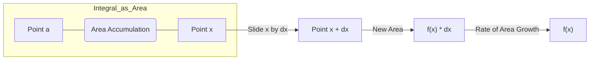

---
tags:
  - field/hard_science
  - subject/math
  - concept/calculus
---

[[T.O.C (Physical Science).md|Up to Physical Science]]

# Pure Mathematics
> **Seed:** "Prove the fundamental theorem of calculus"
> **Lens:** First Principles / The Feynman Razor

## 1. The Intuition First

The Fundamental Theorem of Calculus (FTC) is the bridge that connects the two main branches of calculus: **Differential Calculus** (finding slopes) and **Integral Calculus** (finding areas).

Imagine you are driving a car.
- **The Velocity (Differential):** This is your speedometer reading. It tells you how fast your position is changing at any single moment.
- **The Displacement (Integral):** This is the total distance you have traveled. It is the "accumulation" of all those moments of speed.

The FTC tells us that if you know how fast you're going (the derivative), you can find out how far you've gone (the integral). Conversely, the rate at which your total distance grows is exactly equal to your speed at that instant. It’s the ultimate "inverse operation" realization: adding up (integrating) and taking the rate of change (differentiating) are two sides of the same coin.

---

## 2. Formal Definition & Proof

The theorem is typically stated in two parts.

### Part 1: The Accumulation Function
If $f$ is continuous on $[a, b]$, then the function $g$ defined by:
$$
g(x) = \int_a^x f(t) \, dt \quad \text{for } a \leq x \leq b
$$
is continuous on $[a, b]$, differentiable on $(a, b)$, and its derivative is:
$$
g'(x) = f(x)
$$

**Proof:**
Using the limit definition of the derivative:
$$
g'(x) = \lim_{h \to 0} \frac{g(x+h) - g(x)}{h}
$$
Substituting the integral definition:
$$
g'(x) = \lim_{h \to 0} \frac{1}{h} \left[ \int_a^{x+h} f(t) \, dt - \int_a^x f(t) \, dt \right]
$$
By the properties of integrals:
$$
g'(x) = \lim_{h \to 0} \frac{1}{h} \int_x^{x+h} f(t) \, dt
$$
According to the **Mean Value Theorem for Integrals**, there exists a number $c$ in the interval $[x, x+h]$ such that:
$$
\int_x^{x+h} f(t) \, dt = f(c) \cdot h
$$
Substituting this back:
$$
g'(x) = \lim_{h \to 0} \frac{f(c) \cdot h}{h} = \lim_{h \to 0} f(c)
$$
As $h \to 0$, $x+h \to x$. Since $c$ is trapped between $x$ and $x+h$, $c$ must approach $x$. Because $f$ is continuous:
$$
\lim_{h \to 0} f(c) = f(x)
$$
Thus, $g'(x) = f(x)$.

### Part 2: The Evaluation Theorem
If $f$ is continuous on $[a, b]$, then:
$$
\int_a^b f(x) \, dx = F(b) - F(a)
$$
where $F$ is any antiderivative of $f$ (i.e., $F' = f$).

**Proof:**
Let $g(x) = \int_a^x f(t) \, dt$. From Part 1, we know $g'(x) = f(x)$.
If $F$ is any other antiderivative of $f$, then $F'(x) = f(x)$.
Since $g'(x) = F'(x)$, the functions $g$ and $F$ differ only by a constant $C$:
$$
g(x) = F(x) + C
$$
To find $C$, we evaluate at $x=a$:
$$
g(a) = \int_a^a f(t) \, dt = 0 \implies F(a) + C = 0 \implies C = -F(a)
$$
Therefore:
$$
g(x) = F(x) - F(a)
$$
Evaluating at $x=b$:
$$
g(b) = \int_a^b f(t) \, dt = F(b) - F(a)
$$

---

## 3. Worked Example

Calculate the area under the curve $f(x) = 3x^2 + 1$ from $x=1$ to $x=2$.

**Step 1: Identify the function and limits.**
$f(x) = 3x^2 + 1$, $a=1$, $b=2$.

**Step 2: Find the antiderivative $F(x)$.**
Using power rules:
$$
F(x) = \int (3x^2 + 1) \, dx = x^3 + x
$$
(We omit $+C$ because it cancels out in the definite integral calculation).

**Step 3: Apply FTC Part 2.**
$$
\int_1^2 (3x^2 + 1) \, dx = F(2) - F(1)
$$
$$
F(2) = (2)^3 + (2) = 8 + 2 = 10
$$
$$
F(1) = (1)^3 + (1) = 1 + 1 = 2
$$

**Step 4: Compute the final value.**
$$
10 - 2 = 8
$$

**Final Answer:**
$$
\boxed{8}
$$

---

## 4. Visual Representation

**Geometric Interpretation:**
Imagine the graph of a positive function $f$. $g(x)$ is the shaded area under the curve from $a$ to $x$. If you nudge $x$ to the right by a tiny amount $\Delta x$, you add a tiny sliver of area. This sliver is roughly a rectangle with width $\Delta x$ and height $f(x)$.
$$
\text{Change in Area} \approx f(x) \cdot \Delta x
$$
$$
\frac{\Delta \text{Area}}{\Delta x} \approx f(x)
$$
As $\Delta x \to 0$, the approximation becomes perfect, showing that the "speed" at which the area grows is just the height of the function.

---

## 5. Connections & Applications

- **Physics:** Calculating **Work**. Work is the integral of force over displacement ($W = \int F \, ds$). If you know the power function, you can find total energy used.
- **Computer Science:** **Integral Images** (Summed-Area Tables) in Computer Vision. This technique uses the logic of FTC to calculate the sum of pixels in any rectangular sub-region in $O(1)$ time after a single $O(N)$ pass.
- **Probability:** The **Cumulative Distribution Function (CDF)** is the integral of the Probability Density Function (PDF). The PDF is the derivative of the CDF.

---

## 6. Common Pitfalls

1.  **Ignoring Continuity:** The FTC *requires* $f$ to be continuous on the interval. If there is a jump or an asymptote (like $\int_{-1}^1 \frac{1}{x^2} \, dx$), applying Part 2 blindly will yield a mathematically incorrect answer.
2.  **Variable Confusion:** In $g(x) = \int_a^x f(t) \, dt$, $x$ is the boundary, and $t$ is the "dummy" variable of integration. Avoid writing $\int_a^x f(x) \, dx$, as the limit of integration cannot be the variable being integrated.
3.  **The Chain Rule Trap:** If the upper limit is a function, e.g., $\int_a^{x^2} f(t) \, dt$, you must use the chain rule when differentiating: $\frac{d}{dx} [...] = f(x^2) \cdot 2x$.