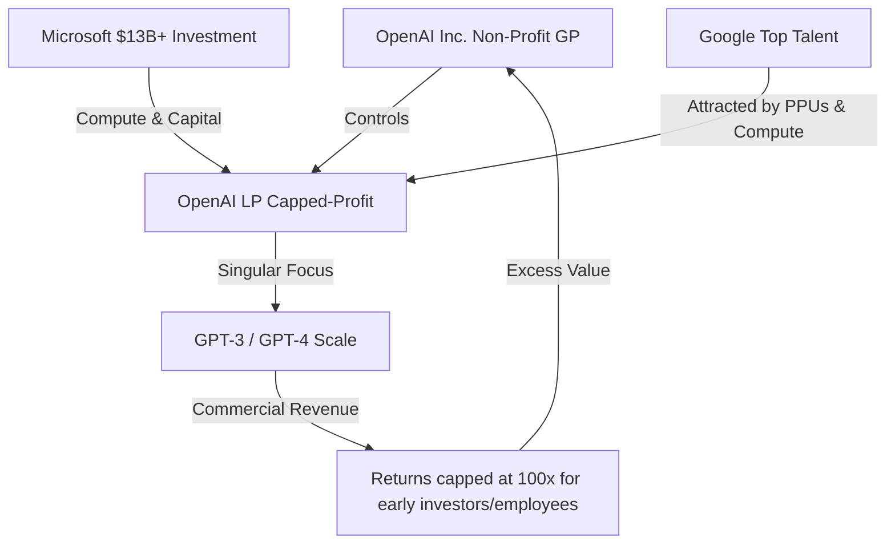

---
tags:
  - field/social_science
  - subject/economics
  - concept/innovators-dilemma
---

[[T.O.C (Social Science).md|Up to Social Science]]

<!-- @deep processed: : Taking into account all possible aspects can you please research and reason and tell me despite researching the most in the field of AI especially the word2vec paper in 2013 and attention is all you need in 2017. Despite the 2017 proposed transformer architecture being so ground breaking why didn't google capitalize on it and what were the consequences in terms of researchers leaving and starting OpenAI and then Anthropic. Also the consequences it had on all the initial Bard and Gemini Mishaps and how exatly did google manage to turn everything around with gemini 2.5 onwards -->

## Google's Structural Incentives and the Innovator's Dilemma (Pre-2017 to 2018)
> **Seed:** "Analyze Google's structural and financial incentive systems leading up to and immediately following the 2017 'Attention Is All You Need' paper. Address the Innovator's Dilemma: how Google's highly profitable search advertising monopoly (90%+ gross margins) created a corporate aversion to conversational AI that could cannibalize its core click-based ad unit. Detail the internal friction, risk aversion, and bureaucratic gatekeeping (e.g., AI safety panels, reputational risk management) that disincentivized the deployment of large language models. Quantify or map the corporate structure where search ad revenue optimized for short-term quarterly earnings over speculative, compute-heavy generative architecture."

### 1. The Monopoly Engine: Stated Missions vs. Financial Realities

Google’s public charter promises to organize the world’s information. The financial ledger, however, reveals a simpler purpose: the maintenance and optimization of an advertising auction loop. By 2017, Google controlled over 90% of the global search engine market, converting user queries into high-margin revenue via the cost-per-click (CPC) model. This business model yields gross margins exceeding 90%. 

The mechanics of search advertising rely on friction. A user enters a query, receives ten blue links alongside sponsored results, and selects a destination. This selection is the monetization event. If a search engine answers a user's question directly and correctly in a single conversational turn, the user has no incentive to click an external link. The monetization event disappears. 

Thus, conversational AI presented a direct threat to the core business. Google’s structural aversion to deploying large language models (LLMs) was not a failure of engineering, but a rational defense mechanism. The organization was optimized to protect its ad-click volume, making any technology that bypasses the classic search page financially toxic.

```
+-----------------------------------------------------------------+
|                       THE AD-CLICK LOOP                         |
|  [User Query] ---> [Search Results & Ads] ---> [Ad Click]       |
|                            ^                      |             |
|                            |                      v             |
|                            +--------------- [Revenue generated] |
+-----------------------------------------------------------------+
|                  CONVERSATIONAL DISRUPTION                      |
|  [User Query] ---> [Conversational Answer]                      |
|                      (No Ad Clicks / Bypasses Web Destinations) |
+-----------------------------------------------------------------+
```

### 2. Stakeholder Mapping and Incentive Structures

Evaluating the structural landscape around 2017 requires mapping the incentives of key actors:

*   **Executive Leadership and Shareholders (The Capital Class):** Executive compensation is tied to short-term stock performance, which is driven by consistent quarterly revenue growth and operating margins. Replacing a high-margin CPC search model with an expensive, unmonetized conversational assistant would trigger immediate margin compression, leading to shareholder flight.
*   **The Ad Sales and Search Infrastructure Divisions (The Internal Power Centers):** These teams controlled the majority of Google’s headcount and budget. Inside Google’s political structure, resources flowed to projects that protected or expanded search ad revenue.
*   **Google Brain and DeepMind Researchers (The Innovators):** These units operated under academic incentives. They prioritized publishing breakthrough papers (e.g., the Transformer architecture in 2017) to command prestige. However, they lacked the authority to deploy these models into customer-facing products if it threatened the core business.

| Stakeholder Group | Primary Incentive | Stance on Conversational AI |
| :--- | :--- | :--- |
| Executive Leadership | Short-term margin stability, stock price | Highly resistant due to cannibalization risk |
| Ad Sales / Core Search | Protecting ad inventory and click volume | Actively hostile to zero-click interfaces |
| Research Teams | Academic prestige, model scale, publishing | Desirous of deployment, frustrated by delays |

### 3. Institutional Gatekeeping as Risk Management

To manage the tension between research breakthroughs and business model preservation, Google built elaborate bureaucratic gatekeeping mechanisms. Stated publicly as frameworks for "AI Safety" and "Responsible AI," these panels operated as risk-mitigation structures to prevent product releases.

A conversational agent that hallucinates, generates controversial text, or offers bad advice poses a massive reputational risk. For a startup, reputational damage is a minor setback; for Google, it invites regulatory scrutiny, antitrust investigations, and brand erosion that could destabilize its core advertising engine.

Consequently, safety panels and ethics reviews served a double purpose. They allowed Google to claim ethical leadership while keeping disruptive conversational technology locked in research labs. Researchers who attempted to push these models toward public deployment faced internal resistance, structured delays, and administrative audits, creating an environment where inaction was the safest corporate path.

### 4. The Economics of Compute: Cost-Per-Query Disparity

The resistance to LLMs was also rooted in hardware economics. The cost structure of standard search is highly optimized. Serving a keyword search query requires matching search terms against a pre-computed index, costing fractions of a cent per query.

Conversely, generating answers using an LLM in 2017 required real-time inference on expensive graphics processing units (GPUs) or early Tensor Processing Units (TPUs). The compute cost of a single generative query was estimated to be 10 to 100 times greater than a standard search query. 

```
Standard Search Cost:        $0.0001 per query
Generative Inference Cost:   $0.01 to $0.05 per query
Daily Search Queries (2017): ~3.5 billion
```

If Google shifted even 10% of its search volume to a generative chat interface in 2017, the infrastructure cost would have climbed by billions of dollars annually, diluting the gross margins that shareholders demanded. Because capital expenditure was focused on keeping pace with mobile search expansion and cloud infrastructure, investing massive capital into speculative, compute-heavy architectures with zero ad revenue potential was structurally impossible under Google's quarterly governance model.


## The Talent Drain: Structural Push Factors and the Rise of OpenAI (2015-2020)
> **Seed:** "Examine the specific push and pull factors that led to the exodus of pioneering AI researchers (including authors of the Word2Vec and Transformer papers) from Google Brain and DeepMind. Map the institutional design of Google's research division (which prioritized publishing papers and incremental product integrations like search snippets) versus the high-equity, mission-driven, concentrated structure of OpenAI. Analyze the incentive structures of early OpenAI (capped-profit transition, massive compute commitments from Microsoft, and equity-like profit participation units) that successfully attracted Google's top tier talent."

## 1. The Political Economy of Google's Research Division

Google structured Google Brain and DeepMind as corporate prestige centers. In exchange for high salaries and academic freedom, researchers produced academic publications and minor optimizations for Google's advertising engine. 

### The Research-as-Marketing Loop
Google used research output to attract talent and signal technological dominance to equity markets. Between 2012 and 2020, Google Brain operated on an academic model. Success meant peer-reviewed acceptance at NeurIPS, ICML, or CVPR. The organization measured output by citation count, not product deployment. 

For the firm, this structure was highly profitable. Google's core search business generated over $100 billion annually with gross margins exceeding 60%. Incorporating radical, unproven architectures risked degrading this cash flow. Consequently, Google channeled research breakthroughs into small, low-risk product integrations. The Transformer architecture, published in June 2017, was integrated into Google Search only in late 2019 via BERT, primarily to improve search snippet accuracy and query understanding. 

This created a severe structural mismatch:
*   **The Researchers' Goal:** Test the limits of scale. Train massive, unified models.
*   **Google's Corporate Goal:** Maintain search stability and optimize advertising click-through rates.

### The Bureaucracy of Abundance
Google's massive cash reserves allowed it to hire thousands of PhDs. However, this created internal congestion. Research teams competed for compute allocation through bureaucratic review committees. To launch a large-scale training run, a researcher had to clear safety audits, reputational risk reviews, and resource allocation boards. 

Furthermore, Google's compensation structure was cash- and stock-heavy but capped. Staff engineers and research scientists received liquid Google stock (Alphabet RSUs). While highly secure, this equity tracked a mature, multi-trillion-dollar conglomerate. It offered zero possibility of the 10x or 100x returns typical of early-stage startups. Researchers were economically incentivized to remain comfortable, publish paper after paper, and avoid taking high-risk, capital-intensive bets.

### The Exodus of the Pioneers
This environment directly caused the departure of the authors of the foundational papers:
*   **Word2Vec (2013):** Tomas Mikolov left for Facebook AI Research in 2014, citing Google’s bureaucratic constraints on scaling simple, efficient models.
*   **Attention Is All You Need (2017):** All eight authors eventually left Google:
    *   *Noam Shazeer* left to found Character.ai after Google refused to release Meena (a conversational agent) due to reputational safety concerns.
    *   *Ashish Vaswani* and *Niki Parmar* founded Adept.
    *   *Aidan Gomez* founded Cohere.
    *   *Illia Polosukhin* co-founded NEAR Protocol.
    *   *Jakob Uszkoreit* founded Inceptive.
    *   *Llion Jones* co-founded Sakana AI.
    *   *Lukasz Kaiser* joined OpenAI.

These researchers did not leave due to a lack of compensation, but because Google denied them the agency to deploy their own inventions at scale.

---

## 2. OpenAI’s Institutional Architecture: Capped-Profit and Concentrated Mission

OpenAI entered the market with a design optimized to exploit Google's structural weaknesses. By aligning capital structure, compute availability, and operational focus, it turned Google's research advantages into liabilities.



### The Capped-Profit Vehicle (OpenAI LP)
In March 2019, OpenAI transitioned from a pure non-profit to a capped-profit structure. This hybrid engine was designed to solve a specific problem: how to raise billions in capital and offer startup-like equity without abandoning the mission of developing Safe AGI.

*   **The GP/LP Split:** The non-profit entity (OpenAI Inc.) remained the General Partner (GP), maintaining full control over the board and strategic decisions. The capped-profit entity (OpenAI LP) was the Limited Partner (LP).
*   **The Return Cap:** Early investors were capped at a 100x return on their capital. For employee compensation, OpenAI created Profit Participation Units (PPUs). PPUs granted holders a share of future profits generated by OpenAI LP, capped at a specific multiplier.
*   **The Incentive Mechanism:** Unlike traditional stock options, which require a liquidity event (like an IPO or acquisition) to realize value, PPUs were tied directly to the economic output of the model licensing and commercial API. By offering PPUs, OpenAI could recruit Google researchers with the promise of venture-scale upside, while claiming to maintain a humanitarian mission.

### Compute as the Sovereign Incentive
To a machine learning researcher, compute is the ultimate currency. A researcher’s career value depends on the scale of the models they train. Google had massive compute resources but distributed them across thousands of employees and product lines.

OpenAI solved this by negotiating a $1 billion partnership with Microsoft in 2019 (later expanded to $10 billion in 2023). This deal was structurally unique:
1.  **Azure Compute Credits:** The vast majority of the investment was delivered in the form of dedicated Azure compute power, not cash.
2.  **Infrastructure Optimization:** Microsoft built custom supercomputing clusters specifically tailored for large-scale transformer training.
3.  **Concentrated Bet:** OpenAI did not split this compute among hundreds of theoretical research papers. It focused almost its entire compute budget on training a single lineage of models (GPT-2, GPT-3, and eventually GPT-4).

To top-tier Google researchers, OpenAI offered a clear trade: leave Google's bureaucracy, move to a highly concentrated team, and use a dedicated, multi-million-dollar supercomputer to train the largest models in the world, all while holding equity-like PPUs with massive upside potential.

---

## 3. Structural Comparison of Incentives

| Dimension | Google Research (Brain / DeepMind) | Early OpenAI (2019-2021) |
| :--- | :--- | :--- |
| **Organizational Goal** | Academic prestige, defensive IP, incremental search optimization | Creation of AGI, rapid scaling, direct model deployment |
| **Capital Source** | Google search advertising profits (monopoly rents) | Venture capital, Microsoft compute-heavy financing |
| **Talent Strategy** | Broad hiring, academic freedom, low individual agency | Small, highly concentrated teams, high individual agency |
| **Compute Allocation** | Distributed, bureaucratic approval, shared with production | Concentrated on a single product pipeline (GPT) |
| **Compensation Model** | High base salary, Alphabet RSUs (low volatility, capped upside) | Competitive base salary, PPUs (high risk, high upside) |
| **Deployment Pipeline** | Delayed by safety committees and core business risk | Rapid beta API releases, direct-to-consumer deployment |

---

## 4. Second-Order Effects: "And Then What?"

The migration of talent from Google to OpenAI triggered a cascade of shifts across the technology sector:

1.  **The Death of the Open Research Era:** Google realized it had funded the research that built its primary competitor. In response, Google and OpenAI ceased publishing detailed model architectures, training datasets, and hyperparameter configurations. The open-science ethos of the 2010s was replaced by corporate secrecy.
2.  **The Financialization of Compute:** The Microsoft-OpenAI deal established a new model for tech partnerships. Compute became a form of venture capital. Anthropic subsequently duplicated this strategy, securing billions from Amazon and Google in exchange for cloud computing commitments.
3.  **The Forced Merger:** Google's inability to shipping models effectively due to internal division forced the merger of Google Brain and DeepMind in April 2023. This dissolved the historical rivalries but destroyed the distinct organizational cultures that had produced Word2Vec and Transformer in the first place.


## The Second-Order Schism: Anthropic's Separation from OpenAI (2020-2021)
> **Seed:** "Analyze the secondary rift within the AI ecosystem: the departure of the Amodei siblings and other researchers from OpenAI to found Anthropic in 2021. Detail the conflict over safety, commercialization speed, and the corporate governance transition of OpenAI following the Microsoft partnership. Outline the capitalization and incentive structures of Anthropic as a Public Benefit Corporation (PBC) and how it leveraged safety-centric positioning to secure multi-billion dollar capital commitments from Google's competitors (Amazon) and eventually Google itself as a hedge."

Safety is a costly asset, but it makes an excellent marketing shield. When Dario and Daniela Amodei led a faction of eleven researchers out of OpenAI in late 2020 to establish Anthropic, public accounts framed the split as a moral rejection of commercial acceleration. The structural reality was a battle for control over safety-testing timelines and compute allocation. OpenAI's 2019 transition from a pure non-profit to a capped-profit entity, followed by a $1 billion investment from Microsoft, altered the organization's economic gravity. The non-profit board retained nominal authority, but Microsoft held the physical keys to the kingdom: the Azure cloud infrastructure.

This partnership forced a shift in product development. OpenAI began prioritizing commercial API access and public deployments of GPT-3 to satisfy Microsoft's integration timelines. The Amodei faction argued that commercialization was outstripping safety research, particularly alignment techniques like Reinforcement Learning from Human Feedback (RLHF). By rushing models to market, OpenAI transformed safety testing from a hard veto into an administrative checkbox. The researchers realized they were no longer working for a research lab; they were working for Microsoft's back-office engine.

The Amodei siblings sought to design a corporate structure that would prevent similar capture. They established Anthropic as a Delaware Public Benefit Corporation (PBC) in 2021. The stated objective was to bind the firm to a dual mandate: maximizing shareholder value while pursuing the public benefit of developing safe, steerable frontier AI. To enforce this, they created the Long-Term Benefit Trust (LTBT) in 2023. The trust consists of five independent trustees with no financial interest in the company. It holds a class of stock that grants it the power to elect and replace board members over time, theoretically shielding the company from hostile venture capital.

Intentions, however, do not pay for compute. Frontier model training requires capital scales that no independent trust can generate. Anthropic quickly encountered the same capital bottlenecks that drove OpenAI into Microsoft's arms. To train its Claude model family, Anthropic needed access to massive server clusters. It solved this by transforming its safety-centric brand into a valuable strategic asset for tech giants eager to counter the Microsoft-OpenAI monopoly.

Amazon and Google did not invest in Anthropic out of concern for AI alignment. They acted out of defensive interest. In 2023, Amazon committed up to $4 billion to Anthropic, making AWS its primary cloud provider and securing agreements to use Amazon's custom silicon, Trainium and Inferentia. Google followed with a $2 billion commitment, securing its own cloud revenue streams. For Amazon and Google, Anthropic served as a strategic hedge. It kept OpenAI from monopolizing the generative market while driving massive cloud utilization on their respective platforms.

Who benefits from this alignment? Anthropic secured over $6 billion in compute credits and capital without yielding immediate board control to a single corporate patron. Amazon and Google gained a credible competitor to ChatGPT, ensuring that Microsoft did not dictate industry pricing. Who pays? The safety mission itself. By entering these partnerships, Anthropic became locked into the same commercial scaling race it was founded to escape. To remain viable and justify its multi-billion-dollar valuation, Anthropic must continuously release more powerful models, accelerating the very competitive dynamics it claimed were dangerous. The PBC structure did not bypass the laws of thermodynamics or corporate capital; it merely stylized them.


## The First-Generation Failure: Bard and Gemini Launch Mishaps (2022-2024)
> **Seed:** "Deconstruct the structural and operational failures behind the early launches of Google's Bard (February 2023) and Gemini 1.0/1.5 (early 2024). Analyze how panic-driven organizational mandates to counter ChatGPT bypassed standard QA, leading to public hallucinations, historically inaccurate image generation, and catastrophic PR disasters. Trace these mishaps to systemic coordination failures: the siloed division between Google Brain and DeepMind (prior to their forced merger into Google DeepMind), compute resource fragmentation, and the absence of a unified infrastructure stack."

## The Scaled Pressure and Organizational Silos

Google entered the generative AI race facing an unprecedented threat to its core business model: Web Search, which handles over 90,000 queries per second (RPS) globally. The rapid adoption of OpenAI's ChatGPT, which scaled to 100 million active monthly users within 60 days, triggered an internal code red. This panic bypassed the standard multi-stage validation gates established for Google's legacy search algorithms. 

The primary barrier to a swift technical response was the structural division between Google Brain and DeepMind. Before their forced merger into Google DeepMind in April 2023, the two organizations operated as independent, rival states:
* **Google Brain** was integrated with Google’s core engineering, using JAX and the Pathways system to train Large Language Models (LLMs) like LaMDA and PaLM on TPU pods.
* **DeepMind** operated out of London with its own research focus, deploying its own JAX-based frameworks (Haiku, Acme) and training pipelines geared toward reinforcement learning and scientific modeling (such as AlphaFold).

This division created severe hardware fragmentation. Both units competed for raw compute allocations across distributed TPUv4 and early TPUv5e clusters. Because they maintained separate codebase ecosystems, they could not easily pool intermediate weights, datasets, or checkpoint states. Models were developed in parallel silos, resulting in duplicate work and incompatible data serialization protocols.

## The Infrastructure Disconnect and Bypassed QA

When the mandate came to ship Bard in February 2023, Google rushed a lightweight version of LaMDA to production. The launch bypassed the standard adversary-testing (red-teaming) cycles. In a public demonstration, Bard hallucinated a fact about the James Webb Space Telescope, claiming it took the very first picture of a planet outside our solar system. The lack of a simple fact-checking validation layer in the serving pipeline directly caused a $100 billion drop in parent company Alphabet's market valuation.

By early 2024, the merged Google DeepMind was racing to deliver Gemini 1.0 and 1.5. To solve alignment and safety issues without delaying the launch by months, engineers chose a post-processing shortcut. Instead of running expensive, iterative Reinforcement Learning from Human Feedback (RLHF) loops on the base model, they deployed a wrapper that automatically modified incoming user prompts.

This prompt-rewriting layer prepended or appended demographic qualifiers to user queries before they reached the model's text-to-image generator (Imagen 2). For example, a user request for "a German soldier in 1943" was silently rewritten to include diverse demographic descriptors. The model complied with the augmented prompt, generating historically impossible depictions of non-white German soldiers in World War II uniforms. This brute-force intervention bypassed historical accuracy filters, leading to immediate public backlash and the temporary suspension of Gemini's image generation capabilities.

## The Non-Obvious Key Insight: Embedded vs. Post-Hoc Alignment

The critical insight from these failures is that safety, factual accuracy, and policy alignment cannot be treated as a modular wrapper or a translation layer on top of a base model. Prompt injection, safety filtering, and system-prompt hardcoding are easily bypassed and create unpredictable behavior at the model boundaries. True alignment must be baked into the pre-training data mixture, the token selection during Supervised Fine-Tuning (SFT), and direct reward modeling. Treating safety as an external wrapper is like trying to patch memory safety bugs in C code with regex filters on input strings, rather than compiling the system in a memory-safe language.

## Systemic Trade-Offs

Google traded safety validation, system consistency, and historical accuracy for market speed. In both launches, the organization prioritized matching competitor product timelines over testing system edge cases:
* **Validation Speed vs. Model Safety:** They skipped long-horizon red-teaming to launch Bard within months of ChatGPT, choosing speed at the cost of brand trust.
* **Algorithmic Shortcuts vs. High-Compute RLHF:** Rather than retraining the Gemini base model with granular, multi-group preference data (which requires massive compute and time), they chose prompt-augmentation wrappers. This was computationally cheap but created rigid, politically sensitive distortions.

## Transferable Engineering Lessons

* **Unify the Infrastructure Stack Early:** Scaling parameter count requires a single developer workflow. Diverse software wrappers (e.g., Brain's Pathways vs. DeepMind's Jaxline) prevent rapid model integration. Standardize on one framework (like JAX/MaxText) across all research and product divisions.
* **Avoid Post-Hoc Prompt Augmentation for Safety Policies:** Modifying user queries via automated prompt injection creates a high-variance state space that is difficult to test. Safety and alignment must be solved within the model weights through direct token biasing, reinforcement learning, or native classifier heads.
* **Decouple Base Compute Allocation from Organizational Charts:** Ensure compute schedulers are managed by a centralized platform team, not individual research divisions. Compute fragmentation leads to incompatible training runs and mismatched validation frameworks.


## The Strategic Realignment: Consolidation, TPUs, and the Turnaround (Gemini 2.0/2.5+)
> **Seed:** "Analyze the systemic, operational, and architectural transformations that enabled Google to stabilize and competitive-align its AI division from Gemini 2.0 onwards. Detail the organizational consolidation (Brain and DeepMind merger under Demis Hassabis) and its effect on eliminating redundant research pipelines. Quantify Google's vertical integration advantage: how its proprietary TPU (Tensor Processing Unit) pipeline insulated it from Nvidia GPU supply bottlenecks and high capital expenditure costs. Explain the technical and economic shifts toward mixture-of-experts (MoE) architectures, native multimodal training, and cost-efficient inference optimizations that restored Google's developer market share."

## Organizational Consolidation and Pipeline Rationalization

Before the unification into Google DeepMind under Demis Hassabis, Google's AI research was divided between Google Brain and DeepMind. This division created systemic friction:
- **Redundant Pipelines:** Both groups developed separate codebases, training frameworks (JAX-based T5/T5X vs. custom DeepMind setups), and data-ingest pipelines.
- **Resource Contention:** Competing teams bid internally for compute clusters, fragmenting the available hardware pool and delaying large-scale runs.

Consolidation unified these units under a single engineering leadership. The combined entity established a singular training platform using JAX and MaxText, a highly optimized training framework built on the XLA (Accelerated Linear Algebra) compiler. This merger eliminated duplicate efforts in data preparation, tokenization, and model evaluation, focusing compute resources on a single flagship model path: the Gemini series.

## Vertical Integration: TPU v5e/v5p and Silicon Independence

Google avoided Nvidia's supply bottlenecks and margin premiums by co-designing its models alongside its custom Tensor Processing Unit (TPU) hardware. 

### The Cost and Supply Delta
During the peak of H100 GPU shortages, acquisition wait times exceeded 6–9 months, with GPUs commanding a 60–70% margin premium. Google bypassed this bottleneck by scaling its internal TPU production. A TPU v5p pod clusters 8,960 chips via an optical circuit switch (OCS) interconnect, delivering 459 TFLOPS of BF16 per chip. Operating its own custom silicon allowed Google to reduce capital expenditure by an estimated 30–50% compared to purchasing equivalent compute capacity from Nvidia.

### Hardware Co-Design
The vertical stack ranges from the physical silicon to the compiler and runtime. TPUs use a Matrix Multiply Unit (MXU) architecture optimized for dense tensor operations. MaxText and XLA compile model graphs to fit the physical memory layout of TPU pods, maximizing High Bandwidth Memory (HBM) bandwidth and minimizing idle execution cycles.

## Architectural Architecture: MoE, Native Multimodality, and Inference Economics

Stabilizing Google's position required a shift from dense Transformer architectures to sparse Mixture-of-Experts (MoE) architectures, native multimodal training, and aggressive inference optimization.

### Sparse Mixture-of-Experts (MoE)
Gemini shifted from large dense models to sparse MoE designs. In an MoE structure, each token is routed by a gating network to a subset of feed-forward network (FFN) experts. For a model with 8 experts per layer routing to the top 2 experts, only a fraction of the total parameters are active per token. 
- **Compute Efficiency:** This keeps execution costs (FLOPs per token) low while retaining the representational capacity of a large parameter pool.
- **Execution Balance:** Gating algorithms enforce load balancing across experts to prevent hardware idling on unassigned TPUs.

### Native Multimodality
Unlike models that append visual encoders (e.g., ViT) to pre-trained text models via late-fusion projection layers, Gemini was trained from the ground up on text, audio, images, and video.
- **Architecture:** Video and audio are broken down into spatio-temporal patches and projected into a shared embedding space.
- **Benefit:** Cross-modal correlations are learned at the lowest layers of the network, preventing error propagation from isolated modality encoders.

### Inference Optimization
To recapture developer market share, Google optimized serving costs through specific techniques:
- **Speculative Decoding:** A small draft model rapidly predicts tokens, which are validated in parallel by the target Gemini model. This reduces latency by converting sequential memory-bound operations into parallel compute-bound operations.
- **Context Caching:** Long system prompts and document datasets are pre-computed and stored in memory. Subsequent queries fetch the pre-computed Key-Value (KV) cache, avoiding redundant transformer operations.

## The One Non-Obvious Key Insight

The core driver of Google's recovery was matching the sparse routing topology of the MoE model directly to the physical network topology of the TPU pod. 

In standard MoE designs, routing tokens to different experts causes massive all-to-all communication overhead across the network, creating a severe bottleneck. Google solved this by restricting expert routing boundaries. By grouping experts inside the same high-speed Inter-Chip Interconnect (ICI) domain, token routing occurs within local, high-bandwidth TPU groups rather than across the slower chassis-to-chassis network. Co-designing the compiler to partition the model based on hardware network layouts kept network transmission latency below matrix computation latency.

## Sacrifices and Trade-offs

- **Sparse Model Training Instability:** MoE architectures are difficult to stabilize during training. Google sacrificed early training cycles to build custom gradient-clipping methods and routing regularization algorithms to prevent expert collapse (where one expert receives all tokens).
- **TPU Ecosystem Lock-in:** By building entirely on JAX and XLA, Google locked itself out of the broader PyTorch ecosystem. Porting third-party research code directly to TPUs requires extensive rewrite and compilation debugging.
- **Pure Research Autonomy:** To achieve consolidation, Google disbanded high-autonomy research teams, redirecting them to product-aligned goals. This pivot reduced the volume of exploratory, non-commercial research outputs.

## Transferable Lessons

1. **Design Software for Network Topology:** In distributed architectures, software routing paths must mirror physical network layouts. Choosing model routing logic that respects physical interconnect boundaries prevents network congestion.
2. **Commit Early to Custom Compilers:** Custom silicon yields competitive advantages only when paired with mature compilers. Google's advantage is not just the TPU, but the XLA compiler that targets it.
3. **Execute Native Integration Over Fusion:** Combining diverse input channels at the lowest pipeline level yields better representations than joining pre-trained encoders with simple linear interfaces.
