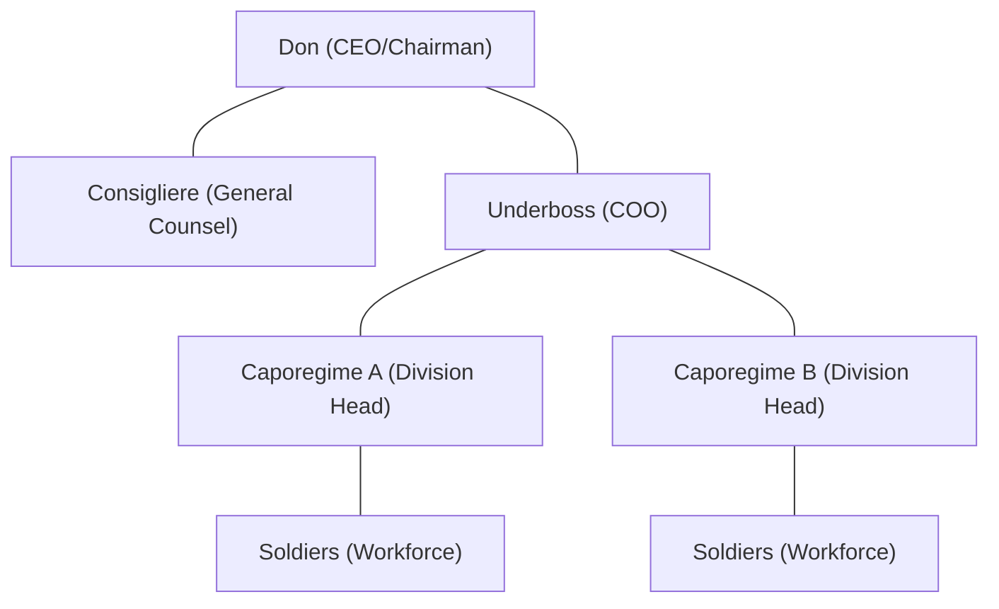

[[T.O.C (Finance_Economics)|Up to Finance_Economics]]

> **Seed:** "Analyze the Corleone family as a business organization. Map their structure to a modern corporate hierarchy. What are their revenue streams (olive oil imports, gambling, political corruption)? How does the concept of "favors" function as a form of social capital and debt economics? Apply game theory to the Five Families conflict -- was the war with Sollozzo a Nash equilibrium problem?"

# The Corleone Family: An Organizational and Economic Analysis

The Corleone Family, as depicted in Mario Puzo's *The Godfather*, functions not merely as a criminal gang but as a sophisticated, vertically integrated conglomerate. By applying modern corporate theory, debt economics, and game theory, we can deconstruct the "Family" into a rational business entity operating in an extra-legal market.

---

## 1. Corporate Hierarchy Mapping

In a modern context, the Corleone Family operates as a **Decentralized Holding Company** with a lean executive core and autonomous regional "subsidiaries."

### Executive Leadership (The Administration)
- **The Don (CEO/Chairman):** Vito (and later Michael) Corleone. Responsible for long-term strategy, high-level political "mergers" (corruption), and capital allocation. The Don holds final veto power and sets the "corporate culture" (the code of Omertà).
- **The Consigliere (General Counsel & Chief Strategy Officer):** Tom Hagen. A non-line officer who provides legal advice, manages political assets, and mediates internal disputes. He is the only executive without a direct "command" over the workforce, ensuring his advice remains objective.
- **The Underboss (COO):** Sonny Corleone. Responsible for day-to-day operations and "enforcement" (security/logistics). He manages the transition from strategy to execution.

### Middle Management (The Caporegimes)
- **Caporegimes (Regional VPs / Division Heads):** Clemenza and Tessio. They manage distinct "territories" or business units. They are responsible for revenue generation, recruitment, and maintaining the "workforce" (Soldiers). They operate with significant autonomy but pay a "tax" (tribute) to the parent company.

### The Workforce (Soldiers)
- **Soldiers (Account Managers / Field Operatives):** The frontline employees who execute the specific revenue-generating tasks (protection, gambling, enforcement).

---

## 2. Revenue Streams & Portfolio Diversification

The Corleone "firm" maintains a diversified portfolio to hedge against regulatory risk (law enforcement) and market volatility.

| Business Unit | Category | Margin | Risk Profile | Role in Portfolio |
| :--- | :--- | :--- | :--- | :--- |
| **Genco Pura Oil Co.** | Legal Front | Low | Minimal | Cash laundering; logistical cover; visa/residency sponsorship. |
| **Gambling/Policy** | Illegal Service | High | Moderate | Primary cash cow; steady "recurring" revenue from working class. |
| **Political Corruption** | Intangible Asset | N/A | High | "The Moat": Protects all other streams from competition and regulation. |
| **Union Racketeering** | B2B Services | Medium | Moderate | Provides leverage over infrastructure (docks, construction). |

**The Sollozzo Pivot:** The conflict arises when Sollozzo offers a new "product line" (Narcotics). Vito Corleone rejects it not on moral grounds, but as a **risk-management decision**. He realizes that "white-collar" assets (judges, politicians) who tolerate gambling will not tolerate heroin, potentially destroying the Family's political "moat."

---

## 3. The Economics of "Favors": Social Capital as Debt

The Corleone Family operates on a **Relationship-Based Economy**. In this system, "favors" are not gifts; they are **unsecured debt instruments** with the following characteristics:

1.  **Infinite Maturity:** A debt incurred today (e.g., the undertaker Bonasera) may not be called in for years.
2.  **Variable Interest:** The "repayment" is often far more valuable than the original favor. A small legal intervention today might be repaid with a life-saving "service" tomorrow.
3.  **Non-Monetary Currency:** In an environment where the state is unreliable, *loyalty* is the most liquid asset. By performing favors for the disenfranchised (immigrants, small business owners), Vito Corleone builds a "Social Capital Bank."
4.  **Enforcement:** Unlike bank loans, these debts are enforced through social ostracization or physical violence, making the "default rate" nearly zero.

---

## 4. Game Theory & The Five Families Conflict

The war with Sollozzo and the Tattaglias can be analyzed through **Non-Cooperative Game Theory**, specifically the **Nash Equilibrium**.

### The Initial State: Collusive Equilibrium
Before Sollozzo, the Five Families existed in a "Collusive Equilibrium." They agreed on territories to avoid the high costs of "warfare" (lost revenue, police heat). This was a stable state where no family could improve its position by attacking another without incurring a net loss.

### The Sollozzo Disruptor: Breaking the Equilibrium
Sollozzo introduces a "First-Mover Advantage." By attempting to assassinate Vito Corleone, he seeks to forcibly shift the equilibrium to a state where the Corleones are marginalized and the narcotics trade is centralized.

### The Nash Equilibrium Problem
Was the war a Nash Equilibrium problem? **Yes.**
- A Nash Equilibrium occurs when no player can benefit by changing their strategy while the others keep theirs unchanged.
- When the Corleones refused the drug trade, they made themselves a target. Once the first shot was fired, the "Peaceful Coexistence" strategy was no longer viable for any player.
- **The Prisoners' Dilemma:** Each family faced a choice: *Cooperate* (stay out of the war) or *Defect* (join the Tattaglias to grab Corleone territory). Because they couldn't trust each other, the rational choice for the other families was to defect, leading to a bloody, multi-family conflict—a "Suboptimal Equilibrium" where everyone loses money and men.

### Michael’s Final Solution: The Reset
Michael Corleone ends the game by **eliminating the other players**. In game theory terms, he changes the game from a *Repeated Game* (where you have to worry about future retaliation) to a *Single-Round Game* where he achieves a "Total Win" by wiping out the competition's leadership simultaneously. By removing the other "rational actors," he establishes a new, Corleone-centric monopoly.

---

## Summary of Findings
The Corleone Family succeeded because it treated crime with the discipline of a boardroom. Its "social capital" economy provided a resilient base of support that competitors (who focused purely on transactional violence) lacked. Ultimately, the transition from Vito to Michael represents a shift from a **Human-Centric Firm** (built on relationships) to a **Technocratic Firm** (built on cold efficiency and absolute dominance).
